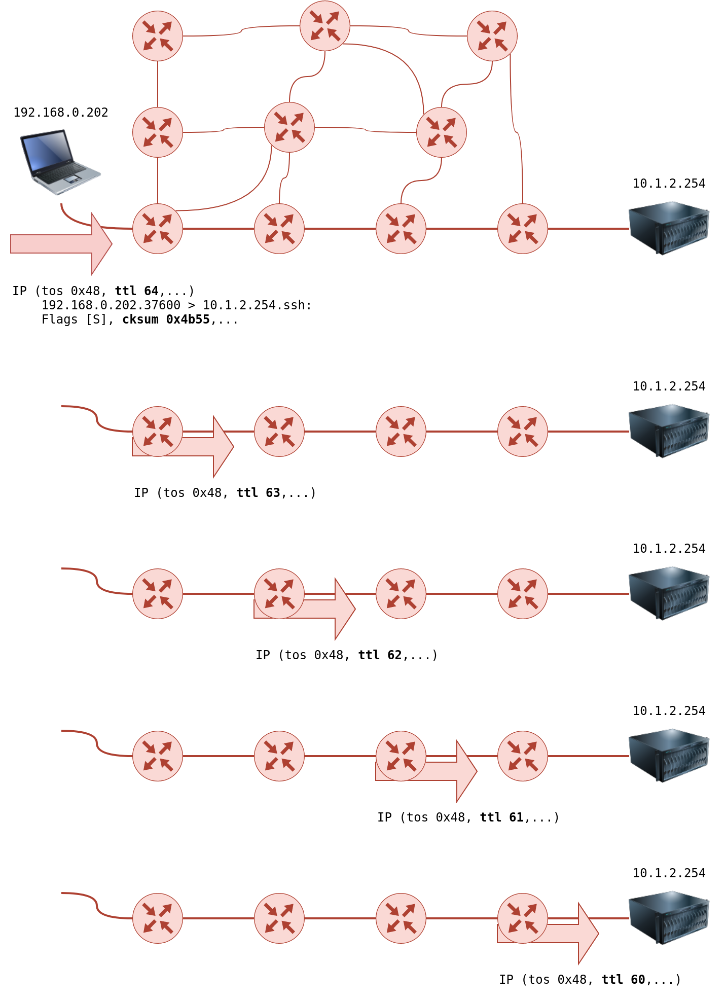
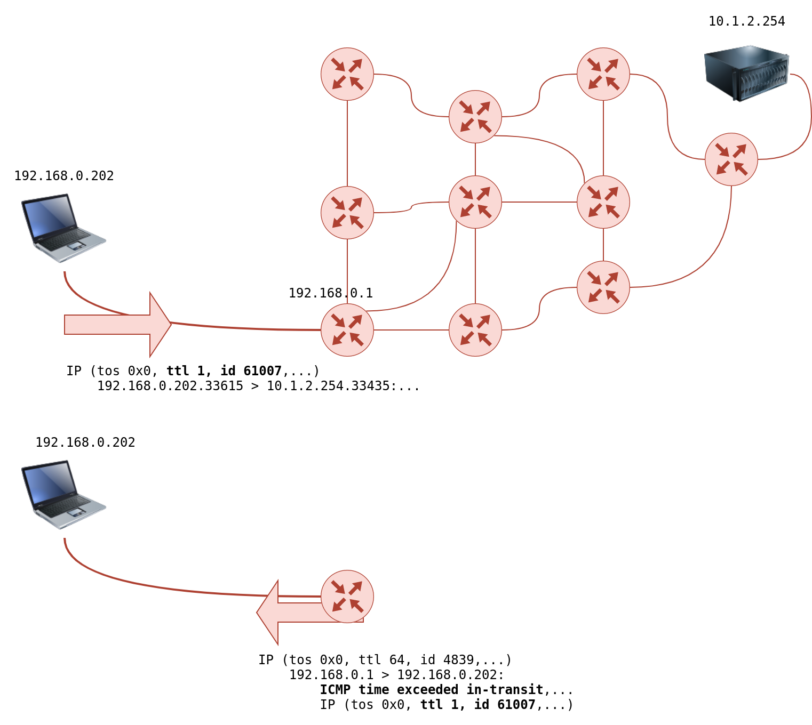
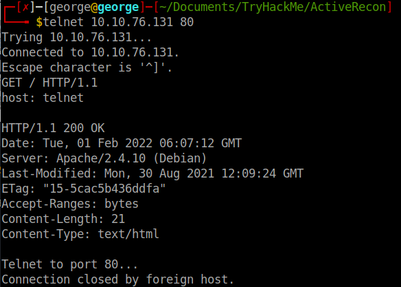
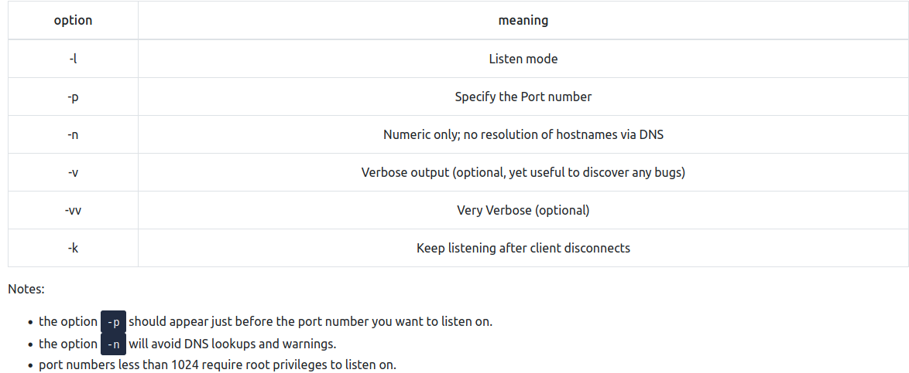
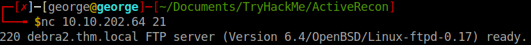
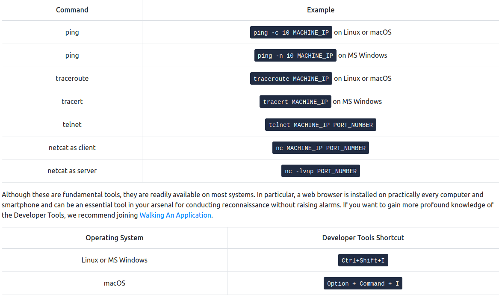

# Active Recon

- any connection we made to the target may leave traces in the logs.

- but not all of them: a browser, for example, is not suspicious as there are a lot of users accessing it through that

## Web Browser

- on the transport layer the browser connects to:
	
	- Port 80 when website is accessed over HTTP
	- Port 443 when website is accessed over HTTPS

- 127.0.0.1 = *localhost*

- Press *CTRL+Shist+I* to access the Developer Tools in Firefox

- Useful tools:

	- *FoxyProxy* lets you quickly change the proxy server you are using to access the target website. This browser extension is convenient when you are using a tool such as Burp Suite or if you need to switch proxy servers regularly. You can get FoxyProxy for Firefox from [here](https://addons.mozilla.org/en-US/firefox/addon/foxyproxy-standard).

	- *User-Agent Switcher and Manager* gives you the ability to pretend to be accessing the webpage from a different operating system or different web browser. In other words, you can pretend to be browsing a site using an iPhone when in fact, you are accessing it from Mozilla Firefox. You can download User-Agent Switcher and Manager for Firefox [here](https://addons.mozilla.org/en-US/firefox/addon/user-agent-string-switcher).

	- *Wappalyzer* provides insights about the technologies used on the visited websites. Such extension is handy, primarily when you collect all this information while browsing the website like any other user. You can find Wappalyzer for Firefox [here](https://addons.mozilla.org/en-US/firefox/addon/user-agent-string-switcher).

## Ping

- The primary purpose of ping is to check whether you can reach the remote system and that the remote system can reach you back.

- In other words, initially, this was used to check network connectivity; however, we are more interested in its different uses: checking whether the remote system is online.

- ping sends **ICMP Echo packets** to a remote system 
	
	- If the system is online, hence the packet was correctly routed and not blocked by any firewall, the system should send back an **ICMP Echo Reply**

```bash
ping -c 10 MACHINE_IP #send 10 packets
```

- Technically speaking, ping falls under the protocol ICMP (**Internet Control Message Protocol**). 
	
	- ICMP supports many types of queries, but, in particular, we are interested in *ping* (*ICMP echo/type 8*) and *ping reply* (*ICMP echo reply/type 0*).

- MS Windows Firewall blocks ping by default.

### Questions


1. Which option would you use to set the size of the data carried by the ICMP echo request?

R: -s

2. What is the size of the ICMP header in bytes?

R: 8

3. Does MS Windows Firewall block ping by default? (Y/N)

R: Y

4.Deploy the VM for this task and using the AttackBox terminal, issue the command ping -c 10 MACHINE_IP. How many ping replies did you get back?

R: 10

## Traceroute

- its purpose is to find the IP addresses of the routers or hops that a packet traverses on its way to the target.

- There is no direct way to discover the path from your system to a target system. 

	- We rely on ICMP to “trick” the routers into revealing their IP addresses. 
	- We can accomplish this by using a small *Time To Live* (TTL) in the IP header field.
	- Although the T in TTL stands for time, TTL indicates *the maximum number of routers/hops that a packet can pass through before being dropped*; TTL is not a maximum number of time units.
	- When a router receives a packet, it decrements the TTL by one before passing it to the next router. 
	- each time the IP packet passes through a router, its TTL value is decremented by 1. 
	- Initially, it leaves the system with a TTL value of 64; it reaches the target system with a TTL value of 60 after passing through 4 routers.



- However, *if the TTL reaches 0, it will be dropped, and an ICMP Time-to-Live exceeded would be sent to the original sender*. 

- In the following figure, the system set TTL to 1 before sending it to the router. 

	- The first router on the path decrements the TTL by 1, resulting in a TTL of 0. 
	- Consequently, this router will discard the packet and send an ICMP time exceeded in-transit error message. 
	- Note that some routers are configured not to send such ICMP messages when discarding a packet.



- On Linux, traceroute will start by sending *UDP datagrams* within IP packets of *TTL being 1*. 

	- Thus, it causes the *first router to encounter a TTL=0 and send an ICMP Time-to-Live exceeded back.* 

	- Hence, a TTL of 1 *will reveal the IP address of the first router to you*. 

	- Then it will send another packet with TTL=2; this packet will be dropped at the second router. And so on. 

- To summarize, we can notice the following:

    - The number of hops/routers between your system and the target system depends on the time you are running traceroute. There is no guarantee that your packets will always follow the same route, even if you are on the same network or you repeat the traceroute command within a short time.
    
    - Some routers return a public IP address. You might examine a few of these routers based on the scope of the intended penetration testing.
    
    - Some routers don’t return a reply.

### Questions

1. In Traceroute A, what is the IP address of the last router/hop before reaching tryhackme.com?

R: 172.67.69.208

2. In Traceroute B, what is the IP address of the last router/hop before reaching tryhackme.com?

R: 104.26.11.229

3. In Traceroute B, how many routers are between the two systems?

R: 26

## Telnet

- The Telnet (*Teletype network*) was developed in 1969 to communicate with a remote system via a command line interface (CLI).

- *default port: 23*

- it sends the username and passwords in plaintext, which may be stolen by the attacker if he has access to the communciation channel

- secure alternative: SSH

- the telnet client relies on TCP 

```bash
telnet IP PORT
```

- Let’s say we want to discover more information about a web server, listening on port 80. 

- We connect to the server at port 80, and then we communicate using the HTTP protocol.

	- To specify something other than the default index page, you can issue GET /page.html HTTP/1.1, which will request page.html. 

- We also specified to the remote web server that we want to use HTTP version 1.1 for communication. 

	- To get a valid response, instead of an error, you need to input some value for the host-> host: example and hit enter twice. 

	- Executing these steps will provide the requested index page.

### Questions

1. Start the attached VM from Task 3 if it is not already started. On the AttackBox, open the terminal and use the telnet client to connect to the VM on port 80. What is the name of the running server?



R: apache

2. What is the version of the running server (on port 80 of the VM)?

R: 2.4.10

## Netcat

- netcat supports both UDP and TCP

- it can act either as a client that connects to a server or as a sever that listens on a port of my choice.

- you can connect to a server as you did with telnet to get its *banner* using:

```bash
nc IP PORT
```

- Note that you need to press SHIFT-ENTER after the GET line

- Netcat flags:



- *port number less than 1024 need root privileges to listen on!!*

### Questions

1. Start the VM and open the AttackBox. Once the AttackBox loads, use Netcat to connect to the VM port 21. What is the version of the running server?

R: 0.17



## Recap 

- It is easy to put a few of them together via a shell script to build a primitive network and system scanner. 

	- You can use traceroute to map the path to the target, ping to check if the target system responds to ICMP Echo, and telnet to check which ports are open and reachable by attempting to connect to them. 

	- Available scanners do this at much more advanced and sophisticated levels, as we will see in the next four rooms with nmap.

