# [Advent Calendar 2021](https://tryhackme.com/room/adventofcyber3)

- *User*: h4ck@d4wn
- *Date*: 23th February 2022
- *Description*: Get started with Cyber Security in 25 Days - Learn the basics by doing a new, beginner friendly security challenge every day leading up to Christmas.

Tags: #authentication #authorisation

## [Day 3] `Web Exploitation` Christmas Blackout

#contentdiscovery

- Content is the assets and inner workings of the application that we are testing. Contents can be files, folders, or pathways that weren't necessarily intended to be accessed by the general public.

	- Contents can be files, folders, or pathways that weren't necessarily intended to be accessed by the general public.

- Using specific Content discovery techniques, we can find:

    - Configuration files
    - Passwords and secrets
    - Backups
    - Content management systems
    - Administrator dashboards or portals

#dirbuster

- using automate tools like dirbuster, we can discover hidden files more easily and a lot faster.

- [List of default credential](https://github.com/danielmiessler/SecLists/tree/master/Passwords/Default-Credentials)

### Questions

1. Using a common wordlist for discovering content, enumerate `<ip>` to find the location of the administrator dashboard. What is the name of the folder?

- used the command `dirb http://<ip> /usr/share/wordlists/dirb/common.txt -r`. 

	- `-r` flag will tell dirb to not do recursive searches. 

A: admin

2. In your web browser, try some default credentials on the newly discovered login form for the "administrator" user. What is the password?

- The username is obviously `administrator`

- The passwords I tried were `password`, `admin` and `administrator`. The latter was the correct one.

A: administrator

3. Access the admin panel. What is the value of the flag?

- After logging in as administrator, the flag will appear.

A: THM{ADM1N_AC3SS} 

## [Day 4] `Web Exploitation` Santa's Running Behind

#authentication #authorisation

- Authentication can be proven using:

	- A known set of *credentials* to the server and user such as a username and password
	- *Token* authentication (these are unique pieces of encrypted text)
    - *Biometric* authentication (fingerprints, retina data, etc.)

- Authentication is often used interchangeably with authorisation, but it is very different. 

	- Authorisation is a term for the rules defining what an authenticated user can and cannot access.

#fuzzing

- fuzzing is an automated means of testing an element of a web application until the application gives a vulnerability or valuable information.

#burp

### Questions


1. What valid password can you use to access the "santa" account?

- Used the intruder to fuzz the password of santa using the provided password list

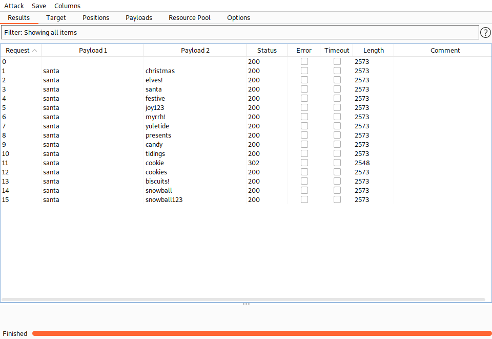

- We can see that one of them provides a different length response

A: cookie

2. What is the flag in Santa's itinerary?

- logged in as santa

A: THM{SANTA_DELIVERS}

## [Day 5] `Web Exploitation` Pesky Elf Forum

### Questions

#xss

- Cross-Site Scripting is classified as an injection attack where malicious JavaScript gets injected into a web application with the intention of being executed by other users.

- If successful, you can:

	- install a keylogger
	- steal the user's cookie and hijack their session
	- redirect the user to a malicious website

- Four types:

	- *DOM*
	- *Reflected* 
	- *Stored*
	- *Blind*

### DOM

- stands for *Document Object Model* is a programming interface for HTML and XML documents.

	- It represents the page so that programs can change the document structure, style and content.

- DOM Based XSS is where the JavaScript execution happens directly in the browser without any new pages being loaded or data submitted to backend code. 

- An example of this could be a website's JavaScript code getting the contents from the `window.location.hash` parameter and then write that onto the page in the currently being viewed section. 

	- The contents of the hash aren't checked for malicious code, allowing an attacker to inject JavaScript of their choosing onto the webpage.

### Reflected

- Reflected XSS happens when user-supplied data in an HTTP request is included in the webpage source without any validation. 

- An example of this could be an error message which is in a query string of an URL that is reflected onto the webpage. The URL could look something like the following: `https://website.thm/login?error=Username%20Is%20Incorrect`

	- The error message could be replaced with JavaScript code which gets executed when a user visits the page.

### Stored

- As the name infers, the XSS payload is stored on the web application (in a database, for example) and then gets run when other users visit the site or web page. 

- This type of XSS can be particularly damaging due to the number of victims that may be affected. 

	- An example of this could be a blog that allows visitors to leave comments. If a visitor's message is not properly validated and checked for XSS payloads, then every subsequent visit to the blog page would run the malicious JavaScript code.

### Blind

- Blind XSS is similar to a stored XSS in that your payload gets stored on the website for another user to view, but in this instance, you can't see the payload working or be able to test it against yourself first. 

	- An example of this could be a contact form. 
	- In the contact form, your message could contain an XSS payload, which when a member of staff views the message it gets executed.


1. What flag did you get when you disabled the plugin? 


- Logged in as McSkidy, changed my password and then injected an xss payload that changes the password to the one we just set (notice that when we changed our password, the url had `/settings?new_password=newpassword` at the end of it) as a comment on one of the posts.

- when Grinch visits it, it will automaticaly change their password to the one we just set.

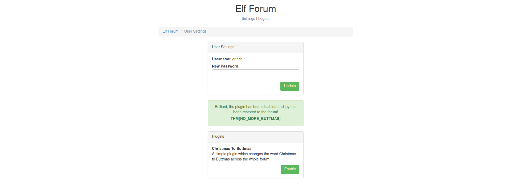

A: THM{NO_MORE_BUTTMAS}

## [Day 6] `Web Exploitation` Patch Management Is Hard

#lfi

### What is LFI?

- An LFI vulnerability is found in various web applications. As an example, in the PHP, the following functions cause this kind of vulnerability:

    - `include`
    - `require`
    - `include_once` 
    - `require_once`

- It is a web application vulnerability that allows the attacker to **include** and **read** local files on the server. 

- The main issue of these vulnerabilities is the lack of input validation, in which the user inputs are not sanitized or validated, and the user controls them.

### The Risk

- read sensitive data if you have readable permissions on files.

	- leaking sensitive data accessed by a regular user.

- sometimes, `RCE` is possible.

### Testing for LFI

- HTTP `GET` and `POST` parameters.

- Parameters are query parameter strings attached to the URL that could be used to retrieve data or perform actions based on user input.

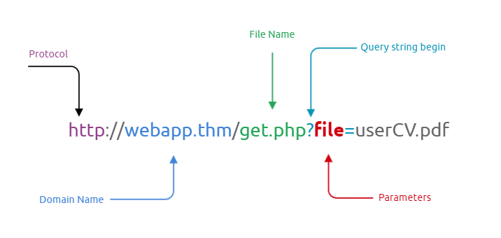

- In addition, other entry points can be used depending on the web application, and where can consider the User-Agent, Cookies, session, and other HTTP headers.

#important

- The following are some Linux system files that have sensitive information:

```
/etc/issue
/etc/passwd
/etc/shadow
/etc/group
/etc/hosts
/etc/motd
/etc/mysql/my.cnf
/proc/[0-9]*/fd/[0-9]*   (first number is the PID, second is the filedescriptor)
/proc/self/environ
/proc/version
/proc/cmdline
```

- As a test case, we can always try /etc/passwd against Linux OS since it is readable for sure. We can also try to include using different techniques such as:

    - A direct file inclusion, which starts with `/etc/passwd`
    - using `..` to get out the current directory, the number of `..` is varies depending on the web app directory. 
    - Bypassing filters using `....//`.
    - URL encoding techniques (such as double encoding)

- Examples:

```
http://example.thm.labs/page.php?file=/etc/passwd 
http://example.thm.labs/page.php?file=../../../../../../etc/passwd 
http://example.thm.labs/page.php?file=../../../../../../etc/passwd%00 
http://example.thm.labs/page.php?file=....//....//....//....//etc/passwd 
http://example.thm.labs/page.php?file=%252e%252e%252fetc%252fpasswd
```

### Exploiting LFI

#php

- If we are dealing with a PHP web application, then we can use a PHP-supported Wrapper.

- PHP provides various methods of transmission of data (Input/Output stream) to allow PHP to read from. 

	- It will enable reading data via various data type channels.

#### PHP Filter

- The PHP filter wrapper is used in LFI to read the actual PHP page content. 

- In typical cases, it is not possible to read a PHP file's content via LFI because PHP files get executed and never show the existing code. 

	- However, we can use the PHP filter to display the content of PHP files in other encoding formats such as base64 or ROT13. 

- Reading the /etc/passwd file using the PHP filter wrapper: 

	- `http://example.thm.labs/page.php?file=php://filter/resource=/etc/passwd`

- Now try to read the index.php file using a PHP filter; we get errors because the web server tries to execute the PHP code. To avoid this, we can use a PHP filter while base64 or ROT13 encoding the output as follows:

```
http://example.thm.labs/page.php?file=php://filter/read=string.rot13/resource=/etc/passwd 
http://example.thm.labs/page.php?file=php://filter/convert.base64-encode/resource=/etc/passwd
```

### PHP DATA

#phpwrapper

- The PHP wrapper is used to include raw plain text or base64 encoded data. 
	
	- It is used to include images on the current page. 
	- It is being used in LFI exploit. 

- we can include our base64 data into the vulnerable page as follows:

	- `http://example.thm.labs/page.php?file=data://text/plain;base64,QW9DMyBpcyBmdW4hCg==`

- As a result, the page will show our lovely message, which is AoC3 is fun!. 

- Using this technique, we can include PHP code into a page, by encoding the required PHP code and including it into PHP data wrapper.

### LFI to RCE via Log files

- It is also called a log poisoning attack. 

- It is a technique used to gain remote command execution on the webserver. 

- The attacker needs to include a malicious payload into services log files such as Apache, SSH, etc. 

- Then, the LFI vulnerability is used to request the page that includes the malicious payload. 

- Exploiting this kind of attack depends on various factors, including the design of the web application and server configurations. 
	
	- Thus, it requires enumerations, analysis, and an understanding of how the web application works. 

	- For example, a user can include a malicious payload into an apache log file via User-Agent or other HTTP headers. 

		- In SSH, the user can inject a malicious payload in the username section. 

- The **User-Agent** is an HTTP header that includes the user's browser information to let servers identify the type of operating system, vendor, and version.

-  Therefore, in order to get the RCE, you need to include PHP code into User-Agent and send a request to the log file using the LFI to execute in the browser.

```bash
curl -A "This is testing" http://10-10-30-212.p.thmlabs.com/login.php
```

- Inject php code:

```bash           
curl -A "<?php phpinfo();?>" http://10-10-30-212.p.thmlabs.com/login.php
```

- - Now using the LFI, load the log file to get the PHP code executed. 

	- Note that it is important to visit the log file via LFI. 

### LFI to RCE via PHP Sessions

- The LFI to RCE via PHP sessions follows the same concept of the log poisoning technique. 

- PHP sessions are files within the operating system that store temporary information. 

	- After the user logs out of the web application, the PHP session information will be deleted.

- This technique requires enumeration to read the PHP configuration file first, and then we know where the PHP sessions files are. 

- Then, we include a PHP code into the session and finally call the file via LFI. 

- PHP stores session data in files within the system in different locations based on the configuration. 

The following are some of the common locations that the PHP stores in:

```
c:\Windows\Temp
/tmp/
/var/lib/php5
/var/lib/php/session
```

- 

### Questions


1. Deploy the attached VM and look around. What is the entry point for our web application?

- Figured this out by looking at the URL: `http://10.10.150.46/index.php?err=error.txt`

A: err

2. Use the entry point to perform LFI to read the /etc/flag file. What is the flag?

- changed the file included to `/etc/flag` and the flag popped up on the screen

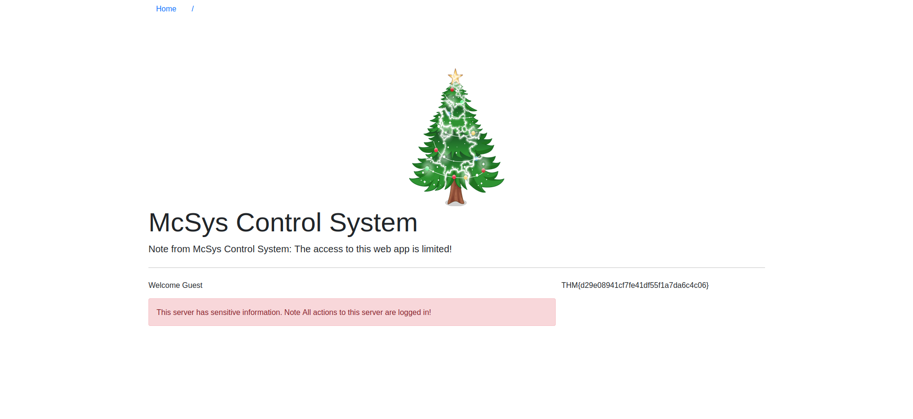

A: THM{d29e08941cf7fe41df55f1a7da6c4c06} 

3. Use the PHP filter technique to read the source code of the index.php. What is the $flag variable's value?

- Used the following payload: `http://10.10.150.46/index.php?err=php://filter/convert.base64-encode/resource=index.php`

- Got a very long base64 result: `PD9waHAgc2Vzc2lvbl9zdGFydCgpOwokZmxhZyA9ICJUSE17NzkxZDQzZDQ2MDE4YTBkODkzNjFkYmY2MGQ1ZDllYjh9IjsKaW5jbHVkZSgiLi9pbmNsdWRlcy9jcmVkcy5waHAiKTsKaWYoJF9TRVNTSU9OWyd1c2VybmFtZSddID09PSAkVVNFUil7ICAgICAgICAgICAgICAgICAgICAgICAgCgloZWFkZXIoICdMb2NhdGlvbjogbWFuYWdlLnBocCcgKTsKCWRpZSgpOwp9IGVsc2UgewoJJGxhYk51bSA9ICIiOwogIHJlcXVpcmUgIi4vaW5jbHVkZXMvaGVhZGVyLnBocCI7Cj8+CjxkaXYgY2xhc3M9InJvdyI+CiAgPGRpdiBjbGFzcz0iY29sLWxnLTEyIj4KICA8L2Rpdj4KICA8ZGl2IGNsYXNzPSJjb2wtbGctOCBjb2wtb2Zmc2V0LTEiPgogICAgICA8P3BocCBpZiAoaXNzZXQoJGVycm9yKSkgeyA/PgogICAgICAgICAgPHNwYW4gY2xhc3M9InRleHQgdGV4dC1kYW5nZXIiPjxiPjw/cGhwIGVjaG8gJGVycm9yOyA/PjwvYj48L3NwYW4+CiAgICAgIDw/cGhwIH0KCj8+CiA8cD5XZWxjb21lIDw/cGhwIGVjaG8gZ2V0VXNlck5hbWUoKTsgPz48L3A+Cgk8ZGl2IGNsYXNzPSJhbGVydCBhbGVydC1kYW5nZXIiIHJvbGU9ImFsZXJ0Ij5UaGlzIHNlcnZlciBoYXMgc2Vuc2l0aXZlIGluZm9ybWF0aW9uLiBOb3RlIEFsbCBhY3Rpb25zIHRvIHRoaXMgc2VydmVyIGFyZSBsb2dnZWQgaW4hPC9kaXY+IAoJPC9kaXY+Cjw/cGhwIGlmKCRlcnJJbmNsdWRlKXsgaW5jbHVkZSgkX0dFVFsnZXJyJ10pO30gPz4KPC9kaXY+Cgo8P3BocAp9Cj8+`

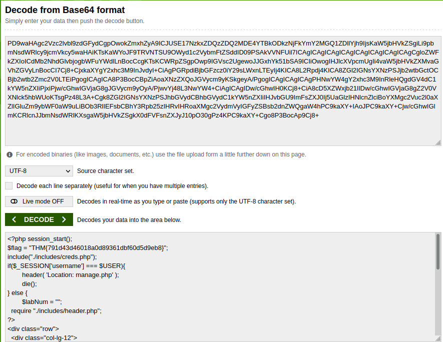

- If we decode it, we get the flag

A: THM{791d43d46018a0d89361dbf60d5d9eb8}

McSkidy forgot his login credential. Can you help him to login in order to recover one of the server's passwords?

4. Now that you read the index.php, there is a login credential PHP file's path. Use the PHP filter technique to read its content. What are the username and password?

- used the following payload: `http://10.10.30.212/index.php?err=php://filter/convert.base64-encode/resource=/var/www/html/includes/creds.php`

- Got the following decoded from base64 text:

```php
<?php 
$USER = "McSkidy";
$PASS = "A0C315Aw3s0m";
?
```

A: McSkidy:A0C315Aw3s0m

5. Use the credentials to login into the web application. Help McSkidy to recover the server's password. What is the password of the flag.thm.aoc server? 

A: THM{552f313b52e3c3dbf5257d8c6db7f6f1}

6. The web application logs all users' requests, and only authorized users can read the log file. Use the LFI to gain RCE via the log file page. What is the hostname of the webserver? The log file location is at ./includes/logs/app_access.log.

- Curled some php: `curl -A "<?php phpinfo();?>" http://10-10-30-212.p.thmlabs.com/login.php`

- Then used LFI to load the page: `http://10.10.30.212/index.php?err=php://filter/resource=/var/www/html/includes/logs/app_access.log`

- Got a bunch of info:

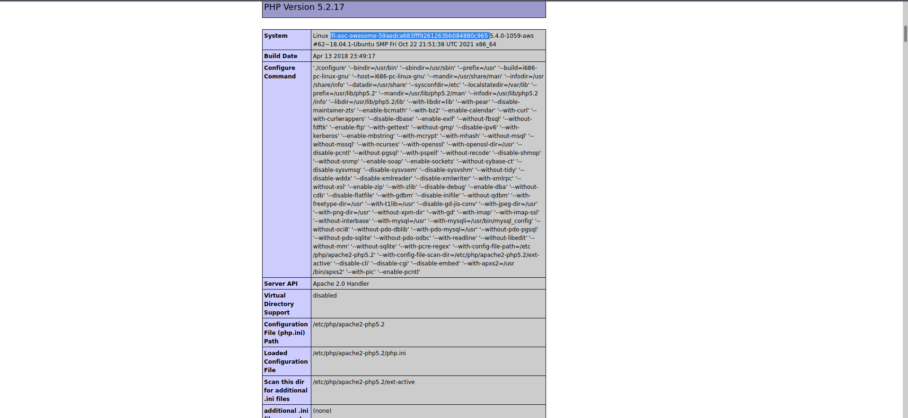

A: lfi-aoc-awesome-59aedca683fff9261263bb084880c965

7. Bonus: The current PHP configuration stores the PHP session files in /tmp. Use the LFI to call the PHP session file to get your PHP code executed. 

## [Day 7] `Web Exploitation` Migration Without Security

#nosql

### What are NoSQL and MongoDB?
- A NoSQL database refers to a non-relational database 

- NoSQL databases are commonly used nowadays for **Big Data** and **IoT devices** due to their powerful features such as *fast queries*, *ease of use* to developers, *scale* easily, and *flexible data structure*. 

- NoSQL Databases:  *MongoDB*, *Couchbase*, *RavenDB*

#mongodb

- MongoDB consists of databases, tables, fields but with different names where: 

    - **Collections** are similar to tables or views in MySQL and MSSQL.
    - **Documents** are similar to rows or records in MySQL and MSSQL.
    - **Fields** are similar to columns in MySQL and MSSQL.

- Documents in MongoDB are objects stored in a format called `BSON`, which supports `JSON` data types for document storing.

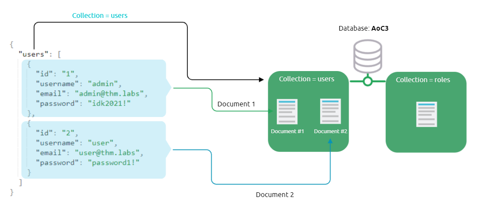

- compare the [query operators](https://docs.mongodb.com/manual/reference/operator/query/) between MongoDB and MySQL:

    - `$and` equivalent to `AND` in MySQL
    - `$or` equivalent to `OR` in MySQL
    - `$eq` equivalent to `=` in MySQL

### Interacting with a MongoDB server

- start mongo with `mongo` command

- `show` - list all the databases that we have in MongoDB

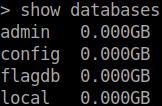

- `use` - connect to a database if it exists or creates one if it doesn't.

- `db.createCollection()` - create new collections
	
	- `db.getCollectionNames()` - show available collections

- we create a document within the users collection and insert data into it:

	- `db.users.insert({id:"1", username: "admin", email: "admin@thm.labs", password: "idk2021!"})`

		- `db.users.find()` - show available documents

>Note that MongoDB automatically creates a unique ID called _id for each document within the collection

- `db.users.update({id:"2"}, {$set: {username: "tryhackme"}});` - update the document with id=2 and update the username

- `db.users.remove({'id':'2'})` - remove document with id=2

- `db.users.drop()` - drop the collection

### What is NoSQL Injection?

#nosqlinjection

- A NoSQL injection happens by sending queries via untrusted and unfiltered web application input, which leads to leaked unauthorized information. 

	- In addition, the attacker can use the NoSQL injection to perform various operations such as *modifying data*, *escalating privileges*, *DoS attacks*, and others.

### Bypassing login pages!

- first, connect to the database and then look for a certain username and password; 

	- if they exist in the collection (in the database), then we have a valid entry. 

- The following is the query that is used in the web applications used on our login page:  `db.users.find({query})` or `db.users.findOne(query)`  functions where the query is `JSON` data that's send via the application:  {`"username": "admin", "password":"adminpass"}`.  

	- Note that when we provide the correct credentials, a document returns, while a `null` reply is received when providing the wrong credentials when nothing matches!

- 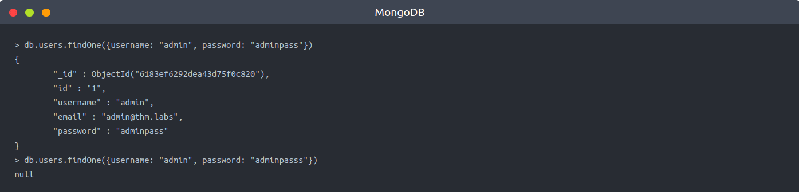

- MongoDB operators that we need to be familiar with that are heavily used in the injections:

	- `$eq` - matches records that equal to a certain value

	- `$ne` - matches records that are not equal to a certain value

	- `$gt` - matches records that are greater than a certain value.

	- `$where` - matches records based on Javascript condition

	- `$exists` - matches records that have a certain field

	- `$regex` - matches records that satisfy certain regular expressions.

- we will be exploiting the logic of the login query by injecting a JSON object which includes one of the NoSQL operators, which is `$ne`:

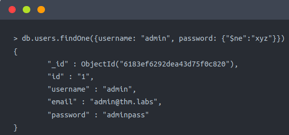

- `db.users.findOne({username: "admin", password: {"$ne":"xyz"}})`

- We injected a JSON objection {"$ne": "XYZ"}  in the password field, and we changed the logic to become as follows:

	-     We are telling MongoDB to find a document (user) with a username equal to admin and his password is not equal to xyz, which turns this statement to TRUE because the admin's password is not xyz.

- As a result, we have successfully retrieved the document from MongoDB since our statement's logic is true. 

	- By applying this concept against a login page of a web application, we will be able to bypass the login page.

- Now let's say if we wanted to log in to a system as another user who is not admin. 

- In this case, we can also inject into a username field to be as follows:

	- `db.users.findOne({username:{"$ne":"admin"},password:{"$ne":"xyz"}})`

### Exploiting NoSQL injection

- To exploit NoSQL injection within the web application, first, you need to find an entry point that **doesn't sanitize the user's input**.

- Next, you need to understand how the web application passes the request to the database! 

- Sometimes, the web app accepts the user's input via `GET` or `POST` queries, and sometimes web applications accept a JSON object, as is the case with `APIs`.

- To interact with MongoDB via GET or POST is by injecting an array of the MongoDB operator to match the JSON objection to match the `Key: Value`. 

- The following is an example of how to inject via URL:

	- `http://example.thm.labs/search?username=admin&role[$ne]=user`

- Note that we inject the MongoDB operator `[$ne]` (not equal) in the role parameter.

- We will try to list all usernames that have a `user` role!

	- `http://example.thm.labs/search?username[$ne]=ben&role=user`

- As a result, the web application will return many records from MongoDB that satisfy the query.

### Questions

1. Interact with the MongoDB server to find the flag. What is the flag?

- used the Flagdb database, showed the collections and then the document that is in there

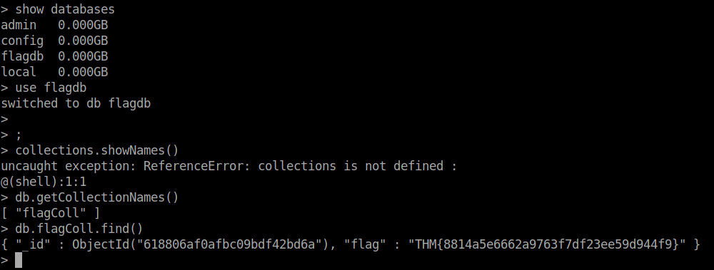

A: THM{8814a5e6662a9763f7df23ee59d944f9}

2. We discussed how to bypass login pages as an admin. Can you log into the application that Grinch Enterprise controls as `admin` and retrieve the flag?

Use the knowledge given in AoC3 day 4 to setup and run Burp Suite proxy to intercept the HTTP request for the login page. Then modify the POST parameter.

- intercepted the request using Burp then modified the password parameter to `password[$ne]=password` and then I got logged in.

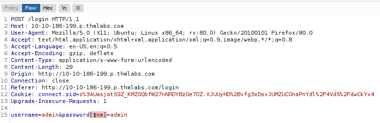

A: THM{b6b304f5d5834a4d089b570840b467a8}

3. Once you are logged in, use the gift search page to list all usernames that have `guest` roles. What is the flag?

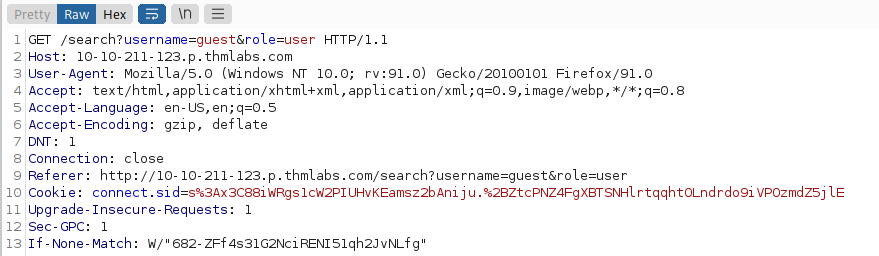

- used the following paylaod: `username[$ne]=guest&role=guest`

- this is what was returned: 
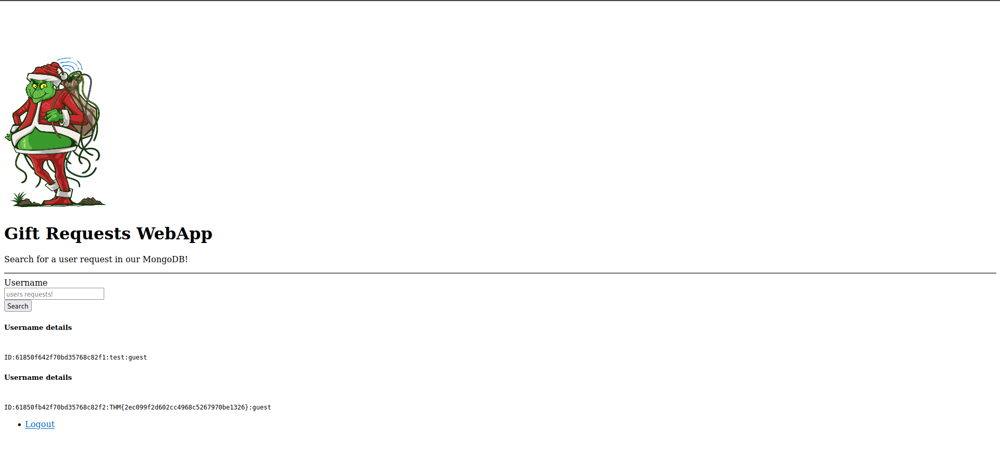

A: THM{2ec099f2d602cc4968c5267970be1326}

4. Use the gift search page to perform NoSQL injection and retrieve the `mcskidy` record. What is the details record?

- used the paylaod: `username=mcskidy&role[$ne]=guest`

A: ID:6184f516ef6da50433f100f4:mcskidy:admin

## [Day 8] `Special by John Hammond` Santa's Bag of Toys

#powershell

- `PowerShell Transcription Logs` capture the input and output of Windows PowerShell commands, allowing an analyst to review what happened when. 

	- Typically, PowerShell Transcription can be enabled by Group Policy, but another method to turn on this logging is by configuring the Windows Registry.

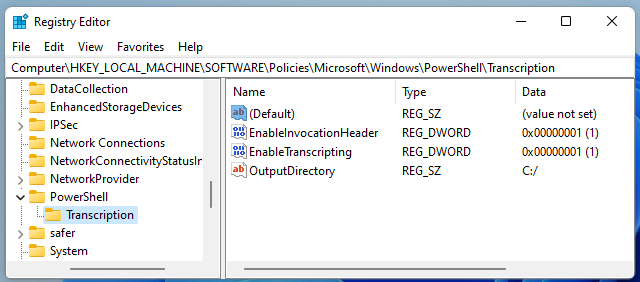


### Questions

1. What operating system is Santa's laptop running ("OS Name")?

- Opened the first powershell Transcript file and searched for 'OS Name'

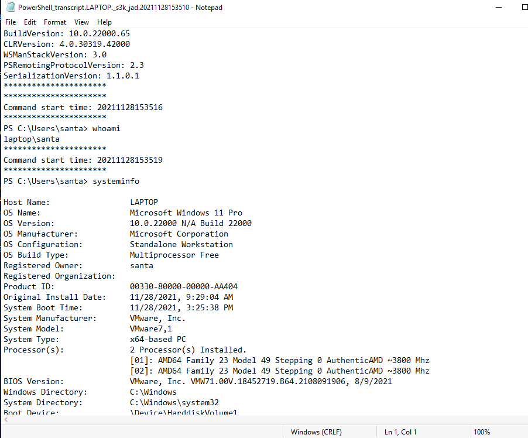

A: Microsoft Windows 11 Pro

2. What was the password set for the new "backdoor" account?

- You can find this info in the second file

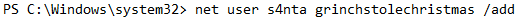

A: grinchstolechristmas

3. In one of the transcription logs,  the bad actor interacts with the target under the new backdoor user account, and copies a unique file to the Desktop. Before it is copied to the Desktop, what is the full path of the original file? 

- Find this info in the third file

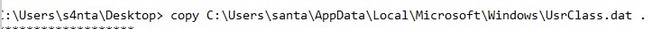

A: C:\Users\santa\AppData\Local\Microsoft\Windows\UsrClass.dat

4. The actor uses a Living Off The Land binary (LOLbin) to encode this file, and then verifies it succeeded by viewing the output file. What is the name of this LOLbin?

- In the same file:

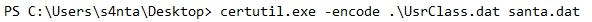

A: certutil.exe

5. Drill down into the folders and see if you can find anything that might indicate how we could better track down what this SantaRat really is. What specific folder name clues us in that this might be publicly accessible software hosted on a code-sharing platform?

- Decoded the .dat file and then uploaded it to the desired tool to get the shellbags

- Found the folder SantaRat and inside of it the answer to this question.

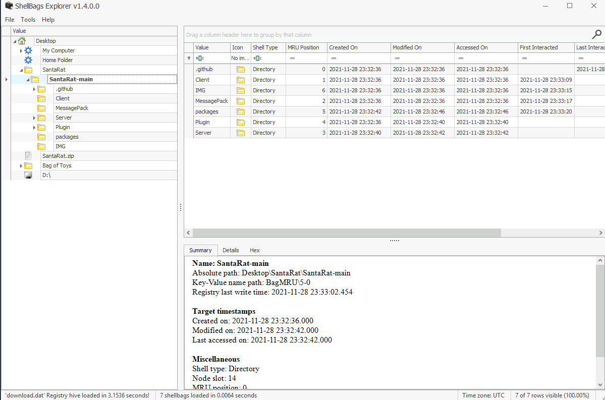

A: .github

6. Additionally, there is a unique folder named "Bag of Toys" on the Desktop! This must be where Santa prepares his collection of toys, and this is certainly sensitive data that the actor could have compromised. What is the name of the file found in this folder? 

A: bag_of_toys.zi

7. What is the name of the user that owns the SantaRat repository?

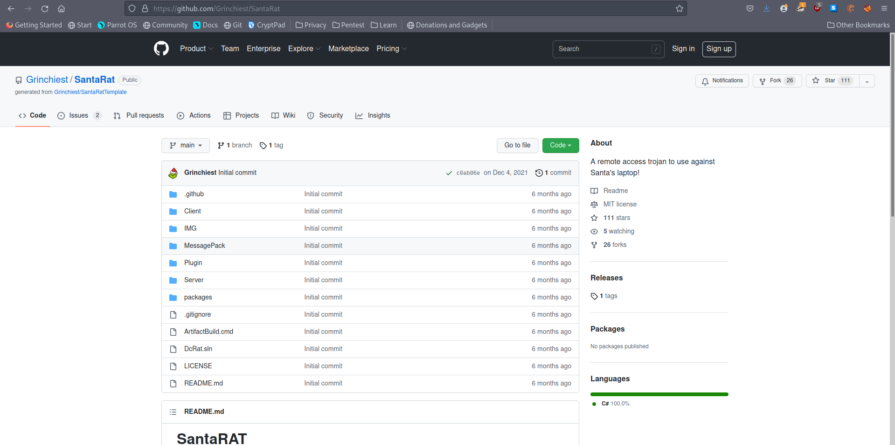

A: Grinchiest

8. Explore the other repositories that this user owns. What is the name of the repository that seems especially pertinent to our investigation?

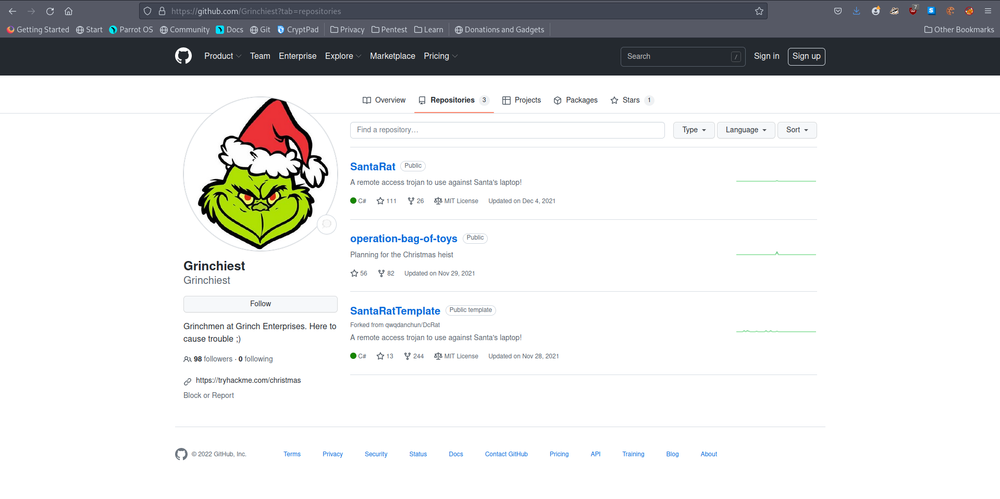

A: operation-bag-of-toys 

9. What is the name of the executable that installed a unique utility the actor used to collect the bag of toys?

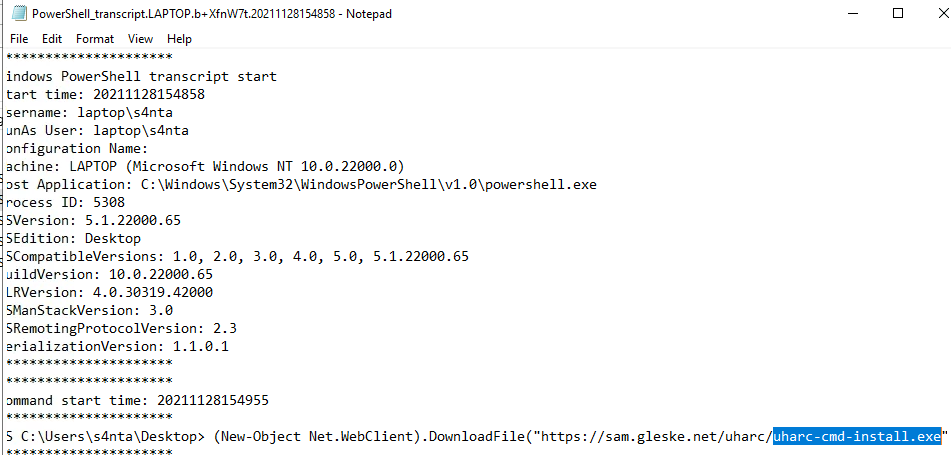

A: uharc-cmd-install.exe

10. What are the contents of these "malicious" files (coal, mold, and all the others)?

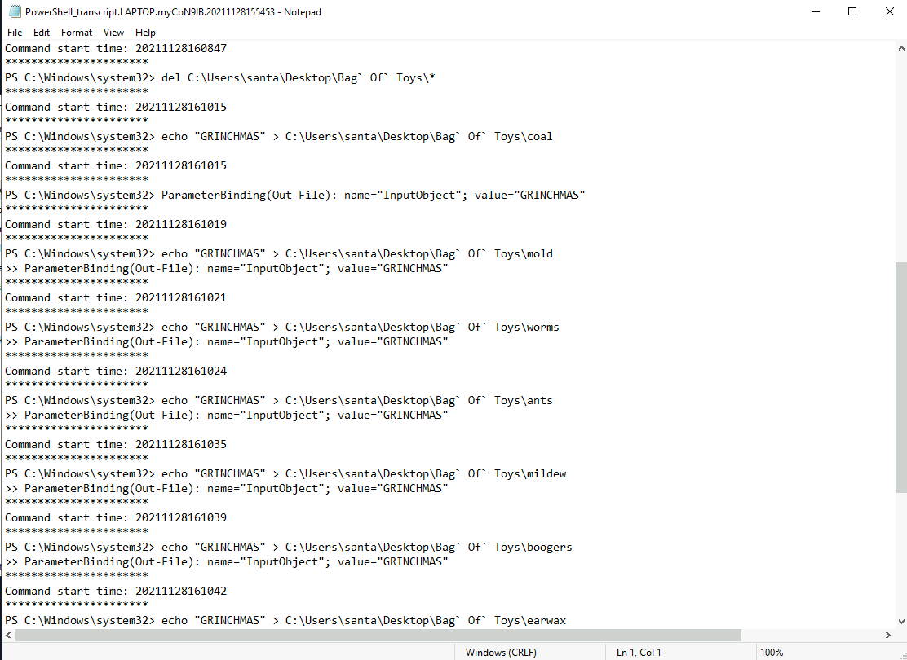

A: Grinchmas

11. What is the password to the original bag_of_toys.uha archive? (You do not need to perform any password-cracking or bruteforce attempts)


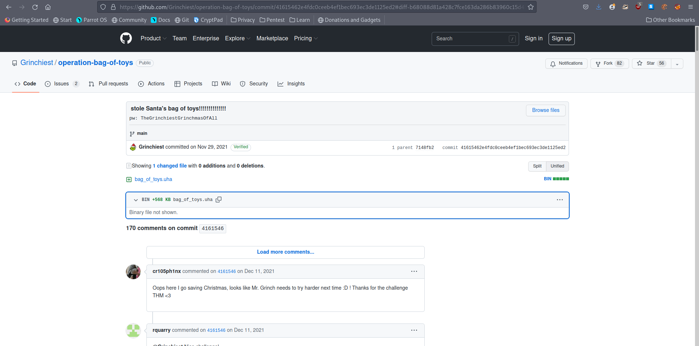

A: TheGrinchiestGrinchmasOfAll

12. How many original files were present in Santa's Bag of Toys?

- I used the password to unlock the UHA archive and find all of the presents.

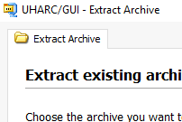

A: 228

## [Day 9] `Networking` Where Is All This Data Going

#wireshark

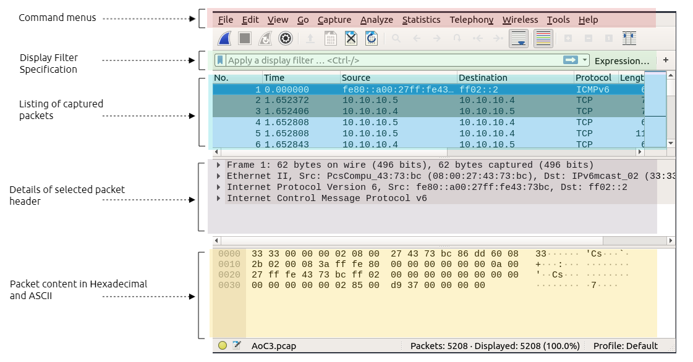

- Filter to only show get requests: `http.request.method == GET`

#dns

- specify DNS packets: `udp.port==53` or `dns`

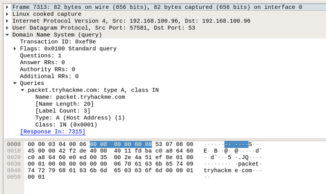

- By expanding the `Domain Name System (query)` subtree, it is obvious that this packet is a question `Questions: 1`, where the client queries a domain name and looks for an answer from the server. 

	- Also, by checking the Queries subtree, we can see that the client is asking for a type `A` record of the `packet.tryhackme.com` domain name.

- Next, we will be looking at the response to the DNS request. 

-	In Wireshark, note that in the query request, which is the first DNS request, in the info field, we can see Transaction ID with a value of `query 0xef8e`

- Thus, this query reference number is used to find the right DNS response of that query. 

	- To confirm that, check the field section where showing query `response 0xef8e A packet.tryhackme.com.`

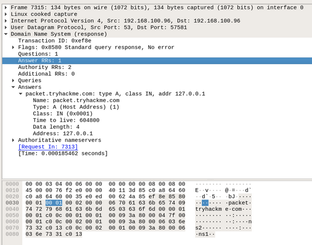

- By double-clicking on the required packet, we can see that it has an answer section, where it has the answer to our query, which is Address: `127.0.0.1`. 

- This means that the type `A` DNS request of the `packet.tryhackme.com ` is `127.0.0.1`

- we filter and list all FTP packets by using the following filter: `ftp` or `tcp.port == 21` 

- The user logged into the FTP server using a username and password and uploaded a secret file. 

- Thus, the current Wireshark filter will not show the packet of the actual uploaded file. 

	- Instead, we can use the `ftp-data` Wireshark filter to list the packets that have the content of the file. 

### Questions

1. In the HTTP #1 - GET requests section, which directory is found on the web server?

A: login

2. What is the username and password used in the login page in the HTTP #2 - POST section? 

- filtered to only show POST requests and then i followed the TCP stream to get the answer.

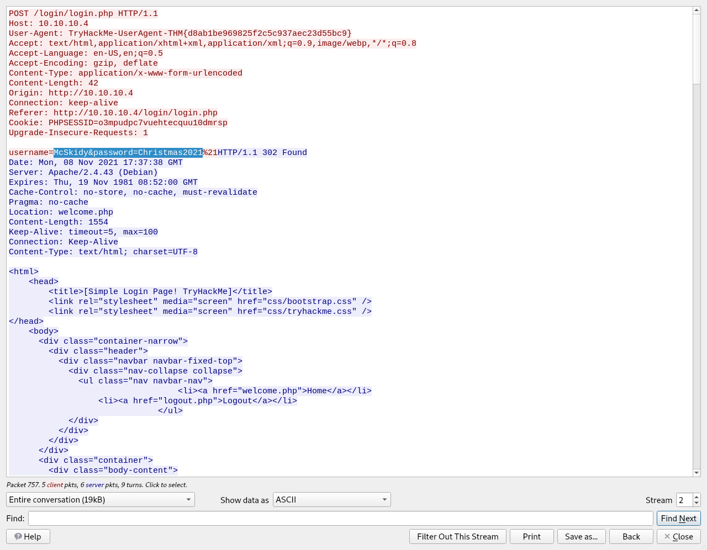

A: McSkidy:Christmas2021

3. What is the User-Agent's name that has been sent in HTTP #2 - POST section?

- from the same window we get the answer for this question too.

A: TryHackMe-UserAgent-THM{d8ab1be969825f2c5c937aec23d55bc9}

4. In the DNS section, there is a TXT DNS query. What is the flag in the message of that DNS query?

- found the query for the TXT DNS query and then I followed the UDP stream.

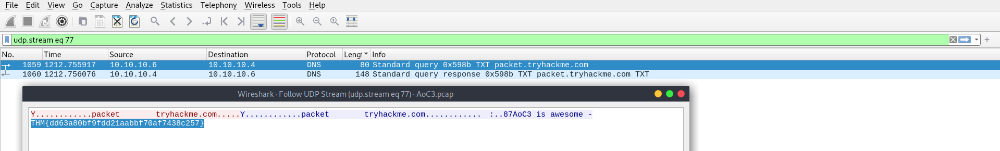

A: THM{dd63a80bf9fdd21aabbf70af7438c257}

5. In the FTP section, what is the FTP login password?

- we filter the FTP packets and we get the answers for the next two questions

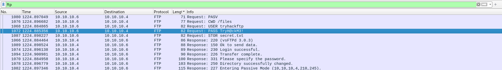

A: TryH@ckM3!

6. In the FTP section, what is the FTP command used to upload the secret.txt  file?

A: STOR

7. In the FTP section, what is the content of the secret.txt file?

- filtered the `ftp-data` packets and then checked details of the packet to get the answer

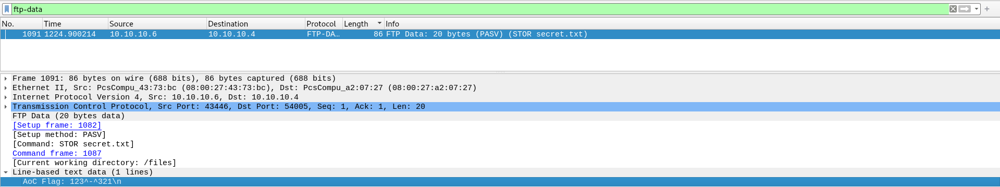

A: 123^-^321


## [Day 10] `Networking` Offensive Is The Best Defence

#ip

- On Microsoft Windows, one way to find your IP address is by running `ipconfig` in the command prompt or PowerShell. 

- On Linux and macOS, you can find your IP address by executing `ip address show` on the terminal. 

- Note that `ip` will accept abbreviations of arguments such as `ip addr show` or even `ip a s`.

#port

- Common protocols and their respective ports:

	-	`HTTP`  - 80
	-	`HTTPS`	- 443
	-	`POP3`	- 110
	-	`SMTP`	- 25
	-	`SSH`	- 22
	-	`Telnet`- 23

#nmap 

- To better understand the difference between `-sT` and `-sS`, we can use the analogy of knocking on a door. 

	- The TCP connect scan (`-sT`) is like knocking on a door, waiting for someone to open it, greeting each other, then excusing yourself to leave. 
	- The TCP SYN scan (`-sS`) resembles knocking, and once someone answers, you pretend that it was not you that knocked and walk away innocently. 
		- The latter will make it more difficult for the other party to remember you.


### Questions


1. Help McSkidy and run nmap -sT MACHINE_IP. How many ports are open between 1 and 100?

- ran the scan with sudo because it only returned that ssh is opened only.

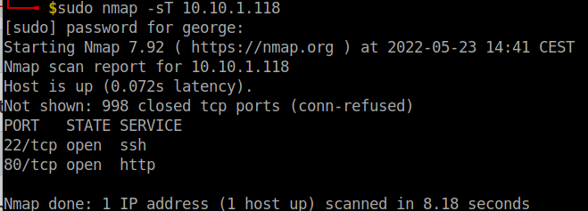

A: 2

2. What is the smallest port number that is open?

A: 22

3. What is the service related to the highest port number you found in the first question?

A: HTTP

4. Now run nmap -sS MACHINE_IP. Did you get the same results? (Y/N)

- this time you have to run the command with sudo.

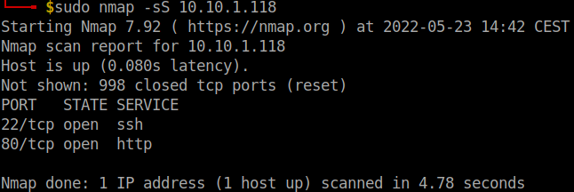

A: Y

5. If you want Nmap to detect the version info of the services installed, you can use nmap -sV MACHINE_IP. What is the version number of the web server?

- added the `-sV` flag in order to return the version as well.

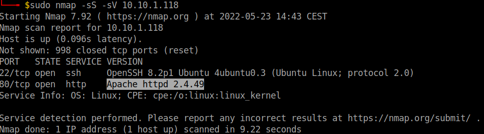

A: Apache httpd 2.4.49

6. By checking the [vulnerabilities](https://httpd.apache.org/security/vulnerabilities_24.html) related to the installed web server, you learn that there is a critical vulnerability that allows path traversal and remote code execution. Now you can tell McSkidy that Grinch Enterprises used this vulnerability. What is the CVE number of the vulnerability that was solved in version 2.4.51?

- a quick look on the website provided and the answer is found:

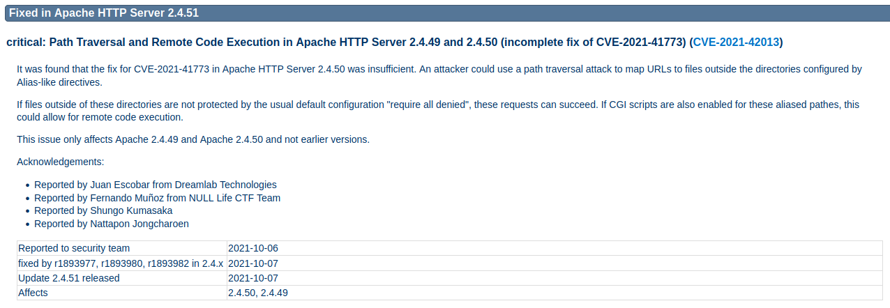

A: CVE-2021-42013

7. You are putting the pieces together and have a good idea of how your web server was exploited. McSkidy is suspicious that the attacker might have installed a backdoor. She asks you to check if there is some service listening on an uncommon port, i.e. outside the 1000 common ports that Nmap scans by default. She explains that adding -p1-65535 or -p- will scan all 65,535 TCP ports instead of only scanning the 1000 most common ports. What is the port number that appeared in the results now?

- I only scanned ports 20000-21000 like the hint indicated to save some time.

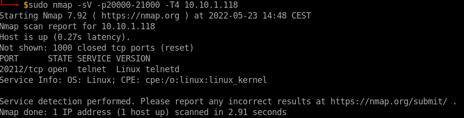

A: 20212

7. What is the name of the program listening on the newly discovered port?

A: telnetd


## [Day 11] `Networking` Where Are The Reindeers?

#mssqlserver

- `MS SQL Server` is a **Relational Database Management System** (RDBMS). 

- One simple way to think of a relational database is a group of tables that have relations. 

- Knowing the MS SQL Server is running and accessible over the network, we want to check if our username and password are still valid. 

	- we will use the command `sqsh` (pronounced skwish), an interactive database shell.

- A simple syntax would be `sqsh -S server -U username -P password`, where:

   - `-S server` is used to specify the server, for example `-S 10.10.199.126`
   - `-U username` is used to provide the username; for example, `-U sa` is the username that we have enabled.
   - `-P password` lets us specify the password.

- we executed the query, `SELECT * FROM reindeer.dbo.names;`. 

	- This SQL query should dump all the contents of the table names from the database reindeer. 

		- Note that the ; indicates the end of the SQL query, while `go` sends a SQL batch to the database.

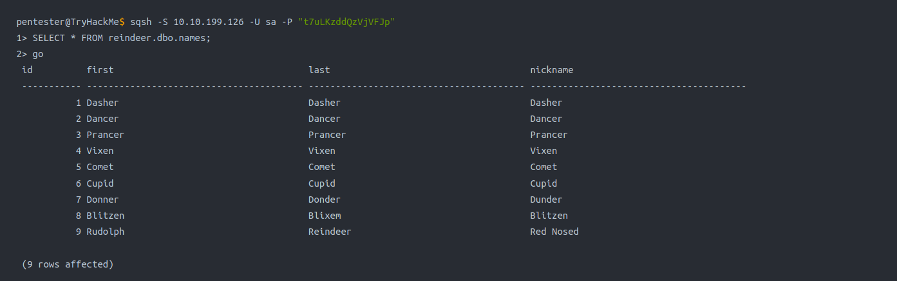

#interesting

- Some MS SQL Servers have `xp_cmdshell` enabled. 

	- If this is the case, we might have access to something similar to a `command prompt`.

- The command syntax is `xp_cmdshell 'COMMAND';`

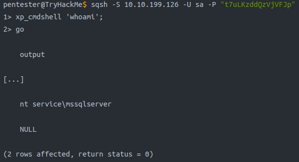

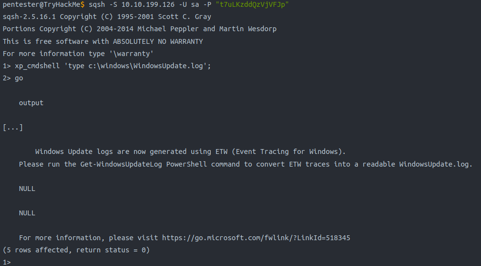

### Questions

1. There is an open port related to MS SQL Server accessible over the network. What is the port number?

- Ran this command: 

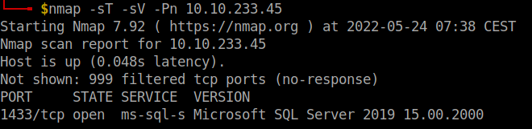

A: 1433

2. If the connection is successful, you will get a prompt. What is the prompt that you have received?

- Using the command `sqsh -S 10.10.199.126 -U sa -P t7uLKzddQzVjVFJp` I get a shell:

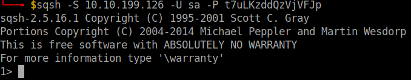

A: 1>

3. We can see four columns in the table displayed above: id, first (name), last (name), and nickname. What is the first name of the reindeer of id 9?

- We run the following commands:

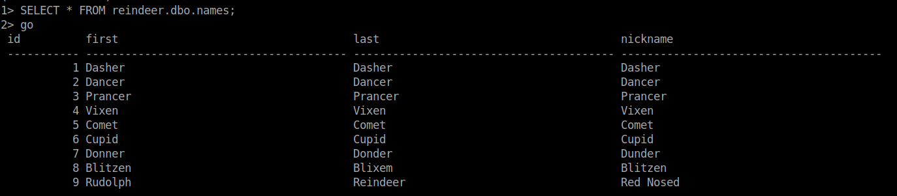

A: Rudolph

4. Check the table schedule. What is the destination of the trip scheduled on December 7?

- We run: 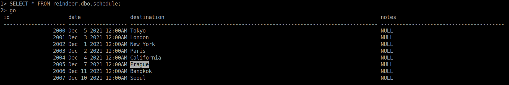

A: Prague

5. Check the table presents. What is the quantity available for the present “Power Bank”?

- We run: 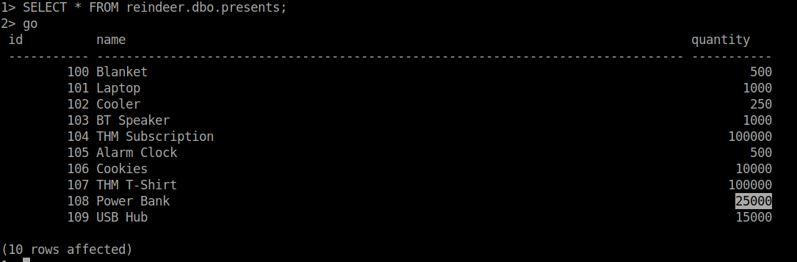

A: 25000

6. There is a flag hidden in the grinch user's home directory. What are its contents?

- Checked out the directories in `C:\Users\grinch` using the command:

```sqsh
1> xp_cmdshell 'dir c:\Users\grinch'
2> go
```

- Nothing interesting popped up, so I checked the Documents directory next:

```sqsh
1> xp_cmdshell 'dir c:\Users\grinch\Documents'
2> go
```
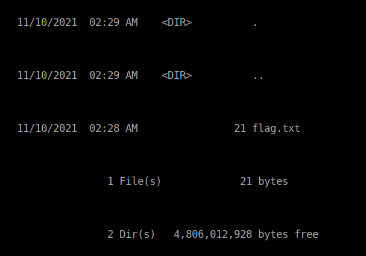

- Found it! Now we use `type` to get the content of the file:

```sqsh
1> xp_cmdshell 'type c:\Users\grinch\Documents\flag.txt'
2> go
```
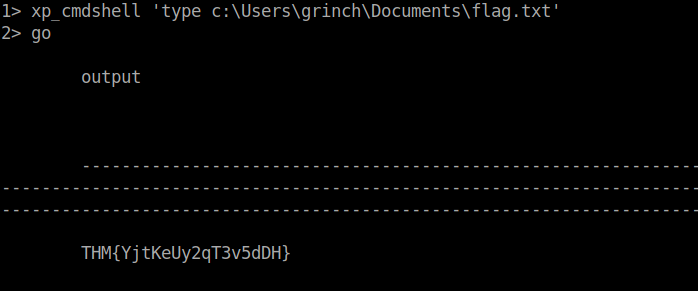

A: THM{YjtKeUy2qT3v5dDH}


## [Day 12] `Networking` Sharing Without Caring

#nfs

- **Network File System (NFS)** is a protocol that allows the ability to *transfer files* between different computers and is available on many systems, including MS Windows and Linux.

- Now that we have discovered an NFS service is listening, let’s check what files are being shared. 

	- We can do this using the command `showmount`

- to mount the shares we have discovered, we can create a directory tmp1. 
	
	- Then we can use this directory to mount the public NFS share using: `mount 10.10.144.30:/my-notes tmp1`.

## Questions

1. Scan the target server with the IP MACHINE_IP. Remember that MS Windows hosts block pings by default, so we need to add -Pn, for example, nmap -Pn MACHINE_IP for the scan to work correctly. How many TCP ports are open?

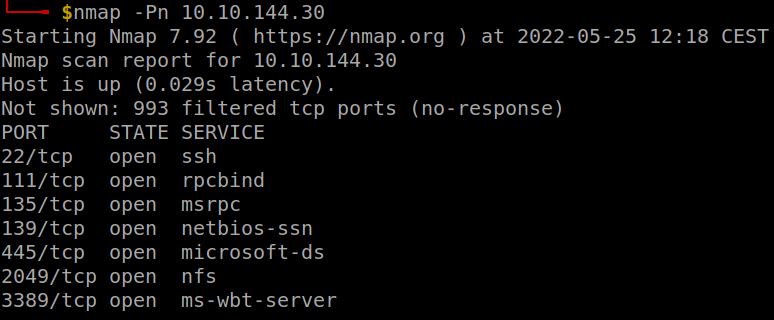

A: 7

2. In the scan results you received earlier, you should be able to spot NFS or mountd, depending on whether you used the -sV option with Nmap or not. Which port is detected by Nmap as NFS or using the mountd service?

- Check the result of nmap

A: 2049

3. How many shares did you find?

- We run `showmount -e 10.10.144.30`, where `-e` is `--exports` and shows the NFS server's export list

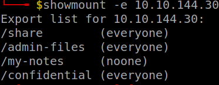

A: 4

4. How many shares show “everyone”?

A: 3

5. What is the title of file 2680-0.txt?

- Had to use sudo to make it work
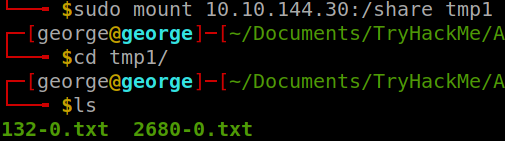

- using `less 2680-0.txt` gets me the answer

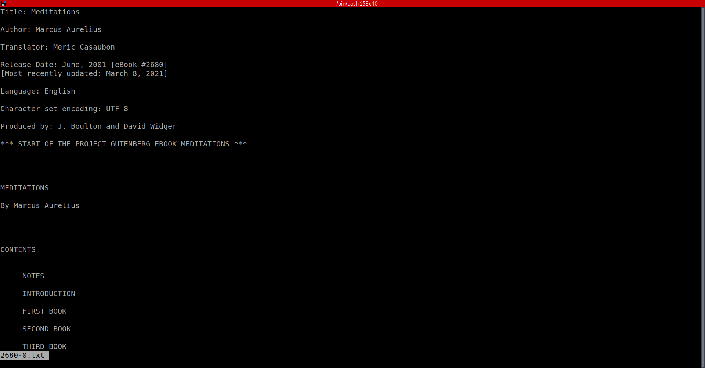

A: Meditations

6. It seems that Grinch Enterprises has forgotten their SSH keys on our system. One of the shares contains a private key used for SSH authentication (id_rsa). What is the name of the share?

- We had two choices for the shares to look into: confidential and admin-files

- I tried the former: created another directory and then mount the share on that newly created directory.

- inside it, we can find an ssh directory with the ssh keys in there.

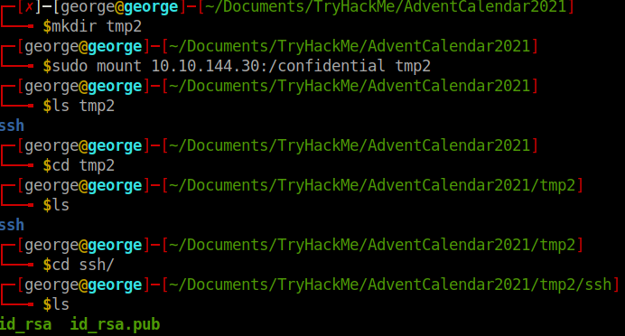

A: confidential

7. We can calculate the MD5 sum of a file using md5sum FILENAME. What is the MD5 sum of id_rsa?

- `md5sum id_rsa`

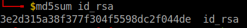

A: 3e2d315a38f377f304f5598dc2f044de


## [Day 13] `Networking` They Lost The Plan!

#windows #privilegeescalation

- On a typical Windows server, you may find several different account types; these are summarized below.

    - **Domain Administrators**: This is typically the highest account level you will find in an enterprise along with Enterprise Administrators. An account with this level of privilege can manage all accounts of the organization, their access levels, and almost anything you can think of. A "domain" is a central registry used to manage all users and computers within the organization.
    
    - **Services**: Accounts used by software to perform their tasks such as back-ups or antivirus scans.
    
    - **Domain users**: Accounts typically used by employees. These should have just enough privileges to do their daily jobs. For example, a system administrator may restrict a user's ability to install and uninstall software.
    
    - **Local accounts**: These accounts are only valid on the local system and can not be used over the domain.

### Windows Privilege Escalation Vectors

- Vectors:

	- `Stored Credentials`: Important credentials can be saved in files by the user or in the configuration file of an application installed on the target system.
    
	- `Windows Kernel Exploit`: The Windows operating system installed on the target system can have a known vulnerability that can be exploited to increase privilege levels.
    
    - `Insecure File/Folder Permissions`: In some situations, even a low privileged user can have read or write privileges over files and folders that can contain sensitive information.
    
    - `Insecure Service Permissions`: Similar to permissions over sensitive files and folders, low privileged users may have rights over services. These can be somewhat harmless such as querying the service status (SERVICE_QUERY_STATUS) or more interesting rights such as starting and stopping a service (SERVICE_START and SERVICE_STOP, respectively).
    
	- `DLL Hijacking`: Applications use DLL files to support their execution. You can think of these as smaller applications that can be launched by the main application. Sometimes DLLs that are deleted or not present on the system are called by the application. This error doesn't always result in a failure of the application, and the application can still run. Finding a DLL the application is looking for in a location we can write to can help us create a malicious DLL file that will be run by the application. In such a case, the malicious DLL will run with the main application's privilege level. If the application has a higher privilege level than our current user, this could allow us to launch a shell with a higher privilege level.
    
    - `Unquoted Service Path`: If the executable path of a service contains a space and is not enclosed within quotes, a hacker could introduce their own malicious executables to run instead of the intended executable.
    
    - `Always Install Elevated`: Windows applications can be installed using Windows Installer (also known as MSI packages) files. These files make the installation process easy and straightforward. Windows systems can be configured with the "AlwaysInstallElevated" policy. This allows the installation process to run with administrator privileges without requiring the user to have these privileges. This feature allows users to install software that may need higher privileges without having this privilege level. If "AlwaysInstallElevated" is configured, a malicious executable packaged as an MSI file could be run to obtain a higher privilege level.
    
    - 	`Other software`: Software, applications, or scripts installed on the target machine may also provide privilege escalation vectors.

### Initial Information Gathering

- Users on the target system. 
	
	- The `net users` command will list users on the target system.

- OS version: 

	- The `systeminfo | findstr /B /C: "OS Name"/C: "OS Version"` command will output information about the operating system.

- Installed services: 

#wmic

	- the `wmic service list` command will list services installed on the target system
### Questions

1. Complete the username: p.....

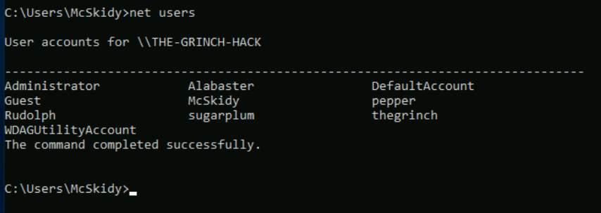

A: pepper

2. What is the OS version?

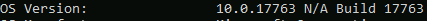

A: 10.0.17763 N/A Build 17763

3. What backup service did you find running on the system?

- Ran `wmic service list | findstr "Iperius"`

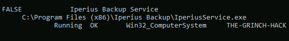

A: IperiusSVC

4. What is the path of the executable for the backup service you have identified?

- Copy from the result of the previous command

A: C:\Program FIles (x86)\Iperius Backup\IperiusService.exe

5. Run the whoami command on the connection you have received on your attacking machine. What user do you have?

A: the-grinch-hack\thegrinch

6. What is the content of the flag.txt file?

A: THM-736635221

7. The Grinch forgot to delete a file where he kept notes about his schedule! Where can we find him at 5:30?

A: jazzercize


## [Day 14] `Networking` Dev(Insecure)Ops

#devops #ci #cd

### What is CI/CD

- `CI`: **Continuous Integration** is the process in which software source code is kept in a central repository (such as GitHub). 
	
	- All changes are stored in this central repository to avoid ending up with different versions of the same code.

- `CD`: **Continuous Delivery** is the following (sometimes integral) step of the continuous integration model where code is automatically deployed to the test, pre-production, or production environments. 

	- CD is sometimes used as an acronym for "**Continuous Deployment**". 

- If you feel like the terms above don't seem to have clear limits, you are right.

	- CI, CD, and the other CD are all part of DevOps best practices that aim to make code delivery *faster* and *more reliable*.

- **CI/CD** should be considered as a *set of practices* that are put in place to enable development teams to make changes, test their code, and deploy the application more reliably.

- However, some risks associated with the CI/CD process should be taken into consideration when dealing with such an integration. 

	- As a penetration tester, one of our goals would be to uncover weaknesses in the automation process. 

- These can vary from file permissions to configuration errors made when installing any CI/CD automation software. 

	- DevOps teams typically use software such as Jenkins, GitLab, Bamboo, AWS CodePipeline, etc., to automate CI/CD steps summarized above.

- Major risks related to a CI/CD integration:

    - `Access security`: The increasing number of integration points can make access management difficult. Any component integrated with the process may need partial or full access to another component. In this case, allowing too much access can also open a path for malicious activity.
    
    - `Permissions`: Components are connected with each other and perform their tasks with user accounts. Similar to access security, user permissions should be checked.
    
    - `Keys and secrets`: Many integrations are done using keys (API keys, ID keys, etc.) or secrets. These should be secured. Otherwise, anyone could potentially access resources using this authentication method.

    - `User security`: User accounts are another successful attack vector often used by cybercriminals. Any user who has access to the source code repository could include a malicious component in the codebase and could be included in the deployed application.
	
	- `Default configuration`: Some platforms are known to have default credentials and vulnerabilities. If the default credentials are not changed, and in use within the CI/CD process, this could result in the complete compromise of the infrastructure.


### Questions

1. How many pages did the dirb scan find with its default wordlist?

- Used `dirb http://10.10.173.24`

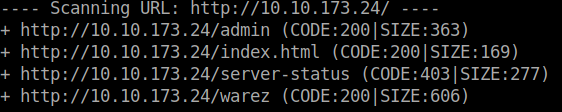

A: 4

2. How many scripts do you see in the /home/thegrinch/scripts folder?

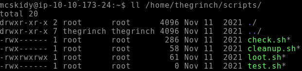

A: 4

3. What are the five characters following $6$G in pepper's password hash?

- Changed the content of the loot.sh script to `cat /etc/shadow > /var/www/html/ls.html` and after some time I got the result on the web page.

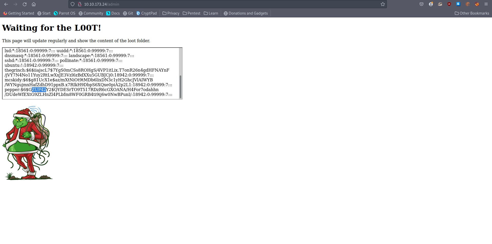

A: ZUP42

4. What is the content of the flag.txt file on the Grinch's user’s desktop?

- I used the same loot.sh script but this time I added the command `cat /home/thegrinch/Desktop/flag.txt > /var/www/html/ls.html`

A: DI3H4rdIsTheBestX-masMovie! 

## [Day 16] `OSINT` Ransomware Madness

#osint

- OSINT stands for **Open Source Intelligence**, information that can be obtained from free and public sources. 
	
	- Offensive teams commonly use OSINT to perform reconnaissance on a target, an individual, or a corporation.

- **Information** is at the core of OSINT; information is typically found in two places:

    - `Clearnet`: This refers to anything you can publicly access from your traditional web browser, including:
    	- Facebook
        - Twitter
        - GitHub

    - `Darknet`: The darknet is accessed using special software and requires additional configuration; it is most commonly used by privacy-minded individuals, whistleblowers, censored people, criminals, journalists, and government law enforcement agencies. Below are a few examples of what the darknet has to offer:

        - TOR
        - Freenet
        - I2P
        - IPFS
        - Zeronet

### OSINT Process Cycle

- The **RIS OSINT data-information model** outlines an approach to gathering information to identify and categorize data.

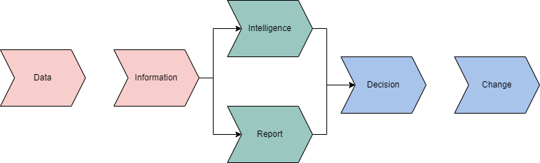

- Intelligence is obtained from information that is obtained from data. 

	- Intelligence will ultimately lead you or your customer to a decision. 

		- This decision will determine where in the next model you will move. 

- The RIS OSINT Roller Coaster outlines phases of an OSINT investigation centering around the client. 

- This is an ever-evolving process that will change and continue depending on intelligence and decisions from the previous model.

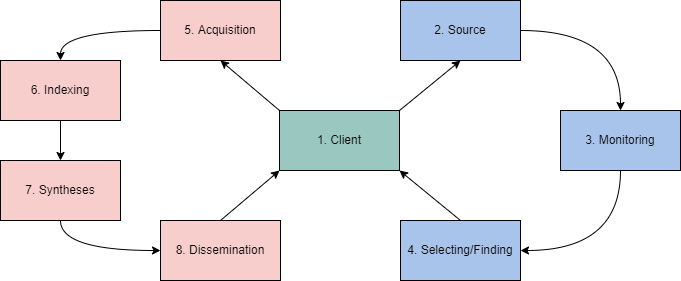

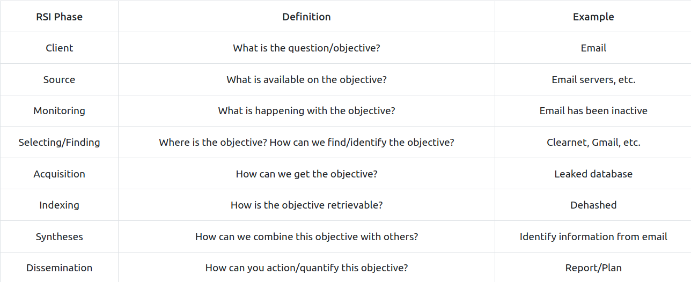

### Account Discovery & Analysis

- When analyzing a target's account, we are commonly looking at the following objectives:

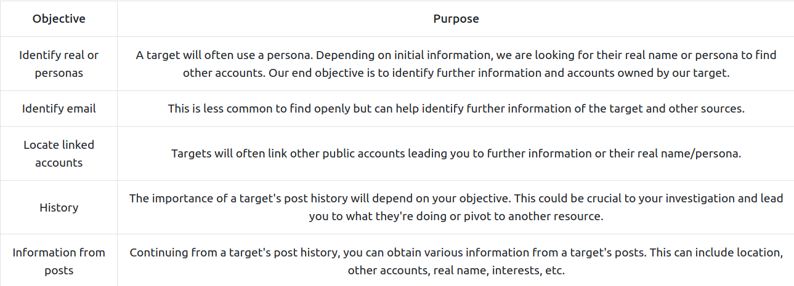
	
### Google Dorking

#googledorking

- unfortunately, a simple google search will not necessarily get us what we want or will not be as **granular** as we would like. 

- Google has a known feature called "google dorks" that will allow you to use specific syntax in a search query to filter further and make your search more granular.

- Some examples:

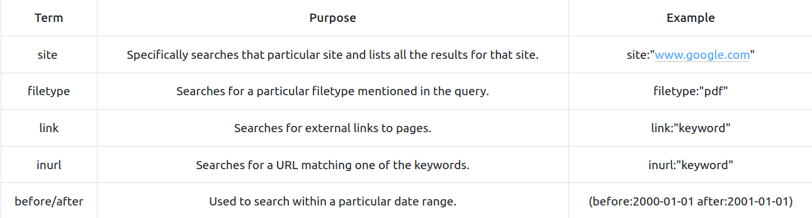

- a complete list of google dork terms can be found [here](https://www.sans.org/posters/google-hacking-and-defense-cheat-sheet/) and [here](https://gist.github.com/sundowndev/283efaddbcf896ab405488330d1bbc06)

### OSINT & The Blockchain

#blockcahin

- With the introduction of Web 3.0, a decentralized web protocol set in its infancy, and the increased popularity in cryptocurrencies, OSINT from a blockchain technology and decentralization perspective has become increasingly important. 

- A core principle of blockchain technology and decentralization is anonymity. 

	- How can you gather information on a target if they are anonymous?

- Blockchain technology is completely open while remaining anonymous; this comes with its pros and cons from an OSINT perspective; we can quickly identify specific identifiers but linking them can become difficult. 

- Multiple tools aid in exploring the blockchain, including but not limited to,

    - Blocktrail
    - Bitcoin Who's Who
    - Graphsense
    - Block Explorer

#important

- An example of an unintentional information leak from *GitHub* could be a company that `forgot to delete its API keys from a JSON file`. They made a new commit to their repository with the thought that no one could access those keys anymore. Anyone can look at a public repository commit history and view exactly what was deleted and added to the repository.

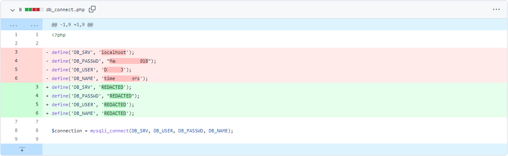
### Questions

1. What is the operator's username?

- Translated the text in russian and got a personal identification code and a username.

A: GrinchWho31

2. What social media platform is the username associated with?

- searched the username on google and found 3 interesting things:

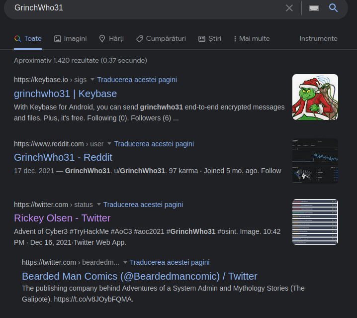

- Tried Reddit first but it was not the one. Twitter remained.

A: twitter

3. What is the cryptographic identifier associated with the operator?

- On his twitter account, I found this tweet:

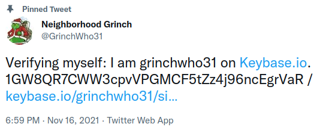

A: 1GW8QR7CWW3cpvVPGMCF5tZz4j96ncEgrVaR

4. What platform is the cryptographic identifier associated with?

- In the same tweet we can find the answer.

A: keybase.io

5. What is the bitcoin address of the operator?

- On his profile on keybase.io, we can see there is a bitcoin address in his description

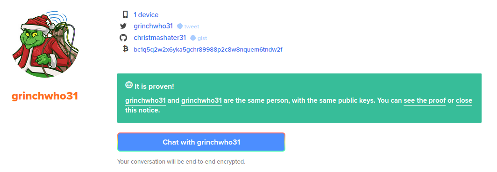

A: bc1q5q2w2x6yka5gchr89988p2c8w8nquem6tndw2f


6. What platform does the operator leak the bitcoin address on? 
 
- If we go to the github link there, we can see two projects.

- the second one is more interesting and it contains a `.cpp` file with a comment that includes the bitcoin address

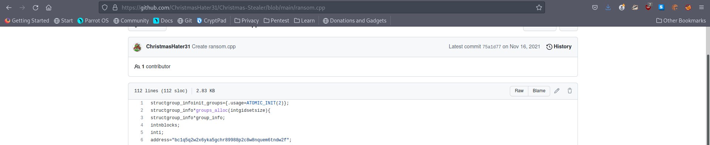

A: GitHub

7. What is the operator's personal email?

- To answer the following two questions, I checked the commits of the bash script in the other repositories. And indeed, he left some important info there :)

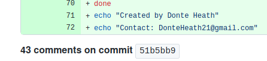

A: DonteHeath21@gmail.com

8. What is the operator's real name?

A: Donte Heath

## [Day 17] `Cloud` Elf Leaks

#aws

- **Amazon AWS** is a public cloud service provider. 

- As of their most recent financial disclosures, AWS accounts for the bulk of Amazon's profit. 

- Most major enterprises leverage AWS in some form or another for *Compute Services*, *Big Data* or *Machine Learning*, *Data Archive*, *Video Streaming*, *IoT*, etc. 

- The number of services AWS supports is so vast that we can barely fit it all in this screenshot. 

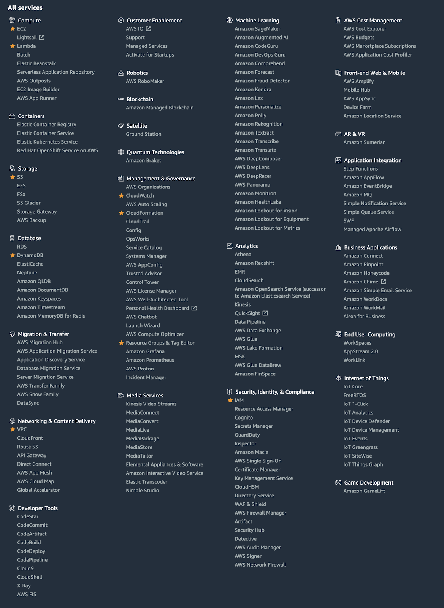

- AWS divides its infrastructure into Regions, mostly independent clusters of datacenters. 

- Within each region are **availability zones (AZ)**. 

- Each AZ in a region leverages separate power grids and usually are located in different flood plains. 

	- This redundancy allows you to establish highly resilient architectures to withstand significant weather or geological events, or more frequently, hardware or facility failures. 

- Because regions are independent - you'll get different answers to questions depending on the region you are querying. 

	- You can specify a region with the `--region` option to the AWS CLI. 

### Amazon S3

#s3 	

- **Amazon S3 (Simple Storage Service)** is their hosted object storage service. 

	- Objects are stored in **Buckets**. 

- To highly simplify the concept of object storage, Buckets are **key-value stores**, with the Object Key being a full pathname for a file and the value being the contents of the file. 

	- S3 is a **publicly hosted service** - it doesn't exist behind a corporate firewall, making it convenient for hosting public content.

- AWS Buckets use a global namespace. 

	- Only one AWS customer can create a bucket named `bestfestivalcompany-images`

- Amazon S3 is used for more than public hosting. 

	- It has many uses for **data archive**, **video processing**, **regulatory record retention**, etc. 

- The challenge for Best Festival Company, like any enterprise using S3, is that sometimes data gets mixed up, and data that shouldn't be public gets made public.

### Discovering Bucket Names

-  One of the easiest ways is when a company embeds content hosted in S3 on their website. 

- Images, PDFs, etc., can all be hosted cheaply in S3 and linked from another site. These links will look like this: 

	- `http://BUCKETNAME.s3.amazonaws.com/FILENAME.ext` 

- or

	- `http://s3.amazonaws.com/BUCKETNAME/FILENAME.ext`

- Amazon S3 is one of AWS's oldest services. 

- It's so old that it has two different methods of access control: [Bucket Policies](https://docs.aws.amazon.com/AmazonS3/latest/userguide/bucket-policies.html) and [S3 ACLs](https://docs.aws.amazon.com/AmazonS3/latest/userguide/managing-acls.html).

- Downloading an object from S3 is also easy. You can use curl:

	- `curl http://irs-form-990.s3.amazonaws.com/201101319349101615_public.xml`

- or the AWS CLI:

	- `aws s3 cp s3://irs-form-990/201101319349101615_public.xml . --no-sign-request`

- (The option `--no-sign-request` allows you to request data from S3 without being an AWS Customer. )

- Note the two different URIs for an object. Objects can be addressed with `http://` or via `s3://`

### The different levels of Amazon S3 Authentication

- In Amazon S3, Object permissions are different from Bucket permissions. 

	- Bucket permissions allow you to *list the objects in a bucket*, while the object's permissions will enable you *to download the object*.

- There are also two levels of public buckets and objects. 

- The first level is "**Anyone**." 

- The second level is just as **public** - and that is public to **Any AWS Customer** (what AWS foolishly called AuthenticatedUsers for many years). 

	- *Anyone* with a *credit card* can create an AWS account; therefore, Authenticated Users doesn't provide much data protection.

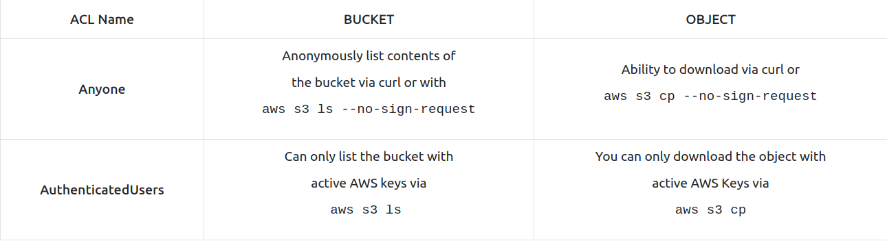

### AWS IAM

#iam

- Excluding a few older services like Amazon S3, all requests to AWS services must be signed. 

- This is typically done behind the scenes by the AWS CLI or the various Software development Kits that AWS provides. 

- The signing process leverages **IAM Access Keys**. 

	- These access keys are one of the primary ways an AWS account is compromised.

- IAM Access Keys consist of an **Access Key ID** and the **Secret Access Key**. 

- Access Key IDs always begin with the letters **AKIA** and are *20 characters long*. 

	- These act as a *user name* for the AWS API.  

- The Secret Access Key is *40 characters long*. 
	
	- AWS generates both strings; however, AWS doesn't make the Secret Access Key available to download after the initial generation. 

- There is another type of credentials, **short-term credentials**, where the Access Key ID begins with the letters **ASIA** and includes an additional string called the **Session Token**.

- When you find credentials to AWS, you can add them to your AWS Profile in the AWS CLI. 

- For this, you use the command:

	- `aws configure --profile PROFILENAME`

- This command will add entries to the `.aws/config` and `.aws/credentials` files in your user's home directory. 

- Once you have configured a new profile with the new access keys, you can execute any command using this other set of credentials. 

- For example, to list all the S3 Buckets in the AWS account you have found credentials for, try:

	- `aws s3 ls --profile PROFILENAME`

- A few other common AWS reconnaissance techniques are:

    - Finding the Account ID belonging to an access key:

    	- `aws sts get-access-key-info --access-key-id AKIAEXAMPLE `

    - Determining the Username the access key you're using belongs to

    	- `aws sts get-caller-identity --profile PROFILENAME`

    - Listing all the EC2 instances running in an account

    	- `aws ec2 describe-instances --output text --profile PROFILENAME`

    - Listing all the EC2 instances running in an account in a different region
    
    	- `aws ec2 describe-instances --output text --region us-east-1 --profile PROFILENAME`

## AWS ARNs

#awsarn

- An Amazon ARN is their way of generating a unique identifier for all resources in the AWS Cloud. 

- It consists of multiple strings separated by colons.

- The format is:

	- `arn:aws:<service>:<region>:<account_id>:<resource_type>/<resource_name>`

### Questions

1. What is the name of the S3 Bucket used to host the HR Website announcement?

- The link of the image gave it away: `https://s3.amazonaws.com/images.bestfestivalcompany.com/flyer.png`

A: images.bestfestivalcompany.com

2. What is the message left in the flag.txt object from that bucket?

- Just changed the link to get the desired file from the bucket: `https://s3.amazonaws.com/images.bestfestivalcompany.com/flag.txt`

A: It's easy to get your elves data when you leave it so easy to find!

3. What other file in that bucket looks interesting to you?

- To get the content of the bucket, I used the command `aws s3 ls s3://images.bestfestivalcompany.com/ --no-sign-request` and got the results:

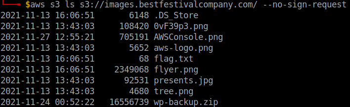

- The backup file looks suspiciously good :)

A: wp-backup.zip

4. What is the AWS Access Key ID in that file?

- downloaded the file using aws CLI, as curl did not work for me, using: `aws s3 cp s3://images.bestfestivalcompany.com/wp-backup.zip . --no-sign-request`

- Then I used `grep -iRl AKIA` to search for the string in the newly downloaded file

- Two results:

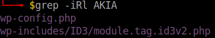

- A simple `cat` of the first file and the AKIA string is visible.

A: 

5. What is the AWS Account ID that access-key works for?

- That file also gave us the Secret Access Key.

- We use this and the profile hr (that we know about from the problem statement) and the Access Key Id to configure a profile.

- Running the command `aws sts get-access-key-info --access-key-id <access-key-id>` after that gives us the Account ID:

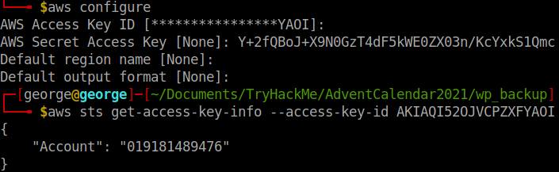

A: 019181489476

6. What is the Username for that access-key?

- I knew I had to use the command `aws sts get-caller-identity --profile hr`, but I had no profile configuration with that name.

- So I created one more, making sure now that I provide the name using `aws configure --profile hr`:

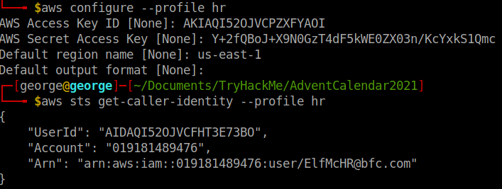

A: ElfMcHR@bfc.com

7. There is an EC2 Instance in this account. Under the TAGs, what is the Name of the instance?

- Used the command `aws ec2 describe-instances --output text --profile hr`

- After some trial and error, I found the name:

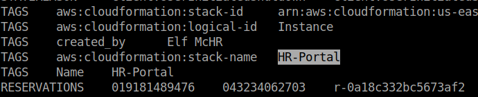

A: HR-Portal

8. What is the database password stored in Secrets Manager?

- To list the secrets, I used `aws secretsmanager list-secrets --profile hr`

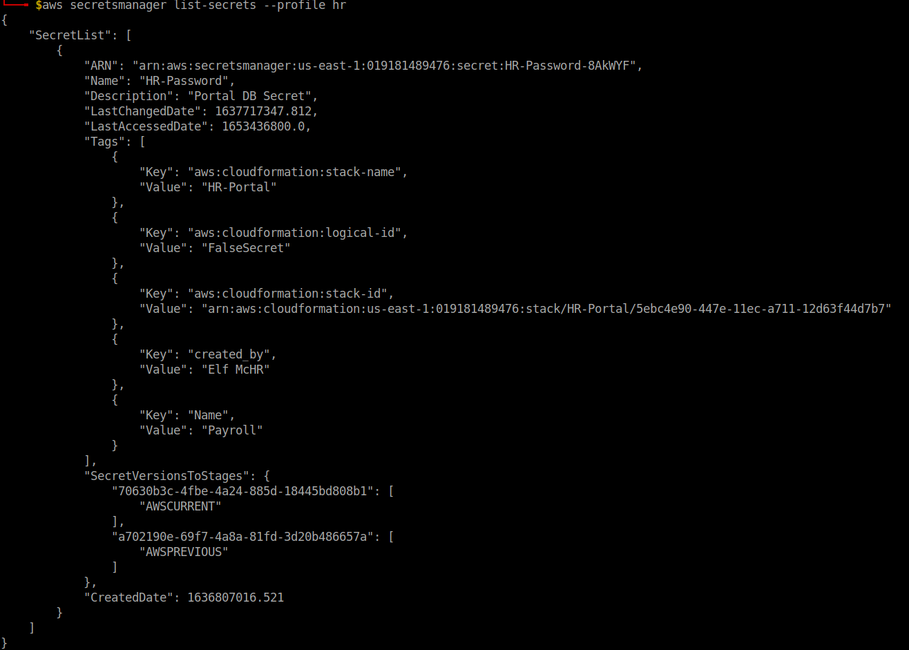

- Then tried this:

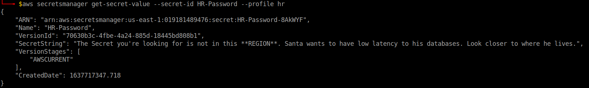

- So we have to change the region to somethin `xx-north-x`

- After trying some regions, I finally found the right one that gave me the password: `aws secretsmanager get-secret-value --secret-id HR-Password --profile hr --region eu-north-1`


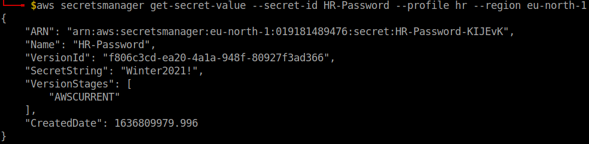

A: Winter2021!


## [Day 18] `Cloud` Playing With Containers

#docker #ecr

- **AWS Elastic Container Registry (ECR)** - an online registry for public and private container images. 

- Specifically, the term "Docker" is used to describe:

    - **Docker API** - a local communication interface on a configured Linux machine, with standardized commands used to communicate with a Docker Daemon.
    
    - **Docker Daemon** - a process that runs on your machine (the Docker daemon), to interact with container components such as images, data volumes, and other container artifacts.
    
    - **Docker Container Image Format** - ultimately a .tar file. For Version 1, the docker image format was not strictly compliant with the OCI Image Specification. For our purposes, this won't change how we interact with container images in this exercise, but it does slightly change the format and content of a container image.

- Docker containers are stored in "*repositories*", which are a reference to file mappings the Docker daemon knows how to reach, which include the container .tar files. 

	- Each image in a repository will include an image tag, and images can be referenced using either their tag or Image ID.

- Retrieve a docker image: `docker pull public.ecr.aws/h0w1j9u3/grinch-aoc:latest`

- You can run the container and interact with it by running the following command:

	- `docker run -it public.ecr.aws/h0w1j9u3/grinch-aoc:latest`, which will open a shell inside the container image, as indicated by the $.

- Save the container image as a `.tar` file: `docker save -o aoc.tar public.ecr.aws/h0w1j9u3/grinch-aoc:latest`

#important
- A good place to check next is environment variables - in Linux and especially for containers, environment variables may be used to store secrets or other sensitive information used to configure the container at run-time.

- So we try `printenv` to learn more about the environment configurations where we see:

- A container image is composed of a number of layers 

- Container images are built from a source file known as a `Dockerfile`

- Dockerfiles are a list of new-line separated instructions that instruct the Docker daemon how to generate a container image.

### Questions

1. What command will list container images stored in your local container registry?

A: docker images

2. What command will allow you to save a docker image as a tar archive?

A: docker save

#important
3. What is the name of the file (including file extension) for the configuration, repository tags, and layer hash values stored in a container image?

A: manifest.json

4. What is the token value you found for the bonus challenge?

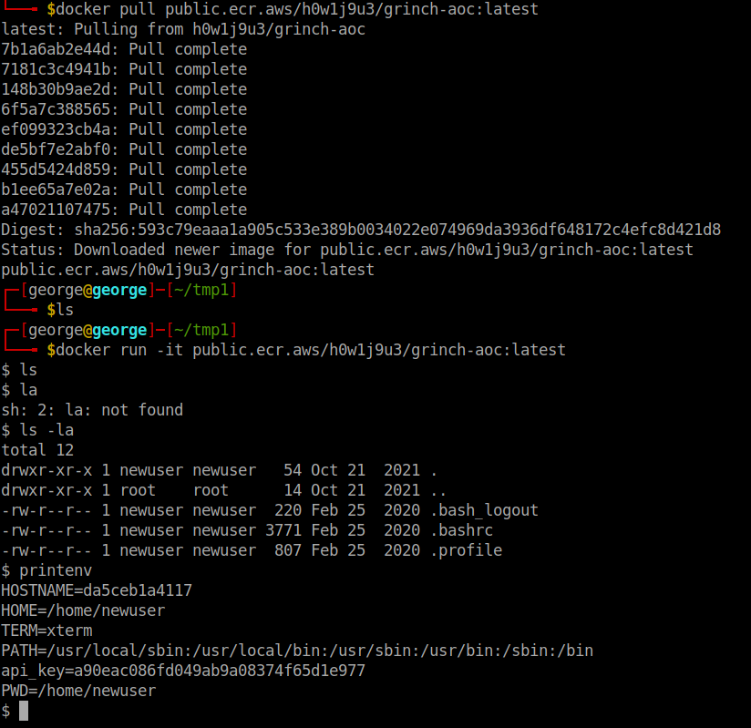

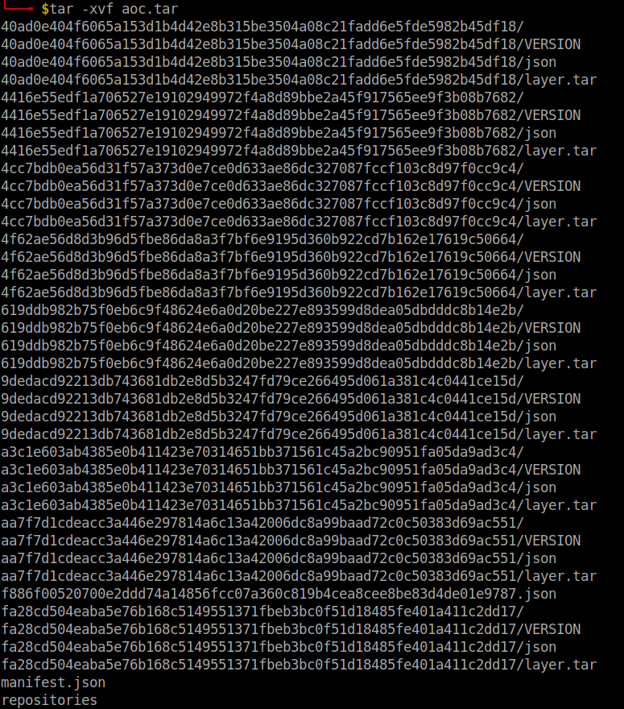

- Installed `jq`, which makes it easier to read the layers of the container image.

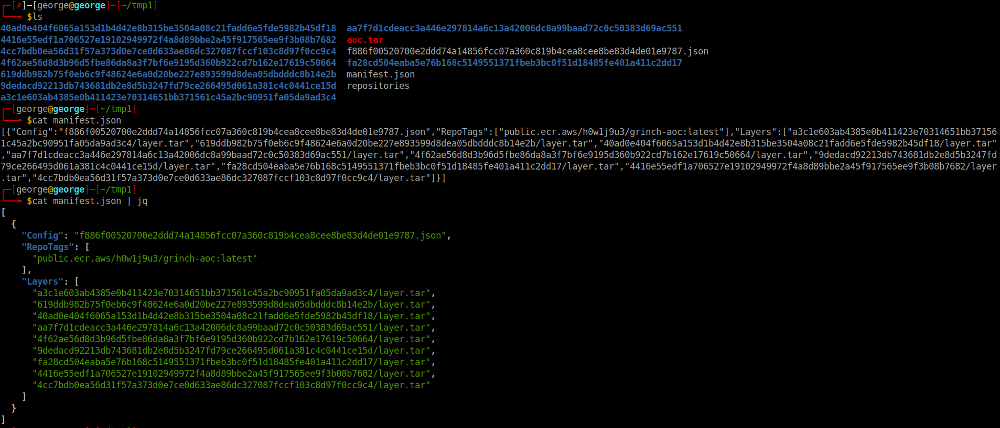

- `f886f00520700e2ddd74a14856fcc07a36c819b4cea8cee8be83d4de01e9787.json` is the configuration files

- Untarred the layer that included the repository pulled from GitHub and using `cat root/envconsul/config.hcl | grep token` I found the value of the token:

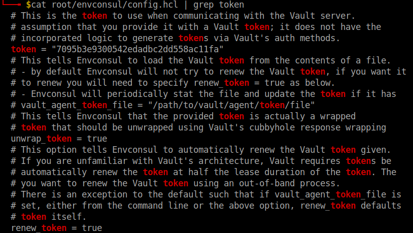

A: 7095b3e9300542edadbc2dd558ac11fa


## [Day 19] `Blue Teaming` Something Phishy Is Going On

#phishing

- Official [definition](https://attack.mitre.org/techniques/T1566/):

	- Adversaries may send phishing messages to gain access to victim systems. All forms of phishing are electronically delivered social engineering. Phishing can be targeted, known as spearphishing. In spearphishing, a specific individual, company, or industry will be targeted by the adversary. More generally, adversaries can conduct non-targeted phishing, such as in mass malware spam campaigns.

	- Adversaries may send victims emails containing malicious attachments or links, typically to execute malicious code on victim systems. Phishing may also be conducted via third-party services, like social media platforms. Phishing may also involve social engineering techniques, such as posing as a trusted source.

### Questions

1. Who was the email sent to? (Answer is the email address)

- I opened the mail application and under `More` I selected `View Source`.

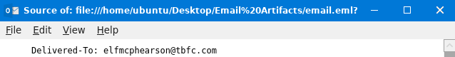

A: elfmcphearson@tbfc.com

2. Phishing emails use similar domains of their targets to increase the likelihood the recipient will be tricked into interacting with the email. Who does it say the email was from? (Answer is the email address)


A: customerservice@t8fc.info

3. Sometimes phishing emails have a different reply-to email address. If this email was replied to, what email address will receive the email response?


A: fisher@tempmailz.grinch

4. Less sophisticated phishing emails will have typos. What is the misspelled word?


A: stright

5. The email contains a link that will redirect the recipient to a fraudulent website in an effort to collect credentials. What is the link to the credential harvesting website?

A: https://89xgwsnmo5.grinch/out/fishing/

6. View the email source code. There is an unusual email header. What is the header and its value?

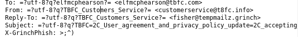

A: X-GrinchPhish: >;^)

7. You received other reports of phishing attempts from other colleagues. Some of the other emails contained attachments. Open attachment.txt. What is the name of the attachment?

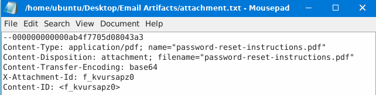

A: password-reset-instructions.pdf

8. What is the flag in the PDF file?

- Used `cat attachment-base64-only.txt |base64 -d > rez.pdf` to decode the attachment and then create the resulting pdf.

- opened the PDF and got the flag

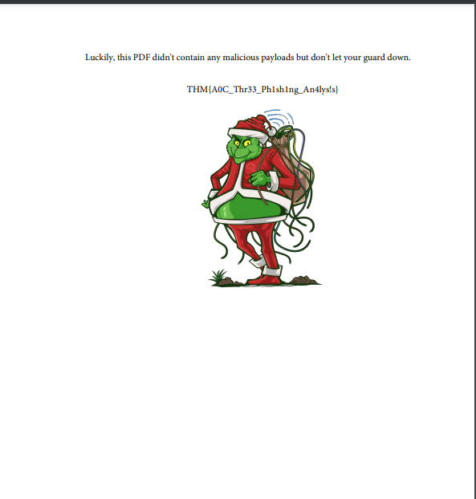

A: THM{A0C_Thr33_Ph1sh1ng_An4lys!s}


## [Day 20] `Blue Teaming` What's the Worst That Could Happen?

#virustotal #md5 #strings

### Questions
1. Open the terminal and navigate to the file on the desktop named 'testfile'. Using the 'strings' command, check the strings in the file. There is only a single line of output to the 'strings' command. What is the output?

- Went to `Desktop` on the deployed machine and ran `strings` on `testfile`

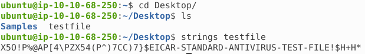

A: X5O!P%@AP[4\PZX54(P^)7CC)7}$EICAR-STANDARD-ANTIVIRUS-TEST-FILE!$H+H*

2. Check the file type of 'testfile' using the 'file' command. What is the file type?

- ran the `file` command

A: EICAR virus test files

3. Calculate the file's hash and search for it on VirusTotal. When was the file first seen in the wild?

- Using `md5sum` I got the hash: 44d88612fea8a8f36de82e1278abb02f

- Searched it on VirusTotal and under `Details` I found the answer

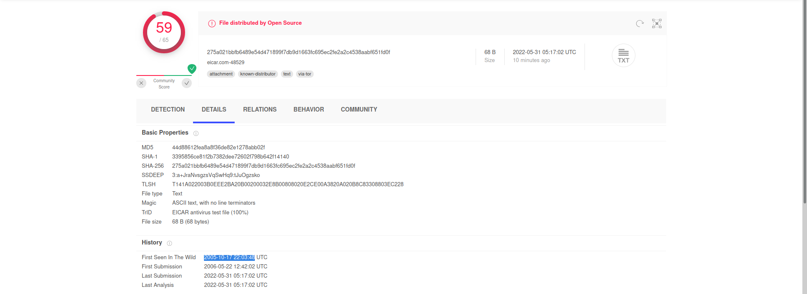

A: 2005-10-17 22:03:48

4. On VirusTotal's detection tab, what is the classification assigned to the file by Microsoft?

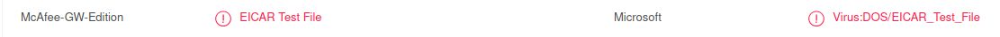

A:  Virus:DOS/EICAR_Test_File

5. Go to this link to learn more about this file and what it is used for. What were the first two names of this file?

- If your test file is a program, then it should also produce sensible results if it is executed. Also, because you probably want to avoid shipping a pseudo-viral file along with your anti-virus product, your test file should be short and simple, so that your customers can easily create copies of it for themselves.

A: ducklin.htm or ducklin-html.htm

6. The file has 68 characters in the start known as the known string. It can be appended with whitespace characters upto a limited number of characters. What is the maximum number of total characters that can be in the file?

A: 128


## [Day 21] `Blue Teaming` Needles In Computer Stacks 

#yara

- YARA is a multi-platform tool for matching patterns of interest in (malicious) files.

- It is used to perform research on malware families and identify malware with similar patterns. 

- It can help in categorizing malware in different malware families, and can also be used as a detection aid for malware analysis. 

- [Repository](https://github.com/InQuest/awesome-yara) with different YARA rules.

- **Syntax**:

```yara
rule rulename
  {
    meta:
      author = "tryhackme"
      description = "test rule"
      created = "11/12/2021 00:00"
    strings:
      $textstring = "text"
      $hexstring = {4D 5A}
    conditions:
      $textstring and $hexstring
  }
```

- A string declaration starts with a `$` sign, followed by the name we want to assign to that string.

	- strings can be text strings or hex strings. 

- Text strings are strings found in the legible text portion of a file, however, hex strings are raw sequences of bytes in a file.

- To define text strings, we use double quotes, and to define hex strings, we use curly brackets. 

- **Conditions**:

	- The condition section defines the conditions that the rule writer wants to meet in order for the rule to hit on a file. 
		- Conditions are boolean expressions, and they use the strings defined in the strings section as variables. 

	- For example, in the example above, we use the and operator between the two strings. 

	- This means that the rule will hit if it identifies a 4D 5A hex string anywhere in the file as well as the text string text. 

		- There is no other condition in this rule. 

	- The most commonly used operators are `and`, `or` and `not`.

- **Metadata**:

- Metadata is an *optional*, but important section in the rules. 

	- It starts with the keyword meta. 

- It can be used to add additional information about the rule to help the analyst in their analysis. 

	- Generally, it contains arbitrarily defined identifiers, and their values, which are universally understood. 

- For example, in our example rule above, we used the identifiers of `author`, `description`, and `created`. 

	- Adding metadata to rules is especially important when contributing to the community, as they provide important contextual information and attribution for the rule.

- The syntax to run a Yara rule can be simply stated as follows:

```bash
yara [options] rule_file [target]
```

- If we run this command as it is, it will return us with the rule name and the file name if the rule is hit. 

	- If the rule is not hit, it will not return anything.

- We can use the `-m` option for Yara to return the metadata when the rule is hit.

- Similarly, we can use the `-s` option to print the strings that matched the file.

- [Yara Documentation](https://yara.readthedocs.io/en/stable/writingrules.html#)

- [Community Written Yara Rules](https://github.com/Yara-Rules/rules)

### Questions

1. We changed the text in the string $a as shown in the eicaryara rule we wrote, from X5O to X50, that is, we replaced the letter O with the number 0. The condition for the Yara rule is $a and $b and $c and $d. If we are to only make a change to the first boolean operator in this condition, what boolean operator shall we replace the 'and' with, in order for the rule to still hit the file?

A: or

2. What option is used in the Yara command in order to list down the metadata of the rules that are a hit to a file? 

A: -m

3. What section contains information about the author of the Yara rule?

A: metadata

4. What option is used to print only rules that did not hit?

- Checked the Yara Documentation website

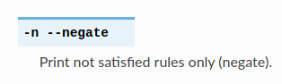

A: -n

5. Change the Yara rule value for the $a string to X50. Rerun the command, but this time with the -c option. What is the result?

- Created a YARA rule and then ran it using `-c` (print number of matches) on `testfile`

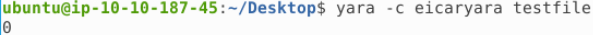

A: 0

## [Day 22] `Blue Teaming` How It Happened

#important
- "**Base64 encoding** schemes are commonly used when there is a need to encode binary data that needs to be stored and transferred over media that are designed to deal with ASCII."  

- While attackers still use this simple form of obfuscation to evade Antivirus detection, it's far from the most effective and stealthy technique.

#ole

- Oledump ([oledump.py](https://blog.didierstevens.com/programs/oledump-py/)) is an excellent tool written in Python by Didier Stevens, which helps you analyze **OLE** (**Compound File Binary Format**) files. 

- You can think of OLE files as 'a mini file system' or similar to a Zip archive. 

	- Applications such as MS Office with extensions `.doc`, `.xls`, `.ppt` are known as OLE files. 

	- Malicious actors can abuse macros to hide malicious commands/scripts within Excel and Word documents.

- [OLE files Documentation](https://olefile.readthedocs.io/en/latest/OLE_Overview.html)

- OLE files could contain storages which are basically folders that contain streams of data or other storages.

#vba
- The M letter next to a stream indicates that the stream contains a `VBA Macro`. 

- Useful options for analyzing OLE files (to explore more options, use the `-m` option):

	- `-A` does an ASCII dump similar to option `-a`, but duplicate lines are removed.
	- `-S` dumps strings.
	- `-d` produces a raw dump of the stream content. 
	- `-s` STREAM NUMBER or --select=STREAM NUMBER allows you to select the stream number to analyze (`-s a` to select all streams)
	- `-d`, `--dump` - perform a raw dump
 	- `-x`, `--hexdump` - perform a hex dump
	- `-a`, `--asciidump` - perform an ascii dump
	- `-S`, `--strings` - perform a strings dump
	- `-v`, `--vbadecompress` - VBA decompression

### Questions

1. What is the username (email address of Grinch Enterprises) from the decoded script?

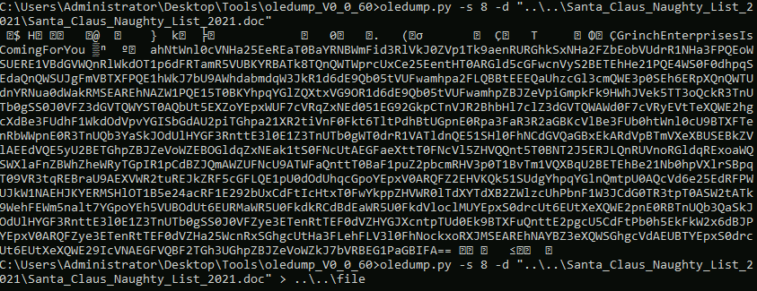

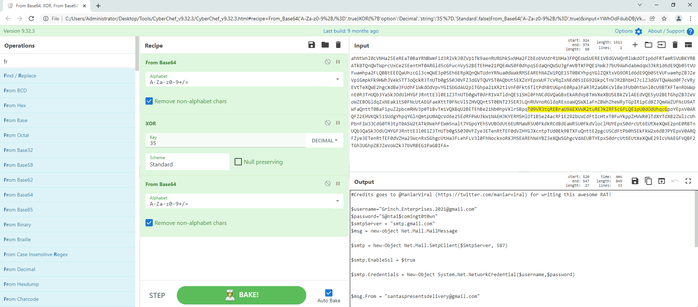

A: Grinch.Enterprises.2021@gmail.com

2. What is the mailbox password you found?

A: S@ntai$comingt0t0wn

3. What is the subject of the email?

A: Christmas Wishlist

4. What port is the script using to exfiltrate data from the North Pole?

A: 587

5. What is the flag hidden found in the document that Grinch Enterprises left behind? (Hint: use the following command oledump.py -s {stream number} -d, the answer will be in the caption).

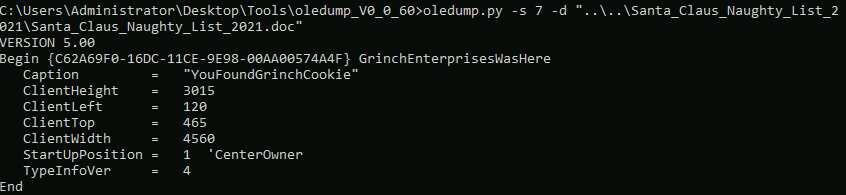

A: YouFoundGrinchCookie

6. There is still a second flag somewhere... can you find it on the machine?

- In the data from stream 8 there was something about the Pictures folder. I checked it and found a png

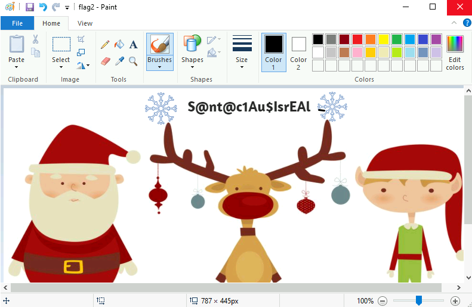

A: S@nt@c1Au$IsrEAI


## [Day 23] `Blue Teaming` PowershELlF Magic

#powershell #logs

- About [Powershell](https://docs.microsoft.com/en-us/powershell/scripting/overview?view=powershell-7.2)

- As defenders, we can audit commands run in the PowerShell console on each workstation. 
	
	- This is known as `PowerShell Logging`. 

- When a PowerShell command or script is run, the activity is logged into the Windows Event Log system. 

- Typically you'll use `Event Viewer` to view event logs locally on a Windows system, but we installed a nifty tool called `Full Event Log View` to help make this a painless experience. 

- Additional resources:

    - [Investigating Windows 2.0:](https://tryhackme.com/jr/investigatingwindows2)
    - [Investigating Windows 3.x:](https://tryhackme.com/jr/investigatingwindows3)
    - [PowerShell for Pentesters:](https://tryhackme.com/jr/powershellforpentesters)

### Questions

1. What command was executed as Elf McNealy to add a new user to the machine?

- Found a proof of concept of CVE-2021-1675 [here](https://github.com/calebstewart/CVE-2021-1675)

A: Invoke-Nightmare

2. What user executed the PowerShell file to send the password.txt file from the administrator's desktop to a remote server?

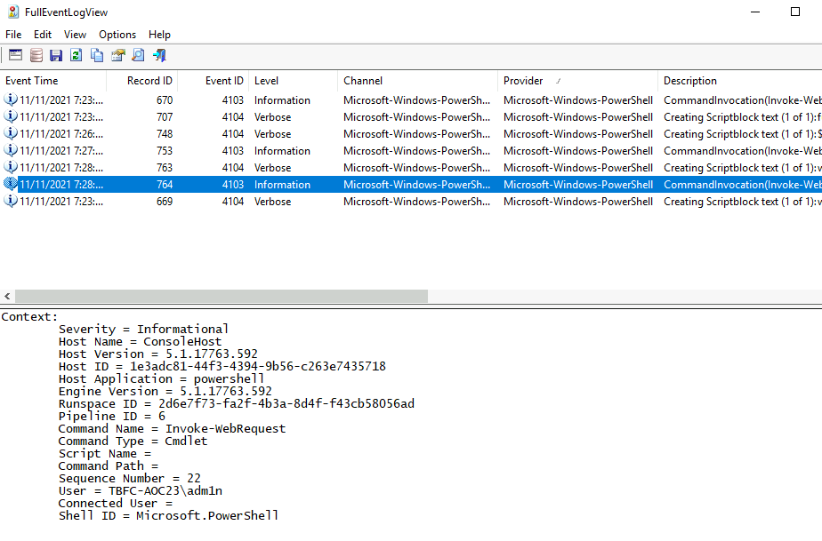

A: adm1n

3. What was the IP address of the remote server? What was the port used for the remote connection? (format: IP,Port)

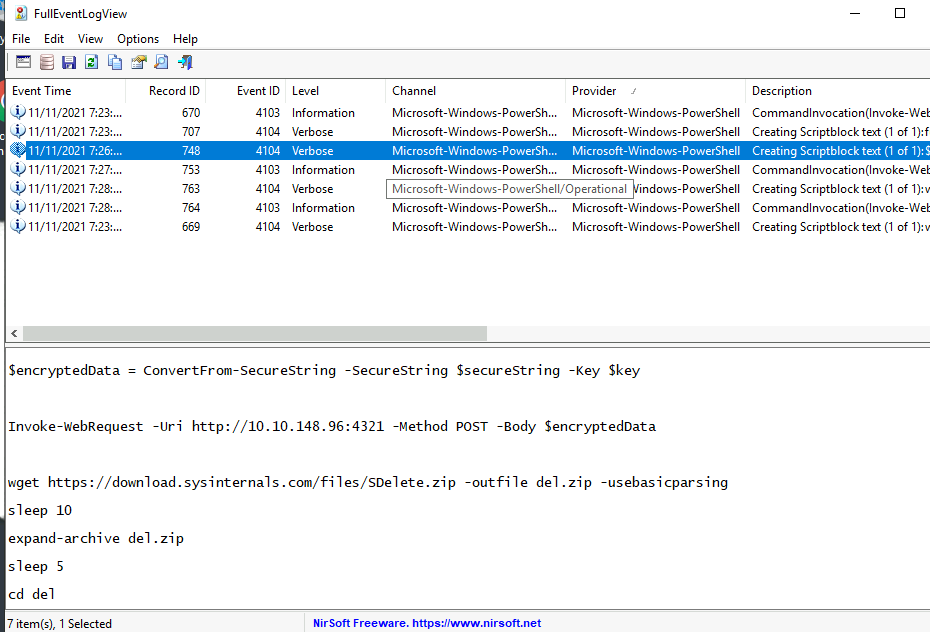

A: 10.10.148.96,4321

4. What was the encryption key used to encrypt the contents of the text file sent to the remote server?

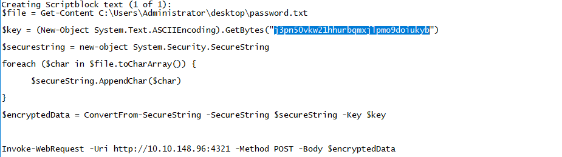

A: j3pn50vkw21hhurbqmxjlpmo9doiukyb

5. What application was used to delete the password.txt file?

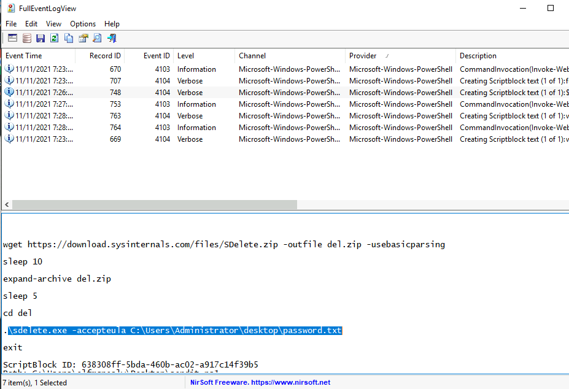

A: sdelete.exe

6. What is the date and timestamp the logs show that password.txt was deleted? (format: MM/DD/YYYY H:MM:SS PM)

- Could not find the right timestamp on the logs I already had so I tried multiple things in the searching menu.

- One thing that worked is modifying the event description string to include `password.txt`

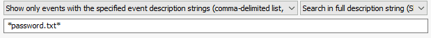

- We got our answer:

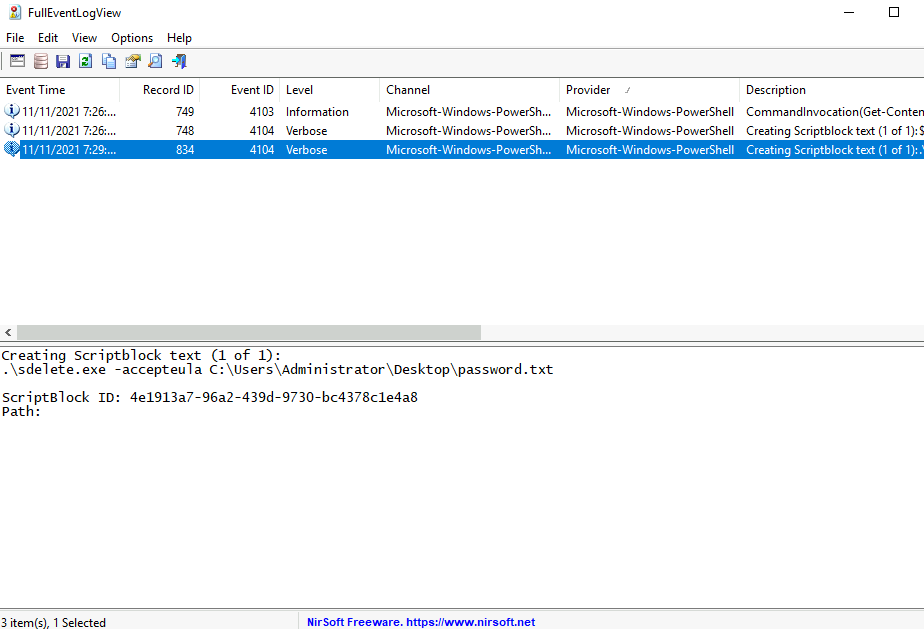

A: 11/11/2021 7:29:27 PM

7. What were the contents of the deleted password.txt file?

- Edited the decryptor with the key we found earlier and the encrypted value

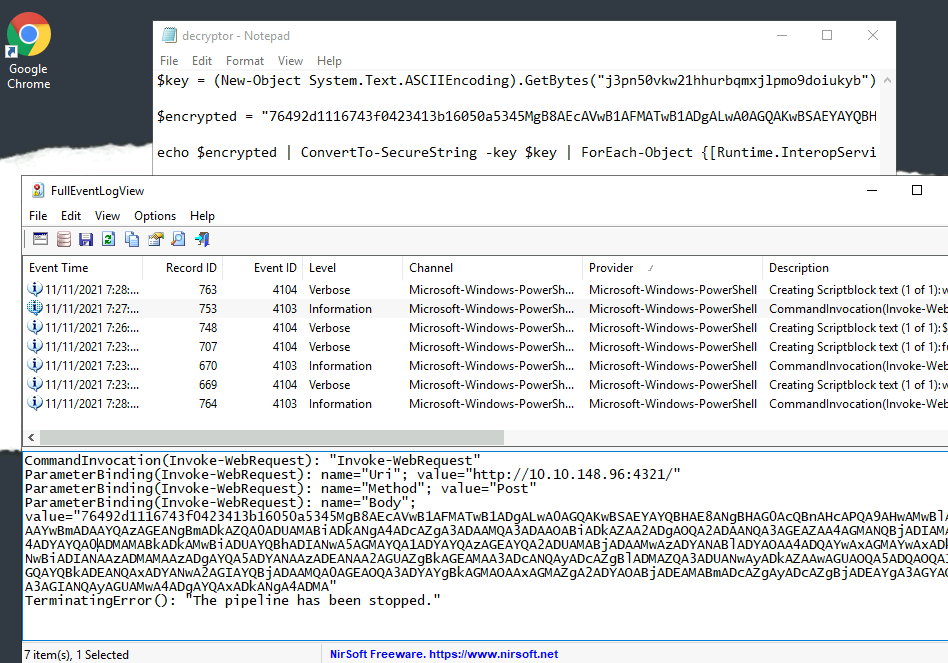

- Ran the decryptor and got the original content of password.txt

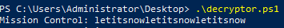

A: Mission Control: letitsnowletitsnowletitsnow


## [Day 24] `Post Exploitation` Learning From The Grinch

#postexploitation

- The post-exploitation stage usually occurs after an attacker has gained unauthorized access to a system. 

- During this stage, an attacker will aim to do the following:

    - **Escalate their privileges**: An attacker would try to obtain access to sensitive information (documentation on how internal technology stacks work or credentials for other systems) or critical functionality that is only available to higher privileged users, e.g., administrative portals to manage users.
    
    - **Maintain persistence within the target environment**: An attacker would set up other mechanisms to maintain access to the environment if their current access has been blocked or removed.

### Password hashing

#hash

- A password hash represents the original password that has been converted to another form. 

- Hashing this password applies a one-way transformation to change the clear text password to a form that cannot easily be recognized.

- When a string is provided to a hash function, the output of this hash function is a fixed-length string that is unique for the input provided. 

	- Various types of algorithms perform this hashing, including `MD5`, `SHA1`, and `SHA256`.

### Authentication and Hashing

#sam
- Windows stores various credentials in the `Security Accounts Manager (SAM)` database. 

- Commonly, credentials such as user passwords are stored as hashes within the `SAM` database.

- The two most common hashes stored in the SAM database are:

    - `LAN Manager (LM)` - this hash is the oldest form of password storage used by Windows that are kept around for legacy systems. The algorithm used to create this hash utilizes a limited character set as input, so it's possible to try all combinations of letters and numbers to retrieve the original hash.
    
#ntlm    
    - `NT LAN Manager (NTLM)` - Modern Windows systems use this hashing algorithm to store passwords

#important
- When a user logs onto a local Windows machine, the `Local Security Authority Subsystem Service (LSASS)` process retrieves the user's credentials from the SAM database. 

	- It compares this against the hashed form of the user's password. 

	- If the hash of the password entered by the user matches the hash of the password stored in the SAM database, then the user can successfully log on.

- Once this user successfully logs on, the LSASS process stores the user's credentials in memory. 

	- This is designed out of convenience; when users access other resources, they don't need to enter their credentials constantly, but the LSASS process uses the credentials stored in memory for various actions.

### Dumping Password Hashes

- When an attacker gets access to a local Windows system, one of the first things they would do would be to dump the password hashes stored in the LSASS process. 

- Since the LSASS process has to interact with the SAM database and store credentials in memory, it usually runs with more privileges than a standard user. 

	- For an attacker to interact with LSASS, they need to have high privileges.

#mimikatz
- A standard tool used to retrieve password hashes from memory is called [mimikatz](https://github.com/gentilkiwi/mimikatz). 
	
	- Mimikatz has various modules that can be used to extract different kinds of credentials from memory and use these credentials to access user accounts. 

		- For this exercise, we'll be using the `sekurlsa` module.

		- This module is used to extract various credentials from the LSASS memory.

		- You need Administrator access or a SYSTEM account to use this module.

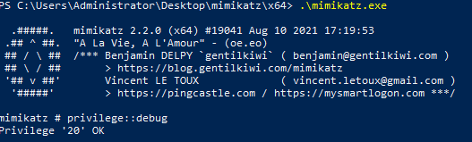

- Use `privilege::debug` to test if you have the necessary privileges to run the program.

- Within the `sekurlsa` module, we can use the `logonpasswords` function to extract the credentials for currently logged in users:

	- `sekurlsa::logonpasswords`

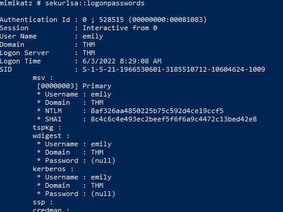

### Cracking Password Hashes

#johntheripper

- We will use the command `john --format=NT -w=/usr/share/wordlists/rockyou.txt hash.txt --pot=output.txt` to crack the NTLM hash, where:
	
    - `—format=NT` is used to represent the type of the hash. In this case, we're specifying that we want to crack an NTLM hash. You can find a full list of formats supported by john using the john --list=formats command.
    
    - `/usr/share/wordlists/rockyou.txt` is the wordlist containing the input passwords that will be hashed by john and compared against our hash.

    - `hash.txt` represents the text file containing the hash
    
    - `—pot=output.txt` represents the output file that the clear text retrieved password will be stored in


### Questions

1. What is the username of the other user on the system?


A: emily

2. What is the NTLM hash of this user?

A: 8af326aa4850225b75c592d4ce19ccf5

3. What is the password for this user?

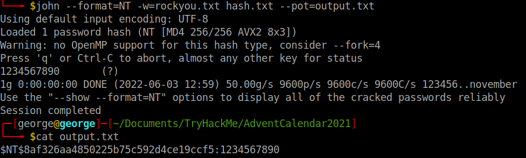

A: 123456890
