# Burp Suite - The basics

## What is Burp Suite

- Java-based framework designed to serve as a comprehensive solution for conducting web application penetration testing. 
	- It has become the industry standard tool for hands-on security assessments of web and mobile applications, including those that rely on **a**pplication **p**rogramming **i**nterface**s** (APIs).

- Burp Suite captures and enables manipulation of all the HTTP/HTTPS traffic between a browser and a web server.

### Questions

Which edition of Burp Suite runs on a server and provides constant scanning for target web apps?  

	`A: Burp Suite Enterprise`

Burp Suite is frequently used when attacking web applications and ______ applications.

	`A: Mobile`

## Features of Burp Suite

- **Proxy**: 
	- The Burp Proxy is the most renowned aspect of Burp Suite. 
	- It enables interception and modification of requests and responses while interacting with web applications.
- **Repeater**: 
	- Another well-known feature. 
		- [Repeater](https://tryhackme.com/room/burpsuiterepeater) allows for capturing, modifying, and resending the same request multiple times. 
		- This functionality is particularly useful when crafting payloads through trial and error (e.g., in SQLi - Structured Query Language Injection) or testing the functionality of an endpoint for vulnerabilities.
- **Intruder**: 
	- Despite rate limitations in Burp Suite Community, [Intruder](https://tryhackme.com/room/burpsuiteintruder) allows for spraying endpoints with requests. 
	- It is commonly utilized for brute-force attacks or fuzzing endpoints.
- **Decoder**: 
	- [Decoder](https://tryhackme.com/room/burpsuiteom) offers a valuable service for data transformation. 
	- It can decode captured information or encode payloads before sending them to the target. 
	- While alternative services exist for this purpose, leveraging Decoder within Burp Suite can be highly efficient.
- **Comparer**: 
	- As the name suggests, [Comparer](https://tryhackme.com/room/burpsuiteom) enables the comparison of two pieces of data at either the word or byte level. 
		- While not exclusive to Burp Suite, the ability to send potentially large data segments directly to a comparison tool with a single keyboard shortcut significantly accelerates the process.
- **Sequencer**: 
	- [Sequencer](https://tryhackme.com/room/burpsuiteom) is typically employed when assessing the randomness of tokens, such as session cookie values or other supposedly randomly generated data. 
	- If the algorithm used for generating these values lacks secure randomness, it can expose avenues for devastating attacks.

### Questions

Which Burp Suite feature allows us to intercept requests between ourselves and the target?  

	`A: Proxy`

Which Burp tool would we use to brute-force a login form?

	`A: Intruder`

## The dashboard

1. **Tasks**: The Tasks menu allows you to define background tasks that Burp Suite will perform while you use the application. In Burp Suite Community, the default “Live Passive Crawl” task, which automatically logs the pages visited, is sufficient for our purposes in this module. Burp Suite Professional offers additional features like on-demand scans.
    
2. **Event log**: The Event log provides information about the actions performed by Burp Suite, such as starting the proxy, as well as details about connections made through Burp.
    
3. **Issue Activity**: This section is specific to Burp Suite Professional. It displays the vulnerabilities identified by the automated scanner, ranked by severity and filterable based on the certainty of the vulnerability.
    
4. **Advisory**: The Advisory section provides more detailed information about the identified vulnerabilities, including references and suggested remediations. This information can be exported into a report. In Burp Suite Community, this section may not show any vulnerabilities.

### Questions

What menu provides information about the actions performed by Burp Suite, such as starting the proxy, and details about connections made through Burp?

	`A: Event Log`

## Navigation

| **Shortcut**         | **Tab**          |
|----------------------|------------------|
| `Ctrl + Shift + D`   | Dashboard        |
| `Ctrl + Shift + T`   | Target tab       |
| `Ctrl + Shift + P`   | Proxy tab        |
| `Ctrl + Shift + I`   | Intruder tab     |
| `Ctrl + Shift + R`   | Repeater tab     |

### Questions

Which tab **Ctrl + Shift + P** will switch us to?

`A: Proxy Tab`

## Options

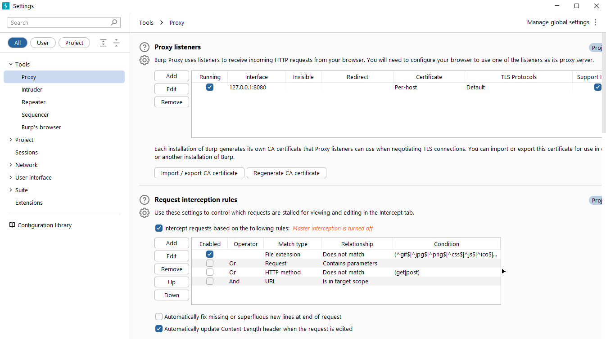

### Questions

In which category can you find a reference to a "Cookie jar"?  

	`A: Sessions`

In which base category can you find the "Updates" sub-category, which controls the Burp Suite update behaviour?  

	`A: Suite`

What is the name of the sub-category which allows you to change the keybindings for shortcuts in Burp Suite?  

	`A: Hotkeys`

If we have uploaded Client-Side TLS certificates, can we override these on a per-project basis (yea/nay)?

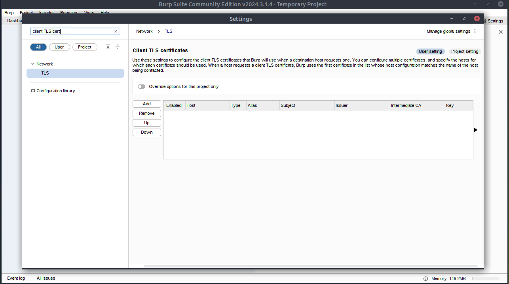

	`A: yea`

## Introduction to Burp Proxy

- **Intercepting Requests:** 
	- When requests are made through the Burp Proxy, they are intercepted and held back from reaching the target server. 
	- The requests appear in the Proxy tab, allowing for further actions such as forwarding, dropping, editing, or sending them to other Burp modules. 
	- To disable the intercept and allow requests to pass through the proxy without interruption, click the `Intercept is on` button.

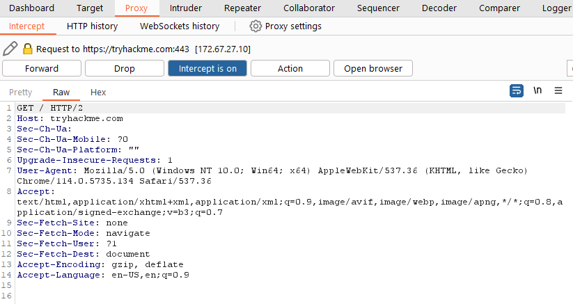

- **Capture and Logging:** 
	- Burp Suite captures and logs requests made through the proxy by default, even when the interception is turned off. 
	- This logging functionality can be helpful for later analysis and review of prior requests.

- **Logs and History:** 
	- The captured requests can be viewed in the **HTTP history** and **WebSockets history** sub-tabs, allowing for retrospective analysis and sending the requests to other Burp modules as needed.

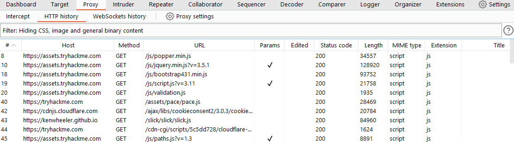

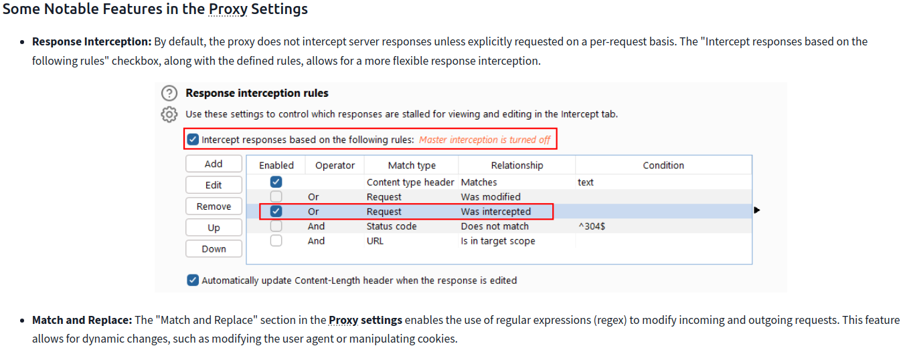

## Site Map and Issue Definitions

- The **Target** tab in Burp Suite provides more than just control over the scope of our testing. It consists of three sub-tabs:

1. **Site map**: 
	- This sub-tab allows us to map out the web applications we are targeting in a tree structure. 
		- Every page that we visit while the proxy is active will be displayed on the site map. 
	- This feature enables us to automatically generate a site map by simply browsing the web application. 
	- In Burp Suite Professional, we can also use the site map to perform automated crawling of the target, exploring links between pages and mapping out as much of the site as possible. 
	- Even with Burp Suite Community, we can still utilize the site map to accumulate data during our initial enumeration steps. 
	- It is particularly useful for mapping out APIs, as any API endpoints accessed by the web application will be captured in the site map.
    
2. **Issue definitions**: 
	- Although Burp Community does not include the full vulnerability scanning functionality available in Burp Suite Professional, we still have access to a list of all the vulnerabilities that the scanner looks for. 
	- The **Issue definitions** section provides an extensive list of web vulnerabilities, complete with descriptions and references. 
	- This resource can be valuable for referencing vulnerabilities in reports or assisting in describing a particular vulnerability that may have been identified during manual testing.
    
3. **Scope settings**: 
	- This setting allows us to control the target scope in Burp Suite. 
	- It enables us to include or exclude specific domains/IPs to define the scope of our testing. 
	- By managing the scope, we can focus on the web applications we are specifically targeting and avoid capturing unnecessary traffic.
    
- Overall, the **Target** tab offers features beyond scoping, allowing us to map out web applications, fine-tune our target scope, and access a comprehensive list of web vulnerabilities for reference purposes.

### Questions

What is the flag you receive after visiting the unusual endpoint?

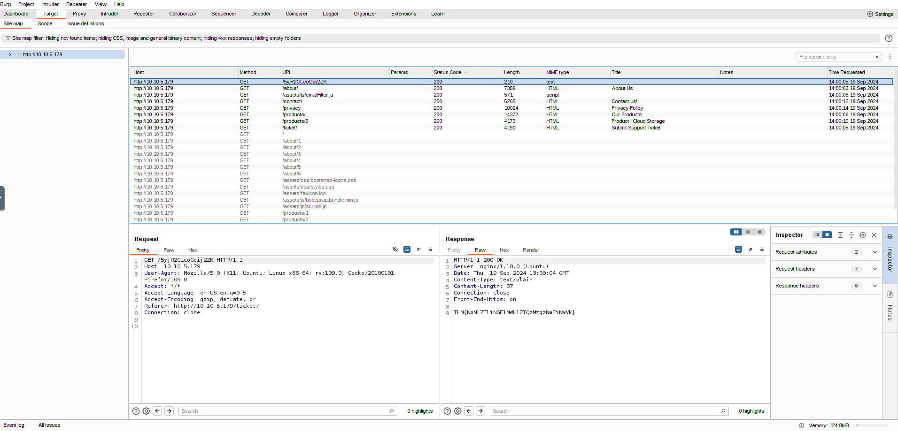

	`A: THM{NmNlZTliNGE1MWU1ZTQzMzgzNmFiNWVk}`

## The Burp Suite browser

- To start the Burp Browser, click the `Open Browser` button in the proxy tab. 
- A Chromium window will pop up, and any requests made in this browser will go through the proxy.

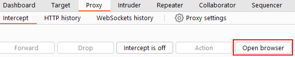

## Scoping and Targeting

- By setting a scope for the project, we can define what gets proxied and logged in Burp Suite. 
	- We can restrict Burp Suite to target only the specific web application(s) we want to test. 
- The easiest way to do this is by switching to the `Target` tab, right-clicking on our target from the list on the left, and selecting `Add To Scope`. 
- Burp will then prompt us to choose whether we want to stop logging anything that is not in scope, and in most cases, we want to select `yes`.

- To check our scope, we can switch to the **Scope settings** sub-tab within the **Target** tab.

- However, even if we disabled logging for out-of-scope traffic, the proxy will still intercept everything. 
	- To prevent this, we need to go to the **Proxy settings** sub-tab and select `And` `URL` `Is in target scope` from the "Intercept Client Requests" section.

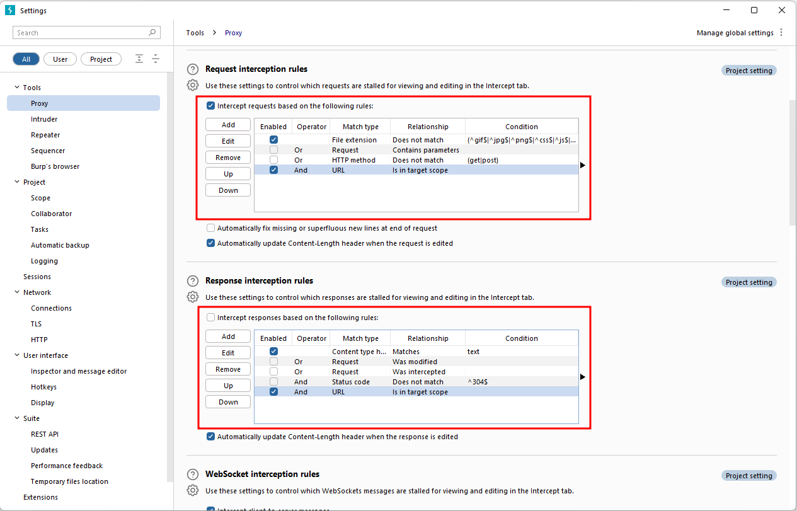

## Proxying HTTPS

- When intercepting HTTP traffic, we may encounter an issue when navigating to sites with TLS enabled. 
- For example, when accessing a site like `https://google.com/`, we may receive an error indicating that the PortSwigger Certificate Authority (CA) is not authorised to secure the connection. 
- This happens because the browser does not trust the certificate presented by Burp Suite.

- To overcome this issue, we can manually add the PortSwigger CA certificate to our browser's list of trusted certificate authorities:

1. **Download the CA Certificate:** 
	- With the Burp Proxy activated, navigate to http://burp/cert. 
	- This will download a file called `cacert.der`. Save this file somewhere on your machine.
    
2. **Access Firefox Certificate Settings:** 
	- Type `about:preferences` into your Firefox URL bar and press **Enter**. 
	- This will take you to the Firefox settings page. 
	- Search the page for "certificates" and click on the **View Certificates** button.
    
    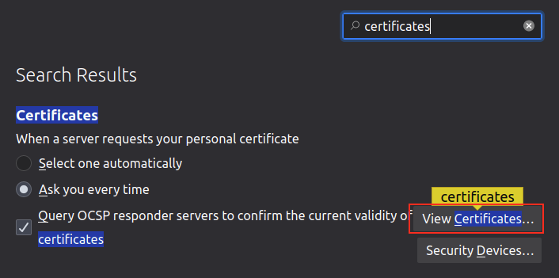
    
3. **Import the CA Certificate:** 
	- In the Certificate Manager window, click on the **Import** button. 
	- Select the `cacert.der` file that you downloaded in the previous step.
    
4. **Set Trust for the CA Certificate:** 
	- In the subsequent window that appears, check the box that says "Trust this CA to identify websites" and click OK.
    
    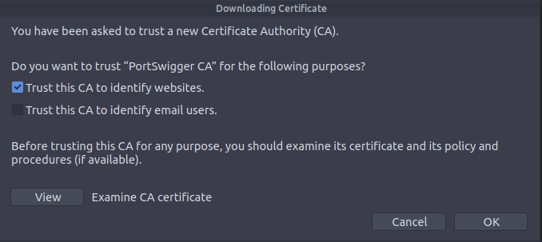

## Example attack

- take a look at the support form at `http://10.10.55.106/ticket/`

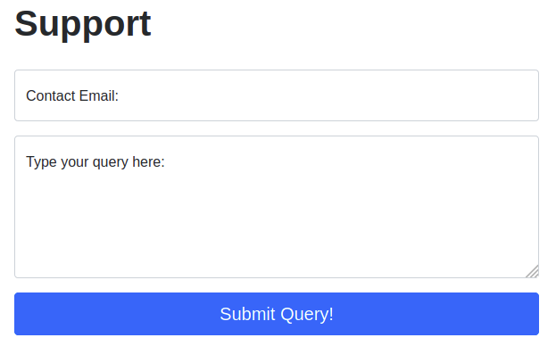

- In a real-world web app pentest, we would test this for a variety of things, one of which would be Cross-Site Scripting (or XSS). 
- If you have not yet encountered XSS, it can be thought of as injecting a client-side script (usually in Javascript) into a webpage in such a way that it executes. 
- There are various kinds of XSS – the type that we are using here is referred to as "Reflected" XSS, as it only affects the person making the web request.

- Make a request by putting legitimate data in the support form and then intercept the request with Burp

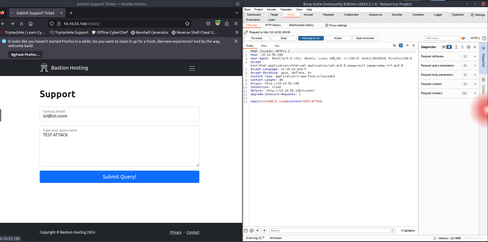

- We can then change the email we put in initially with our payload ``, URL encode it using `CTRL + U` and then forward the request(s) to the website's server

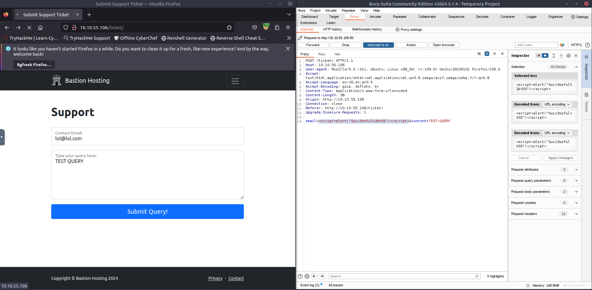

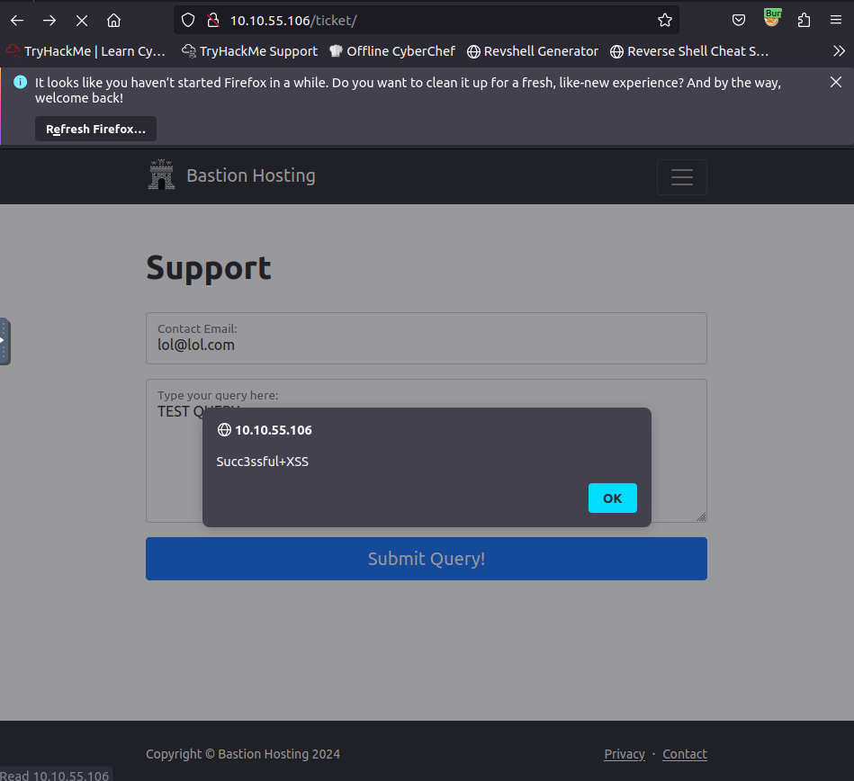