# [Burp Suite: Intruder](https://tryhackme.com/room/burpsuiteintruder)

## What is Intruder

Intruder is Burp Suit's built-in fuzzing tool that allows for automated request modification and repetitive testing with variations in input values. By using a captured request (often from the Proxy module), Intruder can send multiple requests with slightly altered values based on user-defined configurations. It serves various purposes, such as brute-forcing login forms by substituting username and password fields with values from a wordlist or performing fuzzing attacks using wordlists to test subdirectories, endpoints, or virtual hosts. Intruder's functionality is comparable to command-line tools like **Wfuzz** or **ffuf**.

However, it's important to note that while Intruder can be used with Burp Community Edition, it is rate-limited, significantly reducing its speed compared to Burp Professional. This limitation often leads security practitioners to rely on other tools for fuzzing and brute-forcing. Nonetheless, Intruder remains a valuable tool and is worth learning how to use it effectively.

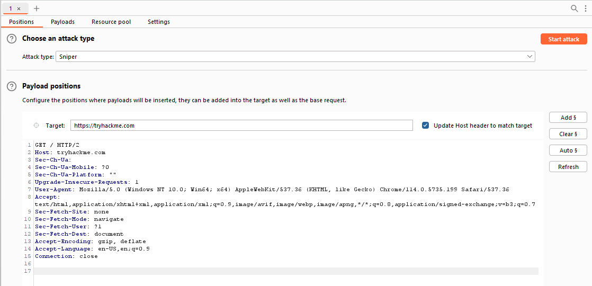

The initial view of Intruder presents a simple interface where we can select our target. This field will already be populated if a request has been sent from the Proxy (using `Ctrl + I` or right-clicking and selecting "Send to Intruder").

There are four sub-tabs within Intruder:

- **Positions**: This tab allows us to select an attack type (which we will cover in a future task) and configure where we want to insert our payloads in the request template.

- **Payloads**: Here we can select values to insert into the positions defined in the **Positions** tab. We have various payload options, such as loading items from a wordlist. The way these payloads are inserted into the template depends on the attack type chosen in the **Positions** tab. The **Payloads** tab also enables us to modify Intruder's behavior regarding payloads, such as defining pre-processing rules for each payload (e.g., adding a prefix or suffix, performing match and replace, or skipping payloads based on a defined regex).

- **Resource Pool**: This tab is not particularly useful in the Burp Community Edition. It allows for resource allocation among various automated tasks in Burp Professional. Without access to these automated tasks, this tab is of limited importance.

- **Settings**: This tab allows us to configure attack behavior. It primarily deals with how Burp handles results and the attack itself. For instance, we can flag requests containing specific text or define Burp's response to redirect (3xx) responses.

**Note:** The term "fuzzing" refers to the process of testing functionality or existence by applying a set of data to a parameter. For example, fuzzing for endpoints in a web application involves taking each word in a wordlist and appending it to a request URL (e.g., `http://MACHINE_IP/WORD_GOES_HERE`) to observe the server's response.
### Questions

Q: In which Intruder tab can we define the "Attack type" for our planned attack?

A: `Positions`

## Positions

When using Intruder to perform an attack, the first step is to examine the positions within the request where we want to insert our payloads. These positions inform Intruder about the locations where our payloads will be introduced (as we will explore in upcoming tasks).

Let's navigate to the Positions tab:

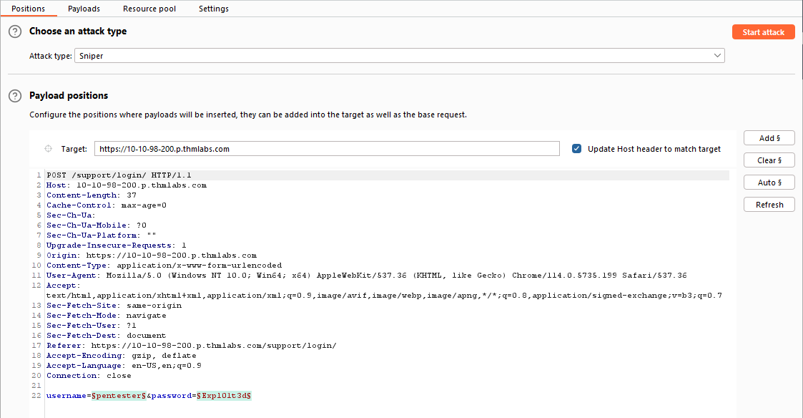

Notice that Burp Suite automatically attempts to identify the most probable positions where payloads can be inserted. These positions are highlighted in green and enclosed by section marks (`§`).

On the right-hand side of the interface, we find the following buttons: `Add §`, `Clear §`, and `Auto §`:

- The `Add §` button allows us to define new positions manually by highlighting them within the request editor and then clicking the button.
- The `Clear §` button removes all defined positions, providing a blank canvas where we can define our own positions.
- The `Auto §` button automatically attempts to identify the most likely positions based on the request. This feature is helpful if we previously cleared the default positions and want them back.

### Questions

Q: What symbol defines the start and the end of a payload position?

A: `§`

## Payloads

Here, we can create, assign, and configure payloads for our attack. This sub-tab is divided into four sections:

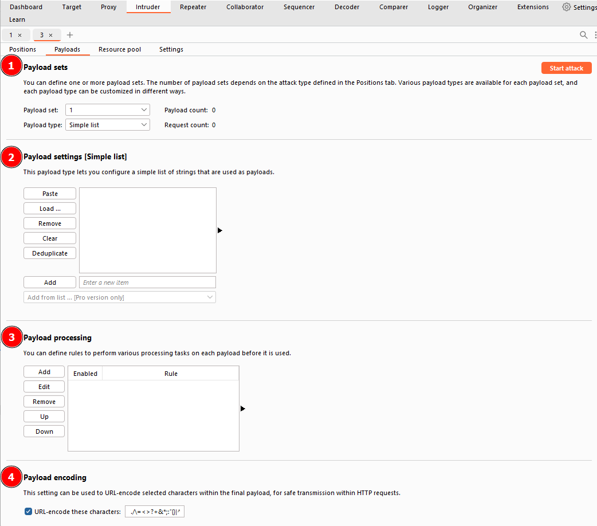

1. **Payload Sets**:
    - This section allows us to choose the position for which we want to configure a payload set and select the type of payload we want to use.
    - When using attack types that allow only a single payload set (Sniper or Battering Ram ), the "Payload Set" dropdown will have only one option, regardless of the number of defined positions.
    - If we use attack types that require multiple payload sets (Pitchfork or Cluster Bomb), there will be one item in the dropdown for each position.
    - **Note:** When assigning numbers in the "Payload Set" dropdown for multiple positions, follow a top-to-bottom, left-to-right order. For example, with two positions (`username=§pentester§&password=§Expl01ted§`), the first item in the payload set dropdown would refer to the username field, and the second item would refer to the password field.
  
2. **Payload settings**:
    - This section provides options specific to the selected payload type for the current payload set.
    - For example, when using the "Simple list" payload type, we can manually add or remove payloads to/from the set using the **Add** text box, **Paste** lines, or **Load** payloads from a file. The **Remove** button removes the currently selected line, and the **Clear** button clears the entire list. Be cautious with loading huge lists, as it may cause Burp to crash.
    - Each payload type will have its own set of options and functionality. Explore the options available to understand the range of possibilities.  
        
        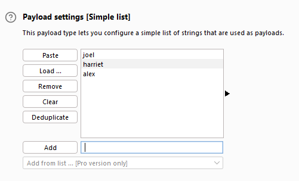
        
  
3. **Payload Processing**:
    - In this section, we can define rules to be applied to each payload in the set before it is sent to the target.
    - For example, we can capitalize every word, skip payloads that match a regex pattern, or apply other transformations or filtering.
    - While you may not use this section frequently, it can be highly valuable when specific payload processing is required for your attack.
  
4. **Payload Encoding**:
    - The section allows us to customize the encoding options for our payloads.
    - By default, Burp applies URL encoding to ensure the safe transmission of payloads. However, there may be cases where we want to adjust the encoding behavior.
    - We can override the default URL encoding options by modifying the list of characters to be encoded or unchecking the "URL-encode these characters" checkbox.

By leveraging these sections, we can create and customise payload sets to suit the specific requirements of our attacks. This level of control allows us to finely tune our payloads for effective testing and exploitation.

### Questions

Q: Which Payload processing rule could we use to add characters at the end of each payload in the set?

A: `Add suffix`

## Introduction to Attack Types

Intruder offers four attack types, each serving a specific purpose. Let's explore each of them:

1. **Sniper**: The Sniper attack type is the default and most commonly used option. It cycles through the payloads, inserting one payload at a time into each position defined in the request. Sniper attacks iterate through all the payloads in a linear fashion, allowing for precise and focused testing.
    
2. **Battering** **Ram**: The Battering-Ram attack type differs from Sniper in that it sends all payloads simultaneously, each payload inserted into its respective position. This attack type is useful when testing for race conditions or when payloads need to be sent concurrently.
    
3. **Pitchfork**: The Pitchfork attack type enables the simultaneous testing of multiple positions with different payloads. It allows the tester to define multiple payload sets, each associated with a specific position in the request. Pitchfork attacks are effective when there are distinct parameters that need separate testing.
    
4. **Cluster bomb**: The Cluster bomb attack type combines the Sniper and Pitchfork approaches. It performs a Sniper-like attack on each position but simultaneously tests all payloads from each set. This attack type is useful when multiple positions have different payloads, and we want to test them all together.

### Questions

Q: What attack type cycles through the payloads inserting one payload at a time into each position defined in the request?

A: `Sniper`

## Sniper

It is particularly effective for single-position attacks, such as password brute-force or fuzzing for API endpoints. In a Sniper attack, we provide a set of payloads, which can be a wordlist or a range of numbers, and Intruder inserts each payload into each defined position in the request.

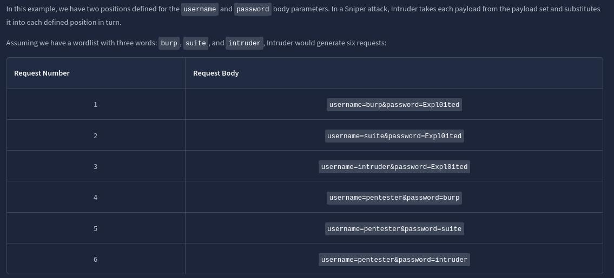

Observe how Intruder starts with the first position (`username`) and substitutes each payload into it, then moves to the second position (`password`) and performs the same substitution with the payloads. The total number of requests made by Intruder Sniper can be calculated as `requests = numberOfWords * numberOfPositions`.

The Sniper attack type is beneficial when we want to perform tests with single-position attacks, utilizing different payloads for each position. It allows for precise testing and analysis of different payload variations.

### Questions

Q: If you were using Sniper to fuzz three parameters in a request with a wordlist containing 100 words, how many requests would Burp Suite need to send to complete the attack?

A: `300`

Q: How many sets of payloads will Sniper accept for conducting an attack?

A: `1`

## Battering Ram

The **Battering** Ram attack type in Intruder differs from Sniper in that it places the same payload in every position simultaneously, rather than substituting each payload into each position in turn.

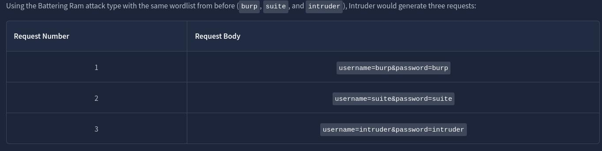

The Battering Ram attack type is useful when we want to test the same payload against multiple positions at once without the need for sequential substitution.
### Questions

Q: As a hypothetical question: You need to perform a Battering ram Intruder attack on the example request above.If you have a wordlist with two words in it (admin and Guest) and the positions in the request template look like this:username=§pentester§&password=§Expl01ted§What would the body parameters of the first request that Burp Suite sends be?

A: `username=admin&password=admin`

## Pitchfork

The **Pitchfork** attack type in Intruder is similar to having multiple Sniper attacks running simultaneously. While Sniper uses one payload set to test all positions simultaneously, Pitchfork utilises one payload set per position (up to a maximum of 20) and iterates through them all simultaneously.

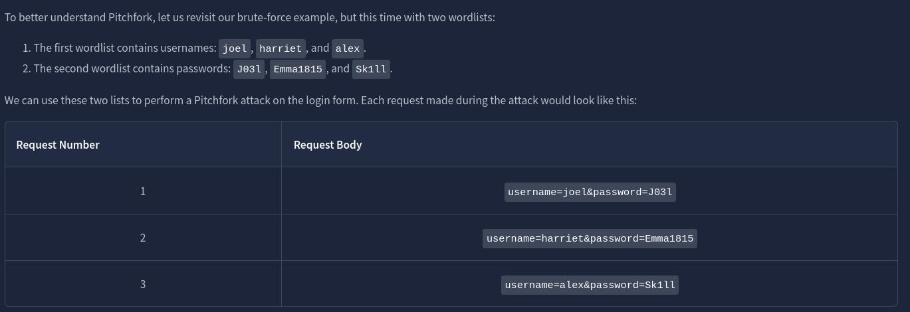

Pitchfork takes the first item from each list and substitutes them into the request, one per position. It then repeats this process for the next request by taking the second item from each list and substituting it into the template. Intruder continues this iteration until one or all of the lists run out of items. It's important to note that Intruder stops testing as soon as one of the lists is complete. Therefore, in Pitchfork attacks, it is ideal for the payload sets to have the same length. If the lengths of the payload sets differ, Intruder will only make requests until the shorter list is exhausted, and the remaining items in the longer list will not be tested.

The Pitchfork attack type is especially useful when conducting credential-stuffing attacks or when multiple positions require separate payload sets. It allows for simultaneous testing of multiple positions with different payloads.

### Questions

Q: What is the maximum number of payload sets we can load into Intruder in Pitchfork mode?

A: `20`

## Cluster Bomb

The **Cluster bomb** attack type in Intruder allows us to choose multiple payload sets, one per position (up to a maximum of 20). Unlike Pitchfork, where all payload sets are tested simultaneously, Cluster bomb iterates through each payload set individually, ensuring that every possible combination of payloads is tested.

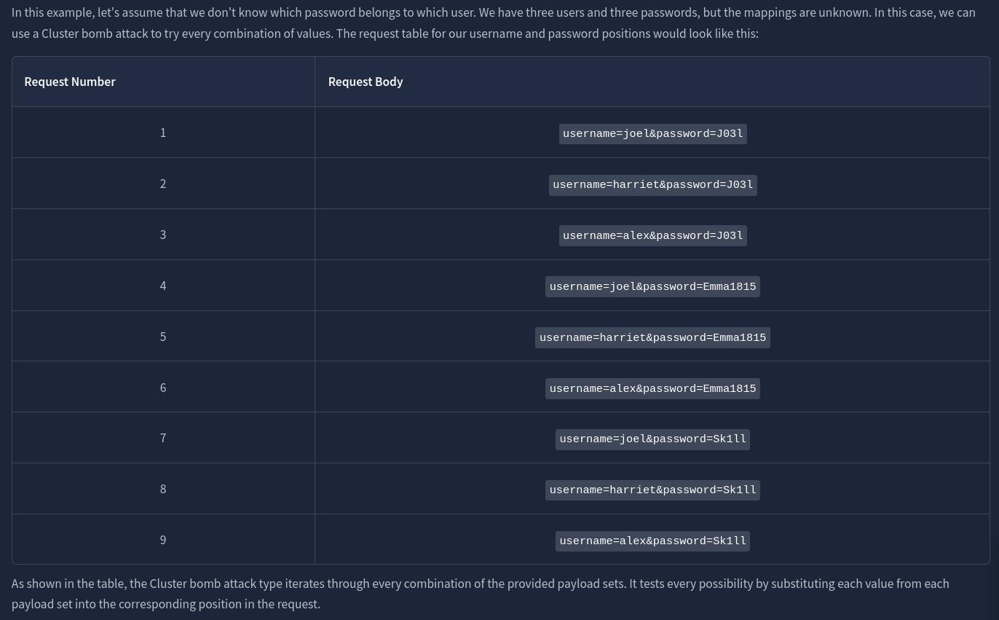

the Cluster bomb attack type iterates through every combination of the provided payload sets. It tests every possibility by substituting each value from each payload set into the corresponding position in the request.

Cluster bomb attacks can generate a significant amount of traffic as it tests every combination. The number of requests made by a Cluster bomb attack can be calculated by multiplying the number of lines in each payload set together. It's important to be cautious when using this attack type, especially when dealing with large payload sets. Additionally, when using Burp Community and its Intruder rate-limiting, the execution of a Cluster bomb attack with a moderately sized payload set can take a significantly longer time.

The Cluster bomb attack type is particularly useful for credential brute-forcing scenarios where the mapping between usernames and passwords is unknown.
### Questions

Q: We have three payload sets. The first set contains 100 lines, the second contains 2 lines, and the third contains 30 lines.How many requests will Intruder make using these payload sets in a Cluster bomb attack?

A: `6000`

## Practical Example

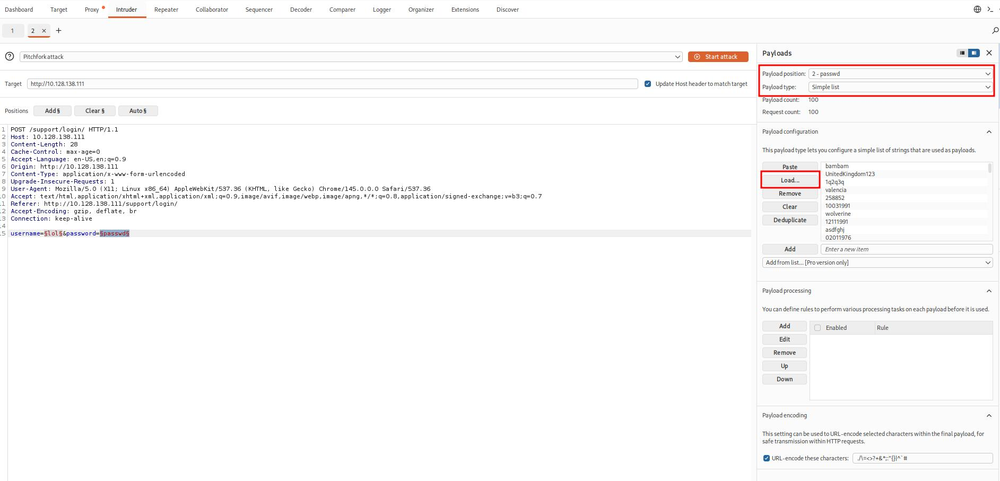

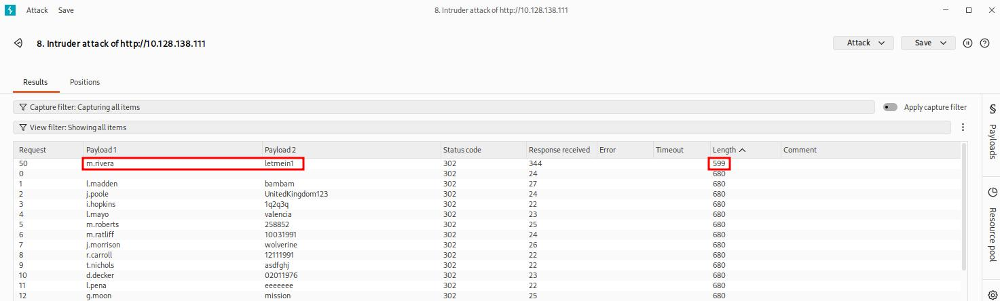
### Questions

Q: What username and password combination indicates a successful login attempt? The answer format is "username:password".

A: `m.rivera:letmein1`

## Practical Challenge

Upon accessing the home interface, we are presented with a table displaying various tickets. Clicking on any row redirects us to a page where we can view the complete ticket. By examining the URL structure, we observe that these pages are numbered in the following format:

`http://10.128.138.111/support/ticket/NUMBER`

The numbering system indicates that the tickets are assigned integer identifiers rather than complex and hard-to-guess IDs. This information is significant because it suggests two possible scenarios:

1. **Access Control**: The endpoint may be properly configured to restrict access only to tickets assigned to our current user. In this case, we can only view tickets associated with our account.
    
2. **IDOR Vulnerability**: Alternatively, the endpoint may lack appropriate access controls, leading to a vulnerability known as **Insecure Direct Object References** (IDOR). If this is the case, we could potentially exploit the system and read all existing tickets, regardless of the assigned user.
    

To investigate further, we will utilize the Intruder tool to fuzz the `/support/ticket/NUMBER` endpoint. This approach will help us determine whether the endpoint has been correctly configured or if an IDOR vulnerability is present.

### Questions

We log in using the credentials found in the previous task.

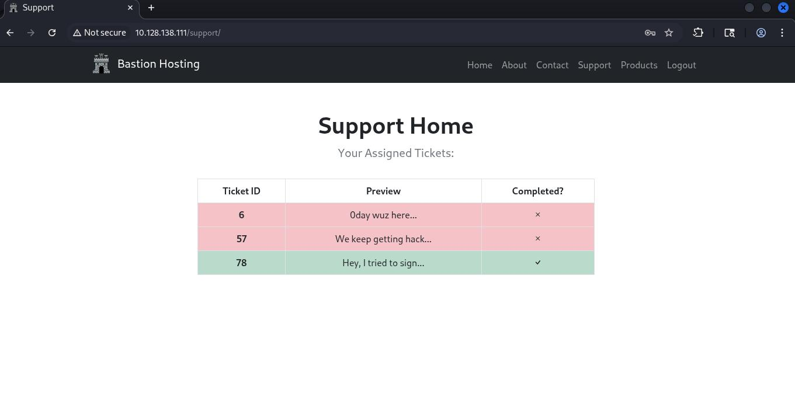

Q: Which attack type is best suited for this task?

A: `Sniper`

Q: Configure an appropriate position and payload (the tickets are stored at values between 1 and 100), then start the attack.You should find that at least five tickets will be returned with a status code 200, indicating that they exist.

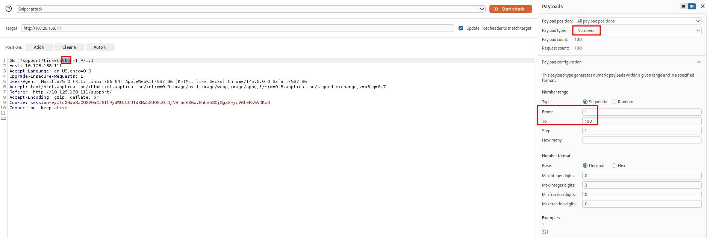

Q: Either using the Response tab in the Attack Results window or by looking at each successful (i.e. 200 code) request manually in your browser, find the ticket that contains the flag.What is the flag?

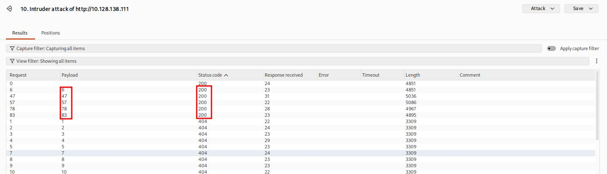

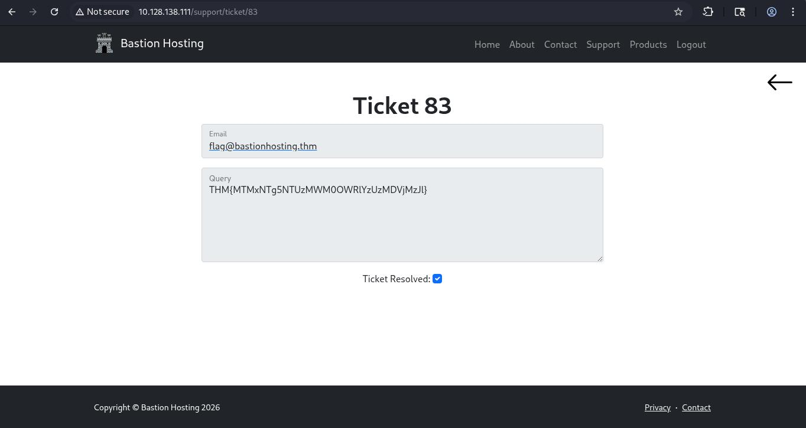

A: `THM{MTMxNTg5NTUzMWM0OWRlYzUzMDVjMzJl}`

## Extra Mile Challenge

Begin by capturing a request to `http://<IP>/admin/login/` and reviewing the response. Here is an example of the response:.

In this response, we notice that alongside the username and password fields, there is now a session cookie set, as well as a CSRF (**Cross-Site Request Forgery**) token in the form as a hidden field. Refreshing the page reveals that both the **session** cookie and the **loginToken** change with each request. This means that for every login attempt, we need to extract valid values for both the session cookie and the loginToken.

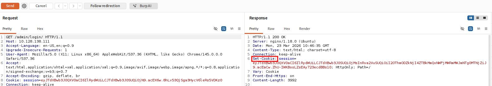

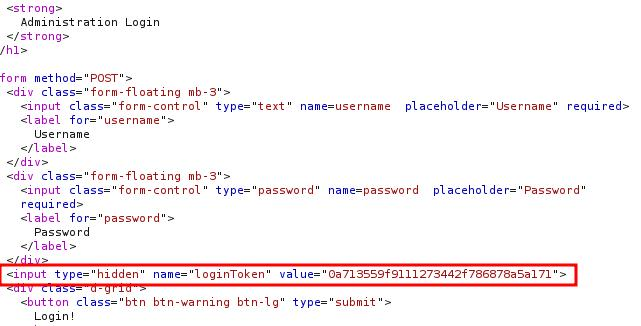

To accomplish this, we will use **Burp Macros** to define a repeated set of actions (macro) to be executed before each request. This macro will extract unique values for the session cookie and loginToken, replacing them in every subsequent request of our attack.

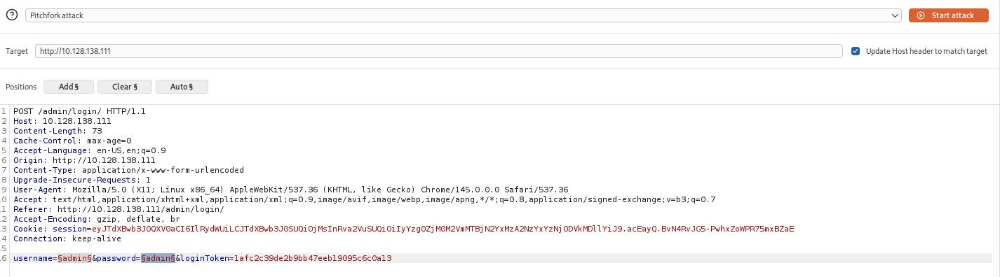

With the username and password parameters handled, we now need to find a way to grab the ever-changing loginToken and session cookie. Unfortunately, "recursive grep" won't work here due to the redirect response, so we can't do this entirely within Intruder – we will need to build a macro.

Macros allow us to perform the same set of actions repeatedly. In this case, we simply want to send a GET request to `/admin/login/`.

Fortunately, setting this up is a straightforward process.

- Switch over to the main "Settings" tab at the top-right of Burp.
- Click on the "Sessions" category.
- Scroll down to the bottom of the category to the "Macros" section and click the **Add** button.
- The menu that appears will show us our request history. If there isn't a GET request to `http://10.128.138.111/admin/login/` in the list already, navigate to this location in your browser, and you should see a suitable request appear in the list.
- With the request selected, click **OK**.
- Finally, give the macro a suitable name, then click **OK** again to finish the process.

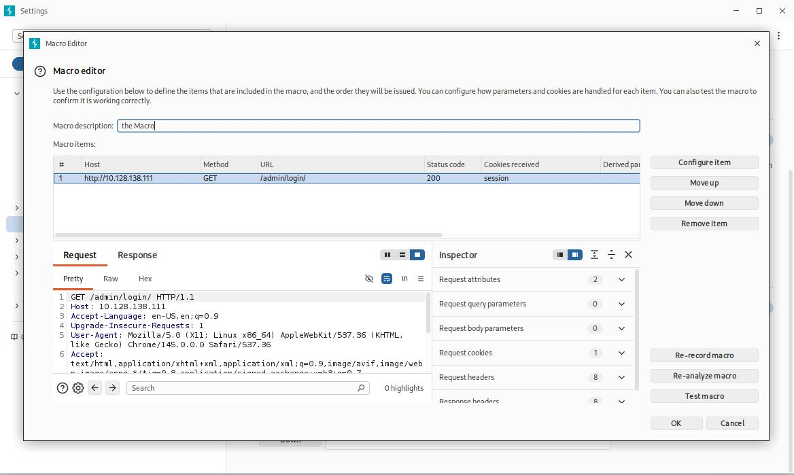

- Now that we have a macro defined, we need to set Session Handling rules that define how the macro should be used.
    
    - Still in the "Sessions" category of the main settings, scroll up to the "Session Handling Rules" section and choose to **Add** a new rule.
    - A new window will pop up with two tabs in it: "Details" and "Scope". We are in the Details tab by default.
        
    
    
    
    - Fill in an appropriate description, then switch to the Scope tab.
    - In the "Tools Scope" section, deselect every checkbox other than Intruder – we do not need this rule to apply anywhere else.
    - In the "URL Scope" section, choose "Use suite scope"; this will set the macro to only operate on sites that have been added to the global scope (as was discussed in [Burp Basics](https://tryhackme.com/room/burpsuitebasics)). If you have not set a global scope, keep the "Use custom scope" option as default and add `http://<IP>/` to the scope in this section.
        
        
        
- Now we need to switch back over to the Details tab and look at the "Rule Actions" section.
    
    - Click the **Add** button – this will cause a dropdown menu to appear with a list of actions we can add.
    - Select "Run a Macro" from this list.
    - In the new window that appears, select the macro we created earlier.
        
    As it stands, this macro will now overwrite all of the parameters in our Intruder requests before we send them; this is great, as it means that we will get the loginTokens and session cookies added straight into our requests. That said, we should restrict which parameters and cookies are being updated before we start our attack:
    
    - Select "Update only the following parameters and headers", then click the **Edit** button next to the input box below the radio button.
    - In the "Enter a new item" text field, type "loginToken". Press **Add**, then **Close**.
    - Select "Update only the following cookies", then click the relevant **Edit** button.
    - Enter "session" in the "Enter a new item" text field. Press **Add**, then **Close**.
    - Finally, press **OK** to confirm our action.

 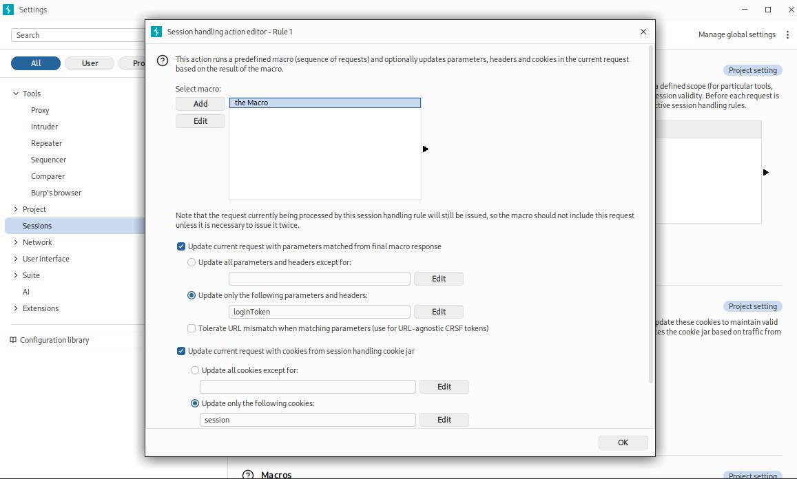

### Questions

Q: What username and password combination indicates a successful login attempt? The answer format is "username:password".

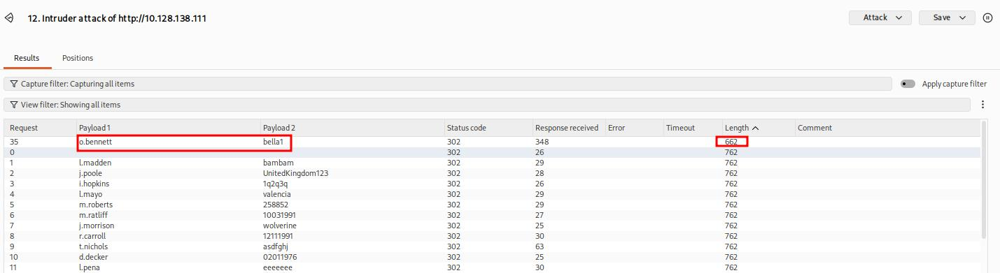

A: `o.bennett:bella1`

## Conclusion

### Questions

Q: I can use Intruder!

A: ``

