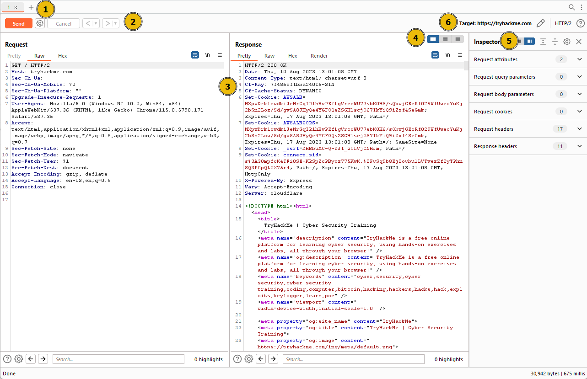
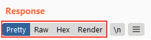
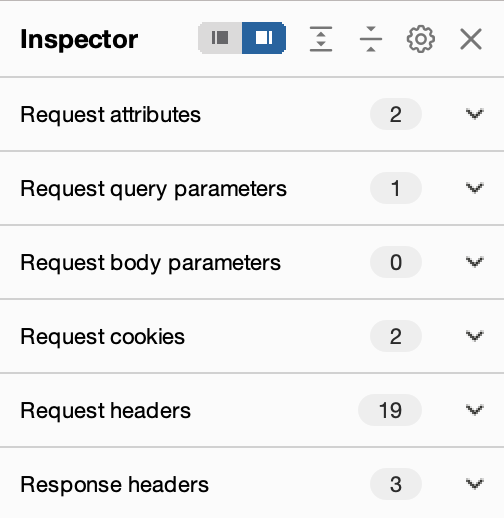
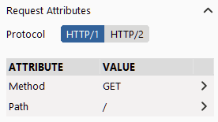
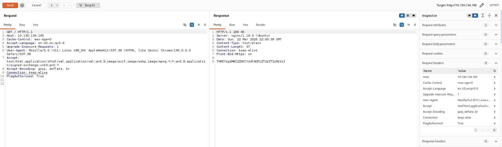
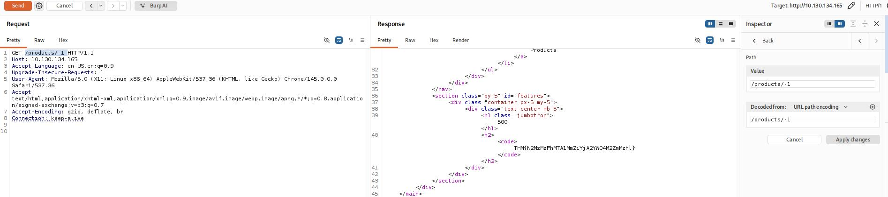
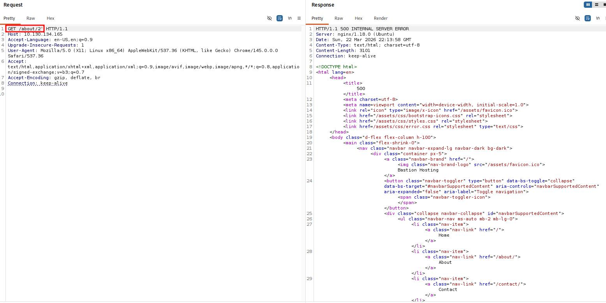
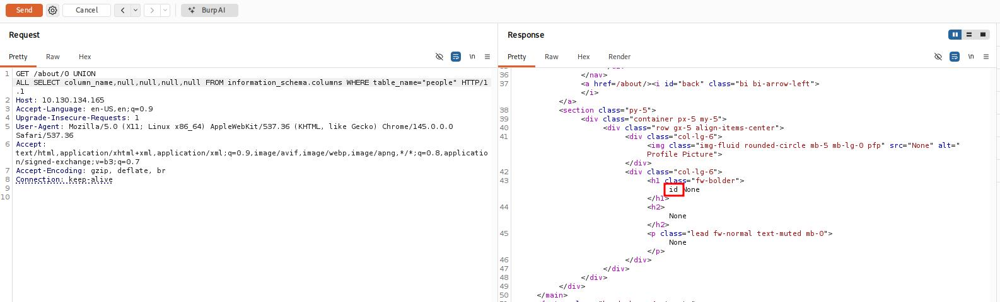
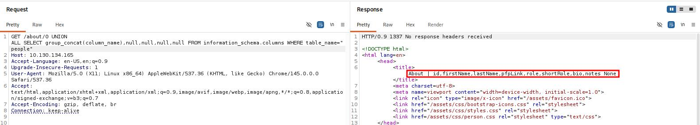
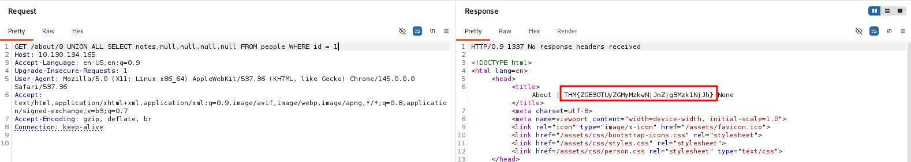

# [Burp Suite: Repeater](https://tryhackme.com/room/burpsuiterepeater)

## What is Repeater?

Repeater enables us to modify and resend intercepted requests to a target of our choosing. It allows us to take requests captured in the Burp Proxy and manipulate them, sending them repeatedly as needed. Alternatively, we can manually create requests from scratch, similar to using a command-line tool like cURL.

The ability to edit and resend requests multiple times makes Repeater invaluable for manual exploration and testing of endpoints. It provides a user-friendly graphical interface for crafting request payloads and offers various views of the response, including a rendering engine for a graphical representation.

The Repeater interface consists of six main sections, as depicted in the annotated diagram below:

1. **Request List**: Located at the top left of the tab, it displays the list of Repeater requests. Multiple requests can be managed simultaneously, and each new request sent to Repeater will appear here.
    
2. **Request Controls**: Positioned directly beneath the request list, these controls allow us to send a request, cancel a hanging request, and navigate through the request history.
    
3. **Request and Response View**: Occupying the majority of the interface, this section displays the **Request** and **Response** views. We can edit the request in the Request view and then forward it, while the corresponding response will be shown in the Response view.
    
4. **Layout Options**: Located at the top-right of the Request/Response view, these options enable us to customize the layout of the Request and Response views. The default setting is a side-by-side (horizontal) layout, but we can also choose a vertical layout or combine them in separate tabs.
    
5. **Inspector**: Positioned on the right-hand side, the Inspector allows us to analyze and modify requests in a more intuitive manner than using the raw editor. We will explore this feature in a later task.
    
6. **Target**: Situated above the Inspector, the Target field specifies the IP address or domain to which the requests are sent. When requests are sent to Repeater from other Burp Suite components, this field is automatically populated.

### Questions

Q: Which sections gives us a more intuitive control over our requests?

A: `Inspector`

## Basic Usage

While manual request crafting is an option, it is more common to capture a request using the Proxy module and subsequently transmit it to Repeater for further editing and resending.

Once a request has been captured in the Proxy module, we can send it to Repeater by either right-clicking on the request and selecting **Send to Repeater**, or by utilizing the keyboard shortcut `Ctrl + R`.

### Questions

Q: Which view will populate when sending a request from the Proxy module to Repeater?

A: `Request`

## Message Analysis Toolbar

Repeater provides us with various request and response presentation options, ranging from hexadecimal output to a fully rendered page.

To explore these options, we can refer to the section located above the response box, where the following four view buttons are available:

We are presented with the following display choices:

1. **Pretty**: This is the default option, which takes the raw response and applies slight formatting enhancements to improve readability.
    
2. **Raw**: This option displays the unmodified response directly received from the server without any additional formatting.
    
3. **Hex**: By selecting this view, we can examine the response in a byte-level representation, which is particularly useful when dealing with binary files.
    
4. **Render**: The render option allows us to visualize the page as it would appear in a web browser. While not commonly utilised in Repeater, as our focus is usually on the source code, it still offers a valuable feature. For most scenarios, the **Pretty** option is generally sufficient. 
    
Adjacent to the view buttons, on the right-hand side, we find the **Show non-printable** characters button (`\n`). This functionality enables the display of characters that may not be visible with the **Pretty** or **Raw** options. For example, each line in the response typically ends with the characters `\r\n`, representing a carriage return followed by a new line. These characters play an important role in the interpretation of HTTP headers.

### Questions

Q: Which option allows us to visualize the page as it would appear in a web browser?

A: `Render`

## Inspector

Inspector is a supplementary feature to the Request and Response views in the Repeater module. It is also used to obtain a visually organized breakdown of requests and responses, as well as for experimenting to see how changes made using the higher-level Inspector affect the equivalent raw versions.

Inspector can be utilized both in the Proxy and Repeater module. In both instances, it is situated on the far-right side of the window, presenting a list of components within the request and response:

  

Among these components, the sections pertaining to the request can typically be modified, enabling the addition, editing, and removal of items. For instance, in the **Request Attributes** section, we can alter elements related to the location, method, and protocol of the request. This includes modifying the desired resource to retrieve, changing the HTTP method from GET to another variant, or switching the protocol from HTTP/1 to HTTP/2:

Other sections available for viewing and/or editing include:

1. **Request Query Parameters:** These refer to data sent to the server via the URL. For example, in a GET request like `https://admin.tryhackme.com/?redirect=false`, the query parameter **redirect** has a value of "false".
2. **Request Body Parameters:** Similar to query parameters, but specific to POST requests. Any data sent as part of a POST request will be displayed in this section, allowing us to modify the parameters before resending.
3. **Request Cookies:** This section contains a modifiable list of cookies sent with each request.
4. **Request Headers:** It enables us to view, access, and modify (including adding or removing) any headers sent with our requests. Editing these headers can be valuable when examining how a web server responds to unexpected headers.
5. **Response Headers:** This section displays the headers returned by the server in response to our request. It cannot be modified, as we have no control over the headers returned by the server. Note that this section becomes visible only after sending a request and receiving a response.

While the textual representation of these components can be found within the Request and Response views, Inspector's tabular format provides a convenient way to visualise and interact with them.

### Questions

Q: Which section in Inspector is specific to POST requests?

A: `Body Parameters`

## Practical Example

Repeater is particularly well-suited for tasks requiring repetitive sending of similar requests, typically with minor modifications. This is particularly useful for activities such as manual testing for SQL Injection vulnerabilities (to be covered in a forthcoming task), attempting to bypass web application firewall filters, or adjusting parameters in a form submission.

Let's begin with an exceedingly simple example: Utilizing Repeater to modify the headers of a request sent to a target.

### Questions

Q: What is the flag you receive?

A: `THM{Yzg2MWI2ZDhlYzdlNGFiZTUzZTIzMzVi}`

## Challenge

### Questions

Q: Enable intercept again and capture a request to one of the numeric products endpoints in the Proxy module, then forward it to Repeater.

Q: See if you can get the server to error out with a "500 Internal Server Error" code by changing the number at the end of the request to extreme inputs.What is the flag you receive when you cause a 500 error in the endpoint?

A: `THM{N2MzMzFhMTA1MmZiYjA2YWQ4M2ZmMzhl}`

## Extra-mile Challenge

Your objective in this challenge is to identify and exploit a Union SQL Injection vulnerability present in the ID parameter of the `/about/ID` endpoint. By leveraging this vulnerability, your task is to launch an attack to retrieve the notes about the CEO stored in the database.

As we know the table name and the number of rows, we can use a union query to select the column names for the `people` table from the `columns` table in the `information_schema` default database.

A simple query for this is as follows:  
`/about/0 UNION ALL SELECT column_name,null,null,null,null FROM information_schema.columns WHERE table_name="people"`  

This creates a union query and selects our target, then four null columns (to avoid the query erroring out). Notice that we also changed the ID that we are selecting from `2` to `0`. By setting the ID to an invalid number, we ensure that we don't retrieve anything with the original (legitimate) query; this means that the first row returned from the database will be our desired response from the injected query.

Looking through the returned response, we can see that the first column name (`id`) has been inserted into the page title:

We have successfully pulled the first column name out of the database, but we now have a problem. The page is only displaying the first matching item — we need to see all of the matching items.

Fortunately, we can use our SQLi to group the results. We can still only retrieve one result at a time, but by using the `group_concat()` function, we can amalgamate all of the column names into a single output:  
`/about/0 UNION ALL SELECT group_concat(column_name),null,null,null,null FROM information_schema.columns WHERE table_name="people"`

We have successfully identified eight columns in this table: `id`, `firstName`, `lastName`, `pfpLink`, `role`, `shortRole`, `bio`, and `notes`.

Considering our task, it seems a safe bet that our target column is `notes`.

Finally, we are ready to take the flag from this database — we have all of the information that we need:

- The name of the table: `people`.
- The name of the target column: `notes`.
- The ID of the CEO is `1`; this can be found simply by clicking on Jameson Wolfe's profile on the `/about/` page and checking the ID in the URL.

Let's craft a query to extract this flag:  
`0 UNION ALL SELECT notes,null,null,null,null FROM people WHERE id = 1`

### Questions

Q: Exploit the union SQL injection vulnerability in the site.What is the flag?

A: `THM{ZGE3OTUyZGMyMzkwNjJmZjg3Mzk1NjJh}`

