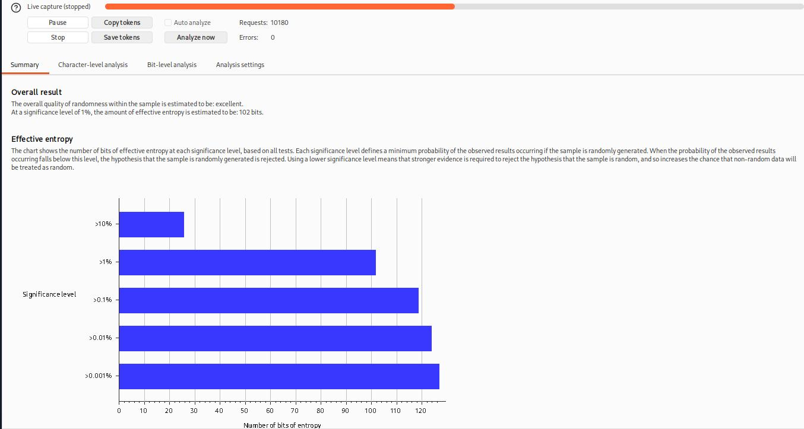

# [Burp Suite: Other Modules](https://tryhackme.com/room/burpsuiteom)

## Decoder: Overview

The Decoder module of Burp gives user data manipulation capabilities. As implied by its name, it not only decodes data intercepted during an attack but also provides the function to encode our own data, prepping it for transmission to the target. Decoder also allows us to create hashsums of data, as well as providing a Smart Decode feature, which attempts to decode provided data recursively until it is back to being plaintext (like the "Magic" function of [Cyberchef (opens in new tab)](https://gchq.github.io/CyberChef/)).

1. This box serves as the workspace for entering or pasting data that requires encoding or decoding. Consistent with other modules of Burp, data can be moved to this area from different parts of the framework via the **Send to Decoder** option upon right-clicking.
2. At the top of the list on the right, there's an option to treat the input as either text or hexadecimal byte values.
3. As we move down the list, dropdown menus are present to encode, decode, or hash the input.
4. The **Smart Decode** feature, located at the end, attempts to auto-decode the input.

### Questions

Q: Which feature attempts auto-decode of the input?

A: `smart decode`

## Decoder: Encoding/Decoding

Now, let's examine the manual encoding and decoding options in detail. These are identical whether the decoding or encoding menu is chosen:

- **Plain**: This refers to the raw text before any transformations are applied.
- **URL**: URL encoding is utilized to ensure the safe transfer of data in the URL of a web request. It involves substituting characters for their ASCII character code in hexadecimal format, preceded by a percentage symbol (%). This method is vital for any type of web application testing.
- **HTML**: HTML Entities encoding replaces special characters with an ampersand (&), followed by either a hexadecimal number or a reference to the character being escaped, and ending with a semicolon (;). This method ensures the safe rendering of special characters in HTML and helps prevent attacks such as XSS. The HTML option in Decoder allows any character to be encoded into its HTML escaped format or decode captured HTML entities.
- **Base64**: Base64, a commonly used encoding method, converts any data into an ASCII-compatible format. The under-the-hood functioning isn't crucial at this stage; however, interested individuals can find the underlying mathematics [here (opens in new tab)](https://stackabuse.com/encoding-and-decoding-base64-strings-in-python).
- **ASCII Hex**: This option transitions data between ASCII and hexadecimal representations. For instance, the word "ASCII" can be converted into the hexadecimal number "4153434949". Each character is converted from its numeric ASCII representation into hexadecimal.
- **Hex, Octal, and Binary**: These encoding methods apply solely to numeric inputs, converting between decimal, hexadecimal, octal (base eight), and binary representations.
- **Gzip**: Gzip compresses data, reducing file and page sizes before browser transmission. Faster load times are highly desirable for developers looking to enhance their SEO score and avoid user inconvenience. Decoder facilitates the manual encoding and decoding of gzip data, although it often isn't valid ASCII/Unicode.
### Questions

Q: Base64 encode the phrase: Let's Start Simple.What is the base64 encoded version of this text?

A: `TGV0J3MgU3RhcnQgU2ltcGxl`

Q: URL Decode this data: %4e%65%78%74%3a%20%44%65%63%6f%64%69%6e%67.What is the plaintext returned?

A: `Next: Decoding`

Q: Use Smart decode to decode this data: &#x25;&#x33;&#x34;&#x25;&#x33;&#x37;.What is the decoded text?

A: `47`

Q: Encode this phrase: Encoding Challenge.Start with base64 encoding. Take the output of this and convert it into ASCII Hex. Finally, encode the hex string into octal.What is the final string?

A: `24034214a720270024142d541357471232250253552c1162d1206c`

## Decoder: Hashing

Hashing is a one-way process that transforms data into a unique signature. For a function to qualify as a hashing algorithm, the output it generates must be irreversible. A proficient hashing algorithm ensures that every data input will generate a completely unique hash. For instance, using the MD5 algorithm to produce a hashsum for the text "MD5sum" returns `4ae1a02de5bd02a5515f583f4fca5e8c`. Using the same algorithm for "MD5SUM" yields an entirely different hash despite the close resemblance of the input: `13b436b09172400c9eb2f69fbd20adad`. Therefore, hashes are commonly used to verify the integrity of files and documents, as even a tiny alteration to the file significantly changes the hashsum.

Moreover, hashes are used to securely store passwords since the one-way hashing process makes the passwords relatively secure, even if the database is compromised. When a user creates a password, the application hashes and stores it. During login, the application hashes the submitted password and compares it against the stored hash; if they match, the password is correct. Using this method, an application never needs to store the original (plaintext) password.
### Questions

Q: Using Decoder, what is the SHA-256 hashsum of the phrase: Let's get Hashing!?Convert this into an ASCII Hex string for the answer to this question.

A: `6b72350e719a8ef5af560830164b13596cb582757437e21d1879502072238abe`

Q: Generate an MD4 hashsum of the phrase: Insecure Algorithms.Encode this as base64 (not ASCII Hex) before submitting.

A: `TcV4QGZZN7y7lwYFRMMoeA==`

Q: Let's look at an in-context example:First, download the file attached to this task.Note: This file can also be downloaded from the deployed VM with wget http://MACHINE_IP:9999/AlteredKeys.zip — you may find this helpful if you are using the AttackBox.Now read the problem specification below:"Some joker has messed with my SSH key! There are four keys in the directory, and I have no idea which is the real one. The MD5 hashsum for my key is 3166226048d6ad776370dc105d40d9f8 — could you find it for me?"What is the correct key name?

A: `key3`

## Comparer: Overview

Comparer, as the name implies, lets us compare two pieces of data, either by ASCII words or by bytes.

The interface can be divided into three main sections:

1. On the left, we see the items to be compared. When we load data into Comparer, it appears as rows in these tables. We select two datasets to compare.
2. On the upper right, we have options for pasting data from the clipboard (Paste), loading data from a file (Load), removing the current row (Remove), and clearing all datasets (Clear).
3. Lastly, on the lower right, we can choose to compare our datasets by either words or bytes. It doesn't matter which of these buttons you select initially because this can be changed later. These are the buttons we click when we're ready to compare the selected data.

Once we've added at least 2 datasets to compare and press on either **Words** or **Bytes**, a pop-up window shows us the comparison:

This window also has three distinct sections:

1. The compared data occupies most of the window; it can be viewed in either text or hex format. The initial format depends on whether we chose to compare by words or bytes in the previous window, but this can be overridden by using the buttons above the comparison boxes.
2. The comparison key is at the bottom left, showing which colors represent modified, deleted, and added data between the two datasets.
3. The **Sync views** checkbox is at the bottom right of the window. When selected, it ensures that both sets of data will sync formats. In other words, if you change one of them into Hex view, the other will adjust to match.

### Questions

Q: Click me to proceed to the next task.

A: ``

## Comparer: Example

There are many situations where being able to quickly compare two (potentially very large) pieces of data can come in handy.

For example, when performing a login bruteforce or credential stuffing attack with Intruder, you may wish to compare two responses with different lengths to see where the differences lie and whether the differences indicate a successful login.

## Sequencer: Overview

Sequencer allows us to evaluate the entropy , or randomness, of "tokens". Tokens are strings used to identify something and should ideally be generated in a cryptographically secure manner. These tokens could be session cookies or **C**ross-**S**ite **R**equest **F**orgery (CSRF) tokens used to protect form submissions. If these tokens aren't generated securely, then, in theory, we could predict upcoming token values. The implications could be substantial, for instance, if the token in question is used for password resets.

Let's start by looking at the Sequencer interface:

We have two main ways to perform token analysis with Sequencer:

- **Live Capture**: This is the more common method and is the default sub-tab for Sequencer. Live capture lets us pass a request that will generate a token to Sequencer for analysis. For instance, we might want to pass a POST request to a login endpoint to Sequencer, knowing that the server will respond with a cookie. With the request passed in, we can instruct Sequencer to start a live capture. It will then automatically make the same request thousands of times, storing the generated token samples for analysis. After collecting enough samples, we stop the Sequencer and allow it to analyze the captured tokens.
    
- **Manual Load**: This allows us to load a list of pre-generated token samples directly into Sequencer for analysis. Using Manual Load means we don't need to make thousands of requests to our target, which can be noisy and resource-intensive. However, it does require that we have a large list of pre-generated tokens.

### Questions

Q: What does Sequencer allow us to evaluate?

A: `entropy`

## Sequencer: Live Capture

First, capture a request to `http://MACHINE_IP/admin/login/` in the

. Right-click on the request and select **Send to Sequencer**.

In the "Token Location Within Response" section, we can select between **Cookie**, **Form field**, and **Custom location**. Since we're testing the loginToken in this case, select the "Form field" radio button and choose the loginToken from the dropdown menu:

In this situation, we can safely leave all other options at their default values

A new window will pop up indicating that a live capture is in progress and displaying the number of tokens captured so far. Wait until a sufficient number of tokens are captured (approximately 10,000 should suffice); the more tokens we have, the more precise our analysis will be.

Once around 10,000 tokens are captured, click on **Pause** and then select the **Analyze now** button:

### Questions

Q: What is the overall quality of randomness estimated to be?

A: `excellent`

## Sequencer: Analysis

The generated entropy analysis report is split into four primary sections. The first of these is the **Summary** of the results. The summary gives us the following:

- **Overall result**: This gives a broad assessment of the security of the token generation mechanism. In this case, the level of entropy indicates that the tokens are likely securely generated.
    
- **Effective** entropy: This measures the randomness of the tokens. The effective- of 117 bits is relatively high, indicating that the tokens are sufficiently random and, therefore, secure against prediction or brute force attacks.
    
- **Reliability**: The significance level of 1% implies that there is 99% confidence in the accuracy of the results. This level of confidence is quite high, providing assurance in the accuracy of the effective entropy estimation.
    
- **Sample**: This provides details about the token samples analyzed during the entropy testing process, including the number of tokens and their characteristics.
    

While the summary report often provides enough information to assess the security of the token generation process, it's important to remember that further investigation may be necessary in some cases. The character-level and bit-level analysis can provide more detailed insights into the randomness of the tokens, especially when the summary results raise potential concerns.

While the entropy report can provide a strong indicator of the security of the token generation mechanism, there needs to be more definitive proof. Other factors could also impact the security of the tokens, and the nature of probability and statistics means there's always a degree of uncertainty. That said, an effective entropy of 117 bits with a significance level of 1% suggests a robustly secure token generation process.

### Questions

Q: Click me to proceed to the next task.

A: ``

## Organizer: Overview

The Organizer module of  Burp is designed to help you store and annotate copies of HTTP requests that you may want to revisit later. This tool can be particularly useful for organizing your penetration testing workflow. Here are some of its key features:

- You can store requests that you want to investigate later, save requests that you've already identified as interesting, or save requests that you want to add to a report later.
    
- You can send HRRP requests to Burp Organizer from other Burp Modules such as **Proxy** or **Repeater**. Each request that you send to Organizer is a read-only copy of the original request saved at the point you sent it to Organizer.

Requests are stored in a table, which contains columns such as the request index number, the time the request was made, workflow status, Burp tool that the request was sent from, HTTP method, server hostname, URL file path, URL query string, number of parameters in the request, HTTP status code of the response, length of the response in bytes, and any notes that you have made.

### Questions

Q: Are saved requests read-only? (yea/nay)

A: `yea`
