# [Burp Suite Basics](https://tryhackme.com/room/burpsuitebasics)

## `Getting Started` What is Burp Suite?

- **Burp Suite** is a framework written in Java that aims to provide a one-stop-shop for web application penetration testing.

- Burp Suite is also very commonly used when assessing mobile applications, as the same features which make it so attractive for web app testing translate almost perfectly into testing the **APIs** (**Application Programming Interfaces**) powering most mobile apps.

- At the simplest level, Burp can capture and manipulate all of the traffic between an attacker and a webserver: this is the core of the framework. 

	- 	After capturing requests, we can choose to send them to various other parts of the Burp Suite framework

- The Burp Suite Professional and Enterprise editions both require expensive licenses but come with powerful extra features:

	- **Burp Suite Professional** is an unrestricted version of Burp Suite Community and has features such as:

    	- An automated vulnerability scanner
    	- A fuzzer/bruteforcer that isn't rate limited
    	- Saving projects for future use; report generation
    	- A built-in API to allow integration with other tools
    	- Unrestricted access to add new extensions for greater functionality
    	- Access to the Burp Suite Collaborator (effectively providing a unique request catcher self-hosted or running on a Portswigger owned server)

	- In short, Burp Pro is an extremely powerful tool -- which is why it comes with a £319/$399 price tag per user for a one-year subscription. 

		- For this reason, Burp Pro is usually only used by professionals (with licenses often being provided by employers).

	- **Burp Suite Enterprise** is slightly different. 

		- Unlike the community and professional editions, Burp Enterprise is used for continuous scanning. 

		- It provides an automated scanner that can periodically scan webapps for vulnerabilities in much the same way as software like [Nessus](https://tryhackme.com/room/rpnessusredux) performs  automated infrastructure scanning. 

		- Unlike the other editions of Burp Suite which allow you to perform manual attacks from your own computer, Enterprise sits on a server and constantly scans target web apps for vulnerabilities.

### Questions	

1. Which edition of Burp Suite will we be using in this module?

A: Burp Suite Community

2. Which edition of Burp Suite runs on a server and provides constant scanning for target web apps?

A: Burp Suite Enterprise

3. Burp Suite is frequently used when attacking web applications and ______ applications.

A: mobile

## `Getting Started` Features of Burp Community

- **Proxy**: 

	- The most well-known aspect of Burp Suite, the Burp Proxy allows us to intercept and modify requests/responses when interacting with web applications.

- **Repeater**: 

	- The second most well-known Burp feature -- [Repeater](https://tryhackme.com/room/burpsuiterepeater) -- allows us to capture, modify, then resend the same request numerous times. 

	- This feature can be absolutely invaluable, especially when we need to craft a payload through trial and error (e.g. in an SQLi -- Structured Query Language Injection) or when testing the functionality of an endpoint for flaws.

- **Intruder**: 

	- Although harshly rate-limited in Burp Community, [Intruder](https://tryhackme.com/room/burpsuiteintruder) allows us to spray an endpoint with requests. 

	- This is often used for *bruteforce attacks* or to *fuzz* endpoints.

- **Decoder**: 

	- Though less-used than the previously mentioned features, [Decoder](https://tryhackme.com/room/burpsuiteom) still provides a valuable service when transforming data -- either in terms of decoding captured information, or encoding a payload prior to sending it to the target. 

	- Whilst there are other services available to do the same job, doing this directly within Burp Suite can be very efficient.

- **Comparer**: 

	- As the name suggests, [Comparer](https://tryhackme.com/room/burpsuiteom) allows us to compare two pieces of data at either word or byte level. 

	- Again, this is not something that is unique to Burp Suite, but being able to send (potentially very large) pieces of data directly into a comparison tool with a single keyboard shortcut can speed things up considerably.

- **Sequencer**: 

	- We usually use [Sequencer](https://tryhackme.com/room/burpsuiteom) when assessing the randomness of tokens such as session cookie values or other supposedly random generated data. 

	- If the algorithm is not generating secure random values, then this could open up some devastating avenues for attack.

- The Burp Suite [Extender](https://tryhackme.com/room/burpsuiteextender) module can quickly and easily load extensions into the framework, as well as providing a marketplace to download third-party modules (referred to as the "BApp Store"). 

	- Whilst many of these extensions require a professional license to download and add in, there are still a fair number that can be integrated with Burp Community. 

		- For example, we may wish to extend the inbuilt logging functionality of Burp Suite with the [Logger++](https://github.com/portswigger/logger-plus-plus) module.

## Questions 

1. Which Burp Suite feature allows us to intercept requests between ourselves and the target?

A: proxy

2. Which Burp tool would we use if we wanted to bruteforce a login form?

A: intruder

## `Getting Started` The Dashboard

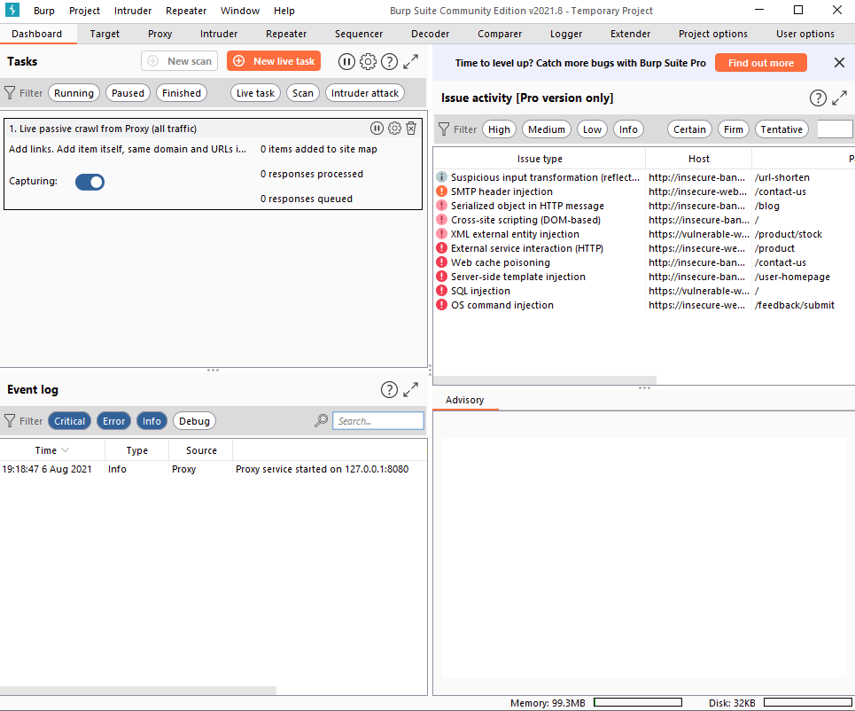

- In short, the Dashboard interface is split into four quadrants:

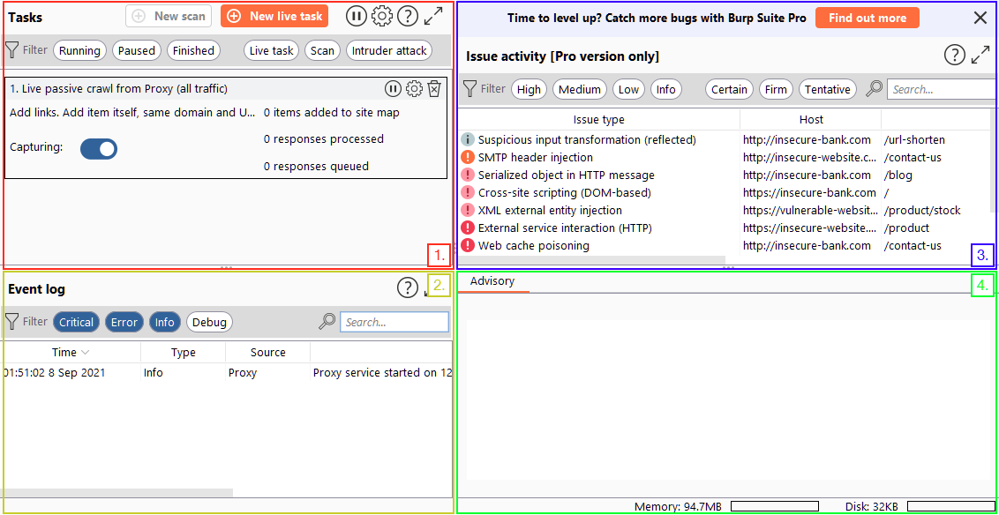

1. The Tasks menu allows us to define background tasks that Burp Suite will run whilst we use the application. The Pro version would also allow us to create on-demand scans. The default "Live Passive Crawl" (which automatically logs the pages we visit) will be more than suitable for our uses in this module.

2. The Event log tells us what Burp Suite is doing (e.g. starting the Proxy), as well as information about any connections that we are making through Burp.

3. The Issue Activity section is exclusive to Burp Pro. It won't give us anything using Burp Community, but in Burp Professional it would list all of the vulnerabilities found by the automated scanner. These would be ranked by severity and filterable by how sure Burp is that the component is vulnerable.

4. The Advisory section gives more information about the vulnerabilities found, as well as references and suggested remediations. These could then be exported into a report.

## `Getting Started` Navigation

- Navigating around the Burp Suite GUI by default is done entirely using the top menu bars:

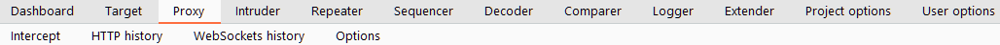

- Tabs can also be popped out into separate windows should you prefer to view multiple tabs separately. This can be done by clicking "Window" in the application menu at the top of the screen, then choosing to "Detach" tabs:

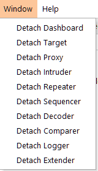

#important
- Burp Suite also has keyboard shortcuts that allow quick navigation to key tabs.

	- `CTRL + Shift + D` - Switch to Dasboard

	- `CTRL + Shift + T` - Switch to the Target tab

	- `CTRL + Shift + P` - Switch to the Proxy tab

	- `CTRL + Shift + I` - Switch to the Intruder tab

	- `CTRL + Shift + R` - Switch to the Repeater tab

## `Getting Started` Options

- The options provided in the `User options` tab will apply every time we open Burp Suite. 

- In contrast, the `Project options` will only apply to the current project. 

	- Given that we can't save projects in Burp Community, this means that our project options will reset every time we close Burp.

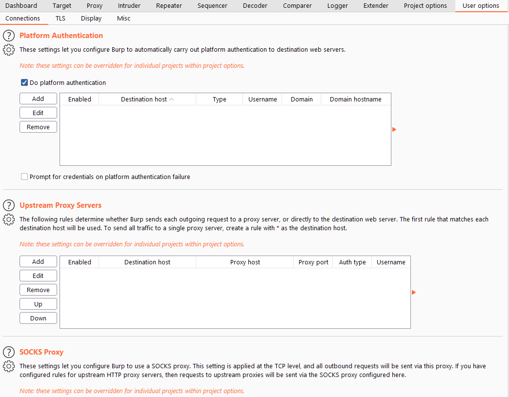

### User options

- There are four main sub-sections of the User options tab:

    - The options in the **Connections** sub-tab allow us to control how Burp makes connections to targets. 

    	- For example, we can set a proxy for Burp Suite to connect through; this is very useful if we want to use Burp Suite through a network pivot.
    
    - The **TLS** sub-tab allows us to enable and disable various TLS (Transport Layer Security) options, as well as giving us a place to upload client certificates should a web app require us to use one for connections.
    
    - An essential set of options: **Display** allows us to change how Burp Suite looks. 

    	- The options here include things like changing the font and scale, as well as setting the theme for the framework (e.g. dark mode) and configuring various options to do with the rendering engine in Repeater (more on this later!).
    
    - The **Misc** sub-tab contains a wide variety of settings, including the keybinding table (HotKeys), which allowing us to view and alter the keyboard shortcuts used by Burp Suite. Familiarising yourself with these settings would be advisable, as using the keybinds can speed up your workflow massively.

### Project options

- There are five sub-tabs here:

    - **Connections** holds many of the same options as the equivalent section of the User options tab: these can be used to override the application-wide settings. 

    	- For example, it is possible to set a proxy for just the project, overriding any proxy settings that you set in the User options tab. 
    	
    	- There are a few differences between this sub-tab and that of the User options, however. 
    		- For example, the "Hostname Resolution" option (allowing you to map domains to IPs directly within Burp Suite) can be very handy -- as can the "Out-of-Scope Requests" settings, which enable  us to determine whether Burp will send requests to anything you aren't explicitly targeting (more on this later!).
    
    - The **HTTP** sub-tab defines how Burp handles various aspects of the HTTP protocol: for example, whether it follows redirects or how to handle unusual response codes.
    
    - **TLS** allows us to override application-wide TLS options, as well as showing us a list of public server certificates for sites that we have visited.
    
    - The **Sessions** tab provides us with options for handling sessions. 

    	- It allows us to define how Burp obtains, saves, and uses session cookies that it receives from target sites. 

    	- It also allows us to define macros which we can use to automate things such as logging into web applications (giving us an instant authenticated session, assuming we have valid credentials).
    
    - There are fewer options in the **Misc** sub-tab than in the equivalent tab for the "User options" section. 

    	- Many of the options here are also only available if you have access to Burp Pro (such as those configuring Collaborator). 

    	- That said, there are a couple of options related to logging and the embedded browser (which we will look at in a couple of tasks) that are well worth perusing.

### Questions

1. Change the Burp Suite theme to dark mode

2. In which Project options sub-tab can you find reference to a "Cookie jar"?

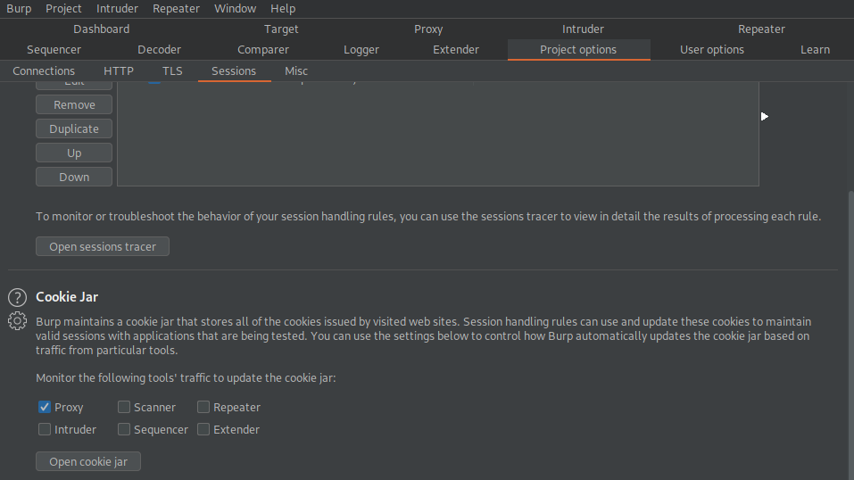

A: Sessions

3. In which User options sub-tab can you change the Burp Suite update behaviour?

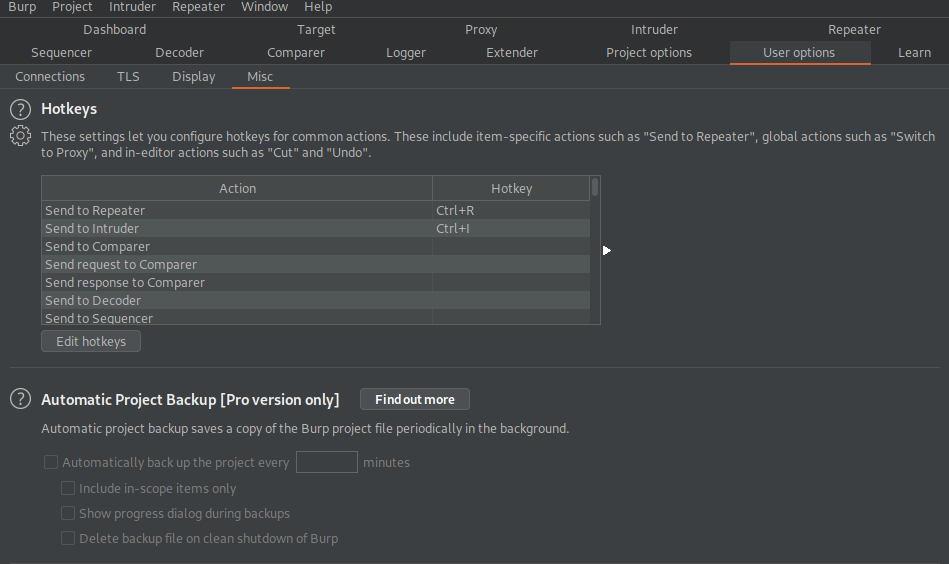

A: Misc

4. What is the name of the section within the User options "Misc" sub-tab which allows you to change the Burp Suite keybindings?

A: Hotkeys

5. If we have uploaded Client-Side TLS certificates in the User options tab, can we override these on a per-project basis (Aye/Nay)?

A: Aye

## `Proxy` Introduction to the Burp Proxy

#proxy

- The "`Or Request Was Intercepted`" rule is good for catching responses to all requests that were intercepted by the proxy:

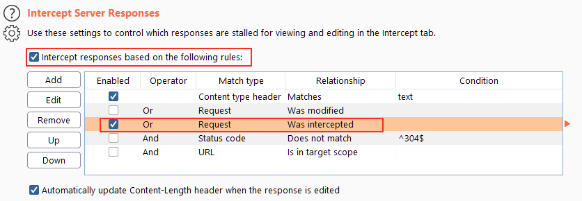

### Questions

1. Which button would we choose to send an intercepted request to the target in Burp Proxy?

A: Forward

2. [Research] What is the default keybind for this?

Note: Assume you are using Windows or Linux (i.e. swap Cmd for Ctrl). 

A: Ctrl+F

## `Proxy` Connecting through the Proxy (FoxyProxy)

#foxyproxy

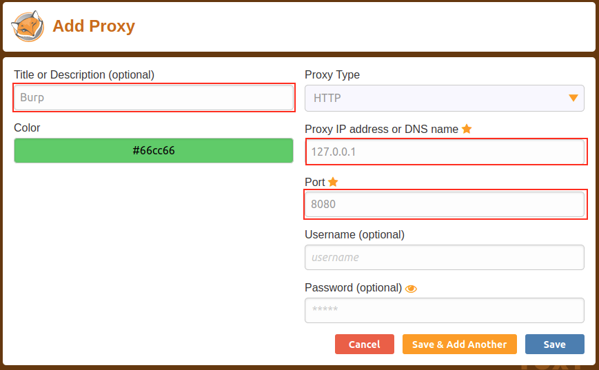

### Questions

1. Read through the options in the right-click menu.

There is one particularly useful option that allows you to intercept and modify the response to your request.

What is this option?

Note: The option is in a dropdown sub-menu.

- `Do intercept -> Response to this request`

A: Response to this request

2. [Bonus Question -- Optional] Try installing FoxyProxy standard and have a look at the pattern matching features.

## `Proxy` Proxying HTTPS 

- Great, so we can intercept HTTP traffic -- what's next?

- Unfortunately, there's a problem. 

- What happens if we navigate to a site with TLS enabled? For example, https://google.com/:

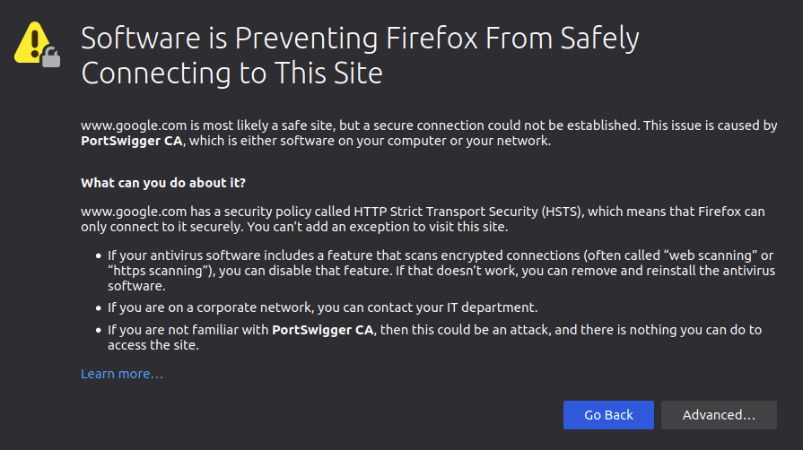

- We need to get Firefox to trust connections secured by Portswigger certs, so we will manually add the CA certificate to our list of trusted certificate authorities.

- First, with the proxy activated head to `http://burp/cert`; this will download a file called `cacert.der` -- save it somewhere on your machine.

- Next, type about:preferences into your Firefox search bar and press enter; this takes us to the FireFox settings page. 

	- Search the page for "certificates" and we find the option to "View Certificates":

- Clicking the "View Certificates" button allows us to see all of our trusted CA certificates. 
	
	- We can register a new certificate for Portswigger by pressing "Import" and selecting the file that we just downloaded.

## `Proxy` The Burp Suite Browser

- In addition to giving us the option to modify our regular web browser to work with the proxy, Burp Suite also includes a built-in Chromium browser that is pre-configured to use the proxy without any of the modifications we just had to do.

- Whilst this may seem ideal, it is not as commonly used as the process detailed in the previous few tasks. 

	- People tend to stick with their own browser as it gives them a lot more customisability; however, both are perfectly valid choices.

### Questions

1. Using the in-built browser, make a request to http://10.10.55.255/ and capture it in the proxy.

## `Proxy` Scoping and Targeting

#scoping

- It can get extremely tedious having Burp capturing all of our traffic. 

- When it logs everything (including traffic to sites we aren't targeting), it muddies up logs we may later wish to send to clients. 

	- In short, allowing Burp to capture everything can quickly become a massive pain.

>What's the solution? Scoping.

- Setting a scope for the project allows us to define what gets proxied and logged. 

- We can restrict Burp Suite to only target the web application(s) that we want to test. 

- The easiest way to do this is by switching over to the "Target" tab, right-clicking our target from our list on the left, then choosing "Add To Scope". 

	- Burp will then ask us whether we want to stop logging anything which isn't in scope -- most of the time we want to choose "yes" here.

- We can now check our scope by switching to the "Scope" sub-tab.

- The Scope sub-tab allows us to control what we are targeting by either Including or Excluding domains / IPs. 

	- This is a very powerful section, so it's well worth taking the time to get accustomed to using it.

- We just chose to disable *logging* for out of scope traffic, but the proxy will still be intercepting everything. 

- To turn this off, we need to go into the Proxy Options sub-tab and select "And URL Is in target scope" from the Intercept Client Requests section:

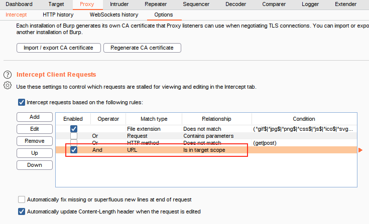

- With this option selected, the proxy will completely ignore anything that isn't in the scope, vastly cleaning up the traffic coming through Burp.

### Questions

1. Add http://10.10.55.255/ to your scope and change the Proxy settings to only intercept traffic to in-scope targets.

See the difference between the amount of traffic getting caught by the proxy before and after limiting the scope.

## `Proxy` Site Map and Issue Definitions

#sitemap #issuedefinitions

- Control of the scope may be the most useful aspect of the Target tab, but it's by no means the only use for this section of Burp.

- There are three sub-tabs under *Target*:

    - **Site map** allows us to map out the apps we are targeting in a tree structure. 

    	- Every page that we visit will show up here, allowing us to automatically generate a site map for the target simply by browsing around the web app. 

    	- Burp Pro would also allow us to spider the targets automatically (i.e. look through every page for links and use them to map out as much of the site as-is publicly accessible using the links between pages); however, with Burp Community, we can still use this to accumulate data whilst we perform our initial enumeration steps.
    
    	- The Site map can be especially useful if we want to map out an API, as whenever we visit a page, any API endpoints that the page retrieves data from whilst loading will show up here.
    
    - **Scope**: We have already seen the Scope sub-tab -- it allows us to control Burp's target scope for the project.
    
    - **Issue Definitions**: Whilst we don't have access to the Burp Suite vulnerability scanner in Burp Community, we do still have access to a list of all the vulnerabilities it looks for. 

    	- The Issue Definitions section gives us a huge list of web vulnerabilities (complete with descriptions and references) which we can draw from should we need citations for a report or help describing a vulnerability.

### Questions

Take a look around the site on http://10.10.55.255/ -- we will be using this a lot throughout the module. Visit every page linked to from the homepage, then check your sitemap -- one endpoint should stand out as being very unusual!

Visit this in your browser (or use the "Response" section of the site map entry for that endpoint)

1. What is the flag you receive?

- Checked out all of the pages I could access in the website and observed a weird URL in the site map

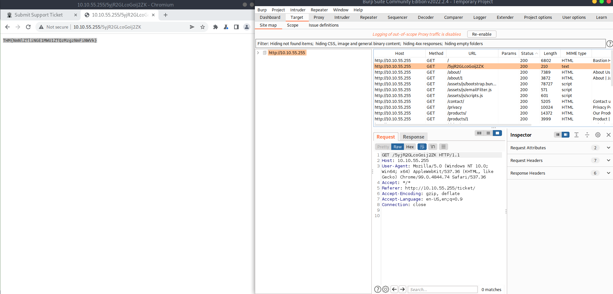

A: THM{NmNlZTliNGE1MWU1ZTQzMzgzNmFiNWVk}

2. Look through the Issue Definitions list.

What is the typical severity of a Vulnerable JavaScript dependency?

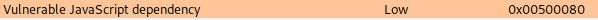

A: low

## `Practical` Example Attack

#xss #reflected

- Bypassing a client-side filter

- XSS does not work on the contact form, so we will use some real data first

- Entering some data in the Contact form and capture the request

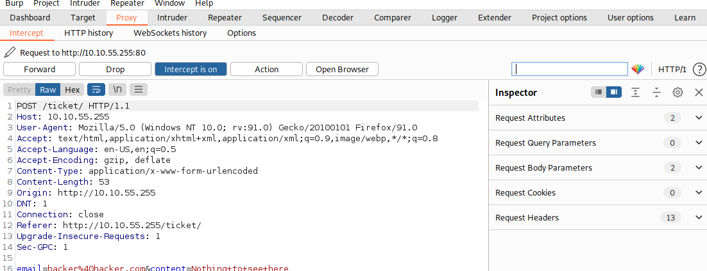

- With the request captured in the proxy, we can now change the email field to be our very simple payload from above: ``. 

- After pasting in the payload, we need to select it, then URL encode it with the Ctrl + U shortcut to make it safe to send. 

- Forwardung the request gives us a pop up message:

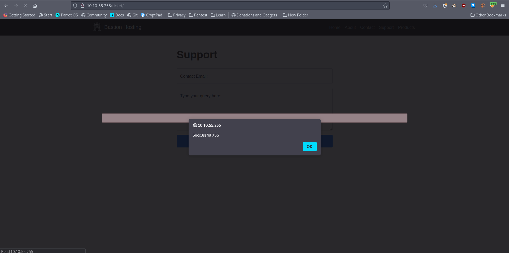