# [CAPA - The Basics](https://tryhackme.com/room/capabasics)

## Introduction

One of the challenges when analyzing potentially malicious software is that we risk our machine or environment being compromised when we run it unless we have a sandbox or a completely isolated environment where we can test all we want. Generally speaking, there are two types of analysis: dynamic analysis and static analysis. This room will focus on conducting static analysis using a tool called CAPA.

CAPA (Common Analysis Platform for Artifacts) is a tool developed by the FireEye Mandiant team. It is designed to **identify the capabilities** present in executable files like Portable Executables (PE), ELF binaries, .NET modules, shellcode, and even sandbox reports. It does so by analyzing the file and applying a set of rules that **describe common behaviours**, allowing it to determine what the **program is capable of doing**, such as **network communication**, **file manipulation**, **process injection**, and many more.

The beauty of CAPA is that it encapsulates years of reverse engineering knowledge into an automated tool, making it accessible even to those who may not be experts in reverse engineering. This can be incredibly useful for analysts and security professionals, allowing them to quickly understand potentially malicious software's functionality without manually reverse engineering the code.

This tool is particularly useful in malware analysis and threat hunting, where understanding a binary's capabilities is crucial for incident response and defensive measures.

In addition to the `-h` command, which gives us more information about the parameters available with the tool, we will use two (2) most used parameters, which is the `-v` and `-vv`, which will give us a more detailed result document. However, this will increase the processing time.

Run Capa as follows: `capa.exe .\cryptbot.bin -v`

Example output:

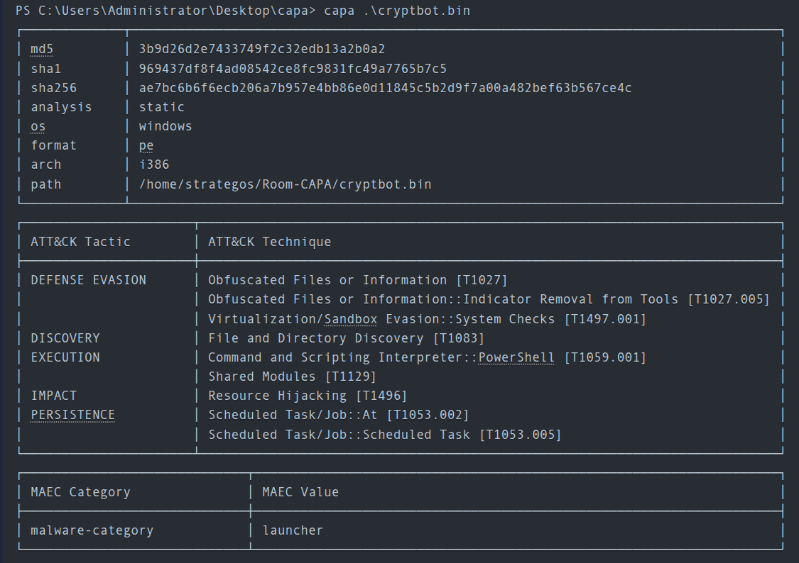

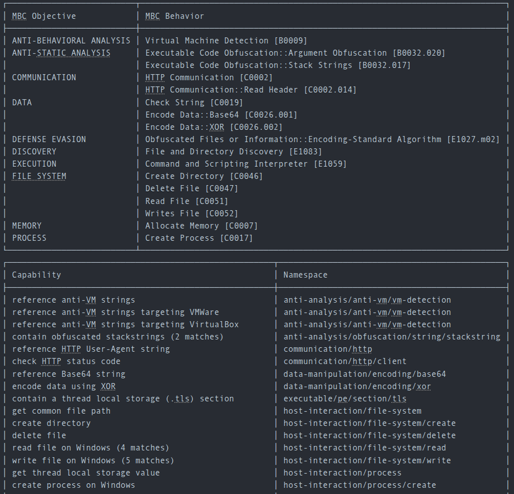

### Questions

Q: What command-line option would you use if you need to check what other parameters you can use with the tool? Use the shortest format.

A: `-h`

Q: What command-line options are used to find detailed information on the malware's capabilities? Use the shortest format.

A: `-v`

Q: What command-line options do you use to find very verbose information about the malware's capabilities? Use the shortest format.

A: `-vv`

Q: What PowerShell command will you use to read the content of a file?

A: `Get-Content`


## Dissecting CAPA Results Part 1: General Information, MITRE and MAEC

The first block contains basic information about the file. This includes the following:

- The cryptographic algorithms, such as the `md5`, and `sha1/256`.
- The `analysis` field tells us how CAPA performed its analysis on the file.
- The `os` field reveals the operating system (OS) context for which the identified capabilities apply.
- The `arch` field allows us to determine whether we are dealing with a binary related to x86 architecture.
- The `path` where the analyzed file was located.

### MITRE ATT&CK

The MITRE ATT&CK (Adversarial Tactics, Techniques, and Common Knowledge) framework is a comprehensive global knowledge repository that meticulously documents the tactics and techniques employed by threat actors at every stage of a cyber-attack. It functions as a strategic playbook, providing detailed insights into attackers' methods, from **gaining initial access** to **maintaining a presence**, **escalating privileges**, **evading defenses**, **moving laterally within a network**, and much more. 

CAPA uses this format for the output. Note that some results may or may not contain the Technique and Sub-technique Identifier.

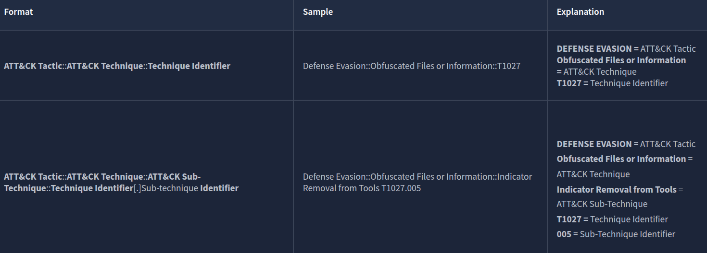

In CAPA's final output, they referenced the MITRE Framework. This helps analysts or defenders map the file's behaviour to the adversary's playbook, which can help narrow down the scope of the investigation during an incident

### MAEC

**Malware Attribute Enumeration and Characterization** is a specialized language designed to encode and communicate complex details concerning malware. It contains an extensive range of attributes, including behaviours, artefacts, and interconnections among various instances of malware. This language functions as a standardized system for tracking and analyzing the complicated complexities of malware.

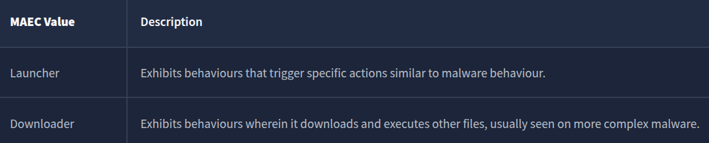

When CAPA tags a file with a “**launcher**” MAEC value, it indicates that the file demonstrates behaviour similar to but not limited to:

- Dropping additional payloads
- Activating persistence mechanisms
- Connecting to command-and-control (C2) servers
- Executing specific functions

Additionally, when CAPA tags a file with a “**Downloader**” MAEC value, it indicates that the file demonstrates behaviour similar but not limited to:

- Fetching additional payloads or resources from the internet  
    
- pulling in updates
- executing secondary stages
- retrieving configuration files

### Questions

Q: What is the sha256 of cryptbot.bin?

A: `ae7bc6b6f6ecb206a7b957e4bb86e0d11845c5b2d9f7a00a482bef63b567ce4c`

Q: What is the **Technique** Identifier of **Obfuscated Files or Information**?

A: `T1027`

Q: What is the **Sub-Technique** Identifier of **Obfuscated Files or Information::Indicator Removal from Tools**?

A: `T1027.005`

Q: When CAPA tags a file with this MAEC value, it indicates that it demonstrates behaviour similar to, but not limited to, **Activating persistence mechanisms**?

A: `launcher`

Q: When CAPA tags a file with this MAEC value, it indicates that the file demonstrates behaviour similar to, but not limited to, **Fetching additional payloads or resources from the internet**?

A: `Downloader`


## Dissecting CAPA Results Part 2: Malware Behavior Catalogue

### Malware Behavior Catalogue (MBC)

MBC is designed to support various aspects of malware analysis, such as labelling, similarity analysis, and standardized reporting. Essentially, it serves as a catalogue of malware objectives and behaviours. MBC can also link to ATT&CK methods and log all behaviours and code features discovered during malware analysis. It's important to note that the names of MBC behaviours may or may not match the corresponding ATT&CK techniques. The information on behaviour pages complements the content on ATT&CK pages. In other words, when recording malware behaviours, MBC users will reference ATT&CK, but MBC does not duplicate ATT&CK information.

The content of MBC below can be represented in two formats.

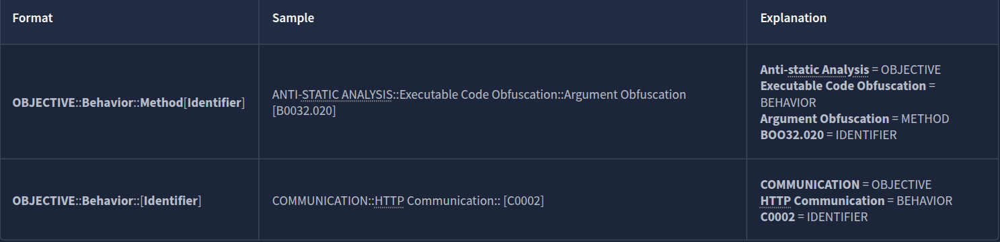

#### Objective

The Objective are based on **ATT&CK tactics in the context of malware behaviour**, though not all are included. Furthermore, MBC has Anti-Behavioral and Anti-Static Analysis. These objectives are tailored for malware analysis with the use case of **characterizing malware**

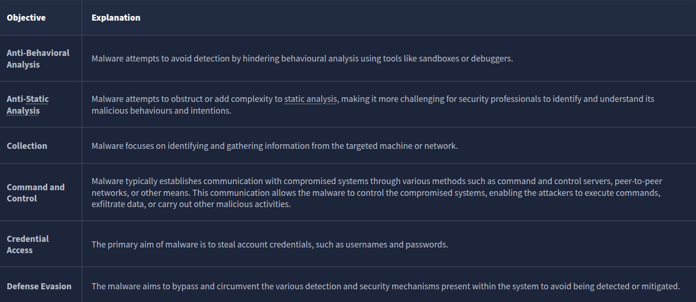

#### Micro-Objective  

 Micro-objectives are associated with micro-behaviors, which refer to an action or actions exhibited by potentially malicious software that isn't necessarily malicious and may serve various objectives. Example binaries are such as those in messaging apps. However, it's important to **note that these behaviours are typically abused.** That's why CAPA might have flagged this behaviour.

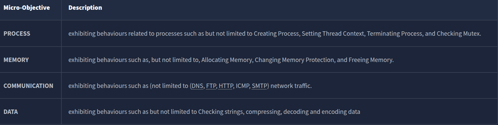

#### MBC Behaviors

The column MBC Behaviors contains behaviours and Micro-behaviors with or without its methods and identifiers. Please check the link [MBC Summary](https://github.com/MBCProject/mbc-markdown/blob/main/mbc_summary.md) for a listing of all MBC content.

Below is a compiled version of Behaviors/Micro-behaviors and its Identifier.

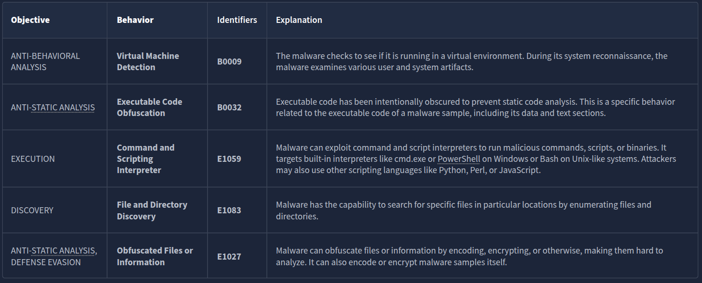

#### Micro-Behavior

The term "low-level behaviors" in malware analysis refers to actions exhibited by malware that aren't necessarily malicious and may serve various objectives. These behaviors are often documented as "micro-behaviors" in the Malware Behavior Characteristics (MBC) analysis. Examples of such low-level behaviors include the creation of TCP sockets and evaluating specific conditions within strings. It's important to **note that just because a behavior is categorized as low-level does not mean it is harmless,** as it may still be part of a larger malicious scheme.

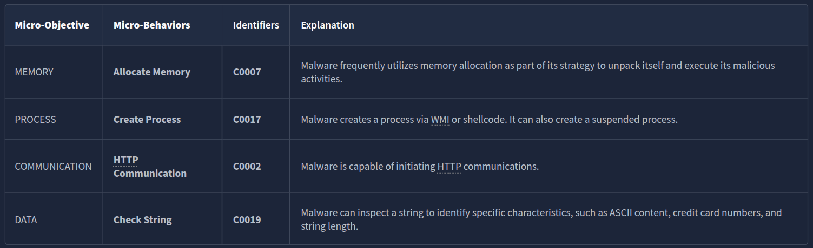

#### Methods

Lastly, let’s check the **METHODS**. Below are some methods included in the results from the previous sample. Methods are tied to behaviors; therefore, to fully see all methods, please refer to each specific behavior/micro behavior of interest.

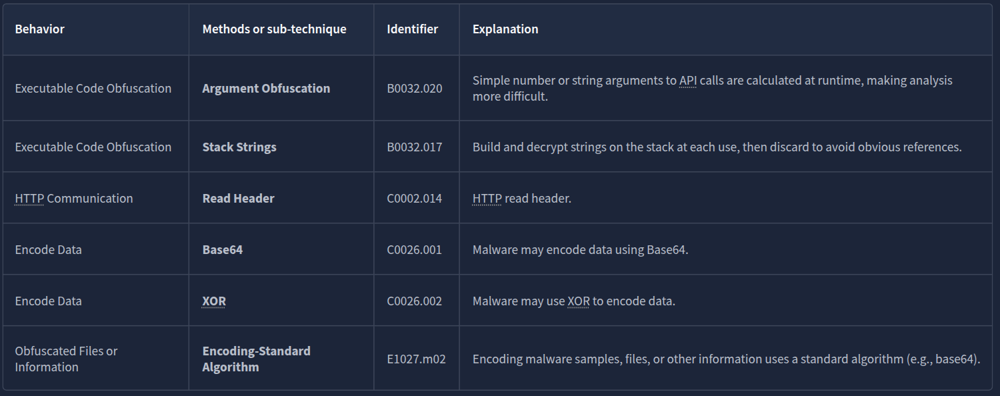

### Questions

Q: What serves as a catalogue of malware objectives and behaviours?

A: `Malware Behaviour Catalogue`

Q:  Which field is based on ATT&CK tactics in the context of malware behaviour?

A: `Objective`

Q: What is the Identifier of **"Create Process**" micro-behavior?

A: `C0017`

Q: What is the behaviour with an Identifier of **B0009**?

A: `Virtual Machine Detection`

Q: Malware can be used to obfuscate data using base64 and XOR. What is the related **micro-behavior** for this?

A: `Encode Data`

Q: Which micro-behavior refers to "**Malware is capable of initiating HTTP communications**"?

A: `HTTP Communication`


## Dissecting CAPA Results Part 3: Namespaces

The content of this block is represented in the below format.

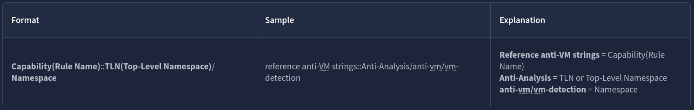

### Namespaces

CAPA uses namespaces to group items with the same purpose.

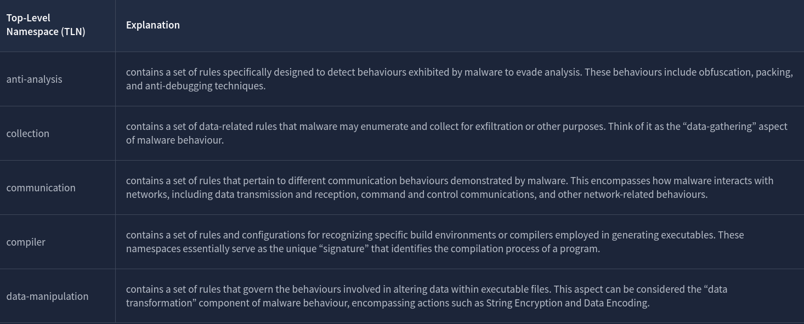

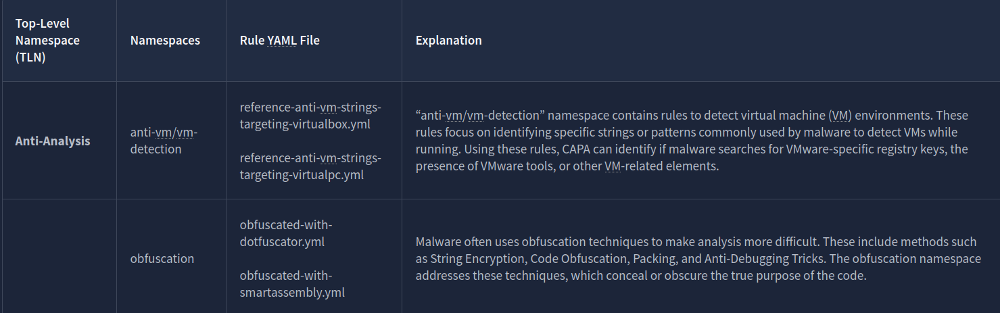

Each namespace has a collection of rules inside them that are also grouped together. For **anti-vm/vm-detection,** we have rules, and it's config file, such as:

- **reference-anti-vm-strings-targeting-virtualbox.yml**
- **reference-anti-vm-strings-targeting-virtualpc.ym**l

The same goes for the **obfuscation** namespace. We have rules that are grouped, such as:

- **obfuscated-with-dotfuscator.yml**
- **obfuscated-with-smartassembly.yml**

Again, do note that this is still under TLN **Anti-Analysis**!

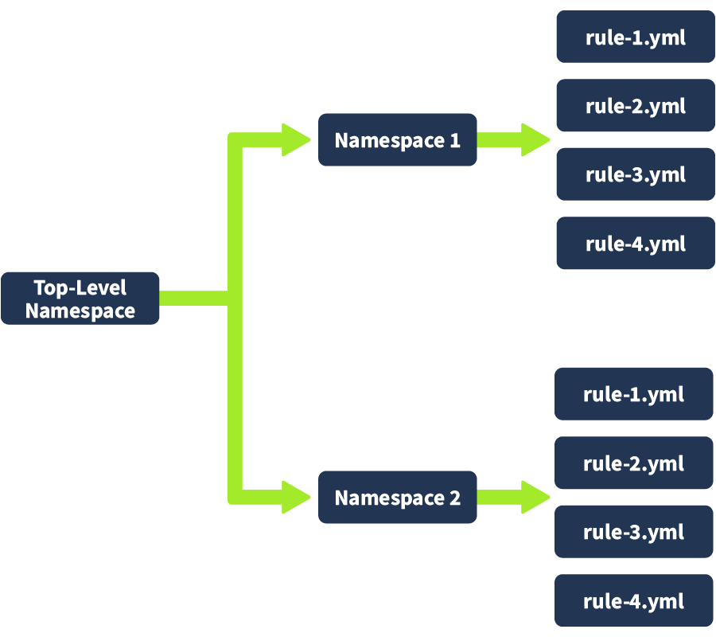

### Questions

Q: Which top-level Namespace contains a set of rules specifically designed to detect behaviours, including obfuscation, packing, and anti-debugging techniques **exhibited by malware to evade analysis**?

A: `anti-analysis`

Q: Which namespace contains rules to **detect virtual machine (VM) environments**? Note that this is not the TLN or Top-Level Namespace.

A: `**anti-vm/vm-detection**`

Q: Which Top-Level Namespace contains rules related to **behaviours associated with maintaining access or persistence within a compromised system**? This namespace is focused on understanding how malware can establish and maintain a presence within a compromised environment, allowing it to persist and carry out malicious activities over an extended period.

A: `persistence`

Q: Which namespace addresses techniques such as **String Encryption, Code Obfuscation, Packing, and Anti-Debugging Tricks**, which conceal or obscure the true purpose of the code?

A: `obfuscation`

Q: Which Top-Level Namespace Is a **staging ground** for rules that are not quite polished?

A: `Nursery`


## Dissecting CAPA Results Part 4: Capability

### Capability

Below is a table with the **Capability and its related TLN, namespace, and the rules associated** with the yaml file.

|Capability|Top-Level Namespace (TLN)|Namespaces|Rule YAML file|Notes|
|---|---|---|---|---|
|reference anti-VM strings|[**Anti-Analysis**](https://github.com/MBCProject/capa-rules-1/tree/master/anti-analysis)|anti-vm/vm-detection|reference-anti-vm-strings.yml|To check all rules under this namespace, click [here](https://github.com/MBCProject/capa-rules-1/tree/master/anti-analysis/anti-vm/vm-detection)|
|reference anti-VM strings targeting VMWare|**Anti-Analysis**|anti-vm/vm-detection|reference-anti-vm-strings-targeting-vmware.yml|To check all rules under this namespace, click [here](https://github.com/MBCProject/capa-rules-1/tree/master/anti-analysis/anti-forensic)|
|reference anti-VM strings targeting VirtualBox|**Anti-Analysis**|anti-vm/vm-detection|reference-anti-vm-strings-targeting-virtualbox.yml|You may check the TLN(Top-Level Namespace).|
|reference HTTP User-Agent string|[**Communication**](https://github.com/MBCProject/capa-rules-1/tree/master/communication)|http/client|reference-http-user-agent-string.yml|To check all rules under this namespace, click [here](https://github.com/MBCProject/capa-rules-1/tree/master/communication/http/client))|
|check HTTP status code|**Communication**|http|check-http-status-code.yml|To check all rules under this namespace, click [here](https://github.com/MBCProject/capa-rules-1/tree/master/communication/http)|
|reference Base64 string|[**Data Manipulation**](https://github.com/MBCProject/capa-rules-1/tree/master/data-manipulation)|encoding/base64|reference-base64-string.yml|To check all rules under this namespace, click [here](https://github.com/MBCProject/capa-rules-1/tree/master/data-manipulation/encoding/base64)|
|---|---|---|---|---|
|encode data using XOR|**Data Manipulation**|encoding/XOR|encode-data-using-xor.yml|To check all rules under this namespace, click [here](https://github.com/MBCProject/capa-rules-1/tree/master/data-manipulation/encoding/xor)|
|---|---|---|---|---|
|contain a thread local storage (.tls) section|[**Executable**](https://github.com/MBCProject/capa-rules-1/tree/master/executable)|pe/section/tls|contain-a-thread-local-storage-tls-section.yml|You may check the TLN(Top-Level Namespace) for more rules.|
|---|---|---|---|---|
|get common file path|[**Host-Interaction**](https://github.com/MBCProject/capa-rules-1/tree/master/host-interaction)|file-system|get-common-file-path.yml|You may check the TLN(Top-Level Namespace) for more rules.|
|---|---|---|---|---|
|create directory|**Host-Interaction**|file-system/create|create-directory.yml|You may check the TLN(Top-Level Namespace) for more rules.|
|---|---|---|---|---|
|delete file|**Host-Interaction**|file-system/delete|delete-file.yml|To check all rules under this namespace, click [here](https://github.com/MBCProject/capa-rules-1/tree/master/host-interaction/file-system/delete)|
|---|---|---|---|---|
|read file on Windows|**Host-Interaction**|file-system/read|read-file-on-windows.yml|To check all rules under this namespace, click [here](https://github.com/MBCProject/capa-rules-1/tree/master/host-interaction/file-system/read)|
|---|---|---|---|---|
|write file on Windows|**Host-Interaction**|file-system/write|write-file-on-windows.yml|To check all rules under this namespace, click [here](https://github.com/MBCProject/capa-rules-1/tree/master/host-interaction/file-system/write)|
|---|---|---|---|---|
|get thread local storage value|**Host-Interaction**|process|get-thread-local-storage-value.yml|This rule is found under **TLN [Nursery](https://github.com/mandiant/capa-rules/tree/master/nursery),** a staging ground for unpolished rules.|
|---|---|---|---|---|
|allocate or change RWX memory|**Host-Interaction**|process/inject|allocate-or-change-rwx-memory.yml|To check all rules under this namespace, click [here](https://github.com/MBCProject/capa-rules-1/tree/master/host-interaction/process/inject)|
|---|---|---|---|---|
|create process on Windows|**Host-Interaction**|process create|create-process-on-windows.yml|To check all rules under this namespace, click [here](https://github.com/MBCProject/capa-rules-1/tree/master/host-interaction/process/create)|
|---|---|---|---|---|
|reference cryptocurrency strings|[**Impact**](https://github.com/MBCProject/capa-rules-1/tree/master/impact)|impact/cryptocurrency|reference-cryptocurrency-strings.yml|This rule is found under **TLN [Nursery](https://github.com/mandiant/capa-rules/tree/master/nursery),** a staging ground for unpolished rules.|
|---|---|---|---|---|
|link function at runtime on Windows|[**Linking**](https://github.com/MBCProject/capa-rules-1/tree/master/linking)|runtime-linking|link-function-at-runtime-on-windows.yml|To check all rules under this namespace, click [here](https://github.com/MBCProject/capa-rules-1/tree/master/linking/runtime-linking)|
|---|---|---|---|---|
|parse PE header|[**load-code**](https://github.com/MBCProject/capa-rules-1/tree/master/load-code)|load-code/pe|parse-pe-header.yml  <br>  <br>resolve-function-by-parsing-pe-exports.yml|To check all rules under this namespace, click [here](https://github.com/MBCProject/capa-rules-1/tree/master/load-code/pe)|
|---|---|---|---|---|
|resolve function by parsing PE exports|[**load-code**](https://github.com/MBCProject/capa-rules-1/tree/master/load-code)|load-code/pe|resolve-function-by-parsing-pe-exports.yml|To check all rules under this namespace, click [here](https://github.com/MBCProject/capa-rules-1/tree/master/load-code/pe)|
|---|---|---|---|---|
|run PowerShell expression|[**load-code**](https://github.com/MBCProject/capa-rules-1/tree/master/load-code/powershell)|load-code/PowerShell|run-powershell-expression.yml|To check all rules under this namespace, click [here](https://github.com/MBCProject/capa-rules-1/tree/master/linking/runtime-linking)|
|---|---|---|---|---|
|schedule task via at|[**persistence**](https://github.com/MBCProject/capa-rules-1/tree/master/persistence)|scheduled-tasks|schedule-task-via-at.yml|You may check the TLN(Top-Level Namespace) for more rules.|
|---|---|---|---|---|
|schedule task via schtasks|[**persistence**](https://github.com/MBCProject/capa-rules-1/tree/master/persistence)|scheduled-tasks|schedule-task-via-schtasks.yml|You may check the TLN(Top-Level Namespace) for more rules.|
|---|---|---|---|---|

To further explain this, let’s check the first capability on the table, “**reference anti-VM strings”**.

- We note that the related rules in YML format are **reference-anti-vm-strings.yml**
- This is under the namespace **anti-vm/vm-detection**
- which is also under the Top-Level Namespace **Anti-Analysis**

This tells us that CAPA was able to identify that the potentially malicious software **searches for VMware-specific registry keys**, the **presence of VMware tools**, or other **VM-related elements** by using the **reference-anti-vm-strings.yml** rule yaml file. Malware typically does this behaviour to avoid detection. That is why CAPA flagged this one.

Let’s have another example. Let’s look at "_**schedule task via schtasks**_"_._

- We note that the related rules in YML format is **schedule-task-via-schtasks.yml***
- This is under the namespace **scheduled-tasks**
- which is also under the Top-Level Namespace **persistence**

This tells us that CAPA could identify behaviours related to scheduled tasks within the Windows operating system. It might have recognized patterns indicating that the executable registers itself as a scheduled task to maintain persistence using the rule defined in **schedule-task-via-schtasks.yml.**

The item under Capability has the same name as the YML files under the Rules, with the addition of a dash (-) character between spaces! Simple because Capability is the name of the rule.

Let's analyze the results from our CAPA analysis once again:

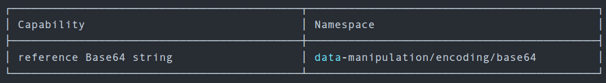

|Label|Value|Explanation|
|---|---|---|
|Capability|**reference base64 string**|Malware has the capability to encode data using a base64 scheme.|
|Top-Level Namespace|**data-manipulation**|contains a set of rules that govern the behaviors involved in altering data within executable files. This aspect can be considered the “data transformation” component of malware behaviour, encompassing actions such as String Encryption and Data Encoding.|
|Namespace|**encoding/base64**|this namespace consists of rules for encoding and decoding data using Base64 and XOR|
|Rule YAML File Matched?|**reference-base64-string.yml**|Remember that the capability's name is also the rule's name with an additional dash (-) character between spaces.|

### Questions

Q: What **rule yaml file** was matched if the Capability or rule name is **check HTTP status code**?

A: `check-http-status-code.yml`

Q: What is the **name of the Capability** if the rule YAML file is `reference-anti-vm-strings.yml`?

A: `reference anti-VM strings`

Q: Which **TLN** or Top-Level Namespace includes the Capability or rule name **run PowerShell expression**?

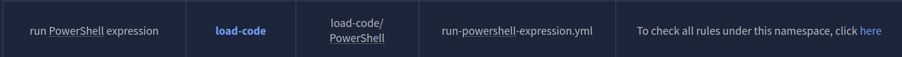

A: `load-code`

Q: Check the conditions inside the `check-for-windows-sandbox-via-registry.yml` rule file from this [link](https://github.com/MBCProject/capa-rules-1/blob/master/anti-analysis/anti-vm/vm-detection/check-for-windows-sandbox-via-registry.yml). What is the **value of the API** that ends in `Ex` is it looking for?

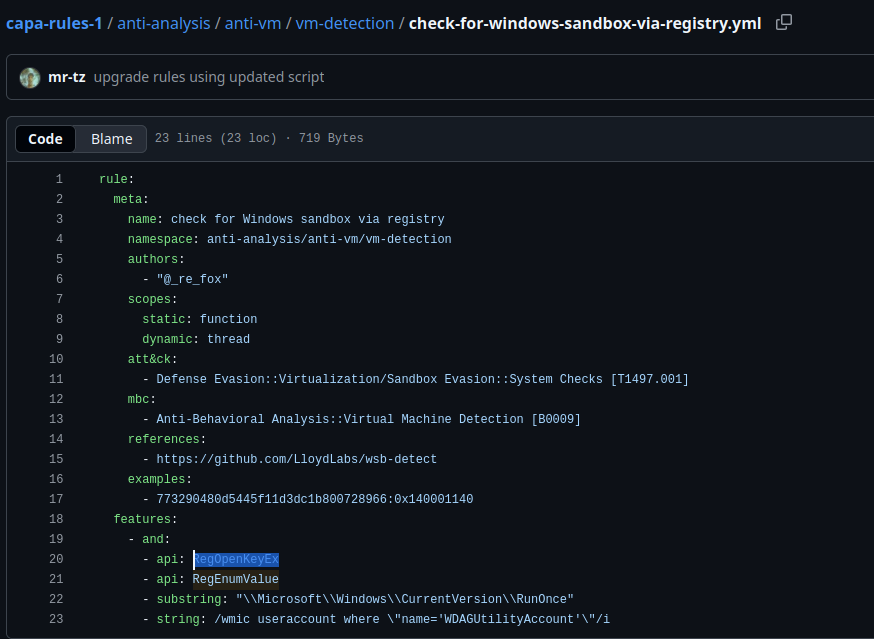

A: `RegOpenKeyEx`


## More information, more fun!

We will seek to determine the reason for triggering the rules and the conditions involved. We will use the parameter `-vv`  or **very verbose** to achieve this.

o analyze this result with ease, we need to do two things. First, we will use the parameter `-j` and `-vv`, and direct the result to a **.json** file. The command would be `capa.bin -j -vv .\cryptbot.bin > cryptbot_vv.json`

### CAPA Web Explorer

The second thing we need to do is upload the file to **CAPA Explorer Web**. We can either use their online version here on this [link](https://mandiant.github.io/capa/explorer/#/), or the offline version already in the virtual machine.

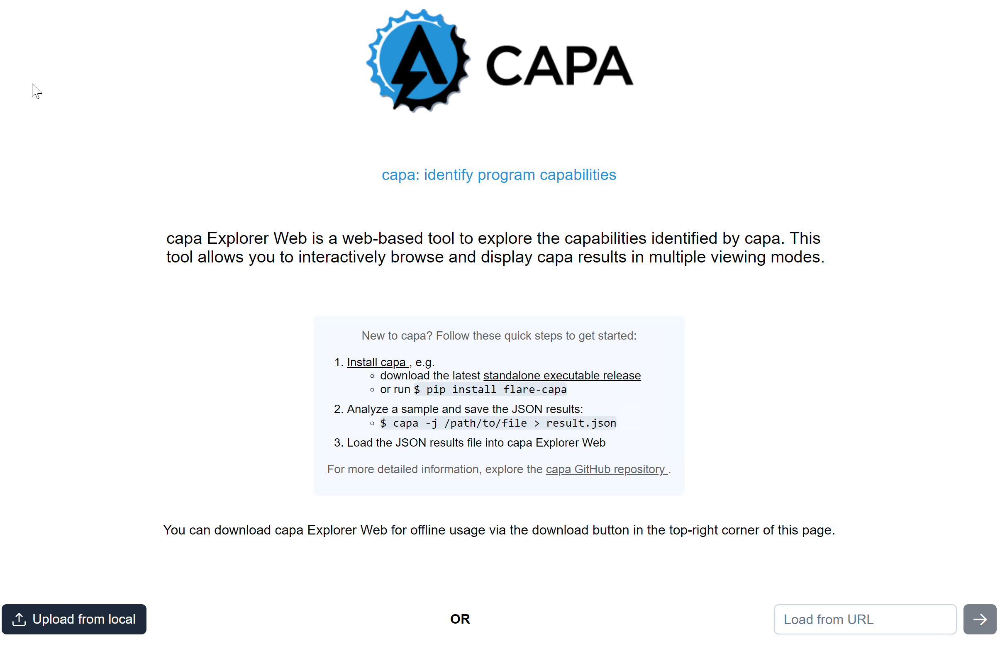

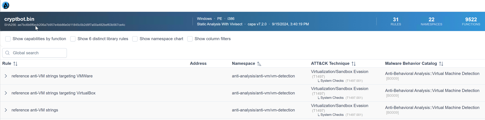

We know that the capability was to **reference anti-VM strings targeting VMWare,** and the corresponding rule config file or yaml file is **anti-VM-Strings-targeting-VMWare.yml.** Notice the box from the image.

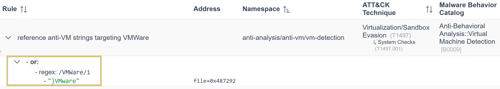

 Then, let us show you an overview of the rule's content. Focus on the **features** as CAPA uses the succeeding strings below to check if strings are within the analyzed file.

```yaml
rule:
  meta:
    name: reference anti-VM strings targeting VMWare
    namespace: anti-analysis/anti-vm/vm-detection
    authors:
      - michael.hunhoff@mandiant.com
      - "@johnk3r"
    scopes:
      static: file
      dynamic: file
    att&ck:
      - Defense Evasion::Virtualization/Sandbox Evasion::System Checks [T1497.001]
    mbc:
      - Anti-Behavioral Analysis::Virtual Machine Detection [B0009]
    references:
      - https://github.com/LordNoteworthy/al-khaser/blob/master/al-khaser/AntiVM/VMWare.cpp
    examples:
      - al-khaser_x86.exe_
      - b83480162ede09d4aa6d4850f9faa0a4c3834152752fd04cfdb22d647aa1f825:0x17D80
  features:
    - or:
      - string: /VMWare/i
      - string: /VMTools/i
      - string: /SOFTWARE\\VMware, Inc\.\\VMware Tools/i
      - string: /VMWare/i
      - string: /VMTools/i
      - string: /SOFTWARE\\VMware, Inc\.\\VMware Tools/i
      - string: /vmnet\.sys/i
      - string: /vmmouse\.sys/i
      - string: /vmusb\.sys/i
      - string: /vm3dmp\.sys/i
      - string: /vmci\.sys/i
      - string: /vmhgfs\.sys/i
      - string: /vmmemctl\.sys/i
      - string: /vmx86\.sys/i
      - string: /vmrawdsk\.sys/i
      - string: /vmusbmouse\.sys/i
      - string: /vmkdb\.sys/i
      - string: /vmnetuserif\.sys/i
      - string: /vmnetadapter\.sys/i
      - string: /\\\\.\\HGFS/i
      - string: /\\\\.\\vmci/i
      - string: /vmtoolsd\.exe/i
      - string: /vmwaretray\.exe/i
      - string: /vmwareuser\.exe/i
      - string: /VGAuthService\.exe/i
      - string: /vmacthlp\.exe/i
      - string: /vmci/i
        description: VMWare VMCI Bus Driver
      - string: /vmhgfs/i
        description: VMWare Host Guest Control Redirector
      - string: /vmmouse/i
      - string: /vmmemctl/i
        description: VMWare Guest Memory Controller Driver
      - string: /vmusb/i
      - string: /vmusbmouse/i
      - string: /vmx_svga/i
      - string: /vmxnet/i
      - string: /vmx86/i
      - string: /VMwareVMware/i
      - string: /vmGuestLib\.dll/i
      - string: /vmGuestLib\.dll/i
      - string: /Applications\\VMwareHostOpen\.exe/i
      - string: /vm3dgl\.dll/i
      - string: /vmdum\.dll/i
      - string: /vm3dver\.dll/i
      - string: /vmtray\.dll/i
      - string: /VMToolsHook\.dll/i
      - string: /vmmousever\.dll/i
      - string: /VmGuestLibJava\.dll/i
      - string: /vmscsi\.sys/i
```


Did you see it? That's right! Under the features, the "**string: /VMWare/i"** is being referenced by CAPA Web Explorer. Simply, CAPA is saying that under this namespace, we could identify strings with a value of **VMWare** by using the conditions within the rule and with regex**.**

  
Let's have another sample.  We know that the capability was to reference the **scheduled task via schtasks**, and the corresponding rule was to schedule the **task via schtasks****.yml.** Notice the box from the image.

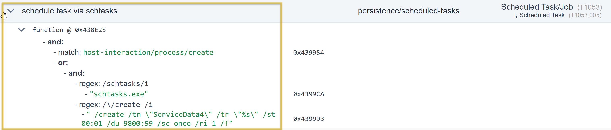

The same applies to our first example; we will show you the rule's content overview. Focus on the features, as CAPA uses the succeeding strings below to check if there are strings within the file being analyzed.

```yaml
rule:
  meta:
    name: schedule task via schtasks
    namespace: persistence/scheduled-tasks
    authors:
      - 0x534a@mailbox.org
    scopes:
      static: function
      dynamic: thread
    att&ck:
      - Persistence::Scheduled Task/Job::Scheduled Task [T1053.005]
    examples:
      - 79cde1aa711e321b4939805d27e160be:0x401440
  features:
    - and:
      - match: host-interaction/process/create
      - or:
        - and:
          - string: /schtasks/i
          - string: /\/create /i
        - string: /Register-ScheduledTask /i
```

Under the feature, the "**string: /schtasks/i** and **/\/create /i"** is referenced by CAPA Web Explorer. Simply, CAPA is saying under this namespace, and by using the conditions within the rule and with regex, we could identify strings with a value of **schtasks** and **create**.

### Global Search Box

Another cool feature of this tool is its filter options and the Global Search box, which are very helpful.

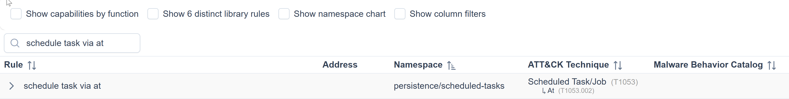

### Questions

Q: Which parameter allows you to output the result of CAPA into a **.json file**?

A: `-j`

Q: What tool allows you to interactively explore CAPA results in your web browser?

A: `CAPA Web Explorer`

Q: Which feature of this CAPA Web Explorer allows you to filter options or results?

A: `Global Search Box`