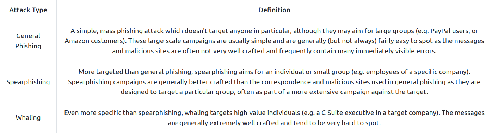
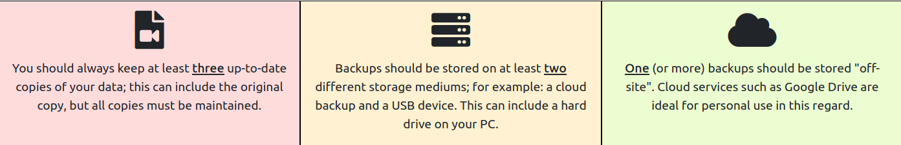

# [Common Attacks](https://tryhackme.com/room/commonattacks)

## Social Engineering

- relies on tricking humans to give the atatcker access, rather than using technological means to do that.

- The target is the *human*, rather than the computer.

- often results in gaining significant control over an individual's life.

- often multi-layered.

- Whilst direct interaction with targets is the most common style of social engineering, other examples include dropping USB storage devices in public (e.g. in company car parks) in the hope that someone (often a company employee) will pick one up and plug it into a sensitive computer. 

- In a similar vein, attackers may leave a "charging cable" plugged into a socket in a public place. 

- In actuality, the cable contains malicious software such as keyloggers or tools to take control of the victim's device.

### Case Study: Stuxnet 

Stuxnet was the name given to a particularly nasty computer virus (allegedly developed by the governments of the United States and Israel) that was originally used to target the Iran nuclear programme in 2009. Due to its ability as a "worm" to self-replicate (i.e. clone itself across networks — including the internet), the virus escaped and became much more widespread than was intended. Multiple variants now also exist, making Stuxnet a particularly hard-hitting and notorious weapon. You can read more about the background of Stuxnet [here](https://www.cyber.nj.gov/threat-center/threat-profiles/ics-malware-variants/stuxnet).

What makes Stuxnet particularly interesting for this section is the original method of infection. The virus can clone itself across networks, but that doesn't help much when the target network is a nuclear weapons development facility with no access to the wider internet. The question became: how can you get a virus into a network that doesn't let anything in or out? The answer was simple: drop malicious USB devices in places where workers at companies that dealt with the facility would find them and hope that one of them plugged the device into a work computer. In this case, the gamble worked, with Stuxnet causing severe damage to the Iran nuclear programme and effectively destroying many of the nuclear centrifuges.

### Staying Safe from Social Engineering Attacks

- Quite tricky, because it won't always be you who the attackers uses to gain access (ex.: calling your bank pretending it is you).

- Some measures:
	- set up multiple layers of authentication and give 'wrong' answers to security questions, while storing them in a safe place.
	- never plug in external media into your computer (especially one that is connected to other devices as well) that you don't trust
	- always insist on proof of identity 

### Questions

1. What was the original target of Stuxnet?

R: the Iran nuclear programme

## Social Engineering - Phishing

- one of the first attack vectors before performing other stronger attacks on the organisation's network.

- one of the most prolific attacks around.

### What is phishing?

- sub-section of social engineering.

- basically a scammer who tricks one to open a malicious website by sending them a text message, email or somethinh similar.

- traditionally, phishing reffered to emails, but nowadays it also propagates to instant messages, video calls etc.

- *smishing* = phishing over SMS

- *vishing* = phishing over voice chat

- deploys psychological trickery

- victim enters their credentials on the hacker's malicious website.

- but the victim may unknowingly install malware from the website and then giving the attacker an entry point into their device and network.

- *Types* of phishing:

	- *general phishing*: mass targeted and not that greatly done. 
	- *spearphishing*: targeted and better crafted.
	- *whaling*: targets highly-value individuals and are very hard to spot.

- *Steps*:

1. The attackers send out a malicious phishing email campaign.
2. Prospective victims receive the emails - some of them open the email and click the link.
3. The victims tner their credentials into the attacker's fake web page.
4. The web page stores the credentials or sends them directly to the attacker.
5. The attacker uses the credentials to access the site, thus taking over the victims' accounts.

- phishing attacks work best when using well known websites.

### Identifying Phishing Attacks

- poor grammar, generic greetings ('dear customer').

- the domain name will be something similar, but never identical. 

- Example: in 2021, scammers managed to register a domain name royalmai1.co.uk, opposite to the original one royalmail.co.uk and managed a quite susccessful smishing campaign.

- also, you can get tricked by going to a illegimate site using a legitimate name, such in the picture:

- the from email may be suspicious, as many times attackers don't bother to change it to a company's specific email.

### Staying Safe from Phishing Attacks

- delete unknown emails without opening them and / or mark them as spam / forward it to your IT Security Department.
- never open attachments from untrusted sources
- do not open links directly from the email/sms. Instead, manually browse that website on the web. If you really want to open it directly though, make sure the domain name is what it needs to be and it points to the real website.
- make sure your device and antivirus software are up-to-date.
- avoid making your personal information public.

## Malware (Malicious Software) and Ransomware

### Malware

- *Malware* = software designed to perform malicous actions on behalf of an attacker.

- Malware is often used to perform  a set of tasks reffered to as "**Command and Control**" (or **C2/C&C**). C2 malware connects back to a waiting server and allows an attacker to control the infected system remotely.

### Ransomeware

- encrypts the data on the devices and holds them for ransom.

- the ransom is usually some cryptocurrency that, if paid, *theoretically* will allow the data to be decrypted by getting a decryption key.

- uses known vulnerabilities in installed software and is easily spreadable after infecting.

- Example: [WannaCry](https://www.malwarebytes.com/wannacry)

### Delivery Methods

- usually through social engineerings attacks and phishing

- can use macros on Word Docs.

- work only if the victim presses "Enable Content" when they open the document.

- compiled as a *.exe*, *.pdf*, *.ps1* (PowerShell script), *.bat* (Batch script). *.hta* (HTML application file), *.js* (Java script).

### Staying safe

- always accept updates and patches when offered - especially on OS s, as they ussually include some fixes to security flaws.
- don't open suspicious links or attachements - just delete them, report them as spam or send them to the IT Security Department.
- be aware of people trying to get you to download or run files - especially over email or instant messaging.
- do not plug usb devices into important computers.
- back up your important data.
- antivirus is installed and up-to-date.

*Note: If you or your business get infected with ransomware, do not pay the ransom. Instead, call your local authorities immediately, and try to contain the infection by disabling your router or otherwise physically preventing the infected device from connecting to anything else. Do not power the infected device off, as this can sometimes destroy any potential opportunities to decrypt the data without paying.*

## Passwords and Authentication

- Current best practices lean more towards length than complexity. For example:

Vim is _obviously_, indisputably the best text editor in existence!

- By using a passphrase rather than a traditional password, the password is significantly longer whilst still retaining some of the more complex elements — despite not looking quite so obfuscated. 

- This has the advantage of being easier to remember whilst still being incredibly difficult to brute-force.

- Ideally, however, you should use long, completely random passwords. For example:

w41=V1)S7KIJGPN,dII>cHEh>FRVQsj3M^]CB

- These take millions of years to crack and are objectively the most secure option available.

- In short, any password that could easily be guessed by someone who knows you relatively well (this includes an attacker looking at your social media) is a bad idea!

- Equally, short passwords (especially those that don't contain any non-alphanumeric characters) are weak against brute-force attacks. We will look at this in more depth later in the task.

- So, what happens if a service gets hacked and their database containing user account information gets leaked? 
- As a best-case scenario, the service has used a secure hashing algorithm, and you have a strong password — in this case, your password is safe, but your email address or username may still be leaked publicly (so expect some spam emails). 

- *credentials stuffing* = using your stolen username and pw against other devices to see if you reused them elsewhere.

## Multi-factor Authentication and Password Managers

- *Multi-factor Authentication* (or MFA) is used to describe to authentication process where you have to use more than one way of authenticating.
	- for example, you enter your password and then you are sent a code on your phone that you need to enter before it expires (**Time-based One Time Password - TOTP** -> one of the most used second factors).
- At the most basic level, password managers provide a safe space to store your passwords. 

- They store passwords in "vaults": encrypted storage either locally on your own device, or as an online service (which also usually allows you to access your passwords from any device). 

- These vaults are accessed using a master password — the only password you need to remember —  or (more commonly in recent years) biometric data such as a fingerprint. 

- Some password managers are free, whilst others require a paid subscription. 

- Some common password managers include:
	- [1Password](https://1password.com/)
	- [LastPass](https://www.lastpass.com/)
	- [KeePass](https://keepass.info/)
	- [Bitwardem](https://bitwarden.com/)

## Public Network Safety

### Problem

- Public WiFi, whilst incredibly handy, also gives an attacker ideal opportunities to attack other users' devices or simply intercept and record traffic to steal sensitive information.

- The attacker can quickly set up a network of their own and monitor the traffic of everyone who connects; this is referred to as a "man-in-the-middle" attack and is very easy to carry out. 

- Equally, being connected to any network (regardless of whether you trust it or not) makes your device visible to others on the network. 
	- You never know who else is on a public network or what their intentions might be!

### Solution

- The ideal solution to this problem is simply not connecting to untrusted networks. 

- Beneficial though public wireless connections are, it will always be safer to use a mobile hotspot or private network. 

- *Virtual Private Networks* (VPNs) encrypt all traffic leaving and re-entering your machine, rendering any interception techniques useless as the intercepted data will simply look like gibberish.

- Options:
	- [ProtonVPN](https://protonvpn.com/)
	- [Mullvad](https://mullvad.net/en/)

- As with using a VPN, this prevents an attacker from reading, or modifying your web traffic if they intercept it. 

- The encrypted connection used to create HTTPS (Hyper Text Transfer Protocol Secure) is referred to as TLS (Transport Layer Security), and in most browsers is represented by a padlock to the left of the search bar, which indicates that the connection is secure

- In some instances, you may also see a p*adlock with a cross* through it or an exclamation mark over it; this indicates that the connection is theoretically secure but that there is something wrong with the certificate in use by the server. 

- The presence of this altered padlock icon can mean anything from the server administrator simply letting the certificate go out of date to an attacker actively meddling with the security of your connection. 

- In other words: if the icon is anything other than a regular padlock, do not trust that connection is secure.

## Backups

- Backups are arguably the single most important defensive measure you can take to protect your data.

### The Golden 3,2,1 Rule

- *but* of equal importance is the *frequency* at which you take backups. 

	- There's no point in keeping your backups stored securely if they are all a year old!
