# [Content Discovery](https://tryhackme.com/room/contentdiscovery)

## What is Content Discovery?

- content could mean pictures, videos etc. but we want to discover the hidden ones, like pages or portals intended for staff usage, older versions of the website, backup files, configuraion files, administration panels etc.

- Three main ways of discovering content:

	- *Manually*
	- *Automated*
	- *OSINT* (Open-Source Intelligence)

### Questions

1. What is the Content Discovery method that begins with M?

R: Manually

2. What is the Content Discovery method that begins with A?

R: Automated

3. What is the Content Discovery method that begins with O?

R: OSINT

## Manual Discovery - Robots.txt

- robots.txt is a document that tells search engines which pages are or are not allowed to be shown on their search engine or ban specific search engines from crawling the website altogether.

- Example of banned pages could be administration portals.

### Questions

1. What is the directory in the robots.txt that isn't allowed to be viewed by web crawlers?

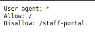

R: staff-portal

## Manual Discovery - Favicon

- favicon is a small icon displayed in the browser's address bar or tab used for branding a website.

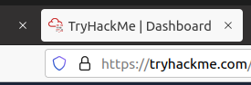

- sometimes when a framework is used to build a website, a favicon is left over and so we can figure out the framework that was used in building that website.

	- then we can check [this](https://wiki.owasp.org/index.php/OWASP_favicon_database) database of common frameworks

### Questions

1. What framework did the favicon belong to?

- Viewed the source and got the path to the favicon:

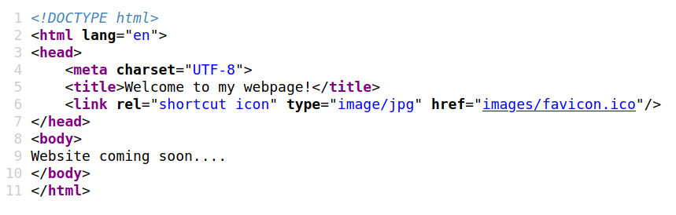

- Used the following command to get the md5 of the favicon: 

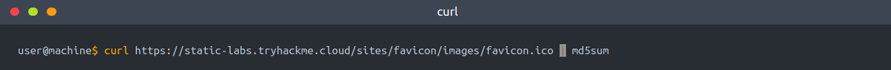

- Got the following md5:

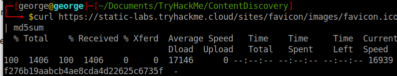

- Searched on the md5 databses of favicons and got the result:

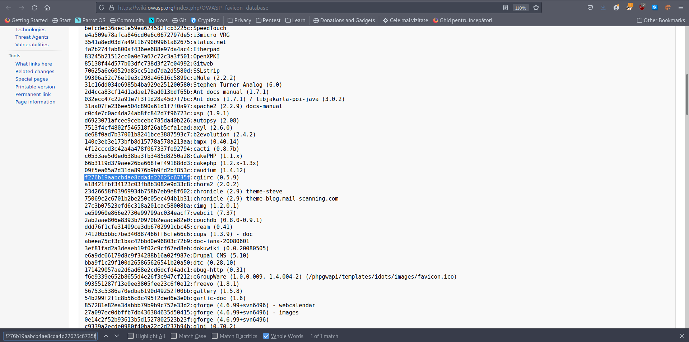

R: cgiirc

## Manual Discovery - Sitemap.xml

- unlike robots.txt which restricts the websites that search engine crawlers can look at, *sitemap.xml* lists all of the files that a search engine can show.

	- from this file we can maybe find some old versions of the website we can exploit.

### Questions

1. What is the path of the secret area that can be found in the sitemap.xml file? 

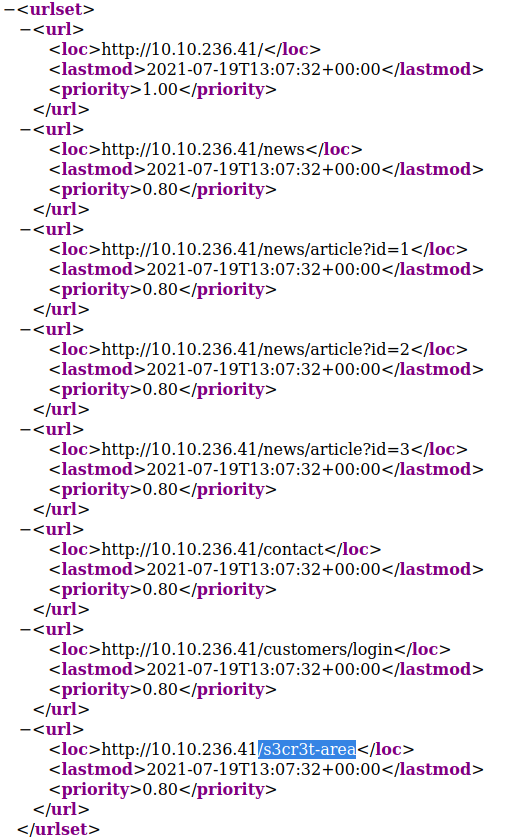

R: /s3cr3t-area

## Manual Discovery - HTTP Headers

- when we make a request, the server returns a response with various HTTP Headers in it

	- sometimes there is useful info in there: webserver software, programming language etc.

### Questions

1. What is the flag value from the X-FLAG header? 

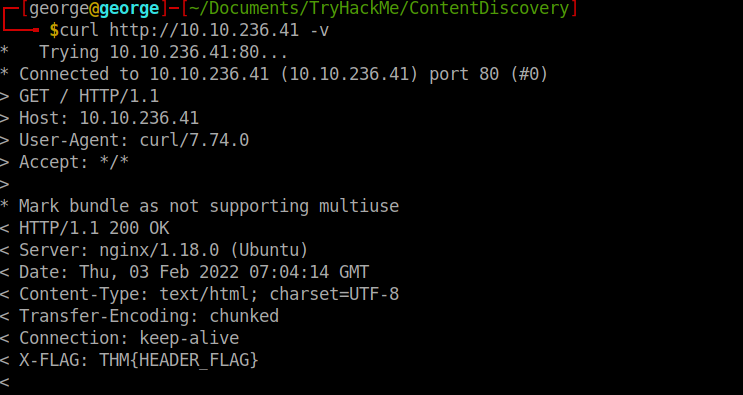

R: THM{HEADER_FLAG}

## Manual Discovery - Framework Stack

- after you find the framework of website, either by the use of the favicon or by looking at the comments on the source of the page, you can locate the framework's website so we can learn more about the software and its contents and vulnerabilities.

### Questions

1. What is the flag from the framework's administration portal? 

- Navigate to the framwork login page we get the following clues:

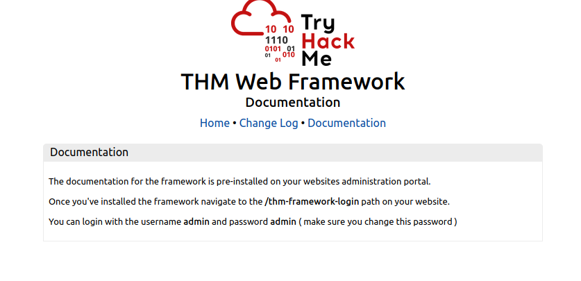

- We login with the credentials given and we get the flag:

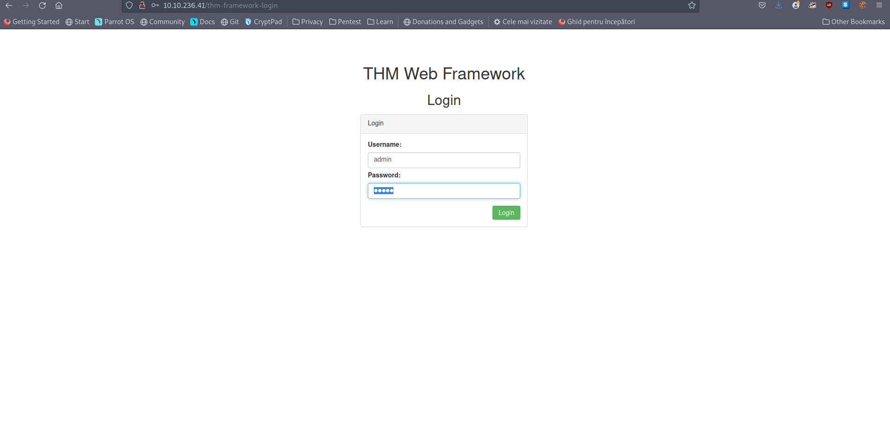

R: THM{CHANGE_DEFAULT_CREDENTIALS}

## OSINT - Google Hacking / Dorking

- OSINT -> freely available external tools

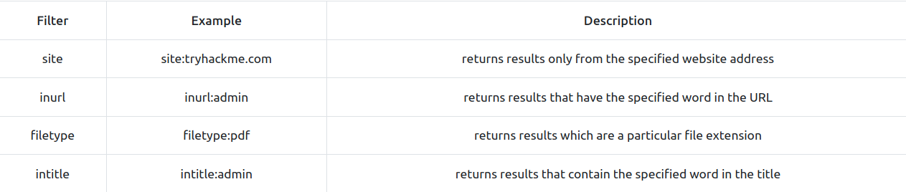

### Questions

1. What Google dork operator can be used to only show results from a particular site?

R: site:

## OSINT - Wappalyzer

- [Wappalyzer](https://www.wappalyzer.com/) is an online tool and beowser extension which helps in finding the technologies a website uses 

## OSINT - The Wayback Machine

- [The Wayback Machine](https://archive.org/web/) is a historical archive of websites that dates back to the late 90s.

- this can help you find old pages that might still be active on the current website.

## OSINT - Github

- first understand *git*: a *version control system* that tracks changes to files in a project.

- Github is a hosted version of Git on the internet.

- use Github's features to look for company names or websites to try and locate repositories belonging to your target.

### Questions

1. What is Git? 

R: Version Control System

## OSINT - S3 Buckets

- S3 Buckets are a storage device provided by Amazon AWS, allowing people to save files and even static website content in the cloud accessible over HTTP and HTTPS.

- the owner can set the access permissions to public, private or even writable.

- format of S3 Buckets: 
	
	- http(s)://{name}.s3.amazonaws.com

- here, *name* is decided by the owner

- one method to find these buckets is using the company name followed by common terms like {name}-assets, {name}-www, {name}-public, {name}-private...

### Questions

1. What URL format do Amazon S3 buckets end in? 

R: s3.amazonaws.com

## Automated Discovery

- used tools: *ffuf*, *dirb* and *gobuster*

- ffuf:

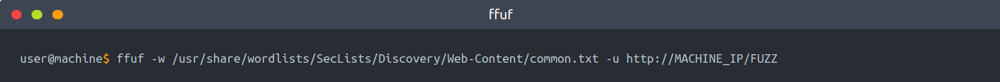

- dirb:

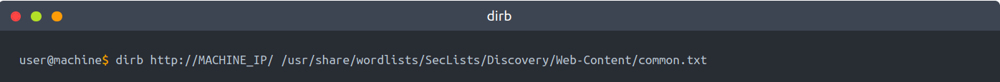

- gobuster:

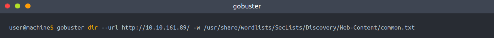	

### Questions

- Used dirb to search for directories and files in the given domain:

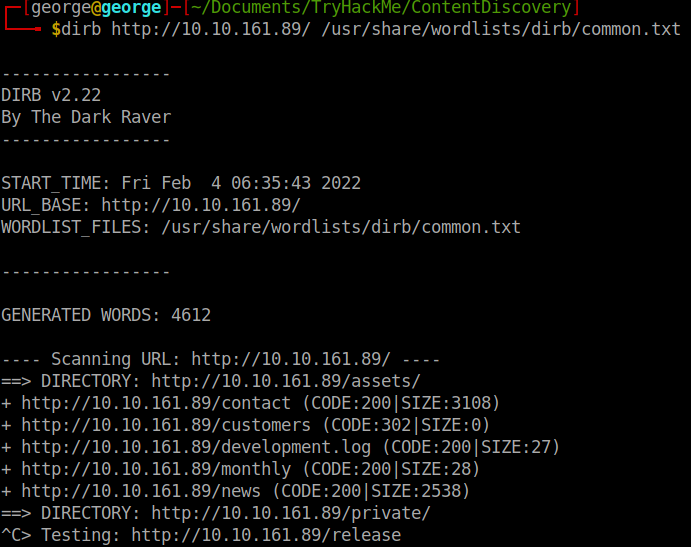

1. What is the name of the directory beginning "/mo...." that was discovered?

R: /monthly

2. What is the name of the log file that was discovered?

R: /development.log