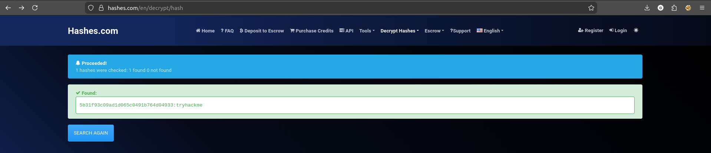
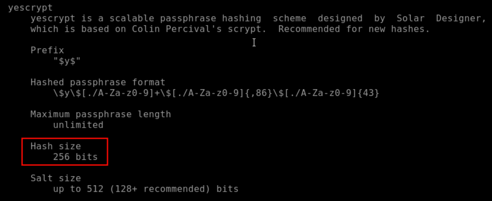
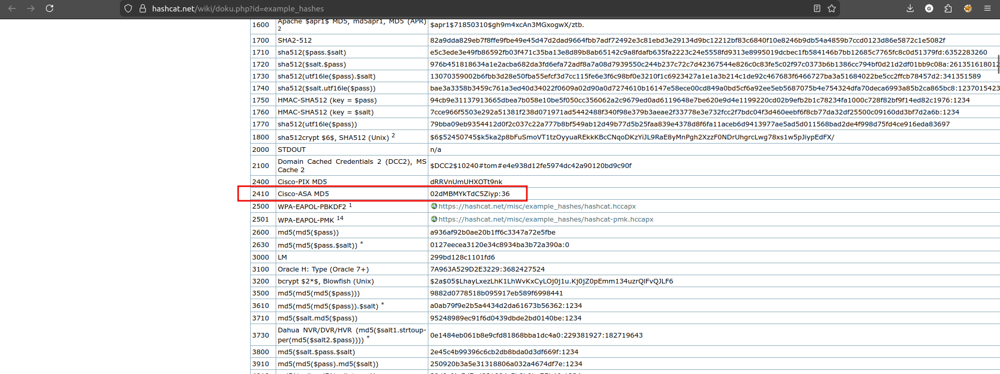
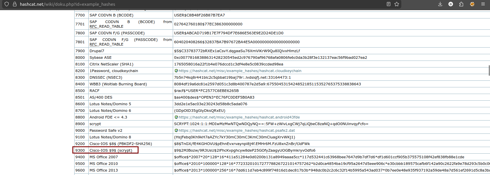
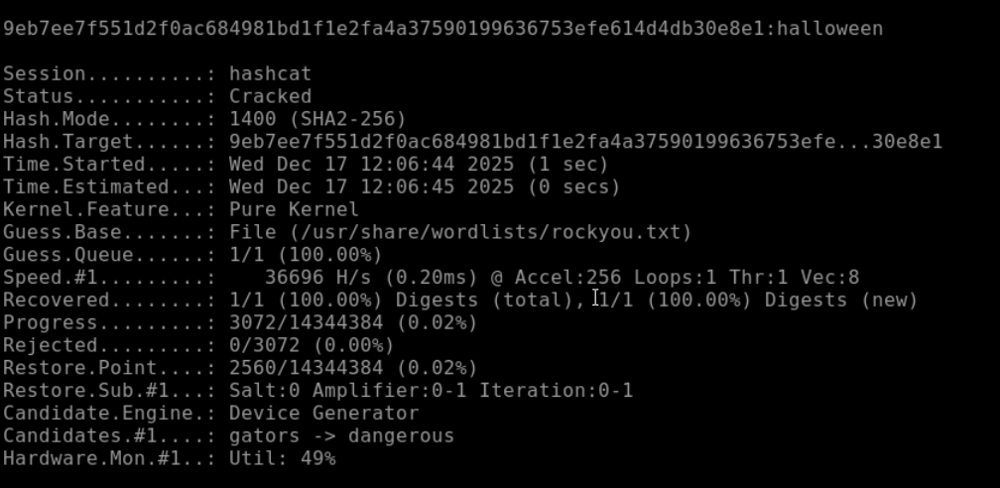
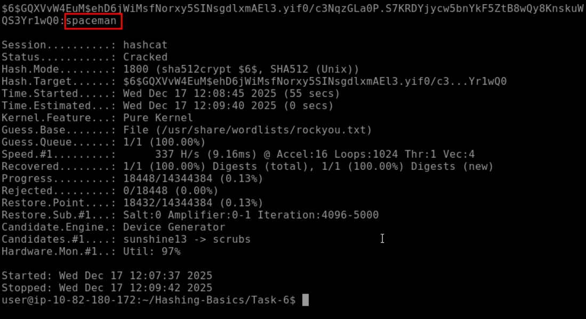
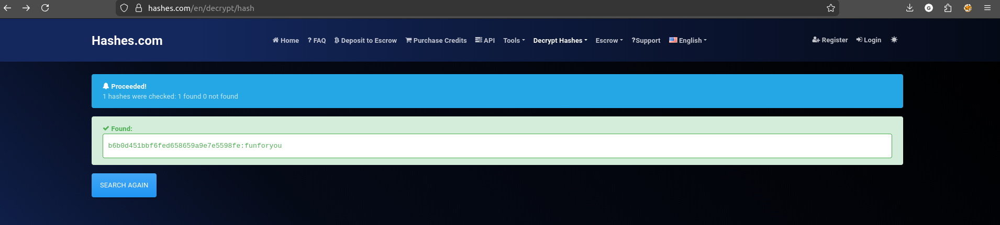
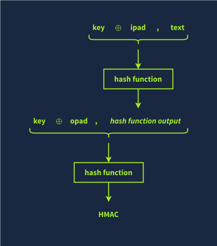
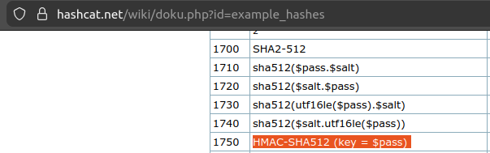

# [Hashing Basics](https://tryhackme.com/room/hashingbasics)

## Hash Functions

Consider the scenario where you just downloaded a 6 GB file and want to know whether the copy you downloaded is identical to the original file, bit for bit. How would you do that? Or if a good Samaritan handed you this 6 GB file on a USB memory drive, how can you be sure it is identical to the file you want to download?

The answer to both of the above questions lies in comparing the hash values of the two files; if two hash values are equal, you can say with very high certainty that the two files are identical. But what is a hash value?

A **hash value** is a fixed-size string or characters that is computed by a hash function. A **hash function** takes an input of an arbitrary size and returns an output of fixed length, i.e., a hash value.

### What is a Hash Function?

Hash functions are different from encryption. There is no key, and it’s meant to be impossible (or computationally impractical) to go from the output back to the input.

A hash function takes some input data of any size and creates a summary or **digest** of that data. The output has a fixed size. It’s hard to predict the output for any input and vice versa. Good hashing algorithms will be relatively fast to compute and prohibitively slow to reverse, i.e., go from the output and determine the input. Any slight change in the input data, even a single bit, should cause a significant change in the output.

The output of a hash function is typically raw bytes, which are then encoded. Common encodings are base64 or hexadecimal. `md5sum`, `sha1sum`, `sha256sum`, and `sha512sum` produce their outputs in hexadecimal format. Remember that hexadecimal format prints each raw byte as two hexadecimal digits.

### Why is Hashing Important?

Hashing plays a vital role in our daily use of the Internet. Like other cryptographic functions, hashing remains hidden from the user. Hashing helps protect data’s integrity and ensure password confidentiality.

Consider this example of hashing being used to protect your cyber security. When you log into TryHackMe, the server uses hashing to verify your password. In fact, as per good security practices, a server does not record your password; it records the hash value of your password. Whenever you want to log in, it will calculate the hash value of the password you submitted with the recorded hash value. Similarly, when you log into your computer, hashing plays a role in verifying your password.

### What’s a Hash Collision?

A hash collision is when two different inputs give the same output. Hash functions are designed to avoid collisions as best as possible. Furthermore, hash functions are designed to prevent an attacker from being able to create, i.e., engineer, a collision intentionally. However, because the number of inputs is practically unlimited and the number of possible outputs is limited, this leads to a pigeonhole effect.

The **pigeonhole effect** states that the number of items (_pigeons_) is more than the number of containers (_pigeonholes_); some containers must hold more than one item. In other words, in this context, there are a fixed number of different output values for the hash function, but you can give it any size input. As there are more inputs than outputs, some inputs must inevitably give the same output. If you have 21 pigeons and 16 pigeonholes, some of the pigeons are going to share the pigeonholes. Consequently, collisions are unavoidable. However, a good hash function ensures that the probability of a collision is negligible.

MD5 and SHA1 have been attacked and are now considered insecure due to the ability to engineer hash collisions. However, no attack has yet given a collision in both algorithms simultaneously, so if you compare the MD5 and SHA1 hash, you will see that they’re different. You can view the MD5 collision example on the [MD5 Collision Demo](https://www.mscs.dal.ca/~selinger/md5collision/) page; furthermore, you can read the details of the SHA1 collision attack at [Shattered](https://shattered.io/). Due to these, you shouldn’t trust either algorithm for hashing passwords or data.

### Questions

Q: What is the SHA256 hash of the `passport.jpg` file in `~/Hashing-Basics/Task-2`?

`sha256sum passport.jpg`

A: `77148c6f605a8df855f2b764bcc3be749d7db814f5f79134d2aa539a64b61f02`

Q: What is the output size in bytes of the MD5 hash function?

Output of md5 is 128 bits = 16 bytes.

A: `16`

Q: If you have an 8-bit hash output, how many possible hash values are there?
 
A: `256`

## Insecure Password Storage for Authentication

### Stories of Insecure Password Storage for Authentication

Most web applications need to verify a user’s password at some point. Storing these passwords in plaintext is a very insecure security practice. You’ve probably seen news stories about companies that have had their database leaked. Knowing that many people use the same password on their various accounts, including their online banking, leaking the password from one account jeopardises the security of all other accounts.

We will visit **three insecure practices** when it comes to passwords:

- Storing passwords in plaintext
- Storing passwords using a deprecated encryption
- Storing passwords using an insecure hashing algorithm

### **Storing Passwords in Plaintext**

Quite a few data breaches have leaked plaintext passwords. You’re probably familiar with the “rockyou.txt” password list on Kali Linux, among many other offensive security distributions. This password list came from RockYou, a company that developed social media applications and widgets. They stored their passwords in **plaintext**, and the company had a data breach. The text file contains over 14 million passwords.

### **Using an Insecure Encryption Algorithm**

Adobe’s notable data breach was slightly different. Instead of using a secure hashing function to store the hash values of the passwords, the company used a deprecated encryption format. Furthermore, password hints were stored in plain text, sometimes containing the password itself. Consequently, the plaintext password could be retrieved relatively quickly.

### **Using an Insecure Hash Function**

LinkedIn also suffered a data breach in 2012. LinkedIn used an insecure hashing algorithm, the SHA-1, to store user passwords. Furthermore, no password salting was used. **Password salting** refers to adding a **salt**, i.e., a random value, to the password before it is hashed.

### Questions

Q: What is the 20th password in `rockyou.txt`?

A: `qwerty`

## Using Hashing for Secure Password Storage

### Using Hashing to Store Passwords

This is where hashing comes in. What if, instead of storing the password, you just stored its hash value using a secure hashing function? This process means you never have to store the user’s password, and if your database is leaked, an attacker will have to crack each password to find out what the password was.

There’s just one problem with this. What if two users have the same password? As a hash function will always turn the same input into the same output, you will store the same password hash for each user. That means if someone cracks that hash, they gain access to more than one account. It also means someone can create a Rainbow Table to break the hashes.

A **Rainbow Table** is a lookup table of hashes to plaintexts, so you can quickly find out what password a user had just from the hash. A rainbow table trades the time to crack a hash for hard disk space, but it takes time to create.

Websites like [CrackStation](https://crackstation.net/) and [Hashes.com](https://hashes.com/en/decrypt/hash) internally use massive rainbow tables to provide fast password cracking for **hashes without salts**. Doing a lookup in a sorted list of hashes is quicker than trying to crack the hash.

### Protecting Against Rainbow Tables

To protect against rainbow tables, we add a salt to the passwords. The salt is a randomly generated value stored in the database and should be unique to each user. In theory, you could use the same salt for all users, but duplicate passwords would still have the same hash and a rainbow table could still be created for passwords with that salt.

The salt is added to either the start or the end of the password before it’s hashed, and this means that every user will have a different password hash even if they have the same password. Hash functions like Bcrypt and Scrypt handle this automatically. Salts don’t need to be kept private.

### Example of Securely Storing Passwords

You can find many good guides online that promote best security practices when storing passwords. Please check if there are any standards you need to follow when storing passwords before adopting one. Consider this example following good security practices when storing user passwords:

1. We select a secure hashing function, such as Argon2, Scrypt, Bcrypt, or PBKDF2.
2. We add a unique salt to the password, such as `Y4UV*^(=go_!`
3. Concatenate the password with the unique salt. For example, if the password is `AL4RMc10k`, the result string would be `AL4RMc10kY4UV*^(=go_!`
4. Calculate the hash value of the combined password and salt. In this example, using the chosen algorithm, you need to calculate the hash value of `AL4RMc10kY4UV*^(=go_!`.
5. Store the hash value and the unique salt used (`Y4UV*^(=go_!`).

### Using Encryption to Store Passwords

Considering the problem of saving passwords for authentication, why don’t we encrypt passwords instead of all these cumbersome steps? The reason is that even if we select a secure hashing algorithm to encrypt the passwords before storing them, we still need to store the used key. Consequently, if someone gets the key, they can easily decrypt all the passwords.

### Questions

Q:  Manually check the hash “4c5923b6a6fac7b7355f53bfe2b8f8c1” using the rainbow table above.

A: `inS3CyourP4$$`

Q: Crack the hash “5b31f93c09ad1d065c0491b764d04933” using an online tool.

A: `tryhackme`

Q: Should you encrypt passwords in password-verification systems? Yea/Nay

A: `Nay`

## Recognising Password Hashes

If we start with a hash, how can we recognise its type, eventually crack it, and recover the original password?

Automated hash recognition tools such as [hashID](https://pypi.org/project/hashID/) exist but are unreliable for many formats. For hashes that have a prefix, the tools are reliable. Use a healthy combination of context and tools.  If you find the hash in a web application database, it’s more likely to be MD5 than NTLM (NT LAN Manager). Automated hash recognition tools often get these hash types mixed up, highlighting the importance of learning yourself.

### Linux Passwords

On Linux, password hashes are stored in `/etc/shadow`, which is normally only readable by root. They used to be stored in `/etc/passwd`, which was readable by everyone.

The `shadow` file contains the password information. Each line contains nine fields, separated by colons (`:`). The first two fields are the login name and the encrypted password. More information about the other fields can be found by executing `man 5 shadow` on a Linux system.

The encrypted password field contains the hashed passphrase with four components: prefix (algorithm id), options (parameters), salt, and hash. It is saved in the format `$prefix$options$salt$hash`. The prefix makes it easy to recognise Unix and Linux-style passwords; it specifies the hashing algorithm used to generate the hash.

Here’s a quick table of some of the most common Unix-style password prefixes you might encounter. They are listed in the order of decreasing strength. You can read more about them by checking the man page with `man 5 crypt`.

| Prefix                         | Algorithm                                                                                                                                                                                        |
| ------------------------------ | ------------------------------------------------------------------------------------------------------------------------------------------------------------------------------------------------ |
| `$y$`                          | yescrypt is a scalable hashing scheme and is the default and recommended choice in new systems                                                                                                   |
| `$gy$`                         | gost-yescrypt uses the GOST R 34.11-2012 hash function and the yescrypt hashing method                                                                                                           |
| `$7$`                          | scrypt is a password-based key derivation function                                                                                                                                               |
| `$2b$`, `$2y$`, `$2a$`, `$2x$` | bcrypt is a hash based on the Blowfish block cipher originally developed for OpenBSD but supported on a recent version of FreeBSD, NetBSD, Solaris 10 and newer, and several Linux distributions |
| `$6$`                          | sha512crypt is a hash based on SHA-2 with 512-bit output originally developed for GNU libc and commonly used on (older) Linux systems                                                            |
| `$md5`                         | SunMD5 is a hash based on the MD5 algorithm originally developed for Solaris                                                                                                                     |
| `$1$`                          | md5crypt is a hash based on the MD5 algorithm originally developed for FreeBSD                                                                                                                   |
### MS Windows Passwords

MS Windows passwords are hashed using NTLM, a variant of MD4. They’re visually identical to MD4 and MD5 hashes, so it’s very important to use context to determine the hash type.

On MS Windows, password hashes are stored in the SAM (Security Accounts Manager). MS Windows tries to prevent normal users from dumping them, but tools like mimikatz exist to circumvent MS Windows security. Notably, the hashes found there are split into NT hashes and LM hashes.

A great place to find more hash formats and password prefixes is the [Hashcat Example Hashes](https://hashcat.net/wiki/doku.php?id=example_hashes) page. For other hash types, you’ll typically need to check the length or encoding or even conduct some research into the application that generated them. Never underestimate the power of research.
### Questions

Q:  What is the hash size in yescrypt?

A: `256`

Q: What’s the Hash-Mode listed for Cisco-ASA MD5?

A: `2410`

Q: What hashing algorithm is used in Cisco-IOS if it starts with `$9$`?

A: `scrypt`

## Password Cracking

We’ve already mentioned rainbow tables as a method to crack hashes that don’t use a salt, but what if there’s a salt involved?

You can’t “decrypt” password hashes. They’re not encrypted. You have to crack the hashes by hashing many different inputs (such as `rockyou.txt` as it covers many possible passwords), potentially adding the salt if there is one and comparing it to the target hash. Once it matches, you know what the password was. Tools like [Hashcat](https://hashcat.net/hashcat/) and [John the Ripper](https://www.openwall.com/john/) are commonly used for these purposes.

### Cracking Passwords with GPUs

Modern GPUs (Graphics Processing Units) have thousands of cores. They are specialised in digital image processing and accelerating computer graphics. Although they can’t do the same sort of work that a CPU can, they are very good at some mathematical calculations involved in hash functions. You can use a graphics card to crack many hash types quickly. Some hashing algorithms, such as Bcrypt, are designed so that hashing on a GPU does not provide any speed improvement over using a CPU; this helps them resist cracking.

### Cracking on VMs?

It’s worth mentioning that VMs (Virtual Machines) normally don’t have access to the host’s graphics card(s). Depending on the virtualisation software you are using, you can set this up, but it is cumbersome. Furthermore, performance degradation occurs as you use the CPU from a virtualised OS, and when your purpose is to crack a hash, you need every extra CPU cycle.

If you want to run [Hashcat](https://hashcat.net/hashcat/), it’s best to run it on your host to make the most of your GPU, if available. If you prefer MS Windows, you are in luck; MS Windows builds are available on the website, and you can run it from PowerShell. You can get Hashcat working with OpenCL in a VM, but the speeds will likely be worse than cracking on your host.

[John the Ripper](https://www.openwall.com/john/) uses CPU by default and works in a VM out of the box, although you may get better speeds running it on the host OS to avoid any virtualisation overhead and make the most of your CPU cores and threads

### Time to Crack Some Hashes

I’ll provide the hashes. Crack them. You can choose how. You’ll need to use online tools, [Hashcat](https://hashcat.net/hashcat/), or [John the Ripper](https://www.openwall.com/john/). Although you can use [online rainbow tables](https://hashes.com) to solve the following, we strongly advise against doing that as this will restrict your learning experience. For the first three questions, using `hashcat` along with `rockyou.txt` is enough to find the answers.

Hashcat uses the following basic syntax: `hashcat -m <hash_type> -a <attack_mode> hashfile wordlist`, where:

- `-m <hash_type>` specifies the hash-type in numeric format. For example, `-m 1000` is for NTLM. Check the official documentation (`man hashcat`) and [example page](https://hashcat.net/wiki/doku.php?id=example_hashes) to find the hash type code to use.
- `-a <attack_mode>` specifies the attack-mode. For example, `-a 0` is for straight, i.e., trying one password from the wordlist after the other.
- `hashfile` is the file containing the hash you want to crack.
- `wordlist` is the security word list you want to use in your attack.

For example, `hashcat -m 3200 -a 0 hash.txt /usr/share/wordlists/rockyou.txt` will treat the hash as Bcrypt and try the passwords in the `rockyou.txt` file.
### Questions

Q: Use `hashcat` to crack the hash, `$2a$06$7yoU3Ng8dHTXphAg913cyO6Bjs3K5lBnwq5FJyA6d01pMSrddr1ZG`, saved in `~/Hashing-Basics/Task-6/hash1.txt`.

`hashcat -m 3200 -a 0 hash1.txt /usr/share/wordlists/rockyou.txt`

A: `85208520`

Q: Use `hashcat` to crack the SHA2-256 hash, `9eb7ee7f551d2f0ac684981bd1f1e2fa4a37590199636753efe614d4db30e8e1`, saved in saved in `~/Hashing-Basics/Task-6/hash2.txt`.

`hashcat -m 1400 -a 0 hash2.txt /usr/share/wordlists/rockyou.txt`

A: `halloween`

Q: Use `hashcat` to crack the hash, `$6$GQXVvW4EuM$ehD6jWiMsfNorxy5SINsgdlxmAEl3.yif0/c3NqzGLa0P.S7KRDYjycw5bnYkF5ZtB8wQy8KnskuWQS3Yr1wQ0`, saved in `~/Hashing-Basics/Task-6/hash3.txt`.

This hash was generated using sha512 according to `hashcat`'s autodetect feature. One could also figure that out by the `$6$` in the beginning of the hash.

A: `spaceman`

Q: Crack the hash, `b6b0d451bbf6fed658659a9e7e5598fe`, saved in `~/Hashing-Basics/Task-6/hash4.txt`.

A: `funforyou`

## Hashing for Integrity Checking

### Integrity Checking

Hashing can be used to check that files haven’t been changed. If you put the same data in, you always get the same data out. Even if a single bit changes, the hash will change significantly. This means you can use it to check that files haven’t been modified or to ensure that the file you downloaded is identical to the file on the web server.

### HMACs

**HMAC (Keyed-Hash Message Authentication Code)** is a type of message authentication code (MAC) that uses a cryptographic hash function in combination with a secret key to verify the authenticity and integrity of data.

An HMAC can be used to ensure that the person who created the HMAC is who they say they are, i.e., authenticity is confirmed; moreover, it proves that the message hasn’t been modified or corrupted, i.e., integrity is maintained. This is achieved through the use of a secret key to prove authenticity and a hashing algorithm to produce a hash and prove integrity.

The following steps give you a fair idea of how HMAC works.

1. The secret key is padded to the block size of the hash function.
2. The padded key is XORed with a constant (usually a block of zeros or ones).
3. The message is hashed using the hash function with the XORed key.
4. The result from Step 3 is then hashed again with the same hash function but using the padded key XORed with another constant.
5. The final output is the HMAC value, typically a fixed-size string.

The illustration below should clarify the above steps.

  

Technically speaking, the HMAC function is calculated using the following expression:

_H__M__A__C_(_K_,_M_) = _H_((_K_⊕_o__p__a__d_)||_H_((_K_⊕_i__p__a__d_)||_M_))

Note that M and K represent the message and the key, respectively.

### Questions

Q: What is SHA256 hash of `libgcrypt-1.11.0.tar.bz2` found in `~/Hashing-Basics/Task-7`?

`sha256sum libgcrypt-1.11.0.tar.bz2 `

A: `09120c9867ce7f2081d6aaa1775386b98c2f2f246135761aae47d81f58685b9c`

Q: What’s the hashcat mode number for `HMAC-SHA512 (key = $pass)`?

A: `1750`

## Hashing vs Encoding vs Encryption

Before moving on, we should distinguish between **_hashing_**, **_encoding_**, and **_encryption_**.

**Hashing**, as already stated, is a process that takes input data and produces a hash value, a fixed-size string of characters, also referred to as digest. This hash value uniquely represents the data, and any change in the data, no matter how small, should lead to a change in the hash value. Hashing should not be confused with encryption or encoding; hashing is one-way, and you can’t reverse the process to get the original data.

**Encoding** converts data from one form to another to make it compatible with a specific system. ASCII, UTF-8, UTF-16, UTF-32, ISO-8859-1, and Windows-1252 are valid encoding methods for the English language. Note that UTF-8, UTF-16, and UTF-32 are Unicode encodings, and they can represent characters from other languages, such as Arabic and Japanese.

Another type of encoding commonly used when sending or saving data is not for any specific language. Examples include Base32 and Base64 encoding.

Encoding should not be confused with encryption, as using a specific encoding does not protect the confidentiality of the message. Encoding is reversible; anyone can change the data encoding with the right tools.

Only **encryption**, which we covered in the previous rooms, protects data confidentiality using a cryptographic cipher and a key. Encryption is reversible, provided we know the cipher and can access the key.

### Questions

Q: Use `base64` to decode `RU5jb2RlREVjb2RlCg==`, saved as `decode-this.txt` in `~/Hashing-Basics/Task-8`. What is the original word?

`cat decode-this.txt | base64 -d`

A: `ENcodeDEcode`