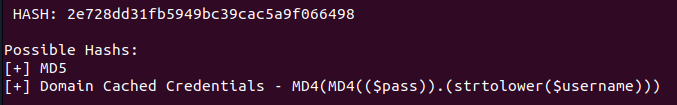
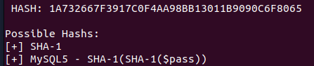
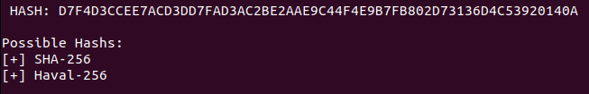
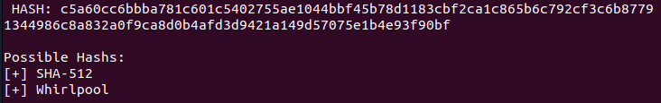
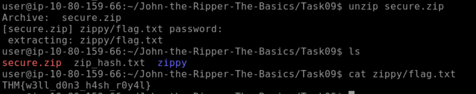

# [John the Ripper -The Basics](https://tryhackme.com/room/johntheripperbasics)

## Basic Terms

### What Makes Hashes Secure?

Hashing functions are designed as one-way functions. In other words, it is easy to calculate the hash value of a given input; however, it is a hard problem to find the original input given the hash value. In simple terms, a hard problem quickly becomes computationally infeasible in computer science. This computational problem has its roots in mathematics as P vs NP.

In computer science, P and NP are two classes of problems that help us understand the efficiency of algorithms:

- **P (Polynomial Time)**: Class P covers the problems whose solution can be found in polynomial time. Consider sorting a list in increasing order. The longer the list, the longer it would take to sort; however, the increase in time is not exponential.
- **NP (Non-deterministic Polynomial Time)**: Problems in the class NP are those for which a given solution can be checked quickly, even though finding the solution itself might be hard. In fact, we don’t know if there is a fast algorithm to find the solution in the first place.

While this is a fascinating mathematical concept that proves fundamental to computing and cryptography, it is entirely outside the scope of this room. But abstractly, the algorithm to hash the value will be “P” and can, therefore, be calculated reasonably. However, an “un-hashing” algorithm would be “NP” and intractable to solve, meaning that it cannot be computed in a reasonable time using standard computers.

### Where John Comes in

Even though the algorithm is not feasibly reversible, that doesn’t mean cracking the hashes is impossible. If you have the hashed version of a password, for example, and you know the hashing algorithm, you can use that hashing algorithm to hash a large number of words, called a dictionary. You can then compare these hashes to the one you’re trying to crack to see if they match. If they do, you know what word corresponds to that hash- you’ve cracked it!

This process is called a **dictionary attack**, and John the Ripper, or John as it’s commonly shortened, is a tool for conducting fast brute force attacks on various hash types.

This room will focus on the most popular extended version of John the Ripper, **Jumbo John**.
### Questions

Q: What is the most popular extended version of John the Ripper?

A: `Jumbo John`

## Setting Up Your System

### Questions

Q: Which website’s breach was the `rockyou.txt` wordlist created from?

A: `rockyou.com`

## Cracking Basic Hashes

### John Basic Syntax

The basic syntax of John the Ripper commands is as follows. We will cover the specific options and modifiers used as we use them.

`john [options] [file path]`

- `john`: Invokes the John the Ripper program
- `[options]`: Specifies the options you want to use
- `[file path]`: The file containing the hash you’re trying to crack; if it’s in the same directory, you won’t need to name a path, just the file.

### Automatic Cracking

John has built-in features to detect what type of hash it’s being given and to select appropriate rules and formats to crack it for you; this isn’t always the best idea as it can be unreliable, but if you can’t identify what hash type you’re working with and want to try cracking it, it can be a good option! To do this, we use the following syntax:

`john --wordlist=[path to wordlist] [path to file]`

- `--wordlist=`: Specifies using wordlist mode, reading from the file that you supply in the provided path
- `[path to wordlist]`: The path to the wordlist you’re using, as described in the previous task

**Example Usage:**

`john --wordlist=/usr/share/wordlists/rockyou.txt hash_to_crack.txt`

### Identifying Hashes

Sometimes, John won’t play nicely with automatically recognising and loading hashes, but that’s okay! We can use other tools to identify the hash and then set John to a specific format. There are multiple ways to do this, such as using an online hash identifier like [this site](https://hashes.com/en/tools/hash_identifier). I like to use a tool called [hash-identifier](https://gitlab.com/kalilinux/packages/hash-identifier/-/tree/kali/master), a Python tool that is super easy to use and will tell you what different types of hashes the one you enter is likely to be, giving you more options if the first one fails.

To use hash-identifier, you can use `wget` or `curl` to download the Python file `hash-id.py` from its GitLab [page](https://gitlab.com/kalilinux/packages/hash-identifier/-/raw/kali/master/hash-id.py). Then, launch it with `python3 hash-id.py` and enter the hash you’re trying to identify. It will give you a list of the most probable formats.

### Format-Specific Cracking

Once you have identified the hash that you’re dealing with, you can tell John to use it while cracking the provided hash using the following syntax:

`john --format=[format] --wordlist=[path to wordlist] [path to file]`

- `--format=`: This is the flag to tell John that you’re giving it a hash of a specific format and to use the following format to crack it
- `[format]`: The format that the hash is in

**Example Usage:**

`john --format=raw-md5 --wordlist=/usr/share/wordlists/rockyou.txt hash_to_crack.txt`

**A Note on Formats:**

When you tell John to use formats, if you’re dealing with a standard hash type, e.g. md5 as in the example above, you have to prefix it with `raw-` to tell John you’re just dealing with a standard hash type, though this doesn’t always apply. To check if you need to add the prefix or not, you can list all of John’s formats using `john --list=formats` and either check manually or grep for your hash type using something like `john --list=formats | grep -iF "md5"`

### Questions

Q: What type of hash is hash1.txt?

A: `md5`

Q: What is the cracked value of hash1.txt?

`john --format=raw-md5 --wordlist=/usr/share/wordlists/rockyou.txt hash1.txt`

A: `biscuit`

Q: What type of hash is hash2.txt?

A: `sha1`

Q: What is the cracked value of hash2.txt?

`john --format=raw-sha1 --wordlist=/usr/share/wordlists/rockyou.txt hash2.txt`

A: `kangeroo`

Q: What type of hash is hash3.txt?

A: `sha256`

Q: What is the cracked value of hash3.txt?

`john --format=Raw-SHA256 --wordlist=/usr/share/wordlists/rockyou.txt hash3.txt `

A: `microphone`

Q: What type of hash is hash4.txt?

From the hint we know that is not sha-512, so it must be `Whirlpool`.

A: `Whirlpool`

Q: What is the cracked value of hash4.txt?

`john --format=whirlpool --wordlist=/usr/share/wordlists/rockyou.txt hash4.txt`

A: `colossal`

## Cracking Windows Authentication Hashes

Authentication hashes are the hashed versions of passwords stored by operating systems; it is sometimes possible to crack them using our brute-force methods. To get your hands on these hashes, you must often already be a privileged user, so we will explain some of the hashes we plan on cracking as we attempt them.

### NTHash / NTLM

NThash is the hash format modern Windows operating system machines use to store user and service passwords. It’s also commonly referred to as NTLM, which references the previous version of Windows format for hashing passwords known as LM, thus NT/LM.

A bit of history: the NT designation for Windows products originally meant New Technology. It was used starting with Windows NT to denote products not built from the MS-DOS Operating System. Eventually, the “NT” line became the standard Operating System type to be released by Microsoft, and the name was dropped, but it still lives on in the names of some Microsoft technologies.

In Windows, SAM (Security Account Manager) is used to store user account information, including usernames and hashed passwords. You can acquire NTHash/NTLM hashes by dumping the SAM database on a Windows machine, using a tool like Mimikatz, or using the Active Directory database: `NTDS.dit`. You may not have to crack the hash to continue privilege escalation, as you can often conduct a “pass the hash” attack instead, but sometimes, hash cracking is a viable option if there is a weak password policy.

### Questions

Q: What do we need to set the `--format` flag to in order to crack this hash?

A: `nt`

Q: What is the cracked value of this password?

`john --format=nt --wordlist=/usr/share/wordlists/rockyou.txt ntlm.txt`

A: `mushroom`

## Cracking /etc/shadow Hashes

### Cracking Hashes from /etc/shadow

The `/etc/shadow` file is the file on Linux machines where password hashes are stored. It also stores other information, such as the date of last password change and password expiration information. It contains one entry per line for each user or user account of the system. This file is usually only accessible by the root user, so you must have sufficient privileges to access the hashes. However, if you do, there is a chance that you will be able to crack some of the hashes.

### Unshadowing

John can be very particular about the formats it needs data in to be able to work with it; for this reason, to crack `/etc/shadow` passwords, you must combine it with the `/etc/passwd` file for John to understand the data it’s being given. To do this, we use a tool built into the John suite of tools called `unshadow`. The basic syntax of `unshadow` is as follows:

`unshadow [path to passwd] [path to shadow]`

- `unshadow`: Invokes the unshadow tool
- `[path to passwd]`: The file that contains the copy of the `/etc/passwd` file you’ve taken from the target machine
- `[path to shadow]`: The file that contains the copy of the `/etc/shadow` file you’ve taken from the target machine

**Example Usage:**

`unshadow local_passwd local_shadow > unshadowed.txt`

**Note on the files**

When using `unshadow`, you can either use the entire `/etc/passwd` and `/etc/shadow` files, assuming you have them available, or you can use the relevant line from each, for example:

**FILE 1 - local_passwd**

Contains the `/etc/passwd` line for the root user:

`root:x:0:0::/root:/bin/bash`

**FILE 2 - local_shadow**

Contains the `/etc/shadow` line for the root user: `root:$6$2nwjN454g.dv4HN/$m9Z/r2xVfweYVkrr.v5Ft8Ws3/YYksfNwq96UL1FX0OJjY1L6l.DS3KEVsZ9rOVLB/ldTeEL/OIhJZ4GMFMGA0:18576::::::`

### Cracking

We can then feed the output from `unshadow`, in our example use case called `unshadowed.txt`, directly into John. We should not need to specify a mode here as we have made the input specifically for John; however, in some cases, you will need to specify the format as we have done previously using: `--format=sha512crypt`

`john --wordlist=/usr/share/wordlists/rockyou.txt --format=sha512crypt unshadowed.txt`

### Questions

Q:  What is the root password?

`unshadow local_passwd local_shadow > unshadowed.txt`

`john --wordlist=/usr/share/wordlists/rockyou.txt unshadowed.txt`

A: `1234`

## Single Crack Mode

But John also has another mode, called the **Single Crack** mode. In this mode, John uses only the information provided in the username to try and work out possible passwords heuristically by slightly changing the letters and numbers contained within the username.

### Word Mangling

The best way to explain Single Crack mode and word mangling is to go through an example:

Consider the username “Markus”.

Some possible passwords could be:

- Markus1, Markus2, Markus3 (etc.)
- MArkus, MARkus, MARKus (etc.)
- Markus!, Markus$, Markus* (etc.)

This technique is called word mangling. John is building its dictionary based on the information it has been fed and uses a set of rules called “mangling rules,” which define how it can mutate the word it started with to generate a wordlist based on relevant factors for the target you’re trying to crack. This exploits how poor passwords can be based on information about the username or the service they’re logging into.

### GECOS

John’s implementation of word mangling also features compatibility with the GECOS field of the UNIX operating system, as well as other UNIX-like operating systems such as Linux. GECOS stands for General Electric Comprehensive Operating System. In the last task, we looked at the entries for both `/etc/shadow` and `/etc/passwd`. Looking closely, you will notice that the fields are separated by a colon `:`. The fifth field in the user account record is the GECOS field. It stores general information about the user, such as the user’s full name, office number, and telephone number, among other things. John can take information stored in those records, such as full name and home directory name, to add to the wordlist it generates when cracking `/etc/shadow` hashes with single crack mode.

### Using Single Crack Mode

To use single crack mode, we use roughly the same syntax that we’ve used so far; for example, if we wanted to crack the password of the user named “Mike”, using the single mode, we’d use:

`john --single --format=[format] [path to file]`

- `--single`: This flag lets John know you want to use the single hash-cracking mode
- `--format=[format]`: As always, it is vital to identify the proper format.

**Example Usage:**

`john --single --format=raw-sha256 hashes.txt`

**A Note on File Formats in Single Crack Mode:**

If you’re cracking hashes in single crack mode, you need to change the file format that you’re feeding John for it to understand what data to create a wordlist from. You do this by prepending the hash with the username that the hash belongs to, so according to the above example, we would change the file `hashes.txt`

**From** `1efee03cdcb96d90ad48ccc7b8666033`
### Questions

Q: What is Joker’s password?

Change the hash to `joker:7bf6d9bb82bed1302f331fc6b816aada` by adding the user name at the beginning.

We check the type of hash we have. We see that it should be an md5.

We do the following command:

`john --single --format=raw-md5 hash07.txt `

A: `Jok3r`

## Custom Rules

### What are Custom Rules?

As we explored what John can do in Single Crack Mode, you may have some ideas about some good mangling patterns or what patterns your passwords often use that could be replicated with a particular mangling pattern. The good news is that you can define your rules, which John will use to create passwords dynamically. The ability to define such rules is beneficial when you know more information about the password structure of whatever your target is.

### Common Custom Rules

Many organisations will require a certain level of password complexity to try and combat dictionary attacks. In other words, when creating a new account or changing your password, if you attempt a password like `polopassword`, it will most likely not work. The reason would be the enforced password complexity. As a result, you may receive a prompt telling you that passwords have to contain at least one character from each of the following:

- Lowercase letter
- Uppercase letter
- Number
- Symbol

Password complexity is good! However, we can exploit the fact that most users will be predictable in the location of these symbols. For the above criteria, many users will use something like the following:

`Polopassword1!`

Consider the password with a capital letter first and a number followed by a symbol at the end. This familiar pattern of the password, appended and prepended by modifiers (such as capital letters or symbols), is a memorable pattern that people use and reuse when creating passwords. This pattern can let us exploit password complexity predictability.

Now, this does meet the password complexity requirements; however, as attackers, we can exploit the fact that we know the likely position of these added elements to create dynamic passwords from our wordlists.

Custom rules are defined in the `john.conf` file.

Let’s go over the syntax of these custom rules, using the example above as our target pattern. Note that you can define a massive level of granular control in these rules. I suggest looking at the wiki [here](https://www.openwall.com/john/doc/RULES.shtml) to get a full view of the modifiers you can use and more examples of rule implementation.

The first line:

`[List.Rules:THMRules]` is used to define the name of your rule; this is what you will use to call your custom rule a John argument.

We then use a regex style pattern match to define where the word will be modified; again, we will only cover the primary and most common modifiers here:

- `Az`: Takes the word and appends it with the characters you define
- `A0`: Takes the word and prepends it with the characters you define
- `c`: Capitalises the character positionally

These can be used in combination to define where and what in the word you want to modify.

Lastly, we must define what characters should be appended, prepended or otherwise included. We do this by adding character sets in square brackets `[ ]` where they should be used. These follow the modifier patterns inside double quotes `" "`. Here are some common examples:

- `[0-9]`: Will include numbers 0-9  
    
- `[0]`: Will include only the number 0
- `[A-z]`: Will include both upper and lowercase  
    
- `[A-Z]`: Will include only uppercase letters
- `[a-z]`: Will include only lowercase letters

Please note that:

- `[a]`: Will include only `a`
- `[!£$%@]`: Will include the symbols `!`, `£`, `$`, `%`, and `@`

Putting this all together, to generate a wordlist from the rules that would match the example password `Polopassword1!` (assuming the word `polopassword` was in our wordlist), we would create a rule entry that looks like this:

`[List.Rules:PoloPassword]`

`cAz"[0-9] [!£$%@]"`

Utilises the following:

- `c`: Capitalises the first letter
- `Az`: Appends to the end of the word
- `[0-9]`: A number in the range 0-9
- `[!£$%@]`: The password is followed by one of these symbols

We could then call this custom rule a John argument using the  `--rule=PoloPassword` flag.

As a full command: `john --wordlist=[path to wordlist] --rule=PoloPassword [path to file]`

As a note, I find it helpful to talk out the patterns if you’re writing a rule; as shown above, the same applies to writing RegEx patterns.

Jumbo John already has an extensive list of custom rules containing modifiers for use in almost all cases. If you get stuck, try looking at those rules [around line 678] if your syntax isn’t working correctly.
### Questions

Q: What do custom rules allow us to exploit?

A: `Password complexity predictability`

Q: What rule would we use to add all capital letters to the end of the word?

A: `Az"[A-Z]"`

Q: What flag would we use to call a custom rule called `THMRules`?

A: `--rule=THMRules`

## Cracking Password Protected Zip Files

Again, we’ll use a separate part of the John suite of tools to convert the Zip file into a format that John will understand, but we’ll use the syntax you’re already familiar with for all intents and purposes.
### Zip2John

Similarly to the `unshadow` tool we used previously, we will use the `zip2john` tool to convert the Zip file into a hash format that John can understand and hopefully crack. The primary usage is like this:

`zip2john [options] [zip file] > [output file]`

- `[options]`: Allows you to pass specific checksum options to `zip2john`; this shouldn’t often be necessary
- `[zip file]`: The path to the Zip file you wish to get the hash of
- `>`: This redirects the output from this command to another file
- `[output file]`: This is the file that will store the output

**Example Usage**

`zip2john zipfile.zip > zip_hash.txt`

### Cracking

We’re then able to take the file we output from `zip2john` in our example use case, `zip_hash.txt`, and, as we did with `unshadow`, feed it directly into John as we have made the input specifically for it.

`john --wordlist=/usr/share/wordlists/rockyou.txt zip_hash.txt`

### Questions

Q: What is the password for the secure.zip file?

`zip2john secure.zip > zip_hash.txt`

`john --wordlist=/usr/share/wordlists/rockyou.txt zip_hash.txt`

A: `pass123`

Q: What is the contents of the flag inside the zip file?

A: `THM{w3ll_d0n3_h4sh_r0y4l}`

## Cracking Password-Protected RAR Archives

### Rar2John

Almost identical to the `zip2john` tool, we will use the `rar2john` tool to convert the RAR file into a hash format that John can understand. The basic syntax is as follows:

`rar2john [rar file] > [output file]`

- `rar2john`: Invokes the `rar2john` tool
- `[rar file]`: The path to the RAR file you wish to get the hash of
- `>`: This redirects the output of this command to another file
- `[output file]`: This is the file that will store the output from the command  
    

**Example Usage**

`/opt/john/rar2john rarfile.rar > rar_hash.txt`

### Cracking

Once again, we can take the file we output from `rar2john` in our example use case, `rar_hash.txt`, and feed it directly into John as we did with `zip2john`.

`john --wordlist=/usr/share/wordlists/rockyou.txt rar_hash.txt`
### Questions

Q: What is the password for the secure.rar file?

`/opt/john/rar2john secure.rar > rar_hash.txt`

`john --wordlist=/usr/share/wordlists/rockyou.txt rar_hash.txt`

A: `password`

Q: What are the contents of the flag inside the zip file?

`unrar x secure.rar`

A: `THM{r4r_4rch1ve5_th15_t1m3}`

## Cracking SSH Keys with John

### Cracking SSH Key Passwords

Okay, okay, I hear you. There are no more file archives! Fine! Let’s explore one more use of John that comes up semi-frequently in CTF challenges—using John to crack the SSH private key password of `id_rsa` files. Unless configured otherwise, you authenticate your SSH login using a password. However, you can configure key-based authentication, which lets you use your private key, `id_rsa`, as an authentication key to log in to a remote machine over SSH. However, doing so will often require a password to access the private key; here, we will be using John to crack this password to allow authentication over SSH using the key.

### SSH2John

Who could have guessed it, another conversion tool? Well, that’s what working with John is all about. As the name suggests, `ssh2john` converts the `id_rsa` private key, which is used to log in to the SSH session, into a hash format that John can work with. Jokes aside, it’s another beautiful example of John’s versatility. The syntax is about what you’d expect. Note that if you don’t have `ssh2john` installed, you can use `ssh2john.py`, located in the `/opt/john/ssh2john.py`

`ssh2john [id_rsa private key file] > [output file]`

- `ssh2john`: Invokes the `ssh2john` tool
- `[id_rsa private key file]`: The path to the id_rsa file you wish to get the hash of
- `>`: This is the output director. We’re using it to redirect the output from this command to another file.
- `[output file]`: This is the file that will store the output from

**Example Usage**

`/opt/john/ssh2john.py id_rsa > id_rsa_hash.txt`

### Cracking

For the final time, we’re feeding the file we output from ssh2john, which in our example use case is called `id_rsa_hash.txt` and, as we did with `rar2john`, we can use this seamlessly with John:

`john --wordlist=/usr/share/wordlists/rockyou.txt id_rsa_hash.txt`

### Questions

Q: What is the SSH private key password?

`ssh2john.py id_rsa > id_rsa_hash.txt`

`john --wordlist=/usr/share/wordlists/rockyou.txt id_rsa_hash.txt`

A: `mango`

Q:

A: ``

Q:

A: ``

Q:

A: ``

Q:

A: ``

Q:

A: 