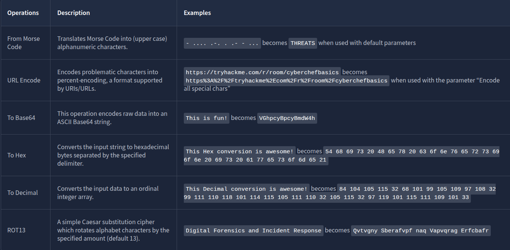
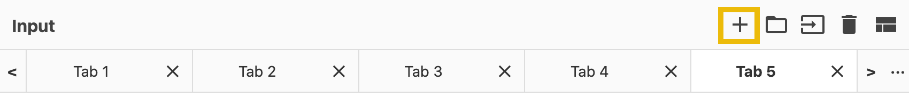
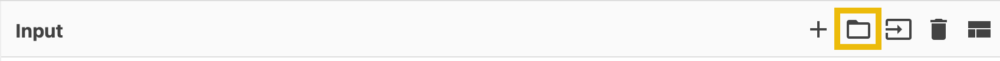
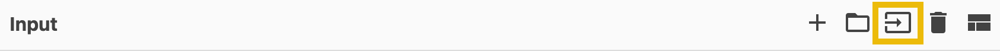
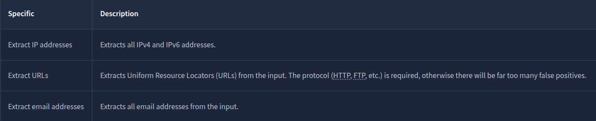
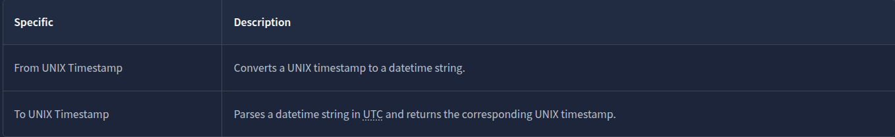
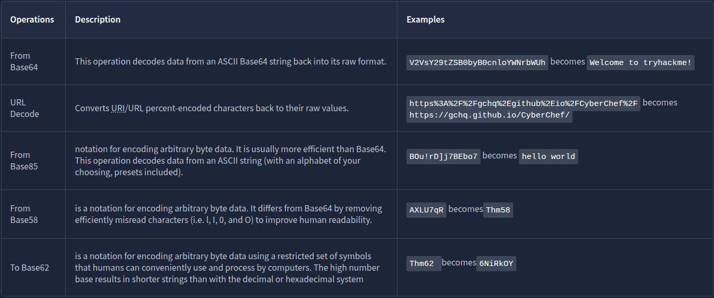
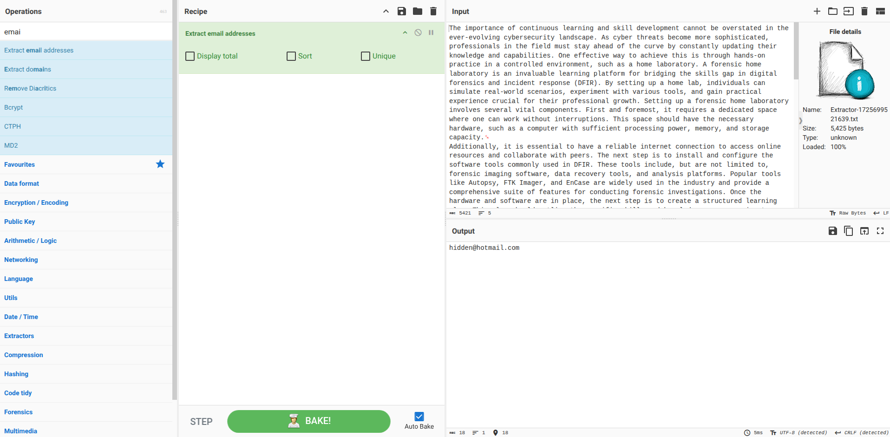

# CyberChef - The Basics

## Accessing the Tool

### Online Access

All you need is a web browser and an internet connection. Then, you can click this [link](https://gchq.github.io/CyberChef) to open CyberChef directly within your web browser.

### Offline or Local Copy

You can run this offline or locally on your machine by downloading the latest release file from this [link](https://github.com/gchq/CyberChef/releases). This will work on both Windows and Linux platforms. As best practice, you should download the most stable version.

## Navigating the Interface

Below are some operations you might use throughout your cyber security journey.

Features include the following:

- `Save recipe`: This feature allows the user to save selected operations.
- `Load recipe`: Allows the user to load previously saved recipes.
- `Clear Recipe`: This feature will enable users to clear the chosen recipe during usage.

Additionally, it has the following features:

- `Add a new input tab`: This is where an additional tab is created for the user to use different values from the previous tab.

- `Open folder as input`: This feature allows users to upload a whole folder as input value.

  

- `Open file as input`: This feature allows the user to upload a file as its input value.

  

- `Clear input and output`: This feature allows the user to clear any input values inserted and the corresponding output value.
- `Reset pane layout`: This feature brings the tool's interface to its default window sizes.

### Questions

In which area can you find "From Base64"?

A: `operations`

Which area is considered the heart of the tool?

A: `recipe`

## Before Anything Else

Before even going to the actual thing, let's have a quick overview of the thought process when using CyberChef! This process consists of four different steps:

![This image illustrates the thought process when using CyberChef. The first box includes setting a clear objective and answering the question What do you want to achieve? The second box includes the steps you can do with your data. The third box includes which operations you might want to use. This can be a little bit tricky if you are not familiar with the data that you have. However, there are plenty of operations that we can choose from. The last box includes determining if the output is the desired one. If not, it states to repeat the process from the first box](5e6bbe59a46ee9407fd65bbe-1726735685403.png)

### Questions

At which step would you determine, "What do I want to accomplish?

A: `1`

## Practice, Practice, Practice

### Extractors

### Date and Time

A UNIX timestamp is a 32-bit value representing the number of seconds since January 1, 1970 UTC (the UNIX epoch). To convert "**Fri Sep 6 20:30:22 +04 2024**" into a UNIX Timestamp, use the operations `To UNIX Timestamp`, where the result would be `1725654622`. If you wish to convert it back to a more readable format, you can use `From UNIX Timestamp`.

### Data Format

### Questions

What is the hidden email address?

A: `hidden@hotmail.com`

What is the hidden IP address that ends in .232?

Use the `Extract IP` operation.

A: `102.20.11.232`

Which domain address starts with the letter "T"?

Use the `Extract Domains` operations.

A: `TryHackMe.com`

What is the binary value of the decimal number 78?  

A: `01001110`

What is the URL encoded value of `https://tryhackme.com/r/careers`?

Use the URL Encode operation and make sure you check "Encode all special characters"

A: `https%3A%2F%2Ftryhackme%2Ecom%2Fr%2Fcareers`

## Your First Official Cook

### Questions

Using the file you downloaded in Task 5, which IP starts and ends with "10"?

Use the operation `Extract IP addresses`.

A: `10.10.2.10`

What is the base64 encoded value of the string "**Nice Room!**"?

Use the operation `To Base64`.

A: `TmljZSBSb29tIQ==`

What is the URL decoded value for `https%3A%2F%2Ftryhackme%2Ecom%2Fr%2Froom%2Fcyberchefbasics`?

Use the operation `URL decode`

A: `https://tryhackme.com/r/room/cyberchefbasics`

What is the datetime string for the Unix timestamp `1725151258`?

Use the operation `From UNIX Timestamp`.

A: `Sun 1 September 2024 00:40:58 UTC`

 What is the Base85 decoded string of the value `<+oue+DGm>Ap%u7`?

Use the operation `From Base85`

A: `This is fun!`