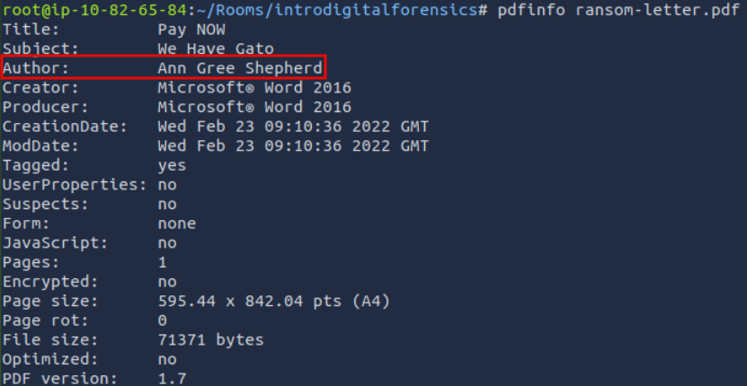
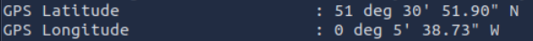
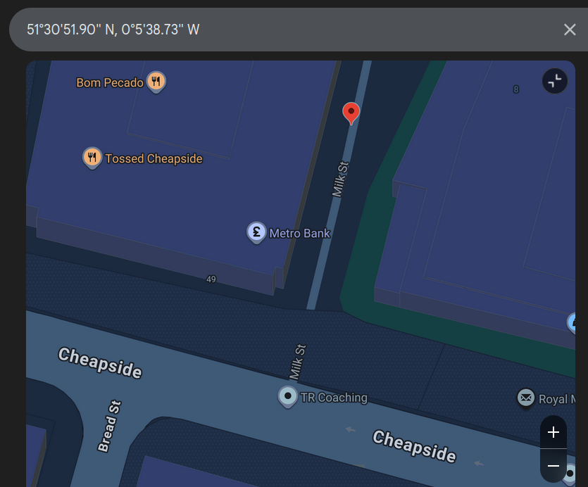
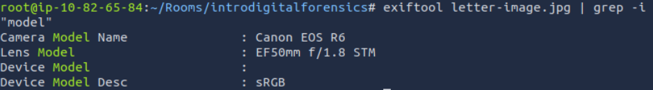

# [Digital Forensics Fundamentals](https://tryhackme.com/room/digitalforensicsfundamentals)

## Intro to Digital Forensics

Forensics is the application of methods and procedures to investigate and solve crimes. The branch of forensics that investigates cyber crimes is known as **digital forensics**. **Cyber crime** is any criminal activity conducted on or using a digital device. Several tools and techniques are used to investigate digital devices thoroughly after any crime to find and analyze evidence for necessary legal action.

Consider an example where law enforcement agencies raid a bank robber’s place with proper search warrants. Some digital devices, including a laptop, mobile phone, hard drive, and a USB, were found in the robber’s home. The law enforcement agency handed over the case to the digital forensics team. The team collected evidence securely and conducted a thorough investigation inside their digital forensics lab equipped with forensics tools. The following evidence was found on the digital devices:

- A digital map of the bank was found on the suspect’s laptop, which they kept for planning the robbery.
- A document with the bank’s entrance and escape routes was found on the suspect’s hard drive.
- A document on the hard drive that listed all the bank’s physical security controls. The suspect devised plans to bypass the security measures.
- Some media files, including photos and videos of the suspect’s previous robberies, were inside the suspect’s laptop.
- After conducting a thorough investigation of the suspect’s mobile phone, some illegal chat groups and call records related to the bank robbery were also found.

All this evidence helped law enforcement in the legal proceedings of the case. This scenario discusses a case from the start till the end. Some procedures are followed by the digital forensics team while collecting the evidence, storing it, analyzing it, and reporting it.
### Questions

Which team was handed the case by law enforcement?

A: `Digital Forensics`

## Digital Forensics Methodology

The digital forensics team has various cases requiring different tools and techniques. However, the National Institute of Standards and Technology (NIST) defines a general process for every case. The NIST works on defining frameworks for different areas of technology, including cyber security, where they introduce the process of digital forensics in four phases.

1. **Collection:** The first phase of digital forensics is data collection. Identifying all the devices from which the data can be collected is essential. Usually, an investigator can find personal computers, laptops, digital cameras, USBs, etc., on the crime scene. It is also necessary to ensure the original data is not tampered with while collecting the evidence and to maintain a proper document containing the collected items’ details. We will also be discussing the evidence-acquisition procedures in the upcoming tasks.
2. **Examination:** The collected data may overwhelm investigators due to its size. This data usually needs to be filtered, and the data of interest needs to be extracted. For example, as an investigator, you collected all the media files from a digital camera on the crime scene. You may only require some of the media as you are concerned with the media recorded on a specific date and time. So, in the examination phase, you would filter the media files of the required time and move them to the next phase. Similarly, you may only need the data of a specific user from a system containing numerous user accounts. The examination phase helps you filter this particular data for analysis.
3. **Analysis:** This is a critical phase. The investigators now have to analyze the data by correlating it with multiple pieces of evidence to draw conclusions. The analysis depends upon the case scenario and available data. The analysis aims to extract the activities relevant to the case chronologically.
4. **Reporting:** In the last phase of digital forensics, a detailed report is prepared. This report contains the investigation’s methodology and detailed findings from the collected evidence. It may also contain recommendations. This report is presented to law enforcement and executive management. It is important to include executive summaries as part of the report, considering the level of understanding of all the receiving parties.

As part of the collection phase, we saw that various pieces of evidence can be found at the crime scene. Analyzing these multiple categories of evidence requires various tools and techniques. There are different types of digital forensics, all with their own collection and analysis methodologies. Some of the most common types are listed below.

- **Computer forensics:** The most common type of digital forensics is computer forensics, which concerns investigating computers, the devices most commonly used in crimes.
- **Mobile forensics:** Mobile forensics involves investigating mobile devices and extracting evidence such as call records, text messages, GPS locations, and more.
- **Network forensics:** This area of forensics covers investigation beyond individual devices. It includes the whole network. The majority of the evidence found in networks is the network traffic logs.
- **Database forensics:** Many critical data is stored in dedicated databases. Database forensics investigates any intrusion into these databases that results in data modification or exfiltration.
- **Cloud forensics:** Cloud forensics is the type of forensics that involves investigating data stored on cloud infrastructure. This type of forensics sometimes gets tricky for the investigators as there is little evidence on cloud infrastructures.
- **Email forensics:** Email, the most common communication method between professionals, has become an important part of digital forensics. Emails are investigated to determine whether they are part of phishing or fraudulent campaigns.

### Questions

Which phase of digital forensics is concerned with correlating the collected data to draw any conclusions from it?

A: `Analysis`

Which phase of digital forensics is concerned with extracting the data of interest from the collected evidence?

A: `Examination`

## Evidence Acquisition 

Acquiring evidence is a critical job. The forensics team must collect all the evidence securely without tampering with the original data. Evidence acquisition methods for digital devices depend on the type of digital device. However, some general practices must be followed while the evidence is acquired. Let’s discuss some of the important ones.

### Proper Authorization

The forensics team should obtain authorization from the relevant authorities before collecting any data. Evidence collected without prior approval may be deemed inadmissible in court. Forensic evidence contains private and sensitive data of an organization or individual. Proper authorization before collecting this data is essential for investigating according to the limits of the law.

### Chain of Custody

Imagine that a team of investigators collects all the evidence from the crime scene, and some of the evidence goes missing after a few days, or there is any change in the evidence. No individual can be held accountable in this scenario because there is no proper process for documenting the evidence owners. This problem can be solved by maintaining a chain of custody document. A chain of custody is a formal document containing all the details of the evidence. Some of the key details are listed below:

- Description of the evidence (name, type).
- Name of individuals who collected the evidence.
- Date and time of evidence collection.
- Storage location of each piece of evidence.
- Access times and the individual record who accessed the evidence.

This creates a proper trail of evidence and helps preserve it. The chain of custody document can be used to prove the integrity and reliability of the evidence admitted in court. A sample chain of custody can be downloaded from **[here](https://www.nist.gov/document/sample-chain-custody-formdocx)**.

#### Use of Write Blockers

Write blockers are an essential part of the digital forensics team’s toolbox. Suppose you are collecting evidence from a suspect’s hard drive and attaching the hard drive to the forensic workstation. While the collection occurs, some background tasks in the forensic workstation may alter the timestamps of the files on the hard drive. This can cause hindrances during the analysis, ultimately producing incorrect results. Suppose the data was collected from the hard drive using a write blocker instead in the same scenario. This time, the suspect’s hard drive would remain in its original state as the write blocker can block any evidence alteration actions.

### Questions

Which tool is used to ensure data integrity during the collection?

A: `write blocker`

What is the name of the document that has all the details of the collected digital evidence?

A: `chain of custody`

## Windows Forensics

The most common types of evidence collected from crime scenes are desktop computers and laptops, as most criminal activity involves a personal system. These devices have different operating systems running on them.

As part of the data collection phase, forensic images of the Windows operating system are taken. These forensic images are bit-by-bit copies of the whole operating system. Two different categories of forensic images are taken from a Windows operating system.

- **Disk image:** The disk image contains all the data present on the storage device of the system (HDD, SSD, etc.). This data is non-volatile, meaning that the disk data would survive even after a restart of the operating system. For example, all the files like media, documents, internet browsing history, and more.
    
- **Memory image:** The memory image contains the data inside the operating system’s RAM. This memory is volatile, meaning the data will get lost after the system is powered off or restarted. For example, to capture open files, running processes, current network connections, etc., the memory image should be prioritized and taken first from the suspect’s operating system; otherwise, any restart or shutdown of the system would result in all the volatile data getting deleted. While carrying out digital forensics on a Windows operating system, disk and memory images are very important to collect.
    

Let’s discuss some popular tools used for disk and memory image acquisition and analysis of the Windows operating system.

**FTK Imager:** FTK Imager is a widely used tool for taking disk images of Windows operating systems. It offers a user-friendly graphical interface for creating the image in various formats. This tool can also analyze the contents of a disk image. It can be used for both acquisition and analysis purposes.

**Autopsy:** [Autopsy](https://www.autopsy.com/) is a popular open-source digital forensics platform. An investigator can import an acquired disk image into this tool, and the tool will conduct an extensive analysis of the image. It offers various features during image analysis, including keyword search, deleted file recovery, file metadata, extension mismatch detection, and many more.

**DumpIt:** [DumpIt](https://www.toolwar.com/2014/01/dumpit-memory-dump-tools.html) offers the utility of taking a memory image from a Windows operating system. This tool creates memory images using a command-line interface and a few commands. The memory image can also be taken in different formats.

**Volatility:** [Volatility](https://volatilityfoundation.org/) is a powerful open-source tool for analyzing memory images. It offers some extremely useful plugins. Each artifact can be analyzed using a specific plugin. This tool supports various operating systems, including Windows, Linux, macOS, and Android

### Questions

Which type of forensic image is taken to collect the volatile data from the operating system?

A: `Memory Image`

## Practical Example of Digital Forensics

Our cat, Gado, has been kidnapped. The kidnapper has sent us a document with their requests in MS Word Document format. We have converted the document to PDF format and extracted the image from the MS Word file for your convenience.

Once started, open a new terminal and navigate to the `/root/Rooms/introdigitalforensics` directory as shown below. In the following terminal output, we changed to the directory containing the case files.

When you create a text file, `TXT`, some metadata gets saved by the operating system, such as file creation date and last modification date. However, much information gets kept within the file’s metadata when you use a more advanced editor, such as MS Word. There are various ways to read the file metadata; you might open them within their official viewer/editor or use a suitable forensic tool. Note that exporting the file to other formats, such as `PDF`, would maintain most of the metadata of the original document, depending on the PDF writer used.

Let’s see what we can learn from the PDF file. We can try to read the metadata using the program `pdfinfo`. Pdfinfo displays various metadata related to a PDF file, such as title, subject, author, creator, and creation date.

EXIF stands for Exchangeable Image File Format; it is a standard for saving metadata to image files. Whenever you take a photo with your smartphone or with your digital camera, plenty of information gets embedded in the image. The following are examples of metadata that can be found in the original digital images:

- Camera model / Smartphone model
- Date and time of image capture
- Photo settings such as focal length, aperture, shutter speed, and ISO settings

Because smartphones are equipped with a GPS sensor, finding GPS coordinates embedded in the image is highly probable. The GPS coordinates, i.e., latitude and longitude, would generally show the place where the photo was taken.

There are many online and offline tools to read the EXIF data from images. One command-line tool is `exiftool`. ExifTool is used to read and write metadata in various file types, such as JPEG images.
### Questions

Using `pdfinfo`, find out the author of the attached PDF file, `ransom-letter.pdf`.

A: `Ann Gree Shepherd`

Using `exiftool` or any similar tool, try to find where the kidnappers took the image they attached to their document. What is the name of the street?

Running `exiftool` on the given image file yields the following information:

I concatenated the two and tranformed it to this: `51°30'51.90" N, 0°5'38.73" W`

Google searching this yields the correct street:

A: `Milk Street`

What is the model name of the camera used to take this photo?

Ran the following command: `exiftool letter-image.jpg | grep -i "model"` and got this result:

A: `Canon EOS R6`