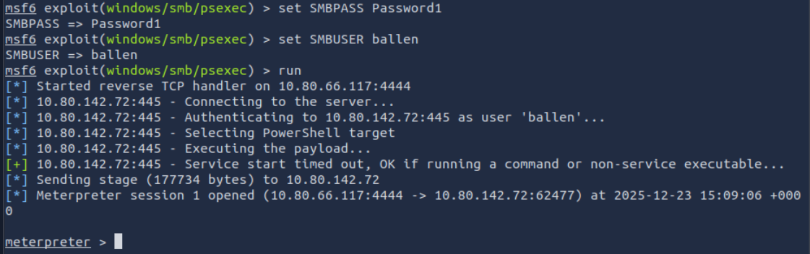
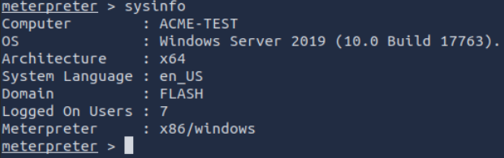
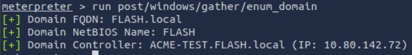
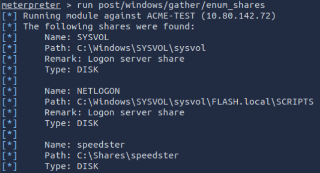
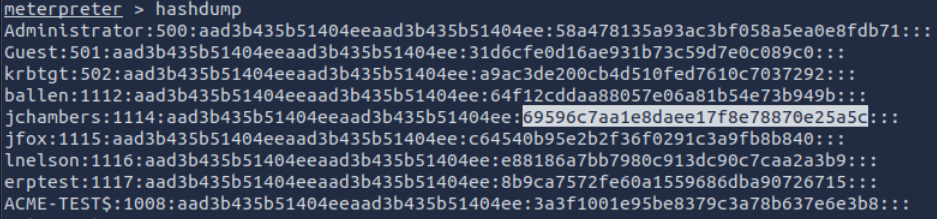
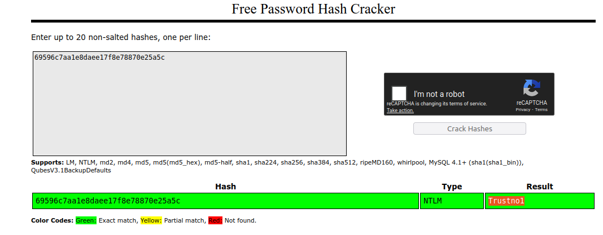
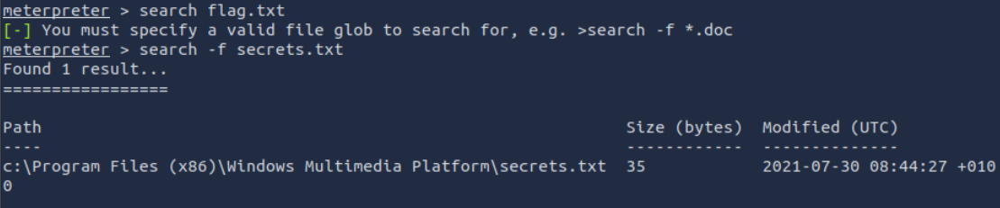
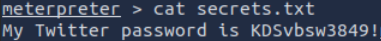
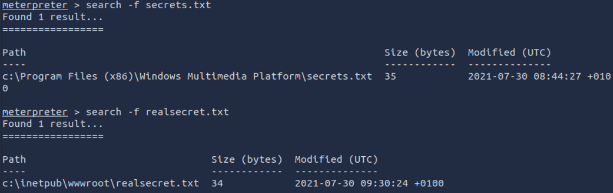
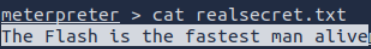

# [Metasploit - Meterpreter](https://tryhackme.com/room/meterpreter)

## Meterpreter Flavors

As you will remember, staged payloads are sent to the target in two steps. An initial part is installed (the stager) and requests the rest of the payload. This allows for a smaller initial payload size. The inline payloads are sent in a single step. Meterpreter payloads are also divided into stagged and inline versions. However, Meterpreter has a wide range of different versions you can choose from based on your target system. 

The easiest way to have an idea about available Meterpreter versions could be to list them using msfvenom, as seen below. 

We have used the `msfvenom --list payloads` command and grepped "meterpreter" payloads (adding `| grep meterpreter` to the command line), so the output only shows these.

The list will show Meterpreter versions available for the following platforms;

- Android
- Apple iOS
- Java
- Linux
- OSX
- PHP
- Python
- Windows

Your decision on which version of Meterpreter to use will be mostly based on three factors;

- The target operating system (Is the target operating system Linux or Windows? Is it a Mac device? Is it an Android phone? etc.)
- Components available on the target system (Is Python installed? Is this a PHP website? etc.)
- Network connection types you can have with the target system (Do they allow raw TCP connections? Can you only have an HTTPS reverse connection? Are IPv6 addresses not as closely monitored as IPv4 addresses? etc.)

If you are not using Meterpreter as a standalone payload generated by Msfvenom, your choice may also be limited by the exploit. You will notice some exploits will have a default Meterpreter payload, as you can see in the example below with the `ms17_010_eternalblue` exploit.

## Meterpreter Commands

Typing `help` on any Meterpreter session (shown by `meterpreter>` at the prompt) will list all available commands.

Meterpreter will provide you with three primary categories of tools;

- Built-in commands
- Meterpreter tools
- Meterpreter scripting

If you run the `help` command, you will see Meterpreter commands are listed under different categories.

- Core commands
- File system commands
- Networking commands
- System commands
- User interface commands
- Webcam commands
- Audio output commands
- Elevate commands
- Password database commands
- Timestomp commands

Core commands

- `background`: Backgrounds the current session
- `exit`: Terminate the Meterpreter session
- `guid`: Get the session GUID (Globally Unique Identifier)  
    
- `help`: Displays the help menu
- `info`: Displays information about a Post module
- `irb`: Opens an interactive Ruby shell on the current session
- `load`: Loads one or more Meterpreter extensions
- `migrate`: Allows you to migrate Meterpreter to another process
- `run`: Executes a Meterpreter script or Post module
- `sessions`: Quickly switch to another session

File system commands

- `cd`: Will change directory
- `ls`: Will list files in the current directory (dir will also work)
- `pwd`: Prints the current working directory
- `edit`: will allow you to edit a file
- `cat`: Will show the contents of a file to the screen
- `rm`: Will delete the specified file
- `search`: Will search for files
- `upload`: Will upload a file or directory
- `download`: Will download a file or directory

Networking commands

- `arp`: Displays the host ARP (Address Resolution Protocol) cache
- `ifconfig`: Displays network interfaces available on the target system  
    
- `netstat`: Displays the network connections
- `portfwd`: Forwards a local port to a remote service
- `route`: Allows you to view and modify the routing table

System commands

- `clearev`: Clears the event logs
- `execute`: Executes a command
- `getpid`: Shows the current process identifier
- `getuid`: Shows the user that Meterpreter is running as
- `kill`: Terminates a process
- `pkill`: Terminates processes by name
- `ps`: Lists running processes
- `reboot`: Reboots the remote computer
- `shell`: Drops into a system command shell
- `shutdown`: Shuts down the remote computer
- `sysinfo`: Gets information about the remote system, such as OS

Others Commands (these will be listed under different menu categories in the help menu)

- `idletime`: Returns the number of seconds the remote user has been idle
- `keyscan_dump`: Dumps the keystroke buffer
- `keyscan_start`: Starts capturing keystrokes
- `keyscan_stop`: Stops capturing keystrokes
- `screenshare`: Allows you to watch the remote user's desktop in real time
- `screenshot`: Grabs a screenshot of the interactive desktop
- `record_mic`: Records audio from the default microphone for X seconds
- `webcam_chat`: Starts a video chat
- `webcam_list`: Lists webcams
- `webcam_snap`: Takes a snapshot from the specified webcam
- `webcam_stream`: Plays a video stream from the specified webcam
- `getsystem`: Attempts to elevate your privilege to that of local system
- `hashdump`: Dumps the contents of the SAM database

Although all these commands may seem available under the help menu, they may not all work. For example, the target system might not have a webcam, or it can be running on a virtual machine without a proper desktop environment.

## Post-Exploitation with Meterpreter

The `getuid` command will display the user with which Meterpreter is currently running. This will give you an idea of your possible privilege level on the target system (e.g. Are you an admin level user like NT AUTHORITY\SYSTEM or a regular user?)

The `ps` command will list running processes. The PID column will also give you the PID information you will need to migrate Meterpreter to another process.

Migrating to another process will help Meterpreter interact with it. For example, if you see a word processor running on the target (e.g. word.exe, notepad.exe, etc.), you can migrate to it and start capturing keystrokes sent by the user to this process. Some Meterpreter versions will offer you the `keyscan_start`, `keyscan_stop`, and `keyscan_dump` command options to make Meterpreter act like a keylogger. Migrating to another process may also help you to have a more stable Meterpreter session.

To migrate to any process, you need to type the migrate command followed by the PID of the desired target process.

Be careful; you may lose your user privileges if you migrate from a higher privileged (e.g. SYSTEM) user to a process started by a lower privileged user (e.g. webserver). You may not be able to gain them back.

The `hashdump` command will list the content of the SAM database. The SAM (Security Account Manager) database stores user's passwords on Windows systems. These passwords are stored in the NTLM (New Technology LAN Manager) format.

While it is not mathematically possible to "crack" these hashes, you may still discover the cleartext password using online NTLM databases or a rainbow table attack. These hashes can also be used in Pass-the-Hash attacks to authenticate to other systems that these users can access the same network.

The `search` command is useful to locate files with potentially juicy information. In a CTF context, this can be used to quickly find a flag or proof file, while in actual penetration testing engagements, you may need to search for user-generated files or configuration files that may contain password or account information.

```shell-session
meterpreter > search -f flag2.txt
```

The shell command will launch a regular command-line shell on the target system. Pressing CTRL+Z will help you go back to the Meterpreter shell.

## Post-Exploitation Challenge

### Questions



Q: What is the computer name?



A: `ACME-TEST`

Q: What is the target domain?



A: `FLASH`

Q: What is the name of the share likely created by the user?



A: `speedster`

Q: What is the NTLM hash of the jchambers user?



A: `69596c7aa1e8daee17f8e78870e25a5c`

Q: What is the cleartext password of the jchambers user?

Use an online cracker such as `crackstation.net`.



A: `Trustno1`

Q: Where is the "secrets.txt"  file located? (Full path of the file)



A: `c:\Program Files (x86)\Windows Multimedia Platform\secrets.txt`

Q: What is the Twitter password revealed in the "secrets.txt" file?



A: `KDSvbsw3849!`

Q: Where is the "realsecret.txt" file located? (Full path of the file)



A: `c:\inetpub\wwwroot\realsecret.txt`

Q: What is the real secret?



A:  `The Flash is the fastest man alive`
