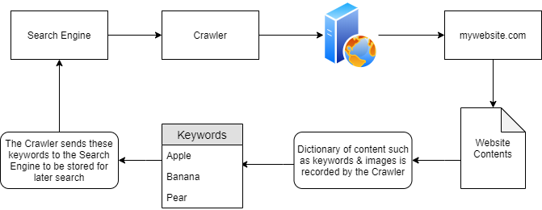
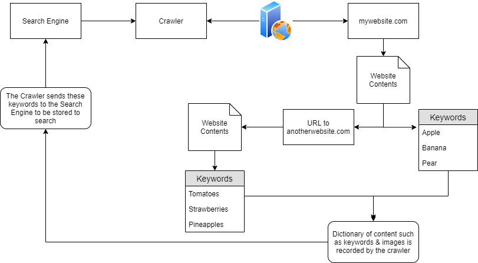
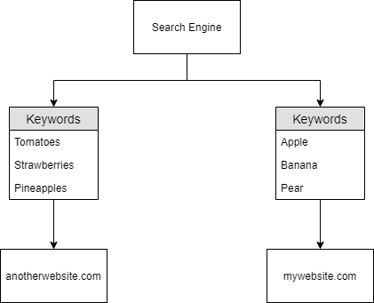
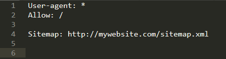
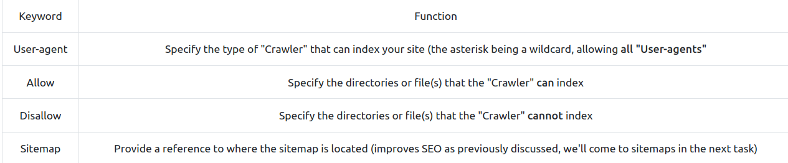
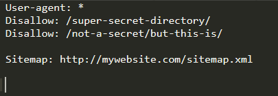
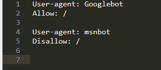
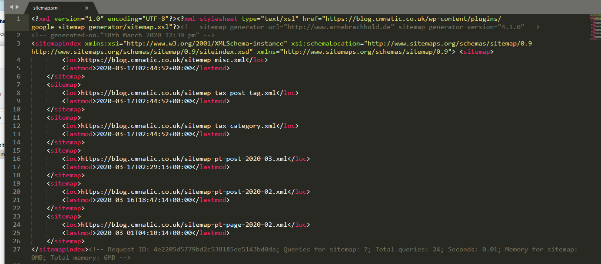

# [Google Dorking](https://tryhackme.com/room/googledorking)

## Crawlers

- they discover content through various means such as pure discovery or by using any or all URLs found from previous crawled websites.

- In the diagram above, "mywebsite.com" has been scraped as having the keywords as “Apple” “Banana" and “Pear”. 

	- These keywords are stored in a *dictionary* by the crawler, who then returns these to the search engine i.e. Google. 

	- Because of this persistence, Google now knows that the domain “mywebsite.com” has the keywords “Apple", “Banana” and “Pear”. 

	- As only one website has been crawled, if a user was to search for “Apple”...“mywebsite.com” *would appear*.

- However, as we previously mentioned, crawlers attempt to traverse, termed as crawling, every URL and file that they can find! 

	- Say if “mywebsite.com” had the same keywords as before (“Apple", “Banana” and “Pear”), but also had a URL to another website “anotherwebsite.com”, the crawler will then *attempt to traverse everything on that URL* (anotherwebsite.com) and retrieve the contents of everything within that domain respectively. 

- now the search engine know this:

### Questions

1. Name the key term of what a "Crawler" is used to do

A: Index

2. What is the name of the technique that "Search Engines" use to retrieve this information about websites?

A: Crawling

3. What is an example of the type of contents that could be gathered from a website?

A: Keywords

## Search Engine Optimisation (SEO)

- search engines will 'prioritise' those domains that are easier to index.

- websites gain something similar to a point-scoring system, which is influenced by:

	- how *responsive* is your website to the different *browser types*

	- *how easy is to crawl* your website (or if this is even allowed) through the use of *Sitemaps*

	- What kind of *keywords* the website has.

- tools that show how optimised your domain is:

	- [Google's Site Analyser](https://web.dev/)

- the crawlers want to index everything on our websites, but sometimes we don't want all of the contents indexed:

	- a secret administration page, maybe? 

	- We don't want anyone to find that, especially through a google search

## Robots.txt

- this is the **first thing indexed by Crawlers** when visiting a website.

- this file must be located in the *root directory*

- it defines the permissions a Crawler has on the website

	- user agents

	- files or directories

- Keywords:

- Example:

- Crawlers will not index anything contained within /super-secret-directory

- Crawlers will index anything contained within /not-a-secret, but will not index anything contained within the sub-directory /but-this-is

- Example:

- Here, the crawler "msnbot" *is not allowed to index* the website

- if you have a huge website, it can be difficult to index all of the sensitive files by including every path and every filename for each. Hence, we can use *regex*:

- Here, the crawlers cannot index *any* file with the extension .ini contained in any directory or subdirectory using ("$") of the site.

### Questions

1. Where would "robots.txt" be located on the domain "ablog.com"

A: ablog/robots.txt

2. If a website was to have a sitemap, where would that be located?

A: /sitemap.xml

3. How would we only allow "Bingbot" to index the website?

A: User-agent: Bingbot

4. How would we prevent a "Crawler" from indexing the directory "/dont-index-me/"?

A: Disallow: /dont-index-me/

5. What is the extension of a Unix/Linux system configuration file that we might want to hide from "Crawlers"?

A: .conf

## Sitemaps

- comparable to geographical maps in real life, except that they are used for websites!

- they specify the routes to find content on the domain

- Or more realistically:

- it influences the SEO of a website quite drastically

	- Why? Because they have a lot of data to process and these sitemaps help them just scrape the content, instead of going manually through the process of finding and scraping them

	- it is like using a wordlist instead of randomly guessing

- the easier a website is to crawl, the more optimised it is for the Search Engines.

### Questions

1. What is the typical file structure of a "Sitemap"?

A: xml

2. What real life example can "Sitemaps" be compared to?

A: map

3. Name the keyword for the path taken for content on a website

A: route

## Google Dorking

- use "*site:*" to search for a query only on that website

	- **filetype:** -> search for a file by its extension

	- **cache:** -> view Google's cached version of the website

	- **intitle:** -> the specified words must appear in the title of the page

### Questions

1. What would be the format used to query the site bbc.co.uk about flood defences

A: site:bbc.co.uk flood defences

2. What term would you use to search by file type?

A: filetype:

3. What term can we use to look for login pages?

A: intitle:login