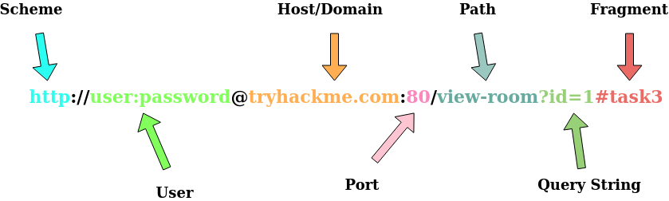
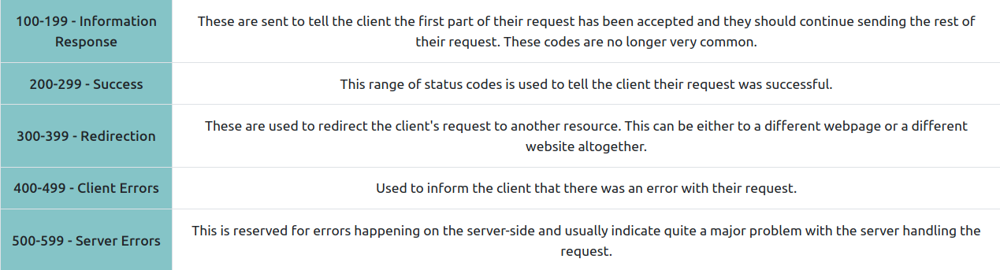
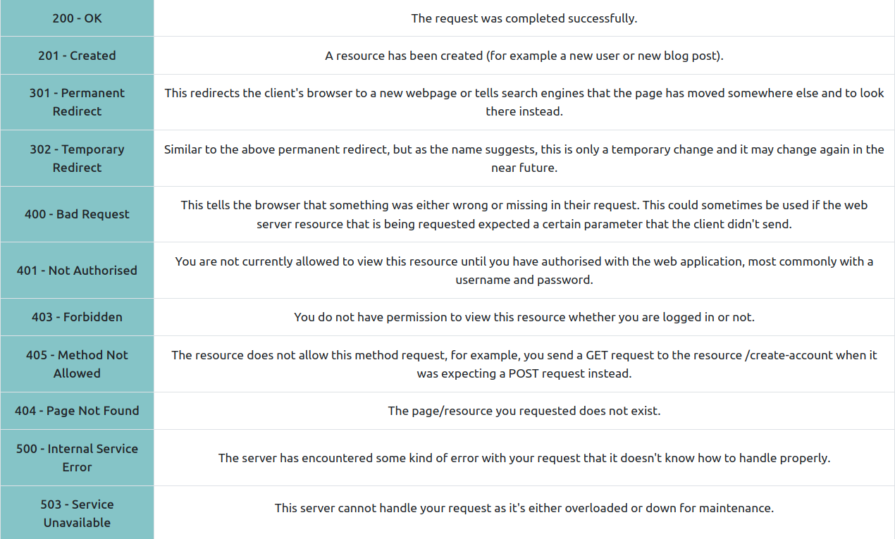
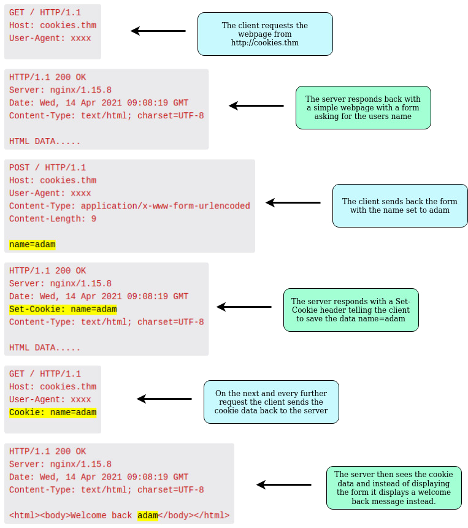

# [HTTP In Detail](https://tryhackme.com/room/httpindetail)

## What is HTTP(s)?

- Developed by Tim Berners-Lee and his team between 1989-1991.

- a set of rules used for communicating with web servers for the transmitting of webpage data.

- HTTPS is the secure version of HTTP
	
	- it stops people seeing the data you are sending
	- assures that you are talking with the right web server.

### Questions

1. What does HTTP stand for?

R: HyperText Transfer Protocol

2. What does the S stand for in HTTPS?

R: Secure

## Requests and Responses

### What is an URL (Uniform Resource Locator)

- an URL instructs on how to access a resource on the internet

- URL components:
	
	- **Scheme**: the protocol to be used to access the resource: HTTP, HTTPS, FTP
	- **User**: some services require authentication to log in, you can put a username and password into the URL to log in.
	- **Host/Domain**: domain name or IP of the server you want to access.
	- **Port**: The port you are going to connect to, usually 80 for HTTP and 443 for HTTPS, but this can be hosted on any port between 1 - 65535
	- **Path**:  the location of the resource you want to access.
	- **Query String**: Extra information that can be sent to the requested path.
	- **Fragment**: reference to a location on the actual page requested.

### Questions

1. What HTTP protocol is being used in the above example?

R: HTTP/1.1

2. What response header tells the browser how much data to expect?

R: Content-Length

## HTTP Methods

- **GET Request**:
	- used for getting information from a web server.

- **POST Request**:
	- used for submitting data to the web server and *potentially creating new records*.

- **PUT Request**:
	- used for submitting data to a web server *to update information*

- **DELETE Request**:
	- used for deleting information/records from a web server.

### Questions

1. What method would be used to create a new user account?

R: POST

2. What method would be used to update your email address?

R: PUT

3. What method would be used to remove a picture you've uploaded to your account?

R: DELETE

4. What method would be used to view a news article?

R: GET

## HTTP Status Codes

- 100-199 -> Information Response
- 200-299 -> Success
- 300-399 -> Redirection
- 400-499 -> Client Errors
- 500-599 -> Server Errors

- Common Status codes:

	- 200 - OK
	- 201 - Created
	- 301 - Permanent Redirect
	- 302 - Temporary Redirect
	- 400 - Bad Request
	- 401 - Not Authorised
	- 403 - Forbidden
	- 405 - Method Not Allowed
	- 404 - Page Not Found
	- 500 - Internal Service Error
	- 503 - Service Unavailable

### Questions

1. What response code might you receive if you've created a new user or blog post article?

R: 201

2. What response code might you receive if you've tried to access a page that doesn't exist?

R: 404

3. What response code might you receive if the web server cannot access its database and the application crashes?

R: 503

4. What response code might you receive if you try to edit your profile without logging in first?

R: 401

## Headers

### Common Request Headers

- Host: Some web servers host multiple websites so by providing the host headers you can tell it which one you require, otherwise you'll just receive the default website for the server.

- *User-Agent*: browser software and version number to help the server format the website properly for your browser.

- *Content-Length*: tells the web server how much data to expect in the web request to ensure it isn't missing data.

- *Accept-Encoding*: tells the web server what types of compression methods the browser supports so the data can be made smaller for transmitting over the internet.

- *Cookie*: data sent to the server to help remember your information

## Common Response Headers

- *Set-Cookie*: Information to store which gets sent back to the web server on each request.

- *Cache-Control*: how long to store the content of the response in the browser's cache before requesting it again

- *Content-Type*: what type of data is being returned in order the browser to know how to process the data: HTML, CSS, JavaScript, Images, PDF, Video etc.

- *Content-Encoding*: What method has been used to compress the data to make it smaller when sendig it over the internet.

### Questions

1. What header tells the web server what browser is being used?

R: User-Agent

2. What header tells the browser what type of data is being returned?

R: Content-Type

3. What header tells the web server which website is being requested?

R: Host

## Cookies

- small piece of data stored on your computer

- cookies are saved when you receive a "Set-Cookie" header from a web server.

- after that, in every request you make, you will send those cookies.

- this is used because HTTP is *stateless* (doesn't keep track of your previous requests) and hence cookies can be used to remind the web server who you are, some personal settings on the website or whether or not you have visited the website before.

- Example:

- Cookies can be used for many purposes but are most commonly used for website authentication. 

- The cookie value won't usually be a clear-text string where you can see the password, but a token (unique secret code that isn't easily humanly guessable).

### Questions 

1. Which header is used to save cookies to your computer?

R: Set-Cookie
