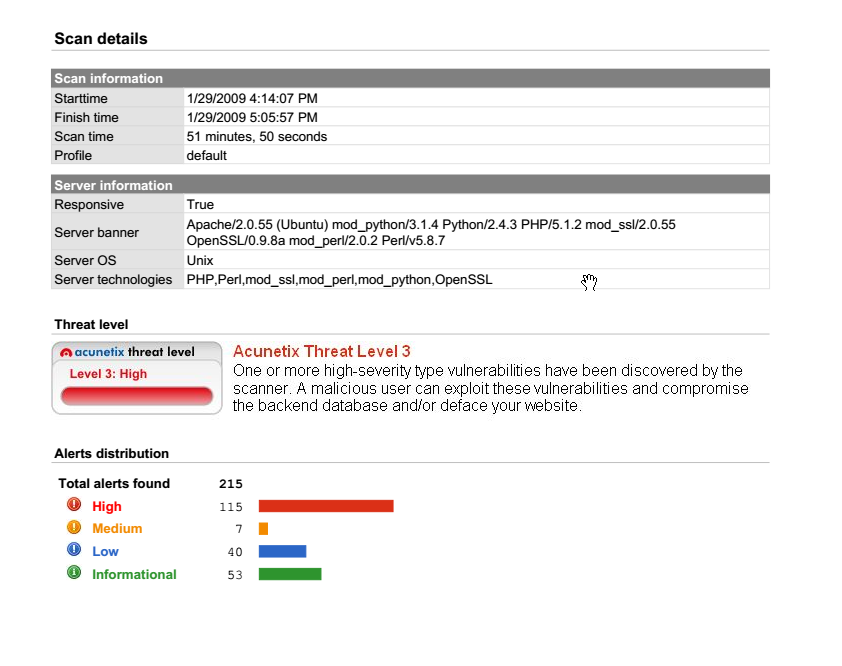
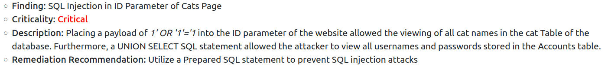

# [Hacker Methodology](https://tryhackme.com/room/hackermethodology)

## Reconnaissance Overview

- The first phase of the Ethical Hacker Methodology is *Reconnaissance*

	- in this phase the hacker collects as much info about your target as you can find

	- you have no direct interaction with the target.

- even if it seems simple, *reconnaissance* is the **single most important phase of a penetration test**

- some tools we can use:
	
	- Google
	- Wikipedia
	- PeopleFinder.com
	- who.is
	- sublist3r
	- hunter.io
	- builtwith.com
	- wappalyzer

### Questions

1. Who is the CEO of SpaceX?

A: Elon Musk

2. Do some research into the tool: sublist3r, what does it list?

A: subdomains

3. What is it called when you use Google to look for specific vulnerabilities or to research a specific topic of interest?

A: Google dorking

## Enumeration and Scanning Overview

- this is the phase where the hacker starts interacting with the target through more specialised tools.

- the aim of the hacker is to determine the target's **attack surface** 

	- precisely, it means the hacker determines the potential vulnerabilities of the target that may be exploitable (**What the target might be vulnerable to**)

- some tools used:

	- **dirb** - finds commonly-named directories on a website

	- **dirbuster** - similar to dirb but with a user interface

	- **enum4linux** - find linux vulnerabilities

	- **metasploit** - mostly used for exploitation, but it also got some enumeration tools

	- **Burp Suite** - scan a website for subdirectories and intercept network traffic

### Questions

1. What does enumeration help to determine about the target?

A: attack surface

2. Do some reconnaissance about the tool: Metasploit, what company developed it?

A: Rapid7

3. What company developed the technology behind the tool Burp Suite?

A: Portswigger

## Exploitation

- the coolest part

- although it is not as cool if you miss some important info during reconnaissance and enumeration phases

- Metasploit is usually used, as it includes a lot of scripts that makes life easy.

- Alternatives:

	- Burp Suite

	- SQL Map

	- msfvenom (custom payloads)

	- BeEF (browser based exploitation)

### Questions

1. What is one of the primary exploitation tools that pentester(s) use? 

A: metasploit

## Privilege Escalation

- hacker's target is to be:

	- An Administrator or System on Windows

	- root, in Linux.

- Many forms:

	- Cracking password hashes found on the target.

	- Finding a vulnerable service or version of a service which will allow you to escalate privileges

	- Password spraying of previosly discovered credentials (password re-use)

	- Using default credentials

	- Finding secret keys or SSH keys stored on a device which will allow pivoting to another machine.

	- Running scripts or commands to enumerate system settings like 'ifconfig' to find network settings, or the command 'find / -perm -4000 -type f 2>/dev/null' to see if the user has access to any commands they can run as root.

### Questions

1. In Windows what is usually the other target account besides Administrator?

A: System

2. What thing related to SSH could allow you to login to another machine (even without knowing the username or password)?

A: keys

## Covering Tracks

- even if most ethical penetration testers never have to cover their tracks, it is still a phase.

## Reporting

- outlines everything you have done

	- The findings or Vulnerabilities

	- The **criticality** of the finding

	- a description of how the finding was discovered

	- remediation recommendations to resolve the finding

- a report usually goes in 3 formats:

	- Vulnerability scan results (a simple listing of vulnerabilities)

	
	
	- Findings summary 

	
	
	- Full Formal Report: <https://github.com/hmaverickadams/TCM-Security-Sample-Pentest-Report>

### Questions

1. What would be the type of reporting that involves a full documentation of all findings within a formal document?

A: Full Format Report

2. What is the other thing that a pentester should provide in a report beyond: the finding name, the finding description, the finding criticality

A: Remediation Recommendation

