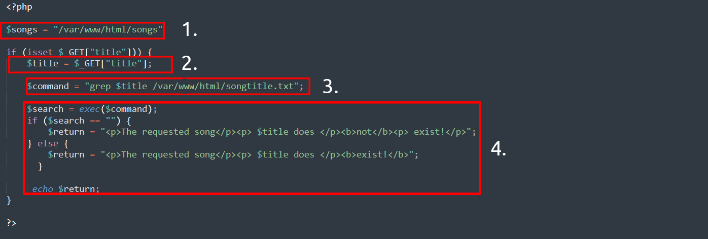
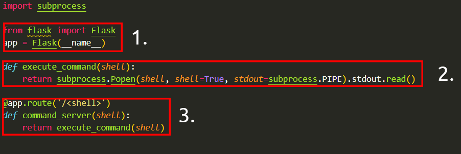
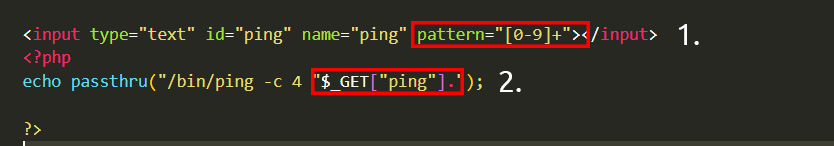
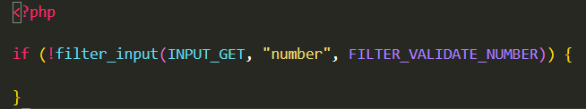
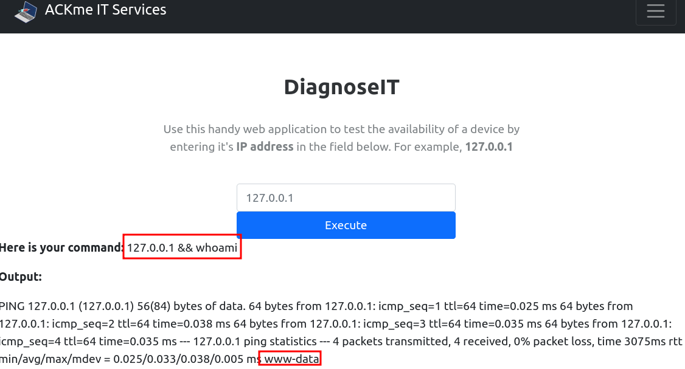
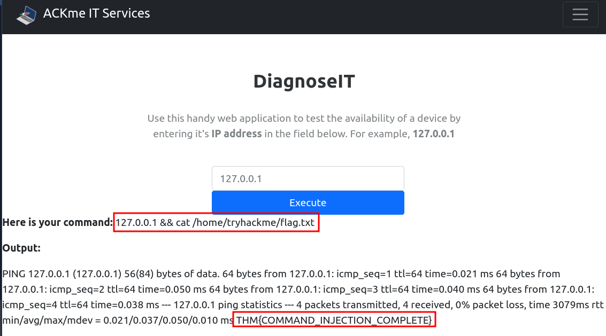

# [Command Injection](https://tryhackme.com/room/oscommandinjection)

## Discovering Command Injection

Command injection is the abuse of an application's behaviour to execute commands on the operating system, using the same privileges that the application on a device is running with. For example, achieving command injection on a web server running as a user named `joe` will execute commands under this `joe` user - and therefore obtain any permissions that `joe` has.

Command injection is also often known as “Remote Code Execution” (RCE) because of the ability to remotely execute code within an application. These vulnerabilities are often the most lucrative to an attacker because it means that the attacker can directly interact with the vulnerable system. For example, an attacker may read system or user files, data, and things of that nature.  

For example, being able to abuse an application to perform the command `whoami` to list what user account the application is running will be an example of command injection.

This vulnerability exists because applications often use functions in programming languages such as PHP, Python and NodeJS to pass data to and to make system calls on the machine’s operating system. For example, taking input from a field and searching for an entry into a file. Take this code snippet below as an example:

In this code snippet, the application takes data that a user enters in an input field named `$title` to search a directory for a song title. Let’s break this down into a few simple steps.

  

**1.** The application stores MP3 files in a directory contained on the operating system.

**2.** The user inputs the song title they wish to search for. The application stores this input into the `$title` variable.

**3.** The data within this `$title` variable is passed to the command `grep` to search a text file named _songtitle.__txt_ for the entry of whatever the user wishes to search for.

**4.** The output of this search of _songtitle.__txt_ will determine whether the application informs the user that the song exists or not.

Now, this sort of information would typically be stored in a database; however, this is just an example of where an application takes input from a user to interact with the application’s operating system.

An attacker could abuse this application by injecting their own commands for the application to execute. Rather than using `grep` to search for an entry in `songtitle.txt`, they could ask the application to read data from a more sensitive file.

Abusing applications in this way can be possible no matter the programming language the application uses. As long as the application processes and executes it, it can result in command injection. For example, this code snippet below is an application written in Python.

  

Note, you are not expected to understand the syntax behind these applications. However, for the sake of reason, I have outlined the steps of how this Python application works as well.

1. The "flask" package is used to set up a web server
2. A function that uses the "subprocess" package to execute a command on the device
3. We use a route in the webserver that will execute whatever is provided. For example, to execute `whoami`, we'd need to visit http://flaskapp.thm/whoami

### Questions

Q: What variable stores the user's input in the PHP code snippet in this task?

A: `$title`

Q: What HTTP method is used to retrieve data submitted by a user in the PHP code snippet?

A: `GET`

Q: If I wanted to execute the `id` command in the Python code snippet, what route would I need to visit?

A: `/id`

## Exploiting Command Injection

Applications that use user input to populate system commands with data can often be combined in unintended behaviour. **For example, the shell operators `;`, `&` and `&&` will combine two (or more) system commands and execute them both**.

Command Injection can be detected in mostly one of two ways:

1. Blind command injection
2. Verbose command injection

I have defined these two methods in the table below, where the two sections underneath will explain these in greater detail.

|            |                                                                                                                                                                                                                                                                               |
| ---------- | ----------------------------------------------------------------------------------------------------------------------------------------------------------------------------------------------------------------------------------------------------------------------------- |
| **Method** | **Description**                                                                                                                                                                                                                                                               |
| Blind      | This type of injection is where there is no direct output from the application when testing payloads. You will have to investigate the behaviours of the application to determine whether or not your payload was successful.                                                 |
| Verbose    | This type of injection is where there is direct feedback from the application once you have tested a payload. For example, running the `whoami` command to see what user the application is running under. The web application will output the username on the page directly. |

### Detecting Blind Command Injection

For this type of command injection, we will need to use payloads that will cause some time delay. For example, the `ping` and `sleep` commands are significant payloads to test with. Using `ping` as an example, the application will hang for _x_ seconds in relation to how many _pings_ you have specified.

Another method of detecting blind command injection is by forcing some output. This can be done by using redirection operators such as `>`.  For example, we can tell the web application to execute commands such as `whoami` and redirect that to a file. We can then use a command such as `cat` to read this newly created file’s contents.

Testing command injection this way is often complicated and requires quite a bit of experimentation, significantly as the syntax for commands varies between Linux and Windows.

The `curl` command is a great way to test for command injection. This is because you are able to use `curl` to deliver data to and from an application in your payload. Take this code snippet below as an example, a simple curl payload to an application is possible for command injection.

`curl http://vulnerable.app/process.php%3Fsearch%3DThe%20Beatles%3B%20whoami`

### Useful payloads

Linux

| **Payload** | **Description**                                                                                                                                                                                                      |
| ----------- | -------------------------------------------------------------------------------------------------------------------------------------------------------------------------------------------------------------------- |
| whoami      | See what user the application is running under.                                                                                                                                                                      |
| ls          | List the contents of the current directory. You may be able to find files such as configuration files, environment files (tokens and application keys), and many more valuable things.                               |
| ping        | This command will invoke the application to hang. This will be useful in testing an application for blind command injection.                                                                                         |
| sleep       | This is another useful payload in testing an application for blind command injection, where the machine does not have `ping` installed.                                                                              |
| nc          | Netcat can be used to spawn a reverse shell onto the vulnerable application. You can use this foothold to navigate around the target machine for other services, files, or potential means of escalating privileges. |

Windows

| **Payload** | **Description**                                                                                                                                                                        |
| ----------- | -------------------------------------------------------------------------------------------------------------------------------------------------------------------------------------- |
| whoami      | See what user the application is running under.                                                                                                                                        |
| dir         | List the contents of the current directory. You may be able to find files such as configuration files, environment files (tokens and application keys), and many more valuable things. |
| ping        | This command will invoke the application to hang. This will be useful in testing an application for blind command injection.                                                           |
| timeout     | This command will also invoke the application to hang. It is also useful for testing an application for blind command injection if the `ping` command is not installed.                |

### Questions

Q: What payload would I use if I wanted to determine what user the application is running as?

A: `whoami`

Q: What popular network tool would I use to test for blind command injection on a **Linux** machine?

A: `ping`

Q: What payload would I use to test a **Windows** machine for blind command injection?

A: `timeout`

## Remediating Command Injection

### **Vulnerable Functions**

In PHP, many functions interact with the operating system to execute commands via shell; these include:
- Exec
- Passthru
- System

Take this snippet below as an example. Here, the application will only accept and process numbers that are inputted into the form. This means that any commands such as `whoami` will not be processed.

1. The application will only accept a specific pattern of characters (the digits  0-9)
2. The application will then only proceed to execute this data which is all numerical.

These functions take input such as a string or user data and will execute whatever is provided on the system. Any application that uses these functions without proper checks will be vulnerable to command injection.

### **Input sanitisation**

Sanitising any input from a user that an application uses is a great way to prevent command injection. This is a process of specifying the formats or types of data that a user can submit. For example, an input field that only accepts numerical data or removes any special characters such as `>` ,  `&` and `/`.

In the snippet below, the `filter_input` [PHP function](https://www.php.net/manual/en/function.filter-input.php) is used to check whether or not any data submitted via an input form is a number or not. If it is not a number, it must be invalid input.

### Bypassing Filters

Applications will employ numerous techniques in filtering and sanitising data that is taken from a  user's input. These filters will restrict you to specific payloads; however, we can abuse the logic behind an application to bypass these filters. For example, an application may strip out quotation marks; we can instead use the hexadecimal value of this to achieve the same result.

When executed, although the data given will be in a different format than what is expected, it can still be interpreted and will have the same result.

### Questions

Q: What is the term for the process of "cleaning" user input that is provided to an application?

A: `sanitisation`

## Practical: Command Injection (Deploy)

Refer to [this cheat sheet](https://github.com/payloadbox/command-injection-payload-list) if you are stuck or wish to explore some more complex payloads.

### Questions

Q: What user is this application running as?

A: `www-data`

Q: What are the contents of the flag located in /home/tryhackme/flag.txt?

A: `THM{COMMAND_INJECTION_COMPLETE}`