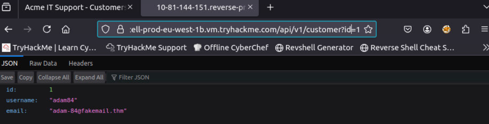
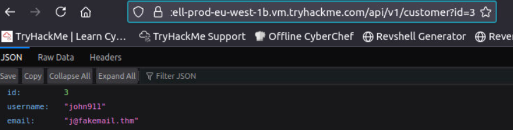

# [IDOR](https://tryhackme.com/room/idor)

## An IDOR Example

IDOR stands for Insecure Direct Object Reference and is a type of access control vulnerability.  

This type of vulnerability can occur when a web server receives user-supplied input to retrieve objects (files, data, documents), too much trust has been placed on the input data, and it is not validated on the server-side to confirm the requested object belongs to the user requesting it.

Imagine you've just signed up for an online service, and you want to change your profile information. The link you click on goes to http://online-service.thm/profile?user_id=1305, and you can see your information.  
  
Curiosity gets the better of you, and you try changing the user_id value to 1000 instead (http://online-service.thm/profile?user_id=1000), and to your surprise, you can now see another user's information. You've now discovered an IDOR vulnerability! Ideally, there should be a check on the website to confirm that the user information belongs to the user logged requesting it.

### Questions

Q: What is the Flag from the IDOR example website?

A:  `THM{IDOR-VULN-FOUND}`

## Finding IDORs in Encoded IDs

### Encoded IDs

When passing data from page to page either by post data, query strings, or cookies, web developers will often first take the raw data and encode it. Encoding ensures that the receiving web server will be able to understand the contents. Encoding changes binary data into an ASCII string commonly using the `a-z, A-Z, 0-9 and =` character for padding. The most common encoding technique on the web is base64 encoding and can usually be pretty easy to spot.

You can use websites like [https://www.base64decode.org/](https://www.base64decode.org/) to decode the string, then edit the data and re-encode it again using [https://www.base64encode.org/](https://www.base64encode.org/) and then resubmit the web request to see if there is a change in the response.

### Questions

Q: What is a common type of encoding used by websites?

A: `base64`

## Finding IDORs in Hashed IDs

### **Hashed IDs**

Hashed IDs are a little bit more complicated to deal with than encoded ones, but they may follow a predictable pattern, such as being the hashed version of the integer value. For example, the Id number 123 would become 202cb962ac59075b964b07152d234b70 if md5 hashing were in use.

It's worthwhile putting any discovered hashes through a web service such as [https://crackstation.net/](https://crackstation.net/) (which has a database of billions of hash to value results) to see if we can find any matches.

### Questions

Q: What is a common algorithm used for hashing IDs?

A: `md5`

## Finding IDORs in Unpredictable IDs

### **Unpredictable IDs**

If the Id cannot be detected using the above methods, an excellent method of IDOR detection is to create two accounts and swap the Id numbers between them. If you can view the other users' content using their Id number while still being logged in with a different account (or not logged in at all), you've found a valid IDOR vulnerability.

### Questions

Q: What is the minimum number of accounts you need to create to check for IDORs between accounts?

A: `2`

## Where are IDORs located

The vulnerable endpoint you're targeting may not always be something you see in the address bar. It could be content your browser loads in via an AJAX request or something that you find referenced in a JavaScript file. 

Sometimes endpoints could have an unreferenced parameter that may have been of some use during development and got pushed to production. For example, you may notice a call to **/user/details** displaying your user information (authenticated through your session). But through an attack known as parameter mining, you discover a parameter called **user_id** that you can use to display other users' information, for example, **/user/details?user_id=123**.

## Practical IDOR Example

### Questions

Q: What is the username for user id 1?

Create an account, go to `Your Account` and check the network tab in the developer tools of your browser. There, click on the get request where the id of customer is supplied and change it accordingly.

A: `adam84`

Q: What is the email address for user id 3?

A: `j@fakemail.thm`
