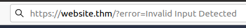
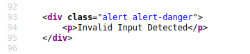
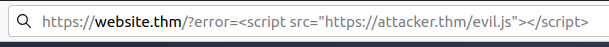
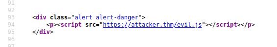
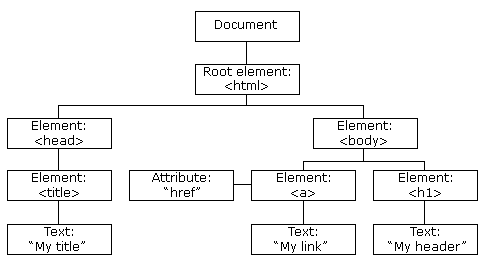
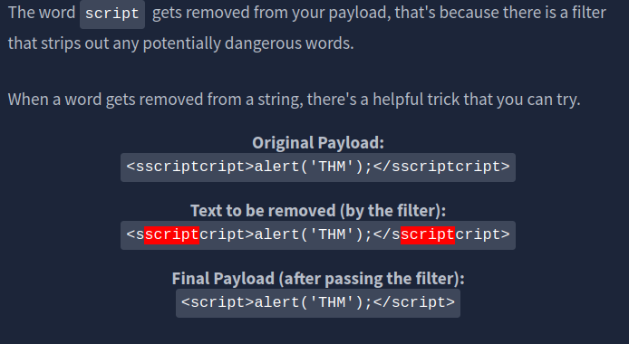
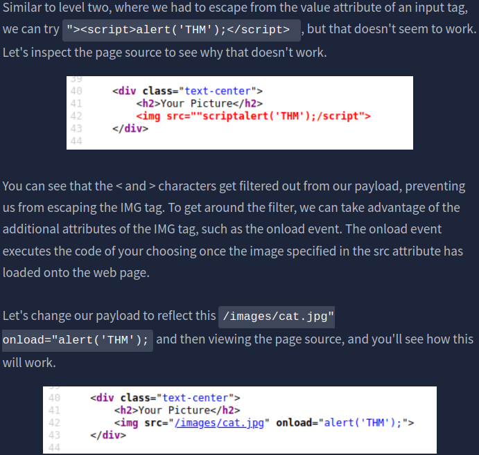
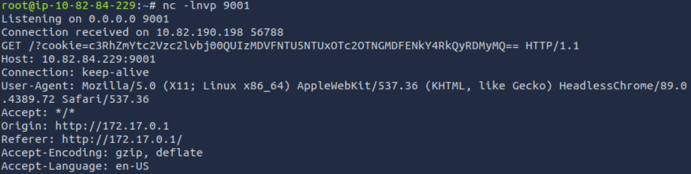
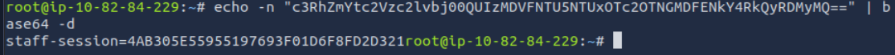

# [Intro to Cross-site Scripting](https://tryhackme.com/room/xss)

## XSS Payloads

In XSS, the payload is the JavaScript code we wish to be executed on the targets computer. There are two parts to the payload, the intention and the modification.

The intention is what you wish the JavaScript to actually do (which we'll cover with some examples below), and the modification is the changes to the code we need to make it execute as every scenario is different (more on this in the perfecting your payload task).

Here are some examples of XSS intentions.
  
### **Proof Of Concept:**

This is the simplest of payloads where all you want to do is demonstrate that you can achieve XSS on a website. This is often done by causing an alert box to pop up on the page with a string of text, for example:

``

### **Session Stealing:**

Details of a user's session, such as login tokens, are often kept in cookies on the targets machine. The below JavaScript takes the target's cookie, base64 encodes the cookie to ensure successful transmission and then posts it to a website under the hacker's control to be logged. Once the hacker has these cookies, they can take over the target's session and be logged as that user.

``  

### **Key Logger:**

The below code acts as a key logger. This means anything you type on the webpage will be forwarded to a website under the hacker's control. This could be very damaging if the website the payload was installed on accepted user logins or credit card details.
  
``

### **Business Logic:**

This payload is a lot more specific than the above examples. This would be about calling a particular network resource or a JavaScript function. For example, imagine a JavaScript function for changing the user's email address called `user.changeEmail()`. Your payload could look like this:

``

Now that the email address for the account has changed, the attacker may perform a reset password attack.

### Questions

Q: Which document property could contain the user's session token?

A: `document.cookie`

Q: Which JavaScript method is often used as a Proof Of Concept?

A: `alert`

## Reflected XSS

Reflected XSS happens when user-supplied data in an HTTP request is included in the webpage source without any validation.

### **Example Scenario**  
  
A website where if you enter incorrect input, an error message is displayed. The content of the error message gets taken from the **error** parameter in the query string and is built directly into the page source.

  

  

The application doesn't check the contents of the **error** parameter, which allows the attacker to insert malicious code.

  

  

The vulnerability can be used as per the scenario in the image below:

  

### **Potential Impact**  
  
The attacker could send links or embed them into an iframe on another website containing a JavaScript payload to potential victims getting them to execute code on their browser, potentially revealing session or customer information.

### **How to test for Reflected XSS**  

You'll need to test every possible point of entry; these include:

- Parameters in the URL Query String
- URL File Path
- Sometimes HTTP Headers (although unlikely exploitable in practice)  
    

Once you've found some data which is being reflected in the web application, you'll then need to confirm that you can successfully run your JavaScript payload; your payload will be dependent on where in the application your code is reflected (you'll learn more about this in task 6).  

### Questions

Q: Where in an URL is a good place to test for reflected XSS?

A: `parameters`

## Stored XSS

As the name infers, the XSS payload is stored on the web application (in a database, for example) and then gets run when other users visit the site or web page.

### **Example Scenario** 
  
A blog website that allows users to post comments. Unfortunately, these comments aren't checked for whether they contain JavaScript or filter out any malicious code. If we now post a comment containing JavaScript, this will be stored in the database, and every other user now visiting the article will have the JavaScript run in their browser.

  

  

### **Potential Impact**  
  
The malicious JavaScript could redirect users to another site, steal the user's session cookie, or perform other website actions while acting as the visiting user.

### **How to test for Stored XSS**  

You'll need to test every possible point of entry where it seems data is stored and then shown back in areas that other users have access to; a small example of these could be:  

- Comments on a blog
- User profile information  
- Website Listings  

Sometimes developers think limiting input values on the client-side is good enough protection, so changing values to something the web application wouldn't be expecting is a good source of discovering stored XSS, for example, an age field that is expecting an integer from a dropdown menu, but instead, you manually send the request rather than using the form allowing you to try malicious payloads. 

Once you've found some data which is being stored in the web application,  you'll then need to confirm that you can successfully run your JavaScript payload; your payload will be dependent on where in the application your code is reflected (you'll learn more about this in task 6).

### Questions

Q: How are stored XSS payloads usually stored on a website?

A: `database`

## DOM Based XSS

DOM stands for **D**ocument **O**bject **M**odel and is a programming interface for HTML and XML documents. It represents the page so that programs can change the document structure, style and content. A web page is a document, and this document can be either displayed in the browser window or as the HTML source. A diagram of the HTML DOM is displayed below:

  

If you want to learn more about the DOM and gain a deeper understanding [w3.org](https://www.w3.org/TR/REC-DOM-Level-1/introduction.html) have a great resource.

### **Exploiting the DOM**

DOM Based XSS is where the JavaScript execution happens directly in the browser without any new pages being loaded or data submitted to backend code. Execution occurs when the website JavaScript code acts on input or user interaction.  
  
### **Example Scenario**  
  
The website's JavaScript gets the contents from the `window.location.hash` parameter and then writes that onto the page in the currently being viewed section. The contents of the hash aren't checked for malicious code, allowing an attacker to inject JavaScript of their choosing onto the webpage.  
    
### **Potential Impact**  
  
Crafted links could be sent to potential victims, redirecting them to another website or steal content from the page or the user's session.

### **How to test for Dom Based XSS**

DOM Based XSS can be challenging to test for and requires a certain amount of knowledge of JavaScript to read the source code. You'd need to look for parts of the code that access certain variables that an attacker can have control over, such as "**window.location.x**" parameters.

When you've found those bits of code, you'd then need to see how they are handled and whether the values are ever written to the web page's DOM or passed to unsafe JavaScript methods such as **eval()**.

### Questions

Q: What unsafe JavaScript method is good to look for in source code?

A: `eval()`

## Blind XSS

Blind XSS is similar to a stored XSS (which we covered in task 4) in that your payload gets stored on the website for another user to view, but in this instance, you can't see the payload working or be able to test it against yourself first.  
  
### **Example Scenario**  
  
A website has a contact form where you can message a member of staff. The message content doesn't get checked for any malicious code, which allows the attacker to enter anything they wish. These messages then get turned into support tickets which staff view on a private web portal.  
  
### **Potential Impact**  
  
Using the correct payload, the attacker's JavaScript could make calls back to an attacker's website, revealing the staff portal URL, the staff member's cookies, and even the contents of the portal page that is being viewed. Now the attacker could potentially hijack the staff member's session and have access to the private portal.

### **How to test for Blind XSS**

When testing for Blind XSS vulnerabilities, you need to ensure your payload has a call back (usually an HTTP request). This way, you know if and when your code is being executed.

A popular tool for Blind XSS attacks is [XSS Hunter Express](https://github.com/mandatoryprogrammer/xsshunter-express). Although it's possible to make your own tool in JavaScript, this tool will automatically capture cookies, URLs, page contents and more.

### Questions

Q: What tool can you use to test for Blind XSS?

A:  `XSS Hunter Express`

Q: What type of XSS is very similar to Blind XSS?

A: `Stored XSS`

## Perfecting your payload

Your payload could have many intentions, from just bringing up a JavaScript alert box to prove we can execute JavaScript on the target website to extracting information from the webpage or user's session.  
  
How your JavaScript payload gets reflected in a target website's code will determine the payload you need to use.

### **Polyglots**

An XSS polyglot is a string of text which can escape attributes, tags and bypass filters all in one. You could have used the below polyglot on all six levels you've just completed, and it would have executed the code successfully.  

``jaVasCript:/*-/*`/*\`/*'/*"/**/(/* */onerror=alert('THM') )//%0D%0A%0d%0a//</stYle/</titLe/</teXtarEa/</scRipt/--!>\x3csVg/<sVg/oNloAd=alert('THM')//>\x3e``

### Questions

Q: What is the flag you received from level six?

A: `THM{XSS_MASTER`

## Practical Example (Blind XSS)

Payload used:

`</textarea>`

### Questions

Q: What is the value of the staff-session cookie?

A: `4AB305E55955197693F01D6F8FD2D321`