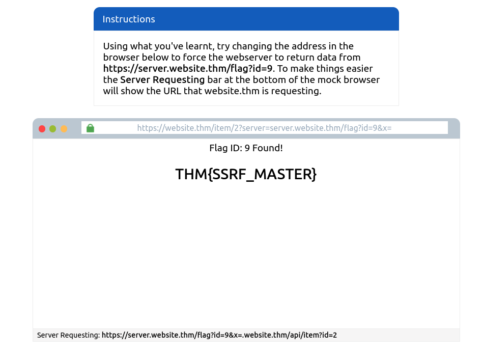
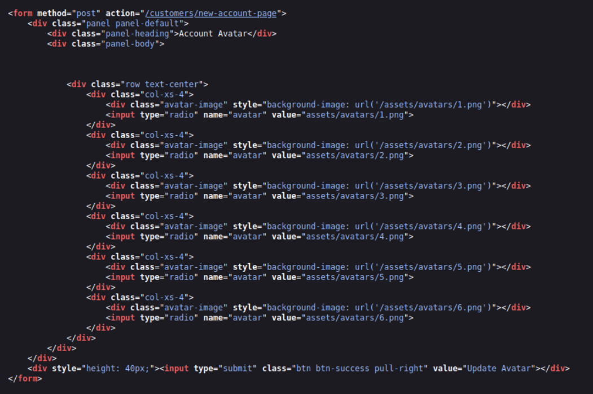
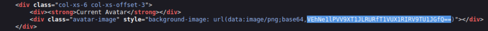

# [Intro to SSRF](https://tryhackme.com/room/ssrfqi)

## SSRF Examples

SSRF stands for Server-Side Request Forgery. It's a vulnerability that allows a malicious user to cause the webserver to make an additional or edited HTTP request to the resource of the attacker's choosing.

There are two types of SSRF vulnerability; the first is a regular SSRF where data is returned to the attacker's screen. The second is a Blind SSRF vulnerability where an SSRF occurs, but no information is returned to the attacker's screen.

A successful SSRF attack can result in any of the following: 

- Access to unauthorised areas.
- Access to customer/organisational data.
- Ability to Scale to internal networks.
- Reveal authentication tokens/credentials.

The below example shows how the attacker can have complete control over the page requested by the webserver.  
The Expected Request is what the website.thm server is expecting to receive, with the section in red being the URL that the website will fetch for the information.  
The attacker can modify the area in red to an URL of their choice.

The below example shows how an attacker can still reach the /api/user page with only having control over the path by utilising directory traversal. When website.thm receives ../ this is a message to move up a directory which removes the /stock portion of the request and turns the final request into /api/user

In this example, the attacker can control the server's subdomain to which the request is made. Take note of the payload ending in **&x=** being used to stop the remaining path from being appended to the end of the attacker's URL and instead turns it into a parameter (?x=) on the query string:

Going back to the original request, the attacker can instead force the webserver to request a server of the attacker's choice. By doing so, we can capture request headers that are sent to the attacker's specified domain. These headers could contain authentication credentials or API keys sent by website.thm (that would normally authenticate to api.website.thm).

### Questions

Q: What is the flag from the SSRF Examples site?

A: `THM{SSRF_MASTER}`

## Finding an SSRF

**When a full URL is used in a parameter in the address bar:**

  

**A hidden field in a form:**

  

**A partial URL such as just the hostname:**

  

**Or perhaps only the path of the URL:**

Some of these examples are easier to exploit than others, and this is where a lot of trial and error will be required to find a working payload.

If working with a blind SSRF where no output is reflected back to you, you'll need to use an external HTTP logging tool to monitor requests such as requestbin.com, your own HTTP server or Burp Suite's Collaborator client.

### Questions

Q: Based on simple observation, which of the following URLs is more likely to be vulnerable to SSRF?

1. `https://website.thm/index.php`
2. `https://website.thm/list-products.php?categoryId=5325`
3. `https://website.thm/fetch-file.php?fname=242533.pdf&srv=filestorage.cloud.thm&port=8001`
4. `https://website.thm/buy-item.php?itemId=213&price=100&q=2`

A: `3`

## Defeating Common SSRF Defenses

More security-savvy developers aware of the risks of SSRF vulnerabilities may implement checks in their applications to make sure the requested resource meets specific rules. There are usually two approaches to this, either a deny list or an allow list.  

### **Deny List**

A Deny List is where all requests are accepted apart from resources specified in a list or matching a particular pattern. A Web Application may employ a deny list to protect sensitive endpoints, IP addresses or domains from being accessed by the public while still allowing access to other locations. A specific endpoint to restrict access is the localhost, which may contain server performance data or further sensitive information, so domain names such as localhost and 127.0.0.1 would appear on a deny list. Attackers can bypass a Deny List by using alternative localhost references such as 0, 0.0.0.0, 0000, 127.1, 127.*.*.*, 2130706433, 017700000001 or subdomains that have a DNS record which resolves to the IP Address 127.0.0.1 such as 127.0.0.1.nip.io.

Also, in a cloud environment, it would be beneficial to block access to the IP address 169.254.169.254, which contains metadata for the deployed cloud server, including possibly sensitive information. An attacker can bypass this by registering a subdomain on their own domain with a DNS record that points to the IP Address 169.254.169.254.

### **Allow List**

An allow list is where all requests get denied unless they appear on a list or match a particular pattern, such as a rule that an URL used in a parameter must begin with **https://website.thm.** An attacker could quickly circumvent this rule by creating a subdomain on an attacker's domain name, such as https://website.thm.attackers-domain.thm. The application logic would now allow this input and let an attacker control the internal HTTP request.

### **Open Redirect**

If the above bypasses do not work, there is one more trick up the attacker's sleeve, the open redirect. An open redirect is an endpoint on the server where the website visitor gets automatically redirected to another website address. Take, for example, the link https://website.thm/link?url=https://tryhackme.com. This endpoint was created to record the number of times visitors have clicked on this link for advertising/marketing purposes. But imagine there was a potential SSRF vulnerability with stringent rules which only allowed URLs beginning with https://website.thm/. An attacker could utilise the above feature to redirect the internal HTTP request to a domain of the attacker's choice.

### Questions

Q: What method can be used to bypass strict rules?

A: `open redirect`

Q: What IP address may contain sensitive data in a cloud environment?

A: `169.254.169.254`

Q: What type of list is used to **permit** only certain input?
 
A: `Allow List`

Q: What type of list is used to **stop** certain input?

A: `Deny List`

## SSRF Practical

We've come across two new endpoints during a content discovery exercise against the **Acme IT Support** website. The first one is **/private**, which gives us an error message explaining that the contents cannot be viewed from our IP address. The second is a new version of the customer account page at **/customers/new-account-page** with a new feature allowing customers to choose an avatar for their account.

First, create a customer account and sign in. Once you've signed in, visit [https://10-80-188-95.reverse-proxy.cell-prod-eu-west-1a.vm.tryhackme.com/customers/new-account-page](https://10-80-188-95.reverse-proxy.cell-prod-eu-west-1a.vm.tryhackme.com/customers/new-account-page) to view the new avatar selection feature. By viewing the page source of the avatar form, you'll see the avatar form field value contains the path to the image. The background-image style can confirm this in the above DIV element as per the screenshot below:

  

  

If you choose one of the avatars and then click the **Update Avatar** button, you'll see the form change and, above it, display your currently selected avatar.

  

Viewing the page source will show your current avatar is displayed using the data URI scheme, and the image content is base64 encoded as per the screenshot below.  

  

  

  

Now let's try making the request again but changing the avatar value to **private** in hopes that the server will access the resource and get past the IP address block. To do this, firstly, right-click on one of the radio buttons on the avatar form and select **Inspect**:

  

  

  

**And then edit the value of the radio button to private:**

  

  

Be sure to select the avatar you edited and then click the **Update Avatar** button. Unfortunately, it looks like the web application has a deny list in place and has blocked access to the /private endpoint.

  

  

As you can see from the error message, the path cannot start with /private but don't worry, we've still got a trick up our sleeve to bypass this rule. We can use a directory traversal trick to reach our desired endpoint. Try setting the avatar value to **x/../private**

You'll see we have now bypassed the rule, and the user updated the avatar. This trick works because when the web server receives the request for **x/../private**, it knows that the **../** string means to move up a directory that now translates the request to just **/private**.

### Questions

Q: What is the flag from the /private directory?

A: `THM{YOU_WORKED_OUT_THE_SSRF}`
