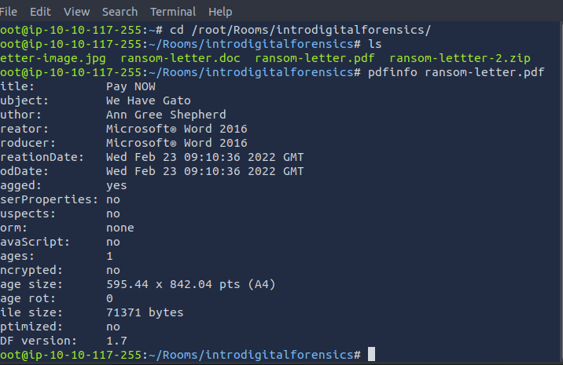
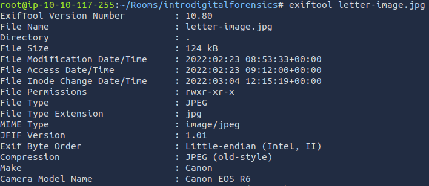

# Intro to Digital Forensics

## Introduction to Digital Forensics

- **Forensics** is the application of science to investigate crimes and establish facts. 
- With the use and spread of digital systems, such as computers and smartphones, a new branch of forensics was born to investigate related crimes: computer forensics, which later evolved into, _digital forensics_.

- More formally, **digital forensics** is the application of computer science to investigate digital evidence for a legal purpose. 
- Digital forensics is used in two types of investigations:

1. **Public-sector investigations** refer to the investigations carried out by government and law enforcement agencies. They would be part of a crime or civil investigation.
2. **Private-sector investigations** refer to the investigations carried out by corporate bodies by assigning a private investigator, whether in-house or outsourced. They are triggered by corporate policy violations.

### Questions

Consider the desk in the photo above. In addition to the smartphone, camera, and SD cards, what would be interesting for digital forensics?

	`A: laptop`

## Digital Forensics Process

1. **Acquire the evidence**: 
	- Collect the digital devices such as laptops, storage devices, and digital cameras. (Note that laptops and computers require special handling if they are turned on;)
2. **Establish a chain of custody**: 
	- Fill out the related form appropriately ([Sample form](https://www.nist.gov/document/sample-chain-custody-formdocx)). 
	- The purpose is to ensure that only the authorized investigators had access to the evidence and no one could have tampered with it.
3. **Place the evidence in a secure container**: 
	- You want to ensure that the evidence does not get damaged. 
	- In the case of smartphones, you want to ensure that they cannot access the network, so they don’t get wiped remotely.
4. **Transport the evidence to your digital forensics lab**.

At the lab, the process goes as follows:
1. Retrieve the digital evidence from the secure container.
2. Create a forensic copy of the evidence: The forensic copy requires advanced software to avoid modifying the original data.
3. Return the digital evidence to the secure container: You will be working on the copy. If you damage the copy, you can always create a new one.
4. Start processing the copy on your forensics workstation.

- The above steps have been adapted from [Guide to Computer Forensics and Investigations, 6th Edition](https://www.cengage.com/c/guide-to-computer-forensics-and-investigations-6e-nelson/9781337568944/).

- According to the former director of the Defense Computer Forensics Laboratory, Ken Zatyko, digital forensics includes:
	- *Proper search authority*: Investigators cannot commence without the proper legal authority.
	- *Chain of custody*: This is necessary to keep track of who was holding the evidence at any time.
	- *Validation with mathematics*: Using a special kind of mathematical function, called a hash function, we can confirm that a file has not been modified.
	- *Use of validated tools*: The tools used in digital forensics should be validated to ensure that they work correctly. 
		- For example, if you are creating an image of a disk, you want to ensure that the forensic image is identical to the data on the disk.
	- *Repeatability*: The findings of digital forensics can be reproduced as long as the proper skills and tools are available.
	- *Reporting*: The digital forensics investigation is concluded with a report that shows the evidence related to the case that was discovered.

### Questions

It is essential to keep track of who is handling it at any point in time to ensure that evidence is admissible in the court of law. What is the name of the documentation that would help establish that?
 
	`A: Chain of Custody`

## Practical Example of Digital Forensics

- `cd /root/Rooms/introdigitalforensics`

- **EXIF** stands for **Exchangeable Image File Format**; it is a standard for saving metadata to image files. 
	- Whenever you take a photo with your smartphone or with your digital camera, plenty of information gets embedded in the image. 
- The following are examples of metadata that can be found in the original digital images:
	- Camera model / Smartphone model
	- Date and time of image capture
	- Photo settings such as focal length, aperture, shutter speed, and ISO settings
- Because smartphones are equipped with a GPS sensor, finding GPS coordinates embedded in the image is highly probable. The GPS coordinates, i.e., latitude and longitude, would generally show the place where the photo was taken.

- **ExifTool** is used to read and write metadata in various file types, such as JPEG images.

### Questions

Using `pdfinfo`, find out the author of the attached PDF file, `ransom-letter.pdf`.

	`A: Ann Gree Shepherd `

Using `exiftool` or any similar tool, try to find where the kidnappers took the image they attached to their document. What is the name of the street?

- From ExifTool, find the GPS position value: `51 deg 30' 51.90" N, 0 deg 5' 38.73" W`

	`A: Milk Street`

What is the model name of the camera used to take this photo?

	`A: Canon EOS R6`