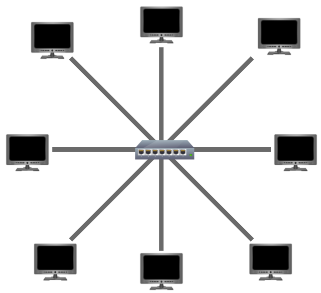
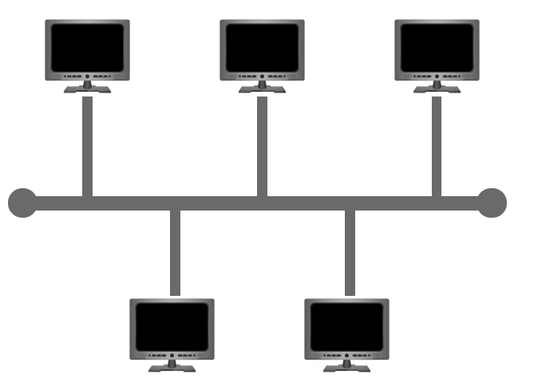
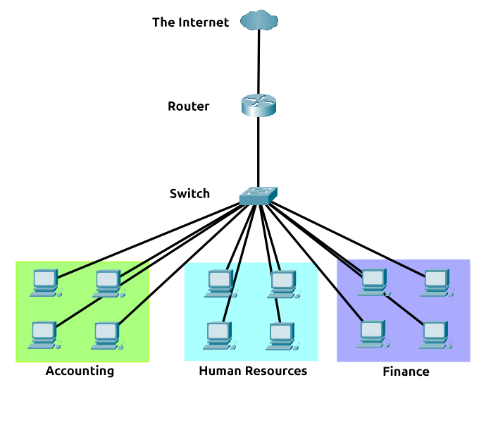
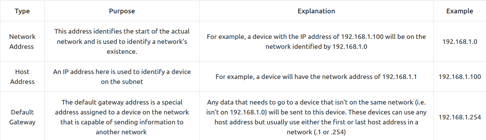
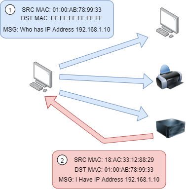
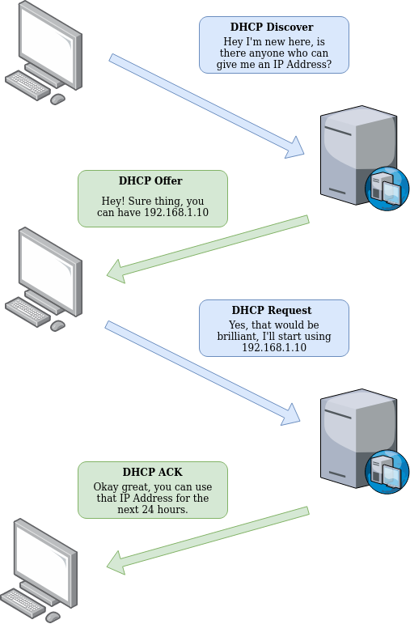

# Intro To LAN

- User: George Nadejde
- Date: 25 January 2022

Tags: #networking #subnetting #[arp](arp.md) #dhcp

---

## Introducing LAN Technologies

### Star Topology

- Devices are individually connected via a central networking device, such as a *switch* or a *hub*

- Con:
	- expensive
	- hard troubleshooting
- Pro:
	- easily scalable
	- single point of failure: the switch/hub

### Bus Topology

- Devices are connected on a single cable (**backbone**)

- Con:
	- may become slow if data is requested at the same time
	- hard to identify in this case which device has problems (bottlenecks)
	- single point of failure
	- cannot handle a lot of data
- Pro:
	- cost efficient
	- easy to set up

### Ring Topology / Token Topology

- Devices are directly conencted to each other to form a loop

- Sends data through the loop until it gets to the destination device (if the middle device has its own data to be sent, this is sent first and then the one it received).

- Con:
	- data sending is not efficient
	- if a cable is cut, data cannot be sent anymore
- Pro:
	- less prone to bottlenecks

### Switches

- used to aggregate multiple devices such as computers or printers using ethernet.

- connect via ports: 4, 8, 16, 24, 32, 64 ports.

- more efficient than hubs/repeaters: keeps track of what device is connected to which port, so when receiving a packet, instead of repeating it to every port like a hub, it just sends to the intended targut => reduced network traffic.

- switches connect to routers. In case one path goes down, another one can be used => slower, but *no downtime*.

### Routers

- connect networks and pass data between them using *routing*.

- Routing is the label given to the process of data travelling across networks. 

- Routing involves creating a path between networks so that this data can be successfully delivered.

### Questions

1. What does LAN stand for?

R: Local Area Network

2. What is the verb given to the job that Routers perform?

R: routing

3. What device is used to centrally connect multiple devices on the local network and transmit data to the correct location?

R: switch

4. What topology is cost-efficient to set up?

R: bus topology

5. What topology is expensive to set up and maintain?

R: Star Topology

6. Flag:

R:THM{TOPOLOGY_FLAWS}

## Subnetting

- Example of use case for subnetting:

- Subnetting is achieved by splitting up the number of hosts that can fit within the network, represented by a number called a subnet mask.

- Subnets use IP addresses in three different ways:

	- Identify the *network address*.
	- Identify the *host address*.
	- Identify the *default gateway*.

- Benefits:
	- Efficiency
	- Security
	- Full control

### Questions

1. What is the technical term for dividing a network up into smaller pieces? 

R: subnetting

2. How many bits are in a subnet mask?

R: 32

3. What is the range of a section (octet) of a subnet mask?

R: 0-255

4. What address is used to identify the start of a network?

R: network address

5. What address is used to identify devices within a network?

R: host address

6. What is the name used to identify the device responsible for sending data to another network?

R: default gateway.

## The [ARP](arp.md) (Address Resolution Protocol) Protocol

- responsible to allowing devices to identify themselves in a network.

- simply, it links the MAC to the IP for a certain device.

- each device has a log of the MAC addresses of the other devices in the network.

- when a device wants to communicate with another device, it sends a broadcast to the entire network to search for the destination device.

- devices can use the [ARP](arp.md) protocol to find the MAC address of a device.

- In order to map the two identifiers together (IP and MAC), [ARP](arp.md) sends two type of messages:

	1. **[ARP](arp.md) Request**
	2. **[ARP](arp.md) Reply**

- When an ARP request is sent, a message is broadcasted to every other device found on a network by the device, asking whether or not the device's MAC address matches the requested IP address. If the device does have the requested IP address, an ARP reply is returned to the initial device to acknowledge this. The initial device will now remember this and store it within its cache (an ARP entry). 

### Questions

1. What does [ARP](arp.md) stand for?

R: Address Resolution Protocol

2. What category of ARP Packet asks a device whether or not it has a specific IP address?

R: Request

3. What address is used as a physical identifier for a device on a network?

R: MAC Address

4. What address is used as a logical identifier for a device on a network?

R: IP Address

## DHCP 

- DHCP (Dynamic Host Configuration Protocol) is used to assign IP addresses dynamically to devices.

- When a device has not been configured manually with an IP address, a request is made to discover a DHCP server (*DHCP Discover*). The DHCP sends a possible IP address the device could use (*DHCP Offer*). The device sends a reply confirming it wants that IP (*DHCP Request*) and lastly, the DHCP sends a reply acknowledging this has been completed and that the device can now use that IP address (*DHCP ACK*). 

### Questions

1. What type of DHCP packet is used by a device to retrieve an IP address?

R: DHCP Discover

2. What type of DHCP does a device send once it has benn offered an IP address by the DHCP server?

R: DHCP Request

3. What is the last DHCP paclet that is sent to a device from a DHCP server?

R: DHCP ACK

