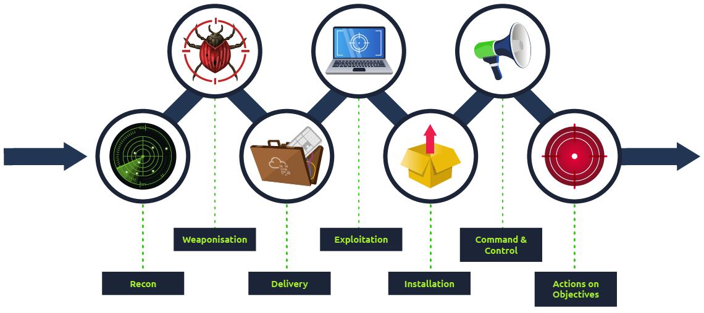

# Network Security

## Introduction 

Examples of **hardware appliances** include:

- **Firewall appliance**: The firewall allows and blocks connections based on a predefined set of rules. 
	- It restricts what can enter and what can leave a network.
- **Intrusion Detection System (IDS)** appliance: An IDS detects system and network intrusions and intrusion attempts. 
	- It tries to detect attackers’ attempts to break into your network.
- **Intrusion Prevention System (IPS)** appliance: An IPS blocks detected intrusions and intrusion attempts. 
	- It aims to prevent attackers from breaking into your network.
- **Virtual Private Network (VPN)** concentrator appliance: A VPN ensures that the network traffic cannot be read nor altered by a third party. 
	- It protects the confidentiality (secrecy) and integrity of the sent data.

- On the other hand, we have software security solutions:
	- **Antivirus software**: You install an antivirus on your computer or smartphone to detect malicious files and block them from executing.
	- **Host firewall**: Unlike the firewall appliance, a hardware device, a host firewall is a program that ships as part of your system, or it is a program that you install on your system. 
		- For instance, MS Windows includes Windows Defender Firewall, and Apple macOS includes an application firewall; both are host firewalls.

### Questions

What type of firewall is Windows Defender Firewall?

	`A: Host Firewall`

## Methodology

- Breaking into a target network usually includes a number of steps. According to [Lockheed Martin](https://www.lockheedmartin.com/en-us/capabilities/cyber/cyber-kill-chain.html), the Cyber Kill Chain has seven steps:

1. **Recon**: 
	- Recon, short for reconnaissance, refers to the step where the attacker tries to learn as much as possible about the target. Information such as the types of servers, operating system, IP addresses, names of users, and email addresses, can help the attack’s success.
2. **Weaponization**: 
	- This step refers to preparing a file with a malicious component, for example, to provide the attacker with remote access.
3. **Delivery**: 
	- Delivery means delivering the “weaponized” file to the target via any feasible method, such as email or USB flash memory.
4. **Exploitation**: 
	- When the user opens the malicious file, their system executes the malicious component.
5. **Installation**: 
	- The previous step should install the malware on the target system.
6. **Command & Control (C2)**: 
	- The successful installation of the malware provides the attacker with a command and control ability over the target system.
7. **Actions on Objectives**: 
	- After gaining control over one target system, the attacker has achieved their objectives. One example objective is Data Exfiltration (stealing target’s data).

### Questions

During which step of the Cyber Kill Chain does the attacker gather information about the target?
 
	`A: Recon`

## Practical Example of Network Security

- `nmap 10.10.173.79`
- `ftp 10.10.173.79`
- `get secret.txt`
- `ssh root@10.10.173.79`
- `cat /home/librarian/flag.txt `

- Let’s summarize what we have done in this task to get `root` access on the target system:

1. We used `nmap` to learn about the running services.
2. We connected to the FTP server to learn more about its configuration.
3. We discovered a file containing the root password mistakenly copied to a public folder.
4. We used the password we found, allowing us to log in successfully.
5. We gained access to all the users’ files.

### Questions

What is the password in the `secret.txt` file?

	`A: ABC789xyz123 `

What is the content of the `flag.txt` in the `/root` directory?

	`A: THM{FTP_SERVER_OWNED}`

What is the content of the `flag.txt` in the `/home/librarian` directory?

	`A: THM{LIBRARIAN_ACCOUNT_COMPROMISED}`