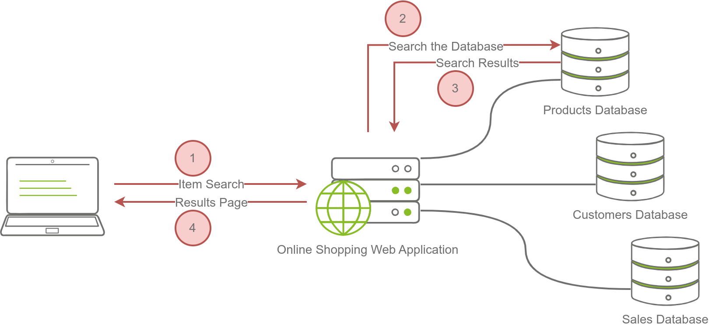
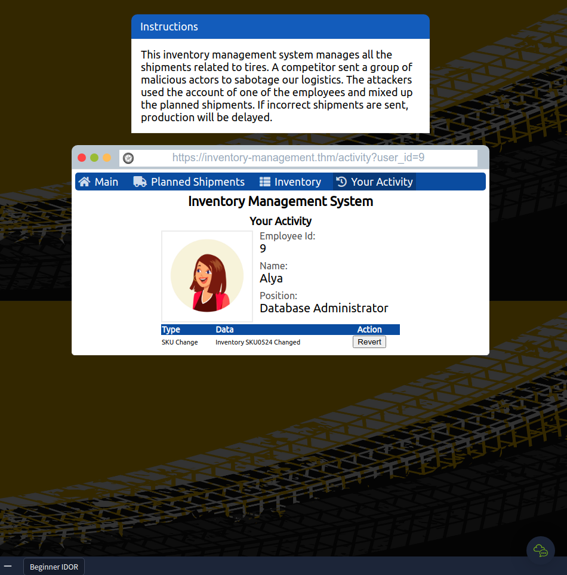

# Web Application Security

## Introduction

- A **web application** is like a “program” that we can use without installation as long as we have a modern standard web browser, such as Firefox, Safari, or Chrome.
- Consequently, instead of installing every program you need, you only need to browse the related page. 
- The following are some examples of web applications:
	- Webmail such as Tutanota, Protonmail, Outlook, and Gmail
	- Online office suites such as Microsoft Office 365 (Word, Excel, and PowerPoint), Google Drive (Docs, Sheets, and Slides), and Zoho Office (Writer, Sheet, and Show)
	- Online shopping such as Amazon.com, AliExpress, and Etsy

- The idea of a web application is that it is a program running on a remote server. 
- A server refers to a computer system running continuously to “serve” the clients. 
	- In this case, the server will run a specific type of program that can be accessed by web browsers.

- Consider an online shopping application. 
- The web application will read the data about the products and their details from a database server. 
- A _database_ is used to store information in an organized way. 
	- Examples include information about products, customers, and invoices. 
- A _database server_ is responsible for many functions, including reading, searching, and writing to the database.

- The image below shows searching for an item on an online shopping site. In the simplest version, the search will take four steps:

1. The user enters an item name or related keywords in the search field. The web browser sends the search keyword(s) to the online shopping web application.
2. The web application queries (searches) the products database for the submitted keywords.
3. The product database returns the search results matching the provided keywords to the web application.
4. The web application formats the results as a friendly web page and returns them to the user.

### Questions

What do you need to access a web application?

	A: browser

## Web Application Security Risks

- encryption ensures that no one can read the data without knowing the secret key.

### Questions

You discovered that the login page allows an unlimited number of login attempts without trying to slow down the user or lock the account. What is the category of this security risk?
	`A: Identification and Authentication Failure`

You noticed that the username and password are sent in cleartext without encryption. What is the category of this security risk?
	`A: Cryptographic Failures`

## Practical Example of Web Application Security

- **IDOR** falls under the category of Broken Access Control.

- Opened the website and clicked *Your Activity*
- Tried different user_id's in the URL to find the correct employee and revert their actions.
- Reverting all actions yields the flag

### Questions

Check the other users to discover which user account was used to make the malicious changes and revert them. After reverting the changes, what is the flag that you have received?

	`A: THM{IDOR_EXPLORED}`
