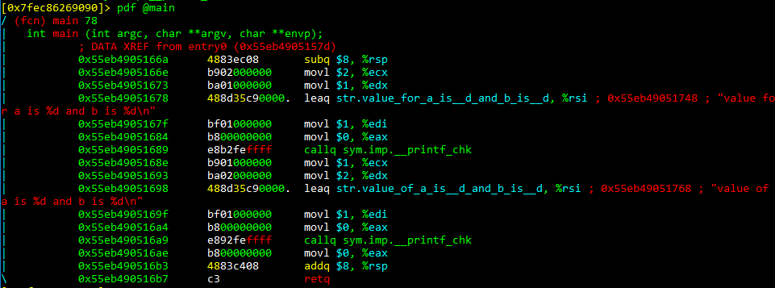
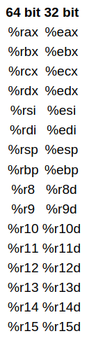
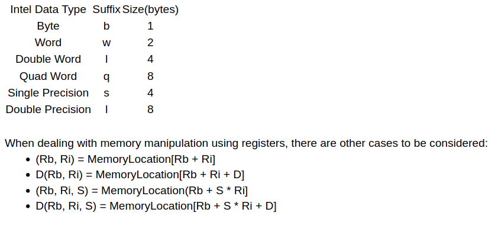
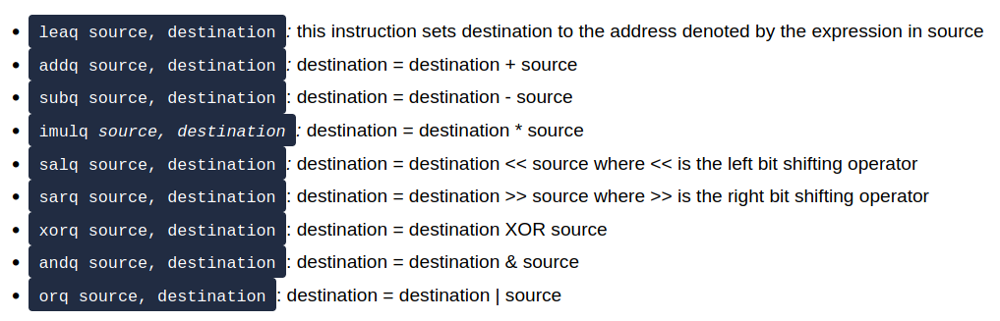
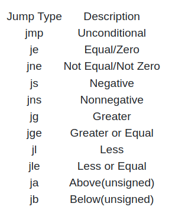
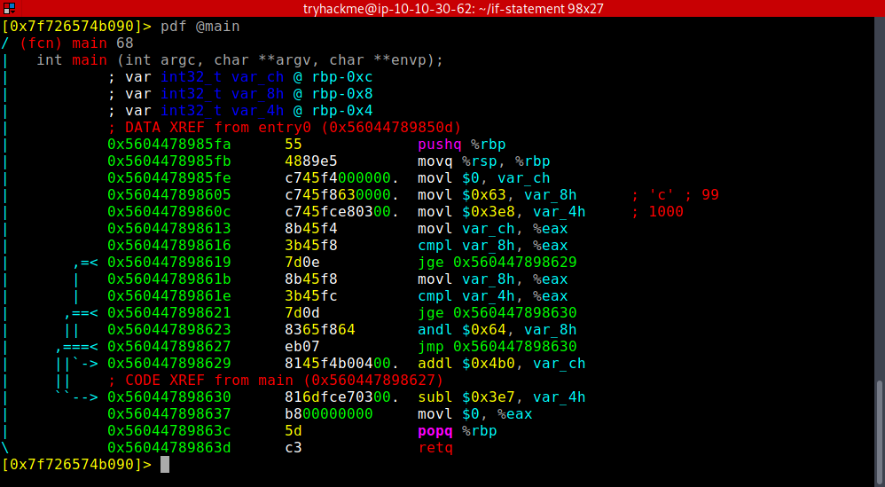

# [Intro to x86-64](https://tryhackme.com/room/introtox8664)

## Introduction

- we will take a look on Intel's x86-64 version of assembly.

- before an executable file is produced, the source code is first compiled into assembly (*.s* files), after which the assembler converts it into an object program(*.o* files), and operations with a linker finally make it an executable. 

- run `radare2` in debug mode: `r2 -d executable_file`

- ask r2 to analyze the program: `aa`

- set syntax to at&t: `e asm.sytax=att`

- get help: `?`

- find list of functions: `afl`

- get the assembly code for a function (*print disassembly function): `pdf @main`

- the values on the complete left column are **memory addresses** of the instructions, and these are usually stored in a structure called the stack

- The middle column contains the **instructions encoded in bytes** (what is usually the machine code)

- the last column actually contains the **human readable instructions**. 

- The core of assembly language involves using registers to do the following:

    - Transfer data between memory and register, and vice versa

    - Perform arithmetic operations on registers and data

    - Transfer control to other parts of the program

- Since the architecture is **x86-64**, the **registers are 64 bit** and Intel has a list of *16* registers:

- the first 6 registers are known as *general purpose registers*. 

- The **%rsp** is the **stack pointer** and it points to the top of the stack which contains the most recent memory address. 

	- The stack is a data structure that manages memory for programs. 

- **%rbp** is a **frame pointer** and points to the frame of the function currently being executed - every function is executed in a new frame. 

- we can move constants, values of registers or transferring values from memory, using brackets: **movq $3 (%rax)** -> moving constant 3 to memory address represented by rax.

- the *q* represents the size of the data:

- Instructions:

## If Statements

- *If statements* use 3 important instructions in assembly:

	- `cmpq s2, s1` -> doing s2-s1 without updating the result to s1.
	- `testq s2, s1` -> doing s1 & s2 without updating the result to destination (s1)

- in order to transfer control to different instructions, we use jumps:

## If Statements cnt.

- add breakpoint: `db <memory_address>`

- start executing the program: `dc`

- view value of registers: `dr`

- move to the next instr.: `ds` (seek)

- *rip* -> current **instruction pointer**

- The `popq` instruction involves popping a value of the stack and reading it, and the return instruction sets this popped value to the current instruction pointer.

### Questions

- SSH to the machine and open if2 file using radare2.

1. What is the value of var_8h before the popq and ret instructions?

- we do 100 & 99. To get the result, convert these into binary and do a logical AND. 

A: 96

2. What is the value of var_ch before the popq and ret instructions?

- it is not modified during the execution

A: 0 

3. What is the value of var_4h before the popq and ret instructions?

- 1000 - 999

A: 1

4. What operator is used to change the value of var_8h, input the symbol as your answer(symbols include +, -, *, /, &, |):

- As explained in the first question

A: &

## Loops

### Questions

1. What is the value of var_8h on the second iteration of the loop?

- var8 is gettind halved in every loop

A: 5

2. What is the value of var_ch on the second iteration of the loop?

- var_ch does not contain a 1 in the second position (2 in decimal), hence ANDing it with a 2 will result in a 0 in the first itteration. Hence, in the second, the result will be also 0.

A: 0

3. What is the value of var_8h at the end of the program?

- the loop has 3 itterations, as var_4h is tripled every time (4 -> 12 -> 36 -> 108 > 99) until the value is greater than 99.

A: 2 (5/2)

4. What is the value of var_ch at the end of the program?

- As we had said, the value does not change starting from the 2nd itteration

A: 0

## Crack1

- localhost address

A: 127.0.0.1