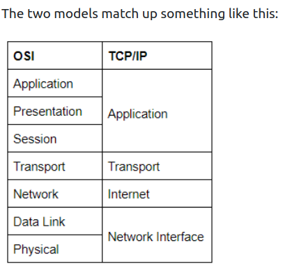
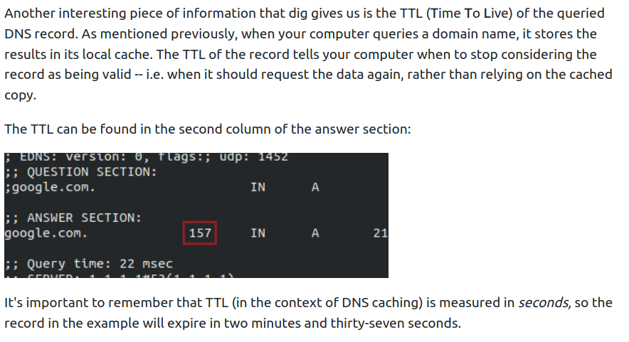

# [Introductory_Networking](https://tryhackme.com/room/introtonetworking) 

The OSI (Open Systems Interconnection) Model is a standardized model to demonstrate how 
networks work. In practice, however, the TCP/IP model is used.

People Don't Need These Stupid Packets Anyway.

7. **Application Layer** 
- it works almost exclusively with applications, providing them with an interface in order to transmit data.

6. **Presentation Layer** 
- translates the data received from the Application layer into a standardized format, as well as handling any encryption, compression or other types of data transformation.

5. **Session Layer** 
- it establishes a connection with the session layer of the remote computer. If it fails, it sends an error and stops the process. Otherwise, it's his responsibility to maintain and synchronise a connection with	the other session layer. It creates a unique session to the communication in question, and hence it does not mix up the messages in case you have to send data to multiple endpoints of the remote computer.

4. **Transport Layer** 
- Numerous functions: it chooses the protocol over which data is to be transmitted. Two common protocols: TCP (Transmission Control Protocol), UDP (User Datagram Protocol). TCP is a CONNECTION-BASED protocol, which means it establishes a connection (that is maintained for the duration of the request) with the remote computer to make sure ALL of the packets have arrived in the right order. If some get lost, TCP can send them once again. UDP is a CONNECTIONLESS protocol that just sends the packets and doesn't care if they arrived or not, but with a higher degree of speed compared to TCP. TCP can be used for things where accuracy is important (file transfer, loading a webpage) and UDP when speed is important (video streaming). After having selected a protocol, the transport layer then divides the data into bite-sized pieces called SEGMENTS (for TCP) or DATAGRAMS (for UDP), which makes it easier to transmit the mesasge successfully.

3. **Network Layer** 
	- locates the destination of your request. It takes the IP address of the receiver and chooses the best route to take to get there.

2. **Data Link Layer** 
	- focuses on the physical addressing of the transmission. It adds the MAC address (Media Access Control) of the endpoint on top of the IP one. 	
	- Every NIC (Network Interface Card) comes with a unique MAC address that is literally burnt into the card. They can't be changed, but they can be spoofed. When sending information within a network, it is the MAC address that is used to identify where to send the data. Also, it presents the data in a suitable way for transmission. Also, when it receives data, it makes sure that it hasn't been corrupted during transmission.

1. **Physical Layer** 
	- happening in the hardware of the computer. Converts binary data to signals using electrical pulses, as well as receiving signals and converting them into binary data.


## ENCAPSULATION

- As the data is passed down the layers, information specific to the layer is added to the start of the transmission. E.g.: transport would add info about the protocol used, netw. about the source and destination IP address. Data link also adds smth to the end of the transmission, a TRAILER, which is used to verify that it has not been corrupted.

- Data is reffered to in different terms while sending it. In the first 3 layers, it is just data. In the transport layer, it is either *SEGMENTS* or *DATAGRAMS*. In the Network Layer, it is referred to as *PACKETS*. In the Data Link, it is called *FRAMES*, while in Physical as *BITS*.

*De-encapsulation* = process used by the receiver computer to get the data sent by the sender, which is just the reverse of the encapsulation process.


## TCP / IP model

- TCP/IP is older than OSI (which was introduce just as a comprehensive guide for learning)

- Layers: Application, Transport, Internet, Network Interface (Data link/ Physical)

- It gets its name from the most important protocols used: TCP (Transmission Control Protocol) and IP (Internet Protocol).

- The stable connection that TCP establishes with the remote computer when sending out data is called **THE THREE-WAY HANDSHAKE**. Firstly, the computer sends a special request to the remote computer indicating that it wants to initialize a connection. This is done by sending a SYN (synchronise) bit. The remote computer will respond with a packet containing the SYN bit, as well as a ACK (acknowledgment) bit. Finally, your computer will send the ACK bit by itself, completing the three-way handshake.

- **PING** - works using the ICMP protocol. This protocol works on the Network Layer /Internet Layer.

- **TRACEROUTE** - by default, Windows uses ICMP, Unix over UDP.

- **WHOIS** - query who a domain name is registered to. Domains are leased out by companies called *DOMAIN REGISTRARS*.
  
  
  
  
## Domain servers:

- **DNS** - Domain Name System

- When you make a request for a website, your computer checks if it has its IP address on its local cache. If not, it makes a request to a **RECURSIVE DNS SERVER**, which your router knows how to find. If it also doesn't know the ip address, the request is passed to a **ROOT NAME SERVER**. Before 2004, there were exactly *13* ROOT NAME SERVERS in the world. These servers keep track of the DNS Servers in next level down, choosing an appropriate one to redirect your request to: **TOP-LEVEL DOMAIN SERVERS** (TLD). These are split by extension (if you want to get google.com, you would get redirected to one that handes .com domains). Also, TLD servers keep track of the next level down:

- **AUTHORITATIVE NAME SERVERS**. These are used to store DNS records for domains DIRECTLY.

- *DIG* - manually query recursive DNS Servers of our choice for information about domains:

```bash
dig <domain> @<dns-server-ip>
```

- Dig also tells us is the TIME TO LIVE (TTL) of a queried DNS record. When we make a request for a domain, it gets stored in our local cache. The TTl of the record tells us when to stop considering the record as valid - when it shoud request the data again. In a dig answer, this is highlighted in the second column of the ANSWER SECTION (measured in seconds).



- *Google public DNS Servers*: 8.8.8.8 and 8.8.4.4
