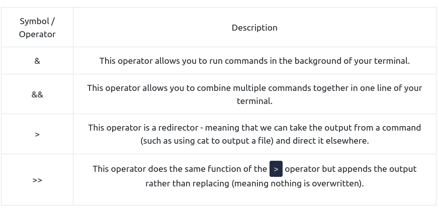

# [LinuxFundamentalsPart1](https://tryhackme.com/room/linuxfundamentalspart1)

- Linux is the operating system for things such as:
	- Websites
	- Car control panels
	- Point of Sale (PoS) systems
	- Traffic light controllers or industrial sensors

- "Linux" is the umbrella term for the multiple OS's that are based on UNIX (another operating system)

- Linux distributions: Ubuntu, Debian.

- Fun fact: Ubuntu can be run on systems with only 512 MB of RAM!

- The first Linux distribution was released in *1991* and was created by Linus Torvalds.


## FIND

- If we know the name of the file we are looking for, we can use the command to search for it in our current directory:

```bash
find -name passwords.txt
```

If we want to find all .txt files in our current directory:

```bash
find -name *.txt
```

- && - run multiple commands at once:

E.g.: command1 && command2

- But command2 will execute only if command1 was successful.

