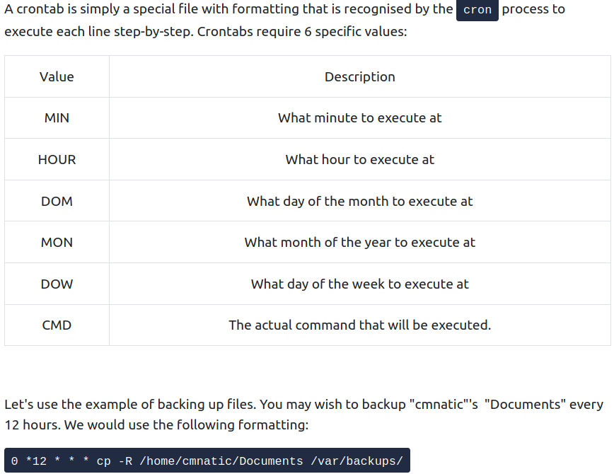

# [LinuxFundamentalsPart3](https://tryhackme.com/room/linuxfundamentalspart3)


- *wget* - downloads a file via HTTP

- *SCP* (securely copying files) - protocol that allows you to transfer a file between two computers using SSH to provide authentication and encryption. Format: SOURCE DESTINATION

```bash
scp important.txt ubuntu@192.168.1.30:/home/ubuntu/transferred.txt
```

- Or from a computer that we are not logged into:
```bash
scp ubuntu@192.168.1.30:/home/ubuntu/documents.txt notes.txt 
```

- Python has module called *HTTPServer*, This allows you to create a web server in your current directory!

```bash
python3 -m http.server
```

- Get a file from that webserver:

```bash
wget http://127.0.0.1:8000/file
```

- Alternative: [Updog](https://github.com/sc0tfree/updog)

- See the processes of other users and the system's processes:

```bash
ps aux
```

- Real-time statistics about the processes running on the system that will refresh every 10 seconds:

```bash
top
```

- Kill signals:
	- **SIGTERM** - kill the process, but allow it to do some cleanup beforehand -> CLEAN KILL
	- **SIGKILL** - kill the process - doesn't do any cleanup after the fact
	- **SIGSTOP** - stop / suspend a process

- The OS uses namespaces to split up the available resources of the computer (RAM, CPU, priority) to processes. Only processes in the same namespace can see each other. 

- The first process that starts is systemd which has PID = 0 and it starts when the system boots. It sits in between the OS and the user. Any software that we will start will be the child of systemd and controlled by it, but will run on its own, sharing the resources from systemd.

- *systemctl* [option] [service] - command that allows us to interact with the systemd daemon.

-  start apache:

```bash
systemctl start apache2
```

- Four options with systemctl:
	- *start*
	- *stop*
	- *enable*
	- *disable*

- Start a service on boot up:

```bash
systemctl enable myservice
```

- Schedule action after boot up with cron and crontabs -> process started during boot

- 6 fields: MIN, HOUR, DOM, MON, DOW, CMD.

- If we do not care about one, we use an * .

- Cron [website](https://crontab-generator.org/) that generates the formatting for you 

- Crontabs can be edited using:

```bash
crontab -e
```

- When a software developer wants to submit sofware to the community he will do that to an "apt" repository.

- To add a repository to your OS:

```bash
add-apt-repository
```

- When we download software, the intergrity of it is guaranteed by the use of GPG keys = safety check from the developers "here's out software"

- We can add a software to our apt repository to update it automatically when we enter command: *apt-get update*

 - In /var/log we can see a lot of interesting stuff. In /var/log/apache we may see access or error logs, which can tell what user accessed what file. 

