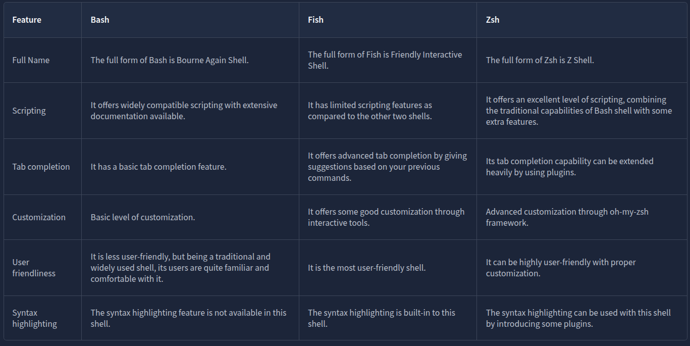
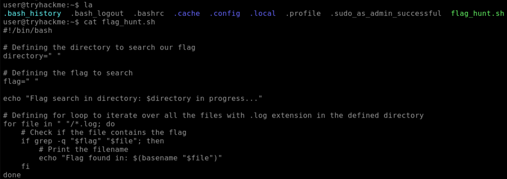
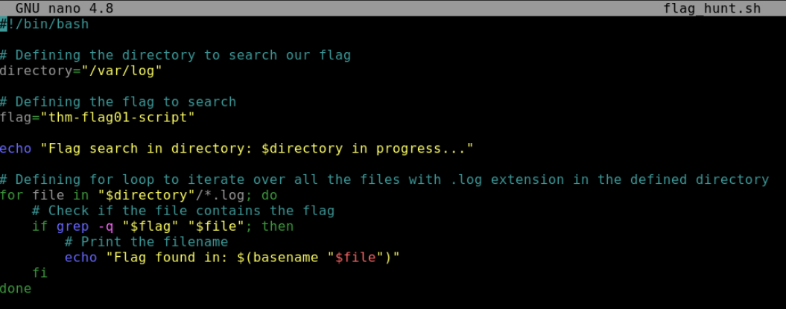
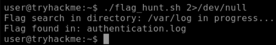
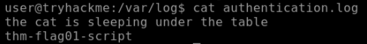

	
# [Linux Shell](https://tryhackme.com/room/linuxshells)

## Intro to Linux Shells

### Questions

Who is the facilitator between the user and the OS?

A: `shell`

## How to interact with a Shell?

### Questions

What is the default shell in most Linux distributions?

A: `bash`

Which command utility is used to list down the contents of a directory?

A: `ls`

Which command utility can help you search for anything in a file?

A: `grep`

## Types of Linux Shells

To see which shell you are using, type the command `echo $SHELL`.

You can also list down the available shells in your Linux OS. The file `/etc/shells` contains all the installed shells on a Linux system. You can list down the available shells in your Linux OS by typing `cat /etc/shells` in the terminal.

To switch between these shells, you can type the shell name that is present on your OS, and it will open for you.

If you want to permanently change your default shell, you can use the command: `chsh -s /usr/bin/zsh`. This will make this shell as the default shell for your terminal.

#### Bourne Again Shell

Bourne Again Shell (Bash) is the default shell for most Linux distributions. When you open the terminal, bash is present for you to enter commands. Before bash, some shells like sh, ksh, and csh had different capabilities. Bash came as an enhanced replacement for these shells, borrowing capabilities from all of them. This means that it has many of the features of these old shells and some of its unique abilities. Some of the key features provided by bash are listed below:

- Bash is a widely used shell with scripting capabilities.
- It offers a tab completion feature, which means if you are in the middle of completing a command, you can press the tab key on your keyboard. It will automatically complete the command based on a possible match or give you multiple suggestions for completing it.
- Bash keeps a history file and logs all of your commands. You can use the up and down arrow keys to use the previous commands without typing them again. You can also type `history` to display all your previous commands.

#### Friendly Interactive Shell

Friendly Interactive Shell (Fish) is also not default in most Linux distributions. As its name suggests, it focuses more on user-friendliness than other shells. Some of the key features provided by fish are listed below:

- It offers a very simple syntax, which is feasible for beginner users.
- Unlike bash, it has auto spell correction for the commands you write.
- You can customize the command prompt with some cool themes using fish.
- The syntax highlighting feature of fish colors different parts of a command based on their roles, which can improve the readability of commands. It also helps us to spot errors with their unique colors.
- Fish also provides scripting, tab completion, and command history functionality like the shells mentioned in this task.

#### Z Shell

Z Shell (Zsh) is not installed by default in most Linux distributions. It is considered a modern shell that combines the functionalities of some previous shells. Some of the key features provided by zsh are listed below:

- Zsh provides advanced tab completion and is also capable of writing scripts.
- Just like fish, it also provides auto spell correction for the commands.
- It offers extensive customization that may make it slower than other shells.
- It also provides tab completion, command history functionality, and several other features.



### Questions

Which shell comes with syntax highlighting as an out-of-the-box feature?

A: `fish`

Which shell does not have auto spell correction?

A: `bash`

Which command displays all the previously executed commands of the current session?

A: `history`

## Shell Scripting and Components

Unlike the other commands we type in the shell, we first need to create a file using any text editor for the script. The file must be named with an extension `.sh`, the default extension for bash scripts

Every script should start from shebang. Shebang is a combination of some characters that are added at the beginning of a script, starting with `#!` followed by the name of the interpreter to use while executing the script.

````shell-session
#!/bin/bash
````

The script below displays a string on the screen: "Hey, what’s your name?” This is done by `echo` command. The second line of the script contains the code `read name`. `read` is used to take input from the user, and `name` is the variable in which the input would be stored. The last line uses `echo` to display the welcome line for the user, along with its name stored in the variable.

```shell
# Defining the Interpreter 
#!/bin/bash
echo "Hey, what’s your name?"
read name
echo "Welcome, $name"
```

To execute the script, we first need to make sure that the script has execution permissions. To give these permissions to the script, we can type the following command in our terminal:

```shell-session
user@tryhackme:~$ chmod +x first_script.sh
```

For a general explanation of loops, let’s write a loop that will display all numbers starting from 1 to 10 on the screen. 

```shell
# Defining the Interpreter 
#!/bin/bash
for i in {1..10};
do
echo $i
done
```

```shell
# Defining the Interpreter 
#!/bin/bash
echo "Please enter your name first:"
read name
if [ "$name" = "Stewart" ]; then
        echo "Welcome Stewart! Here is the secret: THM_Script"
else
        echo "Sorry! You are not authorized to access the secret."
fi
```

### Questions

What is the shebang used in a Bash script?

A: `#!/bin/bash`

Which command gives executable permissions to a script?

A: `chmod +x`

Which scripting functionality helps us configure iterative tasks?

A: `loops`

## The Locker Script

A user has a locker in a bank. To secure the locker, we have to have a script in place that verifies the user before opening it. When executed, the script should ask the user for their name, company name, and PIN. If the user enters the following details, they should be allowed to enter, or else they should be denied access.

- Username: John
- Company name: Tryhackme
- PIN: 7385

```shell
# Defining the Interpreter 
#!/bin/bash 

# Defining the variables
username=""
companyname=""
pin=""

# Defining the loop
for i in {1..3}; do
# Defining the conditional statements
        if [ "$i" -eq 1 ]; then
                echo "Enter your Username:"
                read username
        elif [ "$i" -eq 2 ]; then
                echo "Enter your Company name:"
                read companyname
        else
                echo "Enter your PIN:"
                read pin
        fi
done

# Checking if the user entered the correct details
if [ "$username" = "John" ] && [ "$companyname" = "Tryhackme" ] && [ "$pin" = "7385" ]; then
        echo "Authentication Successful. You can now access your locker, John."
else
        echo "Authentication Denied!!"
fi
```

### Questions

What would be the correct PIN to authenticate in the locker script?

A: `7385`

## Practical Exercise

The script looks like this:



Changed the script according to the hints as follows:



Then ran the script and made sure we ignore the files which we cannot access:



If we `cat` the file we get the answer to the next question:




### Questions

Which file has the keyword?

A: `authentication.log`

Where is the cat sleeping?

A: `under the table`