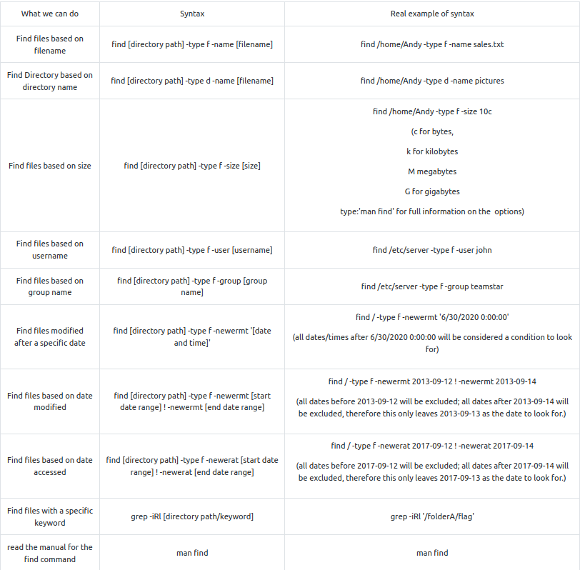
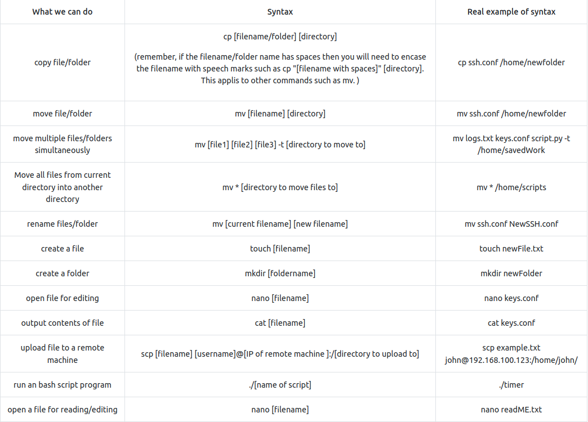
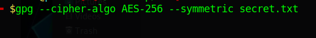
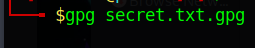

# [Linux Strength Training](https://tryhackme.com/room/linuxstrengthtraining)

## Finding a way around linux



### Questions

1. What is the correct option for finding files based on group

R: -group

2. What is format for finding a file with the user named Francis and with a size of 52 kilobytes in the directory /home/francis/

R: find /home/francis -type f user Francis -size 52k

3. SSH as topson using his password topson. Go to the /home/topson/chatlogs directory and type the following: grep -iRl 'keyword'. What is the name of the file that you found using this command?

R: 2019-10-11

4. What are the characters subsequent to the word you found?

R: ttitor

5. Read the file named 'ReadMeIfStuck.txt'. What is the Flag?

R: had to find a file called additionalHint which I did by enering the command:

```bash
find . -type f -name additionalHINT
```

- The output: "try to find a directory called telephone numbers... Oh wait.. it  contains a space.. I wonder how we can find that...."

```bash
find . -type d -name "telephone numbers"
```
- Output: use the Find command to find a file with a modified date of 2016-09-12 from the /workflows directory


```bash
find /home/topson/workflows -type f -newermt 2016-09-11 ! -newermt 2016-09-12
```
/home/topson/workflows/xft/eBQRhHvx

volFlag{81726350827fe53g}

## Working with files



- Move mulltiple files into a directory:

```bash
mv [file1] [file2] [file3] -t [directory to move to]
```

- A few additional things to remember is that occasionally you may encounter files/folders with special characters such as - (dash). Just remember that if you try to copy or move these files you will encounter errors because Linux interprets the - as a type of argument, therefore you will have to place -- just before the filename. For example: 

```bash
cp -- -filename.txt /home/folderExample.
```

### Questions

1. Hypothetically, you find yourself in a directory with many files and want to move all these files to the directory of /home/francis/logs. What is the correct command to do this?

R: mv * /home/francis/logs

2. Hypothetically, you want to transfer a file from your /home/james/Desktop/ with the name script.py to the remote machine (192.168.10.5) directory of /home/john/scripts using the username of john. What would be the full command to do this?

R: scp /home/james/Desktop/script.py john@192.168.10.5:/home/john/scripts

3. How would you rename a folder named -logs to -newlogs

R: mv -- -logs -- -newlogs

4. How would you copy the file named encryption keys to the directory of /home/john/logs

R: mv "encryption keys" /home/john/logs

5. Find a file named readME_hint.txt inside topson's directory and read it. Using the instructions it gives you, get the second flag.

```bash
cd -- -march\ folder/
./-runME.sh
```

## Hashing

- Hash Craking using John The Ripper example:


- Hash identifier tool (hash-identifier or a modern alternative: [haiti](https://github.com/noraj/haiti):


### Questions

1.  Download the hash file attached to this task and attempt to crack the MD5 hash. What is the password?

```bash
cat hash1.txt | hash-identifier # md5
john --format=raw-md5 --wordlist=rockyou.txt hash1.txt
```
R: secret123

2. SSH as sarah using: sarah@[10.10.78.207] and use the password: rainbowtree1230x

What is the hash type stored in the file hashA.txt

```bash
find -type f -name hashA.txt # ./system AB/server_mail/server settings/hashA.txt -> f9d4049dd6a4dc35d40e5265954b2a46
```

R: md4

3. Crack hashA.txt using john the ripper, what is the password?

```bash
john --format=raw-md4 --wordlist=rockyou.txt hash1.txt
```
R: admin

4. What is the hash type stored in the file hashB.txt


```bash
find -type f -name hashB.txt # /oldLogs/settings/craft/hashB.txt -> b7a875fc1ea228b9061041b7cec4bd3c52ab3ce3
hash-identifier b7a875fc1ea228b9061041b7cec4bd3c52ab3ce3 # -> SHA-1
```
R: SHA-1

5. Find a wordlist  with the file extention of '.mnf' and use it to crack the hash with the filename hashC.txt. What is the password?

```bash
john --format=Raw-SHA256 --wordlist=ww.mnf hash1.txt
```
R: unacvaolipatnuggi

6. Crack hashB.txt using john the ripper, what is the password?

```bash
john --format=Raw-SHA1-AxCrypt --wordlist=rockyou.txt hash1.txt
```
R: letmein

## Base64

SOME THEORY

   - Encoding is for maintaining data usability and can be reversed by employing the same algorithm that encoded the content, i.e. no key is used.
   - Encryption is for maintaining data confidentiality and requires the use of a key (kept secret) in order to return to plaintext.
   - Hashing is for validating the integrity of content by detecting all modification thereof via obvious changes to the hash output.
   - Obfuscation is used to prevent people from understanding the meaning of something, and is often used with computer code to help prevent successful reverse engineering and/or theft of a product’s functionality.

 2. Special Answer

```bash
john --show --format=Raw-MD4 hash1.txt
```

 R: john

 ## Encryption with gpg

- Encrypt:

 

 - Decrypt:



### Questions

1. You wish to encrypt a file called history_logs.txt using the AES-128 scheme. What is the full command to do this?

R: gpg --cipher-algo AES-128 --symmetric history_logs.txt

2. What is the command to decrypt the file you just encrypted?

R: gpg history_logs.txt.gpg

## Cracking encrypted gpg files

-  you are using Kali linux or Parrot OS, you should have a binary add on called *gpg2john*.

- This binary program allows us to convert the gpg file into a hash string that john the ripper can understand when it comes to brute-forcing the password against a wordlist. 

- Next, type the following command below to generate the hash for John the Ripper:

```bash
gpg2john [encrypted gpg file] > [filename of the hash you want to create]
```


### Questions

1. Find an encrypted file called personal.txt.gpg and find a wordlist called data.txt. Use tac to reverse the wordlist before brute-forcing it against the encrypted file. What is the password to the encrypted file?

```bash
gpg2john personal.txt.gpg > gpg_hash
john --format=gpg --wordlist=wordlist gpg_hash
```
R: valamanezivonia

## Reading SQL Databases

- Reading a sql database of a local mysql workspace:

```bash
service mysql start
```

- Connect to a remote SQL database:

```bash
mysql -u [username] -p -h [host ip]
mysql -u [username] -p # or this on local machine
```

- Open SQL database file locally:

- To open mysql file/files locally, simply change to the directory of the mysql file and type mysql as shown below. You'll be taken to a specialised command prompt for mysql. 

- Note: In some cases you may have to run mysql -p [password] if the mysql system was configured to require authenticiation.

- Load a database:

```sql
source employees.sql
```

- See all relational databases:

```sql
SHOW DATABASES;
```

- Use a database:

```sql
USE employees;
```

- Display tables:


```sql
SHOW TABLES;
```

- Table structure:


```mysql
DESCRIBE employees;
```

### Questions

1. Find a file called employees.sql and read the SQL database. (Sarah and Sameer can log both into mysql using the password: password). Find the flag contained in one of the tables. What is the flag?

mysql -u sarah -p
show databases;
source employees;
use employees;
describe employees;
SELECT * FROM employees WHERE first_name='Lobel';

R:Flag{13490AB8}

## Final challenge

- Used the log files to get the ssh password for Sameer:
   - thegreatestpasswordever000

- Found the 50M conf file which I opened with less:
```
Wordlist directory: aG9tZS9zYW1lZXIvSGlzdG9yeSBMQi9sYWJtaW5kL2xhdGVzdEJ1aWxkL2NvbmZpZ0JEQgo= 
# home/sameer/History LB/labmind/latestBuild/configBDB
```

- From the logs, I know the password starts with "ebq":

```bash
grep -iRl "^ebq" 
# it returned 3 files: pLmjwi LmqAQl Ulpsmt
```

- Made one file from all 3 with possible passwords that started with ebq:

```bash
grep '^ebq' pLmjwi > newfile
grep '^ebq' LmqAQl >> newfile
grep '^ebq' Ulpsmt >> newfile
```

- Transfered the file using a python http server (although I could have used *scp* !!) to download the gpg file to my computer:

```bash
scp sameer@<IP>:/home/shared/sql/2020-08-13.zip.gpg .
```

- Ran gpg2john but it did not work as the file was too big. I used a [[crackgpg.sh.md|script]] found online that does that and used it to find the password:


```bash
./crackgpg.sh 2020-08-13.zip.gpg gpgwordlist # ebqattle
```

- Opened the sql database employees.sql using sarah's credentials from an earlier task (pw: password) and ran the following sql query:

```sql
select * from employees where first_name = 'James' -- last_name: vuimaxcullings
```

- Then:

```bash
su james # vuimaxcullings
su -i 
cat root.txt # Flag{6$8$hyJSJ3KDJ3881}
```