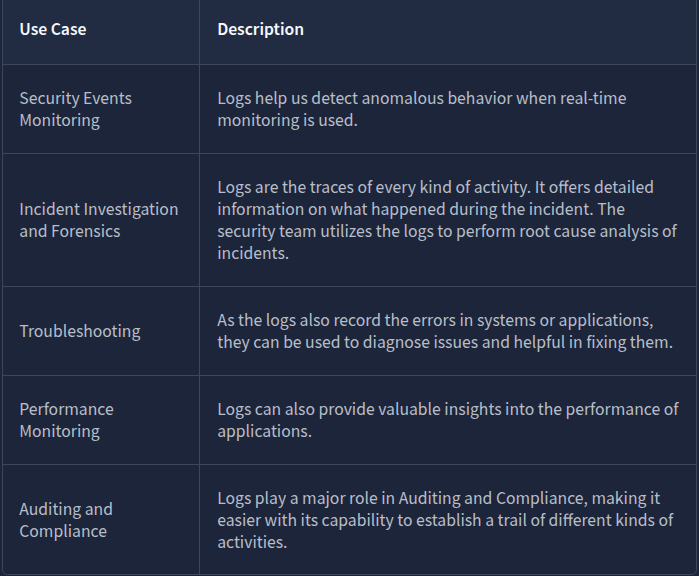
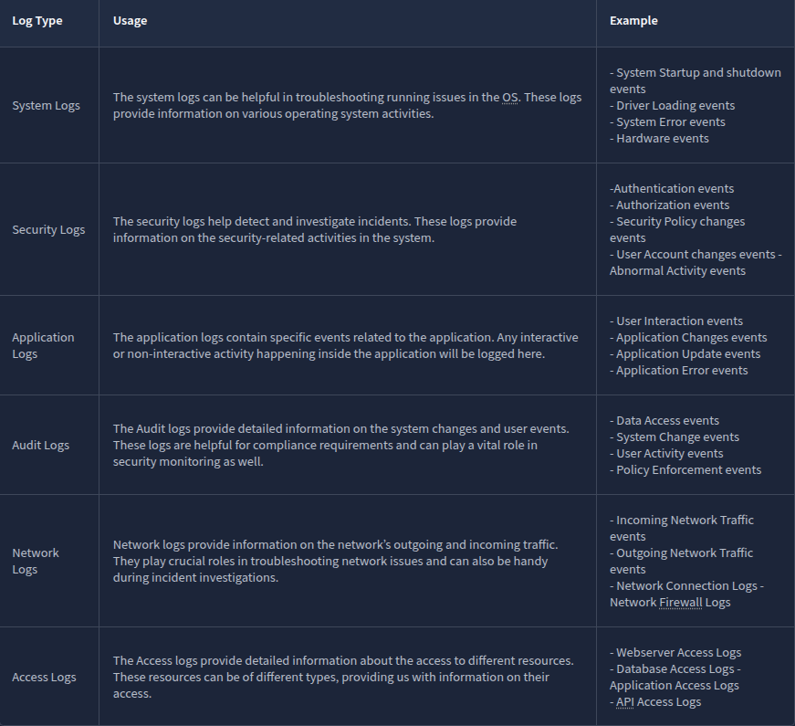
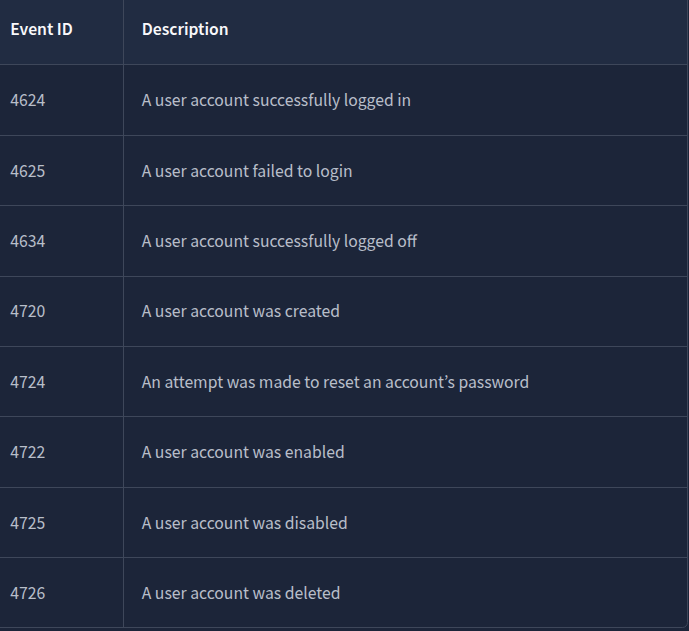
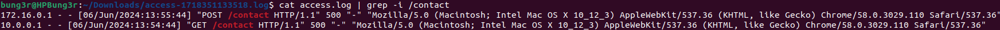
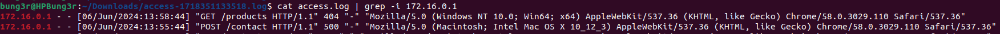

# [Logs Fundamentals](https://tryhackme.com/room/logsfundamentals)

## Intro to Logs

Attackers are clever. They avoid leaving maximum traces on the victim’s side to avoid detection. Yet, the security team successfully determines how the attack was executed and is even sometimes successful in finding who was behind the attack.

Suppose a few policemen are investigating the disappearance of a precious locket in a snowy jungle cabin. They observed that the wooden door of the cabin was brutally damaged, and the ceiling collapsed. There were some footprints on the snowy path to that cabin. Lastly, they discovered some CCTV footage from a neighbouring residence. By placing together all these traces, the police successfully determined who was behind the attack. Various traces are found in several such cases; putting all these together takes you closer to the criminal.



### Questions

Where can we find the majority of attack traces in a digital system?

A: `logs`

## Types of logs

Imagine you have to investigate an issue in a system through the logs; you open the log file of that system, and now you are lost after seeing numerous events of different categories.

Here is the solution: Logs are segregated into multiple categories according to the type of information they provide. So now you just need to look into the specific log file for which the issue relates.

For example, you need to investigate the successful logins from yesterday at a specific timeframe in Windows OS. Instead of looking into all the logs, you only need to see the system’s **Security Logs** to find the login information. We also have other types of logs that are useful in investigating different incidents.



Log Analysis is a technique for extracting valuable data from logs. It involves looking for any signs of abnormal or unusual activities. Searching for a specific activity or abnormalities in the logs with the naked eye is impossible. For this reason, we have several manual and automated techniques for log analysis.

### Questions

Which type of logs contain information regarding the incoming and outgoing traffic in the network?

A: `Network Logs`

Which type of logs contain the authentication and authorization events?

A: `Security Logs`

## Windows Event Logs Analysis

Like other operating systems, Windows OS also logs many of the activities that take place. These are stored in segregated log files, each with a specific log category. Some of the crucial types of logs stored in a Windows Operating System are:

- **Application:** There are many applications running on the operating system. Any information related to those applications is logged into this file. This information includes errors, warnings, compatibility issues, etc.
- **System:** The operating system itself has different running operations. Any information related to these operations is logged in the System log file. This information includes driver issues, hardware issues, system startup and shutdown information, services information, etc.
- **Security:** This is the most important log file in Windows OS in terms of security. It logs all security-related activities, including user authentication, changes in user accounts, security policy changes, etc.

Besides these, several other log files in the Windows operating system are designed for logging activities related to specific actions and applications.

Unlike other log files studied in the previous tasks, which had no built-in application to view them, Windows OS has a utility known as Event Viewer, which gives a nice graphical user interface to view and search for anything in these logs.

This is how a Windows event log looks. It has different fields. The major fields are discussed below:

- **Description:** This field has a detailed information of the activity.
- **Log Name:** The Log Name indicates the log file name.
- **Logged:** This field indicates the time of the activity.
- **Event ID:** Event IDs are unique identifiers for a specific activity

Numerous event IDs are available in Windows event logs. We can use these event IDs to search for any specific activity. For example, event ID 4624 uniquely identifies the activity of a successful login, so you only need to search for this event ID 4624 when investigating successful logins.



### Questions

What is the name of the last user account created on this system?

Filtered the logs after the Event ID `4720`. Double clicked on the last one and scrolled a bit to get the account name.

A: `hacked`

Which user account created the above account?

A: `administrator`

On what date was this user account enabled? Format: M/D/YYYY

A: `6/7/2024`

Did this account undergo a password reset as well? Format: Yes/No

A: `yes`

## Web Server Access Logs Analysis

Sometimes, we just want to view the website, and sometimes, we want to log in or upload a file into any available input field. These are just different kinds of requests we make to a website. All these requests are logged by the website and stored in a log file on the web server running that website.

This log file contains all the requests made to the website along with the information on the timeframe, the IP requested, the request type, and the URL. Following are the fields taken from a sample log from an Apache web server access log file which can be found in the directory: /var/log/apache2/access.log  

- **IP Address:** “172.16.0.1” - The IP address of the user who made the request.
    
- **Timestamp:** “[06/Jun/2024:13:58:44]” - The time when the request was made to the website.
    
- **Request:** The request details.
    
    - **HTTP Method:** “GET” - Tells the website what action to be performed on the request.
    - **URL:** “/” - The requested resource.
- **Status Code:** “200” - The response from the server. Different numbers indicate different response results.
    
- **User-Agent:** “Mozilla/5.0 (Macintosh; Intel Mac OS X 10_12_3) AppleWebKit/537.36 (KHTML, like Gecko) Chrome/58.0.3029.110 Safari/537.36” - Information about the user’s Operating System, browser, etc. when making the request.
    
We can perform manual log analysis by using some command line utilities in the Linux operating system.

`cat` is a popular utility for displaying the contents of a text file. We can use the cat command to display the contents of a log file, as they are typically in the text format.

Most systems rotate the logs regularly. This rotation helps them create individual log files for specific timeframes and not carry them all in a single log file. But sometimes, we may need to combine two log files. The cat command-line utility can also be helpful in this case. We can combine the results of multiple files within one single file, as shown below.

```shell-session
cat access1.log access2.log > combined_access.log
```

`grep` is a very useful command line utility that allows you to search for strings and patterns inside a log file.

The `less` command is helpful for handling multiple log files.

Use `spacebar` to move to the next page and `b` to the previous page.

After running this command, the logs would be displayed in pages, one after one, making it easy for manual analysis. If you wish to search for something in the logs, you can type `/` followed by the pattern you are searching for and hit enter. 

Use `n` to navigate to the next occurrence of your search and `N` to navigate to the previous occurrence of your search.

### Questions

What is the IP which made the last GET request to URL: “/contact”?  



A: `10.0.0.1`

When was the last POST request made by IP: “172.16.0.1”? 



A: `06/Jun/2024:13:55:44`

Based on the answer from question number 2, to which URL was the POST request made?

A: `/contact`