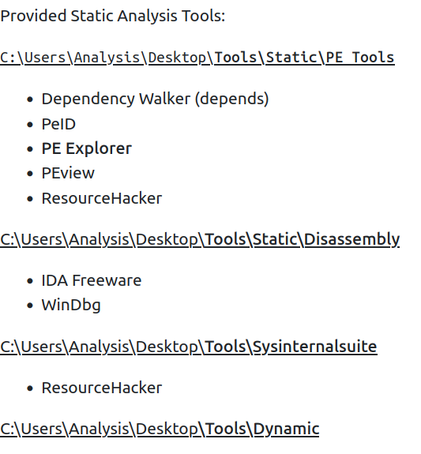
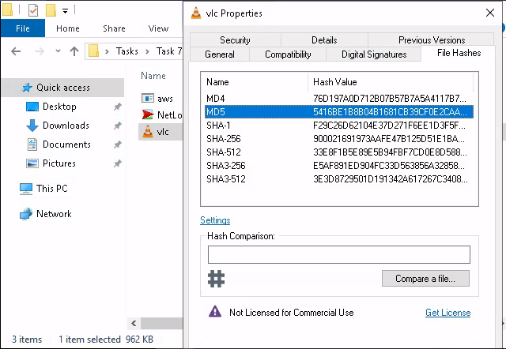
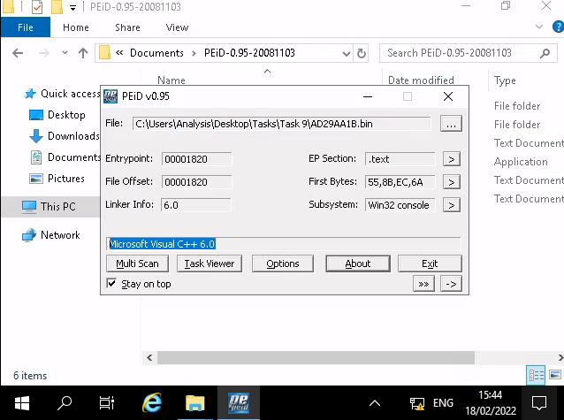
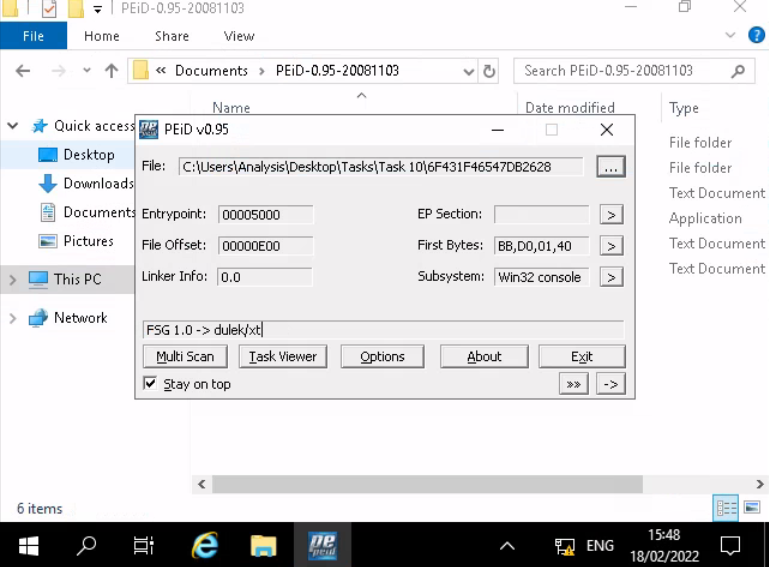
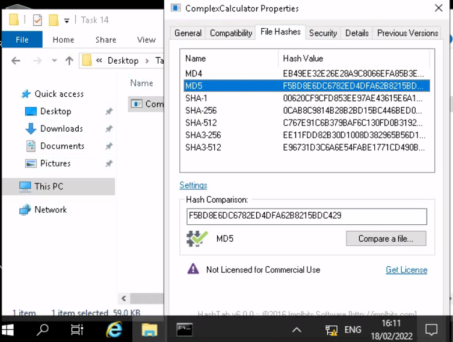
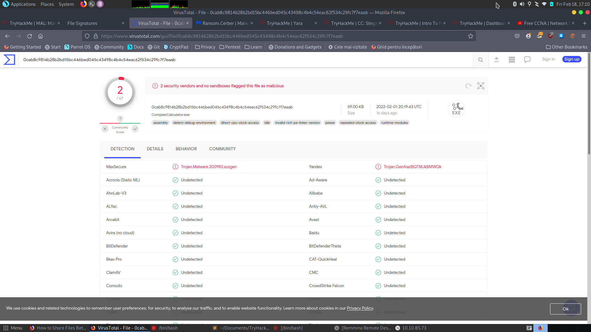
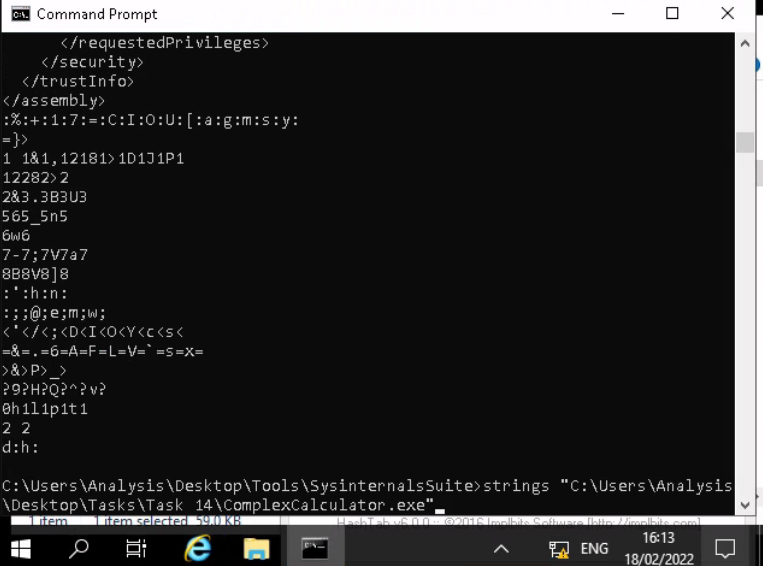
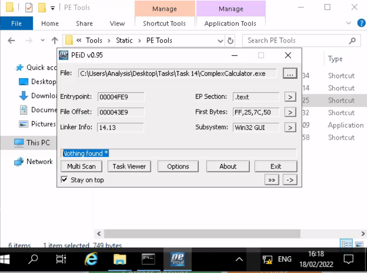

# [Malware Introductory](https://tryhackme.com/room/malmalintroductory)

- list of file signatures: https://www.garykessler.net/library/file_sigs.html

## Purpose

- important to consider:

	- *Point of Entry* (PoE)

	- What are the indicators that malware has even been executed on a machine? Are there any files, processes, or perhaps any attempt of "un-ordinary" communication?

	- How does the malware perform? Does it attempt to infect other devices? Does it encrypt files or install anything like a backdoor / Remote Access Tool (RAT)?

	- Most importantly - can we ultimately prevent and/or detect further infection?!

## Malware Campaigns

- two type of attacks:

	- **Targeted**: *[DarkHotel](https://www.kaspersky.co.uk/resource-center/threats/darkhotel-malware-virus-threat-definition)* - used to steal authentication details from government officials

	- **Mass Campaign**

		- Comapnies such as Kaspersky tracks these campaigns (e.g: [Crouching Yeti](https://www.kaspersky.co.uk/resource-center/threats/crouching-yeti-energetic-bear-malware-threat))

### Questions

1. What is the famous example of a targeted attack-esque Malware that targeted Iran?

A: Stuxnet

2. What is the name of the Ransomware that used the Eternalblue exploit in a "Mass Campaign" attack?

A: WannaCry

## Identifying if a Malware Attack has Happened

- Fortunately, malware is largely **obtrusive** -> they leave quite a significant trail of evidence.

- Malware Attack steps:

	1. *Delivery*
	2. *Execution*
	3. *Maintaining pesistence* (not always)
	4. *Propagation* (not always)

### Delivery

- through USB (Stuxnet), PDF attachments (Phishing) or vulnerability enumeration

### Execution

- the main part of how we classify a Malware.

	- if it encrypts data => Ransomware
	- records keystrokes => Spyware

- we can only understand this stage by analysing the sample.

### Maintaining Persistence

- [Cerber](https://blog.malwarebytes.com/detections/ransom-cerber/)

- imagine you are infected with a keylogger but then you restart the computer and hence the information recorded provides no use to the attacker.

### Persistance

- This stage is largely why Malware is so "noisy", Malware employs many techniques, of which we'll be covering in-depth much later on. Essentially, this stage is just to make sure that the "execution" is worth its while.

### Propagation

- Hey...If you can infect one device, why not infect more whilst you're at it? Again, this is another reason why Malware can be so noticeable. Host discovery generates a lot of network traffic, we'll come to this later.

- two categories of *fingerprints* that the malware may leave behind on the host:

	- **Host-Based Signatures** -> results of execution and persistance performed by the malware (encrypted files, installed software)

	- **Network-Based Signatures** -> network communication of the malware during delivery, execution and propagation (for ransomware: what did the Malware contacted for Bitcoin payment?)

### Questions

1. Name the first essential step of a Malware Attack?

A: Delivery

2. Now name the second essential step of a Malware Attack?

A: Execution

3. What type of signature is used to classify remnants of infection on a host?

A: Host-Based Signature

4. What is the name of the other classification of signature used after a Malware attack?

A: Network-Based Signature

## Static vs Dynamic Analysis

- we can analyze a Malware sample in two ways:

	- *Static Analysis*

	- *Dynamic Analysis*

### Static Analysis

- a very high level abstraction of the sample by just analysing the malware as it presents itself, without actually executing the code

	- *signature analysis via checksums*

### Dynamic Analysis

- this implies executing the code and observe what happens

- it is very risky, as it may compromise your computer and potentially the entire network.

## Provided Tools and their Uses

- Provided static Tools:

!! Connecting to machine via RDP client **Remmina** !!

## Obtaining MD5 Checksums 

- md5 checksums represnt the cryptographic "fingerprints" of the files 

	- they allow proper identification of the malware

### Questions

1. The MD5 Checksum of aws.exe 

A: D2778164EF643BA8F44CC202EC7EF157

2. The MD5 Checksum of Netlogo.exe

A: 59CB421172A89E1E16C11A428326952C

3. The MD5 Checksum of vlc.exe

A: 5416BE1B8B04B1681CB39CF0E2CAAD9F

## Chech if the MD5 Checksums have been analysed before

- check on [VirusTotal](https://www.virustotal.com/gui/home/search)

### Questions

1. Does Virustotal report this MD5 Checksum / file aws.exe as malicious? (Yay/Nay)

A: Nay

2. Does Virustotal report this MD5 Checksum / file Netlogo.exe as malicious? (Yay/Nay)

A: Nay

3. Does Virustotal report this MD5 Checksum / file vlc.exe as malicious? (Yay/Nay)

A: Nay

## Identifying if the Executables ar obfuscated / packed

- PeID can identify the compiler used to compile a file.

- if a file does not have a .exe extension, that does not mean it cannot execute code

	- a file with the extension.jpg can do that for instance

- the hex value for an executable is always **4D 5A**.

### Questions

1. What does PeID propose 1DE9176AD682FF.dll being packed with?

A: Microsoft Visual C++ 6.0 DLL

2. What does PeID propose AD29AA1B.bin being packed with?

A: Microsoft Visual C++ 6.0

## What is Obfuscation / Packing?

- Packing is one form of obfuscation that malware Authors employ to prevent the analysis of programmes.

	- There are both legitimate and malicious reasons as to why the Author of a program will want to prevent the decompiling of their program. 

- In the same token, just because you write a program...Why should everyone have the right to "copy" your project? 

	- This is one of the justifiable reasons for obfuscation - it is yours at the end of the day! 

- However, malware Authors employ obfuscation techniques such as packing - whilst for the same reasons, they do so **with the intent to prevent people like us reversing it to understand its behaviours and ultimately with the aims of achieving infection**.

### Questions

- Your task is to identify whether or not the file "6F431F46547DB2628" located in the Directory of "Tasks\Task 10" is packed using the tool "PeID" akin to the task you just completed!

1. What packer does PeID report file "6F431F46547DB2628" to be packed with?

A: FSG 1.0 -> dulek/xt

## Introduction To Strings

- the ASCII / text contents of a program

### Questions

1. What is the URL that is outputted after using "strings"

A: practicalmalwareanalysis.com

2. How many unique "Imports" are there?

A: 5

## Intro to Imports

- classifications tools:
	
	- Disassemblers -> reverse the compiled code of a program from machine code to human-readable instructions (assembly)

	- Debuggers -> facilitate execution of the program - where the analyser can view the changes made throughout each "step" of the program.

### Questions 

1. How many references are there to the library "msi" in the "Imports" tab of IDA Freeware for "install.exe" 

A: 9

## Practical

1. What is the MD5 Checksum of the file?

A: F5BD8E6DC6782ED4DFA62B8215BDC429

2. Does Virustotal report this file as malicious? (Yay/Nay)

A: Yay

- Output the strings using Sysinternals "strings" tool.

3. What is the last string outputted?

A: d:h:

4. What is the output of PeID when trying to detect what packer is used by the file?

A: Nothing found * 