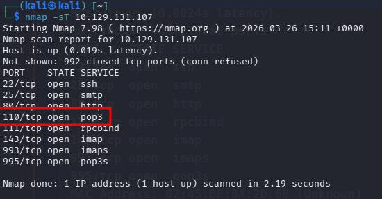
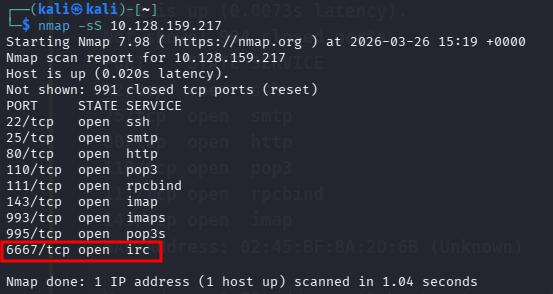
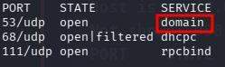

# [Nmap Basic Port Scans](https://tryhackme.com/room/nmap02)

## TCP and UDP Ports

A TCP port or UDP port id use dot identify a network service running on that host. A server provides the network service, an dit adheres to a specific network protocol. 

Examples: providing time, responding to DNS queries, serving web pages.

A port is usually linked to a service using that specific port number. Examples: an HTTP server binds to TCP port 80 by default. Furthermore, no more than one service can listen on any TCP or UDP port, on the same IP address.

At the risk of oversimplification, we can classify ports in two states:

1. Open port indicates that there is some service listening on that port.
2. Closed port indicates that there is no service listening on that port.

However, in practical situations, we need to consider the impact of firewalls. For instance, a port might be open, but a firewall might be blocking the packets. Therefore, Nmap considers the following six states:

1. **Open**: indicates that a service is listening on the specified port.
2. **Closed**: indicates that no service is listening on the specified port, although the port is accessible. By accessible, we mean that it is reachable and is not blocked by a firewall or other security appliances/programs.
3. **Filtered**: Nmap cannot determine if the port is open or closed because the port is not accessible. This is usually due to a firewall preventing Nmap from reaching that port. Nmap's packets may be blocked from reaching the port; alternatively, the responses are blocked from reaching Nmap's host.
4. **Unfiltered**: Nmap can't determine if the port is open or closed, although the port is accessible. This state is encountered when using an ACK scan `-sA`.
5. **Open|Filtered**: Nmap cannot determine whether the port is open or filtered.
6. **Closed|Filtered**: Nmap cannot decide whether a port is closed or filtered.
### Questions

Q: Which service uses UDP port 53 by default?

A: `DNS`

Q: Which service uses TCP port 22 by default?

A: `SSH`

Q: How many port states does Nmap consider?

A: `6`

Q: Which port state is the most interesting to discover as a pentester?

A: `Open`

## TCP Flags

Nmap supports different types of TCP port scans.

The TCP header is the first 24 bytes of a TCP segment:

This is defined in [RFC 793](https://datatracker.ietf.org/doc/html/rfc793.html).

We can see that the port number is allocated 16 bits (2 bytes). In the second and third rows, we have the sequence number and the acknowledgement number. Each row has 32 bits (4 bytes) allocated, with six rows total, making up 24 bytes.

The flags that Nmap can set or unset are highlighted in red:

1. **URG**: Urgent flag indicates that the urgent pointer filed is significant. The urgent pointer indicates that the incoming data is urgent, and that a TCP segment with the URG flag set is processed immediately without consideration of having to wait on previously sent TCP segments.
2. **ACK**: Acknowledgement flag indicates that the acknowledgement number is significant. It is used to acknowledge the receipt of a TCP segment.
3. **PSH**: Push flag asking TCP to pass the data to the application promptly.
4. **RST**: Reset flag is used to reset the connection. Another device, such as a firewall, might send it to tear a TCP connection. This flag is also used when data is sent to a host and there is no service on the receiving end to answer.
5. **SYN**: Synchronize flag is used to initiate a TCP 3-way handshake and synchronize sequence numbers with the other host. The sequence number should be set randomly during TCP connection establishment.
- **FIN**: The sender has no more data to send.
### Questions

Q: What 3 letters represent the Reset flag?

A: `RST`

Q: Which flag needs to be set when you initiate a TCP connection (first packet of TCP 3-way handshake)?

A: `SYN`

## TCP Connect Scan

TCP connect scan works by completing the TCP 3-way handshake: the client sends a TCP packet with SYN flag set, and the server responds with SYN/ACK if the port is open. Finally, the client completes the 3-way handshake by sending an ACK.

We are interested in learning whether the TCP port is open, not establishing a TCP connection. Hence the connection is torn as soon as its state is confirmed by sending a RST/ACK. You can choose to run a TCP connect scan using `-sT`.

It is important to note that if you are not a privileged user (root or sudoer), a TCP connect scan is the only possible option to discover open TCP ports.

A closed TCP port responds to a SYN packet with RST/ACK to indicate that it is not open.

Nmap scans the most common 1000 ports by default. We can use `-F` to enable fast mode and decrease the number of scanned ports from 1000 to 100 most common ports. We can also use the `-r` option to scan the ports in consecutive order instead of random order. This option is useful when testing whether ports open in a consistent manner, for instance, when a target boots up.
### Questions

Q: Launch the VM. Open the AttackBox and execute nmap -sT MACHINE_IP via the terminal. A new service has been installed on this VM since our last scan, as shown in the terminal window above. Which port number was closed in the scan above but is now open on this target VM?

A: `110`

Q: What is Nmap’s guess about the newly installed service?

A: `pop3`

## TCP SYN Scan

Unprivileged users are limited to connect scan. However, the default scan mode is SYN scan, and it requires a privileged (root or sudoer) user to run it. SYN scan does not need to complete the TCP handshake, but it tears down the connection once it receives a response from the server. Since we did not establish a connection, this decreases the chances the scan gets logged. We can select this scan by running the flag `-sS`.

### Questions

Q: Launch the VM. Some new server software has been installed since the last time we scanned it. On the AttackBox, use the terminal to execute nmap -sS MACHINE_IP. What is the new open port?

A: `6667`

Q: What is Nmap’s guess of the service name?

A: `IRC`

## UDP Scan

UDP is a connectionless protocol, and hence it does not require any handshake for connection establishment. We cannot guarantee that a service listening on a UDP port would respond to our packets. However, if a packet is sent to a closed port, an ICMP port unreachable error (type 3, code 3) is returned. You can select the UDP scan using the `-sU` option; moreover, you can combine it with another TCP scan.

Sending a UDP packet to an open port won’t tell us anything. However, if the port is closed, we expect to receive an ICMP packet of type 3, destination unreachable, and code 3, port unreachable. Thus, the UDP ports that don’t generate any response are the ones that Nmap will state as open.

### Questions

Q: Launch the VM. On the AttackBox, use the terminal to execute nmap -sU -F -v MACHINE_IP. A new service has been installed since the last scan. What is the UDP port that is now open?

]

A: `53`

Q: What is the service name according to Nmap?

A: `domain`

## Fine-Tuning Scope and Performance

You can specify the ports you want to scan instead of the default 1000 ports:

- port list: `-p22,80,443` will scan ports 22, 80 and 443.
- port range: `-p1-1023` will scan all ports between 1 and 1023 inclusive.

You can request the scan of all ports by using `-p-`, which will scan all 65535 ports. If you want to scan the most common 100 ports, add `-F`. Using `--top-ports 10` will check the ten most common ports.

You can control the scan timing using `-T<0-5>`. `-T0` is the slowest (paranoid), while `-T5` is the fastest. According to Nmap manual page, there are six templates:

- paranoid (0)
- sneaky (1)
- polite (2)
- normal (3)
- aggressive (4)
- insane (5)

To avoid IDS alerts, you might consider `-T0` or `-T1`. For instance, `-T0` scans one port at a time and waits 5 minutes between sending each probe, so you can guess how long scanning one target would take to finish. If you don’t specify any timing, Nmap uses normal `-T3`. Note that `-T5` is the most aggressive in terms of speed; however, this can affect the accuracy of the scan results due to the increased likelihood of packet loss. Note that `-T4` is often used during CTFs and when learning to scan on practice targets, whereas `-T1` is often used during real engagements where stealth is more important.

Alternatively, you can choose to control the packet rate using `--min-rate <number>` and `--max-rate <number>`. For example, `--max-rate 10` or `--max-rate=10` ensures that your scanner is not sending more than ten packets per second.

Moreover, you can control probing parallelization using `--min-parallelism <numprobes>` and `--max-parallelism <numprobes>`. Nmap probes the targets to discover which hosts are live and which ports are open; probing parallelization specifies the number of such probes that can be run in parallel. For instance, `--min-parallelism=512` pushes Nmap to maintain at least 512 probes in parallel; these 512 probes are related to host discovery and open ports.

### Questions

Q: What is the option to scan all the TCP ports between 5000 and 5500?

A: `-p5000-5500`

Q: How can you ensure that Nmap will run at least 64 probes in parallel?

A: `--min-parallelism=64`

Q: What option would you add to make Nmap very slow and paranoid?

A: `-T0`

## Summary

| Port Scan Type | Example Command            |
| -------------- | -------------------------- |
| Connect Scan   | `nmap -sT MACHINE_IP`      |
| TCP SYN Scan   | `sudo nmap -sS MACHINE_IP` |
| UDP Scan       | `sudo nmap -sU MACHINE_IP` |

|Option|Purpose|
|---|---|
|`-p-`|all ports|
|`-p1-1023`|scan ports 1 to 1023|
|`-F`|100 most common ports|
|`-r`|scan ports in consecutive order|
|`-T<0-5>`|-T0 being the slowest and T5 the fastest|
|`--max-rate 50`|rate <= 50 packets/sec|
|`--min-rate 15`|rate >= 15 packets/sec|
|`--min-parallelism 100`|at least 100 probes in parallel|

