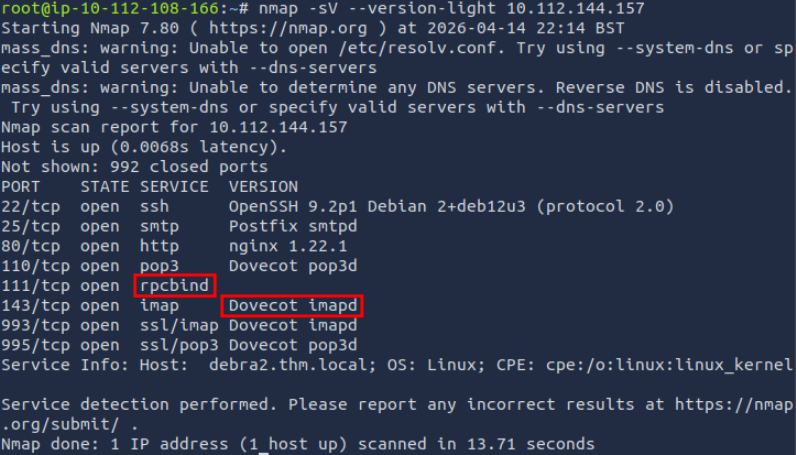
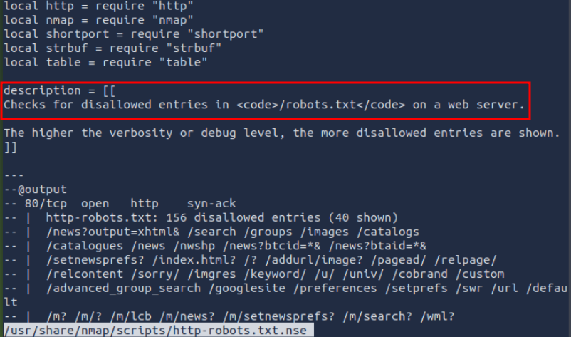
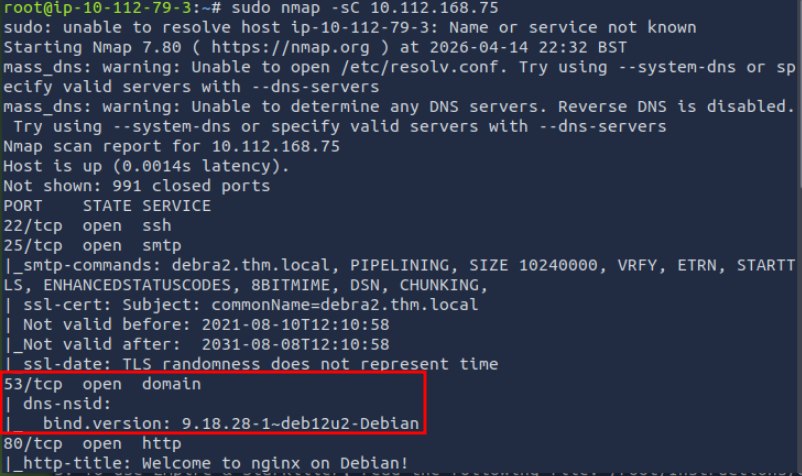
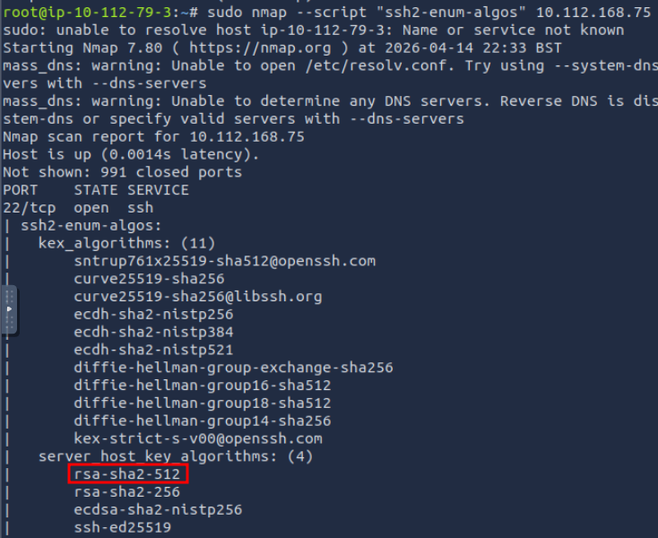
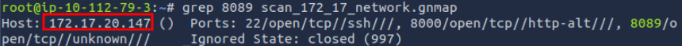

# [Nmap Post Port Scans](https://tryhackme.com/room/nmap04)

## Service Detection

Once Nmap discovers open ports, you can probe the available port to detect the running service.

Adding `-sV` to your Nmap command will collect and determine service and version information for the open ports. You can control the intensity with `--version-intensity LEVEL` where the level ranges between 0, the lightest, and 9, the most complete. `-sV --version-light` has an intensity of 2, while `-sV --version-all` has an intensity of 9.

It is important to note that using `-sV` will force Nmap to proceed with the TCP 3-way handshake and establish the connection. The connection establishment is necessary because Nmap cannot discover the version without establishing a connection fully and communicating with the listening service. In other words, stealth SYN scan `-sS` is not possible when `-sV` option is chosen.

Unlike the *service* column, the *version* column is not a guess.

You need `sudo` privileges to perform this.

### Questions

Q: Start the target machine for this task and launch the AttackBox. Run nmap -sV --version-light MACHINE_IPvia the AttackBox. What is the detected version for port 143?

A: `Dovecot imapd`

Q: Which service did not have a version detected with --version-light?

A: `rpcbind`

## OS Detection and Traceroute

### OS Detection

Nmap can detect the Operating System (OS) based on its behaviour and any telltale signs in its responses. OS detection can be enabled using `-O`;

The OS detection is very convenient, but many factors might affect its accuracy. First and foremost, Nmap needs to find at least one open and one closed port on the target to make a reliable guess. Furthermore, the guest OS fingerprints might get distorted due to the rising use of virtualization and similar technologies. Therefore, always take the OS version with a grain of salt.

### Traceroute

If you want Nmap to find the routers between you and the target, just add `--traceroute`.

Note that Nmap’s traceroute works slightly different than the `traceroute` command found on Linux and macOS or `tracert` found on MS Windows. Standard `traceroute` starts with a packet of low TTL (Time to Live) and keeps increasing until it reaches the target. Nmap’s traceroute starts with a packet of high TTL and keeps decreasing it.

It is worth mentioning that many routers are configured not to send ICMP Time-to-Live exceeded, which would prevent us from discovering their IP addresses.

### Questions

Q: Run nmap with -O option against MACHINE_IP. What OS did Nmap detect?

A: `Linux`

## Nmap Scripting Engine (NSE)

A script is a piece of code that does not need to be compiled.

Scripts make it possible to add custom functionality that did not exist via the built-in commands. Similarly, Nmap provides support for scripts using the Lua language. A part of Nmap, Nmap Scripting Engine (NSE) is a Lua interpreter that allows Nmap to execute Nmap scripts written in Lua language.

 You can choose to run the scripts in the default category using `--script=default` or simply adding `-sC`. In addition to [default(opens in new tab)](https://nmap.org/nsedoc/categories/default.html), categories include auth, broadcast, brute, default, discovery, dos, exploit, external, fuzzer, intrusive, malware, safe, version, and vuln. A brief description is shown in the following table.

|Script Category|Description|
|---|---|
|`auth`|Authentication related scripts|
|`broadcast`|Discover hosts by sending broadcast messages|
|`brute`|Performs brute-force password auditing against logins|
|`default`|Default scripts, same as `-sC`|
|`discovery`|Retrieve accessible information, such as database tables and DNS names|
|`dos`|Detects servers vulnerable to Denial of Service (DoS)|
|`exploit`|Attempts to exploit various vulnerable services|
|`external`|Checks using a third-party service, such as Geoplugin and Virustotal|
|`fuzzer`|Launch fuzzing attacks|
|`intrusive`|Intrusive scripts such as brute-force attacks and exploitation|
|`malware`|Scans for backdoors|
|`safe`|Safe scripts that won’t crash the target|
|`version`|Retrieve service versions|
|`vuln`|Checks for vulnerabilities or exploit vulnerable services|

You can also specify the script by name using `--script "SCRIPT-NAME"` or a pattern such as `--script "ftp*"`, which would include `ftp-brute`. If you are unsure what a script does, you can open the script file with a text reader, such as `less`, or a text editor.

### Questions

Q: Knowing that Nmap scripts are saved in /usr/share/nmap/scripts on the AttackBox. What does the script http-robots.txt check for?

A: `disallowed entries`

Q: Can you figure out the name for the script that checks for the remote code execution vulnerability MS15-034 (CVE2015-1635)?

Just look through the `http-*` scripts.

A: `http-vuln-cve2015-1635.nse`

Q: Launch the AttackBox if you haven't already. After you ensure you have terminated the VM from Task 2, start the target machine for this task. On the AttackBox, run Nmap with the default scripts -sC against MACHINE_IP. You will notice that there is a service listening on port 53. What is its full version value?

A: `9.18.28-1~deb12u2-Debian`

Q: Based on its description, the script ssh2-enum-algos “reports the number of algorithms (for encryption, compression, etc.) that the target SSH2 server offers.” What is the name of the server host key algorithm that relies on SHA2-512 and is supported by MACHINE_IP?

A: `rsa-sha2-512`

## Saving the Output

Whenever you run a Nmap scan, it is only reasonable to save the results in a file. The three main formats are:

1. Normal
2. Grepable (`grep`able)
3. XML

There is a fourth one that we cannot recommend:

- Script Kiddie

### Normal

As the name implies, the normal format is similar to the output you get on the screen when scanning a target. You can save your scan in normal format by using `-oN FILENAME`; N stands for normal.

### Grepable

The grepable format has its name from the command `grep`; grep stands for Global Regular Expression Printer. In simple terms, it makes filtering the scan output for specific keywords or terms efficient. You can save the scan result in grepable format using `-oG FILENAME`. The main reason is that Nmap wants to make each line meaningful and complete when the user applies `grep`. As a result, in grepable output, the lines are so long and are not convenient to read compared to normal output.

### XML

The third format is XML. You can save the scan results in XML format using `-oX FILENAME`. The XML format would be most convenient to process the output in other programs. Conveniently enough, you can save the scan output in all three formats using `-oA FILENAME` to combine `-oN`, `-oG`, and `-oX` for normal, grepable, and XML.

### Script Kiddie

A fourth format is script kiddie. You can see that this format is useless if you want to search the output for any interesting keywords or keep the results for future reference. However, you can use it to save the output of the scan `nmap -sS 127.0.0.1 -oS FILENAME`, display the output filename, and look 31337 in front of friends who are not tech-savvy.

### Questions

Q: Terminate the target machine of the previous task and start the target machine for this task. On the AttackBox terminal, issue the command scp pentester@MACHINE_IP:/home/pentester/* . to download the Nmap reports in normal and grepable formats from the target virtual machine.Note that the username pentester has the password THM17577Check the attached Nmap logs. How many systems are listening on the HTTPS port?

A: `3`

Q: What is the IP address of the system listening on port 8089?

A: `172.17.20.147`

## Summary

|Option|Meaning|
|---|---|
|`-sV`|determine service/version info on open ports|
|`-sV --version-light`|try the most likely probes (2)|
|`-sV --version-all`|try all available probes (9)|
|`-O`|detect OS|
|`--traceroute`|run traceroute to target|
|`--script=SCRIPTS`|Nmap scripts to run|
|`-sC` or `--script=default`|run default scripts|
|`-A`|equivalent to `-sV -O -sC --traceroute`|
|`-oN`|save output in normal format|
|`-oG`|save output in grepable format|
|`-oX`|save output in XML format|
|`-oA`|save output in normal, XML and Grepable formats|

