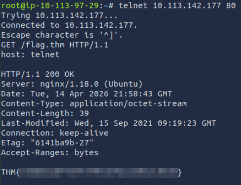
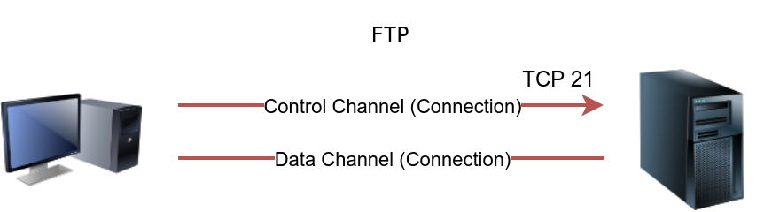
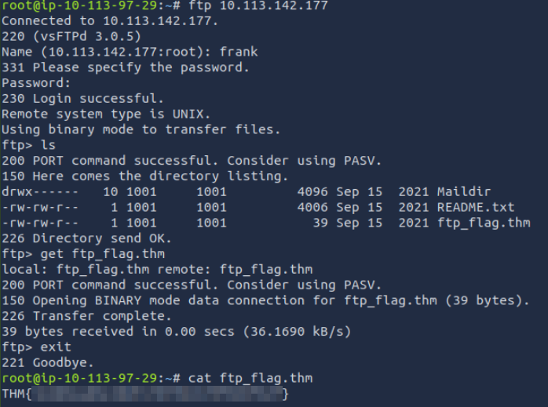
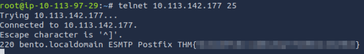
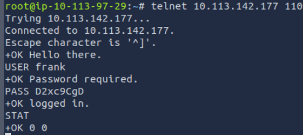
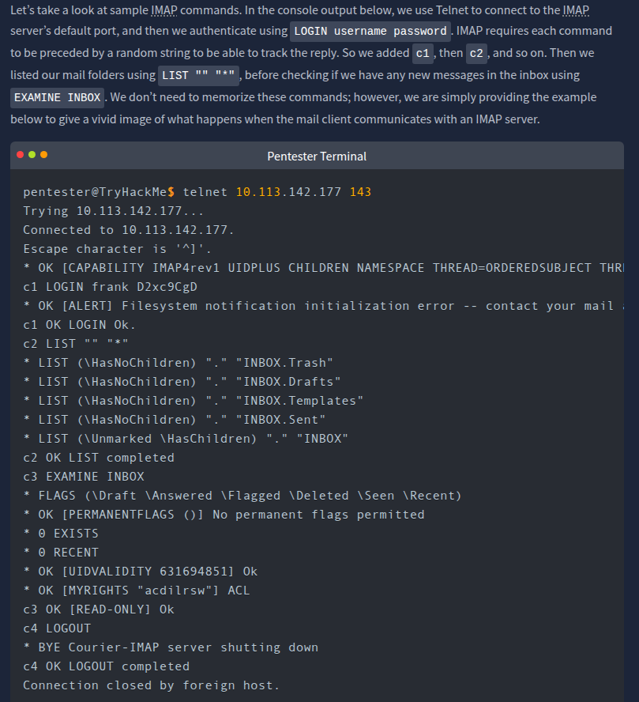

# [Protocols and Servers](https://tryhackme.com/room/protocolsandservers)

## Telnet

The Telnet protocol is an application layer protocol used to connect to a virtual terminal of another computer. Using Telnet, a user can log into another computer and access its terminal (console) to run programs, start batch processes, and perform system administration tasks remotely.

Telnet protocol is relatively simple. When a user connects, they will be asked for a username and password. Upon correct authentication, the user will access the remote system’s terminal. Unfortunately, all this communication between the Telnet client and the Telnet server is not encrypted, making it an easy target for attackers.

A Telnet server uses the Telnet protocol to listen for incoming connections on port 23.

It is not a reliable protocol for remote administration as all the data are sent in cleartext.

The secure alternative is SSH.

### Questions

Q: To which port will the telnet command with the default parameters try to connect?

A: `23`

## Hypertext Transfer Protocol (HTTP)

Hypertext Transfer Protocol (HTTP) is the protocol used to transfer web pages. Your web browser connects to the webserver and uses HTTP to request HTML pages and images among other files and submit forms and upload various files.

HTTP sends and receives data as cleartext (not encrypted); therefore, you can use a simple tool, such as Telnet (or Netcat), to communicate with a web server and act as a “web browser”. The key difference is that you need to input the HTTP-related commands instead of the web browser doing that for you.

We need an HTTP server (webserver) and an HTTP client (web browser) to use the HTTP protocol. The web server will “serve” a specific set of files to the requesting web browser.

Three popular choices for HTTP servers are:

- [Apache(opens in new tab)](https://www.apache.org/)
- [Internet Information Services (IIS)(opens in new tab)](https://www.iis.net/)
- [nginx(opens in new tab)](https://nginx.org/)

Apache and Nginx are free and open-source software. However, IIS is closed source software and requires paying for a license.

### Questions

Q: Launch the attached VM. From the AttackBox terminal, connect using Telnet to MACHINE_IP 80 and retrieve the file flag.thm. What does it contain?

A: `THM{e3eb0a1df437f3f97a64aca5952c8ea0}`

## File Transfer Protocol (FTP)

File Transfer Protocol (FTP) was developed to make the transfer of files between different computers with different systems efficient.

FTP also sends and receives data as cleartext; therefore, we can use Telnet (or Netcat) to communicate with an FTP server and act as an FTP client.

FTP servers listen on port 21 by default.

A command like `STAT` can provide some added information. The `SYST` command shows the System Type of the target (UNIX in this case). `PASV` switches the mode to passive. It is worth noting that there are two modes for FTP:

- Active: In the active mode, the data is sent over a separate channel originating from the FTP server’s port 20.
- Passive: In the passive mode, the data is sent over a separate channel originating from an FTP client’s port above port number 1023.

The command `TYPE A` switches the file transfer mode to ASCII, while `TYPE I` switches the file transfer mode to binary. However, we cannot transfer a file using a simple client such as Telnet because FTP creates a separate connection for file transfer.

FTP servers and FTP clients use the FTP protocol. There are various FTP server software that you can select from if you want to host your FTP file server. Examples of FTP server software include:

- [vsftpd(opens in new tab)](https://security.appspot.com/vsftpd.html)
- [ProFTPD(opens in new tab)](http://www.proftpd.org/)
- [uFTP(opens in new tab)](https://www.uftpserver.com/)

For FTP clients, in addition to the console FTP client commonly found on Linux systems, you can use an FTP client with GUI such as [FileZilla(opens in new tab)](https://filezilla-project.org/). Some web browsers also support FTP protocol.

Because FTP sends the login credentials along with the commands and files in cleartext, FTP traffic can be an easy target for attackers.

### Questions

Q: Using an FTP client, connect to the VM and try to recover the flag file. What is the flag?Username: frankPassword: D2xc9CgD

A: `THM{364db6ad0e3ddfe7bf0b1870fb06fbdf}`

## Simple Mail Transfer Protocol (SMTP)

Email delivery over the Internet requires the following components:

1. Mail Submission Agent (MSA)
2. Mail Transfer Agent (MTA)
3. Mail Delivery Agent (MDA)
4. Mail User Agent (MUA)

1. A Mail User Agent (MUA), or simply an email client, has an email message to be sent. The MUA connects to a Mail Submission Agent (MSA) to send its message.
2. The MSA receives the message, checks for any errors before transferring it to the Mail Transfer Agent (MTA) server, commonly hosted on the same server.
3. The MTA will send the email message to the MTA of the recipient. The MTA can also function as a Mail Submission Agent (MSA).
4. A typical setup would have the MTA server also functioning as a Mail Delivery Agent (MDA).
5. The recipient will collect its email from the MDA using their email client.

Consider the analogy:

1. You (MUA) want to send postal mail.
2. The post office employee (MSA) checks the postal mail for any issues before your local post office (MTA) accepts it.
3. The local post office checks the mail destination and sends it to the post office (MTA) in the correct country.
4. The post office (MTA) delivers the mail to the recipient mailbox (MDA).
5. The recipient (MUA) regularly checks the mailbox for new mail. They notice the new mail, and they take it.

In the same way, we need to follow a protocol to communicate with an HTTP server, and we need to rely on email protocols to talk with an MTA and an MDA. The protocols are:

1. Simple Mail Transfer Protocol (SMTP)
2. Post Office Protocol version 3 (POP3) or Internet Message Access Protocol (IMAP)

Simple Mail Transfer Protocol (SMTP) is used to communicate with an MTA server. Because SMTP uses cleartext, where all commands are sent without encryption, we can use a basic Telnet client to connect to an SMTP server and act as an email client (MUA) sending a message.

SMTP server listens on port 25 by default.

After `helo`, we issue `mail from:`, `rcpt to:` to indicate the sender and the recipient. When we send our email message, we issue the command `data` and type our message. We issue `<CR><LF>.<CR><LF>` (or `Enter . Enter` to put it in simpler terms). The SMTP server now queues the message.

### Questions

Q: Using the AttackBox terminal, connect to the SMTP port of the target VM. What is the flag that you can get?

A: `THM{5b31ddfc0c11d81eba776e983c35e9b5}`

## Post Office Protocol 3 (POP3)

Post Office Protocol version 3 (POP3) is a protocol used to download the email messages from a Mail Delivery Agent (MDA) server.  The mail client connects to the POP3 server, authenticates, downloads the new email messages before (optionally) deleting them.

The commands are sent in cleartext.

Based on the default settings, the mail client deletes the mail message after it downloads it. The default behaviour can be changed from the mail client settings if you wish to download the emails again from another mail client. Accessing the same mail account via multiple clients using POP3 is usually not very convenient as one would lose track of read and unread messages. To keep all mailboxes synchronized, we need to consider other protocols, such as IMAP.

### Questions

Q: Connect to the VM (MACHINE_IP) at the POP3 port. Authenticate using the username frank and password D2xc9CgD. What is the response you get to STAT?

A: `OK 0 0`

Q: How many email messages are available to download via POP3 on MACHINE_IP?

The first 0 in the response above depicts the number of email in the inbox, while the second number represents the total amount of bytes of the inbox.

A: `0`

## Internet Message Access Protocol (IMAP)

Internet Message Access Protocol (IMAP) is more sophisticated than POP3. IMAP makes it possible to keep your email synchronized across multiple devices (and mail clients). In other words, if you mark an email message as read when checking your email on your smartphone, the change will be saved on the IMAP server (MDA) and replicated on your laptop when you synchronize your inbox.

IMAP requires each command to be preceded by a random string to be able to track the reply.

 IMAP sends the login credentials in cleartext.

### Questions

Q: What is the default port used by IMAP?

A: `143`

## Summary

|Protocol|TCP Port|Application(s)|Data Security|
|---|---|---|---|
|FTP|21|File Transfer|Cleartext|
|HTTP|80|Worldwide Web|Cleartext|
|IMAP|143|Email (MDA)|Cleartext|
|POP3|110|Email (MDA)|Cleartext|
|SMTP|25|Email (MTA)|Cleartext|
|Telnet|23|Remote Access|Cleartext|
