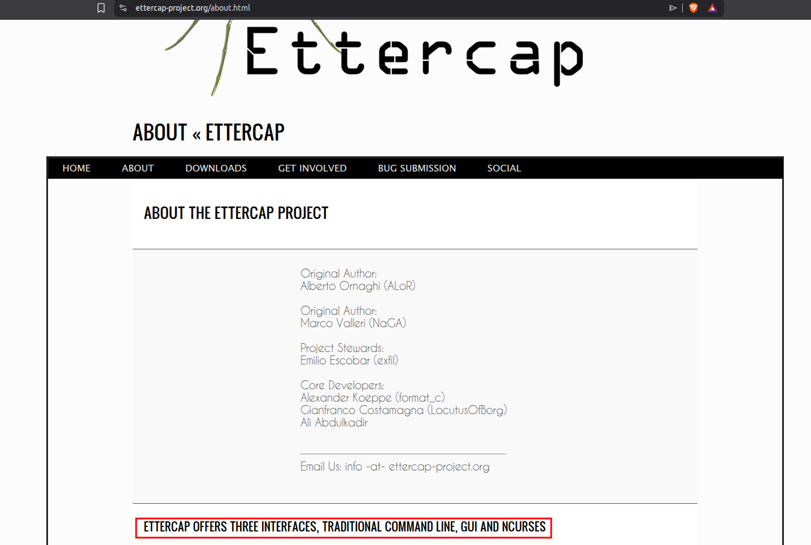
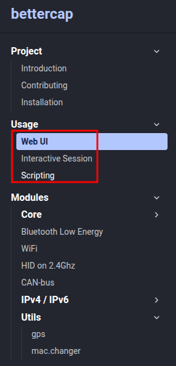
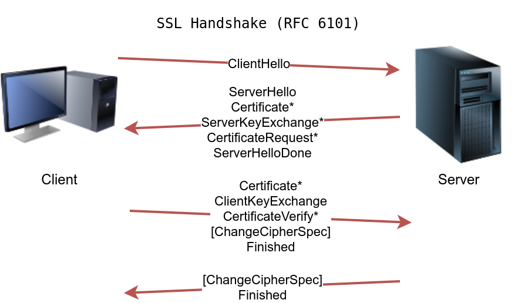
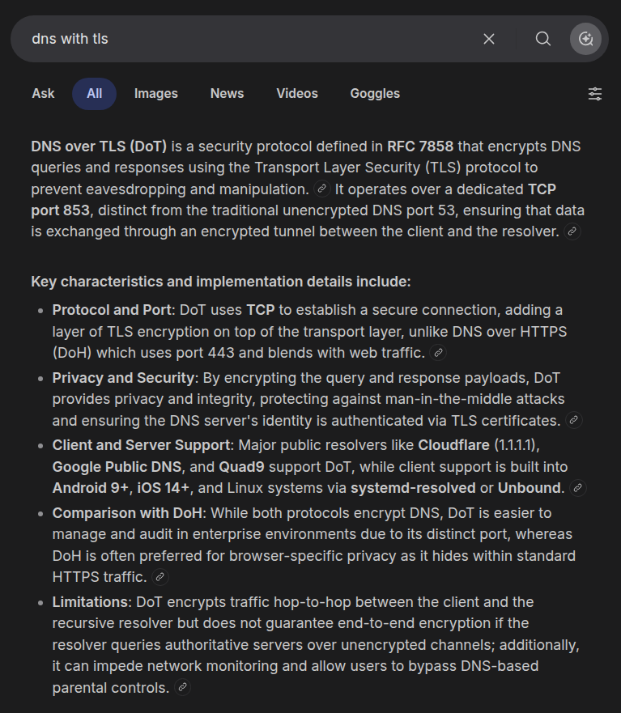
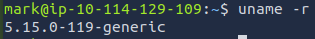
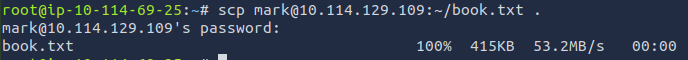
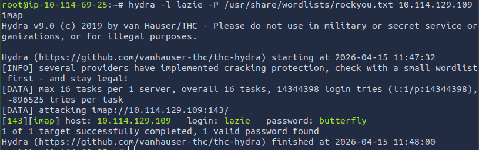

# [Protocols and Servers 2](https://tryhackme.com/room/protocolsandservers2)

## Sniffing Attack

Sniffing attack refers to using a network packet capture tool to collect information about the target.

A sniffing attack can be conducted using an Ethernet (802.3) network card, provided that the user has proper permissions (root permissions on Linux and administrator privileges on MS Windows). There are many programs available to capture network packets:

1. **Tcpdump** is a free open source command-line interface (CLI) program that has been ported to work on many operating systems.
2. **Wireshark** is a free open source graphical user interface (GUI) program available for several operating systems, including Linux, macOS and MS Windows.
3. **Tshark** is a CLI alternative to Wireshark.

Consider a user checking his email messages using POP3. We use Tcpdump to attempt to capture the username and password.  We use the command `sudo tcpdump port 110 -A`. This attack requires access to the network traffic, for example, via a wiretap or a switch with port mirroring. Alternatively, we can access the traffic exchanged if we launch a successful Man-in-the-Middle (MITM) attack.

We need `sudo` as packet captures require root privileges. We wanted to limit the number of captured and displayed packets to those exchanged with the POP3 server. Since POP3 uses port 110, we filter our packets using `port 110`. Finally, we want to display the contents of the captured packets in ASCII format, so we add `-A`.

The only requirement for this attack to succeed is to have access to a system between the two communicating systems. This attack requires attention; the mitigation lies in adding an encryption layer on top of any network protocol. In particular, Transport Layer Security (TLS) has been added to HTTP, FTP, SMTP, POP3, IMAP and many others. For remote access, Telnet has been replaced by the secure alternative Secure Shell (SSH).

### Questions

Q: What do you need to add to the command sudo tcpdump to capture only Telnet traffic?

A: `port 23`

Q: What is the simplest display filter you can use with Wireshark to show only IMAP traffic?

A: `imap`

## Man-in-the-Middle (MITM) Attack

A Man-in-the-Middle (MITM) attack occurs when a victim (A) believes they are communicating with a legitimate destination (B) but is unknowingly communicating with an attacker (E).

This attack is relatively simple to carry out if the two parties do not confirm the authenticity and integrity of each message. In some cases, the chosen protocol does not provide secure authentication or integrity checking; moreover, some protocols have inherent insecurities that make them susceptible to this kind of attack.

Any time you browse over HTTP, you are susceptible to a MITM attack, and the scary thing is that you cannot recognize it. Many tools would aid you in carrying out such an attack, such as [Ettercap(opens in new tab)](https://www.ettercap-project.org/) and [Bettercap(opens in new tab)](https://www.bettercap.org/).

MITM can also affect other cleartext protocols such as FTP, SMTP, and POP3. Mitigation against this attack requires the use of cryptography. The solution lies in proper authentication along with encryption or signing of the exchanged messages. With the help of Public Key Infrastructure (PKI) and trusted root certificates, Transport Layer Security (TLS) protects from MITM attacks.

### Questions

Q: How many different interfaces does Ettercap offer?

A: `3`

Q: In how many ways can you invoke Bettercap?

A: `3`

## Transport Layer Security (TLS)

SSL (Secure Sockets Layer) started when the world wide web started to see new applications, such as online shopping and sending payment information. Netscape introduced SSL in 1994, with SSL 3.0 being released in 1996. But eventually, more security was needed, and TLS (Transport Layer Security) protocol was introduced in 1999.

Because of the close relation between SSL and TLS, one might be used instead of the other. However, TLS is more secure than SSL, and it has practically replaced SSL. We could have dropped SSL and just write TLS instead of SSL/TLS, but we will continue to mention the two to avoid any ambiguity because the term SSL is still in wide use. However, we can expect all modern servers to be using TLS.

We can use TLS to upgrade HTTP, FTP, SMTP, POP3, and IMAP, to name a few.

|Protocol|Default Port|Secured Protocol|Default Port with TLS|
|---|---|---|---|
|HTTP|80|HTTPS|443|
|FTP|21|FTPS|990|
|SMTP|25|SMTPS|465|
|POP3|110|POP3S|995|
|IMAP|143|IMAPS|993|
 
 To retrieve a web page over HTTPS, the web browser would need at least perform the three steps:

1. Establish a TCP connection
2. **Establish SSL/TLS connection**
3. Send HTTP requests to the webserver

Based on [RFC 6101(opens in new tab)](https://datatracker.ietf.org/doc/html/rfc6101), the SSL connection establishment will look like the figure below.

Short:  A client was able to agree on a secret key with a server that has a public certificate. This secret key was securely generated so that a third party monitoring the channel wouldn’t be able to discover it. Further communication between the client and the server will be encrypted using the generated key.

For SSL/TLS to be effective, especially when browsing the web over HTTPS, we rely on public certificates signed by certificate authorities trusted by our systems. In other words, when we browse to [TryHackMe](https://tryhackme.com/) over HTTPS, our browser expects the TryHackMe web server to provide a signed certificate from a trusted certificate authorit. This way, our browser ensures that it is communicating with the correct server, and a MITM attack cannot occur.

Luckily, we don’t have to check the certificate manually for every site we visit; our web browser will do it for us. Our web browser will ensure that we are talking with the correct server and ensure that our communication is secure, thanks to the server’s certificate.

### Questions

Q: DNS can also be secured using TLS. What is the three-letter acronym of the DNS protocol that uses TLS?

A: `DoT`

## Secure Shell (SSH)

SSH llets you securely connect to another system over the network and execute commands on the remote system. Put simply, the “S” in SSH stands for secure, which can be summarized simply as:

1. You can confirm the identity of the remote server
2. Exchanged messages are encrypted and can only be decrypted by the intended recipient
3. Both sides can detect any modification in the messages

To use SSH, you need an SSH server and an SSH client. The SSH server listens on port 22 by default. The SSH client can authenticate using:

- A username and a password
- A private and public key (after the SSH server is configured to recognize the corresponding public key)

 SSH is very reliable for remote administration because our username and password were sent encrypted; moreover, all commands we execute on the remote system will be sent over an encrypted channel.

Note that if this is the first time we connect to this system, we will need to confirm the fingerprint of the SSH server’s public key to avoid man-in-the-middle (MITM) attacks.

 In the case of SSH, we don’t usually have a third party to check if the public key is valid, so we need to do this manually.

We can use SSH to transfer files using SCP (Secure Copy Protocol) based on the SSH protocol: 
For example `scp mark@10.114.129.109:/home/mark/archive.tar.gz ~` will copy a file named `archive.tar.gz` from the remote system located in the `/home/mark` directory to `~`, i.e., the root of the home directory of the currently logged-in user.

Another example syntax is `scp backup.tar.bz2 mark@10.114.129.109:/home/mark/`, which will copy the file `backup.tar.bz2` from the local system to the directory `/home/mark/` on the remote system.

 FTP could be secured using SSL/TLS by using the FTPS protocol which uses port 990. It is worth mentioning that FTP can also be secured using the SSH protocol which is the SFTP protocol. By default this service listens on port 22, just like SSH.

### Questions

Q: Use SSH to connect to MACHINE_IP as mark with the password XBtc49AB. Using uname -r, find the Kernel release?

A: `5.15.0-119-generic`

Q: Use SSH to download the file book.txt from the remote system. How many KBs did scp display as download size?

A: `415`

## Password Attack

 Authentication is proving who you claim to be. When we are using protocols such as POP3, we should not be given access to the mailbox before verifying our identity.

Authentication, or proving your identity, can be achieved through one of the following, or a combination of two:

1. Something you _know_, such as password and PIN code.
2. Something you _have_, such as a SIM card, RFID card, and USB dongle.
3. Something you _are_, such as fingerprint and iris.

Attacks against passwords are usually carried out by:

1. Password Guessing: Guessing a password requires some knowledge of the target, such as their pet’s name and birth year.
2. Dictionary Attack: This approach expands on password guessing and attempts to include all valid words in a dictionary or a wordlist.
3. Brute Force Attack: This attack is the most exhaustive and time-consuming where an attacker can go as far as trying all possible character combinations, which grows fast (exponential growth with the number of characters).

We want an automated way to try the common passwords or the entries from a word list; here comes [THC Hydra(opens in new tab)](https://github.com/vanhauser-thc/thc-hydra). Hydra supports many protocols, including FTP, POP3, IMAP, SMTP, SSH, and all methods related to HTTP. The general command-line syntax is: `hydra -l username -P wordlist.txt server service` where we specify the following options:

- `-l username`: `-l` should precede the `username`, i.e. the login name of the target.
- `-P wordlist.txt`: `-P` precedes the `wordlist.txt` file, which is a text file containing the list of passwords you want to try with the provided username.
- `server` is the hostname or IP address of the target server.
- `service` indicates the service which you are trying to launch the dictionary attack.

Consider the following concrete examples:

- `hydra -l mark -P /usr/share/wordlists/rockyou.txt 10.114.129.109 ftp` will use `mark` as the username as it iterates over the provided passwords against the FTP server.
- `hydra -l mark -P /usr/share/wordlists/rockyou.txt ftp://10.114.129.109` is identical to the previous example. `10.114.129.109 ftp` is the same as `ftp://10.114.129.109`.
- `hydra -l frank -P /usr/share/wordlists/rockyou.txt 10.114.129.109 ssh` will use `frank` as the user name as it tries to login via SSH using the different passwords.

Optional arguments that you can add:

- `-s PORT` to specify a non-default port for the service in question.
- `-V` or `-vV`, for verbose, makes Hydra show the username and password combinations that are being tried. This verbosity is very convenient to see the progress, especially if you are still not confident of your command-line syntax.
- `-t n` where n is the number of parallel connections to the target. `-t 16` will create 16 threads used to connect to the target.
- `-d`, for debugging, to get more detailed information about what’s going on. The debugging output can save you much frustration; for instance, if Hydra tries to connect to a closed port and timing out, `-d` will reveal this right away.

Mitigation against such attacks can be sophisticated and depends on the target system. A few of the approaches include:

- Password Policy: Enforces minimum complexity constraints on the passwords set by the user.
- Account Lockout: Locks the account after a certain number of failed attempts.
- Throttling Authentication Attempts: Delays the response to a login attempt. A couple of seconds of delay is tolerable for someone who knows the password, but they can severely hinder automated tools.
- Using CAPTCHA: Requires solving a question difficult for machines. It works well if the login page is via a graphical user interface (GUI). (Note that CAPTCHA stands for Completely Automated Public Turing test to tell Computers and Humans Apart.)
- Requiring the use of a public certificate for authentication. This approach works well with SSH, for instance.
- Two-Factor Authentication: Ask the user to provide a code available via other means, such as email, smartphone app or SMS.
- There are many other approaches that are more sophisticated or might require some established knowledge about the user, such as IP-based geolocation.

### Questions

Q: We learned that one of the email accounts is lazie. What is the password used to access the IMAP service on MACHINE_IP?

A: `butterfly`

## Summary

|Protocol|TCP Port|Application(s)|Data Security|
|---|---|---|---|
|FTP|21|File Transfer|Cleartext|
|FTPS|990|File Transfer|Encrypted|
|HTTP|80|Worldwide Web|Cleartext|
|HTTPS|443|Worldwide Web|Encrypted|
|IMAP|143|Email (MDA)|Cleartext|
|IMAPS|993|Email (MDA)|Encrypted|
|POP3|110|Email (MDA)|Cleartext|
|POP3S|995|Email (MDA)|Encrypted|
|SFTP|22|File Transfer|Encrypted|
|SSH|22|Remote Access and File Transfer|Encrypted|
|SMTP|25|Email (MTA)|Cleartext|
|SMTPS|465|Email (MTA)|Encrypted|
|Telnet|23|Remote Access|Cleartext|

Hydra remains a very efficient tool that you can launch from the terminal to try the different passwords. We summarize its main options in the following table.

|Option|Explanation|
|---|---|
|`-l username`|Provide the login name|
|`-P WordList.txt`|Specify the password list to use|
|`server service`|Set the server address and service to attack|
|`-s PORT`|Use in case of non-default service port number|
|`-V` or `-vV`|Show the username and password combinations being tried|
|`-d`|Display debugging output if the verbose output is not helping|
