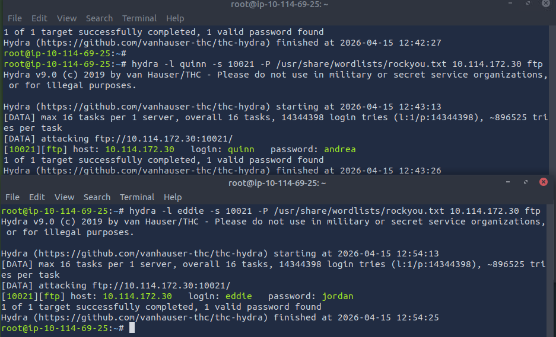
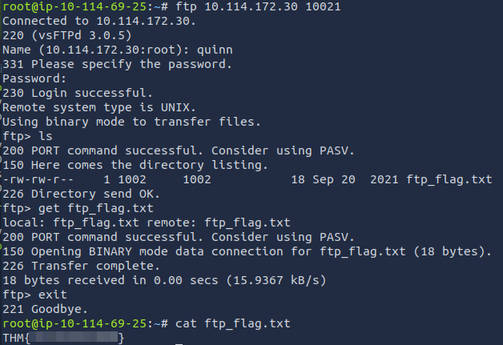
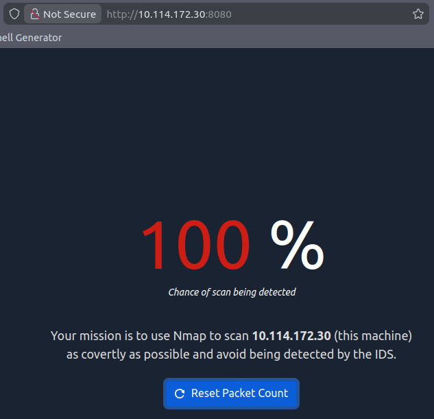
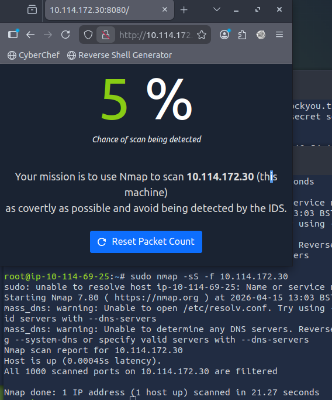
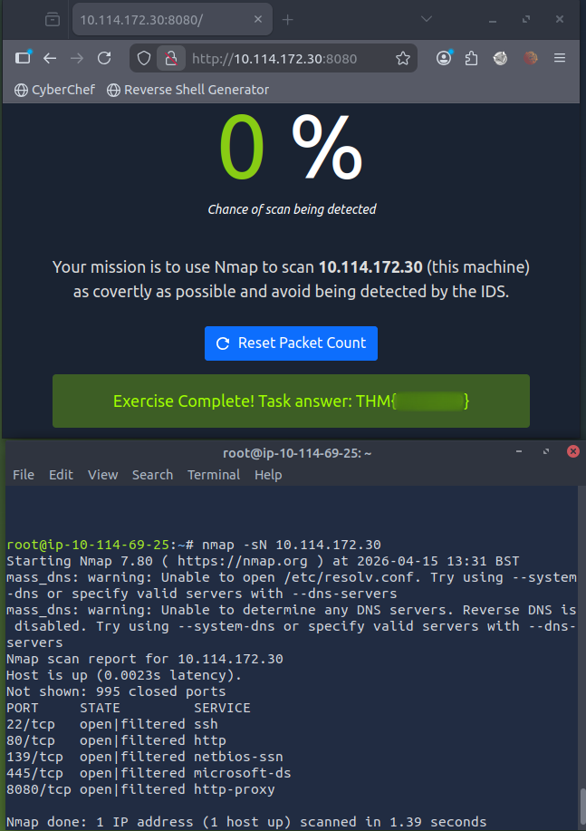

# [Net Sec Challenge](https://tryhackme.com/room/netsecchallenge)

## Introduction

## Challenge Questions

I scanned the target using `nmap`:

```
# Nmap 7.80 scan initiated Wed Apr 15 12:27:15 2026 as: nmap -sC -sV -n -oN netsec_chall_nmap -p- -T4 10.114.172.30
Nmap scan report for 10.114.172.30
Host is up (0.0024s latency).
Not shown: 65529 closed ports
PORT      STATE SERVICE     VERSION
22/tcp    open  ssh         (protocol 2.0)
| fingerprint-strings: 
|   NULL: 
|_    SSH-2.0-OpenSSH_8.2p1 THM{946219583339}
80/tcp    open  http        lighttpd
|_http-server-header: lighttpd THM{web_server_25352}
|_http-title: Hello, world!
139/tcp   open  netbios-ssn Samba smbd 4.6.2
445/tcp   open  netbios-ssn Samba smbd 4.6.2
8080/tcp  open  http        Node.js (Express middleware)
|_http-open-proxy: Proxy might be redirecting requests
|_http-title: Site doesn't have a title (text/html; charset=utf-8).
10021/tcp open  ftp         vsftpd 3.0.5
1 service unrecognized despite returning data. If you know the service/version, please submit the following fingerprint at https://nmap.org/cgi-bin/submit.cgi?new-service :
SF-Port22-TCP:V=7.80%I=7%D=4/15%Time=69DF761E%P=x86_64-pc-linux-gnu%r(NULL
SF:,2A,"SSH-2\.0-OpenSSH_8\.2p1\x20THM{946219583339}\x20\r\n");
Service Info: OS: Unix

Host script results:
|_clock-skew: -1s
|_nbstat: NetBIOS name: , NetBIOS user: <unknown>, NetBIOS MAC: <unknown> (unknown)
| smb2-security-mode: 
|   2.02: 
|_    Message signing enabled but not required
| smb2-time: 
|   date: 2026-04-15T11:27:30
|_  start_date: N/A

Service detection performed. Please report any incorrect results at https://nmap.org/submit/ .
# Nmap done at Wed Apr 15 12:27:34 2026 -- 1 IP address (1 host up) scanned in 19.52 seconds
```

We can depict from the results that the highest port number <10000 is the port `8080`.
Moreover, we can also find the only open port outside the common 1000 ports, > 10000.
We have the following ports open: 22,80,139,445,8080,10021.

In the HTTP server and SSH server headers we can find two flags.

The FTP server listens on the non-standard port 10021. The `nmap` scripts identified its version too.

I used hydra to get the `ftp` passwords of the two given users:



I then tried to login an `quinn` on the FTP server, using the newly found password. I then found the file that contained the flag and simply downloaded it.



Browsing the IP on port 8080 prompts us the following challenge:



I used stealth scan and fragmentation, and that lowered the chance of being detected to 5%:



I tried all of the scans presented in previous Nmap rooms, but the only one that worked is the NULL scan:




### Questions

Q: What is the highest port number being open less than 10,000?

A: `8080`

Q: There is an open port outside the common 1000 ports; it is above 10,000. What is it?

A: `10021`

Q: How many TCP ports are open?

A: `6`

Q: What is the flag hidden in the HTTP server header?

A: `THM{web_server_25352}`

Q: What is the flag hidden in the SSH server header?

A: `THM{946219583339}`

Q: We have an FTP server listening on a nonstandard port. What is the version of the FTP server?

A: `vsftpd 3.0.5`

Q: We learned two usernames using social engineering: eddie and quinn. What is the flag hidden in one of these two account files and accessible via FTP?

A: `THM{321452667098}`

Q: Browsing to http://MACHINE_IP:8080 displays a small challenge that will give you a flag once you solve it. What is the flag?

A: `THM{f7443f99}`
