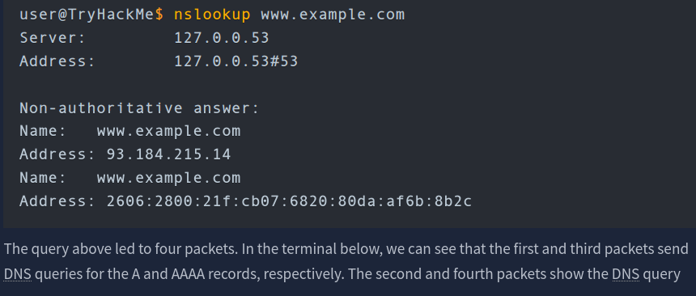
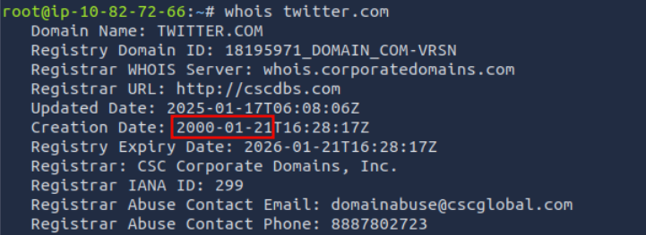
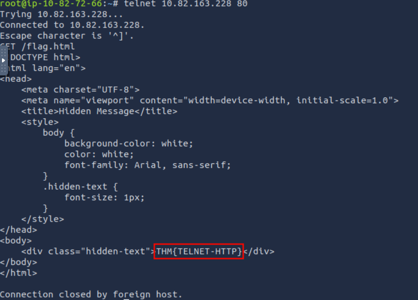
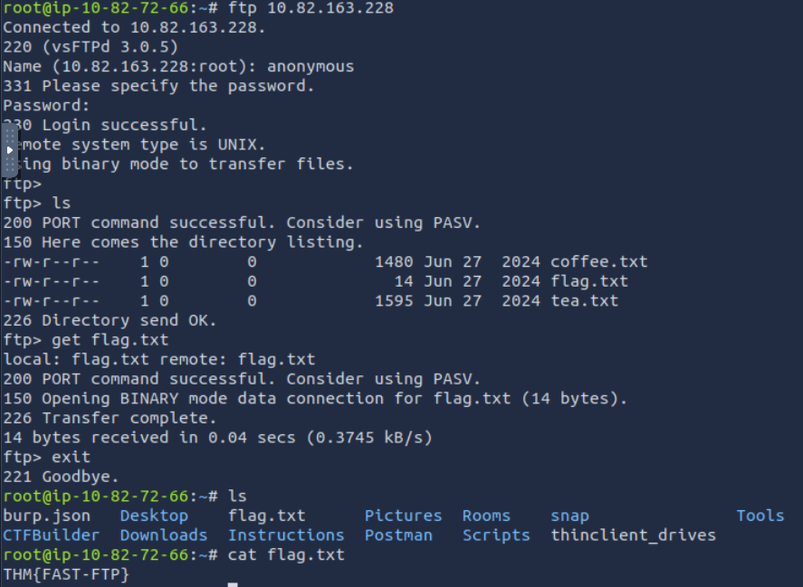
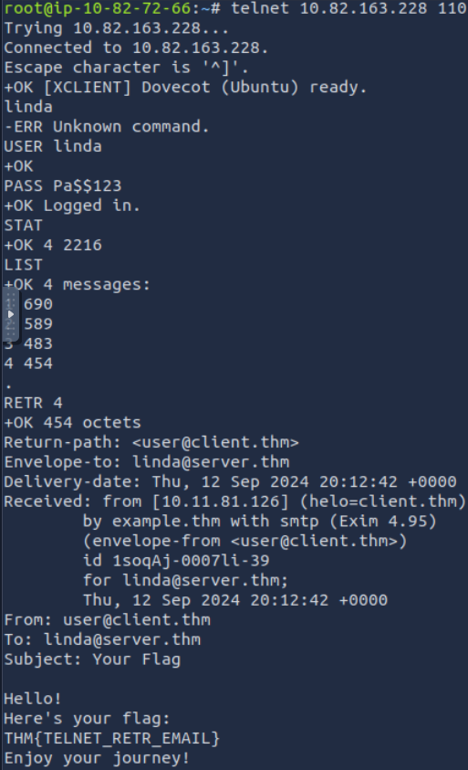

# [Networking Core Protocols](https://tryhackme.com/room/networkingcoreprotocols)

## DNS: Remembering Addresses

Unless it is a private IP address of a local device, no one needs to worry about memorizing IP addresses. This is in part due to the Domain Name System (DNS), which is responsible for properly mapping a domain name to an IP address.

DNS operates at the Application Layer, i.e., Layer 7 of the ISO OSI model. DNS traffic uses UDP port 53 by default and TCP port 53 as a default fallback. There are many types of DNS record:

- **A record**: The A (Address) record maps a hostname to one or more IPv4 addresses. For example, you can set `example.com` to resolve to `172.17.2.172`.
- **AAAA Record**: The AAAA record is similar to the A Record, but it is for IPv6. Remember that it is AAAA (quad-A), as AA and AAA would refer to a battery size; furthermore, AAA refers to _Authentication, Authorization, and Accounting_; neither falls under DNS.
- **CNAME Record**: The CNAME (Canonical Name) record maps a domain name to another domain name. For example, `www.example.com` can be mapped to `example.com` or even to `example.org`.
- **MX Record**: The MX (Mail Exchange) record specifies the mail server responsible for handling emails for a domain.

In other words, when you type `example.com` in your browser, your browser tries to resolve this domain name by querying the DNS server for the A record. However, when you try to send an email to `test@example.com`, the mail server would query the DNS server to find the MX record.

If you want to look up the IP address of a domain from the command line, you can use a tool such as `nslookup`

### Questions

Q: Which DNS record type refers to IPv6?

A: `AAAA`

Q: Which DNS record type refers to the email server?

A: `MX`

## WHOIS

someone needs to have the authority to set the A, AAAA, and MX records, among other DNS records for the domain. Whoever registers a domain name is granted this power. Therefore, if you register example.com, you can set any valid DNS records for example.com.

You can register any available domain name for one or more years. You need to pay the annual fee, and you are required to provide [accurate contact information](https://www.icann.org/resources/pages/whois-data-accuracy-2017-06-20-en) as the registrant. This information is part of the data available via WHOIS records and is available publicly. (Although written in uppercase, WHOIS is not an acronym; it is pronounced _who is_.)

You can look up the WHOIS records of any registered domain name using one of the online services or via the command-line tool `whois`, available on Linux systems, among others. As expected, a WHOIS record provides information about the entity that registered a domain name, including name, phone number, email, and address. In the screenshot shown below, you can see when the record was first created and when it was last updated. Moreover, you can find the registrant’s name, address, phone, and email.

### Questions

Q: When was the x.com record created? Provide the answer in YYYY-MM-DD format.

A: `1993-04-02`

Q: When was the twitter.com record created? Provide the answer in YYYY-MM-DD format.

A: `2000-01-21`

## HTTP(S): Accessing the Web

Some of the commands or methods that your web browser commonly issues to the web server are:

- `GET` retrieves data from a server, such as an HTML file or an image.
- `POST` allows us to submit new data to the server, such as submitting a form or uploading a file.
- `PUT` is used to create a new resource on the server and to update and overwrite existing information.
- `DELETE`, as the name suggests, is used to delete a specified file or resource on the server.

HTTP and HTTPS commonly use TCP ports 80 and 443, respectively, and less commonly other ports such as 8080 and 8443.

As you remember from [Networking Concepts](https://tryhackme.com/r/room/networkingconcepts), we used the `telnet` client to connect to the web server running on `10.82.163.228` at port `80`. We had to send a couple of lines: `GET / HTTP/1.1` and `Host: anything` to get the page we wanted. (On some servers, you might get the file without sending `Host: anything`.) You can use this method to access any page and not just the default page `/`. To get `file.html`, you would send `GET /file.html HTTP/1.1`, for instance (`GET /file.html` might work depending on the web server in use). This approach is efficient for troubleshooting as you would be “talking HTTP” with the server.

### Questions

Q: Use `telnet` to access the file `flag.html` on `10.82.163.228`. What is the hidden flag?

A: `THM{TELNET-HTTP}`

## FTP: Transferring Files

Unlike HTTP, which is designed to retrieve web pages, File Transfer Protocol (FTP) is designed to transfer files. As a result, FTP is very efficient for file transfer, and when all conditions are equal, it can achieve higher speeds than HTTP.

Example commands defined by the FTP protocol are:

- `USER` is used to input the username
- `PASS` is used to enter the password
- `RETR` (retrieve) is used to download a file from the FTP server to the client.
- `STOR` (store) is used to upload a file from the client to the FTP server.

FTP server listens on TCP port 21 by default; data transfer is conducted via another connection from the client to the server.

One last thing to note is that the directory listing and the file we downloaded are sent over a separate connection each.

### Questions

Q: Using the FTP client `ftp` on the AttackBox, access the FTP server at `10.82.163.228` and retrieve `flag.txt`. What is the flag found?

Log in using `anonymous:<empty>` and download the file using `get flag.txt`.

A: `THM{FAST-FTP}`

## SMTP: Sending Email

As with browsing the web and downloading files, sending email needs its own protocol. Simple Mail Transfer Protocol (SMTP) defines how a mail client talks with a mail server and how a mail server talks with another.

The analogy for the SMTP protocol is when you go to the local post office to send a package. You greet the employee, tell them where you want to send your package, and provide the sender’s information before handing them the package. Depending on the country you are in, you might be asked to show your identity card. This process is not very different from an SMTP session.

Let’s present some of the commands used by your mail client when it transfers an email to an SMTP server:

- `HELO` or `EHLO` initiates an SMTP session
- `MAIL FROM` specifies the sender’s email address
- `RCPT TO` specifies the recipient’s email address
- `DATA` indicates that the client will begin sending the content of the email message
- `.` is sent on a line by itself to indicate the end of the email message

The SMTP server listens on TCP port 25 by default.

### Questions

Q: Which SMTP command indicates that the client will start the contents of the email message?

A: `DATA`

Q: What does the email client send to indicate that the email message has been fully entered?

A: `.`

## [Section 4](<POP3: Receiving Email>)

You’ve received an email and want to download it to your local mail client. The Post Office Protocol version 3 (POP3) is designed to allow the client to communicate with a mail server and retrieve email messages.

Without going into in-depth technical details, an email client sends its messages by relying on SMTP and retrieves them using POP3. SMTP is similar to handing your envelope or package to the post office, and POP3 is similar to checking your local mailbox for new letters or packages.

Some common POP3 commands are:

- `USER <username>` identifies the user
- `PASS <password>` provides the user’s password
- `STAT` requests the number of messages and total size
- `LIST` lists all messages and their sizes
- `RETR <message_number>` retrieves the specified message
- `DELE <message_number>` marks a message for deletion
- `QUIT` ends the POP3 session applying changes, such as deletions

POP3 server listens on TCP port 110 by default.

Someone capturing the network packets would be able to intercept the exchanged traffic. As per previous Wireshark captures, the commands in red are sent by the client, and the lines in blue are the server’s. It is also clear that someone capturing the traffic can read the passwords.

### Questions

Q: Looking at the traffic exchange, what is the name of the POP3 server running on the remote server?

A: `Dovecot`

Q: Use `telnet` to connect to `10.82.163.228`’s POP3 server. What is the flag contained in the fourth message?

A: `THM{TELNET_RETR_EMAIL}`

## IMAP: Synchronizing Email

POP3 is enough when working from one device, e.g., your favourite email client on your desktop computer. However, what if you want to check your email from your office desktop computer and from your laptop or smartphone? In this scenario, you need a protocol that allows synchronization of messages instead of deleting a message after retrieving it. One solution to maintaining a synchronized mailbox across multiple devices is Internet Message Access Protocol (IMAP).

IMAP allows synchronizing read, moved, and deleted messages. IMAP is quite convenient when you check your email via multiple clients. Unlike POP3, which tends to minimize server storage as email is downloaded and deleted from the remote server, IMAP tends to use more storage as email is kept on the server and synchronized across the email clients.

The IMAP protocol commands are more complicated than the POP3 protocol commands. We list a few examples below:

- `LOGIN <username> <password>` authenticates the user
- `SELECT <mailbox>` selects the mailbox folder to work with
- `FETCH <mail_number> <data_item_name>` Example `fetch 3 body[]` to fetch message number 3, header and body.
- `MOVE <sequence_set> <mailbox>` moves the specified messages to another mailbox
- `COPY <sequence_set> <data_item_name>` copies the specified messages to another mailbox
- `LOGOUT` logs out

IMAP server listens on TCP port 143 by default

### Questions

Q: What IMAP command retrieves the fourth email message?

A: `FETCH 4 body[]`

## Summarization

|**Protocol**|**Transport Protocol**|**Default Port Number**|
|---|---|---|
|TELNET|TCP|23|
|DNS|UDP or TCP|53|
|HTTP|TCP|80|
|HTTPS|TCP|443|
|FTP|TCP|21|
|SMTP|TCP|25|
|POP3|TCP|110|
|IMAP|TCP|143|