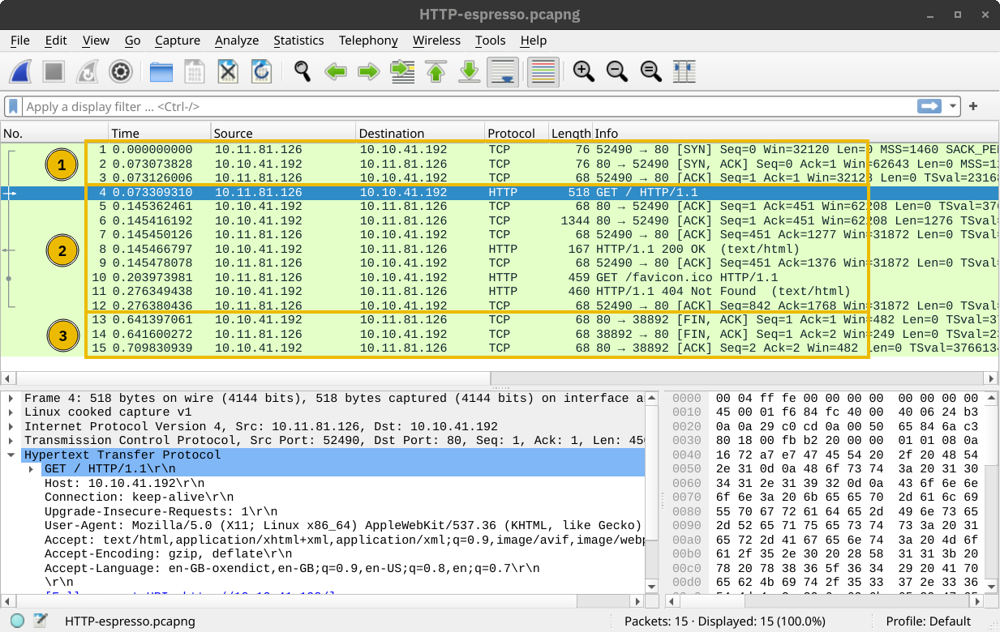
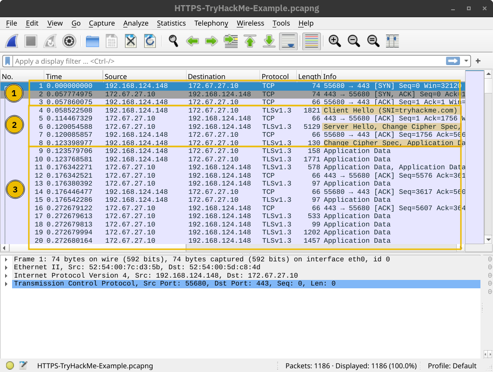
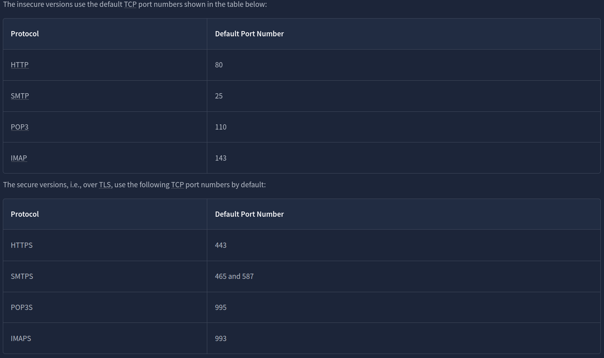
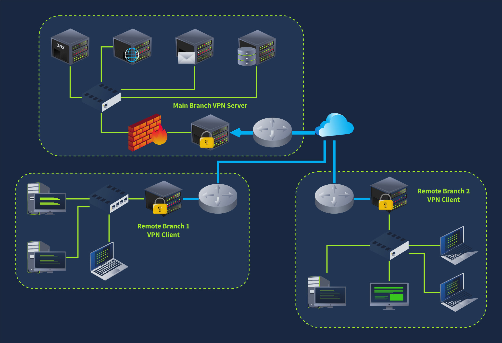
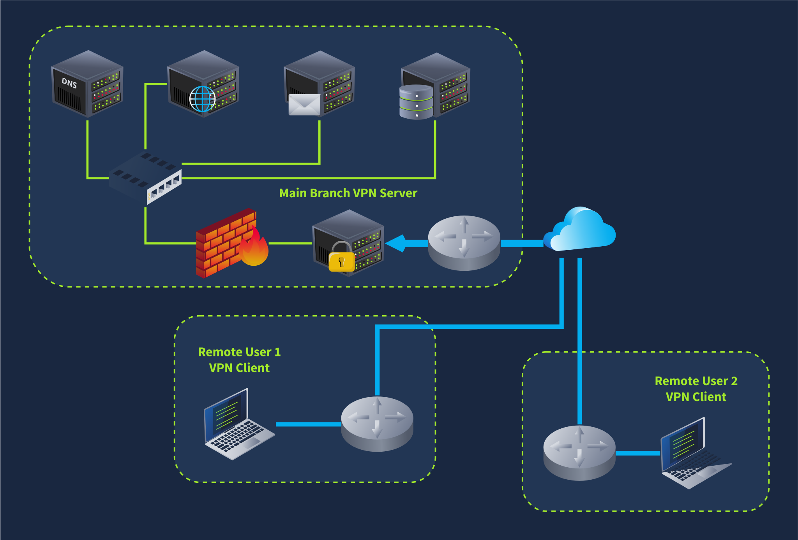
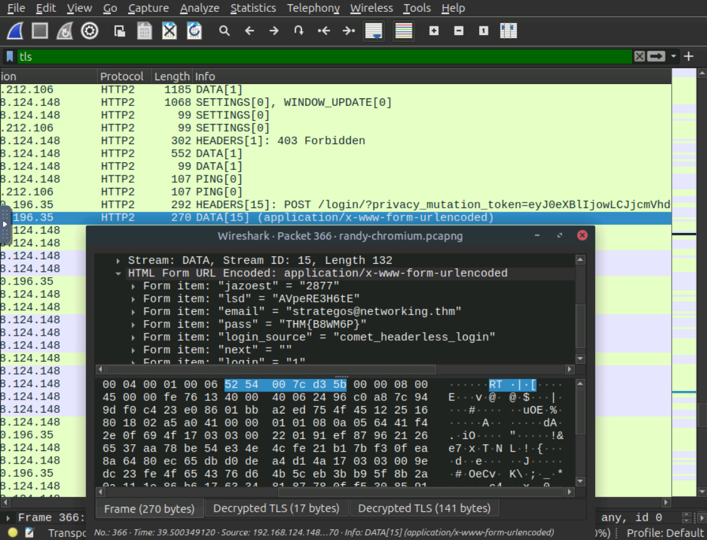

# [Networking Secure Protocols](https://tryhackme.com/room/networkingsecureprotocols)

## TLS

In the early 1990s, Netscape Communications recognised the need for secure communication on the World Wide Web. They eventually developed SSL (Secure Sockets Layer) and released SSL 2.0 in **1995** as the first public version. In **1999**, the Internet Engineering Task Force (IETF) developed TLS (Transport Layer Security). Although very similar, TLS 1.0 was an upgrade to SSL 3.0 and offered various improved security measures. In **2018**, TLS had a significant overhaul of its protocol and TLS 1.3 was released. The purpose is not to remember the exact dates but to realise the amount of work and time put into developing the current version of TLS, i.e., TLS 1.3. Over more than two decades, there have been many things to learn from and improve with every version.

Like SSL, its predecessor, TLS is a cryptographic protocol operating at the OSI model’s transport layer. It allows secure communication between a client and a server over an insecure network. By secure, we refer to confidentiality and integrity; TLS ensures that no one can read or modify the exchanged data.

Nowadays, tens of protocols have received security upgrades with the simple addition of TLS. Examples include HTTP, DNS, MQTT, and SIP, which have become HTTPS, DoT (DNS over TLS), MQTTS, and SIPS, where the appended “S” stands for Secure due to the use of SSL/TLS.

The first step for every server (or client) that needs to identify itself is to get a signed TLS certificate. Generally, the server administrator creates a Certificate Signing Request (CSR) and submits it to a Certificate Authority (CA); the CA verifies the CSR and issues a digital certificate. Once the (signed) certificate is received, it can be used to identify the server (or the client) to others, who can confirm the validity of the signature. For a host to confirm the validity of a signed certificate, the certificates of the signing authorities need to be installed on the host. In the non-digital world, this is similar to recognising the stamps of various authorities.

Generally speaking, getting a certificate signed requires paying an annual fee. However, [Let’s Encrypt](https://letsencrypt.org/) allows you to get your certificate signed for free.

Finally, we should mention that some users opt to create a self-signed certificate. A self-signed certificate cannot prove the server’s authenticity as no third party has confirmed it. 

### Questions

Q: What is the protocol name that TLS upgraded and built upon?

A: `SSL`

Q: Which type of certificates should not be used to confirm the authenticity of a server?

A: `self-signed certificate`

## HTTPS

Let’s take a minute to review the most common steps before a web browser can request a page over HTTP. After resolving the domain name to an IP address, the client will carry out the following two steps:

1. Establish a TCP three-way handshake with the target server
2. Communicate using the HTTP protocol; for example, issue HTTP requests, such as `GET / HTTP/1.1`

The two steps described above are shown in the window below. The three packets for the TCP handshake (marked with 1) precede the first HTTP packet with `GET` in it. The HTTP communication is marked with 2. The last three displayed packets are for TCP connection termination and are marked with 3.

HTTPS stands for Hypertext Transfer Protocol Secure. It is basically HTTP over TLS. Consequently, requesting a page over HTTPS will require the following three steps (after resolving the domain name):

1. Establish a TCP three-way handshake with the target server
2. Establish a TLS session
3. Communicate using the HTTP protocol; for example, issue HTTP requests, such as `GET / HTTP/1.1`

The screenshot below shows that a TCP session is established in the first three packets, marked with `1`. Then, several packets are exchanged to negotiate the TLS protocol, marked with `2`. `1` and `2` are where the **TLS negotiation and establishment** take place.

Finally, HTTP application data is exchanged, marked with `3`. Looking at the Wireshark screenshot, we see that it says “Application Data” because there is no way to know if it is indeed HTTP or some other protocol sent over port 443.

The key takeaway is that TLS offered security for HTTP without requiring any changes in the lower or higher layer protocols. In other words, TCP and IP were not modified, while HTTP was sent over TLS the way it would be sent over TCP.

### Questions

Q: How many packets did the TLS negotiation and establishment take in the Wireshark HTTPS screenshots above?

A: `8`

Q: What is the number of the packet that contain the `GET /login` when accessing the website over HTTPS?

A: `10`

## SMTPS, POP3S, and IMAPS

Adding TLS to SMTP, POP3, and IMAP is no different than adding TLS to HTTP. Similar to how HTTP gets an appended S for _Secure_ and becomes HTTPS, SMTP, POP3, and IMAP become SMTPS, POP3S, and IMAPS, respectively. Using these protocols over TLS is no different than using HTTP over TLS; therefore, almost all the points from the HTTPS discussion apply to these protocols.

### Questions

Q: If you capture network traffic, in which of the following protocols can you extract login credentials: SMTPS, POP3S, or IMAP?

A: `IMAP`

## SSH

It is easy for anyone monitoring the network traffic to get hold of your login credentials once you use `telnet`. This problem necessitated a solution. Tatu Ylönen developed the Secure Shell (SSH) protocol and released SSH-1 in **1995** as freeware. (Interestingly, it was the same year that Netscape Communications released the SSL 2.0 protocol.) A more secure version, SSH-2, was defined in 1996. In **1999**, the OpenBSD developers released OpenSSH, an open-source implementation of SSH. Nowadays, when you use an SSH client, it is most likely based on OpenSSH libraries and source code.

OpenSSH offers several benefits. We will list a few key points:

- **Secure authentication**: Besides password-based authentication, SSH supports public key and two-factor authentication.
- **Confidentiality**: OpenSSH provides end-to-end encryption, protecting against eavesdropping. Furthermore, it notifies you of new server keys to protect against man-in-the-middle attacks.
- **Integrity**: In addition to protecting the confidentiality of the exchanged data, cryptography also protects the integrity of the traffic.
- **Tunneling**: SSH can create a secure “tunnel” to route other protocols through SSH. This setup leads to a VPN-like connection.
- **X11 Forwarding**: If you connect to a Unix-like system with a graphical user interface, SSH allows you to use the graphical application over the network.

While the TELNET server listens on port 23, the SSH server listens on port 22.

### Questions

Q: What is the name of the open-source implementation of the SSH protocol?

A: `OpenSSH`

## SFTP and FTPS

SFTP stands for SSH File Transfer Protocol and allows secure file transfer. It is part of the SSH protocol suite and shares the same port number, 22. If enabled in the OpenSSH server configuration, you can connect using a command such as `sftp username@hostname`. Once logged in, you can issue commands such as `get filename` and `put filename` to download and upload files, respectively. Generally speaking, SFTP commands are Unix-like and can differ from FTP commands.

SFTP should not be confused with FTPS. You are right to think that FTPS stands for File Transfer Protocol Secure. How is FTPS secured? Yes, you are correct to estimate that it is secured using TLS, just like HTTPS. While FTP uses port 21, FTPS usually uses port 990. It requires certificate setup, and it can be tricky to allow over strict firewalls as it uses separate connections for control and data transfer.

Setting up an SFTP server is as easy as enabling an option within the OpenSSH server. Like HTTPS, SMTPS, POP3S, IMAPS, and other protocols that rely on TLS for security, FTPS requires a proper TLS certificate to run securely

### Questions

Q: Click on the **View Site** button to access the related site. Please follow the instructions on the site to obtain the flag.

A: `THM{Protocols_secur3d}`

## VPN

Consider a company with offices in different geographical locations. Can this company connect all its offices and sites to the main branch so that any device can access the shared resources as if physically located in the main branch? The answer is yes; furthermore, the most economical solution would be setting up a virtual private network (VPN) using the Internet infrastructure. The focus here is on the V for Virtual in VPN.

When the Internet was designed, the TCP/IP protocol suite focused on delivering packets. For example, if a router gets out of service, the routing protocols can adapt and pick a different route to send their packets. If a packet was not acknowledged, TCP has built-in mechanisms to detect this situation and resend. However, no mechanisms are in place to ensure that **all data** leaving or entering a computer is protected from disclosure and alteration. A popular solution was the setup of a VPN connection. The focus here is on the P for Private in VPN.

Almost all companies require “private” information exchange in their virtual network. So, a VPN provides a very convenient and relatively inexpensive solution. The main requirements are Internet connectivity and a VPN server and client.

The network diagram below shows an example of a company with two remote branches connecting to the main branch. A VPN client in the remote branches is expected to connect to the VPN server in the main branch. In this case, the VPN client will encrypt the traffic and pass it to the main branch via the established VPN tunnel (shown in blue). The VPN traffic is limited to the blue lines; the green lines would carry the decrypted VPN traffic.

In the network diagram below, we see two remote users using VPN clients to connect to the VPN server in the main branch. In this case, the VPN client connects a single device.

Once a VPN tunnel is established, all our Internet traffic will usually be routed over the VPN connection, i.e. via the VPN tunnel. Consequently, when we try to access an Internet service or web application, they will not see our public IP address but the VPN server’s. This is why some Internet users connect over VPN to circumvent geographical restrictions. Furthermore, the local ISP will only see encrypted traffic, which limits its ability to censor Internet access.

In other words, if a user connects to a VPN server in Japan, they will appear to the servers they access as if located in Japan. These servers will customise their experience accordingly, such as redirecting them to the Japanese version of the service

Finally, although in many scenarios, one would establish a VPN connection to route all the traffic over the VPN tunnel, some VPN connections don’t do this. The VPN server may be configured to give you access to a private network but not to route your traffic. Furthermore, some VPN servers leak your actual IP address, although they are expected to route all your traffic over the VPN. Depending on why you are using a VPN connection, you might need to run a few more tests, such as a DNS leak test.

Finally, some countries consider using VPNs illegal and even punishable. Please check the local laws and regulations before using VPNs, especially while travelling.

### Questions

Q: What would you use to connect the various company sites so that users at a remote office can access resources located within the main branch?

A: `VPN`

## Conclusion

One of the packets contains login credentials. What password did the user submit?

A: `THM{B8WM6P}`