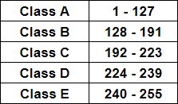
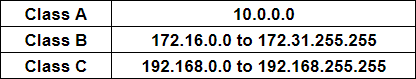

# [Networking](https://tryhackme.com/room/bpnetworking)

## Kinda like a street address, just cooler

- IP Address Classes (**NOTE**: if you look on the first terms of the ranges, the difference between two consecutive ones is 2^7-1, then 2^6, 2^5 and 2^4)

- Private Address Space:

- The first address of a subnet is the Network address, while the last one is the Broadcast.

### Questions

1. How many categories of IPv4 addresses are there?

A: 5

2. Which type is for research? *Looking for a letter rather than a number here*

A: E

3. How many private address ranges are there?

A: 3

4. Which private range is typically used by businesses?

A: A

5. There are two common default private ranges for home routers, what is the first one?

A: 192.168.0.0

6. How about the second common private home range?

A: 192.168.1.0

7. How many addresses make up a typical class C range? Specifically a /24 

A: 256

8. Of these addresses two are reserved, what is the first addresses typically reserved as?

A: network

9. The very last address in a range is typically reserved as what address type?

A: broadcast

10. A third predominant address type is typically reserved for the router, what is the name of this address type?

A: gateway

11. Which address is reserved for testing on individual computers? (Hint: This is sometimes reffered to as the *loopback address*)

A: 127.0.0.1

12. A particularly unique address is reserved for unroutable packets, what is that address? This can also refer to all IPv4 addresses on the local machine. (Hint: This is *typically seen within the context of servers*, it's before the A range.)

A: 0.0.0.0 (the *default route*)

## Binary to Decimal

- an IP address consists of 32 bits (8 bytes) split up into 4 sections

### Questions

1. 1001 0010

A: 146

2. 0111 0111

A: 119

3. 1111 1111

A: 255

4. 1100 0101

A: 197

5. 1111 0110

A: 246

6. 0001 0011

A: 19

7. 1000 0001

A: 129

8. 0011 0001

A: 39

9. 0111 1000

A: 120

10. 1111 0000

A: 240

11. 0011 1011

A: 59

12. 0000 0111

A: 7

## Decimal to Binary

### Questions

1. 238

A: 11101110

2. 34

A: 00100010
 
3. 123

A: 01111011
 
4. 50

A: 00110010

5. 255

A: 11111111

6. 200

A: 11000100

7. 10

A: 00001010

8. 138

A: 10001010

9. 1

A: 00000001

10. 13

A: 00001101

11. 250

A: 11111010

12. 114

A: 01110010

## Address Class Identification

### Questions

1. 10.240.1.1

A: A 

2. 150.10.15.0

A: B

3. 192.14.2.0

A: C

4. 148.17.9.1

A: B

5. 193.42.1.1

A: C

6. 126.8.156.0

A: A

7. 220.200.23.1

A: C

8. 230.230.45.58

A: D

9. 177.100.18.4

A: B

10. 119.18.45.0

A: A

11. 117.89.56.45

A: A

12. 215.45.45.0

A: C