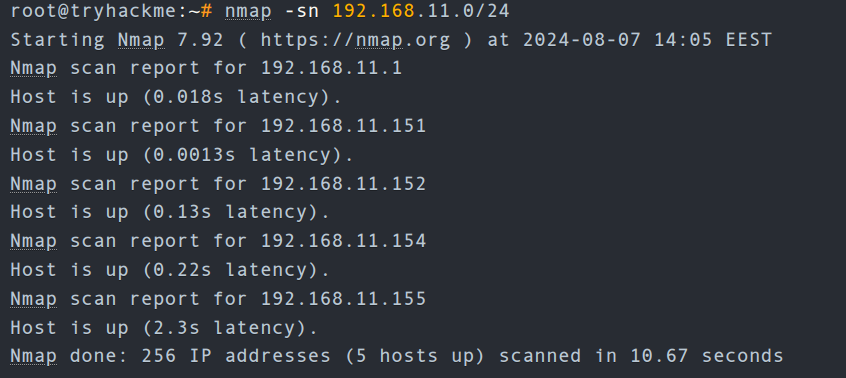
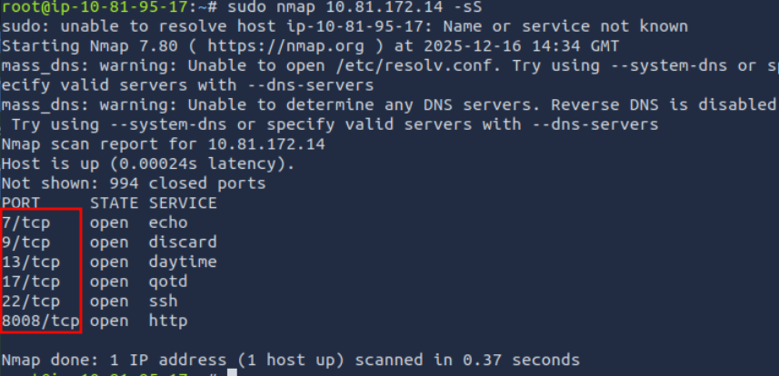
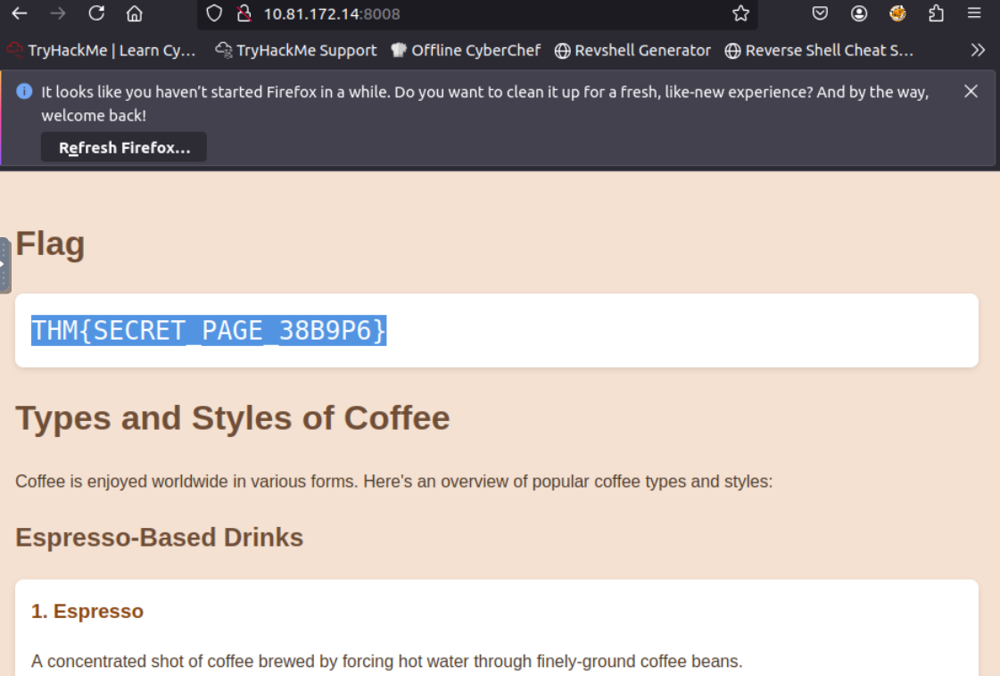
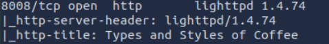

# [Nmap - The Basics](https://tryhackme.com/room/nmap)

## Host Discovery: Who Is Online

Imagine the scenario where you are connected to a network and using various network resources, such as email and web browsing. Two questions arise. The first is how we can discover other live devices on this network or on other networks. The second is how we can find out the network services running on these live devices; examples include SSH and web servers.

One approach is to do it manually. If asked to uncover which devices are live on the `192.168.0.1/24` network, one can use basic tools such as `ping`, `arp-scan`, or some other tool to check the 254 IP addresses. Although this network has 256 IP addresses, we counted 254 IP addresses because two are reserved. Each tool has its limitations. For example, `ping` won’t give any information if the target system’s firewall blocks ICMP traffic. Moreover, `arp-scan` only works if your device is connected to the same network, i.e., over Ethernet or WiFi. In brief, this will be a significant waste of time without an advanced and reliable tool. With the right tools and enough time, one would have a list of the live hosts on a target network. We need a flexible tool that can handle the various scenarios.

Discovering the running services on a specific host is equally time-consuming if one relies on manual solutions or inefficient scripts. For instance, one can use `telnet` to try one port after the other; however, with thousands of ports to scan, this can be a very time-consuming task, even if a script was created to automate the `telnet` connection attempts.

A very efficient solution that can solve the above two requirements and many more is the [Nmap](https://nmap.org/) network scanner. Nmap is an open-source network scanner that was first published in 1997. Since then, plenty of features and options have been added. It is a powerful and flexible network scanner that can be adapted to various scenarios and setups.

Before we start, we should mention that Nmap uses multiple ways to specify its targets:

- IP range using `-`: If you want to scan all the IP addresses from 192.168.0.1 to 192.168.0.10, you can write `192.168.0.1-10`
- IP subnet using `/`: If you want to scan a subnet, you can express it as `192.168.0.1/24`, and this would be equivalent to `192.168.0.0-255`
- Hostname: You can also specify your target by hostname, for example, `example.thm`

Let’s say you want to discover the online hosts on a network. Nmap offers the `-sn` option, i.e., ping scan. However, don’t expect this to be limited like `ping`.

### Scanning a “Local” Network

In this context, we use the term “local” to refer to the network we are directly connected to, such as an Ethernet or WiFi network. In the first demonstration, we will scan the WiFi network to which we are connected. Our IP address is `192.168.66.89`, and we are scanning the `192.168.66.0/24` network. The `nmap -sn 192.168.66.0/24` command

Because we are scanning the local network, where we are connected via Ethernet or WiFi, we can look up the MAC addresses of the devices. Consequently, we can figure out the network card vendors, which is beneficial information as it can help us guess the type of target device(s).

When scanning a directly connected network, Nmap starts by sending [ARP](arp.md) requests. When a device responds to the ARP request, Nmap labels it with “Host is up”.

### Scanning a “Remote” Network

Consider the case of a “remote” network. In this context, “remote” means that at least one router separates our system from this network. As a result, all our traffic to the target systems must go through one or more routers. Unlike scanning a local network, we cannot send an ARP request to the target.

Our system has the IP address `192.168.66.89` and belongs to the `192.168.66.0/24` network. In the terminal below we scan the target network `192.168.11.0/24` where there are two or more routers (hops) separate our local system from the target hosts.

- `192.168.11.1` is live and responded to the ICMP echo (ping) request.
- `192.168.11.2` seems down. Nmap sent two ICMP echo (ping) requests, two ICMP timestamp requests, two TCP packets to port 443 with the SYN flag set, and two TCP packets to port 80 with the ACK flag set. The target didn’t respond to any. We observe several ICMP destination unreachable packets from the `192.168.11.151` router.

It is worth noting that we can have more control over how Nmap discovers live hosts such as `-PS[portlist]`, `-PA[portlist]`, `-PU[portlist]` for TCP SYN, TCP ACK, and UDP discovery via the given ports.

As a final point, Nmap offers a list scan with the option `-sL`. This scan only lists the targets to scan without actually scanning them. For example, `nmap -sL 192.168.0.1/24` will list the 256 targets that will be scanned. This option helps confirm the targets before running the actual scan.

### Questions

Q: What is the last IP address that will be scanned when your scan target is `192.168.0.1/27`?

A: `192.168.0.31`

## Port Scanning: Who Is Listening

we want to discover the network services listening on these live hosts. By network service, we mean any process that is listening for incoming connections on a TCP or UDP port. Common network services include web servers, which usually listen on TCP ports 80 and 443, and DNS servers, which typically listen on UDP (and TCP) port 53.

By design, TCP has 65,535 ports, and the same applies to UDP. How can we determine which ports have a service bound to it?

### Scanning TCP Ports

The easiest and most basic way to know whether a TCP port is open would be to attempt to `telnet` to the port. If you are inclined to scan with a Telnet client, try to establish a TCP connection with every target port. In other words, you attempt to complete the TCP three-way handshake with every target port; however, only open TCP ports would respond appropriately and allow a TCP connection to be established. This procedure is not very different from Nmap’s connect scan.

#### Connect Scan

The connect scan can be triggered using `-sT`. It tries to complete the TCP three-way handshake with every target TCP port. If the TCP port turns out to be open and Nmap connects successfully, Nmap will tear down the established connection.

In the screenshot below, our scanning machine has the IP address `192.168.124.148` and the target system has TCP port 22 open and port 23 closed. In the part marked with 1, you can see how the TCP three-way handshake was completed and later torn down with a TCP RST-ACK packet by Nmap. The part marked with 2 shows a connection attempt to a closed port, and the target system responded with a TCP RST-ACK packet.

  

#### SYN Scan (Stealth)  

Unlike the connect scan, which tries to **connect** to the target TCP port, i.e., complete a three-way handshake, the SYN scan only executes the first step: it sends a TCP SYN packet. Consequently, the TCP three-way handshake is never completed. The advantage is that this is expected to lead to fewer logs as the connection is never established, and hence, it is considered a relatively stealthy scan. You can select the SYN scan using the `-sS` flag.

In the screenshot below, we scan the same system with port 22 open. The part marked with 1 shows the listening service replying with a TCP SYN-ACK packet. However, Nmap responded with a TCP RST packet instead of completing the TCP three-way handshake. The part marked with 2 shows a TCP connection attempt to a closed port. In this case, the packet exchange is the same as in the connect scan.

  

### Scanning UDP Ports

Although most services use TCP for communication, many use UDP. Examples include DNS, DHCP, NTP (Network Time Protocol), SNMP (Simple Network Management Protocol), and VoIP (Voice over IP). UDP does not require establishing a connection and tearing it down afterwards. Furthermore, it is very suitable for real-time communication, such as live broadcasts. All these are reasons to consider scanning for and discovering services listening on UDP ports.

Nmap offers the option `-sU` to scan for UDP services. Because UDP is simpler than TCP, we expect the traffic to differ. The screenshot below shows several ICMP destination unreachable (port unreachable) responses as Nmap sends UDP packets to closed UDP ports.

  

### Limiting the Target Ports

Nmap scans the most common 1,000 ports by default. However, this might not be what you are looking for. Therefore, Nmap offers you a few more options.

- `-F` is for Fast mode, which scans the 100 most common ports (instead of the default 1000).
- `-p[range]` allows you to specify a range of ports to scan. For example, `-p10-1024` scans from port 10 to port 1024, while `-p-25` will scan all the ports between 1 and 25. Note that `-p-` scans all the ports and is equivalent to `-p1-65535` and is the best option if you want to be as thorough as possible.

### Summary

|Option|Explanation|
|---|---|
|`-sT`|TCP connect scan – complete three-way handshake|
|`-sS`|TCP SYN – only first step of the three-way handshake|
|`-sU`|UDP scan|
|`-F`|Fast mode – scans the 100 most common ports|
|`-p[range]`|Specifies a range of port numbers – `-p-` scans all the ports|

### Questions

Q: How many TCP ports are open on the target system at `MACHINE_IP`?

A: `6`

Q: Find the listening web server on `MACHINE_IP` and access it with your browser. What is the flag that appears on its main page?

Access the http server on port 8008.

A: ` THM{SECRET_PAGE_38B9P6} `

## Version Detection: Extract More Information

### OS Detection

You can enable OS detection by adding the `-O` option. As the name implies, the OS detection option triggers Nmap to rely on various indicators to make an educated guess about the target OS. In this case, it is detecting the target has Linux 4.x or 5.x running. That’s actually true. However, there is no perfectly accurate OS detector. The statement that it is between 4.15 and 5.8 is very close as the target host’s OS is 5.15.

### Service and Version Detection

You discovered several open ports and want to know what services are listening on them. `-sV` enables version detection. This is very convenient for gathering more information about your target with fewer keystrokes.

What if you can have both `-O`, `-sV` and some more in one option? That would be `-A`. This option enables OS detection, version scanning, and traceroute, among other things.

### Forcing the Scan

When we run our port scan, such as using `-sS`, there is a possibility that the target host does not reply during the host discovery phase (e.g. a host doesn’t reply to ICMP requests). Consequently, Nmap will mark this host as down and won’t launch a port scan against it. We can ask Nmap to treat all hosts as online and port scan every host, including those that didn’t respond during the host discovery phase. This choice can be triggered by adding the `-Pn` option.

### Summary

|Option|Explanation|
|---|---|
|`-O`|OS detection|
|`-sV`|Service and version detection|
|`-A`|OS detection, version detection, and other additions|
|`-Pn`|Scan hosts that appear to be down|

### Questions

Q: What is the name and detected version of the web server running on `MACHINE_IP`?

Add the flag `-sV` for service detection.

A: `lighttpd 1.4.74`

## Timing: How Fast is Fast

Nmap provides various options to control the scan speed and timing.

Running your scan at its normal speed might trigger an IDS or other security solutions. It is reasonable to control how fast a scan should go. Nmap gives you six timing templates, and the names say it all: paranoid (0), sneaky (1), polite (2), normal (3), aggressive (4), and insane (5). You can pick the timing template by its name or number. For example, you can add `-T0` (or `-T 0`) or `-T paranoid` to opt for the slowest timing.

In the Nmap scans below, we launch a SYN scan targeting the 100 most common TCP ports, `nmap -sS 10.81.172.14 -F`. We repeated the scan with different timings: T0, T1, T2, T3, and T4. In our lab setup, Nmap took different amounts of time to scan the 100 ports. The table below should give you an idea, but you will get different results depending on the network setup and target system.

|Timing|Total Duration|
|---|---|
|T0 (paranoid)|9.8 hours|
|T1 (sneaky)|27.53 minutes|
|T2 (polite)|40.56 seconds|
|T3 (normal)|0.15 seconds|
|T4 (aggressive)|0.13 seconds|

In the following screenshots, we can see the time when Nmap sent the different packets. In this screenshot below, with the scan timing being `T0`, we can see that Nmap waited 5 minutes before moving to the next port.

  

In the screenshot below, Nmap waited 15 seconds between every two ports when we set the timing to `T1`.

  

Then, the waiting dropped to 0.4 seconds for `T2` as shown below.

  

Finally, in the default case, `T3`, Nmap appeared to be running as fast as it could, as shown below. It is worth repeating that this would look different on a different lab setup. However, in this particular case, Nmap considered the connection to the target to be fast and reliable, as no packet loss was incurred.

  

A second helpful option is the number of parallel service probes. The number of parallel probes can be controlled with `--min-parallelism <numprobes>` and `--max-parallelism <numprobes>`. These options can be used to set a minimum and maximum on the number of TCP and UDP port probes active simultaneously for a host group. By default, `nmap` will automatically control the number of parallel probes. If the network is performing poorly, i.e., dropping packets, the number of parallel probes might fall to one; furthermore, if the network performs flawlessly, the number of parallel probes can reach several hundred.

A similar helpful option is the `--min-rate <number>` and `--max-rate <number>`. As the names indicate, they can control the minimum and maximum rates at which `nmap` sends packets. The rate is provided as the _number of packets per second_. It is worth mentioning that the specified rate applies to the whole scan and not to a single host.

The last option we will cover in this task is `--host-timeout <time>`. This option specifies the maximum time you are willing to wait, and it is suitable for slow hosts or hosts with slow network connections.

|Option|Explanation|
|---|---|
|`-T<0-5>`|Timing template – paranoid (0), sneaky (1), polite (2), normal (3), aggressive (4), and insane (5)|
|`--min-parallelism <numprobes>` and `--max-parallelism <numprobes>`|Minimum and maximum number of parallel probes|
|`--min-rate <number>` and `--max-rate <number>`|Minimum and maximum rate (packets/second)|
|`--host-timeout`|Maximum amount of time to wait for a target host|

### Questions

Q: What is the non-numeric equivalent of `-T4`?

A: `-T aggressive`

## Output: Controlling What You See

In some cases, the scan takes a very long time to finish or to produce any output that will be displayed on the screen. Furthermore, sometimes you might be interested in more real-time information about the scan progress. The best way to get more updates about what’s happening is to enable verbose output by adding `-v`.

Most likely, the `-v` option is more than enough for verbose output; however, if you are still unsatisfied, you can increase the verbosity level by adding another “v” such as `-vv` or even `-vvvv`. You can also specify the verbosity level directly, for example, `-v2` and `-v4`. You can even increase the verbosity level by pressing “v” after the scan already started.  

If all this verbosity does not satisfy your needs, you must consider the `-d` for debugging-level output. Similarly, you can increase the debugging level by adding one or more “d” or by specifying the debugging level directly. The maximum level is `-d9`; before choosing that, make sure you are ready for thousands of information and debugging lines.

### Saving Scan Report

In many cases, we would need to save the scan results. Nmap gives us various formats. The three most useful are normal (human-friendly) output, XML output, and grepable output, in reference to the `grep` command. You can select the scan report format as follows:

- `-oN <filename>` - Normal output
- `-oX <filename>` - XML output
- `-oG <filename>` - `grep`-able output (useful for `grep` and `awk`)
- `-oA <basename>` - Output in all major formats

### Questions

Q: What option must you add to your `nmap` command to enable debugging?

A: `-d`

## Summary

It is worth noting that it is best to run Nmap with `sudo` privileges so that we can make use of all its features. Running Nmap with local user privileges will still work; however, you should expect many features to be unavailable. You get a minimal portion of Nmap’s power when running it as a local user. For instance, Nmap would automatically use SYN scan (`-sS`) if you are running it with `sudo` privileges and will default to connect scan (`-sT`) if run as a local user. The reason is that crafting certain packets, such as sending a TCP SYN packet, requires root privileges.

|Option|Explanation|
|---|---|
|`-sL`|List scan – list targets without scanning|
|**_Host Discovery_**||
|`-sn`|Ping scan – host discovery only|
|**_Port Scanning_**||
|`-sT`|TCP connect scan – complete three-way handshake|
|`-sS`|TCP SYN – only first step of the three-way handshake|
|`-sU`|UDP Scan|
|`-F`|Fast mode – scans the 100 most common ports|
|`-p[range]`|Specifies a range of port numbers – `-p-` scans all the ports|
|`-Pn`|Treat all hosts as online – scan hosts that appear to be down|
|**_Service Detection_**||
|`-O`|OS detection|
|`-sV`|Service version detection|
|`-A`|OS detection, version detection, and other additions|
|**_Timing_**||
|`-T<0-5>`|Timing template – paranoid (0), sneaky (1), polite (2), normal (3), aggressive (4), and insane (5)|
|`--min-parallelism <numprobes>` and `--max-parallelism <numprobes>`|Minimum and maximum number of parallel probes|
|`--min-rate <number>` and `--max-rate <number>`|Minimum and maximum rate (packets/second)|
|`--host-timeout`|Maximum amount of time to wait for a target host|
|**_Real-time output_**||
|`-v`|Verbosity level – for example, `-vv` and `-v4`|
|`-d`|Debugging level – for example `-d` and `-d9`|
|**_Report_**||
|`-oN <filename>`|Normal output|
|`-oX <filename>`|XML output|
|`-oG <filename>`|`grep`-able output|
|`-oA <basename>`|Output in all major formats|