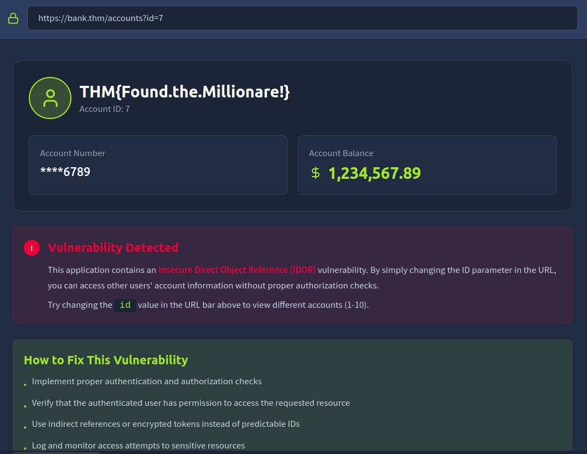
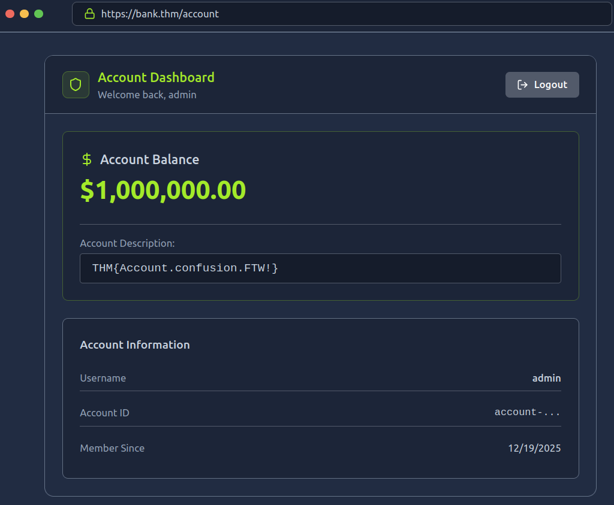
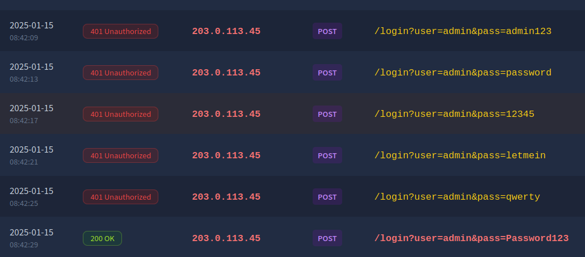

# [OWASP Top 10 2025 - IAAA Failures](https://tryhackme.com/room/owasptopten2025one)

## What is IAAA?

IAAA is a simple way to think about how users and their actions are verified on applications. Each item plays a crucial role and it isn't possible to skip a level. That means, if a previous item isn't being performed, you cannot perform the later times. The four items are:

- **Identity** - the unique account (e.g., user ID/email) that represents a person or service.
- **Authentication** - proving that identity (passwords, OTP, passkeys).
- **Authorisation** - what that identity is allowed to do.
- **Accountability** - recording and alerting on who did what, when, and from where.

### Questions

Q: What does IAAA stand for?

A: `Identity, Authentication, Authorization, Accountability`

## A01: Broken Access Control

Broken Access Control happens when the server doesn’t properly enforce **who can access what** on every request. A common occurence of this is **IDOR** (Insecure Direct Object Reference): if changing an ID (like `?id=7 → ?id=6`) lets you see or edit someone else’s data, access control is broken.

In practice this shows up as horizontal privilege escalation (same role, other user’s stuff) or vertical privilege escalation (jumping to admin-only actions) because the application trusts the client too much.

### Questions

Q: If you don't get access to more roles but can view the data of another users, what type of privilege escalation is this?

A: `horizontal`

Q: What is the note you found when viewing the user's account who had more than $ 1 million?

A: `THM{Found.the.Millionare!}`

## A07: Authentication Failures

Authentication Failures happen when an application can’t reliably verify or bind a user’s identity. Common issues include:

- username enumeration
- weak/guessable passwords (no lockout/rate limits)
- logic flaws in the login/registration flow
- insecure session or cookie handling

If any of these are present, an attacker can often log in as someone else or bind a session to the wrong account.

### Questions

Q: What is the flag on the `admin` user's dashboard?

A: `THM{Account.confusion.FTW!}`

## A09: Logging & Alerting Failures

When applications don’t record or alert on security-relevant events, defenders can’t detect or investigate attacks. Good logging underpins **accountability** (being able to prove who did what, when, and from where). In practice, failures look like missing authentication events, vague error logs, no alerting on brute-force or privilege changes, short retention, or logs stored where attackers can tamper with them.

### Questions

Q: It looks like an attacker tried to perform a brute-force attack, what is the IP of the attacker?

A:  `203.0.113.45`

Q: Looks like they were able to gain access to an account! What is the username associated with that account?

A: `admin`

Q: What action did the attacker try to do with the account? List the endpoint the accessed.

A: `/supersecretadminstuff`

The big ideas to keep:

- **A01 Broken Access Control:** Enforce server-side checks on **every** request
- **A07 Authentication Failures:** Enforce unique indexes on the canonical form, rate-limit/lock out brute force, and rotate sessions on password/privilege changes.
- **A09 Logging & Alerting Failures:** Log the full auth lifecycle (fail/success, password/2FA/role changes, admin actions), centralise logs off-host with retention, and alert on anomalies (e.g., brute-force bursts, privilege elevation).
