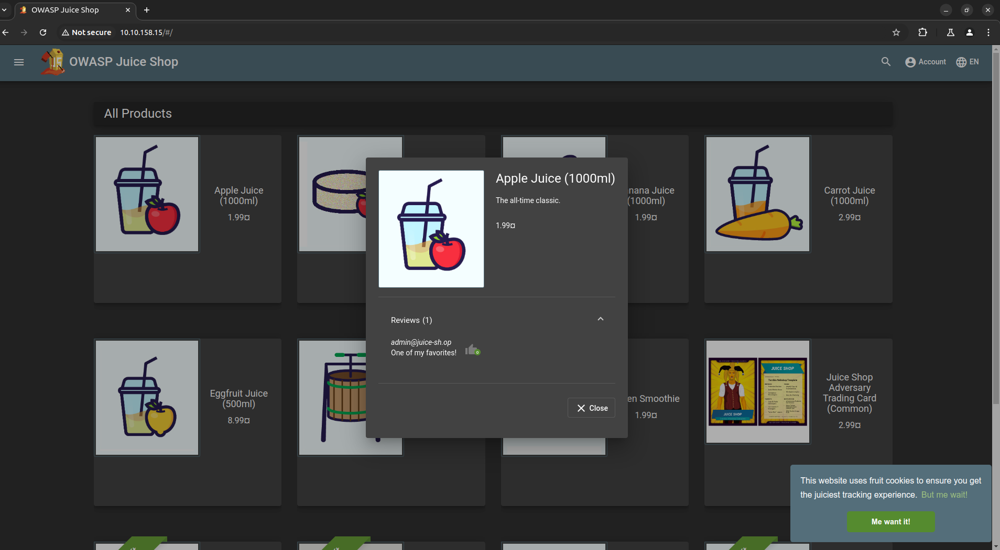
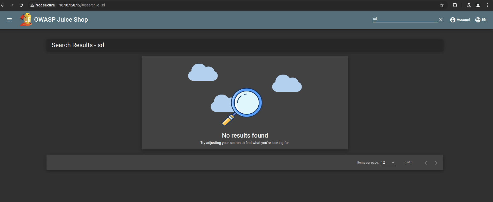
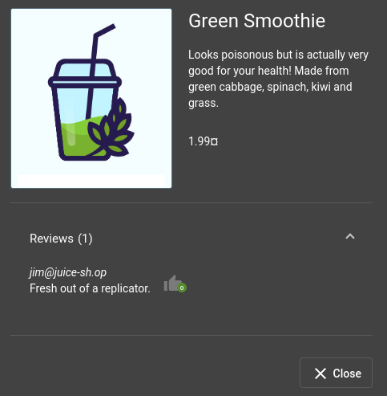
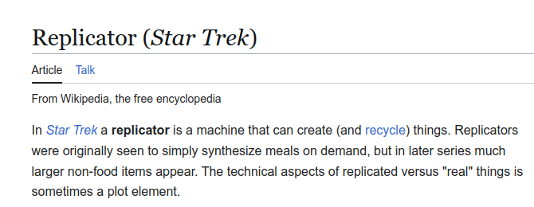
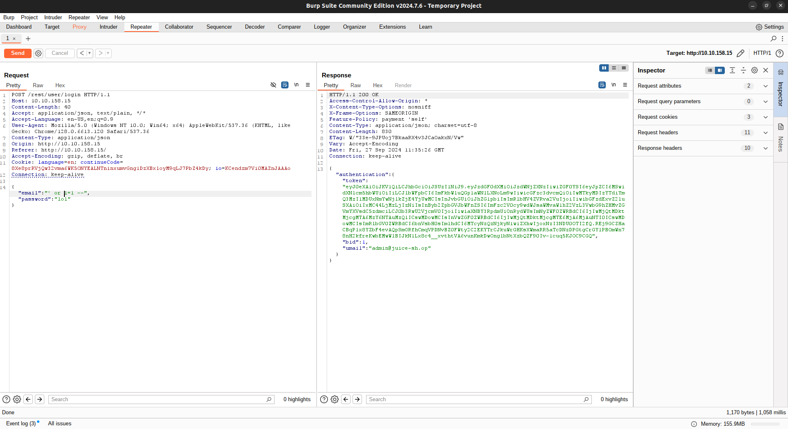

# OWASP Juice Shop

## Let's go on an adventure!

### Questions

 What's the Administrator's email address?

	`A: admin@juice-sh.op`

What parameter is used for searching?

	`A:q `

 What show does Jim reference in his review?

`A: Star Trek`

## Inject the juice

-  Injection vulnerabilities are quite dangerous to a company as they can potentially cause downtime and/or loss of data. 
- Identifying injection points within a web application is usually quite simple, as most of them will return an error. 
- There are many types of injection attacks:

| Vulnerability      | Description                                                                                                                                         |
|--------------------|-----------------------------------------------------------------------------------------------------------------------------------------------------|
| SQL Injection      | SQL Injection is when an attacker enters a malicious or malformed query to either retrieve or tamper with data from a database. In some cases, they can log into accounts.  |
| Command Injection  | Command Injection occurs when web applications take input or user-controlled data and run them as system commands. An attacker may tamper with this data to execute their own commands. This is often seen in misconfigured applications, such as those performing ping tests. |
| Email Injection    | Email injection is a security vulnerability that allows malicious users to send unauthorized emails by exploiting email input fields. Attackers can add extra data to fields not interpreted correctly by the server. |

### Questions

Log into the administrator account!

- Intercept the request and change the email to `' or 1=1--`
- It will log you in as admin

	`A:`

 Log into the Bender account!

	`A:`